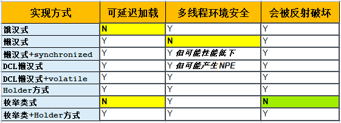

# 一、什么时候使用单例模式？
单例模式可谓是23种设计模式中最简单、最常见的设计模式了，它可以保证一个类只有一个实例。我们平时网购时用的购物车，就是单例模式的一个例子。想一想，如果购物车不是单例的，会发生什么？

**数据不一致**：用户在不同页面看到的购物车内容可能不同。用户在一个页面加了商品，可能换到另一个页面就看不到了、或者看到的商品不对。这会让用户感到困惑和不满。

**购物车状态丢失**：用户在不同服务器上访问的购物车实例可能不同。用户在一个页面加了商品，如果下一个请求被转到另一个服务器，那么之前加的商品就没了。这可能导致用户重新选购，那实在是太麻烦了。

**资源浪费**：购物车需要加载和处理一些数据，假如用户每次访问页面都创建一个新的购物车实例，这样就会占用更多的资源，并且、频繁地创建和销毁购物车实例，也会增加系统的负担和响应时间。
所以，用单例模式来做购物车可以避免以上问题，并提供更好的用户体验。购物车作为一个共享的对象，把用户选的商品信息保存在一个唯一的实例中，可以在整个用户会话中访问和更新，这样可以保证购物车中的数据是正确、完整和一致的。这其实也和我们生活中，在超市里使用购物小推车或购物篮是一样的。

Spring是Java开发中常用的框架，它里面也有很多单例模式的应用：

**ApplicationContext：** Spring的核心类之一，负责管理和配置应用程序的Bean。ApplicationContext是单例模式的实例，保证整个应用程序中只有一个ApplicationContext。

**Bean对象**：在Spring中，通过配置文件或注解方式定义的Bean对象通常也是单例的，默认情况下，Spring会把它们当作单例来管理。这意味着在应用程序中任何地方，通过Spring注入或获取Bean对象时，都是同一个实例。

**缓存对象**：在Spring中，可以使用缓存注解来实现方法级的缓存策略。这些缓存对象通常也是单例模式的实例，保证在多个方法调用中共享和管理缓存数据。

**事务管理器**：Spring的事务管理器通常也是单例模式的实例。事务管理器用于处理数据库事务，并保证整个应用程序中保持事务的一致性。

**AOP切面**：Spring的AOP（面向切面编程）通常也使用单例模式来管理切面。切面用于实现横切关注点的模块化，并可以在多个对象和方法中应用。通过使用单例模式，Spring可以保证在整个应用程序中共享和管理切面对象。
单例模式是关于对象创建的设计模式，当我们需要某个类在整个系统运行期间有且只有一个实例，就可以考虑使用单例模式。
# **Java实现单例模式的几种方式**
## 饿汉式
```java
public final class Hungry { // final 不允许被继承

    // 在类初始化过程中收入<clinit>()方法中，该方法能100%保证同步；final 保证不被改变
    private static final Hungry instance = new Hungry();

    private Hungry() {
    }

    public static Hungry getInstance() {
        return instance;
    }

}
```
“饿汉式”是一种最简单直接的实现方式，它的好处是在多线程环境下应用时是安全的
缺点：当我们还没有使用它时，它就已经被实例化了，这就会造成资源浪费；由此，产生了“懒汉式”实现方式，它在我们第1次使用时才进行实例化

## 懒汉式
```java
public final class Lazy { // final 不允许被继承
    private static Lazy instance;
    
    private Lazy() {}
    
    public static Lazy getInstance() {
        if (instance == null) {
            instance = new Lazy();
        }
        return instance;
    }
}
```
但是，上面这样的“饿汉式”代码在多线程环境下是**不安全**的、并且同样也会被反射破坏。
要将它改为线程安全的，有以下2种方法：
方法1，为 getInstance 方法加上 **synchronized**关键字：

```java
public static synchronized Lazy getInstance() {
    if (instance == null) {
        instance = new Lazy();
    }
    return instance;
}
```
方法2，通过**双重检查锁**
需要注意的是，双重检查锁方式在多线程环境下可能会产生NPE，因为new Lazy()并非原子操作，它将经历：1-分配内存空间，2-执行构造函数创建对象，3-对象指向空间这几个步骤，而步骤2、3可能会被重排序从而引发NPE。

```java
private volatile static Lazy instance;// 用于解决NPE

public static Lazy getInstance() {
    if (instance == null) {
        synchronized (Lazy.class) {
        if (instance == null) {
            instance = new Lazy();
        }
        }
    }
    return instance;
}
```
## **静态内部类**
```java
public final class Holder {
    private Holder() {
    }
    /**
    * 调用getInstance实际上是获得InnerHolder的instance静态属性
    */
    public static Holder getInstance() {
        return InnerHolder.instance;
    }
    private static class InnerHolder {
        private static Holder instance = new Holder();
    }
}
```
静态内部类方式是线程安全的，但它仍然逃不过被反射破坏的命运。
## 枚举类
不会被反射破坏的实现方式
```java
public enum EnumSingleton implements Serializable {
    INSTANCE;
    EnumSingleton() {
    }
    public static EnumSingleton getInstance() {
        return INSTANCE;
    }
}
```
## 静态内部类+枚举类
```java
public final class HolderEnum {
    private HolderEnum() {
    }
    public static HolderEnum getInstance() {
        return Holder.INSTANCE.getInstance();
    }
    // 使用枚举类充当holder
    private enum Holder {
        INSTANCE;
        private HolderEnum instance;
        Holder() {
            this.instance = new HolderEnum();
        }
        private HolderEnum getInstance() {
            return instance;
        }
    }
}
```
这种实现方式可以延迟加载、在多线程环境下安全、但却还是逃不过“反射”这个破坏王。

综上，Java实现单例模式的几种方法各有优缺点，以下是它们的对比小结：


