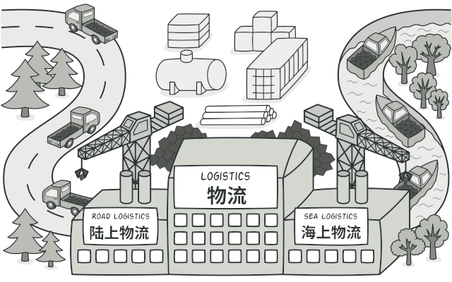
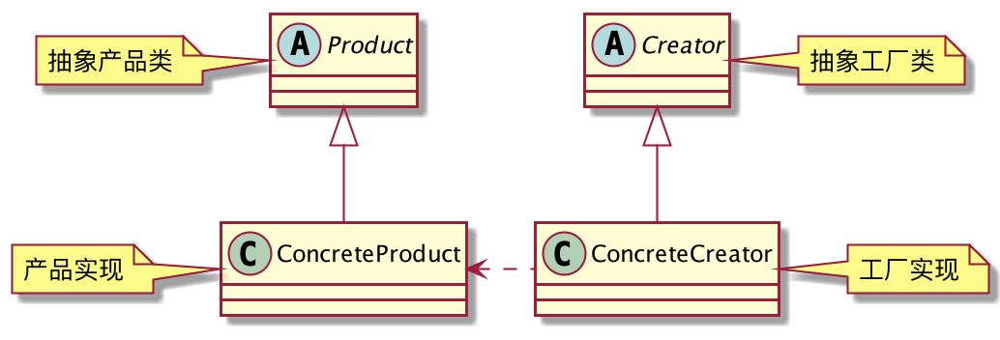

## 1. 日志工厂

一个软件，不管是本地开发调试，还是线上生产运行，日志的收集都是非常重要的。如何设计一个灵活的日志系统呢？

将日志的功能抽象出来，封装成接口：

```java
public interface Logger {
	// 调试信息
	void debug(String message);
	// 错误信息
	void error(String message);
}
```
每个日志记录器都应该有自己的名称，不然你怎么知道是谁输出的日志呢？
```java
public abstract class AbstractLogger implements Logger {
	protected String name;// 日志记录器名称
	public AbstractLogger(String name) {
		this.name = name;
	}
}
```
本地开发调试，只需要将日志输出到控制台就好了，无需持久化存储。
```java
public class ConsoleLogger extends AbstractLogger {
	public ConsoleLogger(String name) {
		super(name);
	}
	@Override
	public void debug(String message) {
		System.out.println(name + " -- " + message);
	}
	@Override
	public void error(String message) {
		System.err.println(name + " -- " + message);
	}
}
```
线上环境，没人会盯着日志去看，所以需要将日志写入磁盘文件，后面排查错误时你就知道它的重要性了。
```java
public class FileLogger extends AbstractLogger{
	private File debugLogFile = new File(System.getProperty("user.dir"), "logs/debug.log");
	private File errorLogFile = new File(System.getProperty("user.dir"), "logs/error.log");
	public FileLogger(String name) {
		super(name);
	}
	@Override
	public void debug(String message) {
		FileUtil.appendUtf8String(name + " -- " + message, debugLogFile);
	}
	@Override
	public void error(String message) {
		FileUtil.appendUtf8String(name + " -- " + message, errorLogFile);
	}
}
```
日志的两种实现都有了，分别是控制台输出和写入磁盘文件。

那么，如何生成Logger实例呢？手动new吗？

你怎么知道我需要哪种实现？万一后面又增加了新的需求，需要将日志写入ElasticSearch作离线分析呢？你又要怎么做？

**客户端只依赖日志接口，具体Logger实例的创建交给工厂吧。**

定义日志工厂接口：

```java
public interface LoggerFactory {
	// 获取日志记录器
	Logger getLogger(String name);
}
```
专门生产控制台日志的工厂：
```java
public class ConsoleLoggerFactory implements LoggerFactory {
	@Override
	public Logger getLogger(String name) {
		return new ConsoleLogger(name);
	}
}
```
专门生产文件日志的工厂：
```java
public class FileLoggerFactory implements LoggerFactory{
	@Override
	public Logger getLogger(String name) {
		return new FileLogger(name);
	}
}
```
客户端调用：
```java
public class Client {
	public static void main(String[] args) {
		LoggerFactory factory = new FileLoggerFactory();
		Logger logger = factory.getLogger(Client.class.getName());
		logger.error("哈哈");
	}
}
```
后面如果加了新的日志实现，只需要再扩展一个工厂类就好了。

这就是工厂方法模式。

## 2. 工厂方法模式的定义
> 定义一个用于创建对象的接口，让子类决定实例化哪一个类。工厂方法使一个类的实例化延迟到其子类。



**工厂方法模式通用类图**

- Product：产品的抽象类或接口，负责定义产品的特征和共性。
- ConcreteProduct：具体的产品类。
- Creator：产品的创建类，工厂接口。
- ConcreteCreator：具体的创建类，工厂实现。
## 3. 工厂方法模式的优点
工厂方法模式，封装了对象创建的过程，对外屏蔽了复杂对象的创建细节，而且降低了类间的耦合。客户端只依赖产品的抽象，无需知道产品实现，让产品工厂来完成对象的创建。

1. 客户端使用简单，无需知道复杂对象的创建过程。
2. 工厂可以控制对象的创建数量，避免内存溢出，还可以复用对象，避免频繁创建和销毁。
3. 工厂可以提前创建好一批对象，以便快速响应客户端。
4. 降低耦合，客户端只依赖产品抽象，符合依赖倒置原则。
5. 客户端不关心具体实现类，只关心工厂，符合迪米特法则。
6. 扩展的产品子类可随时替换父类，符合里氏替换原则。

工厂方法模式是`new`关键字的替代品，它提供了创建对象的一种绝佳的方式，任何需要创建对象的地方都可以考虑使用该模式。缺点是需要增加工厂类，代码复杂度会提高，需要结合实际情况考虑。
## 4. 工厂方法模式的扩展
### 4.1 降级为简单工厂
如果一个模块很简单，只需要一个工厂类，就可以降级为简单工厂，使用静态方法来创建对象。
```java
public class SimpleFactory {
	/**
	 * 优点:实现简单
	 * 缺点:增加一个产品类型就要修改工厂,不符合开闭原则、static无法定义层级结构
	 */
	public static Product create(ProductType type) {
		switch (type){
			case A:
				return new ProductA();
			case B:
				return new ProductB();
			default:
				return null;
		}
	}
}
```
### 4.2 替代单例模式
单例模式本身既要负责业务逻辑，又要保证单例，不符合单一职责原则，可以使用工厂模式来替代单例模式，由工厂类来保证单例，而不是单例类本身。
```java
class Singleton{
	private Singleton(){}
}
class SingletonFactory{
	private static Singleton INSTANCE;
	static {
		try {
			Constructor<Singleton> constructor = Singleton.class.getDeclaredConstructor();
			constructor.setAccessible(true);
			INSTANCE = constructor.newInstance();
		} catch (Exception e) {
			e.printStackTrace();
		}
	}
	
	public static Singleton getInstance(){
		return INSTANCE;
	}
}
```
### 4.3 对象复用
对于可以复用的对象，工厂类可以将实例缓存起来，避免频繁的创建和销毁。这在很大程度上可以降低系统的性能开销，减轻GC的压力。
```java
class ProductFactory {
	private static final Map<ProductType, Product> CACHE = new ConcurrentHashMap<>();
	public static Product getProduct(ProductType productType) {
		if (!CACHE.containsKey(productType)) {
			synchronized (ProductFactory.class) {
				if (!CACHE.containsKey(productType)) { // recheck
					switch (productType) {
						case A:
							CACHE.put(productType, new ProductA());
							break;
						case B:
							CACHE.put(productType, new ProductB());
							break;
					}
				}
			}
		}
		return CACHE.get(productType);
	}
}
```
## 5. 总结
工厂方法模式在项目中使用的非常频繁，很多开源框架都能看到它的影子，它提供了对象创建的一种绝佳方式，凡是需要创建对象的地方，都可以考虑使用工厂方法模式。
