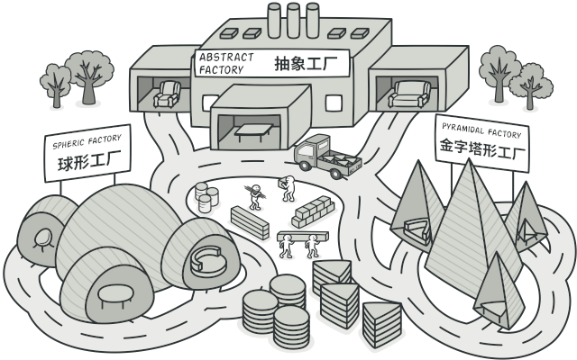
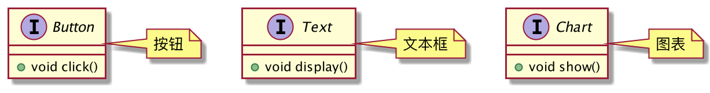
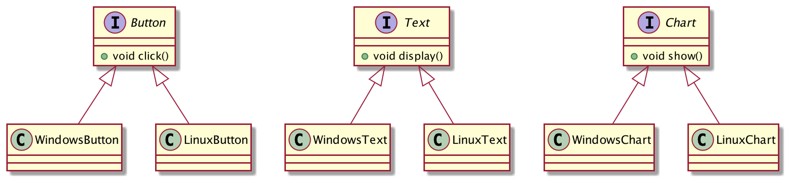
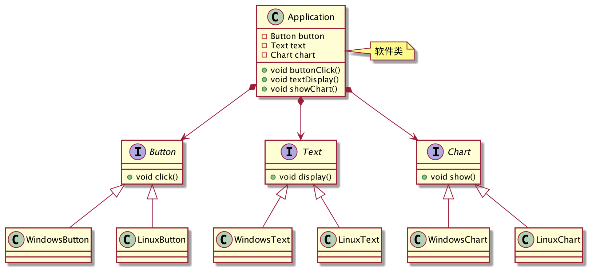
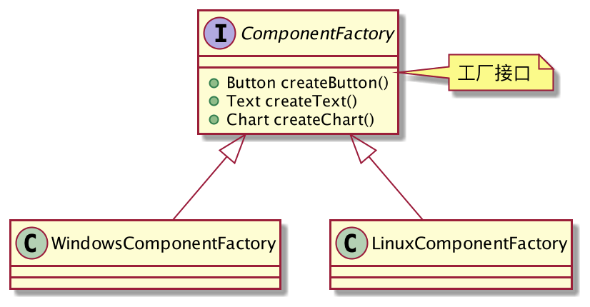
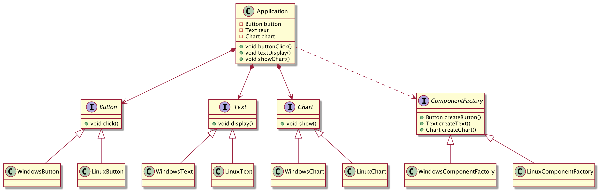
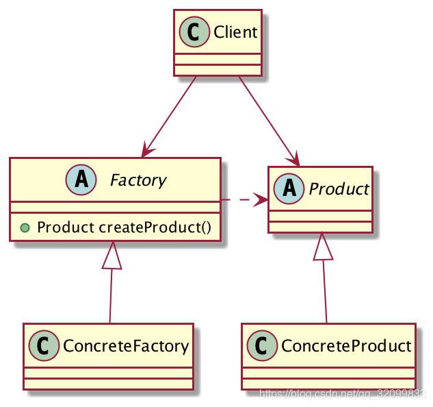

## 多平台软件设计

开发一款软件，要求是支持多个平台，代码还要尽可能的被复用。

不管是哪个平台，软件的架构外观和功能都是一样的，只是不同的组件在不同的平台实现代码不一样而已。

假设这个软件很简单，只由三部分构成：按钮、文本框、绚丽的图表。

先抽象出组件接口，定义组件的特性和功能。


```java
public interface Button {

	// 按钮可以点击
	void click();
}

public interface Text {

	// 文本可以显示
	void display();
}

public interface Chart {

	// 图表很炫，要展示
	void show();
}
```
假设目前只支持Windows和Linux系统，对不同的平台需要编写不同的实现代码。



```java
class WindowsButton implements Button{
	@Override
	public void click() {
		System.out.println("Windows按钮被点击");
	}
}

class LinuxButton implements Button{
	@Override
	public void click() {
		System.out.println("Linux按钮被点击");
	}
}

class WindowsText implements Text{
	@Override
	public void display() {
		System.out.println("Windows文本框显示");
	}
}

class LinuxText implements Text{
	@Override
	public void display() {
		System.out.println("Linux文本框显示");
	}
}

class WindowsChart implements Chart{
	@Override
	public void show() {
		System.out.println("Windows图表展示");
	}
}

class LinuxChart implements Chart{
	@Override
	public void show() {
		System.out.println("Linux图表展示");
	}
}
```

```java
// 软件类
public class Application {
	private Button button;
	private Text text;
	private Chart chart;

	public void buttonClick(){
		button.click();
	}

	public void textDisplay(){
		text.display();
	}

	public void showChart(){
		chart.show();
	}
}
```
至此，软件类和组件类已经全部定义好了，该如何组装这些组件呢？手动new出来再set吗？你怎么知道我需要的是Windows的组件还是Linux的组件呢？万一以后要为Mac平台开发一套，你又要怎么做？

**定义一个工厂接口，指定需要生产哪些组件，再由子类来负责生产对应的组件，Windows工厂就只生产Windows组件，Linux工厂只生产Linux组件，各司其职。**



```java
public interface ComponentFactory {

	// 生产按钮
	Button createButton();

	// 生产文本框
	Text createText();

	// 生产图表
	Chart createChart();
}

// Windows组件工厂
public class WindowsComponentFactory implements ComponentFactory{

	@Override
	public Button createButton() {
		return new WindowsButton();
	}

	@Override
	public Text createText() {
		return new WindowsText();
	}

	@Override
	public Chart createChart() {
		return new WindowsChart();
	}
}

// Linux组件工厂
public class LinuxComponentFactory implements ComponentFactory{

	@Override
	public Button createButton() {
		return new LinuxButton();
	}

	@Override
	public Text createText() {
		return new LinuxText();
	}

	@Override
	public Chart createChart() {
		return new LinuxChart();
	}
}
```
`Application`依赖于组件工厂生产组件，类稍作修改：
```java
public class Application {
	private Button button;
	private Text text;
	private Chart chart;

	public Application(ComponentFactory factory) {
		this.button = factory.createButton();
		this.text = factory.createText();
		this.chart = factory.createChart();
	}

	public void buttonClick(){
		button.click();
	}

	public void textDisplay(){
		text.display();
	}

	public void showChart(){
		chart.show();
	}
}
```
至此，整个结构都出来了，最终类图如下：



客户端调用

```java
public class Client {
	public static void main(String[] args) {
		Application windows = new Application(new WindowsComponentFactory());
		windows.buttonClick();
		windows.textDisplay();
		windows.showChart();

		Application linux = new Application(new LinuxComponentFactory());
		linux.buttonClick();
		linux.textDisplay();
		linux.showChart();
	}
}
```
这就是抽象工厂模式！
## 抽象工厂模式的定义
> 为创建一组相关或相互依赖的对象提供一个接口，而且无须指定它们的具体类。



**抽象工厂模式通用类图**

- Factory：工厂抽象，定义工厂的功能，需要生产哪些产品。
- ConcreteFactory：工厂实现，负责生产产品族。
- Product：产品抽象，定义产品所具有的特性和方法。
- ConcreteProduct：具体的产品实现。

抽象工厂模式是工厂方法模式的升级版，工厂方法模式只能生产单个品类的产品，而抽象工厂模式可以生产一组相关或相互关联的产品，也叫作【产品族】，有N个产品族，抽象工厂就应该有N个方法。如果存在多个业务品种，通过抽象工厂模式来产生对象是非常好的。
## 工厂方法模式的优缺点
**优点**

1. 良好的封装性，客户端不关心产品实现类，只关心工厂，和产品的抽象，符合依赖倒置原则。
2. 可以保证客户端只使用同一个产品族内的对象。
3. 产品族内的约束对客户端来说是透明的，例如抽象工厂模式可以保证每生产M个产品A，同时生产出N个产品B。

**缺点**

1. 产品族难以扩展，如果要增加一个产品类，抽象工厂和所有的工厂实现都需要修改，不符合开闭原则。

抽象工厂模式虽然产品族难以扩展，但是产品等级是非常统一扩展的，例如`Application`要为Mac系统也开发一套，只需要实现Mac系统的组件，和Mac系统的`ComponentFactory`即可，其他地方都不需要修改。
## 总结
抽象工厂模式是工厂方法模式的扩展，工厂方法模式只能生产单个品类的产品，而抽象工厂模式可以生产一组相关或相互依赖的产品族。抽象方法模式的产品等级非常容易扩展，但是产品族难以扩展。因此，抽象工厂模式更适合于产品结构相对稳定的场景，对于后续可能会频繁添加或删除产品类的结构，就不太适用了。

