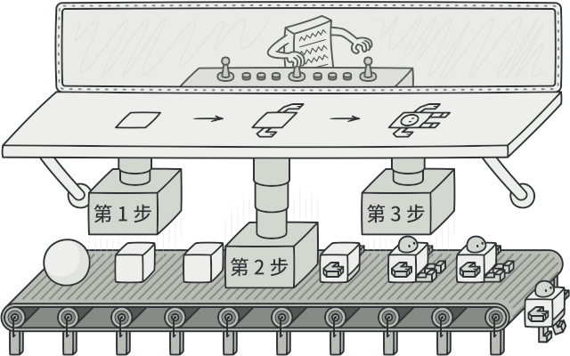
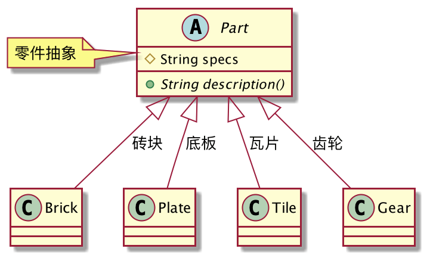
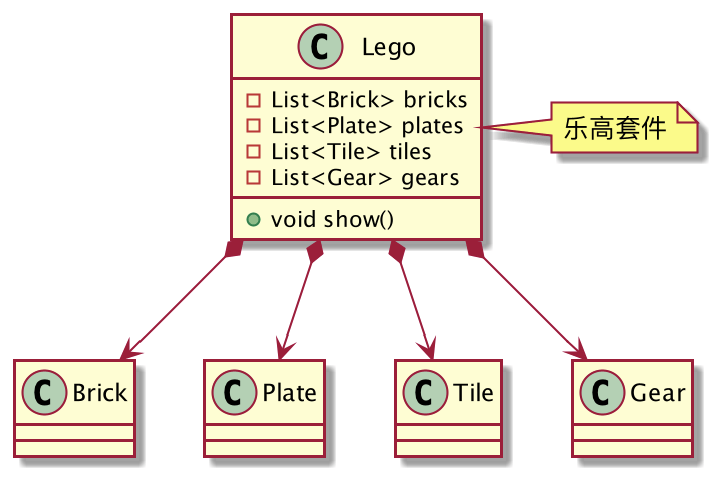
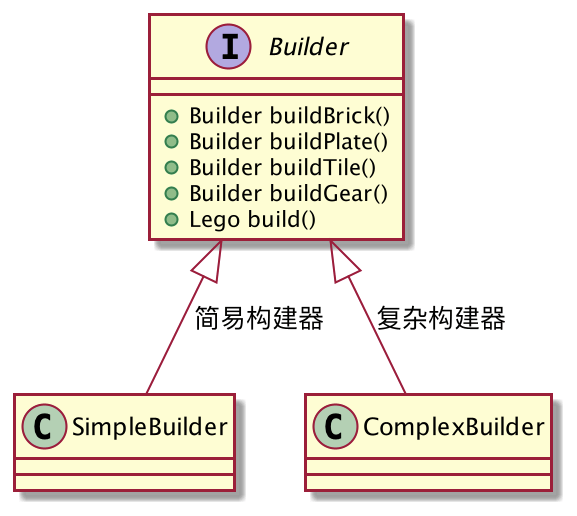
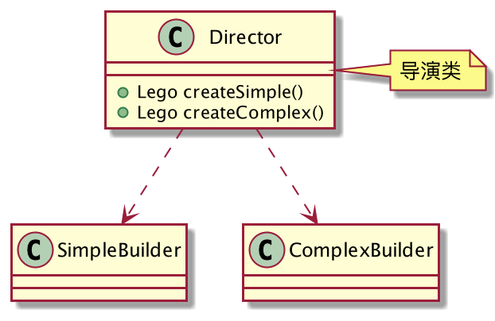
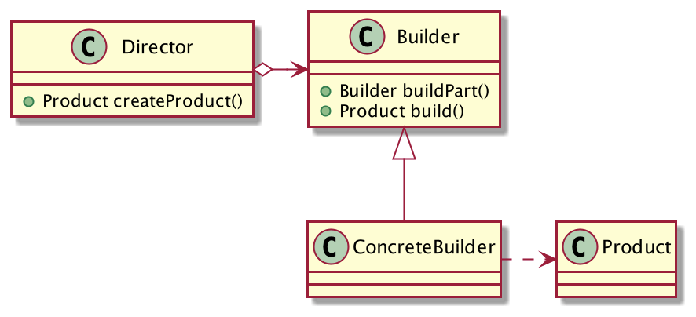

## 万能的乐高
乐高大家应该都玩过吧，一些小小的零件却可以拼成各种各样的东西，基本上只有你想不到，没有它做不到的。

乐高的积木套装就是将不同规格的零件组合在一起，最终可以拼成一个成品如城堡、汽车等。

我们试着用代码来描述这个过程，首先定义零件的抽象类和四个具体零件类：


```java
/**
 * 零件抽象基类
 */
public abstract class Part {
    protected String specs;//规格

    public Part(String specs) {
        this.specs = specs;
    }

    public abstract String description();
}

// 砖块
class Brick extends Part {
    public Brick(String specs) {
        super(specs);
    }

    @Override
    public String description() {
        return specs + "砖块";
    }
}

// 底板
class Plate extends Part {
    public Plate(String specs) {
        super(specs);
    }

    @Override
    public String description() {
        return specs + "底板";
    }
}

// 瓦片
class Tile extends Part {
    public Tile(String specs) {
        super(specs);
    }

    @Override
    public String description() {
        return specs + "瓦片";
    }
}

// 齿轮
class Gear extends Part {
    public Gear(String specs) {
        super(specs);
    }

    @Override
    public String description() {
        return specs + "齿轮";
    }
}
```
定义乐高套件，它由四种零件组成：



```java
@Getter
@NoArgsConstructor
public class Lego {
    private final List<Brick> bricks = new ArrayList<>();
    private final List<Plate> plates = new ArrayList<>();
    private final List<Tile> tiles = new ArrayList<>();
    private final List<Gear> gears = new ArrayList<>();

    // 展示套件
    public void show() {
        print(bricks);
        print(plates);
        print(tiles);
        print(gears);
    }

    private void print(List<? extends Part> parts) {
        if (!parts.isEmpty()) {
            System.out.println("(" + parts.get(0).description() + ")" + " x " + parts.size());
        }
    }
}
```
乐高套件有了，零件也有了，怎么将零件进行组装呢？

让客户端自行创建零件，并设置到套件里吗？根据迪米特法则，客户端只关心自己拿到的是一个乐高套件，它并不关心这个套件是怎么组装起来的啊！

因此，我们定义一个构建器接口，它可以构建四种零件，并最终生成一个套件。除此之外，再编写两个构建器实现，分别是：简易套装、困难套装。


```java
// 乐高套装构建器
public interface Builder {
	// 构建砖块
	Builder buildBrick();

	// 构建底板
	Builder buildPlate();

	// 构建瓦片
	Builder buildTile();

	// 构建齿轮
	Builder buildGear();

	Lego build();
}

// 简易套件
public class SimpleBuilder implements Builder{
	private Lego lego = new Lego();

	@Override
	public Builder buildBrick() {
		for (int i = 0; i < 10; i++) {
			lego.getBricks().add(new Brick("2x2"));
		}
		return this;
	}

	@Override
	public Builder buildPlate() {
		for (int i = 0; i < 5; i++) {
			lego.getPlates().add(new Plate("3x3"));
		}
		return this;
	}

	@Override
	public Builder buildTile() {
		for (int i = 0; i < 15; i++) {
			lego.getTiles().add(new Tile("4x4"));
		}
		return this;
	}

	@Override
	public Builder buildGear() {
		for (int i = 0; i < 20; i++) {
			lego.getGears().add(new Gear("1x1"));
		}
		return this;
	}

	@Override
	public Lego build() {
		return this.lego;
	}
}

// 困难套件
public class ComplexBuilder implements Builder{
	private Lego lego = new Lego();

	@Override
	public Builder buildBrick() {
		for (int i = 0; i < 100; i++) {
			lego.getBricks().add(new Brick("2x2"));
		}
		return this;
	}

	@Override
	public Builder buildPlate() {
		for (int i = 0; i < 50; i++) {
			lego.getPlates().add(new Plate("3x3"));
		}
		return this;
	}

	@Override
	public Builder buildTile() {
		for (int i = 0; i < 150; i++) {
			lego.getTiles().add(new Tile("4x4"));
		}
		return this;
	}

	@Override
	public Builder buildGear() {
		for (int i = 0; i < 200; i++) {
			lego.getGears().add(new Gear("1x1"));
		}
		return this;
	}

	@Override
	public Lego build() {
		return this.lego;
	}
}
```
只要有构建器，就可以生成一个乐高套件，且不同的构建器可以构建不同的套件。

为了避免高层模块深入到构建者内部的实现类，因此创建一个导演类，由导演类来复杂调用构建器生成套件实例。



```java
public class Director {
	public Lego createSimple(){
		return new SimpleBuilder()
				.buildBrick()
				.buildPlate()
				.buildTile()
				.buildGear()
				.build();
	}

	public Lego createComplex(){
		return new ComplexBuilder()
				.buildBrick()
				.buildPlate()
				.buildTile()
				.buildGear()
				.build();
	}
}
```
客户端调用
```java
public class Client {
	public static void main(String[] args) {
		Director director = new Director();
		Lego simpleLego = director.createSimple();
		System.out.println("简易乐高套件:");
		simpleLego.show();

		Lego complexLego = director.createComplex();
		System.out.println("复杂乐高套件:");
		complexLego.show();
	}
}
```
## 建造者模式的定义
> 将一个复杂对象的构建与它的表示分离，使得同样的构建过程可以创建不同的表示。



**建造者模式通用类图**

- Product：产品类。
- Builder：抽象建造器，定义产品的组装步骤。
- ConcreteBuilder：具体的建造器，完成产品的组装实现。
- Director：各个子组件的构建顺序，并最终告诉Builder开始建造完整对象。

建造者模式的定义看着还是挺绕的，什么是「将一个复杂对象的构建与它的表示分离」呢？

抽象建造器Builder负责定义要构建一个复杂对象，需要先构建N个子组件，至于具体的构建器是如何构建这些子组件的，上层是不关心的，这就是：将一个复杂对象的构建与它的表示分离。

什么是「使得同样的构建过程可以创建不同的表示」？

还是和上面一样，抽象建造器Builder只负责定义构建一个复杂对象前需要先构建N个子组件，这个过程是固定不变的，即为"同样的构建过程"。具体的构建器构建子组件的细节可以是不同的，另外导演类Director可以按照不同的顺序来构建子组件，也可能会对最终的成品产生不同的影响，即为"不同的表示"。
## 建造者模式的优点

1. 良好的封装性，建造者模式使得客户端无需知道产品的构建过程和组成部分，符合迪米特法则。
2. 建造者容易扩展，乐高的例子中，如果要实现一个变态难的套件是非常简单的。
3. 建造者可以对建造过程逐步细化，而不会对其他模块产生影响。
## 建造者模式的使用场景

1. 产品类非常复杂，需要很多的参数，同时这些参数有很多是可选的，则非常适合用建造者模式。
2. 相同的方法，不同的执行顺序会产生不同的结果（导演类）。
3. 构建一个产品步骤十分繁琐，可以通过建造者模式来对外屏蔽构建细节。
## 总结
使用建造者模式需要生成额外的建造者对象，需要JVM开辟额外的内存空间，GC的压力也会增大，这是它的缺点，因此建造者模式不宜滥用，如果是构建非常简单的对象，就不要使用该模式了。

相反，如果一个产品类十分复杂，客户端构建起来会非常吃力，则应该首先考虑使用建造者模式来构建对象。
