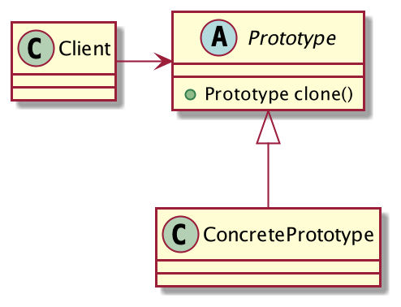

## 广告邮件推送
现在大部分系统都有「发送邮件」的功能，系统可以通过邮件的方式给客户发送一些通知、消息提醒、广告推送的邮件。

其中，「广告邮件」比较特殊，它的邮件内容都是一样的，唯一不同的目标邮箱，而且它需要短时间大批量的发送，对发送的性能要求比较高。

我们试着用Java代码来描述邮件类，如下：
```java
@Setter
public class Mail{
	private String target;//目标邮箱
	private String content;//邮件内容
	private String tail;//公司落款
	// 发送
	public void send(){
		System.out.println("target:" + target + ",content:" + content);
	}
}
```
客户端调用：
```java
public class Client {
	public static void main(String[] args) {
		Mail mail = new Mail();
		// 广告的内容都是一样的，一般都是从数据库查询获得
		mail.setContent("AirPods Pro发布，主动降噪，声声入耳更沉浸。");
		// 落款也都是一样的
		mail.setTail("Apple");
		// 批量发送
		for (int i = 0; i < 1000; i++) {
			mail.setTarget(i + "@qq.com");
			mail.send();
		}
	}
}
```
功能是实现了，但是有一个问题，邮件的发送是单线程的，假设一封邮件发送的时间是50ms，发送一百万封邮件需要将近14个小时，这显然是不能接收的，必须采用多线程并行发送。
```java
public class Client {
	public static void main(String[] args) {
		Mail mail = new Mail();
		// 广告的内容都是一样的，一般都是从数据库查询获得
		mail.setContent("AirPods Pro发布，主动降噪，声声入耳更沉浸。");
		// 落款也都是一样的
		mail.setTail("Apple");
		// 开启16个线程并发推送
		for (int i = 0; i < 16; i++) {
			new Thread(()->{
				for (int j = 0; j < 1000; j++) {
					mail.setTarget(j + "@qq.com");
					mail.send();
				}
			}).start();
		}
	}
}
```
修改客户端代码如上，运行，很快你就会发现，有的用户没受到邮件，有的用户却收到多封邮件了，这是怎么回事？`mail`对象线程不安全了，`target`是共享变量，多个线程在修改它。

再修改，线程内创建Mail对象：
```java
public class Client {
	public static void main(String[] args) {
		// 开启16个线程并发推送
		for (int i = 0; i < 16; i++) {
			new Thread(()->{
				// 线程内创建对象，方法栈私有，安全。
				Mail mail = new Mail();
				// 广告的内容都是一样的，一般都是从数据库查询获得
				mail.setContent("AirPods Pro发布，主动降噪，声声入耳更沉浸。");
				// 落款也都是一样的
				mail.setTail("Apple");
				for (int j = 0; j < 1000; j++) {
					mail.setTarget(j + "@qq.com");
					mail.send();
				}
			}).start();
		}
	}
}
```
这下终于线程安全了，但是仔细分析一下程序，邮件的内容和落款都是一样的，为什么要重复执行一百万次呢？为什么每次都要生成一个空对象呢？能不能从一个已有的对象中直接克隆一份，然后只设置一些个性化的属性呢？

可以，当然可以了，原型模式应运而生。
JDK的`Object`提供了一个`clone()`方法：
```
protected native Object clone() throws CloneNotSupportedException;
```
它是被保护的本地方法，`clone()`方法不能直接调用，需要类实现`java.lang.Cloneable`接口，`Cloneable`是一个标记接口，实现它代表类是允许被克隆的。

实现`Cloneable`接口后，还需要类重写`clone()`方法，Mail类修改如下：
```java
@Setter
public class Mail implements Cloneable {
	private String target;//目标邮箱
	private String content;//邮件内容
	private String tail;//落款
	public void send(){
		System.out.println("target:" + target + ",content:" + content);
	}
	@Override
	protected Mail clone(){
		try {
			return (Mail) super.clone();
		} catch (CloneNotSupportedException e) {
			e.printStackTrace();
			return null;
		}
	}
}
```
OK，现在客户端可以非常方便的调用`clone()`方法来获得一个Mail对象：
```java
public class Client {
	public static void main(String[] args) {
		Mail mail = new Mail();
		// 广告的内容都是一样的，一般都是从数据库查询获得
		mail.setContent("AirPods Pro发布，主动降噪，声声入耳更沉浸。");
		// 落款也都是一样的
		mail.setTail("Apple");
		// 开启16个线程并发推送
		for (int i = 0; i < 16; i++) {
			new Thread(()->{
				for (int j = 0; j < 1000; j++) {
					// 从基础对象中克隆出一个新的对象
					Mail clone = mail.clone();
					clone.setTarget(j + "@qq.com");
					clone.send();
				}
			}).start();
		}
	}
}
```
`clone()`是从一个已有的对象中克隆出来的新对象，因此不存在线程安全问题，且会保留已有对象的所有属性，而且因为是基于内存的直接拷贝，构造函数不会执行，性能上也会比使用`new`关键字直接创建会好一些。

简单吧，这就是原型模式！
## 原型模式的定义
> 用原型实例指定创建对象的种类，并且通过拷贝这些原型创建新的对象。



**原型模式通用类图**

原型模式的核心就是一个`clone()`方法，它允许客户端无需生成一个新的空对象，而是从一个已有的对象中克隆出一个一模一样的新对象，只需设置一些自定义的属性即可快速使用。
## 原型模式的优点

1. 性能很好，Java的`clone()`是基于内存二进制流的拷贝，性能要比`new`创建对象好。
2. 避免构造函数的约束，`clone()`产生的对象不会执行构造函数。
3. 避免对象的复杂构建过程，`clone()`可以基于一个已有的复杂对象进行克隆，避免了复杂的构建过程。
## 原型模式的使用场景

1. 当一个类的构建需要消耗大量资源时（如查询数据库，读取文件等），使用原型模式可以进行资源优化。
2. 同一个对象会有多个修改者时，使用原型模式构建新对象，避免数据错乱。
3. 需要优化创建对象的性能。
## 原型模式的扩展
### 构造函数不会执行
调用`clone()`创建对象时，类的构造函数是不会被执行的，这一点经常被Java开发者忽略。

原因是调用`clone()`方法时，JVM会重新分配一块内存，然后将原有对象的内存二进制流直接拷贝到新的内存区域，因此构造函数没有被执行也是可以说得通的。

### 浅拷贝和深拷贝
JDK的`clone()`是浅拷贝实现，对于引用类型，拷贝的只是对象引用的内存地址，对象A修改引用对象的属性后，对象B也会受到影响，这一点需要特别注意。

如果要实现深拷贝，需要开发人员自己去实现，一般做法是将依赖的引用类也挨个重写`clone()`方法，依次调用引用对象的`clone()`方法来拷贝引用类型对象并赋值给外层对象。
## 总结
原型模式是23种设计模式中最简单的模式之一，它的简单程度和单例模式有的一拼。核心是类实现的`clone()`方法，它允许对象基于自身克隆出一个一模一样的新对象，JDK本身就支持原型模式，因此Java开发者可以直接拿来使用。
