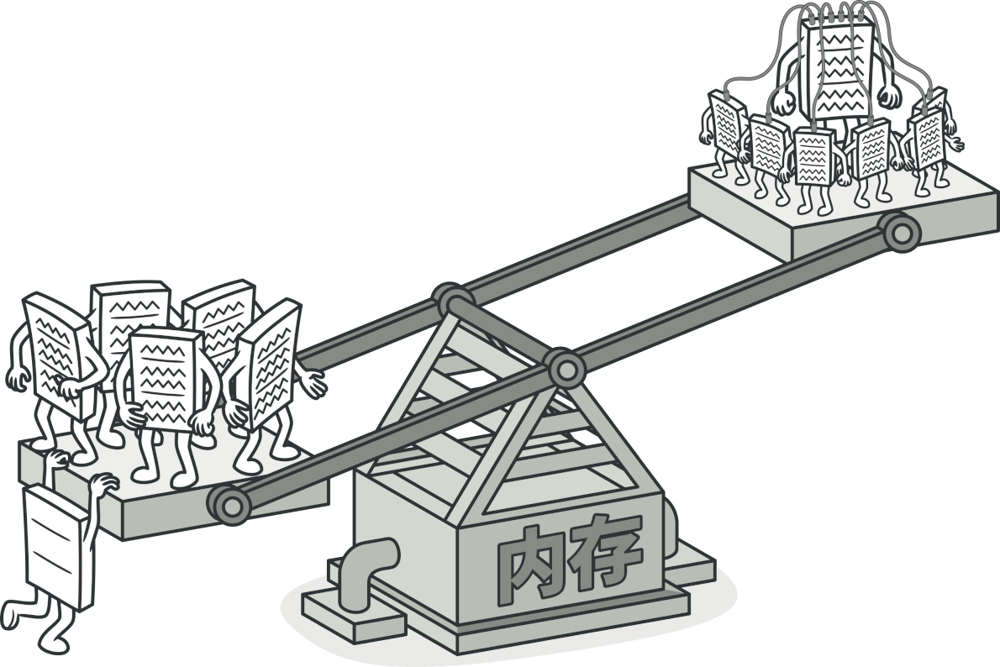
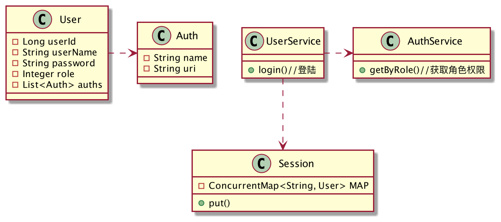
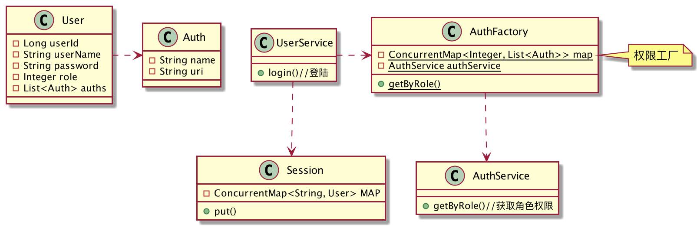
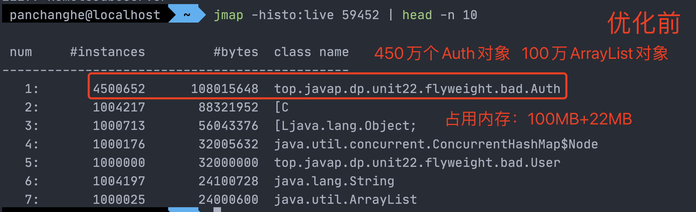
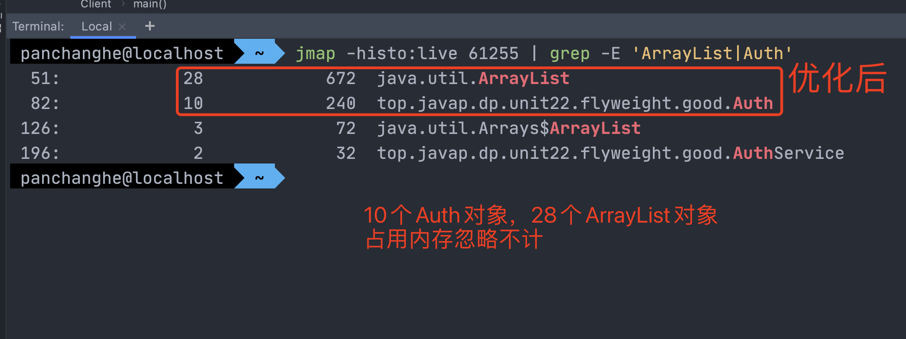
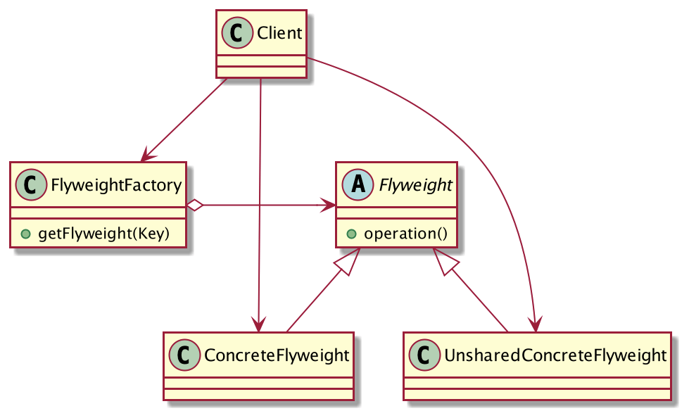

## 内存溢出，谁的锅？
`OutOfMemoryError`这个异常对于Java开发者来说并不陌生，相信有一定经验的同学都遇到过，导致JVM抛出该异常的根本原因是：虚拟机无法开辟出应用程序所需的内存空间，程序已经无法继续运行下去了。

内存溢出一般来说有以下两种可能：

**1.内存泄漏**

无意识的代码缺陷，产生的对象永远不会被使用，但是GC也无法回收，导致内存泄漏。

**2.内存溢出**

产生的对象太多，内存被耗尽，可能是烂代码导致的，也可能是系统确实需要这些对象，但是物理内存不够。

笔者很不幸，在第一家公司工作的时候就遇到过线上系统频繁宕机的问题，排查日志后发现是由于内存溢出导致的。服务器的内存大小为8G，我们试着调大JVM的内存，分配了4G，结果还是运行一段时间后就宕机了。然后大家都开始紧张了起来，因为这个系统并不复杂，4G的内存是绝对够用的，如果还是内存溢出，那就只能是代码问题了。

我们首先是设置JVM参数`-XX:+HeapDumpOnOutOfMemoryError`让虚拟机在内存溢出时生成内存快照并导出到磁盘，我们拿到快照文件后便开始分析堆中的对象情况，结果发现`Auth`类实例数量非常多，有上百万个。`Auth`类是对系统权限的描述，`User`类持有对`Auth`类的引用，它的目的是用户请求接口时进行权限校验，没有接口权限的用户请求接口，服务端是拒绝执行的。

什么时候会生成`Auth`对象呢？检查代码发现是登陆的时候，系统首先会查询用户的基本信息，然后再查询用户具有的权限列表，再将用户信息放到Session里面。
我试着用代码来重现这个过程，类图设计如下：



描述权限的`Auth`类：

```java
public class Auth {
	private String name;//权限名
	private String uri;//接口URI
	public Auth(String name, String uri) {
		this.name = name;
		this.uri = uri;
	}
}
```
用户类`User`：
```java
@Data
public class User {
	private Long userId;
	private String userName;
	private String password;
	private Integer role;
	private List<Auth> auths;//用户具有的权限列表
}
```
`AuthService`可以从数据库中查询角色拥有的权限：
```java
public class AuthService {
	// 查询role具有的权限
	public List<Auth> getByRole(Integer role){
		return mockData(role);
	}
	// 模拟数据
	private List<Auth> mockData(Integer role) {
		List<Auth> list = new ArrayList<>();
		switch (role){
			case 1://普通用户
				list.add(new Auth("查看", "/look.html"));
			case 2://管理员
				list.add(new Auth("新增", "/add.html"));
				list.add(new Auth("修改", "/update.html"));
				list.add(new Auth("删除", "/delete.html"));
			case 3://超级管理员
				list.add(new Auth("无所不能", "/almighty.html"));
			default:;
		}
		return list;
	}
}
```
模拟Tomcat的Session容器，这里用Map来表示：
```java
public class Session {
	private static final ConcurrentMap<String, User> MAP = new ConcurrentHashMap<>();
	public static void put(String sessionId, User user) {
		MAP.put(sessionId, user);
	}
}
```
`UserService`用户登陆后，将用户信息和权限列表保存到Session容器：
```java
public class UserService {
	private AuthService authService = new AuthService();
	public void login(String userName, String password) {
		User user = new User();
		user.setUserId(ThreadLocalRandom.current().nextLong());
		user.setUserName(userName);
		user.setPassword(password);
		user.setRole(ThreadLocalRandom.current().nextInt(2) + 1);
		// 查询用户具有的权限
		user.setAuths(authService.getByRole(user.getRole()));
		// 用户信息存储到Session
		Session.put(UUID.randomUUID().toString(), user);
	}
}
```
客户端这样调用：
```java
public class Client {
	public static void main(String[] args) {
		UserService userService = new UserService();
		// 模拟客户端一百万次登陆请求
		for (int i = 0; i < 1000000; i++) {
			userService.login("root", "123");
		}
	}
}
```
这种实现功能是正常的，但是我们来分析一下，这段程序有没有什么问题？

**权限和角色有关，和用户无关！**

这是问题的核心，现在的实现是：只要有用户登陆，系统就要查询一次用户的权限列表，站在JVM的角度来看，就是生成N个`Auth`对象和一个`ArrayList`对象。角色的数量是有限的，而用户的数量可以看作是无限的。如果在线用户有上万个，再加上权限一多，那么JVM就可能需要生成百万个`Auth`对象和上万个`ArrayList`对象，那可不就得内存溢出嘛。

由于公司没有Code Review的习惯，测试也没有发现问题，因为没有做负载测试，测试阶段在线用户少嘛，当然不会内存溢出，但是项目一上线，随着在线用户数量的增加，这个隐藏Bug马上就原形毕露了！

发现问题，接下来就是解决问题了。这个问题很好解决，使用「享元模式」，**相同角色的用户共享同一个权限列表**，避免创建过多重复的对象，内存占用马上就降下来了。

优化后的类图设计如下：



引入了一个`AuthFactory`权限工厂类，它会在初始化的时候加载所有角色对应的权限列表并缓存下来，用户登陆时从`AuthFactory`的缓存中获取自身角色对应的权限列表，这样所有角色相同的用户就能复用同一个权限列表了。

```java
public class AuthFactory {
	// 缓存
	private static final ConcurrentMap<Integer, List<Auth>> map = new ConcurrentHashMap<>();
	private static AuthService authService = new AuthService();
	static{
		// 预先加载角色对应的权限信息，假设只有三种角色
		map.put(1, authService.getByRole(1));
		map.put(2, authService.getByRole(2));
		map.put(3, authService.getByRole(3));
	}
	public static List<Auth> getByRole(Integer role) {
		return map.get(role);
	}
}
```
`UserService`类稍作修改，原先调用`AuthService`获取权限列表，现在改为从`AuthFactory`的缓存中获取，这里就不贴重复代码了。

客户端的调用也没变，但是优化后的代码，内存占用极少，没有再出现内存溢出的情况了，客户非常满意。

使用`jmap`分析堆内存，下面分别是优化前和优化后的情况：





如图所示，效果非常明显，这就是享元模式！

## 享元模式的定义
> 使用共享对象可有效地支持大量的细粒度的对象。


**享元模式通用类图**

- Flyweight：享元角色的抽象，负责定义对象的内部状态和外部状态的接口或实现。
- ConcreteFlyweight：具体的享元角色，实现抽象角色定义的操作，需要注意的是一定不能修改共享对象，否则就混乱了。
- UnsharedConcreteFlyweight：不可共享的享元角色，不存在外部状态或者安全要求不能使用共享技术的对象，该对象一般不会出现在享元工厂中。
- FlyweightFactory：享元工厂，创建一个池容器，提供一个从容器中获取享元对象的方法。

享元模式的核心就是运用「对象池」技术，使得对象可以被复用，避免创造重复的无意义对象，减少内存占用，减轻GC的压力。
## 享元模式的优缺点
享元模式使得对象可以被复用，大大减少了重复对象的创建，减少了程序内存的占用，减轻了GC的压力，提高程序的性能。

但是享元模式需要类分离出内部状态和外部状态，增加了系统的复杂性。

当系统中存在大量的相似对象时，就可以将这些相似的属性剥离出来，进行对象的复用。

## 总结
享元模式是「池技术」的重要实现方式，它为我们提出了两个要求：1.细粒度的对象、2.共享对象。

应用程序创建太多的对象会增加内存的占用，降低程序性能，还有可能导致内存溢出。使用享元模式，分离对象的内部状态和外部状态，通过享元工厂来缓存外部状态，使得重复的外部状态可以被复用，避免程序频繁创建无意义的重复对象。

有一点需要特别注意的是，享元类一定不能去修改共享的外部状态，否则会导致数据混乱。

最后还有一点就是，由于对象是共享的，因此需要特别注意「线程安全」的问题！
