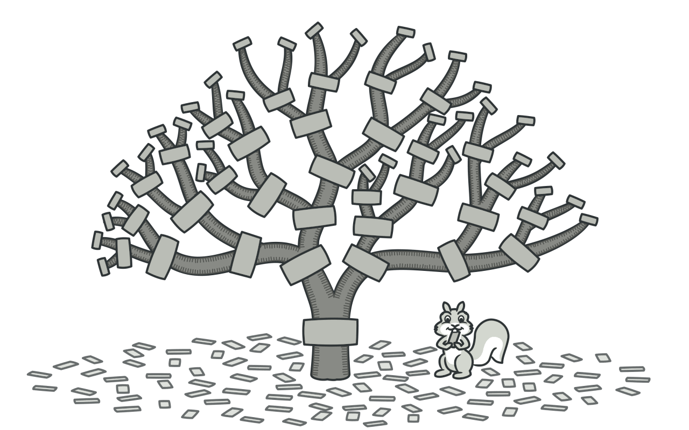
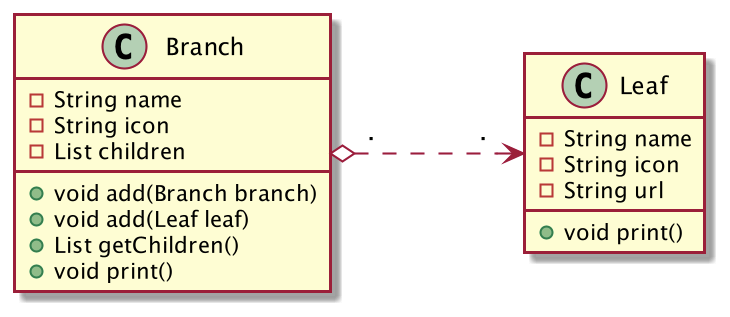
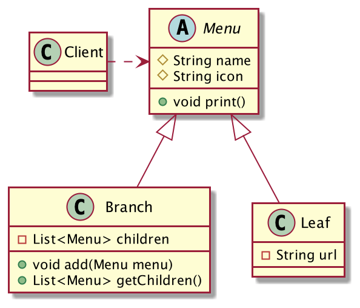
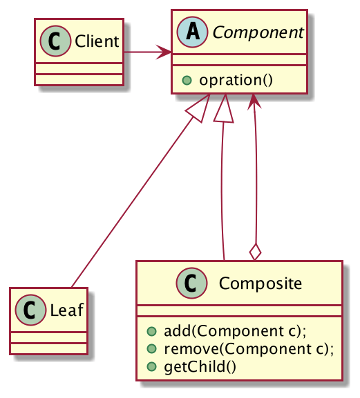
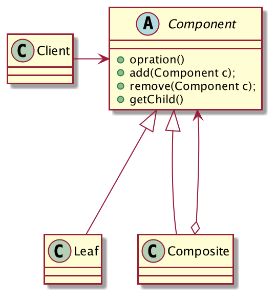

## 系统菜单的设计
「系统菜单」应该是所有ERP系统都必备的一个基础模块。典型的设计就是一个「树状结构」，数据库表用一个`parent_id`来构建整棵菜单树。

菜单分为两类：菜单目录和具备URL地址可点击的菜单，即树枝节点和树叶节点。分别设计`Branch`类代表菜单目录，`Leaf`类代表菜单，类图如下，非常简单。



```java
public class Branch {
    private String name;
    private String icon;
    private List children;

    public Branch(String name, String icon) {
        this.name = name;
        this.icon = icon;
        this.children = new ArrayList<>();
    }

    public void add(Branch branch) {
        this.children.add(branch);
    }

    public void add(Leaf leaf) {
        this.children.add(leaf);
    }

    public void print() {
        System.out.println("name:" + name + ",icon:" + icon);
    }

    public List getChildren() {
        return children;
    }
}
```
```java
public class Leaf {
	private String name;
	private String icon;
	private String url;

	public Leaf(String name, String icon, String url) {
		this.name = name;
		this.icon = icon;
		this.url = url;
	}

	public void print() {
		System.out.println("name:" + name + ",icon" + icon + ",url:" + url);
	}
}
```
客户端构建菜单树，并遍历输出
```java
public class Client {
	public static void main(String[] args) {
		Branch root = new Branch("系统管理", "system.icon");
		Branch menu = new Branch("菜单管理", "menu.icon");
		menu.add(new Leaf("菜单列表", "menuList.icon", "/menu/list.html"));
		menu.add(new Leaf("用户菜单", "userMenu.icon", "/menu/user.html"));
		root.add(menu);
		root.add(new Leaf("角色管理", "role.icon", "/role.html"));
		root.add(new Leaf("权限管理", "auth.icon", "/auth.html"));

		show(root, 0);
	}

	// 展示菜单
	static void show(Branch branch,int tier) {
		for (int i = 0; i < tier; i++) {
			System.out.print("····");
		}
		branch.print();
		for (Object o : branch.getChildren()) {
			if (o instanceof Branch) {
				show((Branch) o, tier + 1);
			}else {
				for (int i = 0; i <= tier; i++) {
					System.out.print("····");
				}
				((Leaf)o).print();
			}
		}
	}
}
```
OK，一棵菜单树构建出来了，客户端也能进行遍历了，但是会发现代码实现的特别别扭啊，一点也不优雅。`Branch`和`Leaf`存在冗余属性和代码啊，不管是目录还是菜单，`name`和`icon`都是有的，应该提取出`Menu`抽象类，菜单只是一个抽象，我不管你是树枝节点还是树叶节点，你都是菜单啊。树枝节点可以包含树枝和树叶，树叶节点就仅仅包含自身的属性特征，这些区别可以放到子类做特殊处理，但是对于客户端来说，他们应该都是`Menu`。

重新设计一下类，优化后的类图如下：



编写`Menu`类，将菜单抽象出来，提取公共属性和方法

```java
public abstract class Menu {
	protected String name;
	protected String icon;

	public Menu(String name, String icon) {
		this.name = name;
		this.icon = icon;
	}

	public void print(){
		System.out.println("name:" + name + ",icon:" + icon);
	}
}
```
树枝节点Branch
```java
public class Branch extends Menu {
	private List<Menu> children = new ArrayList<>();

	public Branch(String name, String icon) {
		super(name, icon);
	}

	public void add(Menu menu) {
		children.add(menu);
	}

	public List<Menu> getChildren() {
		return children;
	}
}
```
树叶节点Leaf
```java
public class Leaf extends Menu{
	private String url;

	public Leaf(String name, String icon, String url) {
		super(name, icon);
		this.url = url;
	}

	@Override
	public void print() {
		System.out.println("name:" + name + ",icon:" + icon + ",url:" + url);
	}
}
```
客户端调用
```java
public class Client {
	public static void main(String[] args) {
		Branch root = new Branch("系统管理", "system.icon");
		Branch menu = new Branch("菜单管理", "menu.icon");
		menu.add(new Leaf("菜单列表", "menuList.icon", "/menu/list.html"));
		menu.add(new Leaf("用户菜单", "userMenu.icon", "/menu/user.html"));
		root.add(menu);
		root.add(new Leaf("角色管理", "role.icon", "/role.html"));
		root.add(new Leaf("权限管理", "auth.icon", "/auth.html"));

		show(root, 0);
	}

	static void show(Menu menu,int tier) {
		for (int i = 0; i < tier; i++) {
			System.out.print("····");
		}
		if (menu instanceof Branch) {
			menu.print();
			for (Menu child : ((Branch) menu).getChildren()) {
				show(child, tier + 1);
			}
		} else if (menu instanceof Leaf) {
			menu.print();
		}
	}
}
```
## 组合模式的定义
> 将对象组合成树形结构以表示"部分-整体"的层次结构，使得用户对单个对象和组合对象的使用具有一致性。



- Component：抽象组件，提取公共的方法和属性。
- Leaf：叶子节点，没有分支，遍历的最小单位。
- Composite：树枝节点，复杂对象，组合树枝和树叶形成树状结构。

组合模式又被称为「部分-整体模式」，只要你需要维护「部分-整体」的关系，例如：树形菜单，文件菜单等就可以考虑使用组合模式。

细心的读者可能已经发现了，客户端在遍历整棵树时，需要判断遍历的节点是树枝还是树叶，说白了，客户端需要知道具体的实现，这其实是对「依赖倒置原则」的破坏，不过可以通过「透明模式」来解决。

## 组合模式的优缺点
**优点**

1. 高层模块调用简单，整棵树中所有的节点都是Component抽象，高层模块不关心自己处理的是简单对象还是复杂对象，统一了客户端处理节点的方式。
2. 屏蔽了节点实现细节对高层模块的影响，可以随时加入新的节点。
3. 节点可以自由增加，扩展性高。

**缺点**

仔细看看上面的代码，客户端在遍历树时，直接使用了实现类，这违反了「依赖倒置原则」。

## 透明的组合模式
上述实现采用的是「安全模式」，安全模式将树枝和树叶的功能区分开了，只有树枝才能进行组合。

透明模式则是将组合使用的方法全部放到了抽象组件中，这样不管是树枝对象还是树叶对象，都具有相同的结构，这种方式需要客户端判断子类类型，操作不当容易导致异常。



**透明的组合模式通用类图**

将组合方法提取到抽象`Menu`类中，默认不支持组合操作，`Branch`重写父类方法，实现组合功能，`Leaf`不重写，因为叶子节点本身确实不支持组合操作。

```java
public abstract class Menu {
	protected String name;
	protected String icon;

	public Menu(String name, String icon) {
		this.name = name;
		this.icon = icon;
	}

	public void add(Menu menu){
		// 默认不支持操作
		throw new UnsupportedOperationException();
	}

	public List<Menu> getChildren(){
		// 默认不支持操作
		throw new UnsupportedOperationException();
	}

	public void print(){
		System.out.println("name:" + name + ",icon:" + icon);
	}
}
```
这样，不管是`Branch`还是`Leaf`，结构上它们都是相同的，只是各自的实现不一样而已。
## 总结
组合模式在项目中随处可见：树形菜单、文件系统结构、XML结构等都是树形结构，都可以优先考虑使用组合模式来实现。

组合模式用于将多个对象组合成树形结构以表示「整体-部分」的结构层次，组合模式使得客户端对简单对象和复杂对象的使用具有一致性，方便了客户端的调用。
