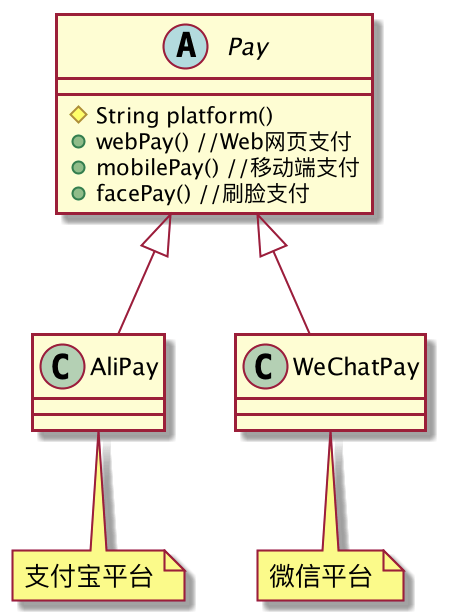
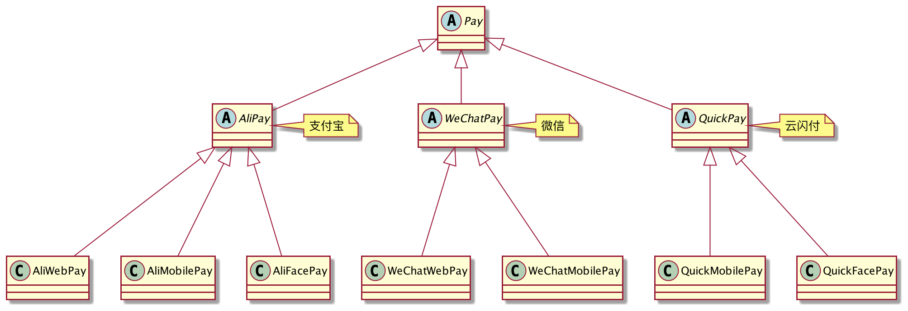
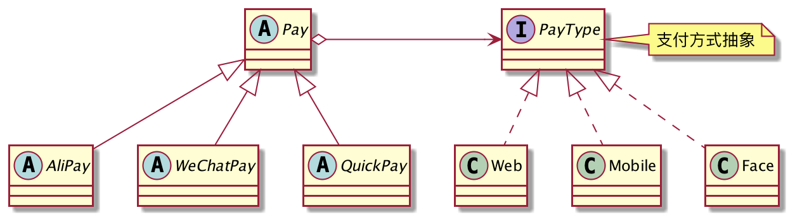
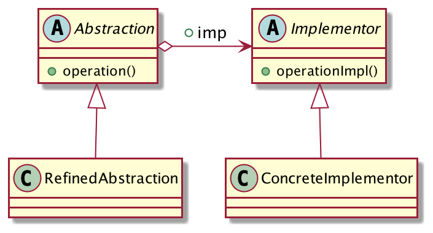

## 支付功能的扩展
由于支付宝和微信的存在，现在的系统要做「在线支付」已经变得非常简单了，在对应的平台注册企业账号，拿到开发文档，引入SDK包，进行一些简单的接口调用就可以完成对接了。本篇文章就以「支付」为例子，巧用「桥接模式」来进行功能的扩展。

在对接「支付业务」时，公司领导的要求几乎都是这样的：1.支持的支付平台越多越好、2.支持的支付方式也越多越好。当然越多越好了，用户掏钱变得更方便了，领导能不高兴嘛。

要满足领导的需求，就意味着「支付功能」会存在两个维度的扩展：**1.支付平台的扩展、2.支付方式的扩展。**

为了满足领导的要求，我决定接入微信和支付宝两大平台，后续还可以接入其他第三方，例如云闪付。另外，只要是第三方支持的支付方式，我也全部接入进来，目标就是做一个「超级支付」。

我们用代码来描述这个过程，类图设计如下：



超级简单的类图，声明一个`Pay`支付抽象类，定义系统支持的各种各样的付款方式，然后编写支付宝和微信两大子类，完成各自平台的对接实现。

乍一看是没啥问题，但是实际开发中却遇到问题了。

**1.子类被迫实现**
微信不支持「刷脸支付」啊，怎么办？我们只能在`WeChatPay`中强行实现`facePay()`方法，并抛出一个`UnsupportedOperationException`异常。如果有微信支持，但是支付宝不支持的付款方式呢？我们还是要这么做。

**2.扩展付款方式不方便**
`Pay`中负责定义付款方式，子类去实现，因此扩展支付平台是很方便的，但是扩展付款方式就非常麻烦了，需要修改所有的子类，违反了「开闭原则」。

OK，发现问题了就去解决问题，我们进行第一次优化，新的类图设计如下：



我们将类的继承关系再往上升一个等级，`Pay`将支付平台和支付方式进行分开表示，第二层负责实现平台功能，第三层负责实现各自平台对应的付款方式。可以看到，由于微信不支持刷脸支付，因此并没有`WeChatFacePay`这个类，云闪付不支持Web网站支付，因此也就没有`QuickWebPay`了，解决了第一种实现不灵活的问题。

但是你再重新审视一下现在的系统结构，有没有发现，类的数量特别多？没错，类膨胀了。假设系统要对接N个支付平台，支持M种支付方式，那么类的数量就是`M*N`，非常可怕。

能不能再优化一下呢？减少类的数量，同时还能保证支付的灵活性和扩展性呢？

答案是当然可以了，我们可以将支付方式进行抽象化，将支付方式的实现剥离出去，支付平台类只依赖支付方式的抽象，由继承改为组合的方式，提高灵活性。
新的类图设计如下：



类的数量明显减少了，但是功能却一点也不差，将不同的`Pay`和`PayType`组合在一起，可以支持9种支付实现。

抽象支付类`Pay`：
```java
public abstract class Pay {
	protected PayMode payMode;//支付方式抽象
	public Pay(PayMode payMode) {
		this.payMode = payMode;
	}
	protected abstract String platform();//支付平台
	public final void pay(){
		System.out.println("使用:" + platform() + "的" + payMode.mode());
	}
}
```
支付平台类：`AliPay`和`WeChatPay`。
```java
public class AliPay extends Pay{
	public AliPay(PayMode payMode) {
		super(payMode);
	}
	@Override
	protected String platform() {
		return "支付宝";
	}
}

public class WeChatPay extends Pay{
	public WeChatPay(PayMode payMode) {
		super(payMode);
	}
	@Override
	protected String platform() {
		return "微信";
	}
}
```
支付方式的抽象`PayMode`。
```java
public interface PayMode {
	// 支付方式
	String mode();
}
```
三种支付方式实现：
```java
public class WebPayMode implements PayMode {
	@Override
	public String mode() {
		return "Web网站支付";
	}
}

public class MobilePayMode implements PayMode {
	@Override
	public String mode() {
		return "移动端支付";
	}
}

public class FacePayMode implements PayMode {
	@Override
	public String mode() {
		return "刷脸支付";
	}
}
```
客户端这样调用：
```java
public class Client {
	public static void main(String[] args) {
		Pay pay = new AliPay(new FacePayMode());
		pay.pay();
		pay = new AliPay(new MobilePayMode());
		pay.pay();
	}
}
```
支付平台和支付方式可以任意组合，在满足相同功能的前提下，将类的数量从`M * N`减少至`M + N`了。

这就是桥接模式！

## 桥接模式的定义
> 将抽象和实现解耦，使得两者可以独立地变化。



**桥接模式通用类图**

- Abstraction：抽象化角色，负责定义角色的行为，同时保存一个对实现化角色的引用。
- RefinedAbstraction：修正抽象化角色，负责实现抽象化角色，并对抽象化角色进行修正。
- Implementor：实现化角色，接口或抽象类，定义角色的属性和行为。
- ConcreteImplementor：具体的实现化角色，负责行为的具体实现。

**抽象角色引用实现角色，或者说抽象角色的部分实现是由实现角色完成的。**

桥接模式的重点是在"解耦"上，开发者主要关注的点是如何将两者解耦。

## 桥接模式的优点

1. 抽象和实现分离，为了解决继承的缺点而提出的。在桥接模式下，实现可以不受抽象的约束，不用再绑定在一个固定的抽象层次上。
2. 良好的扩展性，在上述例子中，不管是支付平台的扩展，还是支付方式的扩展，都是非常方便的。
3. 对高层模块屏蔽实现细节。
## 桥接模式的应用场景

1. 当你不希望或者类的结构不适合使用「继承」时，可以考虑使用桥接模式，**组合优于继承**。
2. 当系统的接口或抽象类不稳定，后续可能会频繁修改时，建议优先使用桥接模式。
3. 一个类存在两个及以上独立变化的维度，且这些维度都需要进行扩展。
## 总结
桥接模式的核心是解耦，拆分抽象和实现，尽量把可能变化的因素封装到最细、最小的逻辑单元中，避免风险扩散。

「继承」是Java语言的三大特征之一，它是一个优秀的设计，存在很多优点。但是它最大的缺点就是「强侵入」，父类有的方法，子类也会被迫拥有，类与类之间形成了一种强关联关系。

桥接模式就是用来解决「继承」的缺点的，它描述的是类与类之间的弱关联关系，对于可能会发生变化的地方，将它从继承中放出去，如果子类需要这个方法，通过桥接搭过去，获得这个方法，子类如果不想要这个方法，也完全没问题。

「继承」+「桥接」，扬长避短，对于明确不会变化的功能，使用继承，对于可能会变化的，使用桥接。
