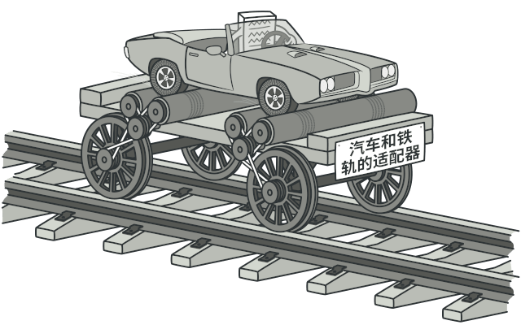
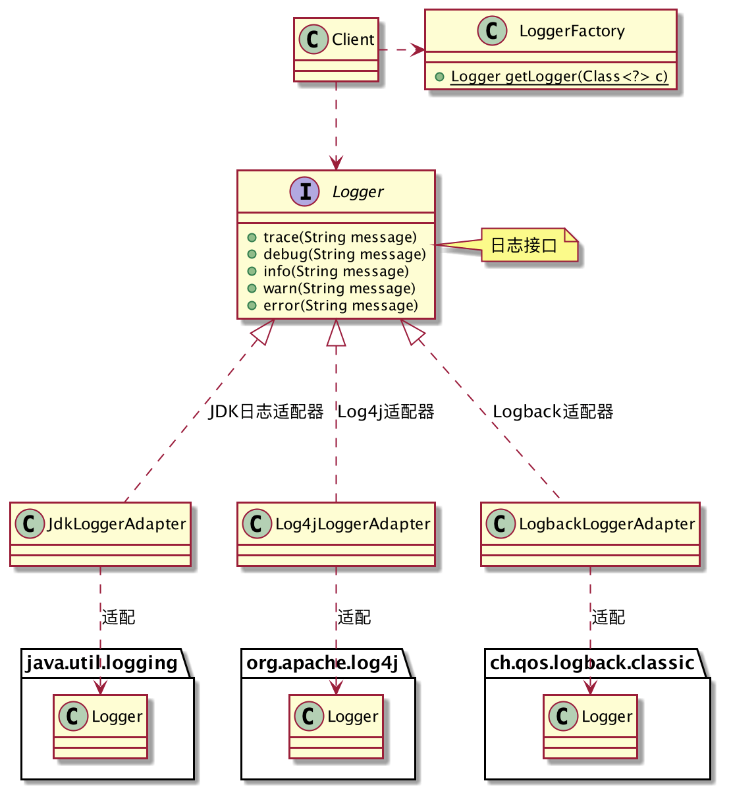
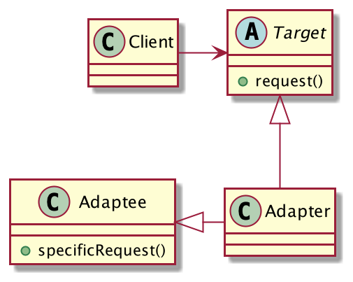
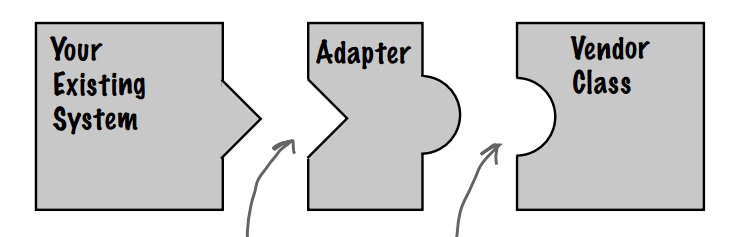

## 日志适配器
在系统设计之初，开发者就需要考虑到这一点：**封装日志抽象，为第三方日志框架做适配**。防止日后更换日志框架时带来的灾难。

我不管第三方日志框架是如何实现的，我只需要定义我们系统日志需要具备哪些功能即可，如果要引入三方库，就把它适配成我们系统需要的。

事实上，SLF4J就是这么做的，它本身并不提供日志功能，它是一个「简单日志门面」，只是将三方库适配成了它定义的日志接口。本篇不会讨论SLF4J的实现。

现在假设系统可能需要三种日志实现：JDK日志、Log4j、Logback，我们试着用代码来描述这个适配的过程，类图设计如下：



编写`Logger`接口，定义日志具备的功能

```java
public interface Logger {

	void trace(String message);

	void debug(String message);

	void info(String message);

	void warn(String message);

	void error(String message, Throwable t);
}
```
`JdkLoggerAdapter`适配JDK日志
```java
public class JdkLoggerAdapter implements Logger{
	private java.util.logging.Logger logger;

	public JdkLoggerAdapter(java.util.logging.Logger logger) {
		this.logger = logger;
	}

	@Override
	public void trace(String message) {
		logger.log(Level.FINEST, message);
	}

	@Override
	public void debug(String message) {
		logger.log(Level.CONFIG, message);
	}

	@Override
	public void info(String message) {
		logger.log(Level.INFO, message);
	}

	@Override
	public void warn(String message) {
		logger.log(Level.WARNING, message);
	}

	@Override
	public void error(String message, Throwable t) {
		logger.log(Level.SEVERE, message, t);
	}
}
```
`Log4jLoggerAdapter`适配Log4j日志
```java
public class Log4jLoggerAdapter implements Logger{
	private org.apache.log4j.Logger logger;

	public Log4jLoggerAdapter(org.apache.log4j.Logger logger) {
		this.logger = logger;
	}

	@Override
	public void trace(String message) {
		logger.trace(message);
	}

	@Override
	public void debug(String message) {
		logger.debug(message);
	}

	@Override
	public void info(String message) {
		logger.info(message);
	}

	@Override
	public void warn(String message) {
		logger.warn(message);
	}

	@Override
	public void error(String message, Throwable t) {
		logger.error(message, t);
	}
}
```
`LogbackLoggerAdapter`适配Logback日志
```java
public class LogbackLoggerAdapter implements Logger{
	private ch.qos.logback.classic.Logger logger;

	public LogbackLoggerAdapter(ch.qos.logback.classic.Logger logger) {
		this.logger = logger;
	}

	@Override
	public void trace(String message) {
		logger.trace(message);
	}

	@Override
	public void debug(String message) {
		logger.debug(message);
	}

	@Override
	public void info(String message) {
		logger.info(message);
	}

	@Override
	public void warn(String message) {
		logger.warn(message);
	}

	@Override
	public void error(String message, Throwable t) {
		logger.error(message, t);
	}
}
```
定义日志枚举
```java
public enum LogEnum {
	LOG4J,
	LOGBACK,
	JDK;
}
```
如何优雅的生成日志对象呢？当然是日志工厂了。
```java
public class LoggerFactory {
	private static LogEnum logEnum;

	public static void setLogEnum(LogEnum logEnum) {
		LoggerFactory.logEnum = logEnum;
	}

	public static Logger getLogger(Class<?> c) {
		switch (logEnum) {
			case JDK:
				return new JdkLoggerAdapter(java.util.logging.Logger.getLogger(c.getName()));
			case LOG4J:
				return new Log4jLoggerAdapter(org.apache.log4j.Logger.getLogger(c));
			case LOGBACK:
				return new LogbackLoggerAdapter(new LoggerContext().getLogger(c));
			default:
				return null;
		}
	}
}
```
客户端调用
```java
public class Client {
	public static void main(String[] args) throws Exception {
		LoggerFactory.setLogEnum(LogEnum.JDK);
		Logger logger = LoggerFactory.getLogger(Client.class);
		logger.info("JDK 日志...");
	}
}
```
客户端完全不关心底层到底用的是什么日志框架，它只依赖日志抽象，只知道日志具备5个记录方法，至于到底是如何记录日志的，管我什么事呢？你只管把三方库适配成我想要的接口，我只负责调用。

这就是适配器模式！

## 适配器模式的定义
> 将一个类的接口变换成客户端所期待的另一种接口，从而使原本因接口不匹配而无法在一起工作的两个类能够在一起工作。



**适配器模式通用类图**

- Target：目标接口，也就是适配器需要将其他接口转换成的期望接口。
- Adapter：适配器角色，适配器模式的核心。
- Adaptee：源角色，实际干活的人，适配器需要将其转换成目标接口。

适配器在生活中也很常见，例如：电源适配器，3.5mm转Type-C耳机线等。简单地说，适配器模式就是将接口或类转换成另一种接口或类。

如下图，两个不能一起工作的图形，通过一个适配器的加入可以协同工作了。


## 适配器模式的优点

1. 可以在不修改源码的情况下让两个原本不能协同工作的类一起工作，符合「开闭原则」。
2. 对高层模块屏蔽底层实现，适配器对源对象进行了封装。
3. 提高了类的复用性。
4. 非常灵活，适配器对现有代码无侵入性，现有对象无需知道适配器的存在，哪天不想用了直接删掉即可。

只要你想修改一个已经上线运行的接口，你就可以考虑使用「适配器模式」。
## 总结
「适配器模式」是一种补救方案，针对已经上线的接口，如果修改源码风险很大，则可以考虑使用适配器模式来进行调整，在系统设计之初请忘记它的存在吧！
