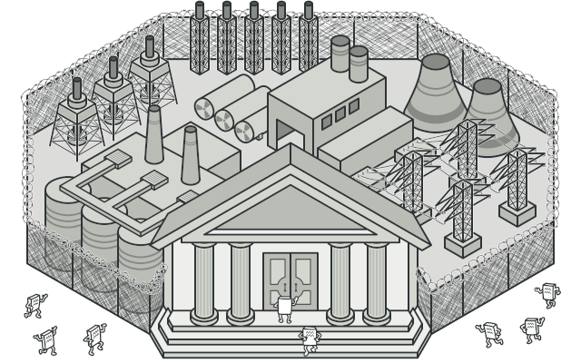
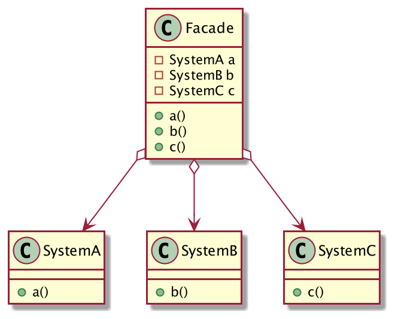

> 外观模式也叫门面模式，主要解决的是降低调用方的使用接口的复杂逻辑组合。这样调用方与实际的接口提供方提供方提供了一个中间层，用于包装逻辑提供API接口。有些时候外观模式也被用在中间件层，对服务中的通用性复杂逻辑进行中间件层包装，让使用方可以只关心业务开发。

## 简化复杂子系统的访问
还记得在2019年的时候，我给政府部门开发过一个「人才津贴申报」系统，目的是帮助地方城市吸引人才，招贤纳士。地方城市将人才分为了好几类，不同类别的人才享受的津贴是不一样的，例如「硕士生」和「博士生」到手的津贴就相差甚远，如果是获得过国家级奖项的人才，会直接分配房子。

无论如何，所有的津贴领取都有两个相同的前提条件：1.在当地缴纳社保，2.无犯罪记录。如果是分配住房，就会再增加一个条件，就是本人和配偶名下无房产。所以为了开发这套系统，我需要和社保局、公安部、住建部做对接，调用他们的接口来获取个人数据，以判断个人是否符合领取津贴的条件。

我们用代码来描述这个过程，类图设计的非常简单，如下：


客户端需要访问三个系统接口，以此来判断个人是否符合条件领取津贴。

```java
public class SheBaoSystem {

	public void getSBInfo() {
		System.out.println("查询社保,获取个人社保信息...");
	}
}

public class ZhuJianSystem {

	public void getZJInfo() {
		System.out.println("查询住建部,获取个人住房信息...");
	}
}

public class GongAnSystem {

	public void getGAInfo() {
		System.out.println("查询公安部,获取个人犯罪记录信息...");
	}
}
```
客户端调用
```java
public class Client {
	public static void main(String[] args) {
		SheBaoSystem sheBaoSystem = new SheBaoSystem();
		ZhuJianSystem zhuJianSystem = new ZhuJianSystem();
		GongAnSystem gongAnSystem = new GongAnSystem();

		sheBaoSystem.getSBInfo();
		zhuJianSystem.getZJInfo();
		gongAnSystem.getGAInfo();
	}
}
```
客户端可以获取到个人的社保信息、住房信息、犯罪记录等数据，基于这些数据来进行业务判断个人是否符合领取条件，大功告成了。

但是很快同事在开发另一块功能的时候，也需要查询这些数据，但是它并不想知道我是如何跟第三方子系统对接的，问我能不能提供一个统一的接口，他只需要简单的调用就可以获取这些数据呢？

我的回答是：当然可以，我给你写一个简单的外观类吧。

优化后的类图设计如下：


子系统类代码不变，封装一个`Facade`类，来简化客户端对复杂的第三方系统的调用。

```java
public class Facade {
    private SheBaoSystem sheBaoSystem = new SheBaoSystem();
    private ZhuJianSystem zhuJianSystem = new ZhuJianSystem();
    private GongAnSystem gongAnSystem = new GongAnSystem();

    // 获取社保信息
    public void getSBInfo() {
        this.sheBaoSystem.getSBInfo();
    }

    // 获取住房信息
    public void getZJInfo() {
        this.zhuJianSystem.getZJInfo();
    }

    // 获取犯罪记录
    public void getGAInfo() {
        this.gongAnSystem.getGAInfo();
    }
}

```

客户端调用

```java
public class Client {
	public static void main(String[] args) {
		Facade facade = new Facade();
		facade.getSBInfo();
		facade.getZJInfo();
		facade.getGAInfo();
	}
}
```
运行结果不变，客户端调用变得非常简单。现在我只要把`Facade`类提供给同事就行了，它只需要调用外观类就可以获取这些数据了，而无需知道我是如何请求第三方系统来获取这些数据的，这才是一个真正的「高内聚」实现。
## 外观模式的定义
> 要求一个子系统的外部与其内部的通信必须通过一个统一的对象进行。门面模式提供一个高层次的接口，使得子系统更易于使用。



- Facade：外观类，也是客户端调用的类，外观类了解所有子系统的功能，它本身没有逻辑，只是将请求转发给对应的子系统执行。
- System*：子系统类，真正干活的人，子系统不知道外观类的存在。

外观模式非常的简单，它注重的是「统一的对象」，不管子系统多么的复杂，外观模式总是能够提供一个简单的接口供客户端调用。
## 外观模式的优缺点
**优点**

1. 松散耦合，减少了客户端对子系统的依赖，只依赖外观类，简化了客户端的使用。
2. 对高层模块屏蔽了底层实现，子系统的业务修改对于客户端来说是透明的。
3. 提高了灵活性，不管子系统如何变化，只要不影响外观类就可以。
4. 更加的安全了，外观类是子系统的唯一访问入口，对于不想暴露的接口，外观类不开通即可。

**缺点**

外观类会变得非常复杂，外观类成了访问子系统的唯一入口，外观类一旦异常就完蛋了。而且子系统的变更一旦影响到外观类，外观类就不得不修改了，这一旦违反了「开闭原则」。

## 总结
如果你想为一个复杂的模块或子系统提供一个供外界访问的简单接口，你就可以考虑使用外观模式。

外观模式还可以预防低水平的开发者带来的风险扩展，禁止新人直接调用系统的核心模块，只提供一个外观类给其操作。

使用外观模式时，有一点是开发者经常忽略的，就是「**严禁在外观类中写任何逻辑**」，外观类应该只负责转发请求，一旦有了业务逻辑，就意味着子系统必须依赖外观类才能被访问，依赖被倒置了，这是设计上的缺陷，不仅违反了「单一职责」，还破坏了系统的封装性。
