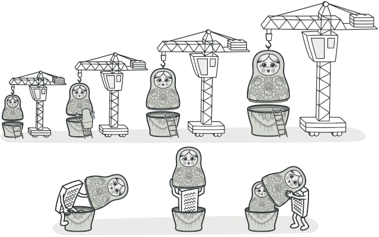
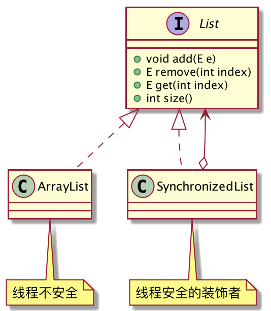
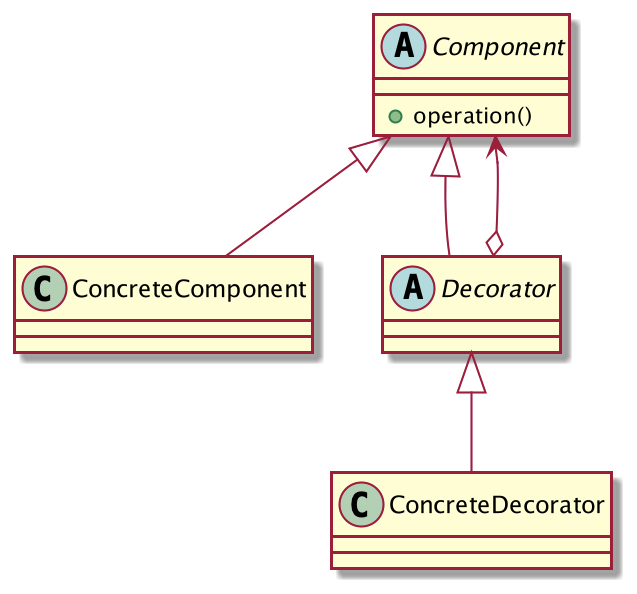

## 包装线程不安全的类
集合容器应该是程序员使用最频繁的工具类了，需要注意的是，大家平常使用的大部分容器都是线程不安全的，例如ArrayList、HashMap等，如果涉及到对容器的并发访问，开发者需要做好同步控制，否则程序会出现异常。

当然了，你也完全可以选择使用`J.U.C`包下提供的线程安全的集合容器，但是我们今天不讨论这个，而是换一个思路，看看如何通过「装饰者模式」来巧妙的将一个线程不安全的类包装成线程安全的。

本文会以`List`列表举例，但由于JDK提供的`List`接口太复杂，因此这里不用JDK提供的，而是自己手写实现一个，功能会做精简，旨在理解装饰者模式的思想。
程序的整体类图如下：



编写`List`接口，定义列表具有的功能：

```java
public interface List<E> {

	// 添加元素
	void add(E e);

	// 删除元素
	E remove(int index);

	// 获取元素
	E get(int index);

	// 元素个数
	int size();
}
```
基于数组的`ArrayList`实现类：
```java
// NotThreadSafe
public class ArrayList<E> implements List<E> {
	private Object[] table = new Object[1 << 4];//初始容量
	private int size;

	@Override
	public void add(E e) {
		table[size++] = e;
		if (size >= table.length) {
			// 扩容
			Object[] newTable = new Object[table.length << 1];
			System.arraycopy(table, 0, newTable, 0, table.length);
			table = newTable;
		}
	}

	@Override
	public E remove(int index) {
		E oldValue = (E) table[index];
		int numMoved = size - index - 1;
		if (numMoved > 0)
			System.arraycopy(table, index + 1, table, index, numMoved);
		table[--size] = null;
		return oldValue;
	}

	@Override
	public E get(int index) {
		if (index >= size) {
			throw new IndexOutOfBoundsException("size:" + size + ",index:" + index);
		}
		return (E) table[index];
	}

	@Override
	public int size() {
		return size;
	}

	@Override
	public String toString() {
		StringJoiner sj = new StringJoiner(",");
		for (int i = 0; i < size; i++) {
			sj.add(table[i].toString());
		}
		return "{" + sj + "}";
	}
}
```
客户端调用
```java
public class Client {
	public static void main(String[] args) throws IOException {
		List<Integer> list = new ArrayList<>();
        list.add(1);
        list.add(2);
        list.add(3);
        System.out.println(list);
	}
}
```
非常简单，功能也正常，但是有一个问题，ArrayList的实现是线程不安全的，如果有多个线程并发访问列表，程序可能会抛异常。

例如多线程并发`add()`时，如果线程A在扩容期间，线程B也要调用`add()`插入元素，就会导致数组下标越界，程序抛出异常

```java
List<Integer> list2 = new ArrayList<>();
for (int i = 0; i < 50; i++) {
    new Thread(() -> {
        for (int k = 0; k < 1000; k++) {
            list2.add(k);
        }
    }).start();
}
```
```
Exception in thread "Thread-7" java.lang.ArrayIndexOutOfBoundsException: 4096
	at designpattern.decorator.ArrayList.add(ArrayList.java:11)
	at designpattern.decorator.Client.lambda$main$0(Client.java:16)
	at java.lang.Thread.run(Thread.java:748)
Exception in thread "Thread-25" java.lang.ArrayIndexOutOfBoundsException: 16384
	at designpattern.decorator.ArrayList.add(ArrayList.java:11)
	at designpattern.decorator.Client.lambda$main$0(Client.java:16)
	at java.lang.Thread.run(Thread.java:748)
```
如果现在需要一个线程安全的列表容器，需要怎么做呢？修改`ArrayList`代码？加上`synchronized`关键字？

首先，修改源码这违反了「开闭原则」，其次，不是所有的地方都需要线程安全的容器，同步会影响性能，如果系统又需要一个不安全的列表容器，你又要怎么做？
「对扩展开放，对修改关闭」，我们能否再派生一个`List`子类，来对原`List`对象做一个装饰，让其所有的操作都串行化执行，具备同步的性质呢？答案是：当然可以！

**主角登场，SynchronizedList，List的装饰者**

```java
public class SynchronizedList<E> implements List<E> {
	private final List<E> list;

	public SynchronizedList(List<E> list) {
		this.list = list;
	}

	@Override
	public synchronized void add(E e) {
		this.list.add(e);
	}

	@Override
	public synchronized E remove(int index) {
		return this.list.remove(index);
	}

	@Override
	public synchronized E get(int index) {
		return this.list.get(index);
	}

	@Override
	public synchronized int size() {
		return this.list.size();
	}

	@Override
	public synchronized String toString() {
		return this.list.toString();
	}
}
```
客户端调用
```java
List<Integer> list3 = new SynchronizedList<>(new ArrayList<>());
list3.add(1);
list3.add(2);
list3.add(3);
System.out.println(list3);
```
## 装饰者模式的定义
> 动态地给一个对象添加一些额外的职责。就增加功能来说，装饰模式相比生成子类更为灵活。



- Component：抽象组件定义，定义组件具有的功能。
- ConcreteComponent：具体的组件，真正干活的角色，也是被装饰的对象。
- Decorator：抽象装饰者。
- ConcreteDecorator：具体的装饰者，对被装饰的对象进行功能的增强。

装饰者模式可以在不修改源码的情况下，对类进行增强。而且相较于继承来说，装饰者模式会更加的灵活。
## 装饰者模式的优缺点
**优点**

1. 比继承灵活，Java只能单继承，装饰者模式则没有这个限制。
2. 可以对`final`类或方法进行增强，继承却不行。
3. 装饰类和被装饰类可以独立发展，互不影响。被装饰类无需知道装饰类的存在，装饰类也无需知道被装饰的具体对象，而是依赖其抽象。

**缺点**

一个对象是可以被装饰多次的，即可以通过多个装饰类来对对象进行嵌套装饰，实现增强功能的叠加。这么做的缺点就是系统会变得复杂，调试困难，排查错误时需要一层一层"剥开"装饰者。

## 总结
装饰者模式可以在不修改源码的情况下对类进行增强，是「开闭原则」的直接体现，只要你需要对类进行增强，就可以考虑使用装饰者模式。

装饰者模式是对继承的有力补充，它没有「单继承」的限制，而且可以对`final`修饰的类或方法进行增强，扩展性非常的好。

