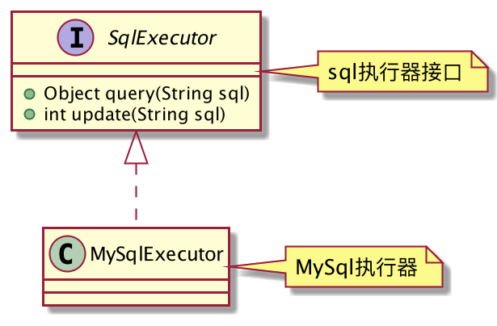
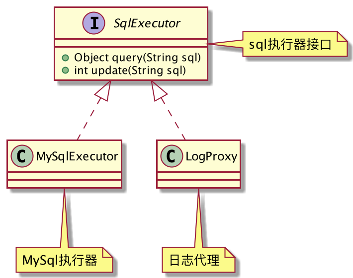
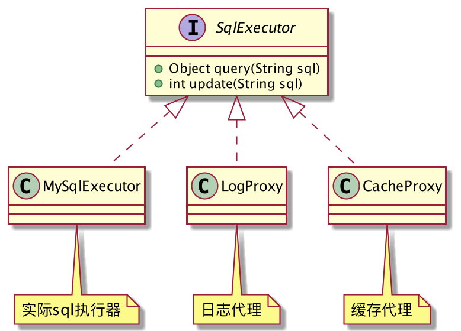
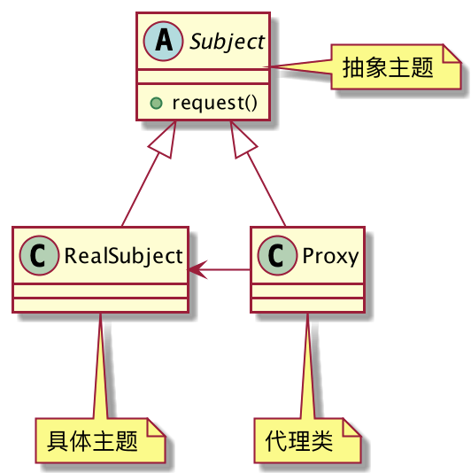

## MySql代理
后端开发人员避免不了要和数据库打交道，MySQL就是时下非常流行的关系型数据库。

假设现有一个SQL语句执行器，它支持两种操作：查询和写入。




```java
public interface SqlExecutor {
	// 读操作
	Object query(String sql);
	// 写操作
	int update(String sql);
}
public class MySqlExecutor implements SqlExecutor {
	@Override
	public Object query(String sql) {
		// 查询DB...
		return new Object();
	}
	@Override
	public int update(String sql) {
		// 修改DB...
		return 1;
	}
}
```
现在有一个新的需求，需要将`SqlExecutor`执行的SQL语句输出到控制台，以便调试。

你要怎么做？直接修改`MySqlExecutor`吗？这不符合开闭原则。

正确的做法应该是创建一个代理类`LogProxy`，由它来完成SQL语句的输出。



```java
public class LogProxy implements SqlExecutor {
	private SqlExecutor target;
	public LogProxy(SqlExecutor executor) {
		this.target = executor;
	}
	@Override
	public Object query(String sql) {
		System.out.println("查询sql:" + sql);
		return target.query(sql);
	}
	@Override
	public int update(String sql) {
		System.out.println("修改sql:" + sql);
		return target.update(sql);
	}
}
```
现在又有一个新的需求，对于重复的SQL查询，可以将查询结果缓存起来，下次再查询时直接从缓存中获取结果。

又去改`SqlExecutor`源码？别忘了，那不符合开闭原则，通过代理对象来增强即可。




```java
public class CacheProxy implements SqlExecutor {
	private Map<String, Object> cache = new ConcurrentHashMap<>();
	private SqlExecutor target;
	public CacheProxy(SqlExecutor executor) {
		this.target = executor;
	}
	@Override
	public Object query(String sql) {
		if (cache.containsKey(sql)) {
			System.out.println("命中缓存...");
			return cache.get(sql);
		}
		Object result = target.query(sql);
		cache.put(sql, result);
		return result;
	}
	@Override
	public int update(String sql) {
		System.out.println("缓存失效...");
		cache.clear();
		return target.update(sql);
	}
}
```
客户端调用：
```java
public class Client {
	public static void main(String[] args) {
		// 支持日志
		SqlExecutor log = new LogProxy(new MySqlExecutor());
		// 支持缓存
		SqlExecutor cache = new CacheProxy(new MySqlExecutor());
		// 缓存+日志
		SqlExecutor logAndCache = new CacheProxy(new LogProxy(new MySqlExecutor()));
		logAndCache.query("select * from user where id = 1");
		logAndCache.query("select * from user where id = 1");
		logAndCache.update("update user set name = 'admin' where id = 1");
	}
}
```
这就是代理模式！
## 代理模式的定义
> 为其他对象提供一种代理以控制对这个对象的访问。



**代理模式通用类图**

- Subject：主题抽象，RealSubject和Proxy负责实现。
- RealSubject：具体主题，业务的真正执行者，也是被代理对象。
- Proxy：代理类，负责对RealSubject做增强，原有逻辑还是让RealSubject去执行。

一个代理类具体要代理哪个对象，是由场景类来确定的，一般是通过构造函数来指定被代理对象。
## 代理模式的优点

1. 职责非常清晰，被代理对象只负责自己的业务逻辑，不用关心的或非本职责的事情都交给代理类去完成，符合单一职责原则。
2. 扩展性非常好，只需创建一个代理类就可以增强功能，代理对象还可以代理另一个代理对象，以实现增强功能的传递。
3. 对于功能增强，代理有着比继承更好的灵活性。

如果你要对类进行功能增强，但是这部分功能又不是该类本身的职责范围内的事情，就可以通过创建一个代理类的方式来做。
## JDK动态代理
上述例子属于普通代理实现，它需要开发者编写代理类，实现和被代理类实现的接口，并重写所有方法，然后将方法的执行转发到被代理对象，如果需要实现的方法非常多，还是比较麻烦的。

JDK提供了动态代理的支持，使用`Proxy`和`InvocationHandler`就可以为被代理对象动态的生成一个代理对象，使用非常方便。

**Subject和RealSubject**

```java
public interface Subject {
	void request();
}

public class RealSubject implements Subject {
	@Override
	public void request() {
		System.out.println("RealSubject request...");
	}
}
```
**代理类:SubjectProxy**
```java
public class SubjectProxy implements InvocationHandler {
	private Subject target;
	public SubjectProxy(Subject target) {
		this.target = target;
	}
	public Subject getProxy(){
		return (Subject) Proxy.newProxyInstance(this.getClass().getClassLoader(), new Class[]{Subject.class}, this);
	}
	@Override
	public Object invoke(Object proxy, Method method, Object[] args) throws Throwable {
		before();
		Object result = method.invoke(target, args);
		after();
		return result;
	}
	private void before(){
		System.out.println("前置增强");
	}
	private void after(){
		System.out.println("后置增强");
	}
}
```
客户端调用：
```java
public class Client {
	public static void main(String[] args) {
		Subject proxy = new SubjectProxy(new RealSubject()).getProxy();
		proxy.request();
	}
}
```
## 总结
代理模式应用的非常广泛，最经典的例子就是Spring的AOP技术了，它可以在不修改源码的情况下对系统进行功能的增强，底层就是通过生成代理对象来完成的，只要你调试的时候发现代理类的类名为`$Proxy0`就说明它是一个代理对象。

一句话总结就是，如果你需要对类进行增强，但是增强的功能不属于类本身的职责范畴，就可以考虑使用代理模式来实现。
