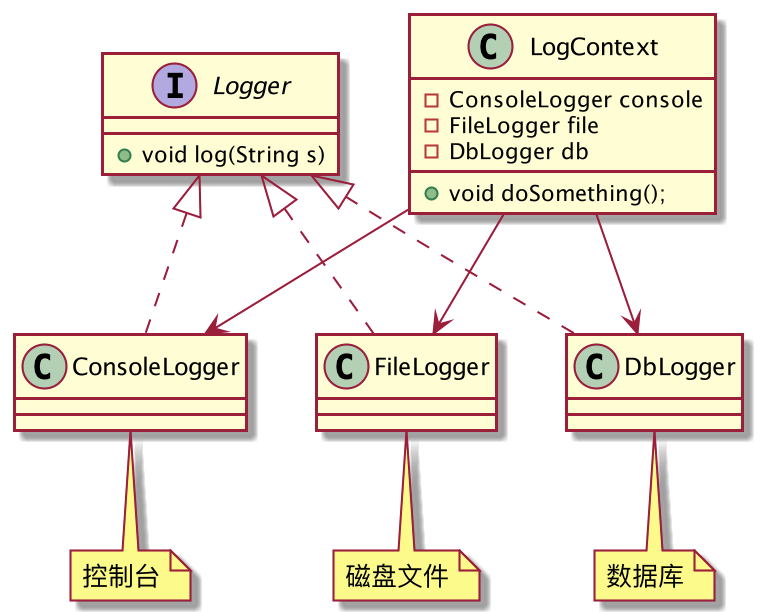
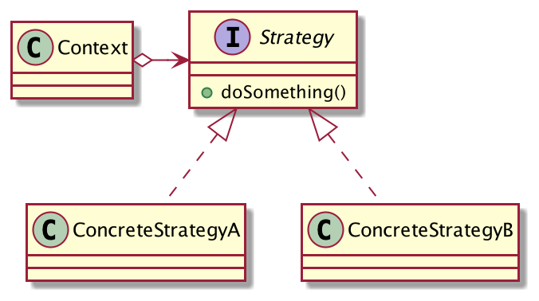

## 记录日志的N种方式
维护过线上系统的同学应该都清楚日志的重要性，它可以帮助我们在系统异常时快速定位到问题，并进行解决。

对于不同的环境，记录日志的方式也是不一样的，这里列举三种情况：

1. 开发环境，控制台输出日志即可。
2. 线上环境，日志持久化到磁盘文件，方便后期排查问题。
3. 日志要做离线分析，需要存入数据库。

我们试着用代码来描述这个过程，类图设计如下：



编写`Logger`接口，定义日志具有的功能：

```java
public interface Logger {
	void log(String s);
}
```
编写实现类，有三种记录日志的方式：
```java
// 单纯的控制台输出日志
public class ConsoleLogger implements Logger {
	@Override
	public void log(String s) {
		System.out.println(s);
	}
}
// 磁盘文件记录日志
public class FileLogger implements Logger {
	private static final File file = new File(System.getProperty("user.dir"), "system.log");
	@Override
	public void log(String s) {
		FileUtil.writeUtf8String(s, file);
	}
}
// 数据库记录日志
public class DbLogger implements Logger {
	Connection connection;
	@Override
	public void log(String s) {
		try {
			connection.prepareStatement("insert into t_log values (...)").execute();
		} catch (SQLException e) {
			e.printStackTrace();
		}
	}
}
```
定义`LogContext`日志上下文对象：
```java
public class LogContext {
	private Logger console = new ConsoleLogger();
	private Logger file = new FileLogger();
	private Logger db = new DbLogger();
	public void doSomething(int type, String arg) {
		if (type == 1) {
			console.log(arg);
		} else if (type == 2) {
			file.log(arg);
		} else if (type == 3) {
			db.log(arg);
		}
	}
}
```
客户端这样调用：
```java
public class Client {
	public static void main(String[] args) {
		LogContext logContext = new LogContext();
		logContext.doSomething(1, "console");
		logContext.doSomething(2, "file");
		logContext.doSomething(3, "db");
	}
}
```
OK，功能完成，现在我们重新审视一下代码，有没有什么问题？

`LogContext`严重依赖于各种日志实现类，而且存在大量的if分支，如果以后要将日志存入ElasticSearch，就要修改`LogContext`的代码，分支也要增加，代码可读性降低，违反了「开闭原则」。

LogContext应该只依赖`Logger`抽象，只负责记录日志，但是日志以何种方式记录，它并不关心。

`LogContext`修改如下：

```java
public class LogContext {
	private Logger logger;
	// 设置日志策略
	public void setLogger(Logger logger) {
		this.logger = logger;
	}
	public void doSomething(String arg) {
		logger.log(arg);
	}
}
```
客户端这样调用：
```java
public class Client {
	public static void main(String[] args) {
		LogContext logContext = new LogContext();
		logContext.setLogger(new ConsoleLogger());
		logContext.doSomething("console");
		logContext.setLogger(new FileLogger());
		logContext.doSomething("file");
		logContext.setLogger(new DbLogger());
		logContext.doSomething("db");
	}
}
```
`LogContext`变的非常简单，消除了if分支，只依赖`Logger`抽象，不关心日志实现，哪怕后续再新增日志记录策略，它也无需修改。

这就是策略模式！

## 策略模式的定义
> 定义一组算法，将每个算法都封装起来，并且使它们之间可以互换。



**策略模式通用类图**

- Context：封装的上下文角色，避免高层模块对算法策略的直接访问。
- Strategy：策略抽象，定义所有策略具有的功能。
- ConcreteStrategy：具体策略，真正的逻辑实现者。

策略模式的定义非常简单清晰，定义一组算法：三种日志的不同实现逻辑就是一组算法。使它们能够互换：当然可以互换，Context只依赖策略抽象，具体策略可以随时更换，Context并不关心。
## 策略模式的优缺点
**优点**
1. 策略可以自由切换，封装类不用改，符合开闭原则。
2. 消除if分支判断，提高代码的可读性。
3. 扩展性良好，只需派生`Strategy`子类就可以增加一种策略。

**缺点**
1. 每个策略都需要新建一个类，容易导致类的数量膨胀。
2. 所有的策略都需要暴露给客户端，以让客户端来选择其中一个策略。

如果你发现系统的某一处算法逻辑需要频繁的切换，或者后续可能会改变算法逻辑，就可以考虑使用策略模式。

例如：发短信功能，就可以定义两种策略：

1. 调用第三方SDK发送短信，扣费。
2. 仅仅输出短信到控制台，不发送。

开发环境时，为了节省费用，可以使用策略2，线上环境使用策略1。你肯定不想每次切换策略时都要修改所有调用短信的代码吧，借助Spring的依赖注入功能，开发环境和线上环境修改配置即可，一键切换策略，非常奈斯。
## 策略枚举
策略模式还有一种扩展实现，那就是「策略枚举」。

针对上述的日志策略实现，可以优化为如下：

```java
public interface Logger {
	void log(String s);
}

public enum LoggerEnum implements Logger {
	CONSOLE(){
		@Override
		public void log(String s) {
			System.out.println("控制台输出日志");
		}
	},
	FILE(){
		@Override
		public void log(String s) {
			System.out.println("日志写入文件");
		}
	},
	DB(){
		@Override
		public void log(String s) {
			System.out.println("日志写入数据库");
		}
	};
}
```
也可以不直接继承接口
```java
public enum LoggerEnum {
	CONSOLE(){
		@Override
		public void log(String s) {
			System.out.println("控制台输出日志");
		}
	},
	FILE(){
		@Override
		public void log(String s) {
			System.out.println("日志写入文件");
		}
	},
	DB(){
		@Override
		public void log(String s) {
			System.out.println("日志写入数据库");
		}
	};
    
    abstract void log(String s);
}
```

客户端使用：
```java
public class Client {
	public static void main(String[] args) {
		LoggerEnum.CONSOLE.log("console");
		LoggerEnum.FILE.log("file");
		LoggerEnum.DB.log("db");
	}
}
```
非常的简单清晰，完全的面向对象操作。
## Map+函数式接口
定义枚举(也可不定义直接使用)
```java
@Getter
@AllArgsConstructor
public enum LoggerEnum {
    CONSOLE, FILE, DB
}
```
具体的逻辑操作 此处的 id 是为了实现入参功能
```java
@Service
public class LoggerService {

    public String console(String id) {
        return "控制台输出日志" + id;
    }

    public String file(String id) {
        return "日志写入文件" + id;
    }

    public String db(String id) {
        return "日志写入数据库" + id;
    }
}
```

```java
@Service
public class QueryLoggerService {

    // @Resource
    private LoggerService loggerService = new LoggerService();
    /**
     * 四大函数式接口
     * 有入参出参使用:Function<T, R>
     * 只有入参使用:Consumer<T>
     * 只有出参使用:Supplier<T>
     */
    private final Map<LoggerEnum, Function<String, String>> loggerMap = new HashMap<>();

    /**
     * 初始化业务分派逻辑,代替了if-else部分
     * key: 优惠券类型,这里使用了枚举
     * value: lambda表达式
     */
    // @PostConstruct
    public void dispatcherInit() {
        loggerMap.put(LoggerEnum.CONSOLE, resourceId -> loggerService.console(resourceId));
        loggerMap.put(LoggerEnum.FILE, resourceId -> loggerService.file(resourceId));
        loggerMap.put(LoggerEnum.DB, resourceId -> loggerService.db(resourceId));
    }

    public String getResult(LoggerEnum logger, String id) {
        //Controller根据 日志类型logger、入参 id 去查询 输出方式
        Function<String, String> result = loggerMap.get(logger);
        if (result != null) {
            //传入id 执行这段表达式获得String型的内容
            return result.apply(id);
        }
        return "查询不到日志类型";
    }
}
```
测试调用
```java
public class Client {
    public static void main(String[] args) {
        // 假装@Resource
        QueryLoggerService service = new QueryLoggerService();
        // 假装执行了@PostConstruct
        service.dispatcherInit();
        System.out.println(service.getResult(LoggerEnum.CONSOLE, "10001"));
    }
}
```
## 总结
策略模式非常简单，应用范围也很广，它没有什么玄机，就是用到了Java的「继承」和「多态」的特性。

策略模式可以分离程序中「变与不变」的部分，将易变的算法策略抽象出来，上下文只依赖其抽象，而不关心实现，提高系统的稳定性。

策略模式最大的一个缺点就是必须将所有的策略都暴露给客户端，好让客户端可以选择一个具体的策略去使用。当策略过多时，客户端调用会非常迷惑，不知道该使用哪一个策略，可以使用工厂模式或享元模式来优化。

