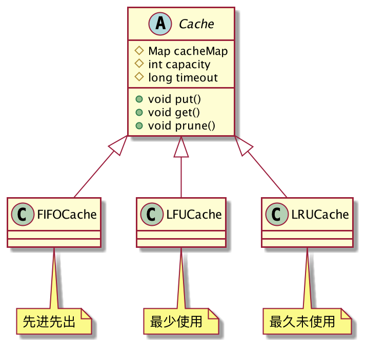
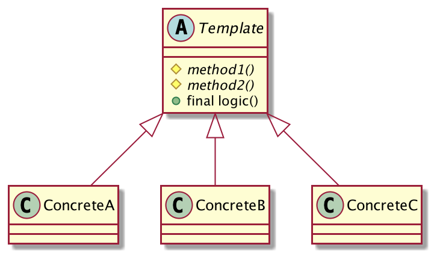

## 缓存淘汰策略有哪些？
之前做项目时，系统需要用到【支持超时的缓存】功能，本来使用Redis是非常适合的，但是由于系统技术较老旧，没有用到Redis，也不想因为这一个小场景去引入Redis，于是决定自己手写一个简单的缓存功能。
需求：

1. 基于内存的缓存功能。
2. 支持超时。
3. 缓存写满后启用淘汰机制清理缓存。
4. 需要支持多种淘汰策略，例如：FIFO、LFU、LRU等。

分析一下需求，首先是可以自定义：容量和超时时间，利用Map容器来存放缓存对象，当缓存数量达到上限后，启用淘汰机制清理缓存。这些步骤是所有缓存类共用的，唯一的不同是：**不同的子类淘汰策略不一样**。

因此，我们完全可以将公共的逻辑写在父类，让子类实现自己特有的逻辑即可，实现代码复用，避免冗余代码。



定义`Cache`抽象类，定义公共的属性，实现公共逻辑。

```java
public abstract class Cache<K, V> {
	protected final Map<K, CacheObj<K, V>> cacheMap = new ConcurrentHashMap<>();//容器
	protected int capacity;//容量
	protected long timeout;//过期时间 纳秒
	public Cache(int capacity, long timeout) {
		this.capacity = capacity;
		this.timeout = timeout;
	}
	// 添加元素
	public void put(K k, V v) {
		if (isFull()) {
			// 满了就清理
			prune();
		}
		cacheMap.put(k, new CacheObj<>(k, v, timeout));
	}
	// 获取元素
	public V get(K k) {
		CacheObj<K, V> cacheObj = cacheMap.get(k);
		if (cacheObj == null) {
			return null;
		}
		return cacheObj.get();
	}
	// 容器清理，子类不允许重写
	public final int prune() {
		// 优先清理已过期的
		Iterator<CacheObj<K, V>> iterator = cacheMap.values().iterator();
		int count = 0;
		while (iterator.hasNext()) {
			CacheObj<K, V> next = iterator.next();
			if (next.isExpired()) {
				iterator.remove();
				count++;
			}
		}
		if (isFull()) {
			// 还是满，执行子类强制清除算法
			return count + forcePrune();
		}
		return count;
	}
	// 强制清理，子类实现淘汰策略
	protected abstract int forcePrune();
	// 容器是否满了
	protected boolean isFull() {
		return cacheMap.size() >= capacity;
	}
}
```
上述代码中，`prune()`就是一个模板方法，它定义了一个算法骨架：首先遍历容器中所有的缓存，先清理一遍已过期的缓存，如果容器还是满的，则调用子类的淘汰算法，强制清理，至于子类的淘汰算法如何实现，父类并不关心。

编写`CacheObj`，用来包装缓存对象，记录缓存是什么时候产生的，访问了的次数，最后一次访问是什么时候，这些都是为后期的淘汰算法准备的。

```java
public class CacheObj<K,V> {
	private final K k;
	private final V v;
	private final long expire;//过期时间
	private AtomicLong accessCount;// 访问次数
	private long createTime;// 生成时间
	private long lastTime;// 最近一次访问时间
	public CacheObj(K k,V v, long expire) {
		this.k = k;
		this.v = v;
		long now = System.nanoTime();
		this.expire = now + TimeUnit.MILLISECONDS.toNanos(expire);
		accessCount = new AtomicLong(0);
		lastTime = createTime = now;
	}
	// 获取缓存对象，如果过期则不返回
	public V get() {
		if (expire - System.nanoTime() < 0) {
			return null;
		}
		accessCount.incrementAndGet();
		lastTime = System.nanoTime();
		return v;
	}
	public K getKey() {
		return k;
	}
	public V getValue() {
		return v;
	}
	// 是否过期
	public boolean isExpired(){
		return System.nanoTime() - expire > 0;
	}
	public long getCreateTime() {
		return createTime;
	}
	public long getLastTime() {
		return lastTime;
	}
	public long getAccessCount() {
		return accessCount.get();
	}
}
```
接下来就是各种子类实现了：

**先进先出**

```java
public class FIFOCache<K,V> extends Cache<K,V>{
	public FIFOCache(int capacity, long timeout) {
		super(capacity, timeout);
	}
	@Override
	protected int forcePrune() {
		Iterator<CacheObj<K, V>> iterator = cacheMap.values().iterator();
		long firstTime = Long.MAX_VALUE;
		CacheObj<K, V> first = null;
		while (iterator.hasNext()) {
			CacheObj<K, V> next = iterator.next();
			if (next.getCreateTime() < firstTime) {
				first = next;
				firstTime = next.getCreateTime();
			}
		}
		if (first != null) {
			cacheMap.remove(first.getKey());
			return 1;
		}
		return 0;
	}
}
```
**最少使用**
```java
public class LFUCache<K, V> extends Cache<K, V> {
	public LFUCache(int capacity, long timeout) {
		super(capacity, timeout);
	}
	@Override
	protected int forcePrune() {
		Iterator<CacheObj<K, V>> iterator = cacheMap.values().iterator();
		long leastAccess = Long.MAX_VALUE;
		CacheObj<K, V> item = null;
		while (iterator.hasNext()) {
			CacheObj<K, V> next = iterator.next();
			if (next.getAccessCount() < leastAccess) {
				item = next;
				leastAccess = next.getAccessCount();
			}
		}
		if (item != null) {
			cacheMap.remove(item.getKey());
			return 1;
		}
		return 0;
	}
}
```
**最久未使用**
```java
public class LRUCache<K, V> extends Cache<K, V> {
	public LRUCache(int capacity, long timeout) {
		super(capacity, timeout);
	}
	@Override
	protected int forcePrune() {
		Iterator<CacheObj<K, V>> iterator = cacheMap.values().iterator();
		long lastTime = Long.MAX_VALUE;
		CacheObj<K, V> last = null;
		while (iterator.hasNext()) {
			CacheObj<K, V> next = iterator.next();
			if (next.getLastTime() < lastTime) {
				last = next;
				lastTime = next.getLastTime();
			}
		}
		if (last != null) {
			cacheMap.remove(last.getKey());
			return 1;
		}
		return 0;
	}
}
```
客户端调用，程序完成。
```java
public class Client {
	public static void main(String[] args) {
		Cache<Integer, Object> cache = new FIFOCache<>(10, 1000);
		cache.put(1, new Object());
		Object o = cache.get(1);
	}
}
```
可以看到，缓存的大部分公用逻辑都在基类`Cache`中实现了，子类只需要实现自己的淘汰算法即可，如果要再新增一种淘汰策略也非常方便，继承`Cache`类，编写自己的淘汰算法即可，非常方便。

这就是模板方法模式！

## 模板方法模式的定义
> 定义一个操作中的算法的框架，而将一些步骤延迟到子类中。使得子类可以不改变一个算法的结构即可重定义该算法的某些特定步骤。



**模板方法模式通用类图**

- Template：模板类，它的方法分为两种：基本方法和模板方法。基本方法如：`method1()`、`method2()`是子类可以自定义实现的方法，模板方法如`logic()`，它是一个算法骨架，完成固定的逻辑，子类是不可以重写的。
- Concrete*：具体模板类，实现父类定义的基本方法，完成特有的逻辑和功能。

**注意：为了防止子类恶意破坏，模板方法一般定义为**`final`**，禁止子类重写算法骨架。基本方法一般定义为**`protected`**，符合迪米特法则，不需要对客户端暴露。**

## 模板方法模式的优缺点
**优点**

1. 分离程序中变与不变的部分。将固定不变的算法骨架封装在基类中，将可变的逻辑由子类扩展实现，符合开闭原则。
2. 代码复用，避免冗余代码，将公共代码提取到基类，也便于维护。
3. 类的整体行为由基类控制，特定的细节实现又子类扩展。
4. 子类扩展非常简单，无需了解基类复杂的算法。

**缺点**

在模板方法模式中，子类的实现可能会改变父类的行为，这会使代码的阅读变得困难，调试也相对不易。

## 总结
模板方法模式应用非常广泛，在很多开源框架中都能看到它的身影。

当多个子类有相同的逻辑时，就应该考虑使用模板方法模式，将公共可复用的逻辑提取到父类，子类只负责实现自己特有的细节即可。

对于一些非常重要或复杂的算法，也建议使用模板方法模式进行封装，避免子类实现困难。

模板方法模式还可以在算法的任意位置调用一些钩子函数来做增强。

