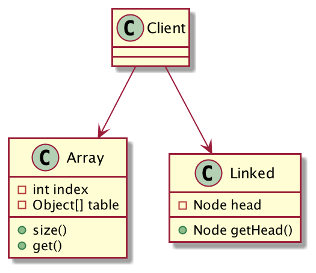
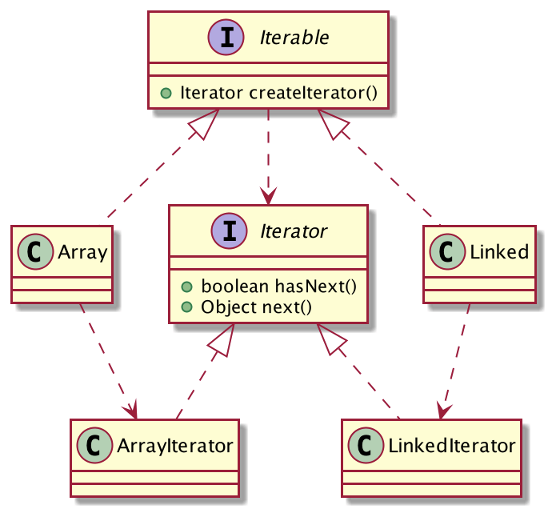
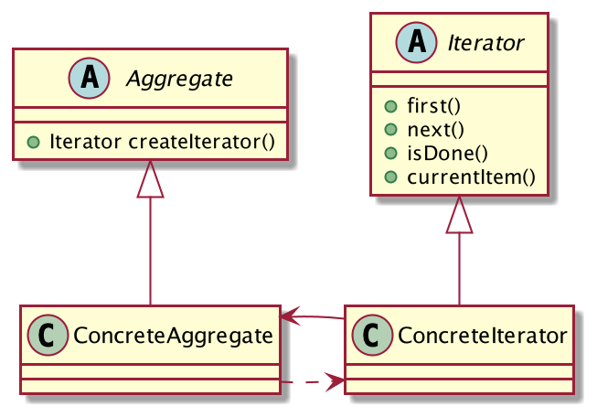

## 遍历容器的统一方式
集合容器算是程序员使用最频繁的工具类之一了，其中列表的话最常用的当属ArrayList和LinkedList吧，算是两种典型的实现，分别是用了数组和链表的结构。容器的功能无非就是两类：存和取，针对不同的底层数据结构实现的容器，开发者需要如何对容器进行遍历呢？如果遍历容器需要开发者对底层数据结构非常清楚的话，会增加开发者的使用门槛。因此，统一容器的遍历方式至关重要。

由于JDK提供的List源码过于复杂，篇幅原因这里就不贴了，而是自己手写实现一个简单的容器，旨在体会迭代器的思想。

假设现在有两种容器：Array和Linked，底层分别是基于数组和链表的数据结构实现的，客户端需要对其进行遍历，类图设计如下：



Array

```java
public class Array<E> {
	private int index;
	private Object[] table;
	public Array(E... data) {
		table = data;
	}
	public int size() {
		return table.length;
	}
	public E get(int index){
		return (E) table[index];
	}
}
```
Linked
```java
public class Linked<E>{
	private Node head;
	public Linked(E... data) {
		ArrayUtil.reverse(data);
		Node node = null;
		for (E e : data) {
			head = node = new Node(e, node);
		}
	}
	@Getter
	static class Node{
		private Object data;
		protected Node next;
		public Node(Object data, Node next) {
			this.data = data;
			this.next = next;
		}
	}
	public Node getHead() {
		return head;
	}
}
```
客户端需要这样遍历：
```java
public class Client {
	public static void main(String[] args) {
		Array array = new Array(1, 2, 3);
		traverse(array);
		System.out.println("\n-------");
		Linked linked = new Linked(1, 2, 3);
		traverse(linked);
	}
	// 便利容器
	static void traverse(Object o) {
		if (o instanceof Array) {
			Array array = (Array) o;
			for (int i = 0; i < array.size(); i++) {
				System.out.print(array.get(i));
			}
		}else {
			Linked linked = (Linked) o;
			Linked.Node node = linked.getHead();
			while (node != null) {
				System.out.print(node.getData());
				node = node.getNext();
			}
		}
	}
}
```
可以看到客户端遍历非常的麻烦，需要根据不同的数据结构使用不同的方式进行遍历，如果再新增一种数据结构实现，客户端的遍历方法就要修改，违反了「开闭原则」，有没有一种统一的遍历方式呢？

当然有，类的结构优化如下：


编写`Iterator`接口，定义迭代器的功能：

```java
public interface Iterator<E> {
	// 还有下一个元素吗
	boolean hasNext();
	// 下一个元素
	E next();
}
```
编写`Iterable`，代表容器是支持迭代器遍历的：
```java
public interface Iterable<E> {
	// 创建迭代器
	Iterator<E> createIterator();
}
```
Array实现Iterator
```java
public class Array<E> implements Iterable<E> {
	private Object[] table;
	public Array(E... data) {
		table = data;
	}
	@Override
	public Iterator<E> createIterator() {
		return new ArrayIterator<>();
	}
	private class ArrayIterator<E> implements Iterator<E>{
		private int index;
		@Override
		public boolean hasNext() {
			return index < table.length;
		}
		@Override
		public E next() {
			return (E) table[index++];
		}
	}
}
```
Linked实现Iterator
```java
public class Linked<E> implements Iterable<E> {
	private Node head;
	public Linked(E... data) {
		ArrayUtil.reverse(data);
		Node node = null;
		for (E e : data) {
			head = node = new Node(e, node);
		}
	}
	@Override
	public Iterator<E> createIterator() {
		return new LinkedIterator<>();
	}
	static class Node{
		private Object data;
		protected Node next;
		public Node(Object data, Node next) {
			this.data = data;
			this.next = next;
		}
	}
	private class LinkedIterator<E> implements Iterator<E>{
		private Node current = head;
		@Override
		public boolean hasNext() {
			return current != null;
		}
		@Override
		public E next() {
			Node node = this.current;
			this.current = node.next;
			return (E) node.data;
		}
	}
}
```
客户端这样遍历：
```java
public class Client {
	public static void main(String[] args) {
		Array array = new Array(1, 2, 3);
		Linked linked = new Linked(1, 2, 3);
		traverse(array.createIterator());
		System.out.println("\n---");
		traverse(linked.createIterator());
	}
	static void traverse(Iterator iterator) {
		while (iterator.hasNext()) {
			System.out.print(iterator.next());
		}
	}
}
```
可以看到，客户端的遍历变得非常的简单，根本就不关心容器的底层数据结构，只关心迭代器，只要你还有下一个元素我就继续取。

这就是迭代器模式！

## 迭代器模式的定义
> 提供一种方法访问一个容器对象中各个元素，而又不需暴露该对象的内部细节。



**迭代器模式通用类图**

- Aggregate：抽象容器，定义容器的功能，可以创建迭代器对象。
- ConcreteAggregate：具体的容器，底层算法实现。
- Iterator：抽象迭代器，定义迭代器具有的功能。
- ConcreteIterator：具体的迭代器，遍历容器的算法实现。

迭代器模式太普通了，太常用了，以至于JDK从1.2开始自带`java.util.Iterator`类，开发者一般来说没有理由再去自己手写迭代器模式，直接拿来主义即可。
## 迭代器模式的优点
迭代器模式的优点和它的定义一样清晰明了，就是为不同算法实现的容器提供一个统一的遍历方式，使得客户端无需关心容器底层的数据结构，就可以轻松遍历访问元素。
## 总结
「迭代器模式」太简单了，也太普通了，它已经融入到开发者的日常代码了，如果你是一名Java开发者，那么请放弃自己实现迭代器模式的念头吧，直接使用JDK提供的`java.util.Iterator`类，准没有错！
