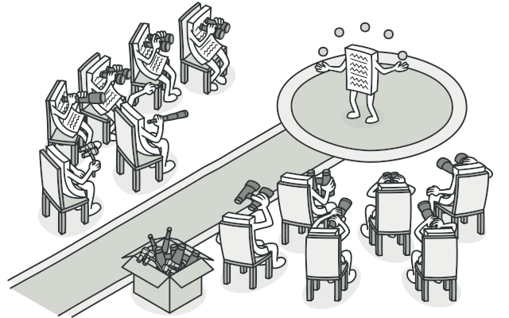
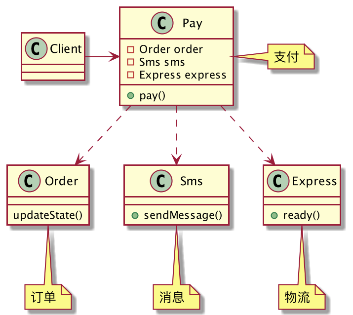
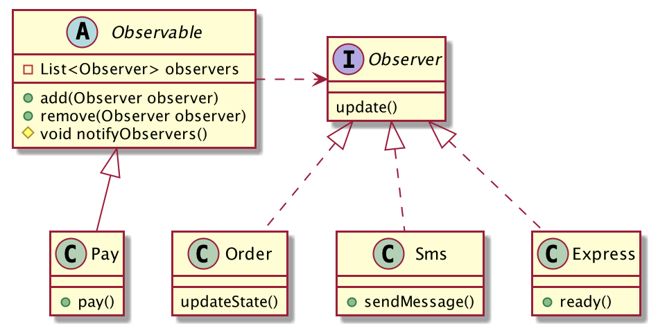
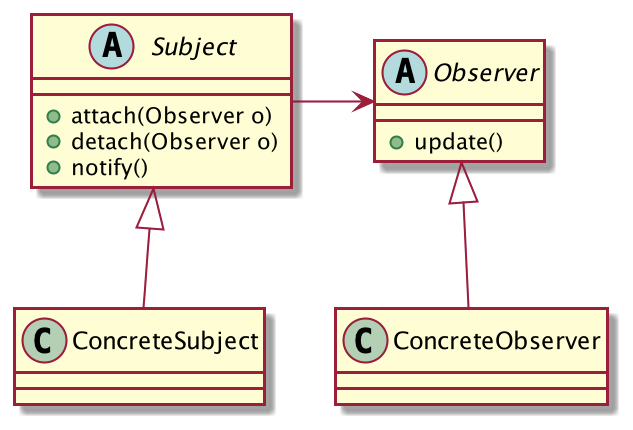

## 买家支付完成后的N个通知
随着电商的大热，网上购物已经深入寻常百姓家了，现在的年轻人，甚至是长辈老人都已经习惯于网购了，随着用户「支付成功」的一声提醒，电商背后就开始忙碌起来了。今天就通过支付的例子来理解「观察者模式」的强大之处。

假设现在有一个超级简单的商城项目，用户支付成功后，系统需要触发三个动作：

1. 修改订单状态。
2. 发送扣款短信到用户。
3. 通知物流系统开始备货。

非常简单对吧，我们用代码来描述这个过程，类图设计如下：



先编写三个支付系统需要依赖的类：

```java
public class Order {
	public void updateState(){
		System.out.println("修改订单状态...");
	}
}
public class Sms {
	public void sendMessage(){
		System.out.println("账户扣款短信通知...");
	}
}
public class Express {
	public void ready(){
		System.out.println("物流开始备货...");
	}
}
```
支付类`Pay`，当用户支付成功后，需要挨个发起通知：
```java
public class Pay {
	private Order order = new Order();
	private Sms sms = new Sms();
	private Express express = new Express();
	public void pay(){
		System.out.println("支付完成...");
		order.updateState();
		sms.sendMessage();
		express.ready();
	}
}
```
客户端这样调用：
```java
public class Client {
	public static void main(String[] args) {
		new Pay().pay();
	}
}
```
OK，功能完成。重新审视一下现在的代码吧，有没有发现什么问题？`Pay`的设计实在是太糟糕了，它依赖了太多的类。支付完成发起通知是没有问题的，但是作为支付类来说，我压根就不关心我需要通知哪些类，你给我一个通知列表，我挨个通知就完了，至于通知的是谁我并不关心。

采用「观察者模式」来优化代码，优化后的类图设计如下：



抽象出观察者接口Observer

```java
public interface Observer {
	// 通知
	void update();
}
```
订单、短信、物流均是观察者的实现，他们要观察支付状态：
```java
public class Order implements Observer {
	@Override
	public void update() {
		System.out.println("修改订单状态...");
	}
}
public class Sms implements Observer {
	@Override
	public void update() {
		System.out.println("账户扣款短信通知...");
	}
}
public class Express implements Observer {
	@Override
	public void update() {
		System.out.println("物流开始备货...");
	}
}
```
定义被观察者Observable，抽象出共有的属性和方法：
```java
public abstract class Observable {
	// 观察者列表
	private List<Observer> observers = new ArrayList<>();
	// 添加观察者
	public void add(Observer observer){
		observers.add(observer);
	}
	// 移除观察者
	public void remove(Observer observer){
		observers.remove(observer);
	}
	// 通知观察者
	protected void notifyObservers(){
		for (Observer observer : observers) {
			observer.update();
		}
	}
}
```
`Pay`就是个被观察者，只要用户支付成功，它就要去通知所有的观察者了。
```java
public class Pay extends Observable {
	public void pay(){
		System.out.println("支付完成.");
		// 通知观察者
		super.notifyObservers();
	}
}
```
客户端这样调用：
```java
public class Client {
	public static void main(String[] args) {
		Pay pay = new Pay();
		pay.add(new Order());
		pay.add(new Sms());
		pay.add(new Express());
		pay.pay();
	}
}
```
运行结果一样，但是你发现没有，`Pay`的代码变得非常简洁，它只依赖观察者的抽象`Observer`，至于实际有哪些观察者它是不关心的，它只负责在支付完成时挨个通知所有的观察者，实际通知的是哪个对象它无需了解。

这就是观察者模式！

## 观察者模式的定义
> 定义对象间一种一对多的依赖关系，使得每当一个对象改变状态，则所有依赖于它的对象都会得到通知并被自动更新。



**观察者模式通用类图**

- Subject：被观察者抽象，它必须能动态的添加、删除观察者，并且能及时的通知观察者。
- ConcreteSubject：具体的被观察者，定义哪些事件需要通知观察者。
- Observer：观察者抽象，对Subject发出的通知进行处理。
- ConcreteObserver：具体的观察者，每个观察者在收到通知时处理的逻辑是不一样的。

被观察者的职责很简单，完成自己的业务逻辑，维护观察者，定义哪些事件需要通知观察者。

观察者的职责也很简单，对被观察者发出的通知进行处理。

## 观察者模式的优缺点
**优点**

1. 松散耦合，被观察者不用再依赖N个观察者类了，而是依赖观察者抽象。
2. 非常灵活，要新增一个观察者非常的方便，派生`Observer`子类，添加到观察者列表即可，`Subject`不用做任何修改，复合「开闭原则」。

**缺点**

使用观察者模式需要考虑一下效率问题，多个观察者可能会使调试变得复杂，如果是单线程通知观察者，一个观察者运行卡壳，会导致后面的观察者收不到通知，如果存在这种问题，建议使用异步的方式进行通知。

## 总结
观察者模式也叫「发布订阅模式」，观察者订阅自己感兴趣的事件，被观察者发布事件通知观察者。

观察者模式最大的优点就是「解耦」，被观察者不用再依赖N个具体的观察者类，只关心观察者抽象，在事件触发时遍历观察者列表挨个通知即可。

因为依赖的是观察者抽象，因此添加观察者也是非常方便的，派生`Observer`子类，添加到观察者列表中即可，这一切对于被观察者而言都是透明的，被观察者不需要做任何修改，符合「开闭原则」。

观察者模式十分常用，JDK已经内置了对观察者模式的支持，`java.util.Observer`定义的就是观察者抽象，`java.util.Observable`是被观察者的定义，一般来说Java开发者无需自己再手写一个观察者模式，直接拿来主义即可。
