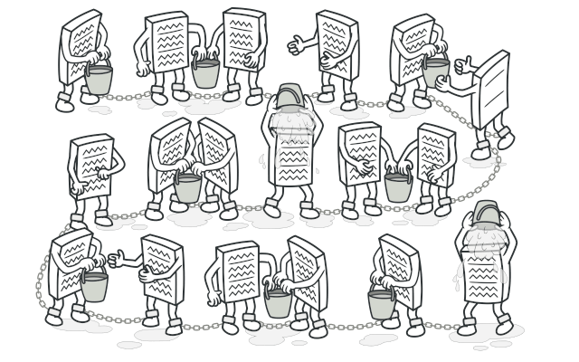
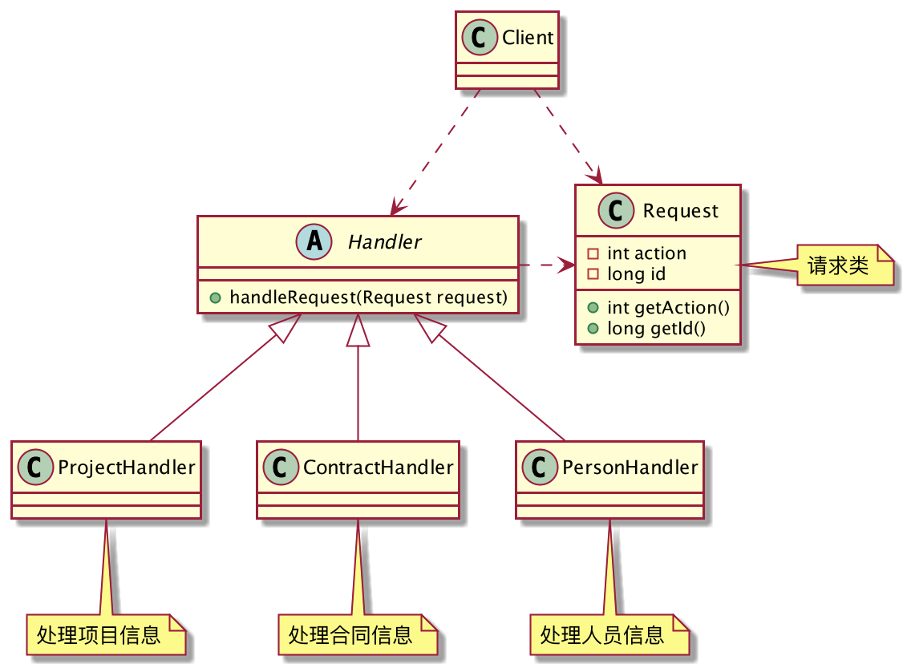
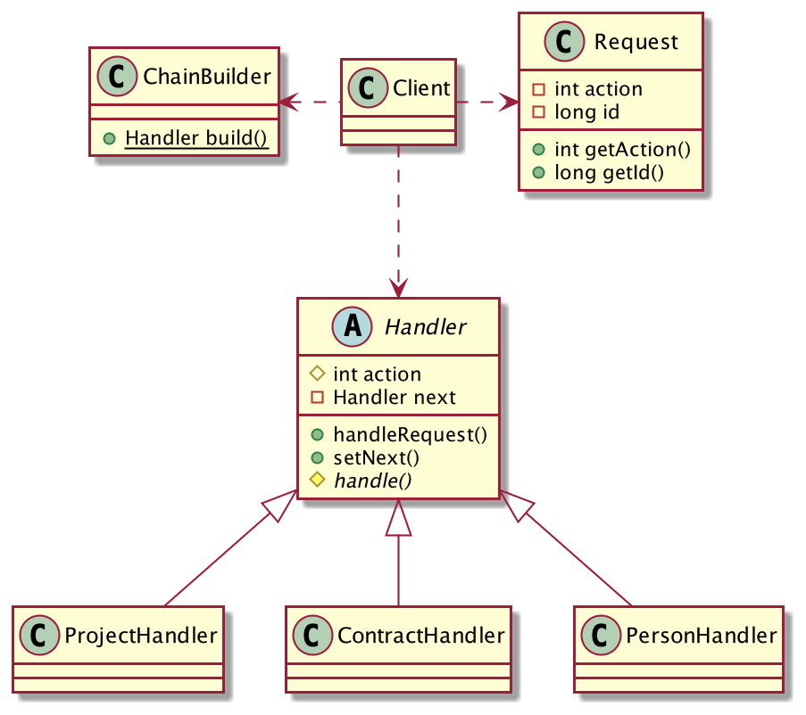
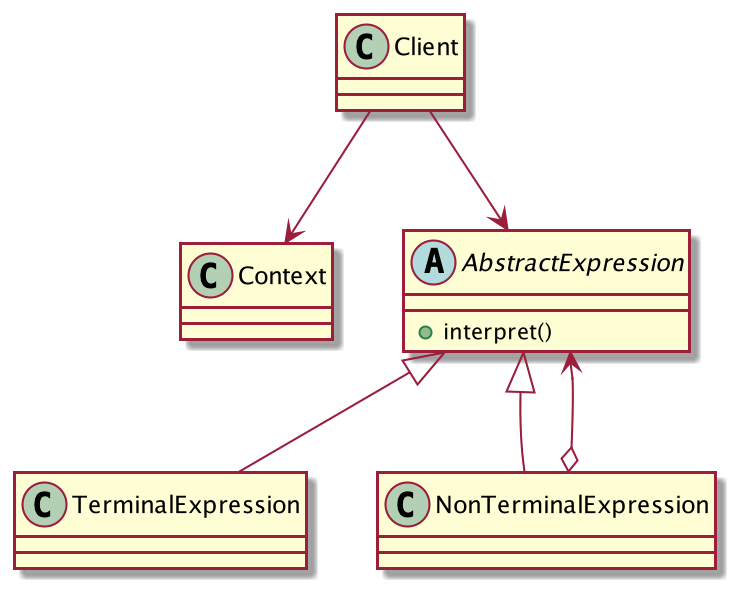

## 谁来处理请求？
前段时间接到一个新的需求，系统需要对外开放一些接口，以供第三方平台调用。大致流程是第三方发送一个HTTP请求，携带签名和一些业务参数，我这边接收到请求后根据参数做出响应。
其中比较重要的一个参数是【action】，它代表客户端要请求的动作，分别是

1. 请求项目信息
2. 请求合同信息
3. 请求人员信息

试着用代码来描述这个过程：



`Request`封装客户端的请求：

```java
@Getter
public class Request {
	private final int action;
	private final long id;//业务ID
	public Request(int action, long id) {
		this.action = action;
		this.id = id;
	}
}
```
`Handler`定义处理者的功能：
```java
public abstract class Handler {
	// 处理请求
	public abstract void handleRequest(Request request);
}
```
分别编写处理项目、合同、人员信息请求的实现类：
```java
// 项目信息处理器
public class ProjectHandler extends Handler {
	@Override
	public void handleRequest(Request request) {
		System.out.println("响应id=" + request.getId() + "的项目信息...");
	}
}
// 合同信息处理器
public class ContractHandler extends Handler {
	@Override
	public void handleRequest(Request request) {
		System.out.println("响应id=" + request.getId() + "的合同信息...");
	}
}
// 人员信息处理器
public class PersonHandler extends Handler {
	@Override
	public void handleRequest(Request request) {
		System.out.println("响应id=" + request.getId() + "的人员信息...");
	}
}
```
客户端调用是这样的：
```java
public class Client {
	public static void main(String[] args) {
		action(new Request(1,99));
		action(new Request(2,99));
		action(new Request(3,99));
		action(new Request(4,99));
	}
	static void action(Request request) {
		if (request.getAction() == 1) {
			new ProjectHandler().handleRequest(request);
		} else if (request.getAction() == 2) {
			new ContractHandler().handleRequest(request);
		} else if (request.getAction() == 3) {
			new PersonHandler().handleRequest(request);
		}else {
			System.out.println("无效请求...");
		}
	}
}
```
功能是正常的，对于不同的`action`，交给不同的`Handler`处理。但是仔细分析一些代码，这样实现存在哪些问题？

**1. 不符合单一职责**

客户端应该只负责发出请求，至于请求最终是由谁处理的，如何处理的，它不应该关心。

**2. 耦合性太高**

客户端严重依赖所有的具体请求处理器，即所有的`Handler`实现类。

**3. 违反开闭原则**

如果要新增一个需求，例如【action=4】时需要处理财务信息，需要修改代码逻辑，增加if分支判断，违反了开闭原则。

**4. 代码臃肿**

if分支太多了，阅读困难，如果要新增`Handler`就要新增分支。

OK，清楚了目前实现方式的缺点，下面就来优化它。

我们能否将所有的`Handler`处理器串成一条链呢？当一个Request请求打过来时，从链头传递到链尾，直到有对应的`Handler`处理它。每个`Handler`只处理自己应该处理的Request，自己不能处理的，交给下一个`Handler`处理。这样，就算要新增一个`Handler`也非常简单，派生`Handler`实现类，加入到处理链表中即可，这一切对于请求者来说都是透明的。

优化后的类图如下：



抽象`Handler`类，采用模板方法模式，将所有处理器串成一条链。

```java
public abstract class Handler {
	public static final int PROJECT = 1;//项目信息
	public static final int CONTRACT = 2;//合同信息
	public static final int PERSON = 3;//人员信息
	protected final int action;//当前处理者能处理的action
	private Handler next;// 下一个处理者
	public Handler(int action) {
		this.action = action;
	}
	public final void handleRequest(Request request) {
		if (request.getAction() == this.action) {
			// 是当前Handler要处理的
			handle(request);
		} else if (next != null) {
			// 交给下一个Handler处理
			next.handleRequest(request);
		} else {
			// 没有Handler可以处理
			System.out.println("无效请求...");
		}
	}
	public void setNext(Handler next) {
		this.next = next;
	}
	// 处理请求，子类实现
	protected abstract void handle(Request request);
}
```
处理器实现类稍作调整：
```java
// 项目信息处理器
public class ProjectHandler extends Handler {
	public ProjectHandler() {
		super(PROJECT);
	}
	@Override
	protected void handle(Request request) {
		System.out.println("响应id=" + request.getId() + "的项目信息...");
	}
}
// 合同信息处理器
public class ContractHandler extends Handler {
	public ContractHandler() {
		super(Handler.CONTRACT);
	}
	@Override
	protected void handle(Request request) {
		System.out.println("响应id=" + request.getId() + "的合同信息...");
	}
}
// 人员信息处理器
public class PersonHandler extends Handler {
	public PersonHandler() {
		super(PERSON);
	}
	@Override
	protected void handle(Request request) {
		System.out.println("响应id=" + request.getId() + "的人员信息...");
	}
}
```
`ChainBuilder`负责生成处理器执行链：
```java
// 生成责任链
public class ChainBuilder {
	public static Handler build(){
		Handler project = new ProjectHandler();
		Handler contract = new ContractHandler();
		Handler person = new PersonHandler();
		project.setNext(contract);
		contract.setNext(person);
		return project;
	}
}
```
客户端这样调用：
```java
public class Client {
	public static void main(String[] args) {
		Handler chain = ChainBuilder.build();
		chain.handleRequest(new Request(1, 99));
		chain.handleRequest(new Request(2, 99));
		chain.handleRequest(new Request(3, 99));
		chain.handleRequest(new Request(4, 99));
	}
}
```
客户端的调用变得非常简洁，它依赖`ChainBuilder`生成处理器链，然后将创建的请求交给处理器链处理，至于请求是谁处理的，怎么处理的，客户端并不关心。
这就是责任链模式！
## 责任链模式的定义
> 使多个对象都有机会处理请求，从而避免了请求的发送者和接受者之间的耦合关系。将这些对象连成一条链，并沿着这条链传递该请求，直到有对象处理它为止。



**责任链模式通用类图**

- Client：客户端，负责发起请求。
- Handler：抽象处理器，定义处理器的功能，以及将处理器串成一条「链」。
- ConcreteHandler：具体的处理器，真正负责处理请求的角色。

责任链模式的核心就是一个字「链」，「链」是由多个`ConcreteHandler`组成的，每个`ConcreteHandler`都要声明自己能处理的请求类型，不能处理的请求会交给下一个处理器处理。
## 责任链模式的优缺点
**优点**

1. 松散耦合，责任链模式将请求的发送者和处理者分开了，请求者不关心请求是谁处理的以及如何处理的。
2. 符合单一职责，客户端只负责请求的发送，`ConcreteHandler`只负责处理请求。
3. 符合开闭原则，要增加一个处理器非常简单，派生`Handler`子类加入到链中即可，这一切对客户端来说是透明的。

**缺点**

1. 链路过长的话，性能损耗严重，尤其是链尾处理器才能处理的情况下，请求需要从链头传递到链尾。
2. 由于采用了类似递归的方式处理请求，因此调试会比较麻烦。
## 总结
责任链模式应用的非常广泛，对于不同的请求如果有一组处理器可以处理它，就可以考虑使用责任链模式。

责任链模式扩展非常的灵活方便，只需派生`Handler`子类并加入到链路中即可，这一切对于客户端来说都是透明的，代码改动极少。

使用责任链模式时，有一个点需要特别注意，那就是「**控制链的长度**」，如果处理链过长，性能的损耗会非常严重，设置链路的最大值，避免无意识的破坏系统。
最后还有一点就是，尽量把「热」的`Handler`放在链头部分，『冷』的`Handler`放在链尾部分，可以降低性能的损耗。
