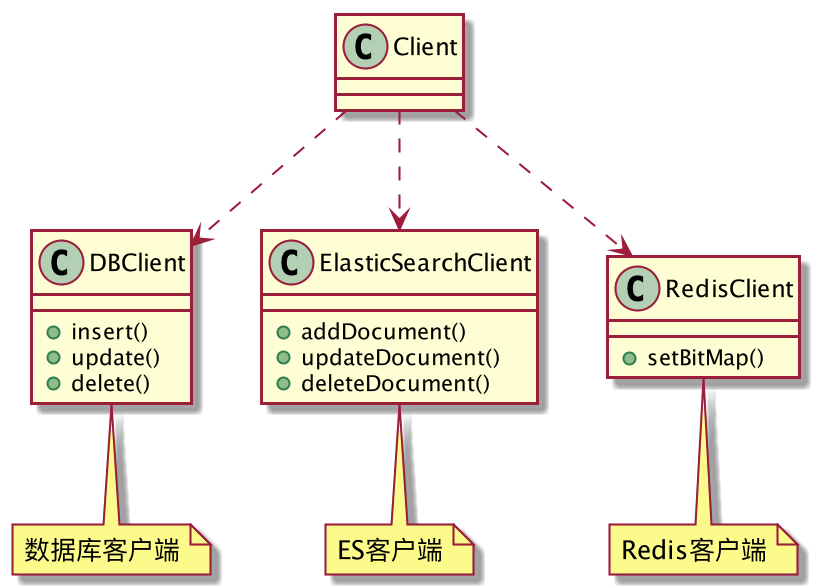
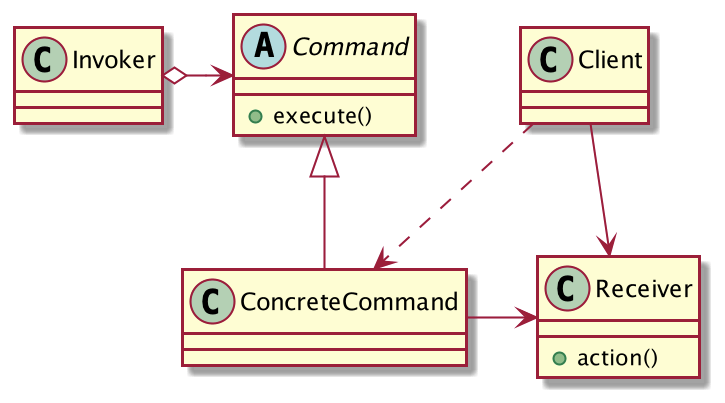

## 文章发布背后的秘密
用户发布一篇文章，系统需要完成三个主要动作：

1. 文章数据保存到数据库。
2. 文章内容进行中文分词，建立全文索引存储到ElasticSearch。
3. Redis设置BitMap，用作布隆过滤器，防止缓存穿透。

我们试着用伪代码来描述这个过程：


**DBClient**

```java
public class DBClient {
	public void insert(){
		System.out.println("文章保存到数据库...");
	}
	public void update(){
		System.out.println("文章更新到数据库...");
	}
	public void delete(){
		System.out.println("文章从数据库删除...");
	}
}
```
**ElasticSearchClient**
```java
public class ElasticSearchClient {
	public void addDocument(){
		System.out.println("ElasticSearch建立文章索引...");
	}
	public void updateDocument(){
		System.out.println("ElasticSearch更新文章索引...");
	}
	public void deleteDocument(){
		System.out.println("ElasticSearch删除文章索引...");
	}
}
```
**RedisClient**
```java
public class RedisClient {
	public void setBitMap(){
		System.out.println("设置位图...");
	}
}
```
当客户端需要发布一篇文章时，需要这样调用：
```java
public class Client {
	public static void main(String[] args) {
		DBClient dbClient = new DBClient();
		ElasticSearchClient elasticSearchClient = new ElasticSearchClient();
		RedisClient redisClient = new RedisClient();
		// 保存到数据库
		dbClient.insert();
		// 分词，全文索引
		elasticSearchClient.addDocument();
		// 设置BitMap，用作布隆过滤器
		redisClient.setBitMap();
    }
}
```
功能是正常的，但是这样实现存在一个什么问题呢？

客户端需要依赖DBClient、ElasticSearchClient、RedisClient类，而且需要非常清楚的知道文章发布的所有过程，耦合性太高了，如果以后中间还要加个步骤呢？客户端会疯掉吧。

知道了不好的地方，现在我们来优化。

文章的发布、修改、删除是否都可以看成是一个命令呢？调用者发出一个命令，接收者去执行，至于命令执行的具体细节，调用者压根就不关心，以此来达到松散耦合的目的。

**抽象命令类**

```java
public abstract class Command {
	protected DBClient dbClient = new DBClient();
	protected ElasticSearchClient elasticSearchClient = new ElasticSearchClient();
	protected RedisClient redisClient = new RedisClient();
	// 命令的执行，子类实现
	public abstract void execute();
}
```
**命令执行者**
```java
public class Invoker {
	private Command command;
	// 设置命令
	public void setCommand(Command command) {
		this.command = command;
	}
	// 执行命令
	public void action(){
		this.command.execute();
	}
}
```
**文章发布命令**
```java
public class PublishCommand extends Command{
	@Override
	public void execute() {
		super.dbClient.insert();
		super.elasticSearchClient.addDocument();
		super.redisClient.setBitMap();
	}
}
```
客户端想发布文章时，这样调用：
```java
public class Client {
	public static void main(String[] args) {
		Invoker invoker = new Invoker();
		invoker.setCommand(new PublishCommand());
		invoker.action();
	}
}
```
客户端的调用变得非常的简单，客户端只需要创建指定的命令，交给`Invoker`执行就OK了，至于命令执行的细节它是不关心的。

如果用户要修改文章呢？也非常简单，只需要再扩展一个修改命令即可：

```java
public class UpdateCommand extends Command{
	@Override
	public void execute() {
		// 更新数据库
		super.dbClient.update();
		// 更新索引
		super.elasticSearchClient.updateDocument();
		// 修改文章，文章ID不变，位图不用动。
	}
}
```
客户端调用：
```java
public class Client {
	public static void main(String[] args) {
		Invoker invoker = new Invoker();
		invoker.setCommand(new UpdateCommand());
		invoker.action();
	}
}
```
客户端只需要创建`UpdateCommand`交给`Invoker`执行就好了，其他地方都不用动，非常方便。
这就是命令模式！
## 命令模式的定义
> 将一个请求封装成一个对象，从而让你使用不同的请求把客户端参数化，对请求排队或者记录请求日志，可以提供命令的撤销和恢复功能。



**命令模式通用类图**

- Receiver：命令接收者，也是实际干活的角色。
- Command：抽象命令，定义所有命令的操作。
- ConcreteCommand：实际的命令，有N个命令就有N个命令类。
- Invoker：调用者，接收到命令并执行。

命令模式很简单，也很常用，它的封装性非常好，将请求者`Invoker`和执行者`Receiver`分离开了，扩展性也非常好，要想增加命令，只需要派生`Command`子类就可以了。
## 命令模式的优缺点
**优点**

1. 降低耦合，请求者和执行者没有任何依赖了，请求者只负责接收命令并执行，至于是谁执行的、怎么执行的，它并不关心。
2. 扩展性好，扩展一个命令非常简单，派生`Command`子类即可。
3. 可以对命令的请求进行排队和记录日志。

**缺点**

如果有N个命令，就需要编写N个`Command`子类，如果命令太多会导致类的数量膨胀。

## 总结
只要你认为是命令的地方就可以用命令模式，命令模式还可以和其他模式结合使用，例如结合「备忘录模式」来实现命令的撤销功能，结合「责任链模式」来实现命令族的解析。

命令模式很好的将命令的调用者和命令的执行者解耦了，客户端只关心要执行的命令，至于命令是由谁执行的，怎么执行的，它并不关心，这就是高内聚的体现。
另外，`Invoker`在执行命令时也可以做一些文章，例如对命令的执行进行排队，记录日志等。

