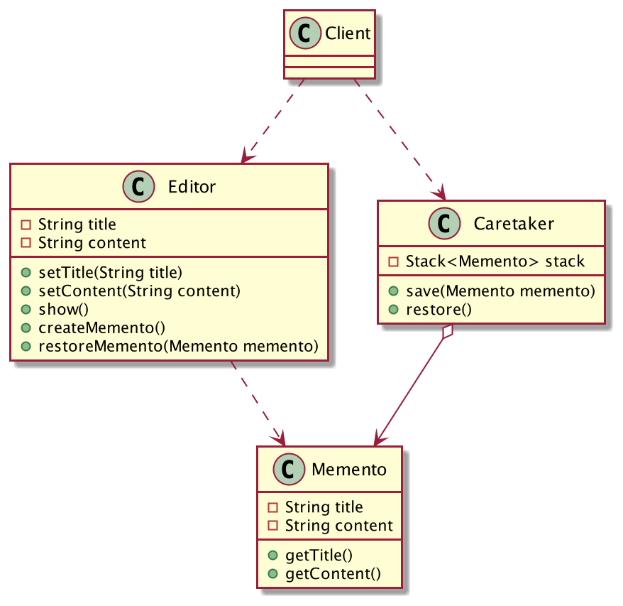
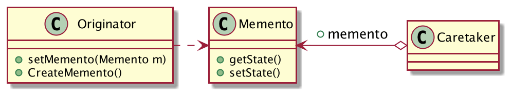

## 程序数据的“后悔药”
备忘录模式是设计上的"月光宝盒"，可以让我们回到过去；是程序数据的"后悔药"，吃了它就可以返回到上一个状态；是设计人员的"定心丸"，即使对象遭到破坏，也可以恢复到一个相对完好的状态。

备忘录模式很常用，例如：文档的撤销、数据库的事务等都可以使用备忘录模式来实现，本篇文章就以编辑器的撤销功能为例。

假设现在有一个编辑器软件，可以编辑标题和内容，而且可以展示文档，代码很简单如下：

```java
@Setter
public class Editor {
	private String title;//标题
	private String content;//内容
	
	// 展示
	public void show() {
		System.out.println("{title='" + title +"', content='" + content +"'}");
	}
}
```
客户端调用：
```java
public class Client {
	public static void main(String[] args) {
		Editor editor = new Editor();
		editor.setTitle("标题");
		editor.setContent("内容...");
		editor.show();
	}
}
```
功能一切正常，但是这个编辑器有个缺陷，不支持「撤销」，用户一旦操作失误，无法恢复到上一次的状态。人是容易犯错误的动物，不出错是不可能的，因此我们要改进这个软件。

文档的每一次保存都应该创建一个副本，用户可以随时撤销，恢复到上一次的状态。怎么优化呢？修改`Editor`类吗？这违反了「开闭原则」啊，有没有更优雅的实现方式呢？

答案当然是有了，创建一个`Memento`备忘录类，用户每次保存文档时，都要创建一个备忘录副本。

```java
@Getter
@AllArgsConstructor
public class Memento {
	// 备忘录一经创建，就不能修改
	private final String title;
	private final String content;
}
```
`Editor`类稍作修改，现在支持创建备忘录对象和从备忘录中恢复数据了：
```java
@Setter
public class Editor {
	private String title;//标题
	private String content;//内容
	
	// 展示
	public void show() {
		System.out.println("{title='" + title +"', content='" + content +"'}");
	}
	// 创建备忘录对象
	public Memento createMemento(){
		return new Memento(title, content);
	}
	// 从备忘录中恢复数据
	public void restoreMemento(Memento memento) {
		if (memento != null) {
			this.title = memento.getTitle();
			this.content = memento.getContent();
		}
	}
}
```
现在又有一个新的问题，创建的备忘录对象该如何管理呢？交给`Editor`管理吗？`Editor`应该只负责文档的编辑和展示，再给它强加一个备忘录的管理职责，这有违「单一职责原则」啊，所以最好的方式是创建一个备忘录管理类`Caretaker`。
```java
public class Caretaker {
	Stack<Memento> stack = new Stack<>();
	public void save(Memento memento) {
		stack.push(memento);
	}
	public Memento restore(){
		if (stack.size() > 0) {
			return stack.pop();
		}
		throw new UnsupportedOperationException("无法撤销...");
	}
}
```
备忘录我使用了一个「栈」结构来管理，你想啊，每次保存数据不就是入栈嘛，撤销肯定是恢复到最近一次的数据，那不就是出栈嘛，因此「栈」结构是非常适合的（这里不考虑反撤销）。

客户端这样调用：

```java
public class Client {
	public static void main(String[] args) {
		Caretaker caretaker = new Caretaker();
		Editor editor = new Editor();
		editor.setTitle("标题v1.0");
		editor.setContent("内容v1.0");
		caretaker.save(editor.createMemento());//保存
		editor.show();
		editor.setTitle("标题v2.0");
		editor.setContent("内容v2.0");
		caretaker.save(editor.createMemento());//保存
		editor.show();
		editor.setTitle("标题写错了");
		editor.setTitle("内容写错了");
		editor.restoreMemento(caretaker.restore());
		editor.show();
		//再撤销，恢复到原始数据
		editor.restoreMemento(caretaker.restore());
		editor.show();
	}
}
```
撤销的功能完成了，类的职责非常清晰，类图如下：


简单吧，这就是备忘录模式！

## 备忘录模式的定义
> 在不破坏封装性的前提下，捕获一个对象的内部状态，并在该对象之外保存这个状态。这样以后就可将该对象恢复到原先保存的状态。



**备忘录模式通用类图**

- Originator：发起人角色，负责定义哪些属性需要备份，以及创建备忘录对象和从备忘录对象中恢复。
- Memento：备忘录角色，负责存储Originator的状态，在恢复时提供状态。
- Caretaker：备忘录管理员，负责对备忘录进行管理维护。

备忘录模式非常的简单，每个类的职责非常的清晰，它提供了弥补真实世界缺陷的方法，让“后悔药”在程序的世界中真实可行。
## 备忘录模式的应用
标准的备忘录模式很少见到，实际使用时都会有一些变种，但是万变不离其宗，其主要思想是不变的。

只要你的类对象需要恢复数据，或者需要恢复到之前的某个状态，你就可以考虑使用备忘录模式。

使用备忘录模式有几点需要注意的事项：

**1. 维护备忘录的生命周期**

备忘录对象创建了就要在“最近”使用，如果不使用，切记删除其引用，让其可以被GC回收，否则创建了大量不用的备忘录对象，GC又不能回收，就会导致内存泄漏。

**2. 注意性能**

备忘录对象需要备份发起人的状态属性，因此会占用部分内存空间，尤其是属性特别多的时候，切记不要频繁的创建备忘录对象，`Caretaker`有责任务必要限制备忘录对象的最大数量，避免无意识的破坏系统。

## 总结
备忘录模式可以让程序数据恢复到过去的状态，让“后悔药”在程序世界中真实可行。

标准的备忘录模式很少见到，实际使用中都会有一些变种，例如Java开发者可以很方便的利用`clone`功能来实现对象的备份，这样发起人角色也可以承担备忘录角色，类的结构会变得更加简单。

