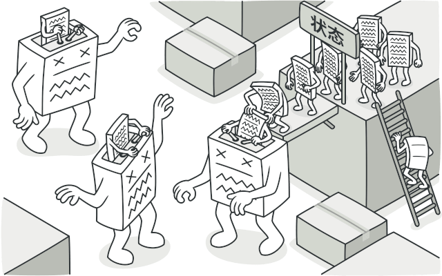
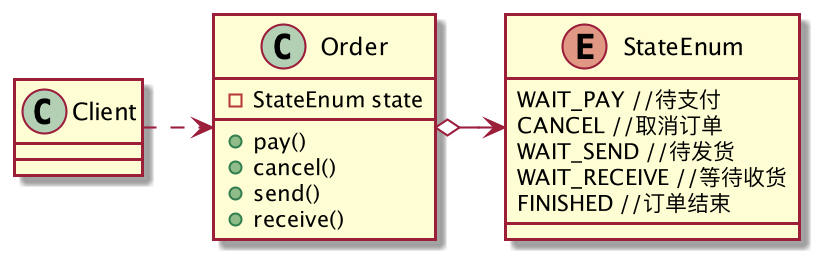
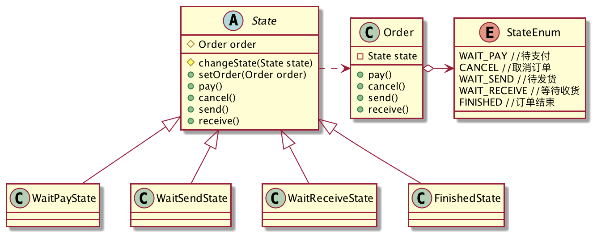
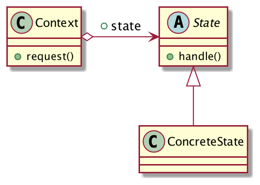

## 状态决定行为
在线购物现在已经非常普遍了，拿起手机选择商品，输入付款密码，买家就可以坐等收货了，非常方便。

用户的每条购物记录，都对应着一条订单，订单有非常多的状态，不同的状态可以进行不同的操作。例如：刚创建的订单，买家只有两种选择：要么选择付款，要么取消订单，你是不可能确认收货的，否则就乱套了。今天就借订单状态的例子来理解「状态模式」。

假设订单存在如下四种状态：

1. 待支付。
2. 待发货。
3. 待收货。
4. 订单完成结束。

针对订单可以有如下四种操作：

1. 支付金额。
2. 取消订单。
3. 卖家发货。
4. 买家确认收货。

试着用代码来描述这个过程，类图设计如下，非常简单：


先定义订单状态枚举`StateEnum`：

```java
public enum StateEnum {
	WAIT_PAY,//待支付
	WAIT_SEND,//待发货
	WAIT_RECEIVE,//等待收货
	FINISHED;//订单结束
}
```
核心订单类`Order`：
```java
public class Order {
	private StateEnum state;//当前订单状态
	public Order() {
		// 默认 待支付
		this.state = StateEnum.WAIT_PAY;
	}
	public void pay(){
		if (state == StateEnum.WAIT_PAY) {
			System.out.println("订单支付.");
			state = StateEnum.WAIT_SEND;
		}else {
			throw new UnsupportedOperationException("当前状态不支持此操作.");
		}
	}
	public void cancel(){
		if (state == StateEnum.WAIT_PAY) {
			System.out.println("取消订单.");
			state = StateEnum.FINISHED;
		}else {
			throw new UnsupportedOperationException("当前状态不支持此操作.");
		}
	}
	public void send() {
		if (state == StateEnum.WAIT_SEND) {
			System.out.println("卖家发货.");
			state = StateEnum.WAIT_RECEIVE;
		}else {
			throw new UnsupportedOperationException("当前状态不支持此操作.");
		}
	}
	public void receive() {
		if (state == StateEnum.WAIT_RECEIVE) {
			System.out.println("买家确认收货.");
			state = StateEnum.FINISHED;
		}else {
			throw new UnsupportedOperationException("当前状态不支持此操作.");
		}
	}
}
```
客户端这样调用：
```java
public class Client {
	public static void main(String[] args) {
		Order order = new Order();
		order.pay();
		order.send();
		order.receive();
		order.cancel();
	}
}
```
OK，功能正常，对于已经结束的订单，如果用户想取消订单，就会抛异常，提示用户“当前状态不支持此操作”。

但是你发现没有，`Order`类非常的复杂，存在大量的if判断，客户端对`Order`类的所有操作，都要先判断订单的状态是否允许当前操作，如果后续再扩展一个状态呢？`Order`类需要进行大量的修改，严重违反了「开闭原则」，相信过不了多久，`Order`类就会膨胀的无法维护。

我们试着用「状态模式」来优化这个程序，既然订单类的状态决定了它的行为，那么是否可以将订单的每种状态实体化成一个类呢？订单的操作委托给状态类来完成，每种状态只负责自己能处理的操作。

优化后的类图设计如下：



订单状态枚举不变，我们先把订单状态给抽象成`State`类：

```java
public abstract class State {
	protected Order order;
	// 修改状态
	protected final void changeState(State state){
		order.setState(state);
	}
	public void setOrder(Order order) {
		this.order = order;
	}
	// 默认所有的操作都不支持，子类重写
	public void pay(){
		throw new UnsupportedOperationException("当前状态不支持此操作.");
	}
	public void cancel(){
		throw new UnsupportedOperationException("当前状态不支持此操作.");
	}
	public void send(){
		throw new UnsupportedOperationException("当前状态不支持此操作.");
	}
	public void receive() {
		throw new UnsupportedOperationException("当前状态不支持此操作.");
	}
}
```
每个状态只负责自己的操作逻辑，首先是「待支付」，它支持两种操作：付款或取消。
```java
public class WaitPayState extends State{
	@Override
	public void pay() {
		System.out.println("订单支付.");
		changeState(new WaitSendState());
	}
	@Override
	public void cancel() {
		System.out.println("取消订单.");
		changeState(new FinishedState());
	}
}
```
等待发货状态：`WaitSendState`
```java
public class WaitSendState extends State {
	@Override
	public void send() {
		System.out.println("卖家发货.");
		changeState(new WaitReceiveState());
	}
}
```
等待买家确认收货状态：`WaitReceiveState`
```java
public class WaitReceiveState extends State {
	@Override
	public void receive() {
		System.out.println("买家确认收货.");
		changeState(new FinishedState());
	}
}
```
订单结束状态，订单结束了就什么也不能操作了，因此它是个空类：`FinishedState`。
```java
public class FinishedState extends State {
	// 什么操作都不支持了...
}
```
优化后的`Order`类变得非常简单，操作全部委托给状态类完成，自己只负责维护状态的切换：
```java
public class Order {
	private State state;
	public Order() {
		// 默认 待支付
		state = new WaitPayState();
		state.setOrder(this);
	}
	public void setState(State state) {
		state.setOrder(this);
		this.state = state;
	}
	public void pay(){
		state.pay();
	}
	public void cancel(){
		state.cancel();
	}
	public void send() {
		state.send();
	}
	public void receive() {
		state.receive();
	}
}
```
客户端的调用不变，程序运行结果不变，但是优化后的`Order`类变得非常简单，消除了if判断，如果要增加一个订单状态，也很容易，派生`State`子类即可。现在每个状态都是单独的类，只有与这个状态相关的因素修改了，这个类才修改，符合迪米特法则，完美。

这就是状态模式！

## 状态模式的定义
> 当一个对象内在状态改变时允许其改变行为，这个对象看起来像改变了其类。



**状态模式通用类图**

- State：抽象状态类，负责对象状态的定义，同时封装了Context对象以实现状态的切换。
- ConcreteState：具体状态类，每个状态类否必须完成两个职责：1.本状态的操作逻辑、2.状态的过渡切换。
- Context：环境角色，定义客户端需要的接口，负责具体状态的切换。

状态模式的核心是封装，状态的变更引起了行为的变更，从外部看起来就好像这个对象对应的类发生了改变一样，因为`Context`类本身并不实现业务逻辑，操作全部委托给了状态类来完成，状态变了，它的行为可不就变了嘛。
## 状态模式的优缺点
**优点**

1. 结构清晰，消除了if判断，代码可读性提高。
2. 符合「开闭原则」和「单一职责原则」，每个状态都是一个类，要扩展状态就派生子类，要修改状态就修改对应的状态类即可。
3. 良好的封装性，对客户端屏蔽了状态的内部实现。

**缺点**

每个状态都需要编写一个类，如果状态很多的话，类的数量会膨胀。

## 总结
「状态模式」适用于对象的行为受限于其状态的场景，不同的状态决定了对象不同的行为，它可以很好的消除if分支，提高代码的可读性和可维护性。需要注意的是，如果对象的状态过多会导致类的数量膨胀，实际应用时需要开发者权衡利弊。
