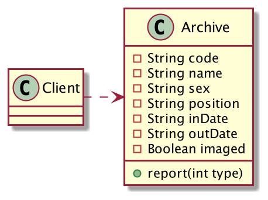
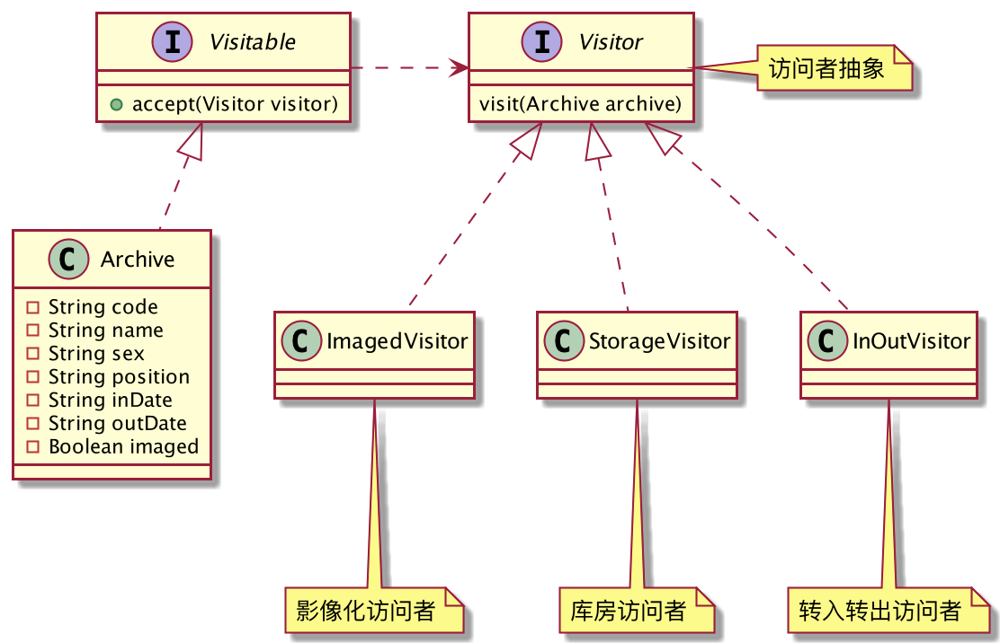
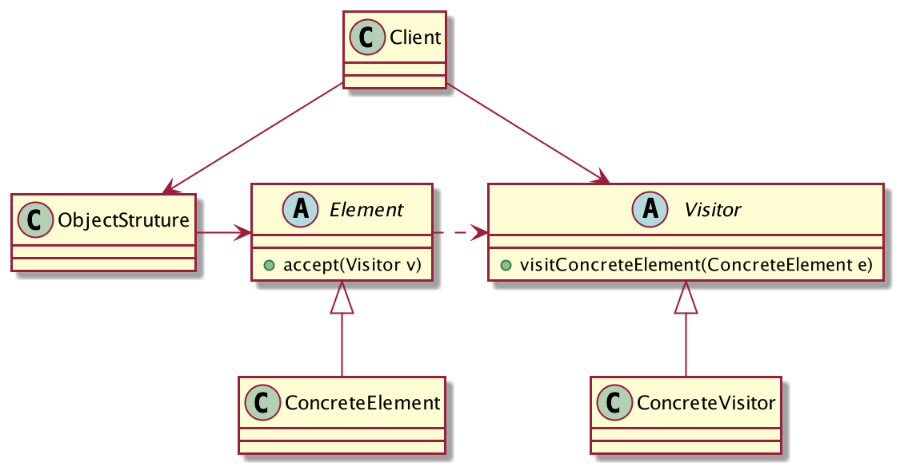

## 个性化报表
给政府做「档案信息化平台」，客户希望系统可以导出档案的Excel表格，而且导出的Excel内容完全不一样，简单列举如下：

1. 领导关心每年档案的转入、转出情况。
2. 影像化人员关心档案有没有被扫描成电子版，即档案有没有被影像化加工过。
3. 库房人员关心档案存放在哪里，希望导出档案的位置信息。

这里只简单列举了三种需求，实际情况比这个复杂多了。面对这种情况我一开始的建议是导出全部的信息，让客户自己挑着看，但是很快这个建议就被客户否定了，他们觉得信息太多看着不方便，他们只想要他们真正关心的数据。

我们用代码来描述这个过程，类图设计如下：



核心档案类`Archive`：

```java
@Getter
@AllArgsConstructor
public class Archive{
	private String code;//档案号
	private String name;//姓名
	private String sex;//性别
	private String position;//位置
	private String inDate;//转入时间
	private String outDate;//转出时间
	private Boolean imaged;//是否影像化

	// 导出报表
	public void report(int type) {
		if (type == 1) {
			// 领导需要的报表
			System.out.println("{档案编号:" + getCode() + ",姓名:" + getName()
					+ ",转入日期:" + getInDate() + ",转出日期:" + getOutDate() + "}");
		} else if (type == 2) {
			// 影像化操作员需要的报表
			System.out.println("{档案编号:" + getCode() + ",姓名:" + getName()
					+ ",是否影像化:" + getImaged() + "}");
		} else if (type == 3) {
			// 库房操作员需要的报表
			System.out.println("{档案编号:" + getCode() + ",姓名:" + getName()
					+ ",位置:" + getPosition() + "}");
		}
	}
}
```
客户端调用：
```java
public class Client {
	public static void main(String[] args) {
		List<Archive> list = build();
		System.out.println("领导需要知道档案的转入转出情况...");
		report(list, 1);
		System.out.println("--------\n影像化操作员需要了解哪些档案没影像化...");
		report(list, 2);
		System.out.println("--------\n库房操作员需要知道档案放在哪里...");
		report(list, 3);
	}
	static void report(List<Archive> list,int type){
		for (Archive archive : list) {
			archive.report(type);
		}
	}
	// 模拟生成档案列表
	static List<Archive> build(){
		List<Archive> list = new ArrayList<>();
		list.add(new Archive("001","张三","男","1号库1柜1排","2020-01-01","2020-12-01",true));
		list.add(new Archive("002","李四","女","1号库1柜2排","2020-01-02","2020-12-02",false));
		list.add(new Archive("003","王五","男","1号库1柜3排","2020-01-03","2020-12-03",true));
		return list;
	}
}
```
```
领导需要知道档案的转入转出情况...
{档案编号:001,姓名:张三,转入日期:2020-01-01,转出日期:2020-12-01}
{档案编号:002,姓名:李四,转入日期:2020-01-02,转出日期:2020-12-02}
{档案编号:003,姓名:王五,转入日期:2020-01-03,转出日期:2020-12-03}
--------
影像化操作员需要了解哪些档案没影像化...
{档案编号:001,姓名:张三,是否影像化:true}
{档案编号:002,姓名:李四,是否影像化:false}
{档案编号:003,姓名:王五,是否影像化:true}
--------
库房操作员需要知道档案放在哪里...
{档案编号:001,姓名:张三,位置:1号库1柜1排}
{档案编号:002,姓名:李四,位置:1号库1柜2排}
{档案编号:003,姓名:王五,位置:1号库1柜3排}
```
OK，大功告成。

但是好景不长，另一个部门的领导希望能导出另一种报表。

冷静下来后仔细分析一下，客户提需求是再正常不过的一件事了，如果客户每提一个需求，开发人员就要修改大量代码，那就说明程序的扩展性太差了，说白了，这不是客户的问题，这是开发者自身的问题啊。

目前这种设计，只要客户要导出新的报表，`Archive`类就要修改，增加if分支，相信用不了多久，这个类就会膨胀的没法维护了，因此优化它变得刻不容缓！

先分析一下上述的代码实现，`Archive`的职责有点多了啊，它既要负责保存档案信息，还要负责导出报表，这违反了「单一职责原则」啊，所以有必要给`Archive`瘦瘦身了，将报表导出的功能抽离到其他类中。

优化后的类图设计如下：



不同的报表其实就是从`Archive`类中获取自己想要的数据而已，因此可以将它定义为被访问者，先定义可访问的抽象`Visitable`：

```java
public interface Visitable {
	// 允许访问者访问
	void accept(Visitor visitor);
}
```
`Archive`稍作修改：
```java
@Getter
@AllArgsConstructor
public class Archive implements Visitable{
	private String code;//档案号
	private String name;//姓名
	private String sex;//性别
	private String position;//位置
	private String inDate;//转入时间
	private String outDate;//转出时间
	private Boolean imaged;//是否影像化

	@Override
	public void accept(Visitor visitor) {
		visitor.visit(this);
	}
}
```
定义访问者抽象，访问者可以访问哪些对象：
```java
public interface Visitor {
	// 访问档案信息
	void visit(Archive archive);
}
```
三种报表对应的访问者实现：
```java
public class InOutVisitor implements Visitor{
	@Override
	public void visit(Archive archive) {
		System.out.println("{档案编号:" + archive.getCode() + ",姓名:" + archive.getName()
				+ ",转入日期:" + archive.getInDate() + ",转出日期:" + archive.getOutDate() + "}");
	}
}

public class ImagedVisitor implements Visitor{
	@Override
	public void visit(Archive archive) {
		System.out.println("{档案编号:" + archive.getCode() + ",姓名:" + archive.getName()
				+ ",是否影像化:" + archive.getImaged() + "}");
	}
}

public class StorageVisitor implements Visitor{
	@Override
	public void visit(Archive archive) {
		System.out.println("{档案编号:" + archive.getCode() + ",姓名:" + archive.getName()
				+ ",位置:" + archive.getPosition() + "}");
	}
}
```
客户端调用：
```java
public class Client {
	public static void main(String[] args) {
		List<Archive> list = build();
		System.out.println("领导需要知道档案的转入转出情况...");
		accept(list, new InOutVisitor());
		System.out.println("--------\n影像化操作员需要了解哪些档案没影像化...");
		accept(list, new ImagedVisitor());
		System.out.println("--------\n库房操作员需要知道档案放在哪里...");
		accept(list, new StorageVisitor());
	}
	static void accept(List<Archive> list,Visitor visitor){
		for (Archive archive : list) {
			archive.accept(visitor);
		}
	}
	// 模拟生成档案列表
	static List<Archive> build(){
		List<Archive> list = new ArrayList<>();
		list.add(new Archive("001","张三","男","1号库1柜1排","2020-01-01","2020-12-01",true));
		list.add(new Archive("002","李四","女","1号库1柜2排","2020-01-02","2020-12-02",false));
		list.add(new Archive("003","王五","男","1号库1柜3排","2020-01-03","2020-12-03",true));
		return list;
	}
}
```
运行结果一样，看到了吗？现在的`Archive`类变得非常的简单，只负责保存档案信息，允许访问者访问自己，至于访问者怎么访问的，它并不关心。

所有类的职责都非常清晰，如果现在有部分领导说想导出新的报表，我一定不会再头大了，派生`Visitor`子类就可以做到，`Archive`类不需要任何修改，嗯，非常符合「开闭原则」。

这就是访问者模式！

## 访问者模式的定义
> 封装一些作用于某种数据结构中的各元素的操作，它可以在不改变数据结构的前提下定义作用于这些元素的新的操作。



**访问者模式通用类图**

- Visitor：抽象访问者，声明访问者可以访问哪些具体的元素。
- ConcreteVisitor：具体的访问者，访问元素后需要干什么，干活的人。
- Element：抽象元素，声明允许被哪些访问者访问。
- ConcreteElement：具体的元素
- ObjectStruture：元素的产生者，元素一般是从数据库中查询得到。

访问者可以在不修改元素数据结构的前提下，定义一些新的作用于元素上的操作。
## 访问者模式的优缺点
**优点**

1. 符合单一职责原则，元素类只负责自己本身应有的职责，新的职责交给访问者类，各自变化。
2. 扩展性非常好，要加新的操作，派生`Visitor`子类即可，元素类本身无需修改，符合开闭原则。
3. 灵活性高，访问者可以任意处理元素的数据，这一切对于元素类来说是透明的。

**缺点**

1. 具体元素要对访问者公布细节，访问者需要非常了解被访问的对象，这是迪米特法则不建议的。
2. 访问者容易扩展，但是元素本身不好扩展。
3. 违背了「依赖倒置原则」，访问者依赖的是具体元素类，而不是抽象。
## 总结
访问者模式可以在不改变元素类的数据结构的前提下定义作用于这些元素的新的操作，这一点是「开闭原则」的直接体现，因此访问者是非常灵活的，扩展非常方便。但是元素本身扩展就很困难了，元素类的变更一旦影响到访问者，很可能就要修改所有访问者代码，这将是灾难性的。因此访问者模式适用于元素类本身非常稳定的场景，如果元素类后续还会不断变更，那么是不建议使用访问者模式的。

如果你需要对一个结构对象中的对象进行很多不同且不相关联的操作，而且可能后续这些操作还会不断增加或变化，为了避免“污染”对象类，你就可以考虑使用访问者模式。

