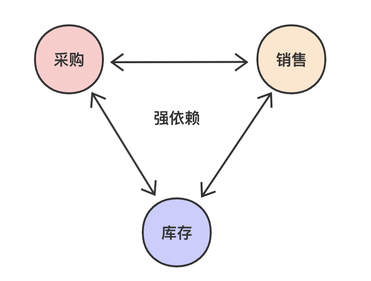
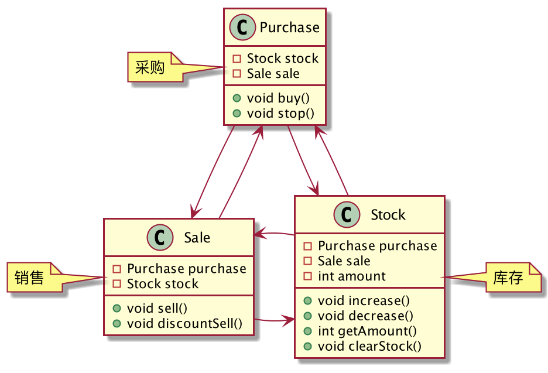
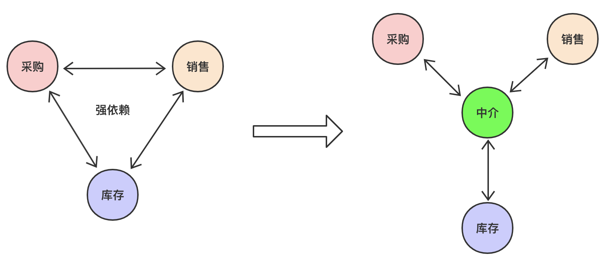
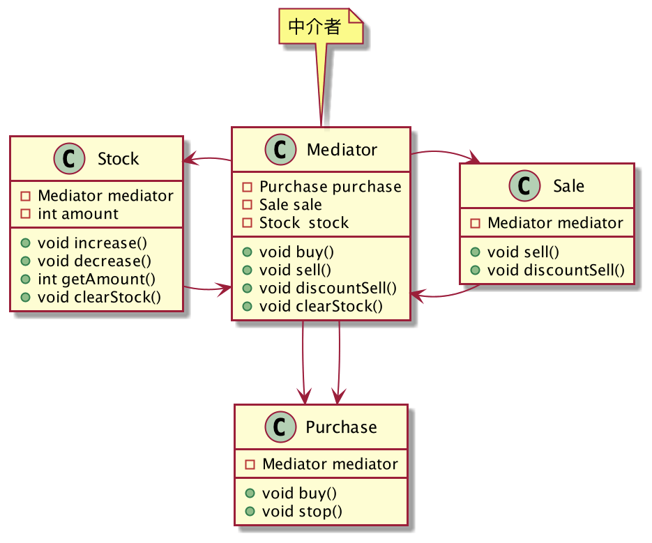
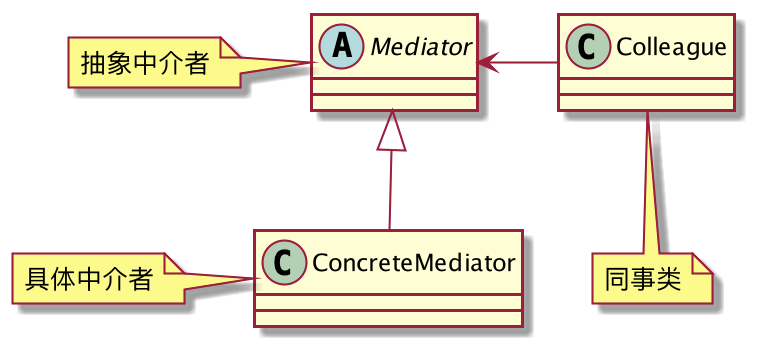

## 进销存管理
几乎所有的企业都离不开「进销存管理」系统，这个系统分为三个模块：采购、销售和库存。

1. 采购：负责采购产品，依赖于销售模块，需要根据产品的销售情况酌情采购，畅销就多采购，滞销就少采购。
2. 销售：负责销售产品，依赖库存和采购，无货可卖了就要通知采购。
3. 库存：负责提供产品的库存情况，如果某项产品卖不出去积压了，就要通知采购模块停止采购，通知销售模块打折处理。

可以看到，这三个模块是彼此依赖耦合的，示意图如下：


我们试着用代码来实现这个系统，首先画出类图：



**采购**

```java
@Setter
public class Purchase {
	private Stock stock;
	private Sale sale;
	public void buy(){
		if (sale.isActiveDemand()) {
			// 畅销，多进点货
			stock.increase(100);
		}else {
			// 滞销，少进点货
			stock.increase(10);
		}
	}
	public void stop(){
		System.out.println("停止采购...");
	}
}
```
**销售**
```java
@Setter
public class Sale {
	private Purchase purchase;
	private Stock stock;
	// 是否畅销
	public boolean isActiveDemand(){
		return ThreadLocalRandom.current().nextBoolean();
	}
	// 正常销售
	public void sell(){
		stock.decrease(1);
		if (stock.getAmount() <= 0) {
			// 没货了，通知采购进货
			purchase.buy();
		}
	}
	// 打折销售
	public void discountSell(){
		System.out.println("打折销售，卖完即止...");
		stock.decrease(1);
	}
}
```
**库存**
```java
@Setter
public class Stock {
	private Purchase purchase;
	private Sale sale;
	private int amount = 0;
	// 增加库存
	public void increase(int num) {
		this.amount += num;
		System.out.println("增加库存:" + this.amount);
	}
	// 减少库存
	public void decrease(int num) {
		this.amount -= num;
		System.out.println("减少库存:" + this.amount);
	}
	// 当前还有多少库存?
	public int getAmount() {
		return amount;
	}
	// 清仓处理
	public void clearStock() {
		// 滞销
		// 停止采购
		purchase.stop();
		// 清仓处理，打折销售
		sale.discountSell();
	}
}
```
客户端调用：
```java
public class Client {
	public static void main(String[] args) {
		Purchase purchase = new Purchase();
		Sale sale = new Sale();
		Stock stock = new Stock();
		purchase.setSale(sale);
		purchase.setStock(stock);
		sale.setPurchase(purchase);
		sale.setStock(stock);
		stock.setPurchase(purchase);
		stock.setSale(sale);
		purchase.buy();
		sale.sell();
		stock.clearStock();
	}
}
```
功能是好的，但是我们分析一下，这种实现存在哪些问题？

1. 耦合性太强了，类与类之间相互依赖，任何一个类修改都有可能影响其他类。
2. 朋友类太多了，类要完成一个功能需要和太多的朋友类交流。
3. 类间的依赖关系是一个网状结构，如果要再加一个朋友类，需要修改很多代码。

尝试使用设计模式去优化这种结构，能否将网状结构优化为星状结构呢？如下：



加入一个中介者类，每个同事类只关心自己的业务逻辑，凡是需要和其他同事类打交道的，都通过中介者去完成，优化后的类图如下：



**中介者类Mediator**

```java
@Setter
public class Mediator {
	private Purchase purchase;
	private Sale sale;
	private Stock stock;
	// 采购
	public void buy(){
		if (sale.isActiveDemand()) {
			// 畅销，多进点货
			stock.increase(100);
		}else {
			// 滞销，少进点货
			stock.increase(10);
		}
	}
	// 销售
	public void sell(){
		stock.decrease(1);
		if (stock.getAmount() <= 0) {
			// 没货了，通知采购进货
			purchase.buy();
		}
	}
	// 打折销售
	public void discountSell(){
		stock.decrease(1);
	}
	// 清仓
	public void clearStock(){
		// 滞销
		// 停止采购
		purchase.stop();
		// 清仓处理，打折销售
		sale.discountSell();
	}
}
```
抽象同事类`Colleague`，所有的同事类都要依赖中介者对象：
```java
public abstract class Colleague {
	protected Mediator mediator;
	public Colleague(Mediator mediator) {
		this.mediator = mediator;
	}
}
```
**采购**
```java
public class Purchase extends Colleague {
	public Purchase(Mediator mediator) {
		super(mediator);
		mediator.setPurchase(this);
	}
	public void buy(){
		// 需要依赖其他同事类的，让中介者去处理
		mediator.buy();
	}
	public void stop(){
		System.out.println("停止采购...");
	}
}
```
**销售**
```java
public class Sale extends Colleague {
	public Sale(Mediator mediator) {
		super(mediator);
		mediator.setSale(this);
	}
	// 是否畅销
	public boolean isActiveDemand(){
		return ThreadLocalRandom.current().nextBoolean();
	}
	// 正常销售
	public void sell(){
		// 需要依赖其他同事类的，让中介者去处理
		mediator.sell();
	}
	// 打折销售
	public void discountSell(){
		System.out.println("打折销售，卖完即止...");
		mediator.discountSell();
	}
}
```
**库存**
```java
public class Stock extends Colleague {
	private int amount = 0;
	public Stock(Mediator mediator) {
		super(mediator);
		mediator.setStock(this);
	}
	// 增加库存
	public void increase(int num) {
		this.amount += num;
		System.out.println("增加库存:" + this.amount);
	}
	// 减少库存
	public void decrease(int num) {
		this.amount -= num;
		System.out.println("减少库存:" + this.amount);
	}
	// 当前还有多少库存?
	public int getAmount() {
		return amount;
	}
	// 清仓处理
	public void clearStock() {
		// 需要依赖其他同事类的，让中介者去处理
		mediator.clearStock();
	}
}
```
客户端调用：
```java
public class Client {
	public static void main(String[] args) {
		Mediator mediator = new Mediator();
		Purchase purchase = new Purchase(mediator);
		Sale sale = new Sale(mediator);
		Stock stock = new Stock(mediator);
		
		purchase.buy();
		sale.sell();
		stock.clearStock();
	}
}
```
优化后的同事类变得非常简单清晰。

这就是中介者模式！

## 中介者模式的定义
> 用一个中介对象封装一系列的对象交互，中介者使各对象不需要显示地相互作用，从而使其耦合松散，而且可以独立地改变它们之间的交互。



**中介者模式通用类图**

同事类的方法有两种，一种是处理自己本身的业务逻辑的自发方法，另一种是需要依赖中介者才能完成的依赖方法。

## 中介者模式的优缺点
**优点**

1. 减少了类间的依赖，把原本一对多的依赖优化为一对一的依赖关系，所有的同事类不会相互依赖，只会依赖中介者类，降低了耦合。
2. 将网状结构优化为星状结构，同事类变得非常稳定。
3. 类的职责变得更加清晰。

**缺点**

1. 中介类如果异常，会影响所有同事类。
2. 同事类数量增加，中介者会膨胀的非常大，会变得异常复杂。
## 总结
中介者模式会增加中介者类，使系统结构变的复杂。如果只是处理几个类的简单依赖关系，则没必要使用中介者模式。切记，设计模式不要为了使用而使用，那会让你受害无穷。

中介者模式适用于多个类之间出现了紧密耦合的情况，怎么样才算是「紧密耦合」呢？最简单的判断方式就是类间的关系呈现「网状结构」。

中介者模式也叫「调停者模式」，如果N个对象需要相互交流，这时对象间的关系就会变得很复杂，就像对象的战争，通过加入一个中介，所有对象都只和中介交流，中介再把你的诉求转发出去，这样对象间的结构就会变得清晰独立。
