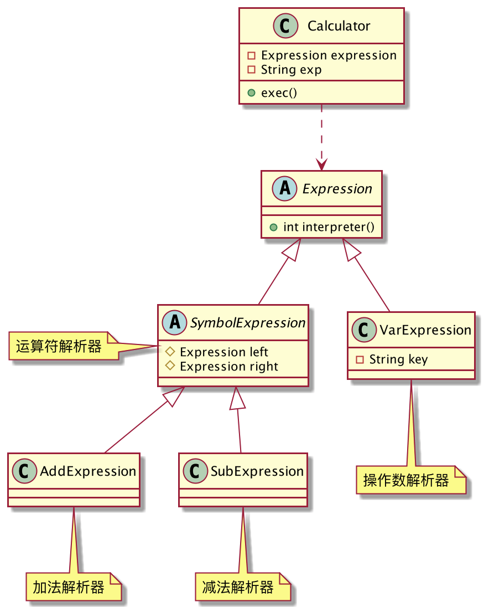
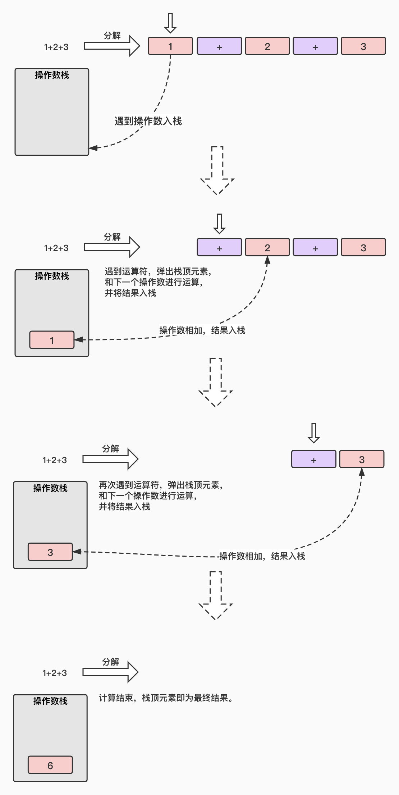

## 破解算术验证码
我头两年工作的时候，写过一些爬虫程序，爬取过京东的商品数据，今日影视的视频资源等等。有些资源是很容易爬的，只要发一个HTTP请求，无需任何处理服务端就会返回给你数据。但是对于一些比较珍贵的数据，服务端就会做「反爬虫」处理，我曾经在爬取第三方网站的文章时就遇到过，幸运的是人家的反爬虫机制比较简单：给出一个图片，图片里面是一个「算术题」，你必须输入算术题的正确答案，服务端才会响应文章的完整内容。算术题都是很简单的四则运算，小学生都会的那种，因此很容易破解。

破解的思路很简单，我的做法就是首先调用百度的「OCR」将图片识别成文本，这样我就能得到一个表达式字符串，如“25+32”，接下来就是写代码解析表达式，计算结果值了，然后将这个结果值作为参数去请求文章接口，就能获取到文章数据。

调用百度OCR识别这里就不讲了，那是百度干的活，我只负责调调接口。本篇文章主要记录如何通过「解释器模式」解析「算术表达式」，并计算得到结果值。

现在假设我们得到如下表达式：

```
1+2+3
```
我们来分析一下这个表达式，它有两类元素：操作数和运算符。操作数是指：`1、2、3`这类符号，它们只代表一个数值，不需要做任何处理，因此也叫作「终结符号」，这是语法中的最小单元，不可再拆分。运算符是指`+`这类符号，它需要我们编写算法进行处理，每个运算符都需要对应两个操作数，否则公式就无法运行了，运算符也叫做「非终结符号」。

两类元素的共同点是都要被解析，不同的是所有的操作数都具有相同的功能，它只代表一个数值，因此可以用一个类来表示。但是不同的运算符需要用不同的算法来解释，因此必须定义不同的类，加法需要加法解析器，减法需要减法解析器。
分析完了，我们试着用代码来描述这个过程，类图设计如下：



`Expression`是词法元素的抽象，`VarExpression`用来解析操作数，`SymbolExpression`用来解析运算符，`AddExpression`负责解析加法运算符，`SubExpression`负责解析减法运算符。

解析的工作完成了，我们还要负责安排运算的先后顺序，从左到右，先算乘除，后算加减(篇幅原因，乘除暂不考虑)，而且还要保存表达式计算的结果值，因此我们还需要一个封装类`Calculator`。

解析器抽象`Expression`：

```java
public abstract class Expression {
	// 解释表达式并获得结果
	public abstract int interpreter();
}
```
操作数解析器`VarExpression`，很简单，将解析出的操作数字符转数字：
```java
public class VarExpression extends Expression{
	private String key;
	public VarExpression(String key) {
		this.key = key;
	}
	@Override
	public int interpreter() {
		return Integer.valueOf(key);
	}
}
```
抽象的运算符解析器`SymbolExpression`，每个运算符必须对应左右两个操作数，否则公式无法运算：
```java
public abstract class SymbolExpression extends Expression {
	protected Expression left;//左表达式
	protected Expression right;//右表达式
	public SymbolExpression(Expression left, Expression right) {
		this.left = left;
		this.right = right;
	}
}
```
加法解析器`AddExpression`：
```java
public class AddExpression extends SymbolExpression {
	public AddExpression(Expression left, Expression right) {
		super(left, right);
	}
	@Override
	public int interpreter() {
		return left.interpreter() + right.interpreter();
	}
}
```
减法解析器`SubExpression`：
```java
public class SubExpression extends SymbolExpression {
	public SubExpression(Expression left, Expression right) {
		super(left, right);
	}
	@Override
	public int interpreter() {
		return left.interpreter() - right.interpreter();
	}
}
```
目前为止，解析的代码都完成了，接下来就是安排运算的先后顺序了。
我们再来分析一下这个表达式
```
1+2+3
```
计算机应该如何执行这个运算呢？应该用哪种数据结构才合适呢？笔者画了一副简图来描述这个执行过程：



如图所示，使用「栈」结果最合适不过了，当遇到操作数时，直接入栈，遇到运算符时，将栈顶元素出栈，并和下一个操作数计算，再将结果入栈，反复此过程，最终栈内的元素即为最终计算结果。

因此，`Calculator`类毫无疑问使用栈结构来维护执行顺序：

```java
public class Calculator {
	private Expression expression;
	private String exp;// 表达式
	public Calculator(String exp) {
		this.exp = exp;
		Stack<Expression> stack = new Stack<>();
		char[] chars = exp.toCharArray();//只考虑个位数
		for (int i = 0; i < chars.length; i++) {
			VarExpression varExpression = new VarExpression(String.valueOf(chars[i]));
			switch (chars[i]) {
				// 遇到运算符号 前一个数出栈，和后一个数做运算后再入栈
				case '+':
					stack.push(new AddExpression(stack.pop(), new VarExpression(String.valueOf(chars[++i]))));
					break;
				case '-':
					stack.push(new SubExpression(stack.pop(), new VarExpression(String.valueOf(chars[++i]))));
					break;
				default:
					// 遇到数字，直接入栈
					stack.push(varExpression);
			}
		}
		expression = stack.pop();
	}
	// 计算
	public void exec(){
		System.out.println("(" + exp + ") = " + expression.interpreter());
	}
}
```
客户端这样调用：
```java
public class Client {
	public static void main(String[] args) {
		for (int i = 0; i < 5; i++) {
			new Calculator(build()).exec();
		}
	}
	// 模拟百度OCR识别出的表达式文本
	public static String build(){
		ThreadLocalRandom random = ThreadLocalRandom.current();
		StringBuilder sb = new StringBuilder();
		sb.append(random.nextInt(10));
		for (int i = 0; i < random.nextInt(3) + 1; i++) {
			sb.append(random.nextBoolean() ? "+" : "-");
			sb.append(random.nextInt(10));
		}
		return sb.toString();
	}
}
```
表达式计算结果均正确，如果第三方网站新增了“乘除”运算，我只需派生`SymbolExpression`子类，实现乘法和除法的解析算法即可，非常奈斯，这下可以安心的爬取数据了。

这就是解释器模式！

## 解释器模式的定义
> 给定一门语言，定义它的文法的一种表示，并定义一个解释器，该解释器使用该表示来解释语言中的句子。


- AbstractExpression：抽象解释器，具体的解释算法由子类完成。
- TerminalExpression：终结符表达式，实现与文法中元素相关联的解释操作，通常一个解释器模式只有一个终结符表达式，但有多个实例。
- NonTerminalExpression：非终结符表达式，文法中的每条规则都对应一个非终结符表达式。
- Context：环境角色。

解释器模式实际应用很少，最起码开发者很少会去手写一个解释器。解释器编写复杂，调试困难，很难维护，对于上述的例子，完全可以使用市面上成熟的功能强大的三方库，例如`JEP`，也可以用`shell`等脚本语言来代替解释器模式。
## 解释器模式的优缺点
**优点**

解释器是一个简单的语法分析工具，最显著的优点就是扩展性非常好，修改语法规则只要修改对应的非终结符表达式的算法即可，如果需要扩展语法，增加非终结符类即可。

**缺点**

1. 每个语法都要产生一个非终结符表达式，语法过多会导致类的数量膨胀，维护麻烦。
2. 解释器模式采用了递归的调用方法，调试起来非常麻烦。
3. 解释器模式需要大量的循环和递归，执行效率较差。
## 总结
解释器模式稍作了解即可，在实际开发中很少会需要你去手写一个解释器，因为它会引起效率、性能以及维护的问题，语法稍微复杂一点，解释器的编写就会很困难。如果你真的要用解释器，请优先考虑市面上成熟的三方库，例如：`Expression4J`、`MESP`、`JEP`，它们功能强大，效率也还不错，可以实现绝大多数的数学运算。

