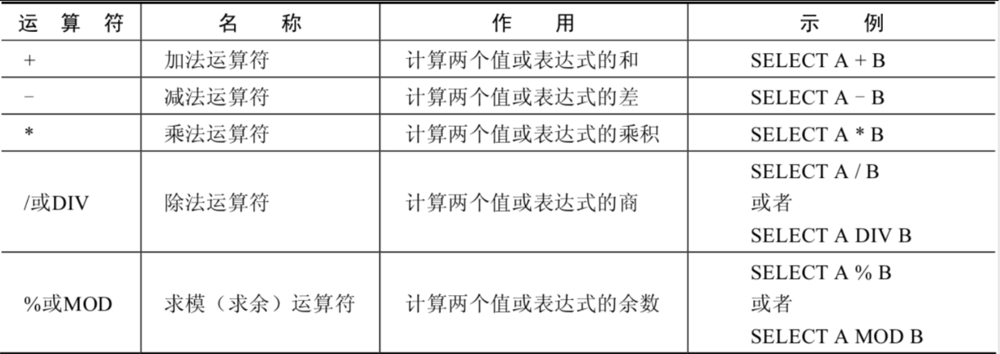
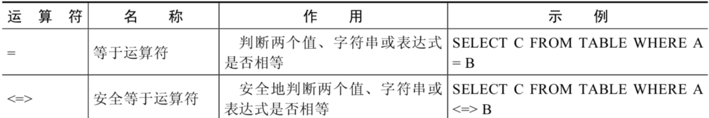
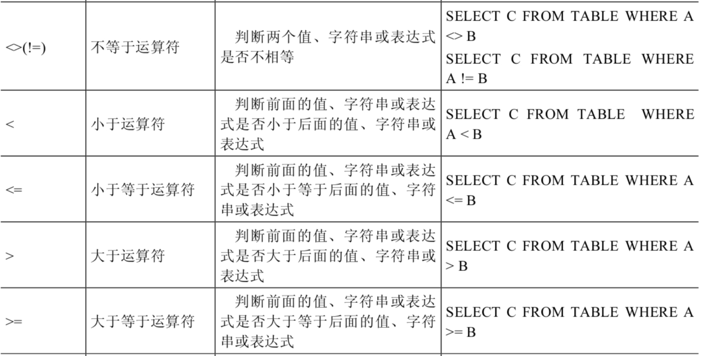
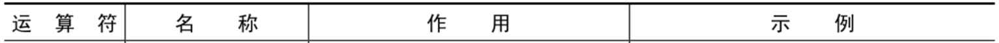
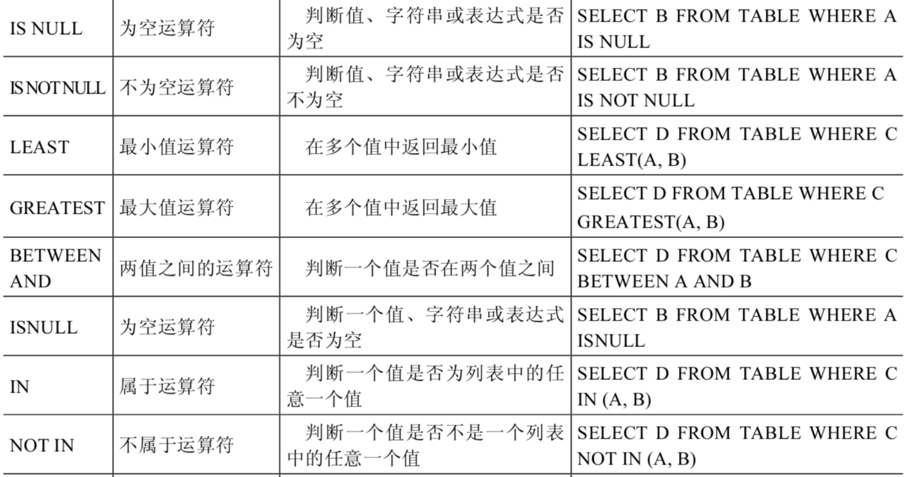
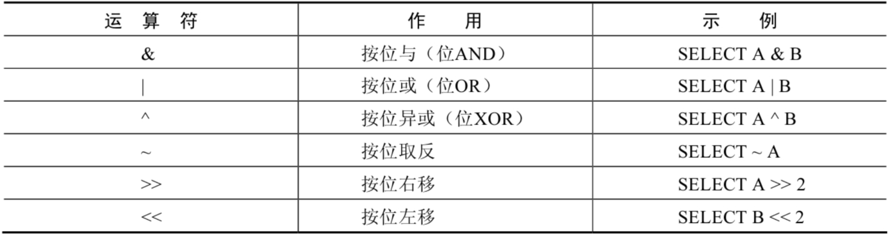
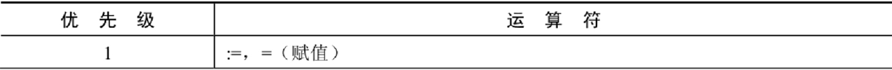
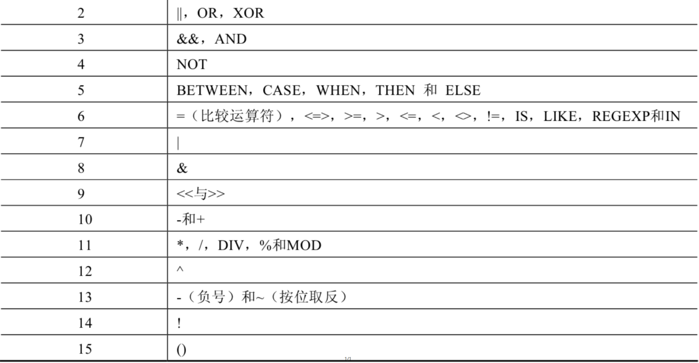
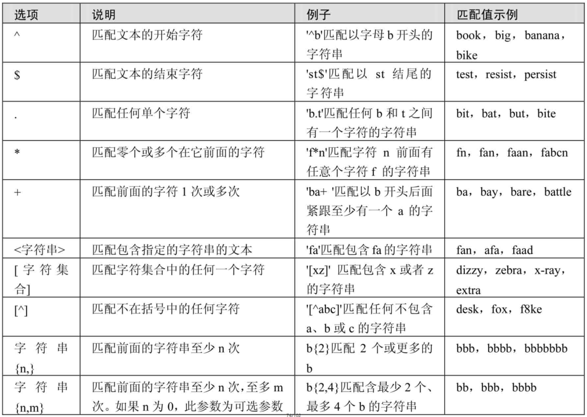

# 运算符

## 1. 算术运算符

算术运算符主要用于数学运算，其可以连接运算符前后的两个数值或表达式，对数值或表达式进行加（+）、减（-）、乘（*）、除（/）和取模（%）运算。



**1．加法与减法运算符**

```sql
SELECT 100 - 0; -- 100
SELECT 100 + 50; -- 150
SELECT 100 + 50 - 30; -- 120
SELECT 100 + 35.5; -- 135.5
SELECT 100 - 35.5; -- 64.5
```

由运算结果可以得出如下结论： 

> - 一个整数类型的值对整数进行加法和减法操作，结果还是一个整数；
> - 一个整数类型的值对浮点数进行加法和减法操作，结果是一个浮点数；
> - 加法和减法的优先级相同，进行先加后减操作与进行先减后加操作的结果是一样的；
> - 在Java中，+的左右两边如果有字符串，那么表示字符串的拼接。但是在MySQL中+只表示数值相加。如果遇到非数值类型，先尝试转成数值，如果转失败，就按0计算。（补充：MySQL中字符串拼接要使用字符串函数CONCAT()实现）

**2．乘法与除法运算符**

```sql
SELECT 100 * 1; -- 100
SELECT 100 * 1.0; -- 100.0
SELECT 100 / 1.0; -- 100.0000
SELECT 100 / 2; -- 50.0000
SELECT 100 + 2 * 5 / 2; -- 105.0000
SELECT 100 /3; -- 33.3333
SELECT 100 DIV 0; -- NULL


-- 计算出员工的年基本工资
SELECT emp_id,salary,salary * 12 annual_sal FROM employee;
```

由运算结果可以得出如下结论： 

> - 一个数乘以整数1和除以整数1后仍得原数；
> - 一个数乘以浮点数1和除以浮点数1后变成浮点数，数值与原数相等；
> - 一个数除以整数后，不管是否能除尽，结果都为一个浮点数；
> - 一个数除以另一个数，除不尽时，结果为一个浮点数，并保留到小数点后4位；
> - 乘法和除法的优先级相同，进行先乘后除操作与先除后乘操作，得出的结果相同。
> - 在数学运算中，0不能用作除数，在MySQL中，一个数除以0为NULL。 

**3．求模（求余）运算符**

```sql
SELECT 12 % 3; -- 0
SELECT 12 MOD 5; -- 2

-- 筛选出employee_id是偶数的员工
SELECT * FROM employee WHERE emp_id MOD 2 = 0;
```

## 2. 比较运算符

比较运算符用来对表达式左边的操作数和右边的操作数进行比较，比较的结果为真则返回1，比较的结果为假则返回0，其他情况则返回NULL。

比较运算符经常被用来作为SELECT查询语句的条件来使用，返回符合条件的结果记录。





**1．等号运算符**

-  等号运算符（=）判断等号两边的值、字符串或表达式是否相等，如果相等则返回1，不相等则返回0。 
-  在使用等号运算符时，遵循如下规则： 
   - 如果等号两边的值、字符串或表达式都为字符串，则MySQL会按照字符串进行比较，其比较的是每个字符串中字符的ANSI编码是否相等。
   - 如果等号两边的值都是整数，则MySQL会按照整数来比较两个值的大小。
   - 如果等号两边的值一个是整数，另一个是字符串，则MySQL会将字符串转化为数字进行比较。
   - 如果等号两边的值、字符串或表达式中有一个为NULL，则比较结果为NULL。
-  对比：SQL中赋值符号使用 := 

```sql
SELECT 1 = 1; -- 1
SELECT 1 = '1'; -- 1
SELECT 1 = 0; -- 1
SELECT 'a' = 'a'; -- 1
SELECT (5 + 3) = (2 + 6); -- 1
SELECT '' = NULL; -- NULL
SELECT NULL = NULL; -- NULL
SELECT 1 = 2; -- 0
SELECT 0 = 'abc'; -- 1
SELECT 1 = 'abc'; -- 0
```

**2．安全等于运算符**

安全等于运算符（<=>）与等于运算符（=）的作用是相似的，唯一的区别是`<=>`可以用来对NULL进行判断。在两个操作数均为NULL时，其返回值为1，而不为NULL；当一个操作数为NULL时，其返回值为0，而不为NULL。

```sql
SELECT 1 <=> '1' ; -- 1
SELECT 1 <=> 0 ; -- 0
SELECT 'a' <=> 'a' ; -- 1
SELECT (5 + 3) <=> (2 + 6) ; -- 1
SELECT '' <=> NULL ; -- 0
SELECT NULL <=> NULL ; -- 1

-- 查询commission_pct等于0.40
SELECT emp_id,commission_pct FROM employee WHERE commission_pct = 0.40;

SELECT emp_id,commission_pct FROM employee WHERE commission_pct <=> 0.40;
```

可以看到，使用安全等于运算符时，两边的操作数的值都为NULL时，返回的结果为1而不是NULL，其他返回结果与等于运算符相同。

**3．不等于运算符**

不等于运算符（<>和!=）用于判断两边的数字、字符串或者表达式的值是否不相等，如果不相等则返回1，相等则返回0。不等于运算符不能判断NULL值。如果两边的值有任意一个为NULL，或两边都为NULL，则结果为NULL。

SQL语句示例如下：

```sql
SELECT 1 <> 1; -- 0
SELECT 1 != 2; -- 1
SELECT 'a' != 'b'; -- 1
SELECT (3+4) <> (2+6); -- 1
SELECT 'a' != NULL; -- NULL
SELECT NULL <> NULL; -- NULL
```

此外，还有非符号类型的运算符：



**4. 空运算符**

空运算符（IS NULL或者ISNULL)判断一个值是否为NULL，如果为NULL则返回1，否则返回0。

SQL语句示例如下：

```sql
mysql> SELECT NULL IS NULL, ISNULL(NULL), ISNULL('a'), 1 IS NULL;
+--------------+--------------+-------------+-----------+
| NULL IS NULL | ISNULL(NULL) | ISNULL('a') | 1 IS NULL |
+--------------+--------------+-------------+-----------+
|            1 |            1 |           0 |         0 |
+--------------+--------------+-------------+-----------+

-- 查询commission_pct等于NULL。比较如下的四种写法
SELECT emp_id,commission_pct FROM employee WHERE commission_pct IS NULL;
SELECT emp_id,commission_pct FROM employee WHERE commission_pct <=> NULL;
SELECT emp_id,commission_pct FROM employee WHERE ISNULL(commission_pct);
SELECT emp_id,commission_pct FROM employee WHERE commission_pct = NULL;
```

**5. 非空运算符**

非空运算符（IS NOT NULL）判断一个值是否不为NULL，如果不为NULL则返回1，否则返回0。

SQL语句示例如下：

```sql
mysql> SELECT NULL IS NOT NULL, 'a' IS NOT NULL,  1 IS NOT NULL; 
+------------------+-----------------+---------------+
| NULL IS NOT NULL | 'a' IS NOT NULL | 1 IS NOT NULL |
+------------------+-----------------+---------------+
|                0 |               1 |             1 |
+------------------+-----------------+---------------+

-- 查询commission_pct不等于NULL
SELECT emp_id,commission_pct FROM employee WHERE commission_pct IS NOT NULL;
SELECT emp_id,commission_pct FROM employee WHERE NOT commission_pct <=> NULL;
SELECT emp_id,commission_pct FROM employee WHERE NOT ISNULL(commission_pct);
```

**6. 最小值运算符**

语法格式为：LEAST(值1，值2，...，值n)。其中，“值n”表示参数列表中有n个值。在有两个或多个参数的情况下，返回最小值。

```sql
SELECT LEAST (1,0,2); -- 0
SELECT LEAST('b','a','c'); -- a
SELECT LEAST(1,NULL,2); -- NULL
```

由结果可以看到，当参数是整数或者浮点数时，LEAST将返回其中最小的值；当参数为字符串时，返回字母表中顺序最靠前的字符；当比较值列表中有NULL时，不能判断大小，返回值为NULL。

**7. 最大值运算符**

语法格式为：GREATEST(值1，值2，...，值n)。其中，n表示参数列表中有n个值。当有两个或多个参数时，返回值为最大值。假如任意一个自变量为NULL，则GREATEST()的返回值为NULL。

```sql
SELECT GREATEST(1,0,2); -- 2
SELECT GREATEST('b','a','c'); -- c
SELECT GREATEST(1,NULL,2); -- NULL
```

由结果可以看到，当参数中是整数或者浮点数时，GREATEST将返回其中最大的值；当参数为字符串时，返回字母表中顺序最靠后的字符；当比较值列表中有NULL时，不能判断大小，返回值为NULL。

**8. BETWEEN AND运算符**

BETWEEN运算符使用的格式通常为SELECT D FROM TABLE WHERE C BETWEEN A AND B，此时，当C大于或等于A，并且C小于或等于B时，结果为1，否则结果为0。

```sql
SELECT 1 BETWEEN 0 AND 1; -- 1
SELECT 10 BETWEEN 11 AND 12; -- 0
SELECT 'b' BETWEEN 'a' AND 'c'; -- 1
```

**9. IN运算符**

IN运算符用于判断给定的值是否是IN列表中的一个值，如果是则返回1，否则返回0。如果给定的值为NULL，或者IN列表中存在NULL，则结果为NULL。

```sql
mysql> SELECT 'a' IN ('a','b','c'), 1 IN (2,3), NULL IN ('a','b'), 'a' IN ('a', NULL);
+----------------------+------------+-------------------+--------------------+
| 'a' IN ('a','b','c') | 1 IN (2,3) | NULL IN ('a','b') | 'a' IN ('a', NULL) |
+----------------------+------------+-------------------+--------------------+
|            1         |        0   |         NULL      |         1          |
+----------------------+------------+-------------------+--------------------+
```

**10. NOT IN运算符**

NOT IN运算符用于判断给定的值是否不是IN列表中的一个值，如果不是IN列表中的一个值，则返回1，否则返回0。

```sql
mysql> SELECT 'a' NOT IN ('a','b','c'), 1 NOT IN (2,3);
+--------------------------+----------------+
| 'a' NOT IN ('a','b','c') | 1 NOT IN (2,3) |
+--------------------------+----------------+
|                 0        |            1   |
+--------------------------+----------------+
```

**11. LIKE运算符**

LIKE运算符主要用来匹配字符串，通常用于模糊匹配，如果满足条件则返回1，否则返回0。如果给定的值或者匹配条件为NULL，则返回结果为NULL。<br />LIKE运算符通常使用如下通配符：

```sql
“%”：匹配0个或多个字符。
“_”：只能匹配一个字符。
```

SQL语句示例如下：

```sql
mysql> SELECT NULL LIKE 'abc', 'abc' LIKE NULL;  
+-----------------+-----------------+
| NULL LIKE 'abc' | 'abc' LIKE NULL |
+-----------------+-----------------+
|          NULL   |          NULL   |
+-----------------+-----------------+
```

**ESCAPE**

```sql
-- 回避特殊符号的：使用转义符。
SELECT job_id FROM jobs WHERE job_id LIKE 'IT\_%';

-- 如果使用\表示转义，要省略ESCAPE。如果不是\，则要加上ESCAPE。
SELECT job_id FROM jobs WHERE job_id LIKE 'IT$_%' escape '$';
```

**12. REGEXP运算符**

REGEXP运算符用来匹配字符串，语法格式为：`expr REGEXP 匹配条件`。如果expr满足匹配条件，返回1；如果不满足，则返回0。若expr或匹配条件任意一个为NULL，则结果为NULL。

REGEXP运算符在进行匹配时，常用的有下面几种通配符：

```sql
（1）'^' 匹配以该字符后面的字符开头的字符串。
（2）'$' 匹配以该字符前面的字符结尾的字符串。
（3）'.' 匹配任何一个单字符。
（4）"[...]" 匹配在方括号内的任何字符。
（5）'*' 匹配零个或多个在它前面的字符。
```

SQL语句示例如下：

```sql
mysql> SELECT 'manpahy' REGEXP '^m', 'manpahy' REGEXP 'y$', 'manpahy' REGEXP 'an';
+-----------------------+-----------------------+-----------------------+
| 'manpahy' REGEXP '^m' | 'manpahy' REGEXP 'y$' | 'manpahy' REGEXP 'an' |
+-----------------------+-----------------------+-----------------------+
|                     1 |                     1 |                     1 |
+-----------------------+-----------------------+-----------------------+
mysql> SELECT 'manaphy' REGEXP 'a.ap', 'manaphy' REGEXP '[ap]';
+-------------------------+-------------------------+
| 'manaphy' REGEXP 'a.ap' | 'manaphy' REGEXP '[ap]' |
+-------------------------+-------------------------+
|                       1 |                       1 |
+-------------------------+-------------------------+
```

## 3. 逻辑运算符

逻辑运算符主要用来判断表达式的真假，在MySQL中，逻辑运算符的返回结果为1、0或者NULL。

MySQL中支持4种逻辑运算符如下：


**1．逻辑非运算符**

逻辑非（NOT或!)运算符表示当给定的值为0时返回1；当给定的值为非0值时返回0；当给定的值为NULL时，返回NULL。

```sql
mysql> SELECT NOT 1, NOT 0, NOT(1+1), NOT !1, NOT NULL;    
+-------+-------+----------+--------+----------+
| NOT 1 | NOT 0 | NOT(1+1) | NOT !1 | NOT NULL |
+-------+-------+----------+--------+----------+
|     0 |     1 |        0 |      1 |     NULL |
+-------+-------+----------+--------+----------+
```

**2．逻辑与运算符**

逻辑与（AND或&&）运算符是当给定的所有值均为非0值，并且都不为NULL时，返回1；当给定的一个值或者多个值为0时则返回0；否则返回NULL。

```sql
mysql> SELECT 1 AND -1, 0 AND 1, 0 AND NULL, 1 AND NULL;
+----------+---------+------------+------------+
| 1 AND -1 | 0 AND 1 | 0 AND NULL | 1 AND NULL |
+----------+---------+------------+------------+
|        1 |       0 |          0 |       NULL |
+----------+---------+------------+------------+
```

**3．逻辑或运算符**

逻辑或（OR或||）运算符是当给定的值都不为NULL，并且任何一个值为非0值时，则返回1，否则返回0；当一个值为NULL，并且另一个值为非0值时，返回1，否则返回NULL；当两个值都为NULL时，返回NULL。

```sql
mysql> SELECT 1 OR -1, 1 OR 0, 1 OR NULL, 0 || NULL, NULL || NULL;     
+---------+--------+-----------+-----------+--------------+
| 1 OR -1 | 1 OR 0 | 1 OR NULL | 0 || NULL | NULL || NULL |
+---------+--------+-----------+-----------+--------------+
|       1 |      1 |         1 |    NULL   |       NULL   |
+---------+--------+-----------+-----------+--------------+
```

```sql
-- 查询基本薪资不在9000-12000之间的员工编号和基本薪资
SELECT emp_id,salary FROM employee
WHERE NOT (salary >= 9000 AND salary <= 12000);

SELECT emp_id,salary FROM employee
WHERE salary <9000 OR salary > 12000;

SELECT emp_id,salary FROM employee
WHERE salary NOT BETWEEN 9000 AND 12000;
```

> 注意：
> OR可以和AND一起使用，但是在使用时要注意两者的优先级，由于AND的优先级高于OR，因此先对AND两边的操作数进行操作，再与OR中的操作数结合。

**4．逻辑异或运算符**

逻辑异或（XOR）运算符是当给定的值中任意一个值为NULL时，则返回NULL；如果两个非NULL的值都是0或者都不等于0时，则返回0；如果一个值为0，另一个值不为0时，则返回1。

```sql
mysql> SELECT 1 XOR -1, 1 XOR 0, 0 XOR 0, 1 XOR NULL, 1 XOR 1 XOR 1, 0 XOR 0 XOR 0;
+----------+---------+---------+------------+---------------+---------------+
| 1 XOR -1 | 1 XOR 0 | 0 XOR 0 | 1 XOR NULL | 1 XOR 1 XOR 1 | 0 XOR 0 XOR 0 |
+----------+---------+---------+------------+---------------+---------------+
|        0 |       1 |       0 |       NULL |             1 |             0 |
+----------+---------+---------+------------+---------------+---------------+

select last_name,dept_id,salary from employee
where dept_id in (10,20) XOR salary > 8000;
```

## 4. 位运算符

位运算符是在二进制数上进行计算的运算符。位运算符会先将操作数变成二进制数，然后进行位运算，最后将计算结果从二进制变回十进制数。

MySQL支持的位运算符如下：



**1．按位与运算符**

按位与（&)运算符将给定值对应的二进制数逐位进行逻辑与运算。当给定值对应的二进制位的数值都为1时，则该位返回1，否则返回0。

```sql
mysql> SELECT 1 & 10, 20 & 30;
+--------+---------+
| 1 & 10 | 20 & 30 |
+--------+---------+
|      0 |      20 |
+--------+---------+
```

1的二进制数为0001，10的二进制数为1010，所以1 & 10的结果为0000，对应的十进制数为0。20的二进制数为10100，30的二进制数为11110，所以20 & 30的结果为10100，对应的十进制数为20。

**2. 按位或运算符**

按位或（|）运算符将给定的值对应的二进制数逐位进行逻辑或运算。当给定值对应的二进制位的数值有一个或两个为1时，则该位返回1，否则返回0。

```sql
mysql> SELECT 1 | 10, 20 | 30; 
+--------+---------+
| 1 | 10 | 20 | 30 |
+--------+---------+
|     11 |      30 |
+--------+---------+
```

1的二进制数为0001，10的二进制数为1010，所以1 | 10的结果为1011，对应的十进制数为11。20的二进制数为10100，30的二进制数为11110，所以20 | 30的结果为11110，对应的十进制数为30。

**3. 按位异或运算符**

按位异或（^）运算符将给定的值对应的二进制数逐位进行逻辑异或运算。当给定值对应的二进制位的数值不同时，则该位返回1，否则返回0。

```sql
mysql> SELECT 1 ^ 10, 20 ^ 30; 
+--------+---------+
| 1 ^ 10 | 20 ^ 30 |
+--------+---------+
|     11 |      10 |
+--------+---------+
```

1的二进制数为0001，10的二进制数为1010，所以1 ^ 10的结果为1011，对应的十进制数为11。20的二进制数为10100，30的二进制数为11110，所以20 ^ 30的结果为01010，对应的十进制数为10。

再举例：

```sql
mysql> SELECT 12 & 5, 12 | 5,12 ^ 5 FROM DUAL;
+--------+--------+--------+
| 12 & 5 | 12 | 5 | 12 ^ 5 |
+--------+--------+--------+
|      4 |     13 |      9 |
+--------+--------+--------+
```

**4. 按位取反运算符**

按位取反（~）运算符将给定的值的二进制数逐位进行取反操作，即将1变为0，将0变为1。

```sql
SELECT 10 & ~1; -- 10
```

由于按位取反（~）运算符的优先级高于按位与（&）运算符的优先级，所以10 & ~1，首先，对数字1进行按位取反操作，结果除了最低位为0，其他位都为1，然后与10进行按位与操作，结果为10。

**5. 按位右移运算符**

按位右移（>>）运算符将给定的值的二进制数的所有位右移指定的位数。右移指定的位数后，右边低位的数值被移出并丢弃，左边高位空出的位置用0补齐。

```sql
mysql> SELECT 1 >> 2, 4 >> 2;
+--------+--------+
| 1 >> 2 | 4 >> 2 |
+--------+--------+
|      0 |      1 |
+--------+--------+
```

1的二进制数为0000 0001，右移2位为0000 0000，对应的十进制数为0。4的二进制数为0000 0100，右移2位为0000 0001，对应的十进制数为1。

**6. 按位左移运算符**

按位左移（<<）运算符将给定的值的二进制数的所有位左移指定的位数。左移指定的位数后，左边高位的数值被移出并丢弃，右边低位空出的位置用0补齐。

```sql
mysql> SELECT 1 << 2, 4 << 2;  
+--------+--------+
| 1 << 2 | 4 << 2 |
+--------+--------+
|      4 |     16 |
+--------+--------+
```

1的二进制数为0000 0001，左移两位为0000 0100，对应的十进制数为4。4的二进制数为0000 0100，左移两位为0001 0000，对应的十进制数为16。

## 5. 运算符的优先级




数字编号越大，优先级越高，优先级高的运算符先进行计算。可以看到，赋值运算符的优先级最低，使用“()”括起来的表达式的优先级最高。

## 拓展：使用正则表达式查询

正则表达式通常被用来检索或替换那些符合某个模式的文本内容，根据指定的匹配模式匹配文本中符合要求的特殊字符串。例如，从一个文本文件中提取电话号码，查找一篇文章中重复的单词或者替换用户输入的某些敏感词语等，这些地方都可以使用正则表达式。正则表达式强大而且灵活，可以应用于非常复杂的查询。

MySQL中使用REGEXP关键字指定正则表达式的字符匹配模式。下表列出了REGEXP操作符中常用字符匹配列表。


