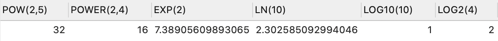

# 函数
## 1. 函数的理解
### 1.1 什么是函数
函数在计算机语言的使用中贯穿始终，函数的作用是什么呢？它可以把我们经常使用的代码封装起来，需要的时候直接调用即可。这样既`提高了代码效率`，又`提高了可维护性`。在 SQL 中我们也可以使用函数对检索出来的数据进行函数操作。使用这些函数，可以极大地`提高用户对数据库的管理效率`。

从函数定义的角度出发，我们可以将函数分成`内置函数`和`自定义函数`。在 SQL 语言中，同样也包括了内置函数和自定义函数。内置函数是系统内置的通用函数，而自定义函数是我们根据自己的需要编写的，本章及下一章讲解的是 SQL 的内置函数。

### 1.2 不同DBMS函数的差异
我们在使用 SQL 语言的时候，不是直接和这门语言打交道，而是通过它使用不同的数据库软件，即 DBMS。**DBMS 之间的差异性很大，远大于同一个语言不同版本之间的差异。**实际上，只有很少的函数是被 DBMS 同时支持的。比如，大多数 DBMS 使用（||）或者（+）来做拼接符，而在 MySQL 中的字符串拼接函数为concat()。大部分 DBMS 会有自己特定的函数，这就意味着**采用 SQL 函数的代码可移植性是很差的**，因此在使用函数的时候需要特别注意。
### 1.3 MySQL的内置函数及分类
MySQL提供了丰富的内置函数，这些函数使得数据的维护与管理更加方便，能够更好地提供数据的分析与统计功能，在一定程度上提高了开发人员进行数据分析与统计的效率。

MySQL提供的内置函数从`实现的功能角度`可以分为数值函数、字符串函数、日期和时间函数、流程控制函数、加密与解密函数、获取MySQL信息函数、聚合函数等。这里，我将这些丰富的内置函数再分为两类：`单行函数`、`聚合函数（或分组函数）`。

**两种SQL函数**


**单行函数**

- 操作数据对象
- 接受参数返回一个结果
- **只对一行进行变换**
- **每行返回一个结果**
- 可以嵌套
- 参数可以是一列或一个值
## 2. 数值函数
### 2.1 基本函数
| **函数** | **用法** |
| :-- | :-- |
| ABS(x) | 返回x的绝对值 |
| SIGN(X) | 返回X的符号。正数返回1，负数返回-1，0返回0 |
| PI() | 返回圆周率的值 |
| CEIL(x)，CEILING(x) | 返回大于或等于某个值的最小整数 |
| FLOOR(x) | 返回小于或等于某个值的最大整数 |
| LEAST(e1,e2,e3…) | 返回列表中的最小值 |
| GREATEST(e1,e2,e3…) | 返回列表中的最大值 |
| MOD(x,y) | 返回X除以Y后的余数 |
| RAND() | 返回0~1的随机值 |
| RAND(x) | 返回0~1的随机值，其中x的值用作种子值，相同的X值会产生相同的随机数 |
| ROUND(x) | 返回一个对x的值进行四舍五入后，最接近于X的整数 |
| ROUND(x,y) | 返回一个对x的值进行四舍五入后最接近X的值，并保留到小数点后面Y位 |
| TRUNCATE(x,y) | 返回数字x截断为y位小数的结果 |
| SQRT(x) | 返回x的平方根。当X的值为负数时，返回NULL |


### 2.2 角度与弧度互换函数
| **函数** | **用法** |
| :-- | :-- |
| RADIANS(x) | 将角度转化为弧度，其中，参数x为角度值 |
| DEGREES(x) | 将弧度转化为角度，其中，参数x为弧度值 |

```sql
mysql> SELECT RADIANS(30),RADIANS(60),RADIANS(90),DEGREES(2*PI()),DEGREES(RADIANS(90)) FROM DUAL;
+--------------------+--------------------+--------------------+-----------------+----------------------+
| RADIANS(30)        | RADIANS(60)        | RADIANS(90)        | DEGREES(2*PI()) | DEGREES(RADIANS(90)) |
+--------------------+--------------------+--------------------+-----------------+----------------------+
| 0.5235987755982988 | 1.0471975511965976 | 1.5707963267948966 |             360 |                   90 |
+--------------------+--------------------+--------------------+-----------------+----------------------+
```
### 2.3 三角函数
| **函数** | **用法** |
| :-- | :-- |
| SIN(x) | 返回x的正弦值，其中，参数x为弧度值 |
| ASIN(x) | 返回x的反正弦值，即获取正弦为x的值。如果x的值不在-1到1之间，则返回NULL |
| COS(x) | 返回x的余弦值，其中，参数x为弧度值 |
| ACOS(x) | 返回x的反余弦值，即获取余弦为x的值。如果x的值不在-1到1之间，则返回NULL |
| TAN(x) | 返回x的正切值，其中，参数x为弧度值 |
| ATAN(x) | 返回x的反正切值，即返回正切值为x的值 |
| ATAN2(m,n) | 返回两个参数的反正切值 |
| COT(x) | 返回x的余切值，其中，X为弧度值 |

举例：

ATAN2(M,N)函数返回两个参数的反正切值。

与ATAN(X)函数相比，ATAN2(M,N)需要两个参数，例如有两个点point(x1,y1)和point(x2,y2)，使用ATAN(X)函数计算反正切值为ATAN((y2-y1)/(x2-x1))，使用ATAN2(M,N)计算反正切值则为ATAN2(y2-y1,x2-x1)。由使用方式可以看出，当x2-x1等于0时，ATAN(X)函数会报错，而ATAN2(M,N)函数则仍然可以计算。

ATAN2(M,N)函数的使用示例如下：


### 2.4 指数与对数
| **函数** | **用法** |
| :-- | :-- |
| POW(x,y)，POWER(X,Y) | 返回x的y次方 |
| EXP(X) | 返回e的X次方，其中e是一个常数，2.718281828459045 |
| LN(X)，LOG(X) | 返回以e为底的X的对数，当X <= 0 时，返回的结果为NULL |
| LOG10(X) | 返回以10为底的X的对数，当X <= 0 时，返回的结果为NULL |
| LOG2(X) | 返回以2为底的X的对数，当X <= 0 时，返回NULL |



### 2.5 进制间的转换
| **函数** | **用法** |
| :-- | :-- |
| BIN(x) | 返回x的二进制编码 |
| HEX(x) | 返回x的十六进制编码 |
| OCT(x) | 返回x的八进制编码 |
| CONV(x,f1,f2) | 返回f1进制数变成f2进制数 |

```sql
mysql> SELECT BIN(10),HEX(10),OCT(10),CONV(10,2,8)
    -> FROM DUAL;
+---------+---------+---------+--------------+
| BIN(10) | HEX(10) | OCT(10) | CONV(10,2,8) |
+---------+---------+---------+--------------+
| 1010    | A       | 12      | 2            |
+---------+---------+---------+--------------+
```
## 3. 字符串函数
| **函数** | **用法** |
| :-- | :-- |
| **ASCII(S)** | 返回字符串S中的第一个字符的ASCII码值 |
| **CHAR_LENGTH(s)** | 返回字符串s的字符数。作用与CHARACTER_LENGTH(s)相同 |
| **LENGTH(s)** | 返回字符串s的字节数，和字符集有关 |
| **CONCAT(s1,s2,......,sn)** | 连接s1,s2,......,sn为一个字符串 |
| **CONCAT_WS(x, s1,s2,......,sn)** | 同CONCAT(s1,s2,...)函数，但是每个字符串之间要加上x |
| **INSERT(str, idx, len, replacestr)** | 将字符串str从第idx位置开始，len个字符长的子串替换为字符串replacestr |
| **REPLACE(str, a, b)** | 用字符串b替换字符串str中所有出现的字符串a |
| **UPPER(s) 或 UCASE(s)** | 将字符串s的所有字母转成大写字母 |
| **LOWER(s)  或LCASE(s)** | 将字符串s的所有字母转成小写字母 |
| **LEFT(str,n)** | 返回字符串str最左边的n个字符 |
| **RIGHT(str,n)** | 返回字符串str最右边的n个字符 |
| **LPAD(str, len, pad)** | 用字符串pad对str最左边进行填充，直到str的长度为len个字符 |
| **RPAD(str ,len, pad)** | 用字符串pad对str最右边进行填充，直到str的长度为len个字符 |
| **LTRIM(s)** | 去掉字符串s左侧的空格 |
| **RTRIM(s)** | 去掉字符串s右侧的空格 |
| **TRIM(s)** | 去掉字符串s开始与结尾的空格 |
| **TRIM(s1 FROM s)** | 去掉字符串s开始与结尾的s1 |
| **TRIM(LEADING s1 FROM s)** | 去掉字符串s开始处的s1 |
| **TRIM(TRAILING s1 FROM s)** | 去掉字符串s结尾处的s1 |
| **REPEAT(str, n)** | 返回str重复n次的结果 |
| **SPACE(n)** | 返回n个空格 |
| **STRCMP(s1,s2)** | 比较字符串s1,s2的ASCII码值的大小 |
| **SUBSTR(s,index,len)** | 返回从字符串s的index位置其len个字符，作用与SUBSTRING(s,n,len)、MID(s,n,len)相同 |
| **LOCATE(substr,str)** | 返回字符串substr在字符串str中首次出现的位置，作用于POSITION(substr IN str)、INSTR(str,substr)相同。未找到，返回0 |
| **ELT(m,s1,s2,…,sn)** | 返回指定位置的字符串，如果m=1，则返回s1，如果m=2，则返回s2，如果m=n，则返回sn |
| **FIELD(s,s1,s2,…,sn)** | 返回字符串s在字符串列表中第一次出现的位置 |
| **FIND_IN_SET(s1,s2)** | 返回字符串s1在字符串s2中出现的位置。其中，字符串s2是一个以逗号分隔的字符串 |
| **REVERSE(s)** | 返回s反转后的字符串 |
| **NULLIF(value1,value2)** | 比较两个字符串，如果value1与value2相等，则返回NULL，否则返回value1 |

::: warning

MySQL中，字符串的位置是从1开始的。

:::

举例：
```sql
SELECT FIELD('mm','hello','msm','amma'); -- 0
SELECT FIND_IN_SET('mm','hello,mm,amma'); -- 2

SELECT NULLIF('mysql','mysql'); -- NULL
SELECT NULLIF('mysql', ''); -- mysql
-- NULLIF可结合IFNULL判断如果column_name 为空或为null,则使用 replacement_value 代替
SELECT IFNULL(NULLIF(column_name,''),replacement_value) FROM table_name;
```
## 4. 日期和时间函数
### 4.1 获取日期、时间
| **函数** | **用法** |
| :-- | :-- |
| CURDATE()  CURRENT_DATE() | 返回当前日期，只包含年、月、日 |
| CURTIME()   CURRENT_TIME() | 返回当前时间，只包含时、分、秒 |
| NOW() / SYSDATE() / CURRENT_TIMESTAMP() <br />LOCALTIME() / LOCALTIMESTAMP() | 返回当前系统日期和时间 |
| UTC_DATE() | 返回UTC（世界标准时间）日期 |
| UTC_TIME() | 返回UTC（世界标准时间）时间 |

举例：


### 4.2 日期与时间戳的转换
| **函数** | **用法** |
| :-- | :-- |
| UNIX_TIMESTAMP() | 以UNIX时间戳的形式返回当前时间。 |
| UNIX_TIMESTAMP(date) | 将时间date以UNIX时间戳的形式返回。 |
| FROM_UNIXTIME(timestamp) | 将UNIX时间戳的时间转换为普通格式的时间 |

举例：
```sql
SELECT UNIX_TIMESTAMP(now()); -- 1637507021
SELECT UNIX_TIMESTAMP(CURDATE()); -- 1637452800
SELECT UNIX_TIMESTAMP(CURTIME()); -- 1637507045
SELECT UNIX_TIMESTAMP('2011-11-11 11:11:11'); -- 1320981071
SELECT FROM_UNIXTIME(1320981071); -- 2011-11-11 03:11:11
```
### 4.3 获取月份、星期、星期数、天数等函数
| **函数** | **用法** |
| :-- | :-- |
| YEAR(date) / MONTH(date) / DAY(date) | 返回具体的日期值 |
| HOUR(time) / MINUTE(time) / SECOND(time) | 返回具体的时间值 |
| MONTHNAME(date) | 返回月份：January，... |
| DAYNAME(date) | 返回星期几：MONDAY，TUESDAY.....SUNDAY |
| WEEKDAY(date) | 返回周几，注意，周1是0，周2是1，。。。周日是6 |
| QUARTER(date) | 返回日期对应的季度，范围为1～4 |
| WEEK(date) ， WEEKOFYEAR(date) | 返回一年中的第几周 |
| DAYOFYEAR(date) | 返回日期是一年中的第几天 |
| DAYOFMONTH(date) | 返回日期位于所在月份的第几天 |
| DAYOFWEEK(date) | 返回周几，注意：周日是1，周一是2，。。。周六是7 |

举例：


### 4.4 日期的操作函数
| **函数** | **用法** |
| :-- | :-- |
| EXTRACT(type FROM date) | 返回指定日期中特定的部分，type指定返回的值 |

EXTRACT(type FROM date)函数中type的取值与含义：


```sql
SELECT EXTRACT(MINUTE FROM NOW()), --7
EXTRACT( WEEK FROM NOW()), --47
EXTRACT( QUARTER FROM NOW()), --4
EXTRACT( MINUTE_SECOND FROM NOW()) --717
FROM DUAL;
```
### 4.5 时间和秒钟转换的函数
| **函数** | **用法** |
| :-- | :-- |
| TIME_TO_SEC(time) | 将 time 转化为秒并返回结果值。转化的公式为：`小时*3600+分钟*60+秒` |
| SEC_TO_TIME(seconds) | 将 seconds 描述转化为包含小时、分钟和秒的时间 |

### 4.6 计算日期和时间的函数
**第1组：**

| **函数** | **用法** |
| :-- | :-- |
| DATE_ADD(datetime, INTERVAL  expr type)，<br />ADDDATE(date,INTERVAL expr type) | 返回与给定日期时间相差INTERVAL时间段的日期时间 |
| DATE_SUB(date,INTERVAL expr type)，<br />SUBDATE(date,INTERVAL expr type) | 返回与date相差INTERVAL时间间隔的日期 |

上述函数中type的取值：


举例：

```sql
SELECT
	DATE_ADD( NOW(), INTERVAL 1 DAY ) AS col1,
	DATE_ADD( '2011-11-11 11:11:11', INTERVAL 1 SECOND ) AS col2,
	ADDDATE( '2011-11-11 11:11:11', INTERVAL 1 SECOND ) AS col3,
	DATE_ADD( '2011-11-11 11:11:11', INTERVAL '1_1' MINUTE_SECOND ) AS col4,
	DATE_ADD( '2011-11-11 11:11:11', INTERVAL - 1 YEAR ) AS col5,
	DATE_ADD( '2011-11-11 11:11:11', INTERVAL '1_1' YEAR_MONTH ) AS col6
FROM DUAL;
```


```sql
SELECT
	DATE_SUB( '2011-11-11', INTERVAL 31 DAY ) AS col1,
	SUBDATE( '2011-11-11', INTERVAL 31 DAY ) AS col2,
	DATE_SUB( '2011-11-11 11:11:11', INTERVAL '1 1' DAY_HOUR ) AS col3 
FROM DUAL;
```


**第2组：**

| **函数** | **用法** |
| :-- | :-- |
| ADDTIME(time1,time2) | 返回time1加上time2的时间。当time2为一个数字时，代表的是`秒`，可以为负数 |
| SUBTIME(time1,time2) | 返回time1减去time2后的时间。当time2为一个数字时，代表的是`秒`，可以为负数 |
| DATEDIFF(date1,date2) | 返回date1 - date2的日期间隔天数 |
| TIMEDIFF(time1, time2) | 返回time1 - time2的时间间隔 |
| FROM_DAYS(N) | 返回从0000年1月1日起，N天以后的日期 |
| TO_DAYS(date) | 返回日期date距离0000年1月1日的天数 |
| LAST_DAY(date) | 返回date所在月份的最后一天的日期 |
| MAKEDATE(year,n) | 针对给定年份与所在年份中的天数返回一个日期 |
| MAKETIME(hour,minute,second) | 将给定的小时、分钟和秒组合成时间并返回 |
| PERIOD_ADD(time,n) | 返回time加上n后的时间 |

举例：
```sql
SELECT
	ADDTIME( '2011-11-11 11:11:11', 20 ) AS col1,
	SUBTIME( '2011-11-11 11:11:11', 30 ) AS col2,
	SUBTIME( '2011-11-11 11:11:11', '1:1:3' ) AS col3,
	DATEDIFF( '2011-11-11 11:11:11', '2011-10-01' ) AS col4,
	TIMEDIFF( '2011-11-11 11:11:11', '2011-11-10 10:10:10' ) AS col5,
	FROM_DAYS( 1536 ) AS col6, #返回从0000年1月1日起，N天以后的日期
	TO_DAYS( '0000-10-01' ) AS col7, #返回日期date距离0000年1月1日的天数
	LAST_DAY(NOW()) AS col8,#返回date所在月份的最后一天的日期
	MAKEDATE( 2011, 315 ) AS col9,#针对给定年份与所在年份中的天数返回一个日期
	MAKETIME( 10, 21, 23 ) AS col10,#将给定的小时、分钟和秒组合成时间并返回
	PERIOD_ADD( 20200101010101, 10 ) AS col11 #返回time加上n后的时间
FROM
	DUAL;
```


**举例**：查询 7 天内的新增用户数有多少？

```sql
SELECT COUNT(*) as num FROM new_user WHERE TO_DAYS(NOW())-TO_DAYS(regist_time)<=7
```
### 4.7 日期的格式化与解析
| **函数** | **用法** |
| :-- | :-- |
| DATE_FORMAT(date,fmt) | 按照字符串fmt格式化日期date值 |
| TIME_FORMAT(time,fmt) | 按照字符串fmt格式化时间time值 |
| GET_FORMAT(date_type,format_type) | 返回日期字符串的显示格式 |
| STR_TO_DATE(str, fmt) | 按照字符串fmt对str进行解析，解析为一个日期 |

上述`非GET_FORMAT`函数中fmt参数常用的格式符：

| **格式符** | **说明** | **格式符** | **说明** |
| :-- | :-- | :-- | :-- |
| %Y | 4位数字表示年份 | %y | 表示两位数字表示年份 |
| %M | 月名表示月份（January,....） | %m | 两位数字表示月份（01,02,03。。。） |
| %b | 缩写的月名（Jan.，Feb.，....） | %c | 数字表示月份（1,2,3,...） |
| %D | 英文后缀表示月中的天数（1st,2nd,3rd,...） | %d | 两位数字表示月中的天数(01,02...) |
| %e | 数字形式表示月中的天数（1,2,3,4,5.....） |  |  |
| %H | 两位数字表示小数，24小时制（01,02..） | %h和%I | 两位数字表示小时，12小时制（01,02..） |
| %k | 数字形式的小时，24小时制(1,2,3) | %l | 数字形式表示小时，12小时制（1,2,3,4....） |
| %i | 两位数字表示分钟（00,01,02） | %S和%s | 两位数字表示秒(00,01,02...) |
| %W | 一周中的星期名称（Sunday...） | %a | 一周中的星期缩写（Sun.，Mon.,Tues.，..） |
| %w | 以数字表示周中的天数(0=Sunday,1=Monday....) |  |  |
| %j | 以3位数字表示年中的天数(001,002...) | %U | 以数字表示年中的第几周，（1,2,3。。）其中Sunday为周中第一天 |
| %u | 以数字表示年中的第几周, (1,2,3...)其中Monday为周中第一天 |  |  |
| %T | 24小时制 | %r | 12小时制 |
| %p | AM或PM | %% | 表示% |

GET_FORMAT函数中date_type和format_type参数取值如下：


举例：

```sql
SELECT DATE_FORMAT(NOW(), '%H:%i:%s'); -- 15:15:53
SELECT GET_FORMAT(DATE, 'USA'); -- %m.%d.%Y  
SELECT STR_TO_DATE('2020-01-01 00:00:00','%Y-%m-%d'); -- 2020-01-01

SELECT STR_TO_DATE('09/01/2009','%m/%d/%Y'); -- 2009-09-01
SELECT STR_TO_DATE('20140422154706','%Y%m%d%H%i%s'); -- 2014-04-22 15:47:06
SELECT STR_TO_DATE('2014-04-22 15:47:06','%Y-%m-%d %H:%i:%s'); -- 2014-04-22 15:47:06
SELECT DATE_FORMAT('2014-04-22 15:47:06',GET_FORMAT(DATE,'USA')); -- 04.22.2014
```
## 5. 流程控制函数
流程处理函数可以根据不同的条件，执行不同的处理流程，可以在SQL语句中实现不同的条件选择。MySQL中的流程处理函数主要包括IF()、IFNULL()和CASE()函数。

| **函数** | **用法** |
| :-- | :-- |
| IF(value,value1,value2) | 如果value的值为TRUE，返回value1，否则返回value2 |
| IFNULL(value1, value2) | 如果value1不为NULL，返回value1，否则返回value2 |
| CASE WHEN 条件1 THEN 结果1 WHEN 条件2 THEN 结果2 .... [ELSE resultn] END | 相当于Java的if...else if...else... |
| CASE  expr WHEN 常量值1 THEN 值1 WHEN 常量值1 THEN 值1 .... [ELSE 值n] END | 相当于Java的switch...case... |

```sql
SELECT IF(1 > 0,'正确','错误'); -- 正确
SELECT IFNULL(null,'Hello Word'); -- Hello Word
SELECT CASE 1 WHEN 1 THEN '我是1' WHEN 2 THEN '我是2' ELSE '你是谁' END; -- 我是1
SELECT CASE WHEN 1 > 0 THEN 'yes' WHEN 1 <= 0 THEN 'no' ELSE 'unknown' END; -- yes
SELECT CASE WHEN 1 < 0 THEN 'yes' WHEN 1 = 0 THEN 'no' ELSE 'unknown' END; -- unknown
SELECT CASE 1 WHEN 0 THEN 0 WHEN 1 THEN 1 ELSE -1 END; -- 1

SELECT emp_id,salary, CASE WHEN salary>=15000 THEN '高薪' 
				  WHEN salary>=10000 THEN '潜力股'  
				  WHEN salary>=8000 THEN '屌丝' 
				  ELSE '草根' END  "描述"
FROM employee;
SELECT oid,`status`, CASE `status` WHEN 1 THEN '未付款' 
								   WHEN 2 THEN '已付款' 
								   WHEN 3 THEN '已发货'  
								   WHEN 4 THEN '确认收货'  
								   ELSE '无效订单' END 
FROM t_order;
SELECT emp_id,12 * salary * (1 + IFNULL(commission_pct,0))
FROM employee;
SELECT last_name, job_id, salary,
       CASE job_id WHEN 'IT_PROG'  THEN  1.10*salary
                   WHEN 'ST_CLERK' THEN  1.15*salary
                   WHEN 'SA_REP'   THEN  1.20*salary
       			       ELSE salary     END   "REVISED_SALARY"
FROM   employee;
```
## 6. 加密与解密函数
加密与解密函数主要用于对数据库中的数据进行加密和解密处理，以防止数据被他人窃取。这些函数在保证数据库安全时非常有用。

| **函数** | **用法** |
| :-- | :-- |
| PASSWORD(str) | 返回字符串str的加密版本，41位长的字符串。加密结果`不可逆`，常用于用户的密码加密 |
| MD5(str) | 返回字符串str的md5加密后的值，也是一种加密方式。若参数为NULL，则会返回NULL |
| SHA(str) | 从原明文密码str计算并返回加密后的密码字符串，当参数为NULL时，返回NULL。`SHA加密算法比MD5更加安全`。 |
| ENCODE(value,password_seed) | 返回使用password_seed作为加密密码加密value |
| DECODE(value,password_seed) | 返回使用password_seed作为加密密码解密value |

可以看到，ENCODE(value,password_seed)函数与DECODE(value,password_seed)函数互为反函数。

举例：

```sql
SELECT md5('123') -- 202cb962ac59075b964b07152d234b70
SELECT SHA('Tom123') -- c7c506980abc31cc390a2438c90861d0f1216d50
```
```sql
mysql> SELECT PASSWORD('mysql'), PASSWORD(NULL); -- MySQL8已舍弃该方法
+-------------------------------------------+----------------+
| PASSWORD('mysql')                         | PASSWORD(NULL) |
+-------------------------------------------+----------------+
| *E74858DB86EBA20BC33D0AECAE8A8108C56B17FA |                |
+-------------------------------------------+----------------+

mysql> SELECT ENCODE('mysql', 'mysql'); -- MySQL8已舍弃该方法
+--------------------------+
| ENCODE('mysql', 'mysql') |
+--------------------------+
| íg　¼　ìÉ                 |
+--------------------------+

mysql> SELECT DECODE(ENCODE('mysql','mysql'),'mysql'); -- MySQL8已舍弃该方法
+-----------------------------------------+
| DECODE(ENCODE('mysql','mysql'),'mysql') |
+-----------------------------------------+
| mysql                                   |
+-----------------------------------------+
```
## 7. MySQL信息函数
MySQL中内置了一些可以查询MySQL信息的函数，这些函数主要用于帮助数据库开发或运维人员更好地对数据库进行维护工作。

| **函数** | **用法** |
| :-- | :-- |
| VERSION() | 返回当前MySQL的版本号 |
| CONNECTION_ID() | 返回当前MySQL服务器的连接数 |
| DATABASE()，SCHEMA() | 返回MySQL命令行当前所在的数据库 |
| USER()、CURRENT_USER()、SYSTEM_USER()、SESSION_USER() | 返回当前连接MySQL的用户名，返回结果格式为“主机名@用户名” |
| CHARSET(value) | 返回字符串value自变量的字符集 |
| COLLATION(value) | 返回字符串value的比较规则 |

举例：
```sql
SELECT DATABASE(); -- test
SELECT CHARSET('ABC'); -- utf8mb4
SELECT COLLATION('ABC'); -- utf8mb4_general_ci

SELECT USER(), CURRENT_USER(), SYSTEM_USER(),SESSION_USER(); -- root@localhost
```
## 8. 其他函数
MySQL中有些函数无法对其进行具体的分类，但是这些函数在MySQL的开发和运维过程中也是不容忽视的。

| **函数** | **用法** |
| :-- | :-- |
| FORMAT(value,n) | 返回对数字value进行格式化后的结果数据。n表示`四舍五入`后保留到小数点后n位 |
| CONV(value,from,to) | 将value的值进行不同进制之间的转换 |
| INET_ATON(ipvalue) | 将以点分隔的IP地址转化为一个数字 |
| INET_NTOA(value) | 将数字形式的IP地址转化为以点分隔的IP地址 |
| BENCHMARK(n,expr) | 将表达式expr重复执行n次。用于测试MySQL处理expr表达式所耗费的时间 |
| CONVERT(value USING char_code) | 将value所使用的字符编码修改为char_code |

举例：
```sql
SELECT FORMAT( 123.123, 2 ); -- 123.12
SELECT FORMAT( 123.523, 0 ); -- 124
SELECT FORMAT( 123.123, - 2 ); -- 123 [如果n的值小于或者等于0，则只保留整数部分]

SELECT CONV(16, 10, 2); -- 10000
SELECT CONV(8888,10,16); -- 22B8
SELECT CONV(NULL, 10, 2); -- NULL

SELECT INET_ATON('192.168.1.100'); -- 3232235876 [计算方式 192*256^3+168*256^2+1*256+100]
SELECT INET_NTOA(3232235876); -- 192.168.1.100

SELECT BENCHMARK(1000000, MD5('mysql')); 
```
## 9. 聚合函数
聚合（或聚集、分组）函数，它是对一组数据进行汇总的函数，输入的是一组数据的集合，输出的是单个值。

聚合函数有6种类型，分别是<span style="color:blue;font-weight:bold">AVG()、SUM()、MAX()、MIN()、COUNT()、GROUP_COUNT()</span>。

**聚合函数语法** 


::: tip

聚合函数不能嵌套调用。比如不能出现类似“AVG(SUM(字段名称))”形式的调用。

:::

### AVG和SUM函数
可以对**数值型数据**使用AVG 和 SUM 函数。
```sql
mysql> SELECT AVG(salary), MAX(salary),MIN(salary), SUM(salary)
    -> FROM   employee
    -> WHERE  job_id LIKE '%REP%';
+-------------+-------------+-------------+-------------+
| AVG(salary) | MAX(salary) | MIN(salary) | SUM(salary) |
+-------------+-------------+-------------+-------------+
| 8272.727273 |    11500.00 |     6000.00 |   273000.00 |
+-------------+-------------+-------------+-------------+
```
### MIN和MAX函数
可以对**任意数据类型**的数据使用 MIN 和 MAX 函数。
```sql
mysql> SELECT MIN(hire_date), MAX(hire_date)
    -> FROM  employee;
+----------------+----------------+
| MIN(hire_date) | MAX(hire_date) |
+----------------+----------------+
| 1987-06-17     | 2000-04-21     |
+----------------+----------------+
```
### COUNT函数

- COUNT(*)返回表中记录总数，适用于**任意数据类型**。
```sql
SELECT COUNT(*) FROM employee WHERE dept_id = 50;
```

- COUNT(expr) 返回**expr不为空**的记录总数。
```sql
SELECT COUNT(commission_pct) FROM employee WHERE dept_id = 50;
```

-  **问题：用count()，count(1)，count(列名)谁好呢?**<br />其实，对于MyISAM引擎的表是没有区别的。这种引擎内部有一计数器在维护着行数。<br />Innodb引擎的表用count(*),count(1)直接读行数，复杂度是O(n)，因为innodb真的要去数一遍。但好于具体的count(列名)。 
-  **问题：能不能使用count(列名)替换count(*)?**<br />不要使用 count(列名)来替代 `count(*)`，`count(*)`是 SQL92 定义的标准统计行数的语法，跟数据库无关，跟 NULL 和非 NULL 无关。<br />说明：count(*)会统计值为 NULL 的行，而 count(列名)不会统计此列为 NULL 值的行。 
## 10. GROUP BY
### 基本使用
**可以使用GROUP BY子句将表中的数据分成若干组**
```sql
SELECT column, group_function(column)
FROM table
[WHERE	condition]
[GROUP BY	group_by_expression]
[ORDER BY	column];
```
**在SELECT列表中所有未包含在组函数中的列都应该包含在 GROUP BY子句中**

```sql
mysql> SELECT   dept_id, AVG(salary)
    -> FROM     employee
    -> GROUP BY dept_id ;
+---------------+--------------+
| dept_id       | AVG(salary)  |
+---------------+--------------+
|          NULL |  7000.000000 |
|            10 |  4400.000000 |
|            20 |  9500.000000 |
|            30 |  4150.000000 |
|            40 |  6500.000000 |
|            50 |  3475.555556 |
|            60 |  5760.000000 |
|            70 | 10000.000000 |
|            80 |  8955.882353 |
|            90 | 19333.333333 |
|           100 |  8600.000000 |
|           110 | 10150.000000 |
+---------------+--------------+
```
包含在 GROUP BY 子句中的列不必包含在SELECT 列表中
```sql
mysql> SELECT   AVG(salary)
    -> FROM     employee
    -> GROUP BY dept_id ;
+--------------+
| AVG(salary)  |
+--------------+
|  7000.000000 |
|  4400.000000 |
|  9500.000000 |
|  4150.000000 |
|  6500.000000 |
|  3475.555556 |
|  5760.000000 |
| 10000.000000 |
|  8955.882353 |
| 19333.333333 |
|  8600.000000 |
| 10150.000000 |
+--------------+
```
### 使用多个列分组
```sql
mysql> SELECT   dept_id, job_id, SUM(salary)
    -> FROM     employee
    -> GROUP BY dept_id, job_id ;
+---------+------------+-------------+
| dept_id | job_id     | SUM(salary) |
+---------+------------+-------------+
|      90 | AD_PRES    |    24000.00 |
|      90 | AD_VP      |    34000.00 |
|      60 | IT_PROG    |    28800.00 |
|     100 | FI_MGR     |    12000.00 |
|     100 | FI_ACCOUNT |    39600.00 |
|      30 | PU_MAN     |    11000.00 |
|      30 | PU_CLERK   |    13900.00 |
|      50 | ST_MAN     |    36400.00 |
|      50 | ST_CLERK   |    55700.00 |
|      80 | SA_MAN     |    61000.00 |
|      80 | SA_REP     |   243500.00 |
|    NULL | SA_REP     |     7000.00 |
|      50 | SH_CLERK   |    64300.00 |
|      10 | AD_ASST    |     4400.00 |
|      20 | MK_MAN     |    13000.00 |
|      20 | MK_REP     |     6000.00 |
|      40 | HR_REP     |     6500.00 |
|      70 | PR_REP     |    10000.00 |
|     110 | AC_MGR     |    12000.00 |
|     110 | AC_ACCOUNT |     8300.00 |
+---------+------------+-------------+
```
### GROUP BY中使用WITH ROLLUP
使用`WITH ROLLUP`关键字之后，在所有查询出的分组记录之后增加一条记录，该记录计算查询出的所有记录的总和，即统计记录数量。
```sql
SELECT dept_id,SUM(salary)
FROM employee
WHERE dept_id > 80
GROUP BY dept_id WITH ROLLUP;
+---------+-------------+
| dept_id | sum(salary) |
+---------+-------------+
|      90 |    58000.00 |
|     100 |    51600.00 |
|     110 |    20300.00 |
|    NULL |   129900.00 |
+---------+-------------+

SELECT coalesce(dept_id, 'total'),sum(salary)
FROM employee
WHERE dept_id > 80
GROUP BY dept_id WITH ROLLUP;
+----------------------------+-------------+
| coalesce(dept_id, 'total') | sum(salary) |
+----------------------------+-------------+
| 90                         |    58000.00 |
| 100                        |    51600.00 |
| 110                        |    20300.00 |
| total                      |   129900.00 |
+----------------------------+-------------+
```
::: warning

当使用ROLLUP时，不能同时使用ORDER BY子句进行结果排序，即ROLLUP和ORDER BY是互相排斥的。

::: 


## 11. HAVING
### 基本使用
**过滤分组：HAVING子句**

1. 行已经被分组。
2. 使用了聚合函数。
3. 满足HAVING 子句中条件的分组将被显示。
4. HAVING 不能单独使用，必须要跟 GROUP BY 一起使用。


```sql
SELECT   dept_id, MAX(salary)
FROM     employee
GROUP BY dept_id
HAVING   MAX(salary)>10000 ;
+---------------+-------------+
| dept_id       | MAX(salary) |
+---------------+-------------+
|            20 |    13000.00 |
|            30 |    11000.00 |
|            80 |    14000.00 |
|            90 |    24000.00 |
|           100 |    12000.00 |
|           110 |    12000.00 |
+---------------+-------------+
```

- **非法使用聚合函数：不能在 WHERE 子句中使用聚合函数。**
```sql
mysql> SELECT   department_id, AVG(salary)
    -> FROM     employee
    -> WHERE    AVG(salary) > 8000
    -> GROUP BY department_id;
ERROR 1111 (HY000): Invalid use of group function
```
### WHERE和HAVING的对比
**区别1：WHERE 可以直接使用表中的字段作为筛选条件，但不能使用分组中的计算函数作为筛选条件；HAVING 必须要与 GROUP BY 配合使用，可以把分组计算的函数和分组字段作为筛选条件。**

这决定了，在需要对数据进行分组统计的时候，HAVING 可以完成 WHERE 不能完成的任务。这是因为，在查询语法结构中，WHERE 在 GROUP BY 之前，所以无法对分组结果进行筛选。HAVING 在 GROUP BY 之后，可以使用分组字段和分组中的计算函数，对分组的结果集进行筛选，这个功能是 WHERE 无法完成的。另外，WHERE排除的记录不再包括在分组中。

区别2：如果需要通过连接从关联表中获取需要的数据，WHERE 是先筛选后连接，而 HAVING 是先连接后筛选。 这一点，就决定了在关联查询中，WHERE 比 HAVING 更高效。因为 WHERE 可以先筛选，用一个筛选后的较小数据集和关联表进行连接，这样占用的资源比较少，执行效率也比较高。HAVING 则需要先把结果集准备好，也就是用未被筛选的数据集进行关联，然后对这个大的数据集进行筛选，这样占用的资源就比较多，执行效率也较低。

小结如下：

|  | **优点** | **缺点** |
| :-- | :-- | :-- |
| WHERE | 先筛选数据再关联，执行效率高 | 不能使用分组中的计算函数进行筛选 |
| HAVING | 可以使用分组中的计算函数 | 在最后的结果集中进行筛选，执行效率较低 |

**开发中的选择：**

WHERE 和 HAVING 也不是互相排斥的，我们可以在一个查询里面同时使用 WHERE 和 HAVING。包含分组统计函数的条件用 HAVING，普通条件用 WHERE。这样，我们就既利用了 WHERE 条件的高效快速，又发挥了 HAVING 可以使用包含分组统计函数的查询条件的优点。当数据量特别大的时候，运行效率会有很大的差别。

