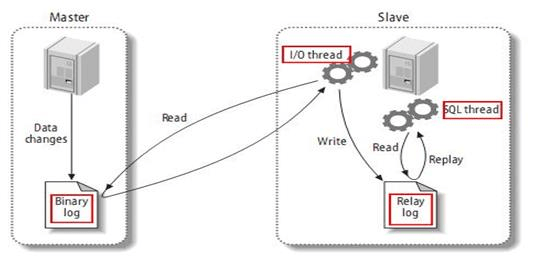
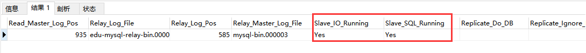

## Windows MySQL 8.0安装教程
1. 从[https://downloads.mysql.com/archives/community/](https://downloads.mysql.com/archives/community/) 下载zip包
2. 解压到指定目录，如 `D:\env\mysql-8.0.26`
3. 配置环境变量: 在path中配置`D:\env\mysql-8.0.26\bin`
4. 在mysql目录下创建`my.ini`文件
```bash
[mysql]
# 设置mysql客户端默认字符集
default-character-set=utf8mb4
 [client]
# 设置mysql客户端连接服务端时默认使用的端口
port=3306
default-character-set=utf8mb4
[mysqld]
# 设置3306端口
port = 3306
# 设置mysql的安装目录
basedir=D:\env\mysql-8.0.26
# 设置 mysql数据库的数据的存放目录，MySQL 8+ 不需要以下配置，系统自己生成即可，否则有可能报错
datadir=D:\env\mysql-8.0.26\data
# 允许最大连接数
max_connections=200
# 允许连接失败的次数。这是为了防止有人从该主机试图攻击数据库系统
max_connect_errors=10
# 服务端使用的字符集默认为UTF8
character-set-server=utf8mb4
# 创建新表时将使用的默认存储引擎
default-storage-engine=INNODB
# 默认使用 caching_sha2_password 插件认证
authentication_policy=caching_sha2_password
```

5. 以管理员身份运行cmd
6. 在MySQL安装目录的 bin 目录下执行命令：

注：重装时要清空data目录
`mysqld --initialize --console`

7. 执行完成后，会打印 root 用户的初始默认密码,复制密码

`A temporary password is generated for root@localhost: b(f:37xt6awA`

8. 在bin目录下输入
```bash
mysqld.exe install
# 启动mysql服务
net start mysql
```

9. 服务启动后,执行 `mysql -uroot -p` 回车后输入默认密码`b(f:37xt6awA`
```sql
-- 修改密码
ALTER USER 'root'@'localhost' IDENTIFIED BY 'yourpassword';
-- 设置允许别人远程链接
use mysql;
update user set host = '%' where user = 'root';
-- 刷新权限
flush privileges;
-- 把所有权限给了root用户,ip不限,只要是root用户登录就能进来
grant all privileges  on *.* to root@'%';
-- 再次刷新权限
flush privileges;
```
## Mac 安装MySQL压缩版

1. 从官网下载对应的版本，如 `mysql-8.0.34-macos13-arm64.tar.gz` 。过程略...
2. 解压到想要安装的目录并重命名，如 `/Users/manaphy/opt/mysql`
3. 配置环境变量(这里的MYSQL_HOME要跟你安装的目录相同)
```bash
export MYSQL_HOME=/Users/manaphy/opt/mysql
export PATH=$MYSQL_HOME/bin:$MYSQL_HOME/support-files:$PATH
```

4. 打开修改 `/Users/manaphy/opt/mysql/support-files/mysql.server` 文件，找到并添加以下内容
```bash
basedir=/Users/manaphy/opt/mysql
datadir=$basedir/data
```

5. 初始化配置文件，在mysql目录创建 `my.cnf` 文件并填写以下内容
```properties
[mysql]
# 设置mysql客户端默认字符集
default-character-set=utf8mb4
 [client]
# 设置mysql客户端连接服务端时默认使用的端口
port=3306
default-character-set=utf8mb4
[mysqld]
# 设置3306端口
port = 3306
# 允许最大连接数
max_connections=200
# 允许连接失败的次数。这是为了防止有人从该主机试图攻击数据库系统
max_connect_errors=10
# 服务端使用的字符集默认为UTF8
character-set-server=utf8mb4
# 创建新表时将使用的默认存储引擎
default-storage-engine=INNODB
```

6. 初始化mysql，执行以下命令(这里的**manaphy**是你自己的用户名)

```bash
sudo mysqld --initialize --user=manaphy
```
执行后从`[Server] A temporary password is generated for root@localhost: >FqX!.R<)1aT`获取root账号的初始密码`>FqX!.R<)1aT`

7. 启动mysql
```bash
mysql.server start # 启动
mysql.server stop # 停止
mysql.server status #查看状态
```

8. 登录并重置密码
```sql
mysql -uroot -p -- 回车后输入刚刚的默认密码
-- 修改密码
ALTER USER 'root'@'localhost' IDENTIFIED BY 'yourpassword';
-- 设置允许别人远程链接
use mysql;
update user set host = '%' where user = 'root';
-- 刷新权限
flush privileges;
-- 把所有权限给了root用户,ip不限,只要是root用户登录就能进来
grant all privileges  on *.* to root@'%';
-- 再次刷新权限
flush privileges;
```
## 清理 MySQL 的 binlog
**手动删除**

直接在 `/var/lib/mysql` 路径下，将 `binlog.0*` 删除掉（注意不要删除 `binlog.index`）

该方法不推荐，因为手动删除并不会更新 `binlog.index`，而 `binlog.index` 的作用是加快查找 `binlog` 文件的速度。

```sql
-- 删除指定编号之前的 binlog
PURGE MASTER LOGS TO 'binlog.000002';
-- 删除指定日期之前的 binlog
PURGE MASTER LOGS BEFORE '2020-11-11 11:11:11';
-- 清空所有 binlog
RESET MASTER;
-- 配置自动清理
set global binlog_expire_logs_seconds=7;
```
## 导出MySQL在特定时间的增删改记录
```bash
/usr/bin/mysqlbinlog --start-datetime="2021-01-20 14:00:00" \
	--stop-datetime="2021-01-20 16:00:00" /var/lib/mysql/binlog.000009 \
  --base64-output=DECODE-ROWS -v >/var/lib/mysql/mysqlbak.log
```
## MySQL中的any_value()函数

1. MySQL5.7之后，sql_mode中ONLY_FULL_GROUP_BY模式默认设置为打开状态。
2. ONLY_FULL_GROUP_BY的语义就是确定select target list中的所有列的值都是明确语义，简单的说来，在此模式下，target list中的值要么是来自于聚合函数（sum、avg、max等）的结果，要么是来自于group by list中的表达式的值
3. MySQL提供了any_value()函数来抑制ONLY_FULL_GROUP_BY值被拒绝
4. any_value()会选择被分到同一组的数据里第一条数据的指定列值作为返回数据
## 修改docker的mysql时区
```bash
docker cp /usr/share/zoneinfo/Asia/Shanghai mysql:/etc/localtime
docker restart mysql
```
## MySQL查询重复数据
```sql
SELECT * FROM `emp` WHERE name in (
SELECT name FROM `emp` GROUP BY name HAVING COUNT(name)>1 )
```
## Docker中MySQL8.0修改密码
```bash
# 进入docker中的mysql
docker exec -it mysql mysql -uroot -p
# 进入 mysql 数据库
use mysql;
# 使用以下两条命令修改密码
ALTER USER 'root'@'%' IDENTIFIED BY 'chen111' PASSWORD EXPIRE NEVER;
ALTER USER 'root'@'%' IDENTIFIED BY 'chen111';
# 退出并重启容器
exit
docker restart mysql
```
## MySQL实现rownum方式
```sql
SELECT @rownum:=@rownum+1 AS rownum, employee.*
FROM (SELECT @rownum:=0) r, employee;
```
## MySQL在不清除数据的情况下重置id自增长
```sql
alter table `example` drop id;

alter table `example` add id bigint primary key not null auto_increment first;
```
## MySQL让自增id加1
```sql
update sometable set id = id+1 where id > 10 order by id desc;
```
## MySQL修改表的排序规则
```sql
ALTER TABLE `example` CONVERT TO CHARACTER SET utf8mb4 COLLATE utf8mb4_general_ci;
```
## Mysql统计每天 每周 每年订单量
### 统计一周订单量
```sql
SELECT
	DATE(create_date) AS date,
	COUNT(1) AS count 
FROM
	orders 
WHERE
	DATE_SUB( CURDATE(), INTERVAL 7 DAY ) <= DATE( create_date ) 
GROUP BY
	date;
```
sql 语句解析

- date(create_date): 将日期格式化为 `2000-01-01`这种格式
- curdate() :获取当前日期 `2020-06-30` 等同于 `date(now())`
- date_sub(curdate(), interval 7 day): 获取7天前的日期

但该语句不会显示没有订单的日期,参考其他博客将sql优化为如下
```sql
select a.date,ifnull(b.count,0) as count
from (
    SELECT curdate() as date
    union all
    SELECT date_sub(curdate(), interval 1 day) as click_date
    union all
    SELECT date_sub(curdate(), interval 2 day) as click_date
    union all
    SELECT date_sub(curdate(), interval 3 day) as click_date
    union all
    SELECT date_sub(curdate(), interval 4 day) as click_date
    union all
    SELECT date_sub(curdate(), interval 5 day) as click_date
    union all
    SELECT date_sub(curdate(), interval 6 day) as click_date
) a left join (
  select date(create_date) as createdate, count(*) as count
  from orders
  group by date(create_date)
) b on a.date = b.createdate;
```
### 统计每年的订单量
```sql
SELECT YEAR(create_date) as year,COUNT(1) as count 
FROM orders  
GROUP BY year;
```
### 统计今年每个月的订单量
```sql
SELECT MONTH(create_date) as month,COUNT(1) as count 
FROM orders 
WHERE YEAR(create_date) = YEAR(NOW()) 
GROUP BY month 
ORDER BY month;
```
### 统计今年每周的订单量
```sql
SELECT WEEK(create_date) as week,COUNT(1) as count 
FROM orders 
WHERE YEAR(create_date) = YEAR(NOW()) 
GROUP BY week 
ORDER BY week;
```
### 查询MySQL执行情况
```sql
SHOW FULL PROCESSLIST;
```

## 基于docker容器搭建mysql主从服务器

### MySQL 主从复制原理



#### 1.在服务器上建立以下目录

```shell
mysql/
├── master
│   ├── config
│   │   └── my.cnf
│   └── data
└── slave
    ├── config
    │   └── my.cnf
    └── data
```

#### 2.编辑主从数据库配置my.cnf

##### 2.1 主数据库

```shell
[mysqld]
pid-file        = /var/run/mysqld/mysqld.pid
socket          = /var/run/mysqld/mysqld.sock
datadir         = /var/lib/mysql
secure-file-priv= /var/lib/mysql
lower_case_table_names=1
symbolic-links=0
#主服务器唯一ID
server-id=100
#启用二进制日志
log-bin=mysql-bin
# 设置不要复制的数据库(可设置多个)
#binlog-ignore-db=mysql
#binlog-ignore-db=information_schema
#设置需要复制的数据库
#binlog-do-db=spring_boot
#设置logbin格式
#binlog_format=STATEMENT
```

##### 2.2 从数据库

```shell
[mysqld]
pid-file        = /var/run/mysqld/mysqld.pid
socket          = /var/run/mysqld/mysqld.sock
datadir         = /var/lib/mysql
secure-file-priv= /var/lib/mysql
lower_case_table_names=1
symbolic-links=0
#从服务器唯一ID
server-id=101
log-bin=mysql-bin
#启用中继日志
relay_log=edu-mysql-relay-bin
```

#### 3. 使用 docker 搭建 mysql

```shell
#拉取镜像
docker pull mysql:5.7.29
#搭建主服务器
docker run --name mysql_master -p 23306:3306 --privileged=true \
-v /root/docker/mysql/master/config/my.cnf:/etc/mysql/my.cnf \
-v /root/docker/mysql/master/data:/var/lib/mysql \
-e MYSQL_ROOT_PASSWORD=123456 -d mysql:5.7.29
#搭建从服务器
docker run --name mysql_slave  -p 23307:3306 --privileged=true \
-v /root/docker/mysql/slave/config/my.cnf:/etc/mysql/my.cnf \
-v /root/docker/mysql/slave/data:/var/lib/mysql \
-e MYSQL_ROOT_PASSWORD=123456 -d mysql:5.7.29
```

通过Navicat等连接工具连接数据库连接主服务器,
执行创建用户及授权命令：

```
create user 'slave'@'%' identified with mysql_native_password by '123456';
GRANT REPLICATION SLAVE, REPLICATION CLIENT ON *.* TO 'slave'@'%';
```

执行`show master status;`获取以下结果


在服务器执行`docker inspect --format='{ {.NetworkSettings.IPAddress} }' 容器名称|容器id`获取主服务器容器的独立ip


连接从服务器,执行以下命令

```
change master to master_host='172.17.0.4',  # Master 的地址，指的是容器的独立 ip
master_user='slave', #用于数据同步的用户
master_password='123456', #用于同步的用户的密码
master_port=3306, # Master 的端口号，指的是容器的端口号
master_log_file='mysql-bin.000003', #指定 Slave 从哪个日志文件开始复制数据，即上图中的 File 字段的值
master_log_pos= 935, #从哪个 Position 开始读，即上图中的 Position 字段的值
master_connect_retry=30; #如果连接失败，重试的时间间隔，单位是秒，默认是60秒
```

执行`start slave`通过`show slave status`查看状态



红框里两个Yes代表搭建成功

### 搭建 MySQL 数据库主从复制（双主双从）

#### 1. 双主机配置

Master1配置

```shell
#主服务器唯一ID
server-id=100
#启用二进制日志
log-bin=mysql-bin
# 设置不要复制的数据库(可设置多个)
#binlog-ignore-db=mysql
#binlog-ignore-db=information_schema
#设置需要复制的数据库
#binlog-do-db=需要复制的主数据库名字
#设置logbin格式
#binlog_format=STATEMENT
# 在作为从数据库的时候，有写入操作也要更新二进制日志文件
log-slave-updates 
#表示自增长字段每次递增的量，指自增字段的起始值，其默认值是1，取值范围是1 .. 65535
auto-increment-increment=2 
# 表示自增长字段从哪个数开始，指字段一次递增多少，他的取值范围是1 .. 65535
auto-increment-offset=1
```

Master2配置

```shell
#主服务器唯一ID
server-id=102 #启用二进制日志
log-bin=mysql-bin
# 设置不要复制的数据库(可设置多个)
#binlog-ignore-db=mysql
#binlog-ignore-db=information_schema
#设置需要复制的数据库
#binlog-do-db=需要复制的主数据库名字
#设置logbin格式
#binlog_format=STATEMENT
# 在作为从数据库的时候，有写入操作也要更新二进制日志文件
log-slave-updates 
#表示自增长字段每次递增的量，指自增字段的起始值，其默认值是1，取值范围是1 .. 65535
auto-increment-increment=2 
# 表示自增长字段从哪个数开始，指字段一次递增多少，他的取值范围是1 .. 65535
auto-increment-offset=2
```

#### 2. 双从机配置

Slave1配置

```shell
#从服务器唯一ID
server-id=101
log-bin=mysql-bin
#启用中继日志
relay_log=edu-mysql-relay-bin
```

Slave2配置

```shell
#从服务器唯一ID
server-id=103
log-bin=mysql-bin
#启用中继日志
relay_log=edu-mysql-relay-bin
```

#### 3. 双主机、双从机重启 mysql 服务

#### 4. 在两台主机上建立帐户并授权 slave

```
create user 'slave'@'%' identified with mysql_native_password by '123456';
GRANT REPLICATION SLAVE, REPLICATION CLIENT ON *.* TO 'slave'@'%';
```

执行`show master status;`查询Master1和Master2的状态并记录

#### 5. 在从机上配置需要复制的主机

Slava1 复制 Master1，Slava2 复制 Master2

方法同上

#### 6. 两个主机互相复制

Master2 复制 Master1，Master1 复制 Master2

方法同上

#### 7.测试

Master1 主机新建库、新建表、insert 记录，Master2 和从机复制
