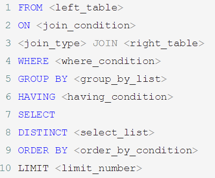
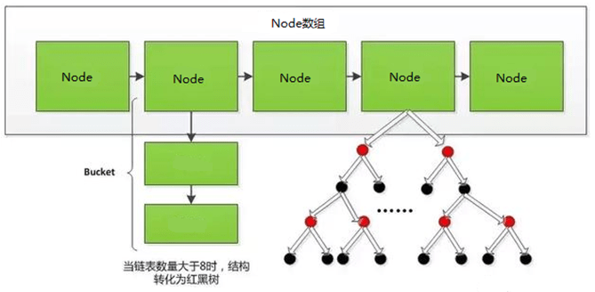
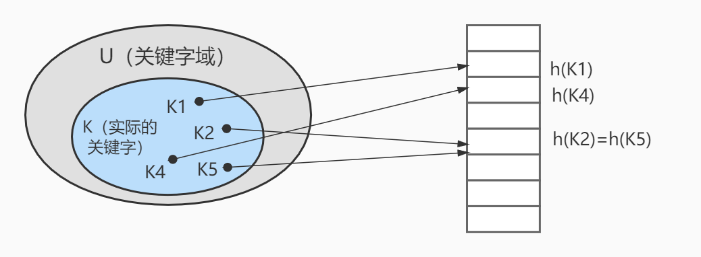
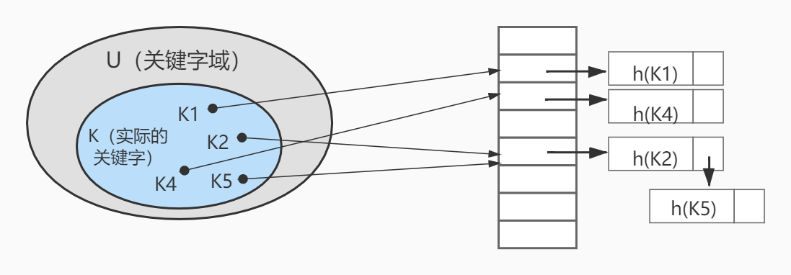
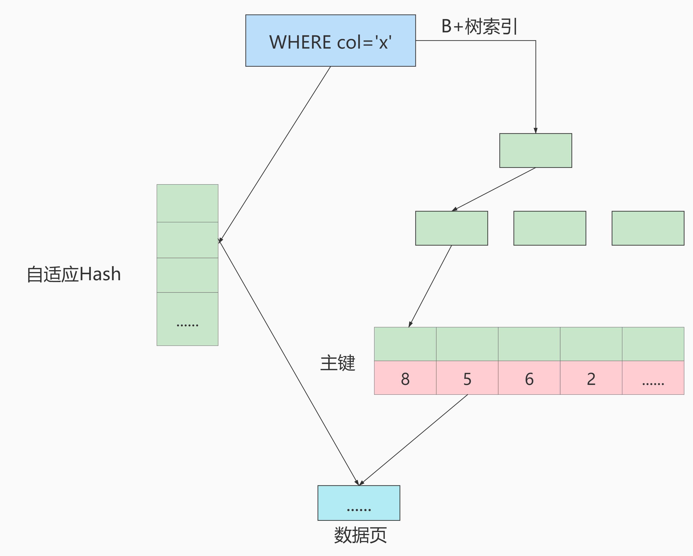
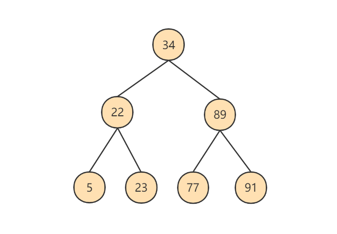
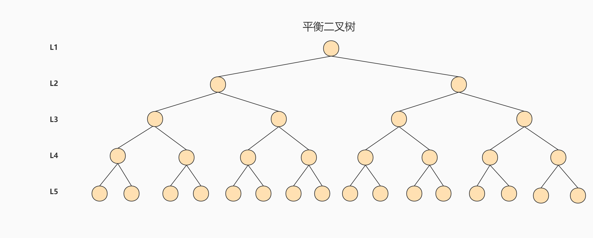
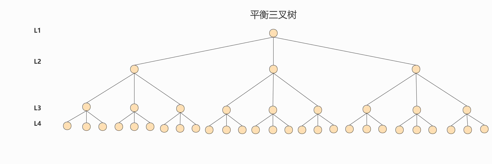
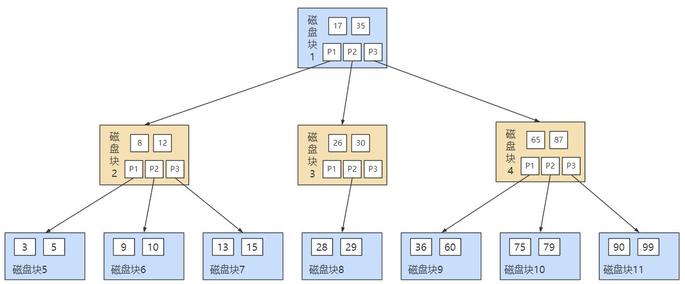
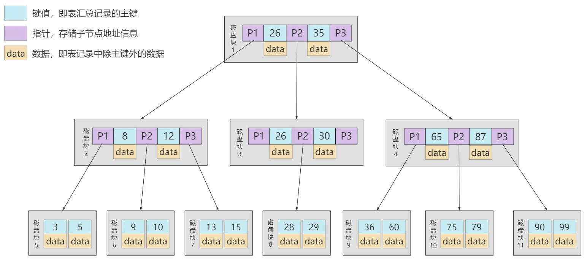

## SELECT的执行过程

### 查询的结构

```sql
#方式1(SQL92语法)：
SELECT ...,....,...
FROM ...,...,....
WHERE 多表的连接条件
AND 不包含组函数的过滤条件
GROUP BY ...,...
HAVING 包含组函数的过滤条件
ORDER BY ... ASC/DESC
LIMIT ...,...

#方式2(SQL99语法)：
SELECT ...,....,...
FROM ... (LEFT/RIGHT) JOIN ... 
ON 多表的连接条件
(LEFT/RIGHT) JOIN ...
ON ...
WHERE 不包含组函数的过滤条件
AND/OR 不包含组函数的过滤条件
GROUP BY ...,...
HAVING 包含组函数的过滤条件
ORDER BY ... ASC/DESC
LIMIT ...,...

#其中：
#（1）from：从哪些表中筛选
#（2）on：关联多表查询时，去除笛卡尔积
#（3）where：从表中筛选的条件
#（4）group by：分组依据
#（5）having：在统计结果中再次筛选
#（6）order by：排序
#（7）limit：分页
```

### SELECT执行顺序

你需要记住 SELECT 查询时的两个顺序：

**1. 关键字的顺序是不能颠倒的：**

```sql
SELECT ... FROM ... WHERE ... GROUP BY ... HAVING ... ORDER BY ... LIMIT...
```

**2.SELECT 语句的执行顺序**（在 MySQL 和 Oracle 中，SELECT 执行顺序基本相同）：

```sql
FROM -> WHERE -> GROUP BY -> HAVING -> SELECT 的字段 -> DISTINCT -> ORDER BY -> LIMIT
```



比如你写了一个 SQL 语句，那么它的关键字顺序和执行顺序是下面这样的：

```sql
SELECT DISTINCT player_id, player_name, count(*) as num -- 顺序 5
FROM player JOIN team ON player.team_id = team.team_id -- 顺序 1
WHERE height > 1.80 -- 顺序 2
GROUP BY player.team_id -- 顺序 3
HAVING num > 2 -- 顺序 4
ORDER BY num DESC -- 顺序 6
LIMIT 2 -- 顺序 7
```

在 SELECT 语句执行这些步骤的时候，每个步骤都会产生一个`虚拟表`，然后将这个虚拟表传入下一个步骤中作为输入。需要注意的是，这些步骤隐含在 SQL 的执行过程中，对于我们来说是不可见的。

### SQL 的执行原理

SELECT 是先执行 FROM 这一步的。在这个阶段，如果是多张表联查，还会经历下面的几个步骤：

1. 首先先通过 CROSS JOIN 求笛卡尔积，相当于得到虚拟表 vt（virtual table）1-1；
2. 通过 ON 进行筛选，在虚拟表 vt1-1 的基础上进行筛选，得到虚拟表 vt1-2；
3. 添加外部行。如果我们使用的是左连接、右链接或者全连接，就会涉及到外部行，也就是在虚拟表 vt1-2 的基础上增加外部行，得到虚拟表 vt1-3。

当然如果我们操作的是两张以上的表，还会重复上面的步骤，直到所有表都被处理完为止。这个过程得到是我们的原始数据。

当我们拿到了查询数据表的原始数据，也就是最终的虚拟表 `vt1`，就可以在此基础上再进行 `WHERE 阶段`。在这个阶段中，会根据 vt1 表的结果进行筛选过滤，得到虚拟表 `vt2`。

然后进入第三步和第四步，也就是 `GROUP 和 HAVING 阶段`。在这个阶段中，实际上是在虚拟表 vt2 的基础上进行分组和分组过滤，得到中间的虚拟表 `vt3` 和 `vt4`。

当我们完成了条件筛选部分之后，就可以筛选表中提取的字段，也就是进入到 `SELECT 和 DISTINCT 阶段`。

首先在 SELECT 阶段会提取想要的字段，然后在 DISTINCT 阶段过滤掉重复的行，分别得到中间的虚拟表 `vt5-1` 和 `vt5-2`。

当我们提取了想要的字段数据之后，就可以按照指定的字段进行排序，也就是 `ORDER BY 阶段`，得到虚拟表 `vt6`。

最后在 vt6 的基础上，取出指定行的记录，也就是 `LIMIT 阶段`，得到最终的结果，对应的是虚拟表 `vt7`。

当然我们在写 SELECT 语句的时候，不一定存在所有的关键字，相应的阶段就会省略。

同时因为 SQL 是一门类似英语的结构化查询语言，所以我们在写 SELECT 语句的时候，还要注意相应的关键字顺序，**所谓底层运行的原理，就是我们刚才讲到的执行顺序。**

## 字符集的相关操作

在MySQL 8.0版本之前，默认字符集为 latin1 ，utf8字符集指向的是 utf8mb3 。网站开发人员在数据库设计的时候往往会将编码修改为utf8字符集。如果遗忘修改默认的编码，就会出现乱码的问题。从MySQL 8.0开始，数据库的默认编码将改为 utf8mb4 ，从而避免上述乱码的问题。

```sql
# 查看默认使用的字符集
show variables like 'character%'; 
# 或者 
show variables like '%char%';
```

### 各级别的字符集

MySQL有4个级别的字符集和比较规则，分别是：

- 服务器级别
- 数据库级别
- 表级别
- 列级别

各变量名的解释

- `character_set_server`：服务器级别的字符集
- `character_set_database`：当前数据库的字符集
- `character_set_client`：服务器解码请求时使用的字符集
- `character_set_connection`：服务器处理请求时会把请求字符串从character_set_client转为character_set_connection
- `character_set_results`：服务器向客户端返回数据时使用的字符集

### 字符集与比较规则

#### 1. utf8 与 utf8mb4

`utf8` 字符集表示一个字符需要使用1～4个字节，但是我们常用的一些字符使用1～3个字节就可以表示了。而字符集表示一个字符所用的最大字节长度，在某些方面会影响系统的存储和性能，所以设计MySQL的设计者偷偷的定义了两个概念：

- `utf8mb3` ：阉割过的 `utf8` 字符集，只使用1～3个字节表示字符。
- `utf8mb4` ：正宗的 `utf8` 字符集，使用1～4个字节表示字符。

#### 2. 比较规则

上表中，MySQL版本一共支持41种字符集，其中的 `Default collation` 列表示这种字符集中一种默认的比较规则，里面包含着该比较规则主要作用于哪种语言，比如 `utf8_polish_ci` 表示以波兰语的规则比较， `utf8_spanish_ci` 是以西班牙语的规则比较， `utf8_general_ci` 是一种通用的比较规则。

后缀表示该比较规则是否区分语言中的重音、大小写。具体如下：

| **后缀** | **英文释义**       | **描述**         |
| :------- | :----------------- | :--------------- |
| _ai      | accent insensitive | 不区分重音       |
| _as      | accent sensitive   | 区分重音         |
| _ci      | case insensitive   | 不区分大小写     |
| _cs      | case sensitive     | 区分大小写       |
| _bin     | binary             | 以二进制方式比较 |

最后一列 `Maxlen` ，它代表该种字符集表示一个字符最多需要几个字节。

**常用操作**

```sql
#查看GBK字符集的比较规则 
SHOW COLLATION LIKE 'gbk%'; 
#查看UTF-8字符集的比较规则 
SHOW COLLATION LIKE 'utf8%';

#查看服务器的字符集和比较规则 
SHOW VARIABLES LIKE '%_server'; 
#查看数据库的字符集和比较规则 
SHOW VARIABLES LIKE '%_database'; 
#查看具体数据库的字符集 
SHOW CREATE DATABASE dbtest1; 
#修改具体数据库的字符集 
ALTER DATABASE dbtest1 DEFAULT CHARACTER SET 'utf8' COLLATE 'utf8_general_ci';

#查看表的字符集 
show create table employee; 
#查看表的比较规则 
show table status from atguigudb like 'employee'; 
#修改表的字符集和比较规则 
ALTER TABLE emp1 DEFAULT CHARACTER SET 'utf8' COLLATE 'utf8_general_ci';
```

### 请求到响应过程中字符集的变化

```sql
mysql> show variables like 'character%'; 
+--------------------------+--------------------------------+
| Variable_name            | Value                          |
+--------------------------+--------------------------------+
| character_set_client     | utf8mb4                        |//服务器解码请求时使用的字符集
| character_set_connection | utf8mb4                        |//服务器处理请求时会把请求字符串从character_set_client 转为 character_set_connection
| character_set_database   | utf8mb4                        |
| character_set_filesystem | binary                         |
| character_set_results    | utf8mb4                        |//服务器向客户端返回数据时使用的字符集
| character_set_server     | utf8mb4                        |
| character_set_system     | utf8mb3                        |
| character_sets_dir       | /usr/share/mysql-8.0/charsets/ |
+--------------------------+--------------------------------+
```


## sql_mode的合理设置

### 宽松模式 vs 严格模式

**宽松模式：**

如果设置的是宽松模式，那么我们在插入数据的时候，即便是给了一个错误的数据，也可能会被接受， 并且不报错。 

举例 ：我在创建一个表时，该表中有一个字段为name，给name设置的字段类型时 char(10) ，如果我在插入数据的时候，其中name这个字段对应的有一条数据的 长度超过了10 ，例如'1234567890abc'，超过了设定的字段长度10，那么不会报错，并且取前10个字符存上，也就是说你这个数据被存为了'1234567890'，而'abc'就没有了。但是，我们给的这条数据是错误的，因为超过了字段长度，但是并没有报错，并且mysql自行处理并接受了，这就是宽松模式的效果。 

应用场景 ：通过设置sql mode为宽松模式，来保证大多数sql符合标准的sql语法，这样应用在不同数据库之间进行迁移时，则不需要对业务sql进行较大的修改。 

**严格模式：**

出现上面宽松模式的错误，应该报错才对，所以MySQL5.7版本就将sql_mode默认值改为了严格模式。所以在 生产等环境 中，我们必须采用的是严格模式，进而 开发、测试环境 的数据库也必须要设置，这样在开发测试阶段就可以发现问题。并且我们即便是用的MySQL5.6，也应该自行将其改为严格模式。 

开发经验 ：MySQL等数据库总想把关于数据的所有操作都自己包揽下来，包括数据的校验，其实开发中，我们应该在自己 开发的项目程序级别将这些校验给做了 ，虽然写项目的时候麻烦了一些步骤，但是这样做之后，我们在进行数据库迁移或者在项目的迁移时，就会方便很多。 

改为严格模式后可能会存在的问题：

若设置模式中包含了 NO_ZERO_DATE ，那么MySQL数据库不允许插入零日期，插入零日期会抛出错误而不是警告。例如，表中含字段TIMESTAMP列（如果未声明为NULL或显示DEFAULT子句）将自动分配DEFAULT '0000-00-00 00:00:00'（零时间戳），这显然是不满足sql_mode中的NO_ZERO_DATE而报错。

### 模式查看和设置

```sql
# 查看当前sql_mode (3种方式)
select @@session.sql_mode;
select @@global.sql_mode;
show variables like 'sql_mode';

mysql> select @@session.sql_mode;
+----------------------------------------------------------------------------------------------------+
| @@session.sql_mode                                                                                 |
+----------------------------------------------------------------------------------------------------+
| STRICT_TRANS_TABLES,NO_ZERO_IN_DATE,NO_ZERO_DATE,ERROR_FOR_DIVISION_BY_ZERO,NO_ENGINE_SUBSTITUTION |
+----------------------------------------------------------------------------------------------------+

# 临时设置方式：设置当前窗口中设置sql_mode
SET GLOBAL sql_mode = 'modes...'; #全局 
SET SESSION sql_mode = 'modes...'; #当前会话
# 举例
#改为严格模式。此方法只在当前会话中生效，关闭当前会话就不生效了。 
set SESSION sql_mode='STRICT_TRANS_TABLES';
#改为严格模式。此方法在当前服务中生效，重启MySQL服务后失效。 
set GLOBAL sql_mode='STRICT_TRANS_TABLES';
```

### sql_mode常用值

| **常用值**                 | **说明**                                                     |
| :------------------------- | :----------------------------------------------------------- |
| STRICT_TRANS_TABLES        | 在该模式下，如果一个值不能插入到一个事务表中，则中断当前的操作，对非事务表不做限制 |
| NO_ZERO_IN_DATE            | 在严格模式下，不允许日期和月份为零                           |
| NO_ZERO_DATE               | 设置该值，mysql数据库不允许插入零日期，插入零日期会抛出错误而不是警告。 |
| ERROR_FOR_DIVISION_BY_ZERO | 在INSERT或UPDATE过程中，如果数据被零除，则产生错误而非警告。如 果未给出该模式，那么数据被零除时MySQL返回NULL |
| NO_ENGINE_SUBSTITUTION     | 如果需要的存储引擎被禁用或未编译，那么抛出错误。不设置此值时，用默认的存储引擎替代，并抛出一个异常 |
| NO_AUTO_VALUE_ON_ZERO      | 该值影响自增长列的插入。默认设置下，插入0或NULL代表生成下一个自增长值。如果用户 希望插入的值为0，而该列又是自增长的，那么这个选项就有用了。 |
| ONLY_FULL_GROUP_BY         | 对于GROUP BY聚合操作，如果在SELECT中的列，没有在GROUP BY中出现，那么这个SQL是不合法的，因为列不在GROUP BY从句中 |
| NO_AUTO_CREATE_USER        | 禁止GRANT创建密码为空的用户                                  |
| PIPES_AS_CONCAT            | 将 “&#124;&#124;” 视为字符串的连接操作符而非或运算符，这和Oracle数据库是一样的，也和字符串的拼接函数Concat相类似 |
| ANSI_QUOTES                | 启用ANSI_QUOTES后，不能用双引号来引用字符串，因为它被解释为识别符 |

## 数据库和文件系统的关系

### 默认数据库

#### mysql

MySQL 系统自带的核心数据库，它存储了MySQL的用户账户和权限信息，一些存储过程、事件的定义信息，一些运行过程中产生的日志信息，一些帮助信息以及时区信息等。

#### information_schema

MySQL 系统自带的数据库，这个数据库保存着MySQL服务器 维护的所有其他数据库的信息 ，比如有哪些表、哪些视图、哪些触发器、哪些列、哪些索引。这些信息并不是真实的用户数据，而是一些描述性信息，有时候也称之为**元数据**。在系统数据库information_schema 中提供了一些以innodb_sys 开头的表，用于表示内部系统表。

#### performance_schema

MySQL 系统自带的数据库，这个数据库里主要保存MySQL服务器运行过程中的一些状态信息，可以用来 监控 MySQL 服务的各类性能指标 。包括统计最近执行了哪些语句，在执行过程的每个阶段都花费了多长时间，内存的使用情况等信息。

#### sys

MySQL 系统自带的数据库，这个数据库主要是通过 视图 的形式把 information_schema 和performance_schema 结合起来，帮助系统管理员和开发人员监控 MySQL 的技术性能。

### 表在文件系统中的表示

#### InnoDB存储引擎模式

**1.表结构**

为了保存表结构， InnoDB 在数据目录下对应的数据库子目录下创建了一个专门用于描述表结构的文件，文件名是这样：

`表名.frm`

**2.表中数据和索引**

**系统表空间（system tablespace）**

默认情况下，InnoDB会在数据目录下创建一个名为 ibdata1 、大小为 12M 的文件，这个文件就是对应的 系统表空间 在文件系统上的表示。怎么才12M？注意这个文件是 自扩展文件 ，当不够用的时候它会自己增加文件大小。

当然，如果你想让系统表空间对应文件系统上多个实际文件，或者仅仅觉得原来的 ibdata1 这个文件名难听，那可以在MySQL启动时配置对应的文件路径以及它们的大小，比如我们这样修改一下my.cnf 配置文件：

```sql
[server]
innodb_data_file_path=data1:512M;data2:512M:autoextend
```

**独立表空间(file-per-table tablespace)**

在MySQL5.6.6以及之后的版本中，InnoDB并不会默认的把各个表的数据存储到系统表空间中，而是为 每一个表建立一个独立表空间 ，也就是说我们创建了多少个表，就有多少个独立表空间。使用 独立表空间 来存储表数据的话，会在该表所属数据库对应的子目录下创建一个表示该独立表空间的文件，文件名和表名相同，只不过添加了一个 .ibd 的扩展名而已，所以完整的文件名称长这样：

`表名.ibd`

比如：我们使用了 独立表空间 去存储 testdb 数据库下的 test 表的话，那么在该表所在数据库对应的 testdb 目录下会为 test 表创建这两个文件： 

`test.frm`  `test.ibd`

其中 test.ibd 文件就用来存储 test 表中的数据和索引。

**系统表空间与独立表空间的设置**

我们可以自己指定使用 系统表空间 还是 独立表空间 来存储数据，这个功能由启动参数 innodb_file_per_table 控制，比如说我们想刻意将表数据都存储到 系统表空间 时，可以在启动MySQL服务器的时候这样配置：

```sql
[server]
innodb_file_per_table=0 # 0：代表使用系统表空间； 1：代表使用独立表空间
```

默认情况:

```sql
mysql> show variables like 'innodb_file_per_table';
+-----------------------+-------+
| Variable_name         | Value |
+-----------------------+-------+
| innodb_file_per_table | ON    |
+-----------------------+-------+
```

**其他类型的表空间**

随着MySQL的发展，除了上述两种老牌表空间之外，现在还新提出了一些不同类型的表空间，比如通用表空间（general tablespace）、临时表空间（temporary tablespace）等。

####  MyISAM存储引擎模式

**表结构**

在存储表结构方面， MyISAM 和 InnoDB 一样，也是在 数据目录 下对应的数据库子目录下创建了一个专门用于描述表结构的文件：

`表名.frm`

**表中数据和索引**

在MyISAM中的索引全部都是 二级索引 ，该存储引擎的 数据和索引是分开存放 的。所以在文件系统中也是使用不同的文件来存储数据文件和索引文件，同时表数据都存放在对应的数据库子目录下。假如 test表使用MyISAM存储引擎的话，那么在它所在数据库对应的 testdb 目录下会为 test 表创建这三个文件：

```sql
test.frm 存储表结构 
test.MYD 存储数据 (MYData) 
test.MYI 存储索引 (MYIndex)
```

#### 小结

举例： 数据库a ， 表b 。 

1、如果表b采用 InnoDB ，data中会产生1个或者2个文件： 

- b.frm ：描述表结构文件，字段长度等 
- 如果采用 系统表空间 模式的，数据信息和索引信息都存储在 ibdata1 中 
- 如果采用 独立表空间 存储模式，data中还会产生 b.ibd 文件（存储数据信息和索引信息） 

此外： 

① MySQL5.7 中会在data的目录下生成 db.opt 文件用于保存数据库的相关配置。比如：字符集、比较规则。而MySQL8.0不再提供db.opt文件。 

② MySQL8.0中不再单独提供b.frm，而是合并在b.ibd文件中。 

2、如果表b采用 MyISAM ，data中会产生3个文件： 

- MySQL5.7 中： b.frm ：描述表结构文件，字段长度等。 
- MySQL8.0 中 b.xxx.sdi ：描述表结构文件，字段长度等 
- b.MYD (MYData)：数据信息文件，存储数据信息(如果采用独立表存储模式) 
- b.MYI (MYIndex)：存放索引信息文件

## 用户管理

### 登录MySQL服务器

启动MySQL服务后，可以通过mysql命令来登录MySQL服务器，命令如下：

`mysql –h hostname|hostIP –P port –u username –p DatabaseName –e "SQL语句"`

下面详细介绍命令中的参数： 

- -h参数 后面接主机名或者主机IP，hostname为主机，hostIP为主机IP。 
- -P参数 后面接MySQL服务的端口，通过该参数连接到指定的端口。MySQL服务的默认端口是3306， 不使用该参数时自动连接到3306端口，port为连接的端口号。 
- -u参数 后面接用户名，username为用户名。 
- -p参数 会提示输入密码。 
- DatabaseName参数 指明登录到哪一个数据库中。如果没有该参数，就会直接登录到MySQL数据库中，然后可以使用USE命令来选择数据库。 
- -e参数 后面可以直接加SQL语句。登录MySQL服务器以后即可执行这个SQL语句，然后退出MySQL服务器。

举例：

`mysql -uroot -p -hlocalhost -P3306 mysql -e "select host,user from user"`

### 用户的相关命令

CREATE USER语句的基本语法形式如下：

`CREATE USER 用户名 [IDENTIFIED BY '密码'][,用户名 [IDENTIFIED BY '密码']];`

- 用户名参数表示新建用户的账户，由 用户（User） 和 主机名（Host） 构成； 
- “[ ]”表示可选，也就是说，可以指定用户登录时需要密码验证，也可以不指定密码验证，这样用户可以直接登录。不过，不指定密码的方式不安全，不推荐使用。如果指定密码值，这里需要使用IDENTIFIED BY指定明文密码值。 
- CREATE USER语句可以同时创建多个用户。

**用户的增删改**

```sql
# 创建用户
CREATE USER zhang3 IDENTIFIED BY '123123'; # 默认host是 %
CREATE USER 'chen'@'localhost' IDENTIFIED BY '123456';

# 修改用户名
UPDATE mysql.user SET USER='li4' WHERE USER='wang5'; 
FLUSH PRIVILEGES;

# 删除用户
DROP USER li4 ; # 默认删除host为%的用户
DROP USER 'chen'@'localhost';
#删除用户(使用DELETE方式删除 不推荐 删除后系统会有残留信息保留)
DELETE FROM mysql.user WHERE Host=’hostname’ AND User='username';
FLUSH PRIVILEGES;

# 设置当前用户密码
#MySQL5.7写法
SET PASSWORD = PASSWORD('123456');
#使用ALTER USER命令来修改当前用户密码(MySQL8写法)
ALTER USER USER() IDENTIFIED BY 'new_password';
#使用SET语句来修改当前用户密码(使用root用户登录MySQL后，可以使用SET语句来修改密码)
SET PASSWORD='new_password';
#使用ALTER语句来修改普通用户的密码
ALTER USER user [IDENTIFIED BY '新密码'] [,user[IDENTIFIED BY '新密码']]…;
#使用SET命令来修改普通用户的密码(只有root账号有该权限)
SET PASSWORD FOR 'username'@'hostname'='new_password';
#使用UPDATE语句修改普通用户的密码(不推荐)
UPDATE MySQL.user SET authentication_string=PASSWORD("123456") WHERE User = "username" AND Host = "hostname";
```

## 权限管理

### 权限列表

`show privileges;`

1. CREATE和DROP权限 ，可以创建新的数据库和表，或删除（移掉）已有的数据库和表。如果将MySQL数据库中的DROP权限授予某用户，用户就可以删除MySQL访问权限保存的数据库。
2. SELECT、INSERT、UPDATE和DELETE权限 允许在一个数据库现有的表上实施操作。
3. SELECT权限 只有在它们真正从一个表中检索行时才被用到。 
4. INDEX权限 允许创建或删除索引，INDEX适用于已有的表。如果具有某个表的CREATE权限，就可以在CREATE TABLE语句中包括索引定义。 
5. ALTER权限 可以使用ALTER TABLE来更改表的结构和重新命名表。 
6. CREATE ROUTINE权限 用来创建保存的程序（函数和程序），ALTER ROUTINE权限用来更改和删除保存的程序， EXECUTE权限 用来执行保存的程序。 
7. GRANT权限 允许授权给其他用户，可用于数据库、表和保存的程序。 
8. FILE权限 使用户可以使用LOAD DATA INFILE和SELECT ... INTO OUTFILE语句读或写服务器上的文件，任何被授予FILE权限的用户都能读或写MySQL服务器上的任何文件（说明用户可以读任何数据库目录下的文件，因为服务器可以访问这些文件）。

### 权限相关命令

```sql
-- 授予权限(如果该权限没有该用户,则会直接新建一个用户)
GRANT 权限1,权限2,…权限n ON 数据库名称.表名称 TO 用户名@用户地址 [IDENTIFIED BY '密码口令'];
-- 给li4用户用本地命令行方式，授予 testdb 这个库下的所有表的插删改查的权限。
GRANT SELECT,INSERT,DELETE,UPDATE ON `testdb`.* TO 'li4'@'localhost';
-- 授予通过网络方式登录的joe用户,对所有库所有表的全部权限,密码设为123.注意这里唯独不包括grant的权限
GRANT ALL PRIVILEGES ON *.* TO joe@'%' IDENTIFIED BY '123';

# 查看权限
SHOW GRANTS;
SHOW GRANTS FOR CURRENT_USER;
SHOW GRANTS FOR CURRENT_USER();
#查看某用户的全局权限
SHOW GRANTS FOR 'user'@'主机地址';

# 收回权限(需用户重新登陆后才能生效)
REVOKE 权限1,权限2,…权限n ON 数据库名称.表名称 FROM 用户名@用户地址;
#收回全库全表的所有权限
REVOKE ALL PRIVILEGES ON *.* FROM joe@'%';
#收回mysql库下的所有表的插删改查权限
REVOKE SELECT,INSERT,UPDATE,DELETE ON mysql.* FROM joe@localhost;
```

### 权限表

#### **1. user表**

user表是MySQL中最重要的一个权限表， 记录用户账号和权限信息。

```sql
mysql> DESCRIBE user;
+--------------------------+-----------------------------------+------+-----+-----------------------+-------+
| Field                    | Type                              | Null | Key | Default               | Extra |
+--------------------------+-----------------------------------+------+-----+-----------------------+-------+
| Host                     | char(255)                         | NO   | PRI |                       |       |
| User                     | char(32)                          | NO   | PRI |                       |       |
| Select_priv              | enum('N','Y')                     | NO   |     | N                     |       |
| Insert_priv              | enum('N','Y')                     | NO   |     | N                     |       |
| Update_priv              | enum('N','Y')                     | NO   |     | N                     |       |
| Delete_priv              | enum('N','Y')                     | NO   |     | N                     |       |
| Create_priv              | enum('N','Y')                     | NO   |     | N                     |       |
| Drop_priv                | enum('N','Y')                     | NO   |     | N                     |       |
| Reload_priv              | enum('N','Y')                     | NO   |     | N                     |       |
| Shutdown_priv            | enum('N','Y')                     | NO   |     | N                     |       |
| Process_priv             | enum('N','Y')                     | NO   |     | N                     |       |
| File_priv                | enum('N','Y')                     | NO   |     | N                     |       |
| Grant_priv               | enum('N','Y')                     | NO   |     | N                     |       |
| References_priv          | enum('N','Y')                     | NO   |     | N                     |       |
| Index_priv               | enum('N','Y')                     | NO   |     | N                     |       |
| Alter_priv               | enum('N','Y')                     | NO   |     | N                     |       |
| Show_db_priv             | enum('N','Y')                     | NO   |     | N                     |       |
| Super_priv               | enum('N','Y')                     | NO   |     | N                     |       |
| Create_tmp_table_priv    | enum('N','Y')                     | NO   |     | N                     |       |
| Lock_tables_priv         | enum('N','Y')                     | NO   |     | N                     |       |
| Execute_priv             | enum('N','Y')                     | NO   |     | N                     |       |
| Repl_slave_priv          | enum('N','Y')                     | NO   |     | N                     |       |
| Repl_client_priv         | enum('N','Y')                     | NO   |     | N                     |       |
| Create_view_priv         | enum('N','Y')                     | NO   |     | N                     |       |
| Show_view_priv           | enum('N','Y')                     | NO   |     | N                     |       |
| Create_routine_priv      | enum('N','Y')                     | NO   |     | N                     |       |
| Alter_routine_priv       | enum('N','Y')                     | NO   |     | N                     |       |
| Create_user_priv         | enum('N','Y')                     | NO   |     | N                     |       |
| Event_priv               | enum('N','Y')                     | NO   |     | N                     |       |
| Trigger_priv             | enum('N','Y')                     | NO   |     | N                     |       |
| Create_tablespace_priv   | enum('N','Y')                     | NO   |     | N                     |       |
| ssl_type                 | enum('','ANY','X509','SPECIFIED') | NO   |     |                       |       |
| ssl_cipher               | blob                              | NO   |     | NULL                  |       |
| x509_issuer              | blob                              | NO   |     | NULL                  |       |
| x509_subject             | blob                              | NO   |     | NULL                  |       |
| max_questions            | int unsigned                      | NO   |     | 0                     |       |
| max_updates              | int unsigned                      | NO   |     | 0                     |       |
| max_connections          | int unsigned                      | NO   |     | 0                     |       |
| max_user_connections     | int unsigned                      | NO   |     | 0                     |       |
| plugin                   | char(64)                          | NO   |     | caching_sha2_password |       |
| authentication_string    | text                              | YES  |     | NULL                  |       |
| password_expired         | enum('N','Y')                     | NO   |     | N                     |       |
| password_last_changed    | timestamp                         | YES  |     | NULL                  |       |
| password_lifetime        | smallint unsigned                 | YES  |     | NULL                  |       |
| account_locked           | enum('N','Y')                     | NO   |     | N                     |       |
| Create_role_priv         | enum('N','Y')                     | NO   |     | N                     |       |
| Drop_role_priv           | enum('N','Y')                     | NO   |     | N                     |       |
| Password_reuse_history   | smallint unsigned                 | YES  |     | NULL                  |       |
| Password_reuse_time      | smallint unsigned                 | YES  |     | NULL                  |       |
| Password_require_current | enum('N','Y')                     | YES  |     | NULL                  |       |
| User_attributes          | json                              | YES  |     | NULL                  |       |
+--------------------------+-----------------------------------+------+-----+-----------------------+-------+
51 rows in set (0.01 sec)
```

这些字段可以分成4类，分别是范围列（或用户列）、权限列、安全列和资源控制列。

**1.范围列（或用户列）**

- host：表示连接类型 
  - % 表示所有远程通过 TCP方式的连接
  - IP 地址 如 (192.168.1.2、127.0.0.1) 通过制定ip地址进行的TCP方式的连接
  - 机器名 通过制定网络中的机器名进行的TCP方式的连接
  - ::1 IPv6的本地ip地址，等同于IPv4的 127.0.0.1
  - localhost 本地方式通过命令行方式的连接 ，比如mysql -u xxx -p xxx 方式的连接。
- user： 表示用户名，同一用户通过不同方式链接的权限是不一样的。 
- password： 密码 
  - 所有密码串通过 password(明文字符串) 生成的密文字符串。MySQL 8.0 在用户管理方面增加了角色管理，默认的密码加密方式也做了调整，由之前的 SHA1 改为了 SHA2 ，不可逆 。同时加上 MySQL 5.7 的禁用用户和用户过期的功能，MySQL 在用户管理方面的功能和安全性都较之前版本大大的增强了。 
  - mysql 5.7 及之后版本的密码保存到 authentication_string 字段中不再使用password 字段。 

**2. 权限列**

- Grant_priv字段 
  - 表示是否拥有GRANT权限 
- Shutdown_priv字段 
  - 表示是否拥有停止MySQL服务的权限 
- Super_priv字段 
  - 表示是否拥有超级权限 
- Execute_priv字段 
  - 表示是否拥有EXECUTE权限。拥有EXECUTE权限，可以执行存储过程和函数。 
- Select_priv , Insert_priv等 
  - 为该用户所拥有的权限。 

**3. 安全列** 安全列只有6个字段，其中两个是ssl相关的（ssl_type、ssl_cipher），用于 加密 ；两个是x509相关的（x509_issuer、x509_subject），用于 标识用户 ；另外两个Plugin字段用于 验证用户身份 的插件，该字段不能为空。如果该字段为空，服务器就使用内建授权验证机制验证用户身份。 

**4. 资源控制列** 资源控制列的字段用来 限制用户使用的资源 ，包含4个字段，分别为：

- ①max_questions，用户每小时允许执行的查询操作次数； 
- ②max_updates，用户每小时允许执行的更新操作次数； 
- ③max_connections，用户每小时允许执行的连接操作次数； 
- ④max_user_connections，用户允许同时建立的连接次数。

#### 2. db表

使用DESCRIBE查看db表的基本结构： 

`DESCRIBE mysql.db; `

**1. 用户列** db表用户列有3个字段，分别是Host、User、Db。这3个字段分别表示主机名、用户名和数据库名。表示从某个主机连接某个用户对某个数据库的操作权限，这3个字段的组合构成了db表的主键。 

**2. 权限列**

Create_routine_priv和Alter_routine_priv这两个字段决定用户是否具有创建和修改存储过程的权限。

#### **3. tables_priv表和columns_priv表**

tables_priv表用来 对表设置操作权限 ，columns_priv表用来对表的 某一列设置权限 。

- tables_priv表有8个字段，分别是Host、Db、User、Table_name、Grantor、Timestamp、Table_priv和Column_priv，各个字段说明如下： 
- Host 、 Db 、 User 和 Table_name 四个字段分别表示主机名、数据库名、用户名和表名。 
- Grantor表示修改该记录的用户。 
- Timestamp表示修改该记录的时间。 
- Table_priv 表示对象的操作权限。包括Select、Insert、Update、Delete、Create、Drop、Grant、References、Index和Alter。 
- Column_priv字段表示对表中的列的操作权限，包括Select、Insert、Update和References。 

#### **4. procs_priv表**

procs_priv表可以对 存储过程和存储函数设置操作权限 ，表结构如图：


## 角色管理

### 角色的理解

引入角色的目的是 方便管理拥有相同权限的用户 。**恰当的权限设定，可以确保数据的安全性，这是至关重要的**。


### 角色

```sql
# 创建角色
CREATE ROLE 'role_name'[@'host_name'] [,'role_name'[@'host_name']]...
#实际演示
CREATE ROLE 'manager'@'localhost';
create role 'boss';

# 给角色赋予权限
GRANT privileges ON table_name TO 'role_name'[@'host_name'];
#实际演示
grant select,update on chen.* to 'manager';

# 查看角色的权限
mysql> show grants for manager;
+---------------------------------------------------+
| Grants for manager@%                              |
+---------------------------------------------------+
| GRANT USAGE ON *.* TO `manager`@`%`               |
| GRANT SELECT, UPDATE ON `chen`.* TO `manager`@`%` |
+---------------------------------------------------+

# 回收角色的权限
REVOKE privileges ON tablename FROM 'rolename';
#1.撤销school_write角色的权限。
revoke update on chen.* from 'manager';

# 删除角色
DROP ROLE role [,role2]...
#实际演示
drop role 'boss';

# 给用户赋予角色(需要激活才能发挥作用)
GRANT role [,role2,...] TO user [,user2,...];
#实际演示
grant manager to 'manaphy';
#查看是否添加成功
mysql> show grants for 'manaphy';
+--------------------------------------+
| Grants for manaphy@%                 |
+--------------------------------------+
| GRANT USAGE ON *.* TO `manaphy`@`%`  |
| GRANT `manager`@`%` TO `manaphy`@`%` |
+--------------------------------------+

# 激活角色
#方式1 使用set default role 命令激活角色
set default role all to 'manaphy';
# 方式2 将activate_all_roles_on_login设置为ON
SET GLOBAL activate_all_roles_on_login=ON;

# 撤销用户的角色
REVOKE role FROM user;
#实际演示
revoke 'manager' from 'manaphy';

# 设置强制角色(mandatory role)
#方式1: 服务启动前设置(在配置文件中添加)
[mysqld] mandatory_roles='role1,role2@localhost'
#方式2: 运行时设置
SET PERSIST mandatory_roles = 'role1,role2@localhost'; #系统重启后仍然 有效
SET GLOBAL mandatory_roles = 'role1,role2@localhost'; #系统重启后失效
```

## 配置文件的使用

### 启动命令与选项组

配置文件中不同的选项组是给不同的启动命令使用的。不过有两个选项组比较特别

- `[mysql]` 组下边的启动选项将作用于`所有的服务器`程序。
- `[client]` 组下边的启动选项将作用于`所有的客户端`程序。

| **启动命令**   | **类别**   | **能读取的组**                     |
| :------------- | :--------- | :--------------------------------- |
| `mysqld`       | 启动服务器 | [mysqld]、[server]                 |
| `mysql_safe`   | 启动服务器 | [mysqld]、[server]、[mysql_safe]   |
| `mysql.server` | 启动服务器 | [mysqld]、[server]、[mysql.server] |
| `mysql`        | 启动客户端 | [mysql]、[client]                  |
| `mysqladmin`   | 启动客户端 | [mysqladmin]、[client]             |
| `mysqldump`    | 启动客户端 | [mysqldump]、[client]              |

**同一个配置文件中多个组的优先级以最后一个出现的组中的启动选项为准**

## MySQL数据结构选择的合理性

### 全表遍历

### Hash结构





上图中哈希函数h有可能将两个不同的关键字映射到相同的位置，这叫做`碰撞`，在数据库中一般采用`链接法`来解决。在链接法中，将散列到同一槽位的元素放在一个链表中，如下图所示：



**Hash结构效率高，那为什么索引结构要设计成树型呢？**

Hash索引适用存储引擎有**Memory**，而MyISAM和InnoDB不支持

**Hash索引的适用性：**



采用自适应Hash索引目的是方便根据SQL的查询条件加速定位到叶子节点，特别是当B+树比较深的时候，通过自适应Hash索引可以明显提高数据的检索效率。

我们可以通过`innodb_adaptive_hash_index`变量来查看是否开启了自适应Hash，比如：

`show variables like '%adaptive_hash_index';`

### 二叉搜索树

如果我们利用二叉树作为索引结构，那么磁盘的IO次数和索引树的高度是相关的。

**1.二叉搜索树的特点**

**2.查找规则**



创造出来的二分搜索树如下图所示：


为了提高查询效率，就需要`减少磁盘IO数`。为了减少磁盘IO的次数，就需要尽量`降低树的高度`，需要把原来“瘦高”的树结构变的“矮胖”，树的每层的分叉越多越好。

### AVL树



针对同样的数据，如果我们把二叉树改成`M叉树`（M>2）呢？当M=3时，同样的31个节点可以由下面的三叉树来进行存储：



### 6.5 B-Tree

B树的结构如下图所示：



一个M阶的B树（M>2）有以下的特性：

1. 根节点的儿子数的范围是[2,M]。
2. 每个中间节点包含k-1个关键字和k个孩子，孩子的数量=关键字的数量+1，k的取值范围为[ceil(M/2),M]。
3. 叶子节点包括k-1个关键字（叶子节点没有孩子），k的取值范围为[ceil(M/2),M]。
4. 假设中间节点节点的关键字为：Key[1],Key[2],…,Key[k-1]，且关键字按照升序排序，即Key[i]<Key[i+1]。此时k-1个关键字相当于划分了k个范围，也就是对应着k个指针，即为：P[1],P[2],…,P[k]，其中P[1]指向关键字小于Key[1]的子树，P[i]指向关键字属于(Key[i-1],Key[i])的子树，P[k]指向关键字大于Key[k-1]的子树。5.所有叶子节点位于同一层。

上面那张图所表示的B树就是一棵3阶的B树。我们可以看下磁盘块2，里面的关键字为（8，12），它有3个孩子(3，5)，(9，10)和(13，15)，你能看到(3，5)小于8，(9，10)在8和12之间，而(13，15)大于12，刚好符合刚才我们给出的特征。

然后我们来看下如何用B树进行查找。假设我们想要`查找的关键字是9`，那么步骤可以分为以下几步：

1. 我们与根节点的关键字(17，35）进行比较，9小于17那么得到指针P1；
2. 按照指针P1找到磁盘块2，关键字为（8，12），因为9在8和12之间，所以我们得到指针P2；
3. 按照指针P2找到磁盘块6，关键字为（9，10），然后我们找到了关键字9。

你能看出来在B树的搜索过程中，我们比较的次数并不少，但如果把数据读取出来然后在内存中进行比较，这个时间就是可以忽略不计的。而读取磁盘块本身需要进行I/O操作，消耗的时间比在内存中进行比较所需要的时间要多，是数据查找用时的重要因素。`B树相比于平衡二叉树来说磁盘I/O操作要少`，在数据查询中比平衡二叉树效率要高。所以`只要树的高度足够低，IO次数足够少，就可以提高查询性能`。

**再举例1：**



### B+Tree

**B+树和B树的差异：**

1. 有k个孩子的节点就有k个关键字。也就是孩子数量=关键字数，而B树中，孩子数量=关键字数+1。
2. 非叶子节点的关键字也会同时存在在子节点中，并且是在子节点中所有关键字的最大（或最小）。
3. 非叶子节点仅用于索引，不保存数据记录，跟记录有关的信息都放在叶子节点中。而B树中，`非叶子节点既保存索引，也保存数据记录`。
4. 所有关键字都在叶子节点出现，叶子节点构成一个有序链表，而且叶子节点本身按照关键字的大小从小到大顺序链接。

> B树和B+树都可以作为索引的数据结构，在MySQL中采用的是B+树。
> 但B树和B+树各有自己的应用场景，不能说B+树完全比B树好，反之亦然。

思考题：为了减少IO，索引树会一次性加载吗？

思考题：B+树的存储能力如何？为何说一般查找行记录，最多只需1~3次磁盘IO

思考题：为什么说B+树比B-树更适合实际应用中操作系统的文件索引和数据库索引？

思考题：Hash索引与B+树索引的区别

思考题：Hash索引与B+树索引是在建索引的时候手动指定的吗？

### R树

R-Tree在MySQL很少使用，仅支持`geometry数据类型`，支持该类型的存储引擎只有myisam、bdb、innodb、ndb、archive几种。举个R树在现实领域中能够解决的例子：查找20英里以内所有的餐厅。如果没有R树你会怎么解决？一般情况下我们会把餐厅的坐标(x,y)分为两个字段存放在数据库中，一个字段记录经度，另一个字段记录纬度。这样的话我们就需要遍历所有的餐厅获取其位置信息，然后计算是否满足要求。如果一个地区有100家餐厅的话，我们就要进行100次位置计算操作了，如果应用到谷歌、百度地图这种超大数据库中，这种方法便必定不可行了。R树就很好的`解决了这种高维空间搜索问题`。它把B树的思想很好的扩展到了多维空间，采用了B树分割空间的思想，并在添加、删除操作时采用合并、分解结点的方法，保证树的平衡性。因此，R树就是一棵用来`存储高维数据的平衡树`。相对于B-Tree，R-Tree的优势在于范围查找。

| 索引/存储引擎 | MyISAM | InnoDB | Memory |
| :------------ | :----- | :----- | :----- |
| R-Tree索引    | 支持   | 支持   | 不支持 |

