# 索引

## 1. 索引的声明与使用

### 1.1 索引的分类
MySQL的索引包括`普通索引`、`唯一性索引`、`主键索引`、`全文索引`、`单列索引`、`多列索引`和`空间索引`等。

- 从 功能逻辑 上说，索引主要有 4 种，分别是`普通索引`、`唯一索引`、`主键索引`、`全文索引`。 
- 按照 物理实现方式 ，索引可以分为 2 种：`聚簇索引`和`非聚簇索引`。 
- 按照 作用字段个数 进行划分，分成`单列索引`和`联合索引`。

**不同的存储引擎支持的索引类型也不一样**

**InnoDB：** 支持 B-tree、Full-text 等索引，不支持 Hash 索引； 

**MyISAM：** 支持 B-tree、Full-text 等索引，不支持 Hash 索引； 

**Memory：** 支持 B-tree、Hash 等索引，不支持 Full-text 索引； 

**NDB：** 支持 Hash 索引，不支持 B-tree、Full-text 等索引； 

**Archive：** 不支持 B-tree、Hash、Full-text 等索引；

### **1.2 创建索引**
#### 1. 创建表的时候创建索引
```sql
CREATE TABLE dept(
dept_id INT PRIMARY KEY AUTO_INCREMENT,
dept_name VARCHAR(20)
);

CREATE TABLE emp(
emp_id INT PRIMARY KEY AUTO_INCREMENT,
emp_name VARCHAR(20) UNIQUE,
dept_id INT,
CONSTRAINT emp_dept_id_fk FOREIGN KEY(dept_id) REFERENCES dept(dept_id)
);
```
但是，如果显式创建表时创建索引的话，基本语法格式如下：
```sql
CREATE TABLE table_name [col_name data_type]
[UNIQUE | FULLTEXT | SPATIAL] [INDEX | KEY] [index_name] (col_name [length]) [ASC | DESC]
```

- `UNIQUE`、`FULLTEXT`和`SPATIAL`为可选参数，分别表示唯一索引、全文索引和空间索引；
- `INDEX`与`KEY `为同义词，两者的作用相同，用来指定创建索引；
- `index_name`指定索引的名称，为可选参数，如果不指定，那么MySQL默认col_name为索引名；
- `col_name`为需要创建索引的字段列，该列必须从数据表中定义的多个列中选择；
- `length`为可选参数，表示索引的长度，只有字符串类型的字段才能指定索引长度；
- `ASC` 或`DESC`指定升序或者降序的索引值存储。

**相关语法**

```sql
-- 1.普通索引
CREATE TABLE book(
  book_id INT ,
  book_name VARCHAR(100),
  authors VARCHAR(100),
  info VARCHAR(100) ,
  comment VARCHAR(100),
  year_publication YEAR,
  INDEX(year_publication)
);

-- 2. 唯一索引
CREATE TABLE test1(
  id INT NOT NULL,
  name varchar(30) NOT NULL,
  UNIQUE INDEX uk_idx_id(id)
);

-- 3. 主键索引
/*
设定为主键后数据库会自动建立索引，innodb为聚簇索引
注意：修改主键索引：必须先删除掉(drop)原索引，再新建(add)索引
*/

-- 4.单列索引
CREATE TABLE test2(
  id INT NOT NULL,
  name CHAR(50) NULL,
  INDEX single_idx_name(name(20))
);

-- 5.组合索引
CREATE TABLE test3(
  id INT(11) NOT NULL,
  name CHAR(30) NOT NULL,
  age INT(11) NOT NULL,
  info VARCHAR(255),
  INDEX multi_idx(id,name,age)
);

-- 6.全文索引
CREATE TABLE test4(
  id INT NOT NULL,
  name CHAR(30) NOT NULL,
  age INT NOT NULL,
  info VARCHAR(255),
  FULLTEXT INDEX futxt_idx_info(info)
) ENGINE=MyISAM;
#在MySQL5.7及之后版本中可以不指定最后的ENGINE了，因为在此版本中InnoDB支持全文索引。
CREATE TABLE articles (
  id INT UNSIGNED AUTO_INCREMENT PRIMARY KEY,
  title VARCHAR (200),
  body TEXT,
  FULLTEXT index (title, body)
) ENGINE = INNODB ;

CREATE TABLE `papers` (
  `id` int(10) unsigned NOT NULL AUTO_INCREMENT,
  `title` varchar(200) DEFAULT NULL,
  `content` text,
  PRIMARY KEY (`id`),
  FULLTEXT KEY `title` (`title`,`content`)
) ENGINE=MyISAM DEFAULT CHARSET=utf8;

#不同于like方式的的查询：
SELECT * FROM papers WHERE content LIKE '%查询字符串%';
#全文索引用match+against方式查询：
SELECT * FROM papers WHERE MATCH(title,content) AGAINST ('查询字符串');
/*
注意点
使用全文索引前，搞清楚版本支持情况；
全文索引比 like + % 快 N 倍，但是可能存在精度问题；
如果需要全文索引的是大量数据，建议先添加数据，再创建索引。
*/

-- 空间索引(要求空间类型的字段必须为非空)
CREATE TABLE test5(
  geo GEOMETRY NOT NULL,
  SPATIAL INDEX spa_idx_geo(geo)
) ENGINE=MyISAM;
```
#### 2. 在已经存在的表上创建索引 
在已经存在的表中创建索引可以使用ALTER TABLE语句或者CREATE INDEX语句。
```sql
ALTER TABLE table_name ADD [UNIQUE | FULLTEXT | SPATIAL] [INDEX | KEY]
[index_name] (col_name[length],...) [ASC | DESC]

CREATE [UNIQUE | FULLTEXT | SPATIAL] INDEX index_name
ON table_name (col_name[length],...) [ASC | DESC]
```
### 1.3 删除索引
```sql
--  使用ALTER TABLE删除索引
ALTER TABLE table_name DROP INDEX index_name;
-- 使用DROP INDEX语句删除索引
DROP INDEX index_name ON table_name;
```
> 提示
> 删除表中的列时，如果要删除的列为索引的组成部分，则该列也会从索引中删除。如果组成索引的所有列都被删除，则整个索引将被删除。

## 2. MySQL8.0索引新特性
### 2.1 支持降序索引
举例：分别在MySQL 5.7版本和MySQL 8.0版本中创建数据表ts1

`CREATE TABLE ts1(a int,b int,index idx_a_b(a,b desc));`

在MySQL 5.7版本中查看数据表ts1的结构，结果如下：

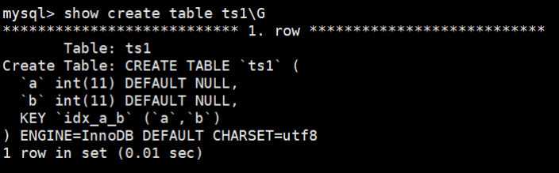

从结果可以看出，索引仍然是默认的升序。

在MySQL 8.0版本中查看数据表ts1的结构，结果如下：

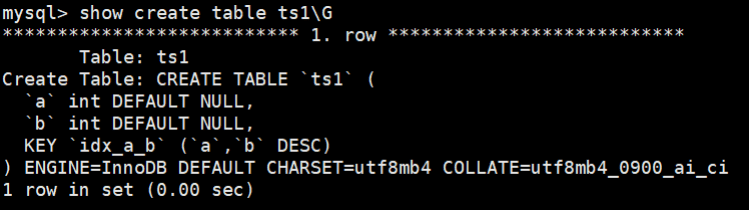

从结果可以看出，索引已经是降序了。下面继续测试降序索引在执行计划中的表现。

分别在MySQL 5.7版本和MySQL 8.0版本的数据表ts1中插入800条随机数据，执行语句如下：
```sql
DELIMITER //
CREATE PROCEDURE ts_insert()
BEGIN
    DECLARE i INT DEFAULT 1;
    WHILE i < 800
    DO
        insert into ts1 select rand()*80000,rand()*80000;
        SET i = i + 1;
    END WHILE;
    commit;
END //
DELIMITER ;

-- 调用
CALL ts_insert();
```
分别在 5.7 和 8.0 版本中查看数据表ts1的执行计划

`EXPLAIN SELECT * FROM ts1 ORDER BY a,b DESC LIMIT 5;`

MySQL 5.7的执行计划中扫描数为799，而且使用了Using filesort。

::: tip

Using filesort是MySQL中一种速度比较慢的外部排序，能避免是最好的。多数情况下，管理员可以通过优化索引来尽量避免出现Using filesort，从而提高数据库执行速度。

:::

MySQL 8.0中的执行计划中扫描数为5，而且没有使用Using filesort。

::: warning

降序索引只对查询中特定的排序顺序有效，如果使用不当，反而查询效率更低。例如，上述查询排序条件改为order by a desc, b desc，MySQL 5.7的执行计划要明显好于MySQL 8.0。

:::

### 2.2 隐藏索引
在MySQL 5.7版本及之前，只能通过显式的方式删除索引。此时，如果发现删除索引后出现错误，又只能通过显式创建索引的方式将删除的索引创建回来。如果数据表中的数据量非常大，或者数据表本身比较大，这种操作就会消耗系统过多的资源，操作成本非常高。

从MySQL 8.x开始支持`隐藏索引（invisible indexes）`，只需要将待删除的索引设置为隐藏索引，使查询优化器不再使用这个索引（即使使用force index（强制使用索引），优化器也不会使用该索引），确认将索引设置为隐藏索引后系统不受任何响应，就可以彻底删除索引。`这种通过先将索引设置为隐藏索引，再删除索引的方式就是软删除。`

**相关语法**
```sql
-- 1.创建表时直接创建
CREATE TABLE tablename(
    propname1 type1[CONSTRAINT1],
    propname2 type2[CONSTRAINT2],
    ……
    propnamen typen,
    INDEX [indexname](propname1 [(length)]) INVISIBLE
);

-- 2. 在已经存在的表上创建
CREATE INDEX indexname
ON tablename(propname[(length)]) INVISIBLE;

-- 3. 通过ALTER TABLE语句创建
ALTER TABLE tablename
ADD INDEX indexname (propname [(length)]) INVISIBLE;

-- 4. 切换索引可见状态
ALTER TABLE tablename ALTER INDEX index_name INVISIBLE; #切换成隐藏索引
ALTER TABLE tablename ALTER INDEX index_name VISIBLE; #切换成非隐藏索引
/* 
如果将index_cname索引切换成可见状态，通过explain查看执行计划，发现优化器选择了index_cname索引。
注意:
当索引被隐藏时，它的内容仍然是和正常索引一样实时更新的。
如果一个索引需要长期被隐藏，那么可以将其删除，因为索引的存在会影响插入、更新和删除的性能。

通过设置隐藏索引的可见性可以查看索引对调优的帮助。
*/
```
#### 使隐藏索引对查询优化器可见
在MySQL 8.x版本中，为索引提供了一种新的测试方式，可以通过查询优化器的一个开关（use_invisible_indexes）来打开某个设置，使隐藏索引对查询优化器可见。如果 use_invisible_indexes 设置为off(默认)，优化器会忽略隐藏索引。如果设置为on，即使隐藏索引不可见，优化器在生成执行计划时仍会考虑使用隐藏索引。

（1）在MySQL命令行执行如下命令查看查询优化器的开关设置。

`select @@optimizer_switch \G`

在输出的结果信息中找到如下属性配置。

`use_invisible_indexes=off`

此属性配置值为off，说明隐藏索引默认对查询优化器不可见。

（2）使隐藏索引对查询优化器可见，需要在MySQL命令行执行如下命令：

`set session optimizer_switch="use_invisible_indexes=on";`

SQL语句执行成功，再次查看查询优化器的开关设置。
```sql
mysql>  select @@optimizer_switch \G
*************************** 1. row ***************************
@@optimizer_switch: 
index_merge=on,index_merge_union=on,index_merge_sort_union=on,index_merge_
intersection=on,engine_condition_pushdown=on,index_condition_pushdown=on,mrr=on,mrr_co
st_based=on,block_nested_loop=on,batched_key_access=off,materialization=on,semijoin=on
,loosescan=on,firstmatch=on,duplicateweedout=on,subquery_materialization_cost_based=on
,use_index_extensions=on,condition_fanout_filter=on,derived_merge=on,use_invisible_ind
exes=on,skip_scan=on,hash_join=on
```
此时，在输出结果中可以看到如下属性配置。

`use_invisible_indexes=on`

use_invisible_indexes属性的值为on，说明此时隐藏索引对查询优化器可见。

（3）使用EXPLAIN查看以字段invisible_column作为查询条件时的索引使用情况。

`explain select * from classes where cname = '高一2班';`

查询优化器会使用隐藏索引来查询数据。

（4）如果需要使隐藏索引对查询优化器不可见，则只需要执行如下命令即可。

`set session optimizer_switch="use_invisible_indexes=off";`

再次查看查询优化器的开关设置

`select @@optimizer_switch \G`

此时，use_invisible_indexes属性的值已经被设置为“off”。
## 3. 索引的设计原则
### 3.1 数据准备
**第1步：创建数据库、创建表**
```sql
-- 第1步：创建数据库、创建表
CREATE TABLE `student_info` (
 `id` INT(11) NOT NULL AUTO_INCREMENT,
 `student_id` INT NOT NULL ,
 `name` VARCHAR(20) DEFAULT NULL,
 `course_id` INT NOT NULL ,
 `class_id` INT(11) DEFAULT NULL,
 `create_time` DATETIME DEFAULT CURRENT_TIMESTAMP ON UPDATE CURRENT_TIMESTAMP,
 PRIMARY KEY (`id`)
) ENGINE=INNODB AUTO_INCREMENT=1 DEFAULT CHARSET=utf8;

CREATE TABLE `course` (
`id` INT(11) NOT NULL AUTO_INCREMENT,
`course_id` INT NOT NULL ,
`course_name` VARCHAR(40) DEFAULT NULL,
PRIMARY KEY (`id`)
) ENGINE=INNODB AUTO_INCREMENT=1 DEFAULT CHARSET=utf8;

-- 第2步：创建模拟数据必需的存储函数
#函数1：创建随机产生字符串函数
DELIMITER //
CREATE FUNCTION rand_string(n INT) 
    RETURNS VARCHAR(255) #该函数会返回一个字符串
BEGIN 
    DECLARE chars_str VARCHAR(100) DEFAULT 'abcdefghijklmnopqrstuvwxyzABCDEFJHIJKLMNOPQRSTUVWXYZ';
    DECLARE return_str VARCHAR(255) DEFAULT '';
    DECLARE i INT DEFAULT 0;
    WHILE i < n DO 
       SET return_str =CONCAT(return_str,SUBSTRING(chars_str,FLOOR(1+RAND()*52),1));
       SET i = i + 1;
    END WHILE;
    RETURN return_str;
END //
DELIMITER ;

#函数2：创建随机数函数
DELIMITER //
CREATE FUNCTION rand_num (from_num INT ,to_num INT) RETURNS INT(11)
BEGIN   
DECLARE i INT DEFAULT 0;  
SET i = FLOOR(from_num +RAND()*(to_num - from_num+1))   ;
RETURN i;  
END //
DELIMITER ;

-- 第3步：创建插入模拟数据的存储过程
# 存储过程1：创建插入课程表存储过程
DELIMITER //
CREATE PROCEDURE  insert_course( max_num INT )
BEGIN  
DECLARE i INT DEFAULT 0;   
 SET autocommit = 0;    #设置手动提交事务
 REPEAT  #循环
 SET i = i + 1;  #赋值
 INSERT INTO course (course_id, course_name ) VALUES 
(rand_num(10000,10100),rand_string(6));  
 UNTIL i = max_num  
 END REPEAT;  
 COMMIT;  #提交事务
END //
DELIMITER ;
# 存储过程2：创建插入学生信息表存储过程
DELIMITER //
CREATE PROCEDURE  insert_stu( max_num INT )
BEGIN  
DECLARE i INT DEFAULT 0;   
 SET autocommit = 0;    #设置手动提交事务
 REPEAT  #循环
 SET i = i + 1;  #赋值
 INSERT INTO student_info (course_id, class_id ,student_id ,NAME ) VALUES 
(rand_num(10000,10100),rand_num(10000,10200),rand_num(1,200000),rand_string(6));  
 UNTIL i = max_num  
 END REPEAT;  
 COMMIT;  #提交事务
END //
DELIMITER ;

-- 第4步：调用存储过程
CALL insert_course(100);
CALL insert_stu(1000000);
```
创建存储函数要在命令行中执行

创建函数，假如报错：

`This function has none of DETERMINISTIC......`

由于开启过慢查询日志bin-log, 我们就必须为我们的function指定一个参数。

主从复制，主机会将写操作记录在bin-log日志中。从机读取bin-log日志，执行语句来同步数据。如果使用函数来操作数据，会导致从机和主键操作时间不一致。所以，默认情况下，mysql不开启创建函数设置。

解决方案
```sql
-- 查看mysql是否允许创建函数：
show variables like 'log_bin_trust_function_creators';
-- 命令开启：允许创建函数设置：
set global log_bin_trust_function_creators=1;
```
### 3.2 哪些情况适合创建索引
**1. 字段的数值有唯一性的限制**

> 业务上具有唯一特性的字段，即使是组合字段，也必须建成唯一索引。（来源：Alibaba）
>
> 说明：不要以为唯一索引影响了 insert 速度，这个速度损耗可以忽略，但提高查找速度是明显的。

**2. 频繁作为 WHERE 查询条件的字段**

> 某个字段在SELECT语句的 WHERE 条件中经常被使用到，那么就需要给这个字段创建索引了。尤其是在数据量大的情况下，创建普通索引就可以大幅提升数据查询的效率。
>
> 比如student_info数据表（含100万条数据），假设我们想要查询 student_id=123110 的用户信息。

**3. 经常 GROUP BY 和 ORDER BY 的列**

> 索引就是让数据按照某种顺序进行存储或检索，因此当我们使用 GROUP BY 对数据进行分组查询，或者使用 ORDER BY 对数据进行排序的时候，就需要对分组或者排序的字段进行索引。如果待排序的列有多个，那么可以在这些列上建立组合索引。

**4. UPDATE、DELETE 的 WHERE 条件列**

> 对数据按照某个条件进行查询后再进行 UPDATE 或 DELETE 的操作，如果对 WHERE 字段创建了索引，就能大幅提升效率。原理是因为我们需要先根据 WHERE 条件列检索出来这条记录，然后再对它进行更新或删除。**如果进行更新的时候，更新的字段是非索引字段，提升的效率会更明显，这是因为非索引字段更新不需要对索引进行维护。**

**5.DISTINCT 字段需要创建索引**

有时候我们需要对某个字段进行去重，使用 DISTINCT，那么对这个字段创建索引，也会提升查询效率。

比如，我们想要查询课程表中不同的 student_id 都有哪些，如果我们没有对 student_id 创建索引，执行SQL 语句：

```sql
SELECT DISTINCT(student_id) FROM student_info;
```

运行结果（600637 条记录，运行时间 0.683s ）

如果我们对 student_id 创建索引，再执行 SQL 语句

运行结果（600637 条记录，运行时间 0.010s ）

你能看到 SQL 查询效率有了提升，同时显示出来的 student_id 还是按照递增的顺序进行展示的。这是因为索引会对数据按照某种顺序进行排序，所以在去重的时候也会快很多。

**6. 多表 JOIN 连接操作时，创建索引注意事项**

首先，`连接表的数量尽量不要超过 3 张`，因为每增加一张表就相当于增加了一次嵌套的循环，数量级增长会非常快，严重影响查询的效率。

其次，`对 WHERE 条件创建索引`，因为 WHERE 才是对数据条件的过滤。如果在数据量非常大的情况下，没有 WHERE 条件过滤是非常可怕的。

最后，`对用于连接的字段创建索引`，并且该字段在多张表中的`类型必须一致`。比如 course_id 在student_info 表和 course 表中都为 int(11) 类型，而不能一个为 int 另一个为 varchar 类型。

举个例子，如果我们只对 student_id 创建索引，执行 SQL 语句：
```sql
SELECT course_id, name, student_info.student_id, course_name 
FROM student_info JOIN course 
ON student_info.course_id = course.course_id
WHERE name = '462eed7ac6e791292a79';
```
运行结果（1 条数据，运行时间 0.189s ）：

这里我们对 name 创建索引，再执行上面的 SQL 语句，运行时间为 0.002s 。

**7. 使用列的类型小的创建索引**

**8. 使用字符串前缀创建索引**

创建一张商户表，因为地址字段比较长，在地址字段上建立前缀索引
```sql
create table shop(address varchar(120) not null);

alter table shop add index(address(12));
```
问题是，截取多少呢？截取得多了，达不到节省索引存储空间的目的；截取得少了，重复内容太多，字段的散列度(选择性)会降低。**怎么计算不同的长度的选择性呢？**

先看一下字段在全部数据中的选择度：

`select count(distinct address) / count(*) from shop;`

通过不同长度去计算，与全表的选择性对比：

**公式：**

`count(distinct left(列名, 索引长度))/count(*)`

例如：
```sql
select count(distinct left(address,10)) / count(*) as sub10, -- 截取前10个字符的选择度
count(distinct left(address,15)) / count(*) as sub11, -- 截取前15个字符的选择度
count(distinct left(address,20)) / count(*) as sub12, -- 截取前20个字符的选择度
count(distinct left(address,25)) / count(*) as sub13 -- 截取前25个字符的选择度
from shop;
```
引申另一个问题：索引列前缀对排序的影响

::: note 拓展：Alibaba《Java开发手册》

【强制】在 varchar 字段上建立索引时，必须指定索引长度，没必要对全字段建立索引，根据实际文本区分度决定索引长度。
说明：索引的长度与区分度是一对矛盾体，一般对字符串类型数据，长度为 20 的索引，区分度会高达90% 以上，可以使用 count(distinct left(列名, 索引长度))/count(*)的区分度来确定。

:::

**9. 区分度高(散列性高)的列适合作为索引**

**10. 使用最频繁的列放到联合索引的左侧**

这样也可以较少的建立一些索引。同时，由于"最左前缀原则"，可以增加联合索引的使用率。

**11. 在多个字段都要创建索引的情况下，联合索引优于单值索引**

### 3.3 限制索引的数目
### 3.4 哪些情况不适合创建索引
**1. 在where中使用不到的字段，不要设置索引**

**2. 数据量小的表最好不要使用索引**

在数据表中的数据行数比较少的情况下，比如不到 1000 行，是不需要创建索引的。

**3. 有大量重复数据的列上不要建立索引**

当数据重复度大，比如高于 10% 的时候，也不需要对这个字段使用索引。

**4. 避免对经常更新的表创建过多的索引**

**5. 不建议用无序的值作为索引**

例如身份证、UUID(在索引比较时需要转为ASCII，并且插入时可能造成页分裂)、MD5、HASH、无序长字符串等。

**6. 删除不再使用或者很少使用的索引**

**7. 不要定义冗余或重复的索引**

①冗余索引
```sql
CREATE TABLE person_info(
    id INT UNSIGNED NOT NULL AUTO_INCREMENT,
    name VARCHAR(100) NOT NULL,
    birthday DATE NOT NULL,
    phone_number CHAR(11) NOT NULL,
    country varchar(100) NOT NULL,
    PRIMARY KEY (id),
    KEY idx_name_birthday_phone_number (name(10), birthday, phone_number),
    KEY idx_name (name(10))
); 
```
我们知道，通过 `idx_name_birthday_phone_number` 索引就可以对`name`列进行快速搜索，再创建一个专门针对`name`列的索引就算是一个`冗余索引`，维护这个索引只会增加维护的成本，并不会对搜索有什么好处。

② 重复索引

另一种情况，我们可能会对某个列重复建立索引，比方说这样：
```sql
CREATE TABLE repeat_index_demo (
    col1 INT PRIMARY KEY,
    col2 INT,
    UNIQUE uk_idx_c1 (col1),
    INDEX idx_c1 (col1)
);  
```
我们看到，col1 既是主键、又给它定义为一个唯一索引，还给它定义了一个普通索引，可是主键本身就会生成聚簇索引，所以定义的唯一索引和普通索引是重复的，这种情况要避免。

## 4. 为什么使用索引

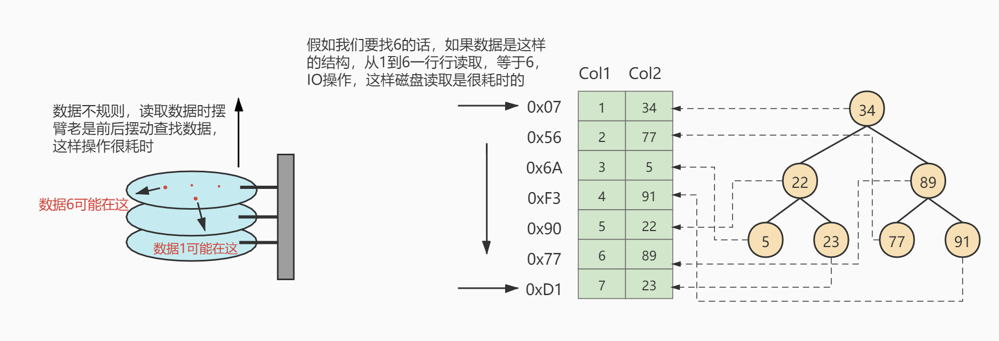

假如给数据使用`二叉树`这样的数据结构进行存储，如下图所示

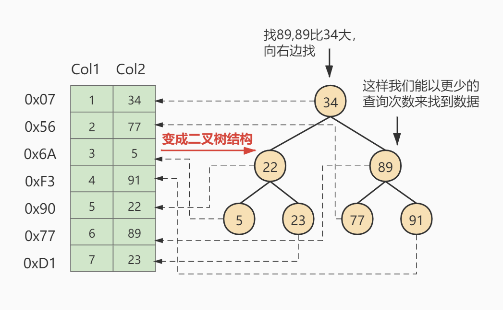

## 5. 索引及其优缺点

### 5.1 索引概述

MySQL官方对索引的定义为：**索引（Index）是帮助MySQL高效获取数据的数据结构。**

**索引的本质:** 索引是数据结构。你可以简单理解为“排好序的快速查找数据结构”，满足特定查找算法。这些数据结构以某种方式指向数据，这样就可以在这些数据结构的基础上实现高级查找算法。

### 5.2 优点

1. 类似大学图书馆建书目索引，提高数据检索的效率，降低数据库的IO成本，这也是创建索引最主要的原因。
2. 通过创建唯一索引，可以保证数据库表中每一行数据的唯一性。
3. 在实现数据的参考完整性方面，可以加速表和表之间的连接。换句话说，对于有依赖关系的子表和父表联合查询时，可以提高查询速度。
4. 在使用分组和排序子句进行数据查询时，可以显著减少查询中分组和排序的时间，降低了CPU的消耗。

### 5.3 缺点

增加索引也有许多不利的方面，主要表现在如下几个方面：

1. 创建索引和维护索引要耗费时间，并且随着数据量的增加，所耗费的时间也会增加。
2. 索引需要占磁盘空间，除了数据表占数据空间之外，每一个索引还要占一定的物理空间，存储在磁盘上，如果有大量的索引，索引文件就可能比数据文件更快达到最大文件尺寸。
3. 虽然索引大大提高了查询速度，同时却会降低更新表的速度。当对表中的数据进行增加、删除和修改的时候，索引也要动态地维护，这样就降低了数据的维护速度。

因此，选择使用索引时，需要综合考虑索引的优点和缺点。

## 6. InnoDB中索引的推演

### 6.1 索引之前的查找

先来看一个精确匹配的例子：

`SELECT [列名列表] FROM 表名 WHERE 列名 = xxx;`

#### 1. 在一个页中的查找

#### 2. 在很多页中查找

在没有索引的情况下，不论是根据主键列或者其他列的值进行查找，由于我们并不能快速的定位到记录所在的页，所以只能`从第一个页`沿着`双向链表`一直往下找，在每一个页中根据我们上面的查找方式去查找指定的记录。因为要遍历所有的数据页，所以这种方式显然是`超级耗时`的。如果一个表有一亿条记录呢？此时索引应运而生。

### 6.2 设计索引

建一个表：

```sql
mysql> CREATE TABLE index_demo(
c1 INT,
c2 INT,
c3 CHAR(1),
PRIMARY KEY(c1)
) ROW_FORMAT = Compact;
```

这个新建的`index_demo`表中有2个INT类型的列，1个CHAR(1)类型的列，而且我们规定了c1列为主键，这个表使用`Compact`行格式来实际存储记录的。这里我们简化了index_demo表的行格式示意图：

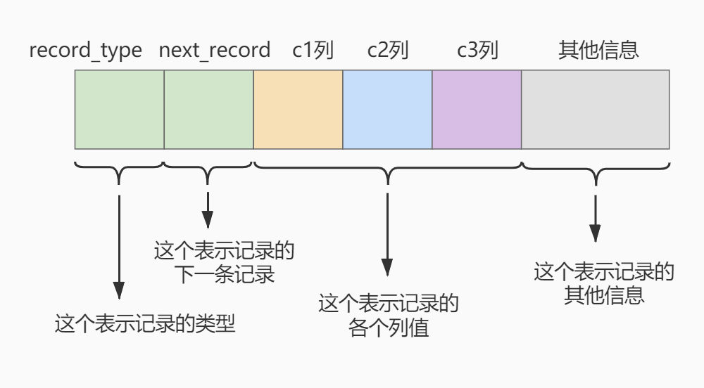

我们只在示意图里展示记录的这几个部分：

- `record_type`：记录头信息的一项属性，表示记录的类型，0表示普通记录、2表示最小记录、3表示最大记录、1暂时还没用过，下面讲。
- `next_record`：记录头信息的一项属性，表示下一条地址相对于本条记录的地址偏移量，我们用箭头来表明下一条记录是谁。
- `各个列的值`：这里只记录在index_demo表中的三个列，分别是c1、c2和c3。
- `其他信息`：除了上述3种信息以外的所有信息，包括其他隐藏列的值以及记录的额外信息。

将记录格式示意图的其他信息项暂时去掉并把它竖起来的效果就是这样：

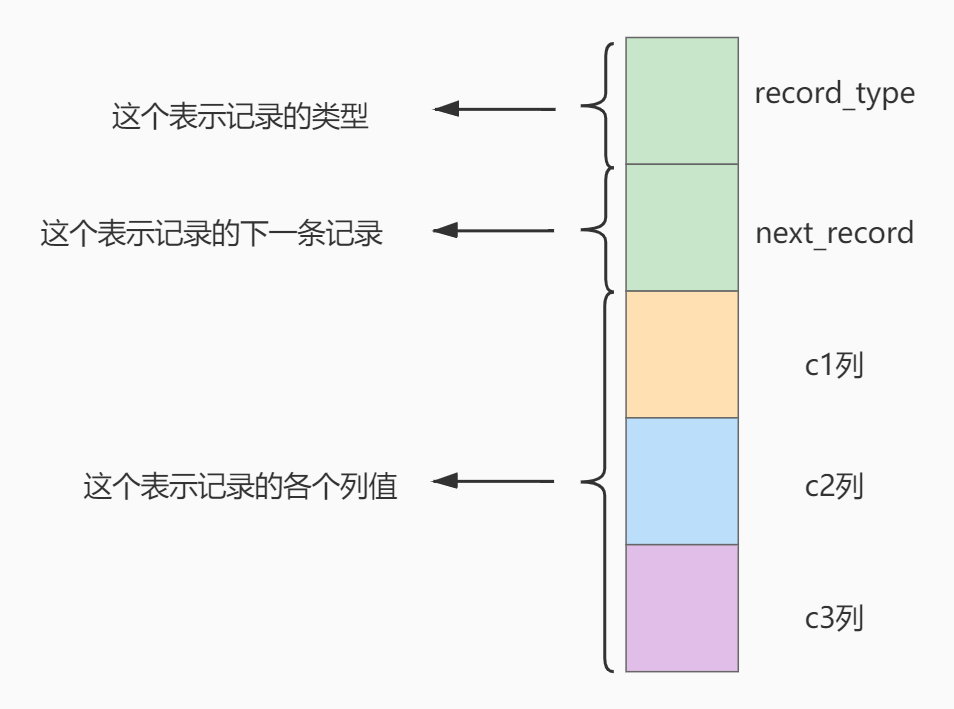

把一些记录放到页里的示意图就是：

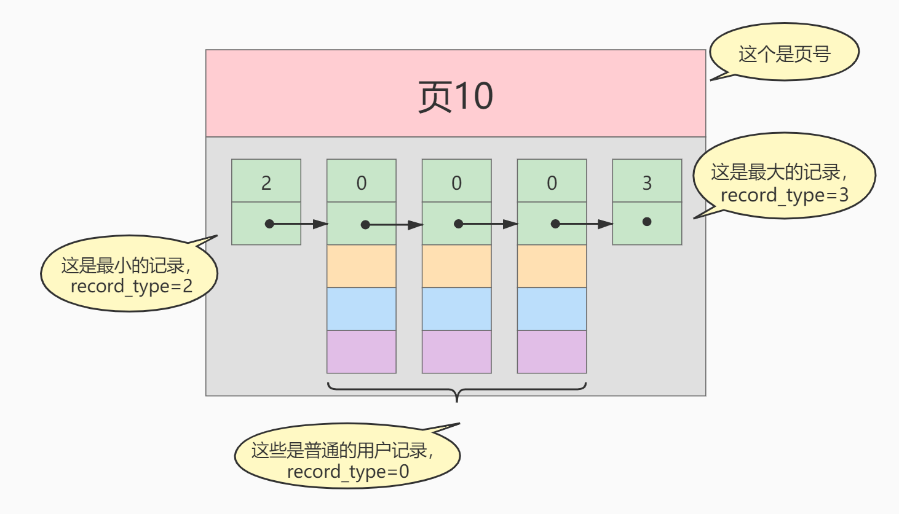

#### 1. 一个简单的索引设计方案

我们在根据某个搜索条件查找一些记录时为什么要遍历所有的数据页呢？因为各个页中的记录并没有规律，我们并不知道我们的搜索条件匹配哪些页中的记录，所以不得不依次遍历所有的数据页。所以如果我们`想快速的定位到需要查找的记录在哪些数据页`中该咋办？我们可以为快速定位记录所在的数据页而`建立一个目录`，建这个目录必须完成下边这些事：

- **下一个数据页中用户记录的主键值必须大于上一个页中用户记录的主键值。**
- **给所有的页建立一个目录项。**

所以我们为上边几个页做好的目录就像这样子：

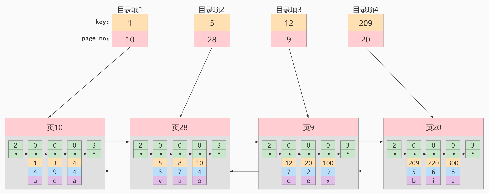

以页28为例，它对应目录项2，这个目录项中包含着该页的页号28以及该页中用户记录的最小主键值5。我们只需要把几个目录项在物理存储器上连续存储（比如：数组），就可以实现根据主键值快速查找某条记录的功能了。比如：查找主键值为20的记录，具体查找过程分两步：

1. 先从目录项中根据二分法快速确定出主键值为20的记录在目录项3中（因为12<20<209），它对应的页是页9。
2. 再根据前边说的在页中查找记录的方式去页9中定位具体的记录。

至此，针对数据页做的简易目录就搞定了。这个目录有一个别名，称为索引。

#### 2. InnoDB中的索引方案

##### ① 迭代1次：目录项纪录的页

我们把前边使用到的目录项放到数据页中的样子就是这样：

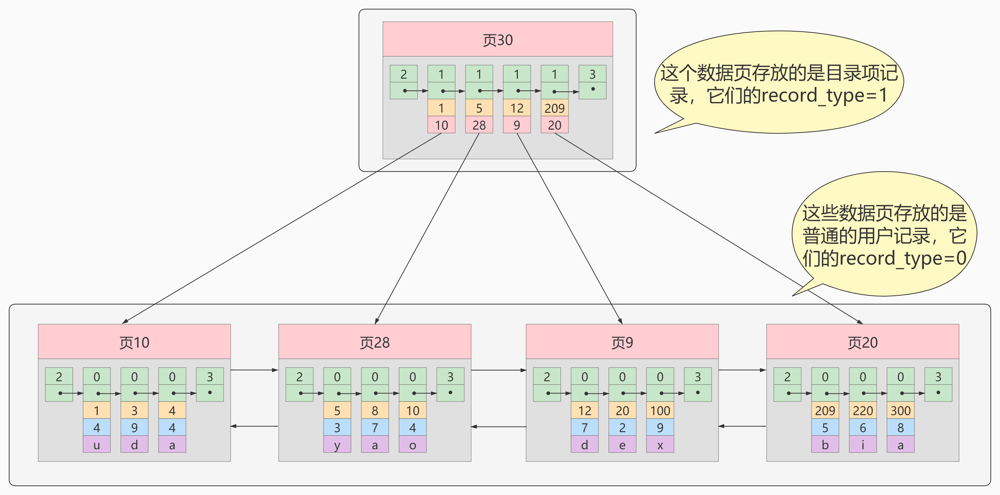

从图中可以看出来，我们新分配了一个编号为30的页来专门存储目录项记录。这里再次强调`目录项记录`和普通的`用户记录`的**不同点**：

- `目录项记录`的`record_type`值是1，而`普通用户记录`的`record_type`值是0。
- 目录项记录只有`主键值和页的编号`两个列，而普通的用户记录的列是用户自己定义的，可能包含`很多列`，另外还有InnoDB自己添加的隐藏列。
- 了解：记录头信息里还有一个叫`min_rec_mask`的属性，只有在存储`目录项记录`的页中的主键值最小的`目录项记录`的`min_rec_mask`值为1，其他别的记录的`min_rec_mask`值都是0。

**相同点**：两者用的是一样的数据页，都会为主键值生成`Page Directory`（页目录），从而在按照主键值进行查找时可以使用`二分法`来加快查询速度。

现在以查找主键为20的记录为例，根据某个主键值去查找记录的步骤就可以大致拆分成下边两步：

1. 先到存储`目录项记录`的页，也就是页30中通过`二分法`快速定位到对应目录项，因为`12<20<209`，所以定位到对应的记录所在的页就是页9。
2. 再到存储用户记录的页9中根据`二分法`快速定位到主键值为20的用户记录。

##### ② 迭代2次：多个目录项纪录的页

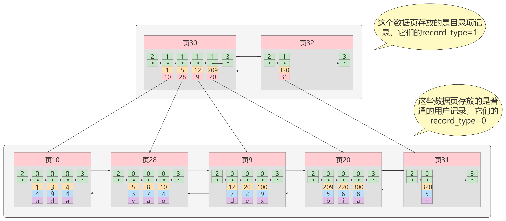

从图中可以看出，我们插入了一条主键值为320的用户记录之后需要两个新的数据页：

- 为存储该用户记录而新生成了页31。
- 因为原先存储目录项记录的`页30的容量已满`（我们前边假设只能存储4条目录项记录），所以不得不需要一个新的页32来存放页31对应的目录项。

现在因为存储目录项记录的页不止一个，所以如果我们想根据主键值查找一条用户记录大致需要3个步骤，以查找主键值为20的记录为例：

1. 确定`目录项记录页`
   - 我们现在的存储目录项记录的页有两个，即页30和页32，又因为页30表示的目录项的主键值的范围是[1,320)，页32表示的目录项的主键值不小于320，所以主键值为20的记录对应的目录项记录在页30中。
2. 通过目录项记录页`确定用户记录真实所在的页`。
3. 在真实存储用户记录的页中定位到具体的记录。

##### ③ 迭代3次：目录项记录页的目录页

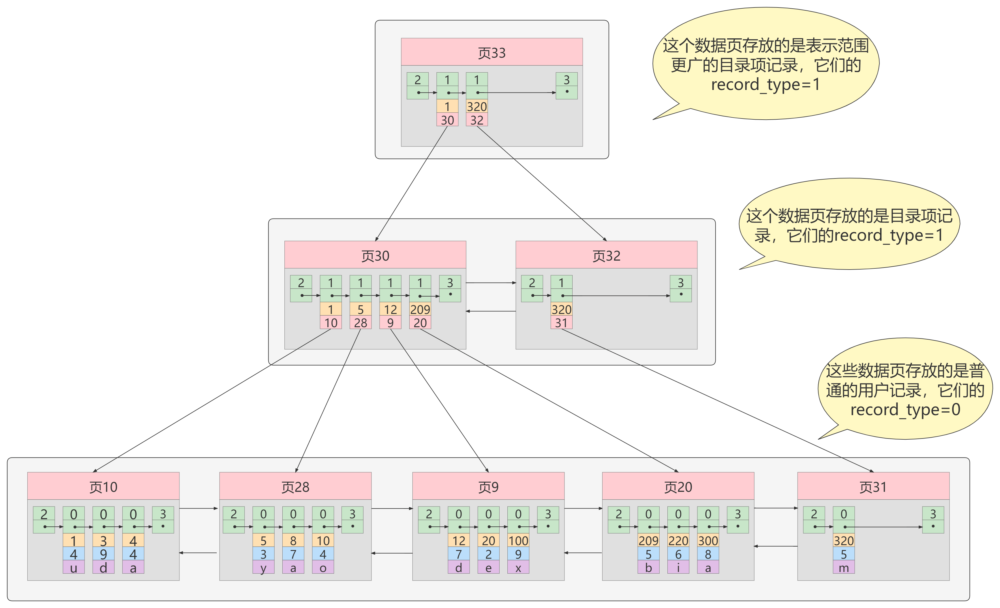

如图，我们生成了一个存储更高级目录项的页33，这个页中的两条记录分别代表页30和页32，如果用户记录的主键值在[1,320)之间，则到页30中查找更详细的目录项记录，如果主键值不小于320的话，就到页32中查找更详细的目录项记录。

我们可以用下边这个图来描述它：

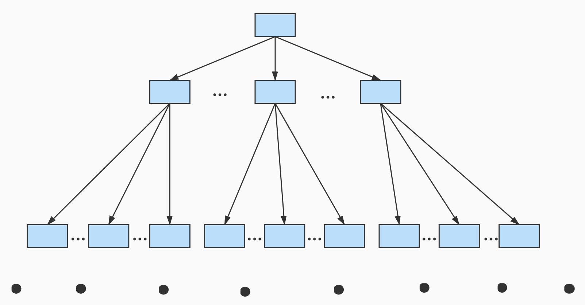

这个数据结构，它的名称是`B+树`。

##### ④ B+Tree

一个B+树的节点其实可以分成好多层，规定最下边的那层，也就是存放我们用户记录的那层为第`0`层，之后依次往上加。之前我们做了一个非常极端的假设：存放用户记录的页`最多存放3条记录`，存放目录项记录的页`最多存放4条记录`。其实真实环境中一个页存放的记录数量是非常大的，假设所有存放用户记录的叶子节点代表的数据页可以存放`100条用户记录`，所有存放目录项记录的内节点代表的数据页可以存放`1000条目录项记录`，那么：

- 如果B+树只有1层，也就是只有1个用于存放用户记录的节点，最多能存放`100`条记录。
- 如果B+树有2层，最多能存放`1000×100=10,0000`条记录。
- 如果B+树有3层，最多能存放`1000×1000×100=1,0000,0000`条记录。
- 如果B+树有4层，最多能存放`1000×1000×1000×100=1000,0000,0000`条记录。相当多的记录！！！

你的表里能存放`1000,0000,0000`条记录吗？所以一般情况下，我们`用到的B+树都不会超过4层`，那我们通过主键值去查找某条记录最多只需要做4个页面内的查找（查找3个目录项页和一个用户记录页），又因为在每个页面内有所谓的`PageDirectory`（页目录），所以在页面内也可以通过`二分法`实现快速定位记录。

### 6.3 常见索引概念

索引按照物理实现方式，索引可以分为2种：聚簇（聚集）和非聚簇（非聚集）索引。我们也把非聚集索引称为二级索引或者辅助索引。

#### 1. 聚簇索引

**特点：**

- 使用记录主键值的大小进行记录和页的排序，这包括三个方面的含义：
  - `页内`的记录是按照主键的大小顺序排成一个`单向链表`。
  - 各个存放`用户记录的页`也是根据页中用户记录的主键大小顺序排成一个`双向链表`。
  - 存放`目录项记录的页`分为不同的层次，在同一层次中的页也是根据页中目录项记录的主键大小顺序排成一个`双向链表`。
- B+树的`叶子节点`存储的是完整的用户记录。
  - 所谓完整的用户记录，就是指这个记录中存储了所有列的值（包括隐藏列）。

**优点：**

- `数据访问更快`，因为聚簇索引将索引和数据保存在同一个B+树中，因此从聚簇索引中获取数据比非聚簇索引更快
- 聚簇索引对于主键的`排序查找`和`范围查找`速度非常快
- 按照聚簇索引排列顺序，查询显示一定范围数据的时候，由于数据都是紧密相连，数据库不用从多个数据块中提取数据，所以`节省了大量的io操作`。

**缺点：**

- `插入速度严重依赖于插入顺序`，按照主键的顺序插入是最快的方式，否则将会出现页分裂，严重影响性能。因此，对于InnoDB表，我们一般都会定义一个**自增的ID列为主键**
- `更新主键的代价很高`，因为将会导致被更新的行移动。因此，对于InnoDB表，我们一般定义**主键为不可更新**
- `二级索引访问需要两次索引查找`，第一次找到主键值，第二次根据主键值找到行数据

#### 2. 二级索引（辅助索引、非聚簇索引）

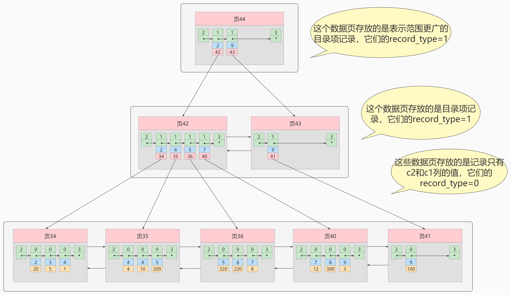

**概念：回表**我们根据这个以c2列大小排序的B+树只能确定我们要查找记录的主键值，所以如果我们想根据c2列的值查找到完整的用户记录的话，仍然需要到`聚簇索引`中再查一遍，这个过程称为`回表`。也就是根据c2列的值查询一条完整的用户记录需要使用到`2`棵B+树！

**问题**：为什么我们还需要一次`回表`操作呢？直接把完整的用户记录放到叶子节点不OK吗？

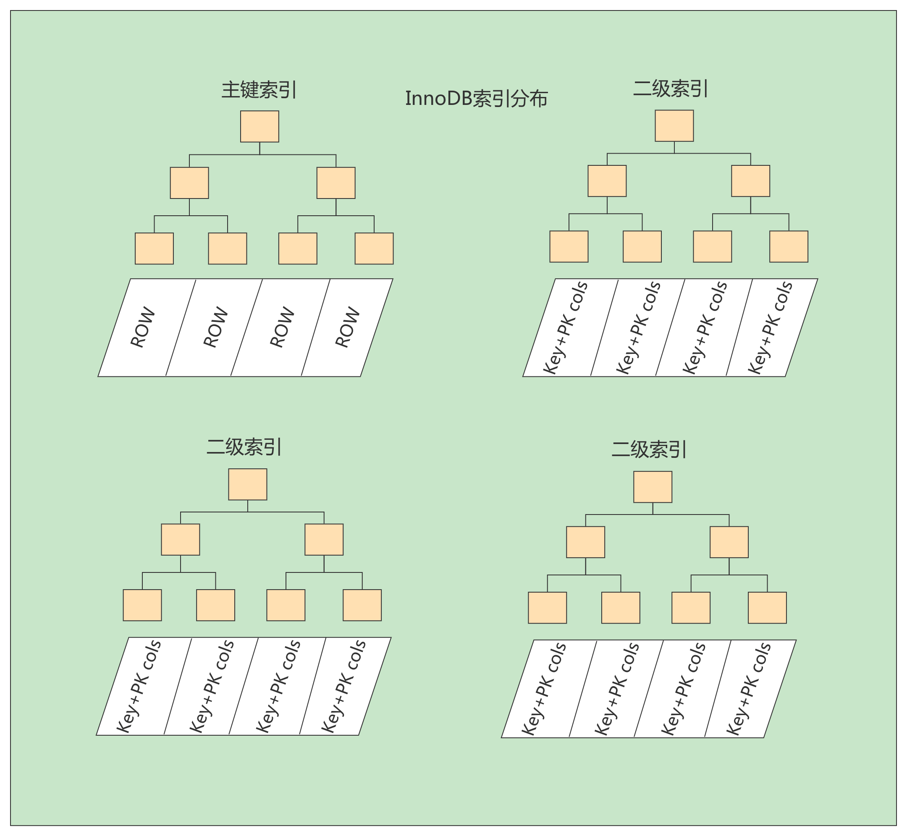

#### 3. 联合索引

我们也可以同时以多个列的大小作为排序规则，也就是同时为多个列建立索引，比方说我们想让B+树按照`c2和c3列`的大小进行排序，这个包含两层含义：

- 先把各个记录和页按照c2列进行排序。
- 在记录的c2列相同的情况下，采用c3列进行排序

注意一点，以c2和c3列的大小为排序规则建立的B+树称为`联合索引`，本质上也是一个二级索引。它的意思与分别为c2和c3列分别建立索引的表述是不同的，不同点如下：

- 建立`联合索引`只会建立如上图一样的1棵B+树。
- 为c2和c3列分别建立索引会分别以c2和c3列的大小为排序规则建立2棵B+树。

### 6.4 InnoDB的B+树索引的注意事项

1. 根页面位置万年不动
2. 内节点中目录项记录的唯一性
3. 一个页面最少存储2条记录

## 7. MyISAM中的索引方案

**B树索引适用存储引擎如表所示：**

| **索引/存储引擎** | **MyISAM** | **InnoDB** | **Memory** |
| :---------------- | :--------- | :--------- | :--------- |
| B-Tree索引        | 支持       | 支持       | 支持       |

即使多个存储引擎支持同一种类型的索引，但是他们的实现原理也是不同的。Innodb和MyISAM默认的索引是Btree索引；而Memory默认的索引是Hash索引。

MyISAM引擎使用`B+Tree`作为索引结构，叶子节点的data域存放的是`数据记录的地址`。

### 7.1 MyISAM索引的原理

下图是MyISAM索引的原理图。

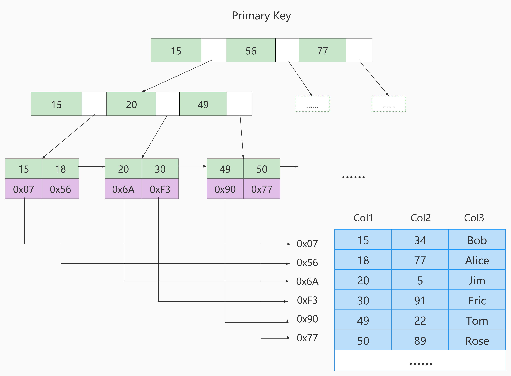

如果我们在Col2上建立一个二级索引，则此索引的结构如下图所示：

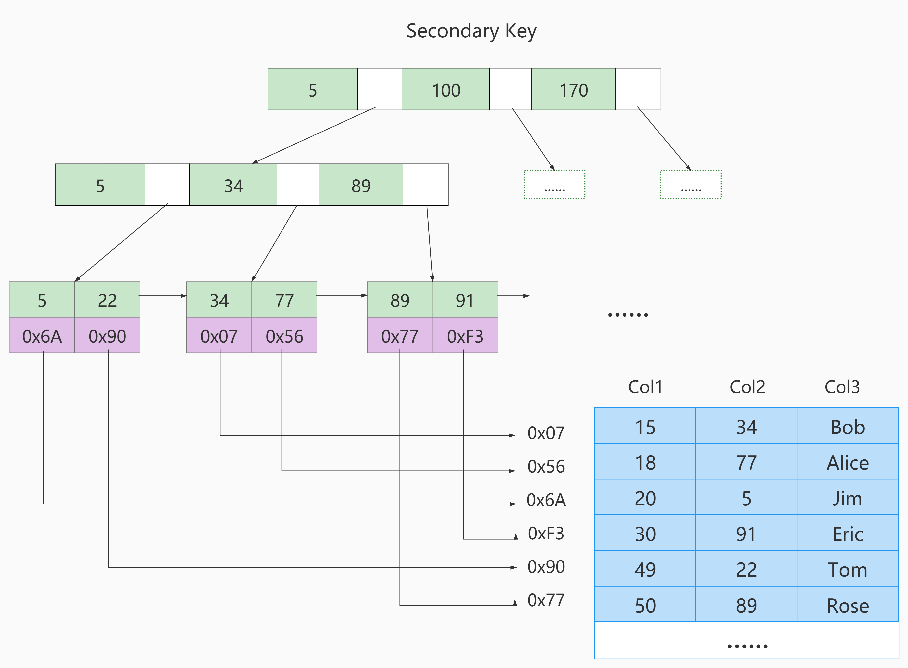

### 7.2 MyISAM与InnoDB对比

**MyISAM的索引方式都是“非聚簇”的，与InnoDB包含1个聚簇索引是不同的。小结两种引擎中索引的区别：**

1. 在InnoDB存储引擎中，我们只需要根据主键值对`聚簇索引`进行一次查找就能找到对应的记录，而在MyISAM中却需要进行一次`回表`操作，意味着MyISAM中建立的索引相当于全部都是`二级索引`。
2. InnoDB的数据文件本身就是索引文件，而MyISAM索引文件和数据文件是`分离的`，索引文件仅保存数据记录的地址。
3. InnoDB的非聚簇索引data域存储相应记录`主键的值`，而MyISAM索引记录的是`地址`。换句话说，InnoDB的所有非聚簇索引都引用主键作为data域。
4. MyISAM的回表操作是十分`快速`的，因为是拿着地址偏移量直接到文件中取数据的，反观InnoDB是通过获取主键之后再去聚簇索引里找记录，虽然说也不慢，但还是比不上直接用地址去访问。
5. InnoDB要求表`必须有主键`（`MyISAM`可以没有）。如果没有显式指定，则MySQL系统会自动选择一个可以非空且唯一标识数据记录的列作为主键。如果不存在这种列，则MySQL自动为InnoDB表生成一个隐含字段作为主键，这个字段长度为6个字节，类型为长整型。

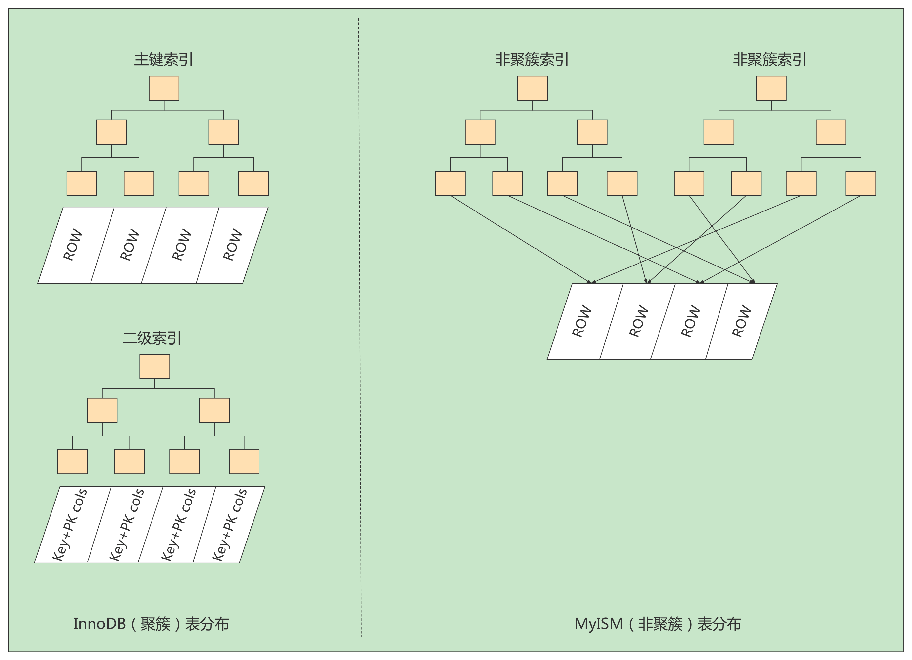

## 8. 索引的代价

索引是个好东西，可不能乱建，它在空间和时间上都会有消耗：

**空间上的代价**

每建立一个索引都要为它建立一棵B+树，每一棵B+树的每一个节点都是一个数据页，一个页默认会 占用 16KB 的存储空间，一棵很大的B+树由许多数据页组成，那就是很大的一片存储空间。

**时间上的代价**

每次对表中的数据进行增、删、改操作时，都需要去修改各个B+树索引。而且我们讲过，B+树每层节点都是按照索引列的值从小到大的顺序排序而组成了双向链表。不论是叶子节点中的记录，还是内节点中的记录（也就是不论是用户记录还是目录项记录）都是按照索引列的值从小到大的顺序而形成了一个单向链表。而增、删、改操作可能会对节点和记录的排序造成破坏，所以存储引擎需要额外的时间进行一些记录移位，页面分裂、页面回收等操作来维护好节点和记录的排序。如果我们建了许多索引，每个索引对应的B+树都要进行相关的维护操作，会给性能拖后腿。
