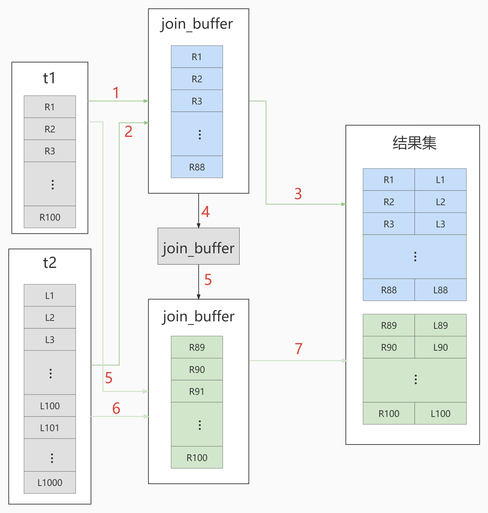

# 索引优化与查询优化

都有哪些维度可以进行数据库调优? 简言之:

- 索引失效、没有充分利用到索引--索引建立
- 关联查询太多 JOIN (设计缺陷或不得已的需求) --SQL 优化
- 服务器调优及各个参数设置 (缓冲、线程数等) --调整 my.cnf
- 数据过多--分库分表
## 1.数据准备
学员表 插 50万 条， 班级表 插 1万 条。
```sql
-- 1：建表
CREATE TABLE `class` (
	`id` INT ( 11 ) NOT NULL AUTO_INCREMENT,
	`className` VARCHAR ( 30 ) DEFAULT NULL,
	`address` VARCHAR ( 40 ) DEFAULT NULL,
	`monitor` INT NULL,
	PRIMARY KEY ( `id` ) 
) ENGINE = INNODB AUTO_INCREMENT = 1 DEFAULT CHARSET = utf8;

CREATE TABLE `student` (
	`id` INT ( 11 ) NOT NULL AUTO_INCREMENT,
	`stuno` INT NOT NULL,
	`name` VARCHAR ( 20 ) DEFAULT NULL,
	`age` INT ( 3 ) DEFAULT NULL,
	`classId` INT ( 11 ) DEFAULT NULL,
	PRIMARY KEY ( `id` ) #CONSTRAINT `fk_class_id` FOREIGN KEY (`classId`) REFERENCES `t_class` (`id`)

) ENGINE = INNODB AUTO_INCREMENT = 1 DEFAULT CHARSET = utf8;

-- 2：设置允许创建函数
set global log_bin_trust_function_creators=1;

-- 3：创建函数
#随机产生字符串
DELIMITER //
CREATE FUNCTION rand_string ( n INT ) RETURNS VARCHAR ( 255 ) BEGIN
	DECLARE
		chars_str VARCHAR ( 100 ) DEFAULT 'abcdefghijklmnopqrstuvwxyzABCDEFJHIJKLMNOPQRSTUVWXYZ';
	DECLARE
		return_str VARCHAR ( 255 ) DEFAULT '';
	DECLARE
		i INT DEFAULT 0;
	WHILE
			i < n DO
			
			SET return_str = CONCAT(
				return_str,
			SUBSTRING( chars_str, FLOOR( 1+RAND ()* 52 ), 1 ));
		
		SET i = i + 1;
		
	END WHILE;
	RETURN return_str;
	
END // 
DELIMITER;
#随机产生班级编号
DELIMITER //
CREATE FUNCTION rand_num ( from_num INT, to_num INT ) RETURNS INT ( 11 ) BEGIN
	DECLARE
		i INT DEFAULT 0;
	
	SET i = FLOOR(
		from_num + RAND()*(
			to_num - from_num + 1 
		));
	RETURN i;
	
END // 
DELIMITER;

-- 4：创建存储过程
#创建往stu表中插入数据的存储过程
DELIMITER //
CREATE PROCEDURE insert_stu ( START INT, max_num INT ) 
BEGIN 
DECLARE i INT DEFAULT 0;
	SET autocommit = 0;
	REPEAT
		SET i = i + 1;
		INSERT INTO student ( stuno, NAME, age, classId ) VALUES
		((START + i ),rand_string ( 6 ),rand_num ( 1, 50 ),rand_num ( 1, 1000 ));
		UNTIL i = max_num 
	END REPEAT;
	COMMIT;
END // 
DELIMITER;
#创建往class表中插入数据的存储过程
DELIMITER //
CREATE PROCEDURE `insert_class` ( max_num INT )
BEGIN
	DECLARE i INT DEFAULT 0;
	SET autocommit = 0;
	REPEAT
			SET i = i + 1;
		INSERT INTO class ( classname, address, monitor ) VALUES
			(rand_string ( 8 ),	rand_string ( 10 ),rand_num ( 1, 100000 ));
		UNTIL i = max_num 
	END REPEAT;
	COMMIT;
END // 
DELIMITER;

-- 5：调用存储过程
CALL insert_class(10000);
CALL insert_stu(100000,500000);

-- 6：删除某表上的索引
DELIMITER //
CREATE PROCEDURE `proc_drop_index` (dbname VARCHAR ( 200 ),tablename VARCHAR ( 200 )) 
BEGIN
	DECLARE done INT DEFAULT 0;
	DECLARE	ct INT DEFAULT 0;
	DECLARE	_index VARCHAR ( 200 ) DEFAULT '';
	DECLARE	_cur CURSOR FOR SELECT index_name FROM information_schema.STATISTICS 
	WHERE
		table_schema = dbname 
		AND table_name = tablename 
		AND seq_in_index = 1 
		AND index_name <> 'PRIMARY';#每个游标必须使用不同的declare continue handler for not found set done=1来控制游标的结束
	DECLARE
		CONTINUE HANDLER FOR NOT FOUND SET done = 2;#若没有数据返回,程序继续,并将变量done设为2
	OPEN _cur;
	FETCH _cur INTO _index;
	WHILE	_index <> '' DO
		SET @str = CONCAT( "drop index ", _index, " on ", tablename );
		PREPARE sql_str FROM @str;
		EXECUTE sql_str;
		DEALLOCATE PREPARE sql_str;
		SET _index = '';
		FETCH _cur INTO _index;
	END WHILE;
	CLOSE _cur;
END // 
DELIMITER;
```
## 2. 索引优化
MySQL 中`提高性能`的一个最有效的方式是对数据表`设计合理的索引`。索引提供了高校访问数据的方法，并且加快查询的速度，因此索引对查询的速度有着至关重要的影响。

- 使用索引可以`快速的定位`表中的某条记录，从而提高数据库查询的速度，提高数据库的性能。
- 如果查询时没有使用索引，查询语句就会`扫描表中的所有记录`。在数据量大的情况下，这样查询的速度会很慢。

大多数情况下都默认采用`B+树`来构建索引。只是空间列类型的索引使用 `R-树`，并且 MEMORY 表还支持 `hash 索引`。

其实，用不用索引，最终都是优化器说了算。优化器是基于什么的优化器？基于 `cost 开销(CostBaseOptimizer)`，它不是基于`规则(Rule-BasedOptimizer)`，也不是基于`语义`。怎样开销小就怎么来。另外，**SQL 语句是否使用索引，跟数据库版本、数据量、数据选择度都有关系**。
### 全值匹配我最爱
系统中经常出现的 sql 语句如下
```sql
EXPLAIN SELECT SQL_NO_CACHE * FROM student WHERE age=30;
EXPLAIN SELECT SQL_NO_CACHE * FROM student WHERE age=30 AND classId=4;
EXPLAIN SELECT SQL_NO_CACHE * FROM student WHERE age=30 AND classId=4 AND NAME = 'abcd';
-- 建立索引前执行,获取执行时间
SELECT SQL_NO_CACHE * FROM student WHERE age=30 AND classId=4 AND NAME = 'abcd'; -- 0.171
-- 建立索引,并重新执行上一条 sql
CREATE INDEX idx_age ON student(age); -- 0.033
CREATE INDEX idx_age_classid ON student(age,classId); -- 0.003
CREATE INDEX idx_age_classid_name ON student(age,classId,NAME); -- 0.002
```
### 最佳左前缀法则
在 MySQL 建立联合索引时会遵守最佳左前缀匹配原则，即最左优先，在检索数据时从联合索引的最左边开始匹配。
```sql
EXPLAIN SELECT SQL_NO_CACHE * FROM student WHERE age=30 AND name = 'abcd';
#只使用了 age 索引

EXPLAIN SELECT SQL_NO_CACHE * FROM student WHERE classid=1 AND name = 'abcd';
#没有使用索引

EXPLAIN SELECT SQL_NO_CACHE * FROM student WHERE age=30 AND classid=4 AND name = 'abcd';
#使用了idx_age_classid_name索引
EXPLAIN SELECT SQL_NO_CACHE * FROM student WHERE classid=4 AND age=30 AND name = 'abcd';
#同样使用了idx_age_classid_name索引,优化器自己会颠倒顺序
```
结论：MySQL 可以为多个字段创建索引，一个索引可以包括 16 个字段。对于多列索引，**过滤条件要使用索引必须安装索引建立时的顺序，一次满足，一旦跳过某个字段，索引后面的字段都无法被使用**。如果查询条件中没有使用这些字段中第 1 个字段时，多列或联合索引不会被使用。
### 主键插入顺序


如果此时再插入一条主键值为 9 的记录，那它插入的位置就如下图：


可这个数据页已经满了，再插进来咋办呢？我们需要把当前`页面分裂`成两个页面，把本页中的一些记录移动到新创建的这个页中。页面分裂和记录移位意味着什么？意味着： `性能损耗` ！所以如果我们想尽量避免这样无谓的性能损耗，最好让插入的记录的主键值依次递增 ，这样就不会发生这样的性能损耗了。 所以我们建议：让主键具有 `AUTO_INCREMENT` ，让存储引擎自己为表生成主键，而不是我们手动插入。
### 计算、函数、类型转换(自动或手动)导致索引失效
```sql
CREATE INDEX idx_name ON student(NAME);
EXPLAIN SELECT SQL_NO_CACHE * FROM student WHERE name LIKE 'abc%'; #走索引
EXPLAIN SELECT SQL_NO_CACHE * FROM student WHERE LEFT(name,3) = 'abc'; #不走索引
EXPLAIN SELECT id, stuno, name FROM student WHERE SUBSTRING(name, 1,3)='abc'; #不走索引

CREATE INDEX idx_sno ON student(stuno);
EXPLAIN SELECT SQL_NO_CACHE id, stuno, NAME FROM student WHERE stuno+1 = 900001; #不走索引
EXPLAIN SELECT SQL_NO_CACHE id, stuno, NAME FROM student WHERE stuno = 900000; #走索引

```
### 类型转换导致索引失效
```sql
EXPLAIN SELECT SQL_NO_CACHE * FROM student WHERE NAME = 123; #不走索引

EXPLAIN SELECT SQL_NO_CACHE * FROM student WHERE NAME = '123'; #走索引
```
### 范围条件右边的列索引失效
```sql
CALL proc_drop_index('test','student'); #删除所有索引

CREATE INDEX idx_age_classId_name ON student(age,classId,NAME);

EXPLAIN SELECT SQL_NO_CACHE * FROM student WHERE age=30 AND classId>20 AND name = 'abc'; 
#没有用上 name 索引
EXPLAIN SELECT SQL_NO_CACHE * FROM student WHERE age=30 AND name = 'abc' AND classId>20;
#颠倒顺序还是一样

CREATE INDEX idx_age_name_cid ON student(age,NAME,classId);
EXPLAIN SELECT SQL_NO_CACHE * FROM student WHERE age=30 AND name = 'abc' AND classId>20;
#此时使用了idx_age_name_cid索引
```
### 不等于(!= 或者<>)索引失效
```sql
EXPLAIN SELECT SQL_NO_CACHE * FROM student WHERE name != 'abc' ;
```
### is null可以使用索引，is not null无法使用索引
```sql
EXPLAIN SELECT SQL_NO_CACHE * FROM student WHERE age IS NULL; 

EXPLAIN SELECT SQL_NO_CACHE * FROM student WHERE age IS NOT NULL; 
```
结论：最好在设计数据表的时候就将`字段设置为 NOT NULL 约束`，比如你可以将 int 类型的字段默认值设置为 0。将字符类型的默认值设置为空字符串`''`。同理，在查询中使用 `not like`  也无法使用索引，导致全表扫描。
### like以通配符%开头索引失效
```sql
EXPLAIN SELECT SQL_NO_CACHE * FROM student WHERE NAME LIKE 'ab%'; 

EXPLAIN SELECT SQL_NO_CACHE * FROM student WHERE NAME LIKE '%ab%';
```
### OR 前后存在非索引的列，索引失效
```sql
CALL proc_drop_index('atguigudb2','student'); #删除所有索引
CREATE INDEX idx_age ON student(age);
CREATE INDEX idx_cid ON student(classid);

EXPLAIN SELECT SQL_NO_CACHE * FROM student WHERE age = 10 OR classid = 100; #走索引
EXPLAIN SELECT SQL_NO_CACHE * FROM student WHERE age = 10 OR name = 'Abel'; #不走索引
```
### 数据库和表的字符集统一使用utf8mb4
统一使用utf8mb4( 5.5.3版本以上支持)兼容性更好，统一字符集可以避免由于字符集转换产生的乱码。不同的`字符集`进行比较前需要进行`转换`会造成索引失效。 
### 练习
假设 index(a,b,c)

| where 语句 | 索引是否被使用 |
| :-- | :-- |
| a=3 | 是，使用了 a |
| a=3 and b=5 | 是，使用了 a b |
| a=3 and b=5 and c=4 | 是，使用了 a b c |
| b=3 or (b=3 and c=4) or c =4 | 否 |
| a=3 and c=5 | 是，使用了 a |
| a=3 and b>4 and c=5 | 是，使用了 a b |
| a is null and b is not null | 是，使用了 a |
| a!=3 | 否 |
| abs(a)=3 | 否 |
| a=3 and b like 'kk%' and c=4 | 是，使用了 a b c |
| a=3 and b like '%kk' and c=4 | 是，只用到 a |
| a=3 and b like '%kk%' and c=4 | 是，只用到 a |
| a=3 and b like 'k%k%' and c=4 | 是，使用了 a b c |

## 3. 关联查询优化
### 数据准备
```sql
#分类
CREATE TABLE IF NOT EXISTS `type` (
`id` INT(10) UNSIGNED NOT NULL AUTO_INCREMENT,
`card` INT(10) UNSIGNED NOT NULL,
PRIMARY KEY (`id`)
);
#图书
CREATE TABLE IF NOT EXISTS `book` (
`bookid` INT(10) UNSIGNED NOT NULL AUTO_INCREMENT,
`card` INT(10) UNSIGNED NOT NULL,
PRIMARY KEY (`bookid`)
);

#向分类表中添加20条记录
INSERT INTO TYPE(card) VALUES(FLOOR(1 + (RAND() * 20)));
INSERT INTO TYPE(card) VALUES(FLOOR(1 + (RAND() * 20)));
INSERT INTO TYPE(card) VALUES(FLOOR(1 + (RAND() * 20)));
INSERT INTO TYPE(card) VALUES(FLOOR(1 + (RAND() * 20)));
INSERT INTO TYPE(card) VALUES(FLOOR(1 + (RAND() * 20)));
INSERT INTO TYPE(card) VALUES(FLOOR(1 + (RAND() * 20)));
INSERT INTO TYPE(card) VALUES(FLOOR(1 + (RAND() * 20)));
INSERT INTO TYPE(card) VALUES(FLOOR(1 + (RAND() * 20)));
INSERT INTO TYPE(card) VALUES(FLOOR(1 + (RAND() * 20)));
INSERT INTO TYPE(card) VALUES(FLOOR(1 + (RAND() * 20)));
INSERT INTO TYPE(card) VALUES(FLOOR(1 + (RAND() * 20)));
INSERT INTO TYPE(card) VALUES(FLOOR(1 + (RAND() * 20)));
INSERT INTO TYPE(card) VALUES(FLOOR(1 + (RAND() * 20)));
INSERT INTO TYPE(card) VALUES(FLOOR(1 + (RAND() * 20)));
INSERT INTO TYPE(card) VALUES(FLOOR(1 + (RAND() * 20)));
INSERT INTO TYPE(card) VALUES(FLOOR(1 + (RAND() * 20)));
INSERT INTO TYPE(card) VALUES(FLOOR(1 + (RAND() * 20)));
INSERT INTO TYPE(card) VALUES(FLOOR(1 + (RAND() * 20)));
INSERT INTO TYPE(card) VALUES(FLOOR(1 + (RAND() * 20)));
INSERT INTO TYPE(card) VALUES(FLOOR(1 + (RAND() * 20)));

#向图书表中添加20条记录
INSERT INTO book(card) VALUES(FLOOR(1 + (RAND() * 20)));
INSERT INTO book(card) VALUES(FLOOR(1 + (RAND() * 20)));
INSERT INTO book(card) VALUES(FLOOR(1 + (RAND() * 20)));
INSERT INTO book(card) VALUES(FLOOR(1 + (RAND() * 20)));
INSERT INTO book(card) VALUES(FLOOR(1 + (RAND() * 20)));
INSERT INTO book(card) VALUES(FLOOR(1 + (RAND() * 20)));
INSERT INTO book(card) VALUES(FLOOR(1 + (RAND() * 20)));
INSERT INTO book(card) VALUES(FLOOR(1 + (RAND() * 20)));
INSERT INTO book(card) VALUES(FLOOR(1 + (RAND() * 20)));
INSERT INTO book(card) VALUES(FLOOR(1 + (RAND() * 20)));
INSERT INTO book(card) VALUES(FLOOR(1 + (RAND() * 20)));
INSERT INTO book(card) VALUES(FLOOR(1 + (RAND() * 20)));
INSERT INTO book(card) VALUES(FLOOR(1 + (RAND() * 20)));
INSERT INTO book(card) VALUES(FLOOR(1 + (RAND() * 20)));
INSERT INTO book(card) VALUES(FLOOR(1 + (RAND() * 20)));
INSERT INTO book(card) VALUES(FLOOR(1 + (RAND() * 20)));
INSERT INTO book(card) VALUES(FLOOR(1 + (RAND() * 20)));
INSERT INTO book(card) VALUES(FLOOR(1 + (RAND() * 20)));
INSERT INTO book(card) VALUES(FLOOR(1 + (RAND() * 20)));
INSERT INTO book(card) VALUES(FLOOR(1 + (RAND() * 20)));
```
### 采用左外连接
```sql
mysql> EXPLAIN SELECT SQL_NO_CACHE * FROM `type` LEFT JOIN book USING(card);#都没有走索引
+----+-------------+-------+------------+------+---------------+------+---------+------+------+----------+--------------------------------------------+
| id | select_type | table | partitions | type | possible_keys | key  | key_len | ref  | rows | filtered | Extra                                      |
+----+-------------+-------+------------+------+---------------+------+---------+------+------+----------+--------------------------------------------+
|  1 | SIMPLE      | type  | NULL       | ALL  | NULL          | NULL | NULL    | NULL |   20 |   100.00 | NULL                                       |
|  1 | SIMPLE      | book  | NULL       | ALL  | NULL          | NULL | NULL    | NULL |   20 |   100.00 | Using where; Using join buffer (hash join) |
+----+-------------+-------+------------+------+---------------+------+---------+------+------+----------+--------------------------------------------+
#EXPLAIN的结果,上面的那条是驱动表,下面的是被驱动表

CREATE INDEX Y ON book(card); #被驱动表 可以避免全表扫描
mysql> EXPLAIN SELECT SQL_NO_CACHE * FROM `type` LEFT JOIN book USING(card);#book 表走了索引
+----+-------------+-------+------------+------+---------------+------+---------+----------------+------+----------+-------------+
| id | select_type | table | partitions | type | possible_keys | key  | key_len | ref            | rows | filtered | Extra       |
+----+-------------+-------+------------+------+---------------+------+---------+----------------+------+----------+-------------+
|  1 | SIMPLE      | type  | NULL       | ALL  | NULL          | NULL | NULL    | NULL           |   20 |   100.00 | NULL        |
|  1 | SIMPLE      | book  | NULL       | ref  | Y             | Y    | 4       | chen.type.card |    1 |   100.00 | Using index |
+----+-------------+-------+------------+------+---------------+------+---------+----------------+------+----------+-------------+

CREATE INDEX X ON `type`(card); 
mysql> EXPLAIN SELECT SQL_NO_CACHE * FROM `type` LEFT JOIN book USING(card);
+----+-------------+-------+------------+-------+---------------+------+---------+----------------+------+----------+-------------+
| id | select_type | table | partitions | type  | possible_keys | key  | key_len | ref            | rows | filtered | Extra       |
+----+-------------+-------+------------+-------+---------------+------+---------+----------------+------+----------+-------------+
|  1 | SIMPLE      | type  | NULL       | index | NULL          | X    | 4       | NULL           |   20 |   100.00 | Using index |
|  1 | SIMPLE      | book  | NULL       | ref   | Y             | Y    | 4       | chen.type.card |    1 |   100.00 | Using index |
+----+-------------+-------+------------+-------+---------------+------+---------+----------------+------+----------+-------------+

DROP INDEX Y ON book;
mysql> EXPLAIN SELECT SQL_NO_CACHE * FROM `type` LEFT JOIN book USING(card);
+----+-------------+-------+------------+-------+---------------+------+---------+------+------+----------+--------------------------------------------+
| id | select_type | table | partitions | type  | possible_keys | key  | key_len | ref  | rows | filtered | Extra                                      |
+----+-------------+-------+------------+-------+---------------+------+---------+------+------+----------+--------------------------------------------+
|  1 | SIMPLE      | type  | NULL       | index | NULL          | X    | 4       | NULL |   20 |   100.00 | Using index                                |
|  1 | SIMPLE      | book  | NULL       | ALL   | NULL          | NULL | NULL    | NULL |   20 |   100.00 | Using where; Using join buffer (hash join) |
+----+-------------+-------+------------+-------+---------------+------+---------+------+------+----------+--------------------------------------------+
```
### 采用内连接
```sql
drop index X on `type`; 
drop index Y on `book`; #（如果已经删除了可以不用再执行该操作）

#添加索引
CREATE INDEX Y ON book(card);
mysql> EXPLAIN SELECT SQL_NO_CACHE * FROM `type` INNER JOIN book USING(card);
+----+-------------+-------+------------+------+---------------+------+---------+----------------+------+----------+-------------+
| id | select_type | table | partitions | type | possible_keys | key  | key_len | ref            | rows | filtered | Extra       |
+----+-------------+-------+------------+------+---------------+------+---------+----------------+------+----------+-------------+
|  1 | SIMPLE      | type  | NULL       | ALL  | NULL          | NULL | NULL    | NULL           |   20 |   100.00 | NULL        |
|  1 | SIMPLE      | book  | NULL       | ref  | Y             | Y    | 4       | chen.type.card |    1 |   100.00 | Using index |
+----+-------------+-------+------------+------+---------------+------+---------+----------------+------+----------+-------------+

CREATE INDEX X ON `type`(card);
mysql> EXPLAIN SELECT SQL_NO_CACHE * FROM `type` INNER JOIN book USING(card);
+----+-------------+-------+------------+-------+---------------+------+---------+----------------+------+----------+-------------+
| id | select_type | table | partitions | type  | possible_keys | key  | key_len | ref            | rows | filtered | Extra       |
+----+-------------+-------+------------+-------+---------------+------+---------+----------------+------+----------+-------------+
|  1 | SIMPLE      | type  | NULL       | index | X             | X    | 4       | NULL           |   20 |   100.00 | Using index |
|  1 | SIMPLE      | book  | NULL       | ref   | Y             | Y    | 4       | chen.type.card |    1 |   100.00 | Using index |
+----+-------------+-------+------------+-------+---------------+------+---------+----------------+------+----------+-------------+
#结论：对于内连接来说，查询优化器可以决定谁作为驱动表，谁作为被驱动表出现的


#删除索引
DROP INDEX Y ON book;
mysql> EXPLAIN SELECT SQL_NO_CACHE * FROM `type` INNER JOIN book ON type.card = book.card;
+----+-------------+-------+------------+------+---------------+------+---------+----------------+------+----------+-------------+
| id | select_type | table | partitions | type | possible_keys | key  | key_len | ref            | rows | filtered | Extra       |
+----+-------------+-------+------------+------+---------------+------+---------+----------------+------+----------+-------------+
|  1 | SIMPLE      | book  | NULL       | ALL  | NULL          | NULL | NULL    | NULL           |   20 |   100.00 | NULL        |
|  1 | SIMPLE      | type  | NULL       | ref  | X             | X    | 4       | chen.book.card |    1 |   100.00 | Using index |
+----+-------------+-------+------------+------+---------------+------+---------+----------------+------+----------+-------------+
#结论：对于内连接来讲，如果表的连接条件中只能有一个字段有索引，则有索引的字段所在的表会被作为被驱动表出现。

CREATE INDEX Y ON book(card);
mysql> EXPLAIN SELECT SQL_NO_CACHE * FROM `type` INNER JOIN book ON type.card = book.card;
+----+-------------+-------+------------+-------+---------------+------+---------+----------------+------+----------+-------------+
| id | select_type | table | partitions | type  | possible_keys | key  | key_len | ref            | rows | filtered | Extra       |
+----+-------------+-------+------------+-------+---------------+------+---------+----------------+------+----------+-------------+
|  1 | SIMPLE      | book  | NULL       | index | Y             | Y    | 4       | NULL           |   20 |   100.00 | Using index |
|  1 | SIMPLE      | type  | NULL       | ref   | X             | X    | 4       | chen.book.card |    1 |   100.00 | Using index |
+----+-------------+-------+------------+-------+---------------+------+---------+----------------+------+----------+-------------+

#向type表中添加数据（10条数据）
INSERT INTO `type`(card) VALUES(FLOOR(1 + (RAND() * 20)));
INSERT INTO `type`(card) VALUES(FLOOR(1 + (RAND() * 20)));
INSERT INTO `type`(card) VALUES(FLOOR(1 + (RAND() * 20)));
INSERT INTO `type`(card) VALUES(FLOOR(1 + (RAND() * 20)));
INSERT INTO `type`(card) VALUES(FLOOR(1 + (RAND() * 20)));
INSERT INTO `type`(card) VALUES(FLOOR(1 + (RAND() * 20)));
INSERT INTO `type`(card) VALUES(FLOOR(1 + (RAND() * 20)));
INSERT INTO `type`(card) VALUES(FLOOR(1 + (RAND() * 20)));
INSERT INTO `type`(card) VALUES(FLOOR(1 + (RAND() * 20)));
INSERT INTO `type`(card) VALUES(FLOOR(1 + (RAND() * 20)));

mysql> EXPLAIN SELECT SQL_NO_CACHE * FROM `type` INNER JOIN book ON type.card = book.card;
+----+-------------+-------+------------+------+---------------+------+---------+----------------+------+----------+-------------+
| id | select_type | table | partitions | type | possible_keys | key  | key_len | ref            | rows | filtered | Extra       |
+----+-------------+-------+------------+------+---------------+------+---------+----------------+------+----------+-------------+
|  1 | SIMPLE      | book  | NULL       | ALL  | NULL          | NULL | NULL    | NULL           |   20 |   100.00 | NULL        |
|  1 | SIMPLE      | type  | NULL       | ref  | X             | X    | 4       | chen.book.card |    1 |   100.00 | Using index |
+----+-------------+-------+------------+------+---------------+------+---------+----------------+------+----------+-------------+
#结论：对于内连接来说，在两个表的连接条件都存在索引的情况下，会选择小表作为驱动表。“小表驱动大表”
```
### join语句原理
join 方式连接多个表，本质就是各个表之间数据的循环匹配。MySQL5.5 版本之前，MySQL 只支持一种表间关联方式，就是嵌套循环（Nested Loop Join）。如果关联表的数据量很大，则 jion 关联的执行时间会非常长。在 MySQL5.5 以后的版本中，MySQL 通过引入 BNLJ 算法来优化嵌套执行。

**驱动表和被驱动表**

驱动表就是主表，被驱动表就是从表、非驱动表

- 对于内连接来说：

`SELECT * FROM A JOIN B ON ...`

A一定是驱动表吗？不一定，优化器会根据你查询语句做优化，决定先查哪张表。先查询的那张表就是驱动表，反之就是被驱动表。通过 explain 关键字可以查看。

- 对于外连接来说：
```sql
SELECT * FROM A LEFT JOIN B ON ...
#或
SELECT * FROM B RIGHT JOIN A ON ...
```
通常，大家会认为 A 就是驱动表，B 就是被驱动表。但也未必。测试如下：
```sql
CREATE TABLE a(f1 INT, f2 INT,INDEX(f1))ENGINE=INNODB;
CREATE TABLE b(f1 INT, f2 INT)ENGINE=INNODB;

INSERT INTO a VALUES(1,1),(2,2),(3,3),(4,4),(5,5),(6,6);

INSERT INTO b VALUES(3,3),(4,4),(5,5),(6,6),(7,7),(8,8);

EXPLAIN SELECT * FROM	a LEFT JOIN b ON a.f1 = b.f1 WHERE a.f2=b.f2; #b为驱动表

EXPLAIN SELECT * FROM	a LEFT JOIN b ON a.f1 = b.f1 AND a.f2=b.f2; #a为驱动表
```
**准备数据**
```sql
CREATE TABLE `t2` (
  `id` INT(11) NOT NULL,
  `a` INT(11) DEFAULT NULL,
  `b` INT(11) DEFAULT NULL,
  PRIMARY KEY (`id`),
  INDEX `a` (`a`)
) ENGINE=INNODB;


DELIMITER //
CREATE PROCEDURE idata()
BEGIN
  DECLARE i INT;
  SET i=1;
  WHILE(i<=1000)DO
    INSERT INTO t2 VALUES(i, i, i);
    SET i=i+1;
  END WHILE;
END //
DELIMITER ;
CALL idata();

#创建t1表并复制t1表中前100条数据
CREATE TABLE t1 
AS
SELECT * FROM t2 WHERE id <= 100;

#测试表数据
SELECT COUNT(*) FROM t1;

SELECT COUNT(*) FROM t2;
```
#### Index Nested-Loop Join
我们来看一下这个语句：

`EXPLAIN SELECT * FROM t1 STRAIGHT_JOIN t2 ON (t1.a=t2.a);`

如果直接使用join语句，MySQL优化器可能会选择表t1或t2作为驱动表，这样会影响我们分析SQL语句的执行过程。所以，为了便于分析执行过程中的性能问题，我改用 `straight_join` 让MySQL使用固定的连接方式执行查询，这样优化器只会按照我们指定的方式去join。在这个语句里，t1 是驱动表，t2是被驱动表。


可以看到，在这条语句里，被驱动表t2的字段a上有索引，join过程用上了这个索引，因此这个语句的执行流程是这样的：

1. 从表t1中读入一行数据R；
2. 从数据行R中，取出a字段到表t2里去查找；
3. 取出表t2中满足条件的行，跟R组成一行，作为结果集的一部分；
4. 重复执行步骤1到3，直到表t1的末尾循环结束。

这个过程是先遍历表t1，然后根据从表t1中取出的每行数据中的a值，去表t2中查找满足条件的记录。在形式上，这个过程就跟我们写程序时的嵌套查询类似，并且可以用上被驱动表的索引，所以我们称之为 “Index Nested-Loop Join”，简称NLJ。

它对应的流程图如下所示：


在这个流程里：

1. 对驱动表t1做了全表扫描，这个过程需要扫描100行；
2. 而对于每一行R，根据a字段去表t2查找，走的是树搜索过程。由于我们构造的数据都是一一对应的，因此每次的搜索过程都只扫描一行，也是总共扫描100行；
3. 所以，整个执行流程，总扫描行数是200。
#### Block Nested-Loop Join
这个过程的流程图如下：


执行流程图也就变成这样：



**什么叫作“小表”？**

在决定哪个表做驱动表的时候，应该是两个表按照各自的条件过滤，过滤完成之后，计算参与join的各个字段的总数据量，数据量小的那个表，就是“小表”，应该作为驱动表。
### 小结

- 保证被驱动表的JOIN字段已经创建了索引 
- 需要JOIN的字段，数据类型保持绝对一致。 
- LEFT JOIN 时，选择小表作为驱动表，`大表作为被驱动表` 。减少外层循环的次数。 
- INNER JOIN 时，MySQL会自动将`小结果集的表选为驱动表`。选择相信MySQL优化策略。 
- 能够直接多表关联的尽量直接关联，不用子查询。(减少查询的趟数) 
- 不建议使用子查询，建议将子查询SQL拆开结合程序多次查询，或使用 JOIN 来代替子查询。 
- 衍生表建不了索引
## 4. 子查询优化
MySQL从4.1版本开始支持子查询，使用子查询可以进行SELECT语句的嵌套查询，即一个SELECT查询的结果作为另一个SELECT语句的条件。 `子查询可以一次性完成很多逻辑上需要多个步骤才能完成的SQL操作` 。

**子查询是 MySQL 的一项重要的功能，可以帮助我们通过一个 SQL 语句实现比较复杂的查询。但是，子查询的执行效率不高。**

 原因：

1. 执行子查询时，MySQL需要为内层查询语句的查询结果`建立一个临时表`，然后外层查询语句从临时表中查询记录。查询完毕后，再`撤销这些临时表`。这样会消耗过多的CPU和IO资源，产生大量的慢查询。
2. 子查询的结果集存储的临时表，不论是内存临时表还是磁盘临时表都`不会存在索引`，所以查询性能会受到一定的影响。
3. 对于返回结果集比较大的子查询，其对查询性能的影响也就越大。

**在MySQL中，可以使用连接（JOIN）查询来替代子查询**。 连接查询不需要建立临时表，其速度比子查询要快，如果查询中使用索引的话，性能就会更好。

::: note 结论

尽量不要使用NOT IN 或者 NOT EXISTS，用LEFT JOIN xxx ON xx WHERE xx IS NULL替代

:::

## 5. 排序优化
### 5.1 排序优化
**问题：** 在 WHERE 条件字段上加索引，但是为什么在 ORDER BY 字段上还要加索引呢？

**回答：**

在 MySQL 中，支持两种排序方式，分别是 FileSort 和 Index 排序。

- Index 排序中，索引可以保证数据的有序性，不需要再进行排序，效率更高。
- FileSort 排序则一般在内存中进行排序，占用 CPU 较多。如果待排结果较大，会产生临时文件 I/O到磁盘进行飘絮的情况，效率较低。

**优化建议：**

1. SQL 中，可以在 WHERE 子句和 ORDER BY 子句中使用索引，目的是在 WHERE 子句中`避免全表扫描` ，在 ORDER BY 子句`避免使用 FileSort 排序`。当然，某些情况下全表扫描，或者 FileSort 排序不一定比索引慢。但总的来说，我们还是要避免，以提高查询效率。
2. 尽量使用 Index 完成 ORDER BY 排序。如果 WHERE 和 ORDER BY 后面是相同的列就使用单索引列；如果不同就使用联合索引。
3. 无法使用 Index 时，需要对 FileSort 方式进行调优。
### 5.2 测试
```sql
#删除student和class表中的非主键索引
CALL proc_drop_index('test','student');
CALL proc_drop_index('test','class');

SHOW INDEX FROM student;
SHOW INDEX FROM class;
#过程一：
EXPLAIN SELECT SQL_NO_CACHE * FROM student ORDER BY age,classid; #无

EXPLAIN SELECT SQL_NO_CACHE * FROM student ORDER BY age,classid LIMIT 10; #无

#过程二：order by时不limit，索引失效
#创建索引  
CREATE  INDEX idx_age_classid_name ON student (age,classid,NAME);

#不限制,索引失效
EXPLAIN  SELECT SQL_NO_CACHE * FROM student ORDER BY age,classid; #否

EXPLAIN  SELECT SQL_NO_CACHE age,classid,name,id FROM student ORDER BY age,classid; #是

#增加limit过滤条件，使用上索引了。
EXPLAIN  SELECT SQL_NO_CACHE * FROM student ORDER BY age,classid LIMIT 10; #是


#过程三：order by时顺序错误，索引失效

#创建索引age,classid,stuno
CREATE  INDEX idx_age_classid_stuno ON student (age,classid,stuno); 

#以下哪些索引失效?
EXPLAIN  SELECT * FROM student ORDER BY classid LIMIT 10; #否

EXPLAIN  SELECT * FROM student ORDER BY classid,NAME LIMIT 10; #否

EXPLAIN  SELECT * FROM student ORDER BY age,classid,stuno LIMIT 10; #是

EXPLAIN  SELECT * FROM student ORDER BY age,classid LIMIT 10; #是

EXPLAIN  SELECT * FROM student ORDER BY age LIMIT 10; #是

#过程四：order by时规则不一致, 索引失效 （顺序错，不索引；方向反，不索引）

EXPLAIN  SELECT * FROM student ORDER BY age DESC, classid ASC LIMIT 10; #否

EXPLAIN  SELECT * FROM student ORDER BY classid DESC, NAME DESC LIMIT 10; #否

EXPLAIN  SELECT * FROM student ORDER BY age ASC,classid DESC LIMIT 10; #否

EXPLAIN  SELECT * FROM student ORDER BY age DESC, classid DESC LIMIT 10; #是

#过程五：无过滤，不索引

EXPLAIN  SELECT * FROM student WHERE age=45 ORDER BY classid; #是

EXPLAIN  SELECT * FROM student WHERE  age=45 ORDER BY classid,NAME; #是

EXPLAIN  SELECT * FROM student WHERE  classid=45 ORDER BY age; #否

EXPLAIN  SELECT * FROM student WHERE  classid=45 ORDER BY age LIMIT 10; #是

CREATE INDEX idx_cid ON student(classid);
EXPLAIN  SELECT * FROM student WHERE  classid=45 ORDER BY age; #是
```

```sql
INDEX a_b_c(a,b,c)

order by 能使用索引最左前缀

- ORDER BY a
- ORDER BY a,b
- ORDER BY a,b,c
- ORDER BY a DESC,b DESC,c DESC

#如果WHERE使用索引的最左前缀定义为常量，则order by 能使用索引
- WHERE a = const ORDER BY b,c
- WHERE a = const AND b = const ORDER BY c
- WHERE a = const ORDER BY b,c
- WHERE a = const AND b > const ORDER BY b,c

#不能使用索引进行排序
- ORDER BY a ASC,b DESC,c DESC /* 排序不一致 */
- WHERE g = const ORDER BY b,c /*丢失a索引*/
- WHERE a = const ORDER BY c /*丢失b索引*/
- WHERE a = const ORDER BY a,d /*d不是索引的一部分*/
- WHERE a in (...) ORDER BY b,c /*对于排序来说，多个相等条件也是范围查询*/
```
### 5.3 案例实战
ORDER BY子句，尽量使用Index方式排序，避免使用FileSort方式排序。 
```sql
# 执行案例前先清除student上的索引，只留主键
call proc_drop_index('test','student');

# 场景:查询年龄为30岁的，且学生编号小于101000的学生，按用户名称排序
EXPLAIN SELECT SQL_NO_CACHE * FROM student WHERE age = 30 AND stuno <101000 ORDER BY NAME;
#结论：type 是 ALL，即最坏的情况。Extra 里还出现了 Using filesort,也是最坏的情况。优化是必须的。

-- 方案一: 为了去掉filesort我们可以把索引建成
#创建新索引 
CREATE INDEX idx_age_name ON student(age,NAME);

-- 方案二: 尽量让where的过滤条件和排序使用上索引
#建一个三个字段的组合索引：
DROP INDEX idx_age_name ON student;
CREATE INDEX idx_age_stuno_name ON student (age,stuno,NAME);

EXPLAIN SELECT SQL_NO_CACHE * FROM student WHERE age = 30 AND stuno <101000 ORDER BY NAME ;
```
结果竟然有 filesort的 sql 运行速度， `超过了已经优化掉 filesort的 sql `，而且快了很多，几乎一瞬间就出现了结果。

::: note 结论

1. 两个索引同时存在，mysql自动选择最优的方案。（对于这个例子，mysql选择 idx_age_stuno_name）。但是， 随着数据量的变化，选择的索引也会随之变化的 。
2. **当【范围条件】和【group by 或者 order by】的字段出现二选一时，优先观察条件字段的过滤数量，如果过滤的数据足够多，而需要排序的数据并不多时，优先把索引放在范围字段上。反之，亦然。**

:::

### 5.4 filesort算法：双路排序和单路排序
#### 双路排序 （慢）

- MySQL 4.1之前是使用双路排序 ，字面意思就是两次扫描磁盘，最终得到数据， 读取行指针和 order by列 ，对他们进行排序，然后扫描已经排序好的列表，按照列表中的值重新从列表中读取 对应的数据输出
- 从磁盘取排序字段，在buffer进行排序，再从磁盘取其他字段 。

取一批数据，要对磁盘进行两次扫描，众所周知，IO是很耗时的，所以在mysql4.1之后，出现了第二种改进的算法，就是单路排序。
#### 单路排序 （快）
从磁盘读取查询需要的`所有列`，按照order by列在buffer对它们进行排序，然后扫描排序后的列表进行输出， 它的效率更快一些，避免了第二次读取数据。并且把随机IO变成了顺序IO，但是它会使用更多的空间， 因为它把每一行都保存在内存中了。

#### 结论及引申出的问题

- 由于单路是后出的，总体而言好过双路
- 但是用单路有问题
   - 在 sort_buffer中，单路比多路要`多占很多空间`，因为单路是把所有字段都取出，所以有可能取出的数据的总大小超出了 `sort_buffer` 的容量，导致每次只能取 sort_buffer 容量大小的数据，进行排序（创建 tmp 文件，多路合并），排完再取 sort_buffer 容量大小，再排......从而多次 I/O。
   - 单路本来想省一次 I/O 操作，`反而导致了大量的 I/O 操作`，反而得不偿失。
#### 优化策略
**1. 尝试提高 sort_buffer_size**

不管用哪种算法，提高这个参数都会提高效率，要根据系统的能力去提高，因为这个参数是针对每个进程（connection）的 1M~8M 之间调整。
```sql
mysql> SHOW VARIABLES LIKE '%sort_buffer_size';
+-------------------------+---------+
| Variable_name           | Value   |
+-------------------------+---------+
| innodb_sort_buffer_size | 1048576 |
| myisam_sort_buffer_size | 8388608 |
| sort_buffer_size        | 262144  |
+-------------------------+---------+
```
**2. 尝试提高 max_length_for_sort_data**

- 提高这个参数，会增加改进算法的概率。
- 但是如果设的太高，数据总容量超出 sort_buffer_size 的概率就增大，明显症状是高的磁盘 I/O 活动和低的处理器使用率。如果需要返回的列的总长度大于`max_length_for_sort_data`，使用双路算法，否则使用单路算法。1024-8192 字节之间调整。
```sql
mysql> SHOW VARIABLES LIKE '%max_length_for_sort_data%';
+--------------------------+-------+
| Variable_name            | Value |
+--------------------------+-------+
| max_length_for_sort_data | 4096  |
+--------------------------+-------+
```
**3. Order by 时select * 是一个大忌。最好只Query需要的字段。**

- 当 Query 的字段大小总和小于`max_length_for_sort_data`，而且排序字段不是 TEXT|BLOB 类型时，会用单路排序，否则用多路排序。
- 两种算法的数据都有可能超过 sort_buffer_size 的容量，超出之后，会创建 tmp 文件进行合并排序，导致多次 I/O，但是用单路排序算法的风险会更大一些，所以要`提高sort_buffer_size`。
## 6. GROUP BY优化

- group by 使用索引的原则几乎跟order by一致 ，group by 即使没有过滤条件用到索引，也可以直接使用索引。
- group by 先排序再分组，遵照索引建的最佳左前缀法则
- 当无法使用索引列，增大`max_length_for_sort_data`和`sort_buffer_size`参数的设置
- where效率高于having，能写在where限定的条件就不要写在having中了
- 减少使用order by，和业务沟通能不排序就不排序，或将排序放到程序端去做。Order by、group by、distinct这些语句较为耗费CPU，数据库的CPU资源是极其宝贵的。
- 包含了order by、group by、distinct这些查询的语句，where条件过滤出来的结果集请保持在1000行以内，否则SQL会很慢。
## 7. 优化分页查询
一般分页查询时， 通过创建覆盖索引能够比较好地提高性能。一个常见又非常头疼的问题就是`limit 2000000,10`，此时需要MySQL排序前2000010记录，仅仅返回000000- 2000010的记录，其他记录丢弃,查询排序的代价非常大。
```sql
EXPLAIN SELECT * FROM student LIMIT 2000000,10; 

-- 优化思路一
#在索引上完成排序分页操作，最后根据主键关联回原表查询所需要的其他列内容。
EXPLAIN SELECT * FROM student t,(SELECT id FROM student ORDER BY id LIMIT 2000000,10) 
a
WHERE t.id = a.id;

-- 优化思路二
#该方案适用于主键自增的表,可以把Limit 查询转换成某个位置的查询
EXPLAIN SELECT * FROM student WHERE id > 2000000 LIMIT 10;
```
## 8. 优先考虑覆盖索引
### 8.1 什么是覆盖索引？
**理解方式一：** 索引是高效找到行的一个方法，但是一般数据库也能使用索引找到一个列的数据，因此它不必读取整个行。毕竟索引叶子节点存储了它们索引的数据；当能通过读取索引就可以得到想要的数据，那就不需要读取行了。**一个索引包含了满足查询结果的数据就叫做覆盖索引。**

**理解方式二：** 非聚簇复合索引的一种形式，它包括在查询里的SELECT、JOIN和WHERE子句用到的所有列（即建索引的字段正好是覆盖查询条件中所涉及的字段）。

简单说就是，`索引列`+`主键` 包含 `SELECT 到 FROM之间查询的列`。
```sql
#删除之前的索引
#举例1：
DROP INDEX idx_age_stuno ON student;
CREATE INDEX idx_age_name ON student (age,NAME);

EXPLAIN SELECT * FROM student WHERE age != 20; #否
EXPLAIN SELECT age,NAME FROM student WHERE age != 20; #有,因为不用回表

#举例2：
EXPLAIN SELECT * FROM student WHERE NAME LIKE '%abc'; #否
EXPLAIN SELECT id,age FROM student WHERE NAME LIKE '%abc'; #是
```
### 8.2 覆盖索引的利弊
**好处：**

**1. 避免Innodb表进行索引的二次查询（回表）**

Innodb是以聚集索弓的顺序来存储的,对于Innodb来说，二级索引在叶子节点中所保存的是行的主键信息，如果是用二级索引查询数据，在查找到相应的键值后，还需通过主键进行二次查询才能获取我们真实所需要的数据。

在覆盖索引中，二级索引的键值中可以获取所要的数据，`避免了对主键的二次查询，减少了I0操作`，提升了查询效率。

**2. 可以把随机IO变成顺序IO加快查询效率**

由于覆盖索引是按键值的顺序存储的，对于I0密集型的范围查找来说，对比随机从磁盘读取每一行的数据I0要少的多，因此利用覆盖索引在访问时也可以把磁盘的`随机读取的IO`转变成索引查找的`顺序I0`。

**由于覆盖索引可以减少树的搜索次数，显著提升查询性能，所以使用覆盖索引是一个常用的性能优化手段。**

**弊端：**

`索引字段的维护`总是有代价的。因此，在建立冗余索引来支持覆盖索引时就需要权衡考虑了。这是业务DBA，或者称为业务数据架构师的工作。
## 9. 如何给字符串添加索引
## 10. 索引下推
> Index Condition Pushdown(ICP)是MySQL 5.6中新特性，是一种在存储引擎层使用索引过滤数据的一种优化方式。ICP可以减少存储引擎访问基表的次数以及MySQL服务器访问存储引擎的次数。

### 10.1 使用前后对比

- 如果没有ICP,存储引擎会遍历索引以定位基表中的行，并将它们返回给MySQL服务器，由MySQL服务器评估WHERE后面的条件是否保留行。
- 启用ICP后，如果部分WHERE条件可以仅使用索引中的列进行筛选，则MySQL服务器会把这部分WHERE条件放到存储引擎筛选。然后,存储引擎通过使用索引条目来筛选数据,并且只有在满足这一条件时才从表中读取行。
   - 好处: ICP可以减少存储引擎必须访问基表的次数和MySQL服务器必须访问存储引擎的次数。
   - 但是，ICP的`加速效果`取决于在存储引擎内通过`ICP筛选`掉的数据的比例。
### 10.2 ICP的开启/关闭
默认情况下启用索引条件下推。可以通过设置系统变量optimizer_switch控制：
```sql
SET optimizer_switch = 'index_condition_pushdown=off'; #关闭
SET optimizer_switch = 'index_condition_pushdown=on'; #开启
```
当使用索引条件下推时，`EXPLAIN`语句输出结果中`Extra`列内容显示为`Using index condition`。
### 10.3 ICP使用案例
```sql
CREATE TABLE `people`(
  `id` int NOT NULL AUTO_INCREMENT,
  `zipcode` varchar(20) COLLATE utf8_bin DEFAULT NULL,
  `firstname` varchar(20) COLLATE utf8_bin DEFAULT NULL,
  `lastname` varchar(20) COLLATE utf8_bin DEFAULT NULL,
  `address` varchar(20) COLLATE utf8_bin DEFAULT NULL,
  PRIMARY KEY(`id`),
  KEY `zip_last_first`(`zipcode`,`lastname`,`firstname`)
)ENGINE=InnoDB DEFAULT CHARSET=utf8mb3 COLLATE utf8_bin;


EXPLAIN SELECT * FROM people WHERE zipcode='000001'
AND lastname LIKE '%张%' AND address LIKE '%北京市%'; #使用了索引下推
```
### 10.4 开启和关闭ICP的性能对比
```sql
delimiter //
CREATE PROCEDURE insert_people(max_num INT)
BEGIN
	DECLARE i INT DEFAULT 0;
	SET autocommit = 0;
	REPEAT
		SET i = i + 1;
		INSERT INTO people(zipcode,firstname,lastname,address) VALUES('000001','六','赵','天津市');
		UNTIL i = max_num
	END REPEAT;
	COMMIT;
END //

delimiter;

-- 调用存储过程
call insert_people(100000);
-- 首先打开profiling
set profiling=1;
-- 执行SQL语句,此时默认打开索引下推
SELECT * FROM people WHERE zipcode='000001' AND lastname LIKE '%张%';
-- 再次执行SQL语句,不使用索引下推
SELECT /* no_icp (people) */ * FROM people WHERE zipcode='000001' AND lastname LIKE '%张%';

-- 查看当前会话所产生的所有 profiles
show profiles;

show profile for query 1;
show profile for query 2;
```
### 10.5 ICP的使用条件 
**ICP的使用条件：**

1. explain显示的执行计划中type值（join 类型）为`range`、`ref`、`eq_ref`或者`ref_or_null`。
2. 并非全部where条件都可以用ICP筛选，如果where条件的字段不在索引列中，还是要读取整表的记录到server端做where过滤。
3. ICP可以用于MyISAM和InnnoDB存储引擎
4. MySQL 5.6版本的不支持分区表的ICP功能，5.7版本的开始支持。
5. 当SQL使用覆盖索引时，不支持ICP优化方法。
## 11. 普通索引 vs 唯一索引
## 12. 其它查询优化策略
### 12.1 EXISTS 和 IN 的区分
```sql
select * from A where cc in (select cc from B)

select * from A where exists (select cc from B where b.cc=A.cc)
```
哪个表小就用哪个表来驱动，A表小就用 EXISTS，B表小就用 IN。
### 12.2 COUNT(*)与COUNT(具体字段)效率
在InnoDB引擎中，如果采用`COUNT(具体字段)`来统计数据行数，要尽量采用二级索引。因为主键采用的索引是聚簇索引，聚簇索引包含的信息多，明显会大于二级索引(非聚簇索引)。对于`COUNT(*)`和`COUNT(1)`来说，它们不需要查找具体的行，只是统计行数,系统会自动采用占用空间更小的二级索引来进行统计。

如果有多个二级索引，会使用key_ len 小的二级索引进行扫描。当没有二级索引|的时候，才会采用主键索引来进行统计。
### 12.3 关于SELECT(*)
在表查询中，建议明确字段，不要使用 * 作为查询的字段列表，推荐使用SELECT <字段列表> 查询。原因：

1. MySQL 在解析的过程中，会通过`查询数据字典`将"*"按序转换成所有列名，这会大大的耗费资源和时间。
2. 无法使用`覆盖索引`
### 12.4 LIMIT 1 对优化的影响
针对的是会扫描全表的 SQL 语句，如果你可以确定结果集只有一条，那么加上`LIMIT 1`的时候，当找到一条结果的时候就不会继续扫描了，这样会加快查询速度。

如果数据表已经对字段建立了唯一索引，那么可以通过索引进行查询，不会全表扫描的话，就不需要加上`LIMIT 1` 了。
### 12.5 多使用COMMIT
只要有可能，在程序中尽量多使用 COMMIT，这样程序的性能得到提高，需求也会因为 COMMIT 所释放的资源而减少。

COMMIT 所释放的资源：

- 回滚段上用于恢复数据的信息
- 被程序语句获得的锁
- redo / undo log buffer 中的空间
- 管理上述 3 种资源中的内部花费
## 13. 淘宝数据库，主键如何设计的？
聊一个实际问题：淘宝的数据库，主键是如何设计的？

某些错的离谱的答案还在网上年复一年的流传着，甚至还成为了所谓的MySQL军规。其中，一个最明显的错误就是关于MySQL的主键设计。

大部分人的回答如此自信：用8字节的 BIGINT 做主键，而不要用INT。`错`！

这样的回答，只站在了数据库这一层，而没有从业务的角度思考主键。主键就是一个自增ID吗？站在2022年的新年档口，用自增做主键，架构设计上可能连及格都拿不到。
### 13.1 自增ID的问题
自增ID做主键，简单易懂，几乎所有数据库都支持自增类型，只是实现上各自有所不同而已。自增ID除了简单，其他都是缺点，总体来看存在以下几方面的问题：

**1. 可靠性不高**

存在自增ID回溯的问题，这个问题直到最新版本的MySQL 8.0才修复。

**2. 安全性不高**

对外暴露的接口可以非常容易猜测对应的信息。比如：/User/1/这样的接口，可以非常容易猜测用户ID的值为多少，总用户数量有多少，也可以非常容易地通过接口进行数据的爬取。

**3. 性能差**

自增ID的性能较差，需要在数据库服务器端生成。

**4. 交互多**

业务还需要额外执行一次类似last_insert_id() 的函数才能知道刚才插入的自增值，这需要多一次的网络交互。在海量并发的系统中，多1条SQL，就多一次性能上的开销。

**5. 局部唯一性**

最重要的一点，自增ID是局部唯一，只在当前数据库实例中唯一，而不是全局唯一，在任意服务器间都是唯一的。对于目前分布式系统来说，这简直就是噩梦。
### 13.2 业务字段做主键
为了能够唯一地标识一个会员的信息，需要为`会员信息表`设置一个主键。那么，怎么为这个表设置主键，才能达到我们理想的目标呢？ 这里我们考虑业务字段做主键。

表数据如下：


在这个表里，哪个字段比较合适呢？

**选择卡号（cardno）**

会员卡号（cardno）看起来比较合适，因为会员卡号不能为空，而且有唯一性，可以用来 标识一条会员记录。

不同的会员卡号对应不同的会员，字段“cardno”唯一地标识某一个会员。如果都是这样，会员卡号与会员一一对应，系统是可以正常运行的。

但实际情况是，`会员卡号可能存在重复使用`的情况。比如，张三因为工作变动搬离了原来的地址，不再到商家的门店消费了 （退还了会员卡），于是张三就不再是这个商家门店的会员了。但是，商家不想让这个会员卡空着，就把卡号是“10000001”的会员卡发给了王五。

从系统设计的角度看，这个变化只是修改了会员信息表中的卡号是“10000001”这个会员 信息，并不会影响到数据一致性。也就是说，修改会员卡号是“10000001”的会员信息， 系统的各个模块，都会获取到修改后的会员信息，不会出现“有的模块获取到修改之前的会员信息，有的模块获取到修改后的会员信息，而导致系统内部数据不一致”的情况。因此，从`信息系统层面`上看是没问题的。

但是从使用系统的业务层面来看，就有很大的问题了，会对商家造成影响。

比如，我们有一个销售流水表（trans），记录了所有的销售流水明细。2020 年 12 月 01 日，张三在门店购买了一本书，消费了 89 元。那么，系统中就有了张三买书的流水记录。如果会员卡“10000001”又发给了王五，我们会更改会员信息表。

**选择会员电话 或 身份证号**

会员电话可以做主键吗？不行的。在实际操作中，手机号也存在`被运营商收回`，重新发给别人用的情况。

那身份证号行不行呢？好像可以。因为身份证决不会重复，身份证号与一个人存在一一对 应的关系。可问题是，身份证号属于`个人隐私`，顾客不一定愿意给你。要是强制要求会员必须登记身份证号，会把很多客人赶跑的。其实，客户电话也有这个问题，这也是我们在设计会员信息表的时候，允许身份证号和电话都为空的原因。

**所以，建议尽量不要用跟业务有关的字段做主键。毕竟，作为项目设计的技术人员，我们谁也无法预测在项目的整个生命周期中，哪个业务字段会因为项目的业务需求而有重复，或者重用之类的情况出现。**
### 13.3 淘宝的主键设计
在淘宝的电商业务中，订单服务是一个核心业务。请问，订单表的主键淘宝是如何设计的呢？是自增ID吗？

打开淘宝，看一下订单信息：


从上图可以发现，订单号不是自增ID！我们详细看下上述3个订单号：
```sql
2540944081988589446
2541800811756589446
2444585690109589446
```
订单号是19位的长度，且订单的最后5位都是一样的，都是08113。且订单号的前面14位部分是单调递增的。

大胆猜测，淘宝的订单ID设计应该是：

`订单ID = 时间 + 去重字段 + 用户ID后5位尾号`

这样的设计能做到全局唯一，且对分布式系统查询及其友好。
### 13.4 推荐的主键设计
`非核心业务`：对应表的主键自增ID，如告警、日志、监控等信息。

`核心业务`：**主键设计至少应该是全局唯一且是单调递增**。全局唯一保证在各系统之间都是唯一的，单调递增是希望插入时不影响数据库性能。

这里推荐最简单的一种主键设计：UUID。

**UUID的特点：**

全局唯一，占用36字节，数据无序，插入性能差。

**认识UUID：**

MySQL数据库的UUID组成如下所示：

`UUID = 时间+UUID版本（16字节）- 时钟序列（4字节） - MAC地址（12字节）`

我们以UUID值e0ea12d4-6473-11eb-943c-00155dbaa39d举例：


**为什么UUID是全局唯一的？**

在UUID中时间部分占用60位，存储的类似TIMESTAMP的时间戳，但表示的是从1582-10-15 00:00:00.00到现在的100ns的计数。可以看到UUID存储的时间精度比TIMESTAMPE更高，时间维度发生重复的概率降低到1/100ns。

时钟序列是为了避免时钟被回拨导致产生时间重复的可能性。MAC地址用于全局唯一。

**为什么UUID占用36个字节？**

UUID根据字符串进行存储，设计时还带有无用"-"字符串，因此总共需要36个字节。

**为什么UUID是随机无序的呢？**

因为UUID的设计中，将时间低位放在最前面，而这部分的数据是一直在变化的，并且是无序。

**改造UUID**

若将时间高低位互换，则时间就是单调递增的了，也就变得单调递增了。MySQL 8.0可以更换时间低位和时间高位的存储方式，这样UUID就是有序的UUID了。

MySQL 8.0还解决了UUID存在的空间占用的问题，除去了UUID字符串中无意义的"-"字符串，并且将字符串用二进制类型保存，这样存储空间降低为了16字节。

可以通过MySQL8.0提供的uuid_to_bin函数实现上述功能，同样的，MySQL也提供了bin_to_uuid函数进行转化：
```sql
SET @uuid = UUID();
SELECT @uuid,uuid_to_bin(@uuid),uuid_to_bin(@uuid,TRUE);
+--------------------------------------+------------------------------------+------------------------------------+
| @uuid                                | uuid_to_bin(@uuid)                 | uuid_to_bin(@uuid,TRUE)            |
+--------------------------------------+------------------------------------+------------------------------------+
| e06375d0-cbc8-11ec-ade1-00163e0c6ce8 | 0xE06375D0CBC811ECADE100163E0C6CE8 | 0x11ECCBC8E06375D0ADE100163E0C6CE8 |
+--------------------------------------+------------------------------------+------------------------------------+
```
**通过函数uuid_to_bin(@uuid,true)将UUID转化为有序UUID了**。全局唯一 + 单调递增，这不就是我们想要的主键！

**4、有序UUID性能测试**

16字节的有序UUID，相比之前8字节的自增ID，性能和存储空间对比究竟如何呢？

我们来做一个测试，插入1亿条数据，每条数据占用500字节，含有3个二级索引，最终的结果如下所示：


从上图可以看到插入1亿条数据有序UUID是最快的，而且在实际业务使用中有序UUID在`业务端就可以生成`。还可以进一步减少SQL的交互次数。

另外，虽然有序UUID相比自增ID多了8个字节，但实际只增大了3G的存储空间，还可以接受。
> 在当今的互联网环境中，非常不推荐自增ID作为主键的数据库设计。更推荐类似有序UUID的全局唯一的实现。
> 另外在真实的业务系统中，主键还可以加入业务和系统属性，如用户的尾号，机房的信息等。这样的主键设计就更为考验架构师的水平了。

**如果不是MySQL8.0 肿么办？**

手动赋值字段做主键！

比如，设计各个分店的会员表的主键，因为如果每台机器各自产生的数据需要合并，就可能会出现主键重复的问题。

可以在总部 MySQL 数据库中，有一个管理信息表，在这个表中添加一个字段，专门用来记录当前会员编号的最大值。

门店在添加会员的时候，先到总部 MySQL 数据库中获取这个最大值，在这个基础上加 1，然后用这个值作为新会员的“id”，同时，更新总部 MySQL 数据库管理信息表中的当 前会员编号的最大值。

这样一来，各个门店添加会员的时候，都对同一个总部 MySQL 数据库中的数据表字段进行操作，就解决了各门店添加会员时会员编号冲突的问题。
