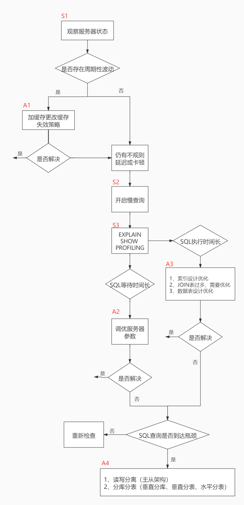

# 性能分析工具的使用

## 1. 数据库服务器的优化步骤

当我们遇到数据库调优问题的时候，该如何思考呢？这里把思考的流程整理成下面这张图。

整个流程划分成了观察（Show status）和行动（Action）两个部分。字母 S 的部分代表观察（会使用相应的分析工具），字母 A 代表的部分是行动（对应分析可以采取的行动）。



小结


## 2. 查看系统性能参数
在MySQL中，可以使用`SHOW STATUS`语句查询一些MySQL数据库服务器的`性能参数`、`执行频率`。

`SHOW [GLOBAL|SESSION] STATUS LIKE '参数';`

一些常用的性能参数如下：

- Connections：连接MySQL服务器的次数
- Uptime：MySQL服务器的上线时间
- Slow_queries：慢查询的次数
- Innodb_rows_read：Select查询返回的行数 
- Innodb_rows_inserted：执行INSERT操作插入的行数
- Innodb_rows_updated：执行UPDATE操作更新的行数
- Innodb_rows_deleted：执行DELETE操作删除的行数
- Com_select：查询操作的次数。
- Com_insert：插入操作的次数。对于批量插入的 INSERT 操作，只累加一次。
- Com_update：更新操作的次数。
- Com_delete：删除操作的次数。
## 3. 统计SQL的查询成本：last_query_cost
我们依然使用 student_info 表为例：

如果我们想要查询 id=900001 的记录，然后看下查询成本，我们可以直接在聚簇索引上进行查找：

`SELECT student_id, class_id, NAME, create_time FROM student_info WHERE id = 900001;`

然后再看下查询优化器的成本，实际上我们只需要检索一个页即可：
```sql
mysql> SHOW STATUS LIKE 'last_query_cost';
+-----------------+----------+
| Variable_name   | Value    |
+-----------------+----------+
| Last_query_cost | 1.000000 |
+-----------------+----------+
```
如果我们想要查询 id 在 900001 到 9000100 之间的学生记录呢？
```sql
SELECT student_id, class_id, NAME, create_time FROM student_info 
WHERE id BETWEEN 900001 AND 900100;

mysql> SHOW STATUS LIKE 'last_query_cost';
+-----------------+-----------+  
| Variable_name   | Value     |
+-----------------+-----------+
| Last_query_cost | 21.134453 |
+-----------------+-----------+
```
你能看到页的数量是刚才的 20 倍，但是查询的效率并没有明显的变化，实际上这两个 SQL 查询的时间基本上一样，就是因为采用了顺序读取的方式将页面一次性加载到缓冲池中，然后再进行查找。虽然`页数量（last_query_cost）增加了不少`，但是通过`缓冲池的机制`，并没有增加多少查询时间。

使用场景：它对于比较开销是非常有用的，特别是我们有好几种查询方式可选的时候。
## 4. 定位执行慢的 SQL：慢查询日志
### 4.1 开启慢查询日志参数
**1. 开启slow_query_log**

`set global slow_query_log='ON';`

然后我们再来查看下慢查询日志是否开启，以及慢查询日志文件的位置：
```sql
mysql> show variables like 'slow_query_log%';
+---------------------+---------------------------------+
| Variable_name       | Value                           |
+---------------------+---------------------------------+
| slow_query_log      | ON                              |
| slow_query_log_file | /var/lib/mysql/Manaphy-slow.log |
+---------------------+---------------------------------+
```
你能看到这时慢查询分析已经开启，同时文件保存在 `/var/lib/mysql/Manaphy-slow.log` 文件中。

**2. 修改long_query_time阈值**

接下来我们来看下慢查询的时间阈值设置，使用如下命令：
```sql
mysql> show variables like '%long_query_time%';
+-----------------+-----------+
| Variable_name   | Value     |
+-----------------+-----------+
| long_query_time | 10.000000 |
+-----------------+-----------+
```
这里如果我们想把时间缩短，比如设置为 1 秒，可以这样设置：
```sql
-- 测试发现：设置global的方式对当前session的long_query_time失效。对新连接的客户端有效。所以可以一并执行下述语句
mysql > set global long_query_time = 1; 
mysql> show global variables like '%long_query_time%';

mysql> set long_query_time=1;
mysql> show variables like '%long_query_time%';
```
### 4.2 查看慢查询数目
```sql
-- 查询当前系统中有多少条慢查询记录
SHOW GLOBAL STATUS LIKE '%Slow_queries%'; 
```
### 4.3 案例演示
```sql
-- 步骤1. 建表
CREATE TABLE `student` (
 `id` INT(11) NOT NULL AUTO_INCREMENT,
 `stuno` INT NOT NULL ,
 `name` VARCHAR(20) DEFAULT NULL,
 `age` INT(3) DEFAULT NULL,
 `classId` INT(11) DEFAULT NULL,
 PRIMARY KEY (`id`)
) ENGINE=INNODB AUTO_INCREMENT=1 DEFAULT CHARSET=utf8;

-- 步骤2：设置参数 log_bin_trust_function_creators
/* 创建函数，假如报错：This function has none of DETERMINISTIC...... */
-- 命令开启：允许创建函数设置：
set global log_bin_trust_function_creators=1;

-- 步骤3：创建函数
-- 产生随机字符串和产生随机数值(同上一章)

-- 步骤4：创建存储过程
DELIMITER //
CREATE PROCEDURE  insert_stu1(  START INT ,  max_num INT )
BEGIN  
DECLARE i INT DEFAULT 0;   
 SET autocommit = 0;    #设置手动提交事务
 REPEAT  #循环
 SET i = i + 1;  #赋值
 INSERT INTO student (stuno, NAME ,age ,classId ) VALUES 
((START+i),rand_string(6),rand_num(10,100),rand_num(10,1000));  
 UNTIL i = max_num  
 END REPEAT;  
 COMMIT;  #提交事务
END //
DELIMITER ;

-- 步骤5：调用存储过程
-- 调用刚刚写好的函数, 4000000条记录,从100001号开始

CALL insert_stu1(100001,4000000);
```
### 4.4 测试及分析
```sql
mysql> SELECT * FROM student WHERE stuno = 3455655;
+---------+---------+--------+------+---------+
| id      | stuno   | name   | age  | classId |
+---------+---------+--------+------+---------+
| 3523633 | 3455655 | oQmLUr |   19 |      39 |
+---------+---------+--------+------+---------+
1 row in set (2.09 sec)
mysql> SELECT * FROM student WHERE name = 'oQmLUr';
+---------+---------+--------+------+---------+
| id      | stuno   | name   | age  | classId |
+---------+---------+--------+------+---------+
| 1154002 | 1243200 | OQMlUR |  266 |      28 |
| 1405708 | 1437740 | OQMlUR |  245 |     439 |
| 1748070 | 1680092 | OQMlUR |  240 |     414 |
| 2119892 | 2051914 | oQmLUr |   17 |      32 |
| 2893154 | 2825176 | OQMlUR |  245 |     435 |
| 3523633 | 3455655 | oQmLUr |   19 |      39 |
+---------+---------+--------+------+---------+
```
从上面的结果可以看出来，查询学生编号为“3455655”的学生信息花费时间为2.09秒。查询学生姓名为“oQmLUr”的学生信息花费时间为2.39秒。已经达到了秒的数量级，说明目前查询效率是比较低的，下面的小节我们分析一下原因。

`show status like 'slow_queries';`
### 4.5 慢查询日志分析工具：mysqldumpslow
在生产环境中，如果要手工分析日志，查找、分析SQL，显然是个体力活，MySQL提供了日志分析工具 `mysqldumpslow`。
```bash
root@Manaphy:/# mysqldumpslow --help
Usage: mysqldumpslow [ OPTS... ] [ LOGS... ]

Parse and summarize the MySQL slow query log. Options are

  --verbose    verbose
  --debug      debug
  --help       write this text to standard output

  -v           verbose
  -d           debug
  -s ORDER     是表示按照何种方式排序：
                al: 平均锁定时间
                ar: 平均返回记录数
                at: 平均查询时间 （默认方式）
                 c: 访问次数
                 l: 锁定时间
                 r: 返回记录
                 t: 查询时间
  -r           reverse the sort order (largest last instead of first)
  -t NUM       即为返回前面多少条的数据；
  -a           不将数字抽象成N，字符串抽象成S
  -n NUM       abstract numbers with at least n digits within names
  -g PATTERN   后边搭配一个正则匹配模式，大小写不敏感的；
  -h HOSTNAME  hostname of db server for *-slow.log filename (can be wildcard),
               default is '*', i.e. match all
  -i NAME      name of server instance (if using mysql.server startup script)
  -l           don't subtract lock time from total time
```
举例：我们想要按照查询时间排序，查看前五条 SQL 语句，这样写即可：
```bash
[root@Manaphy ~]# mysqldumpslow -s t -t 5 /var/lib/mysql/Manaphy-slow.log

Reading mysql slow query log from /var/lib/mysql/Manaphy-slow.log
Count: 1  Time=2.39s (2s)  Lock=0.00s (0s)  Rows=13.0 (13), root[root]@localhost
  SELECT * FROM student WHERE name = 'S'

Count: 1  Time=2.09s (2s)  Lock=0.00s (0s)  Rows=2.0 (2), root[root]@localhost
  SELECT * FROM student WHERE stuno = N

Died at /usr/bin/mysqldumpslow line 162, <> chunk 2.
```
**工作常用参考：**
```bash
-- 得到返回记录集最多的10个SQL
mysqldumpslow -s r -t 10 /var/lib/mysql/Manaphy-slow.log

-- 得到访问次数最多的10个SQL
mysqldumpslow -s c -t 10 /var/lib/mysql/Manaphy-slow.log

-- 得到按照时间排序的前10条里面含有左连接的查询语句
mysqldumpslow -s t -t 10 -g "left join" /var/lib/mysql/Manaphy-slow.log

-- 另外建议在使用这些命令时结合 | 和more 使用 ，否则有可能出现爆屏情况
mysqldumpslow -s r -t 10 /var/lib/mysql/Manaphy-slow.log | more
```
## 5. 查看 SQL 执行成本：SHOW PROFILE
```sql
-- 查看 show profile 是否开启
show variables like 'profiling';
-- 开启 show profile
set profiling = 'ON';
-- 查看当前会话都有哪些 profiles
show profiles;
-- 查看最近一次查询的开销
show profile;
show profile cpu,block io for query 2;
```
**show profile的常用查询参数：**

① ALL：显示所有的开销信息。 

② BLOCK IO：显示块IO开销。 

③ CONTEXT SWITCHES：上下文切换开销。 

④ CPU：显示CPU开销信息。 

⑤ IPC：显示发送和接收开销信息。 

⑥ MEMORY：显示内存开销信息。 

⑦ PAGE FAULTS：显示页面错误开销信息。 

⑧ SOURCE：显示和Source_function，Source_file，Source_line相关的开销信息。 

⑨ SWAPS：显示交换次数开销信息。
## 6. 分析查询语句：EXPLAIN
**官网介绍**

[https://dev.mysql.com/doc/refman/5.7/en/explain-output.html](https://dev.mysql.com/doc/refman/5.7/en/explain-output.html)

[https://dev.mysql.com/doc/refman/8.0/en/explain-output.html](https://dev.mysql.com/doc/refman/8.0/en/explain-output.html)

**版本情况**

- MySQL 5.6.3以前只能`EXPLAIN SELECT`；MYSQL 5.6.3以后就可以`EXPLAIN SELECT，UPDATE，DELETE`
- 在5.7以前的版本中，想要显示`partitions `需要使用`explain partitions` 命令；想要显示`filtered`需要使用`explain extended`命令。在5.7版本后，默认explain直接显示partitions和filtered中的信息。
### 6.1 基本语法
EXPLAIN 或 DESCRIBE语句的语法形式如下：
```sql
EXPLAIN SELECT select_options
或者
DESCRIBE SELECT select_options
```
如果我们想看看某个查询的执行计划的话，可以在具体的查询语句前边加一个EXPLAIN ，就像这样：

`EXPLAIN SELECT 1;`

EXPLAIN 语句输出的各个列的作用如下：

| **列名** | **描述** |
| :-- | :-- |
| id | 在一个大的查询语句中每个SELECT关键字都对应一个`唯一的id` |
| select_type | SELECT关键字对应的那个查询的类型 |
| table | 表名 |
| partitions | 匹配的分区信息 |
| type | 针对单表的访问方法 |
| possible_keys | 可能用到的索引 |
| key | 实际上使用的索引 |
| key_len | 实际使用到的索引长度 |
| ref | 当使用索引列等值查询时，与索引列进行等值匹配的对象信息 |
| rows | 预估的需要读取的记录条数 |
| filtered | 某个表经过搜索条件过滤后剩余记录条数的百分比 |
| Extra | 一些额外的信息 |

### 6.2 数据准备
```sql
CREATE TABLE `s1` (
  `id` int NOT NULL AUTO_INCREMENT,
  `key1` varchar(100) DEFAULT NULL,
  `key2` int DEFAULT NULL,
  `key3` varchar(255)  DEFAULT NULL,
  `key_part1` varchar(100)  DEFAULT NULL,
  `key_part2` varchar(100)  DEFAULT NULL,
  `key_part3` varchar(100)  DEFAULT NULL,
  `common_field` varchar(100)  DEFAULT NULL,
  PRIMARY KEY (`id`) USING BTREE,
  UNIQUE KEY `idx_key2` (`key2`) USING BTREE,
  KEY `idx_key1` (`key1`) USING BTREE,
  KEY `idx_key3` (`key3`) USING BTREE,
  KEY `idx_key_part` (`key_part1`,`key_part2`,`key_part3`) USING BTREE
) ENGINE=InnoDB CHARSET=utf8;

CREATE TABLE `s2` (
  `id` int NOT NULL AUTO_INCREMENT,
  `key1` varchar(100) DEFAULT NULL,
  `key2` int DEFAULT NULL,
  `key3` varchar(255)  DEFAULT NULL,
  `key_part1` varchar(100)  DEFAULT NULL,
  `key_part2` varchar(100)  DEFAULT NULL,
  `key_part3` varchar(100)  DEFAULT NULL,
  `common_field` varchar(100)  DEFAULT NULL,
  PRIMARY KEY (`id`) USING BTREE,
  UNIQUE KEY `idx_key2` (`key2`) USING BTREE,
  KEY `idx_key1` (`key1`) USING BTREE,
  KEY `idx_key3` (`key3`) USING BTREE,
  KEY `idx_key_part` (`key_part1`,`key_part2`,`key_part3`) USING BTREE
) ENGINE=InnoDB CHARSET=utf8;

--  创建函数
DELIMITER //
CREATE FUNCTION rand_string1(n INT) 
    RETURNS VARCHAR(255) #该函数会返回一个字符串
BEGIN 
    DECLARE chars_str VARCHAR(100) DEFAULT 'abcdefghijklmnopqrstuvwxyzABCDEFJHIJKLMNOPQRSTUVWXYZ';
    DECLARE return_str VARCHAR(255) DEFAULT '';
    DECLARE i INT DEFAULT 0;
    WHILE i < n DO
        SET return_str =CONCAT(return_str,SUBSTRING(chars_str,FLOOR(1+RAND()*52),1));
        SET i = i + 1;
    END WHILE;
    RETURN return_str;
END //
DELIMITER ;

-- 创建存储过程
-- 创建往s1表中插入数据的存储过程：
DELIMITER //
CREATE PROCEDURE insert_s1 (IN min_num INT (10),IN max_num INT (10))
BEGIN
    DECLARE i INT DEFAULT 0;
    SET autocommit = 0;
    REPEAT
    SET i = i + 1;
    INSERT INTO s1 VALUES(
    (min_num + i),
    rand_string1(6),
    (min_num + 30 * i + 5),
    rand_string1(6),
    rand_string1(10),
    rand_string1(5),
    rand_string1(10),
    rand_string1(10));
    UNTIL i = max_num
    END REPEAT;
    COMMIT;
END //
DELIMITER ;

-- 创建往s2表中插入数据的存储过程：
DELIMITER //
CREATE PROCEDURE insert_s2 (IN min_num INT (10),IN max_num INT (10))
BEGIN
    DECLARE i INT DEFAULT 0;
    SET autocommit = 0;
    REPEAT
    SET i = i + 1;
    INSERT INTO s2 VALUES(
        (min_num + i),
        rand_string1(6),
        (min_num + 30 * i + 5),
        rand_string1(6),
        rand_string1(10),
        rand_string1(5),
        rand_string1(10),
        rand_string1(10));
    UNTIL i = max_num
    END REPEAT;
    COMMIT;
END //
DELIMITER ;

-- 调用存储过程
CALL insert_s1(10001,10000);
CALL insert_s2(10001,10000);
```
### 6.3 EXPLAIN各列作用
**1. table**
> 显示这一行的数据是关于哪张表的

不论我们的查询语句有多复杂，里边儿`包含了多少个表`，到最后也是需要对每个表进行`单表访问`的，所以MySQL规定**EXPLAIN语句输出的每条记录都对应着某个单表的访问方法**，该条记录的table列代表着该表的表名（有时不是真实的表名字，可能是简称）。

**2. id**
> id说明每个对象(表)的执行顺序,id越大执行越早,id越小执行越晚,id一样的按照顺序从前到后执行

我们写的查询语句一般都以SELECT 关键字开头，比较简单的查询语句里只有一个SELECT 关键字，比如下边这个查询语句：

`SELECT * FROM s1 WHERE key1 = 'a';`

稍微复杂一点的连接查询中也只有一个SELECT 关键字，比如：
```sql
SELECT * FROM s1 INNER JOIN s2
ON s1.key1 = s2.key1
WHERE s1.common_field = 'a';
```
```sql
mysql> EXPLAIN SELECT * FROM s1 WHERE key1 = 'a';
+----+-------------+-------+------------+------+---------------+----------+---------+-------+------+----------+-------+
| id | select_type | table | partitions | type | possible_keys | key      | key_len | ref   | rows | filtered | Extra |
+----+-------------+-------+------------+------+---------------+----------+---------+-------+------+----------+-------+
|  1 | SIMPLE      | s1    | NULL       | ref  | idx_key1      | idx_key1 | 303     | const |    1 |   100.00 | NULL  |
+----+-------------+-------+------------+------+---------------+----------+---------+-------+------+----------+-------+

mysql> EXPLAIN SELECT * FROM s1 INNER JOIN s2;
+----+-------------+-------+------------+------+---------------+------+---------+------+------+----------+-------------------------------+
| id | select_type | table | partitions | type | possible_keys | key  | key_len | ref  | rows | filtered | Extra                         |
+----+-------------+-------+------------+------+---------------+------+---------+------+------+----------+-------------------------------+
|  1 | SIMPLE      | s1    | NULL       | ALL  | NULL          | NULL | NULL    | NULL | 9895 |   100.00 | NULL                          |
|  1 | SIMPLE      | s2    | NULL       | ALL  | NULL          | NULL | NULL    | NULL | 9895 |   100.00 | Using join buffer (hash join) |
+----+-------------+-------+------------+------+---------------+------+---------+------+------+----------+-------------------------------+

mysql> EXPLAIN SELECT * FROM s1 WHERE key1 IN (SELECT key1 FROM s2) OR key3 = 'a';
+----+-------------+-------+------------+-------+---------------+----------+---------+------+------+----------+-------------+
| id | select_type | table | partitions | type  | possible_keys | key      | key_len | ref  | rows | filtered | Extra       |
+----+-------------+-------+------------+-------+---------------+----------+---------+------+------+----------+-------------+
|  1 | PRIMARY     | s1    | NULL       | ALL   | idx_key3      | NULL     | NULL    | NULL | 9895 |   100.00 | Using where |
|  2 | SUBQUERY    | s2    | NULL       | index | idx_key1      | idx_key1 | 303     | NULL | 9895 |   100.00 | Using index |
+----+-------------+-------+------------+-------+---------------+----------+---------+------+------+----------+-------------+

mysql> EXPLAIN SELECT * FROM s1 WHERE key1 IN (SELECT key2 FROM s2 WHERE common_field = 'a');
+----+-------------+-------+------------+--------+---------------+----------+---------+--------------+------+----------+------------------------------------+
| id | select_type | table | partitions | type   | possible_keys | key      | key_len | ref          | rows | filtered | Extra                              |
+----+-------------+-------+------------+--------+---------------+----------+---------+--------------+------+----------+------------------------------------+
|  1 | SIMPLE      | s1    | NULL       | ALL    | idx_key1      | NULL     | NULL    | NULL         | 9895 |   100.00 | Using where                        |
|  1 | SIMPLE      | s2    | NULL       | eq_ref | idx_key2      | idx_key2 | 5       | test.s1.key1 |    1 |    10.00 | Using index condition; Using where |
+----+-------------+-------+------------+--------+---------------+----------+---------+--------------+------+----------+------------------------------------+

mysql> EXPLAIN SELECT * FROM s1 UNION SELECT * FROM s2;
+----+--------------+------------+------------+------+---------------+------+---------+------+------+----------+-----------------+
| id | select_type  | table      | partitions | type | possible_keys | key  | key_len | ref  | rows | filtered | Extra           |
+----+--------------+------------+------------+------+---------------+------+---------+------+------+----------+-----------------+
|  1 | PRIMARY      | s1         | NULL       | ALL  | NULL          | NULL | NULL    | NULL | 9895 |   100.00 | NULL            |
|  2 | UNION        | s2         | NULL       | ALL  | NULL          | NULL | NULL    | NULL | 9895 |   100.00 | NULL            |
|NULL| UNION RESULT | <union1,2> | NULL       | ALL  | NULL          | NULL | NULL    | NULL | NULL |     NULL | Using temporary |
+----+--------------+------------+------------+------+---------------+------+---------+------+------+----------+-----------------+

mysql> EXPLAIN SELECT * FROM s1 UNION ALL SELECT * FROM s2;
+----+-------------+-------+------------+------+---------------+------+---------+------+------+----------+-------+
| id | select_type | table | partitions | type | possible_keys | key  | key_len | ref  | rows | filtered | Extra |
+----+-------------+-------+------------+------+---------------+------+---------+------+------+----------+-------+
|  1 | PRIMARY     | s1    | NULL       | ALL  | NULL          | NULL | NULL    | NULL | 9895 |   100.00 | NULL  |
|  2 | UNION       | s2    | NULL       | ALL  | NULL          | NULL | NULL    | NULL | 9895 |   100.00 | NULL  |
+----+-------------+-------+------------+------+---------------+------+---------+------+------+----------+-------+
```
**小结:**

- id如果相同，可以认为是一组，从上往下顺序执行 
- 在所有组中，id值越大，优先级越高，越先执行 
- 关注点：id号每个号码，表示一趟独立的查询, 一个sql的查询趟数越少越好

**3. select_type**
> 查询的类型

| **名称** | **描述** |
| :-- | :-- |
| **SIMPLE** | 表示不需要union操作或者不包含子查询的简单select查询。有连接查询时，外层的查询为simple，且只有一个。 |
| **PRIMARY** | 一个需要union操作或者含有子查询的select，位于最外层的单位查询的select_type即为primary。且只有一个。 |
| **UNION** | union连接的select查询，除了第一个表外，第二个及以后的表select_type都是union。 |
| **UNION RESULT** | 包含union的结果集，在union和union all语句中,因为它不需要参与查询，所以id字段为null |
| **SUBQUERY** | 除了from字句中包含的子查询外，其他地方出现的子查询都可能是subquery |
| **DEPENDENT SUBQUERY** | 相关子查询(可能会被执行多次) |
| **DEPENDENT UNION** | 与union一样，出现在union 或union all语句中，但是这个查询要受到外部查询的影响 |
| **DERIVED** | from字句中出现的子查询 |
| **MATERIALIZED** | 被物化的子查询 |
| **UNCACHEABLE SUBQUERY** | 对于外层的主表，子查询不可被物化，每次都需要计算（耗时操作） |
| **UNCACHEABLE UNION** | UNION操作中，内层的不可被物化的子查询（类似于UNCACHEABLE SUBQUERY） |

具体分析如下:
```sql
-- SIMPLE
EXPLAIN SELECT * FROM s1;
EXPLAIN SELECT * FROM s1 INNER JOIN s2;
-- PRIMARY
EXPLAIN SELECT * FROM s1 UNION SELECT * FROM s2;
-- SUBQUERY
EXPLAIN SELECT * FROM s1 WHERE key1 IN (SELECT key1 FROM s2) OR key3 = 'a';
-- DEPENDENT SUBQUERY
EXPLAIN SELECT * FROM s1 WHERE key1 IN (SELECT key1 FROM s2 WHERE s1.key2 = s2.key2) OR key3 = 'a';
-- DEPENDENT UNION
EXPLAIN SELECT * FROM s1 WHERE key1 IN (SELECT key1 FROM s2 WHERE key1 = 'a' UNION SELECT key1 FROM s1 WHERE key1 = 'b');
-- DERIVED
EXPLAIN SELECT * FROM (SELECT key1, count(*) as c FROM s1 GROUP BY key1) AS derived_s1 where c > 1;
-- MATERIALIZED
EXPLAIN SELECT * FROM s1 WHERE key1 IN (SELECT key1 FROM s2);
```
**4. partitions**
> 该列显示的为分区表命中的分区情况。非分区表该字段为空（null）。

**5. type \***

> 显示查询索引使用的是何种类型(从上到下依次变差)

完整的访问方法如下：`system`，`const`，`eq_ref`，`ref`，`fulltext`，`ref_or_null`，`index_merge`，`unique_subquery`， `index_subquery`，`range`，`index`，`ALL`。

| **类型** | **说明** |
| :-- | :-- |
| **system** | 表中只有一行数据或者是空表，且只能用于myisam和memory表。如果是Innodb引擎表，type列在这个情况通常都是all或者index |
| **const** | 使用唯一索引或者主键，返回记录一定是1行记录的等值where条件时，通常type是const。其他数据库也叫做唯一索引扫描 |
| **eq_ref** | 出现在要连接过个表的查询计划中，驱动表只返回一行数据，且这行数据是第二个表的主键或者唯一索引，且必须为not null，唯一索引和主键是多列时，只有所有的列都用作比较时才会出现eq_ref |
| **ref** | 不像eq_ref那样要求连接顺序，也没有主键和唯一索引的要求，只要使用相等条件检索时就可能出现，常见与辅助索引的等值查找。或者多列主键、唯一索引中，使用第一个列之外的列作为等值查找也会出现，总之，返回数据不唯一的等值查找就可能出现。 |
| **fulltext** | 全文索引检索，要注意，全文索引的优先级很高，若全文索引和普通索引同时存在时，mysql不管代价，优先选择使用全文索引 |
| **ref_or_null** | 与ref方法类似，只是增加了null值的比较。实际用的不多。 |
| **index_merge** | 表示查询使用了两个以上的索引，最后取交集或者并集，常见and ，or的条件使用了不同的索引，官方排序这个在ref_or_null之后，但是实际上由于要读取所个索引，性能可能大部分时间都不如range |
| **unique_subquery** | 用于where中的in形式子查询，子查询返回不重复值唯一值 |
| **index_subquery** | 用于in形式子查询使用到了辅助索引或者in常数列表，子查询可能返回重复值，可以使用索引将子查询去重。 |
| **range** | 索引范围扫描，常见于使用 =, <>, >, >=, <, <=, IS NULL, <=>, BETWEEN, IN()或者like等运算符的查询中。 |
| **index** | 索引全表扫描，把索引从头到尾扫一遍，常见于使用索引列就可以处理不需要读取数据文件的查询、可以使用索引排序或者分组的查询。 |
| **all** | 这个就是全表扫描数据文件，然后再在server层进行过滤返回符合要求的记录。 |

```sql
-- system
CREATE TABLE t(i int) Engine=MyISAM;
INSERT INTO t VALUES(1);
EXPLAIN SELECT * FROM t;

-- const
EXPLAIN SELECT * FROM s1 WHERE id = 10005;

-- eq_ref
EXPLAIN SELECT * FROM s1 INNER JOIN s2 ON s1.id = s2.id;
#从执行计划的结果中可以看出，MySQL打算将s2作为驱动表，s1作为被驱动表，
#重点关注s1的访问方法是 eq_ref ，表明在访问s1表的时候可以 通过主键的等值匹配 来进行访问。

-- ref
EXPLAIN SELECT * FROM s1 WHERE key1 = 'a';

-- fulltext

-- ref_or_null
EXPLAIN SELECT * FROM s1 WHERE key1 = 'a' OR key1 IS NULL;

-- index_merge
EXPLAIN SELECT * FROM s1 WHERE key1 = 'a' OR key3 = 'a';
#从执行计划的 type 列的值是 index_merge 就可以看出,
#MySQL 打算使用索引合并的方式来执行 对 s1 表的查询。

-- unique_subquery
EXPLAIN SELECT * FROM s1 WHERE key2 IN (SELECT id FROM s2 where s1.key1 = s2.key1) OR key3 = 'a';

-- index_subquery
EXPLAIN SELECT * FROM s1 WHERE common_field IN (SELECT key3 FROM s2 where s1.key1 = s2.key1) OR key3 = 'a';

-- range
EXPLAIN SELECT * FROM s1 WHERE key1 IN ('a', 'b', 'c');
EXPLAIN SELECT * FROM s1 WHERE key1 > 'a' AND key1 < 'b';

-- index
EXPLAIN SELECT key_part2 FROM s1 WHERE key_part3 = 'a';

-- ALL
EXPLAIN SELECT * FROM s1;
```
**小结：**

结果值从最好到最坏依次是： system > const > eq_ref > ref > fulltext > ref_or_null > index_merge > unique_subquery > index_subquery > range > index > ALL 其中比较重要的几个提取出来（蓝色）。SQL 性能优化的目标：至少要达到 range 级别，要求是 ref 级别，最好是 consts级别。（阿里巴巴 开发手册要求）

**6. possible_keys和key**
> possible_keys: 查询可能使用到的索引都会在这里列出来
> key: 查询真正使用到的索引，select_type为index_merge时，这里可能出现两个以上的索引，其他的select_type这里只会出现一个。

```sql
EXPLAIN SELECT * FROM s1 WHERE key1 > 'z' AND key3 = 'a';
```
**7. key_len \***

> 帮你检查是否充分的利用上了索引 值越大越好 主要针对联合索引,有一定的参考意义

```sql
EXPLAIN SELECT * FROM s1 WHERE id = 10005; -- 4
EXPLAIN SELECT * FROM s1 WHERE key2 = 10126; -- 5
EXPLAIN SELECT * FROM s1 WHERE key1 = 'a'; -- 303
EXPLAIN SELECT * FROM s1 WHERE key_part1 = 'a'; -- 303
EXPLAIN SELECT * FROM s1 WHERE key_part1 = 'a' AND key_part2 = 'b'; -- 606
```
key_len的长度计算公式：
```
varchar(10)变长字段且允许NULL=10*(character set：utf8=3,gbk=2,latin1=1)+1(NULL)+2(变长字段)

varchar(10)变长字段且不允许NULL=10*(character set：utf8=3,gbk=2,latin1=1)+2(变长字段)

char(10)固定字段且允许NULL=10*(character set：utf8=3,gbk=2,latin1=1)+1(NULL)

char(10)固定字段且不允许NULL=10*(character set：utf8=3,gbk=2,latin1=1)
```
**8. ref**
> 如果是使用的常数等值查询，这里会显示const，如果是连接查询，被驱动表的执行计划这里会显示驱动表的关联字段，如果是条件使用了表达式或者函数，或者条件列发生了内部隐式转换，这里可能显示为func

```sql
EXPLAIN SELECT * FROM s1 WHERE key1 = 'a';
EXPLAIN SELECT * FROM s1 INNER JOIN s2 ON s1.id = s2.id;
EXPLAIN SELECT * FROM s1 INNER JOIN s2 ON s2.key1 = UPPER(s1.key1);
```
**9. rows \***

> 这里是执行计划中估算的扫描行数，不是精确值，越小越好

```sql
EXPLAIN SELECT * FROM s1 WHERE key1 > 'z';
```
**10. filtered**
> 这个字段表示存储引擎返回的数据在server层过滤后，剩下多少满足查询的记录数量的比例，注意是百分比，不是具体记录数。

```sql
EXPLAIN SELECT * FROM s1 WHERE key1 > 'z' AND common_field = 'a';
EXPLAIN SELECT * FROM s1 INNER JOIN s2 ON s1.key1 = s2.key1 WHERE s1.common_field = 'a';
```
**11. Extra \***

| **类型** | **说明** |
| :-- | :-- |
| distinct | 在select部分使用了distinct键字 |
| using filesort | 排序时无法使用到索引时，就会出现这个。常见于order by和group by语句中 |
| using index | 查询时不需要回表查询，直接通过索引就可以获取查询的数据。 |
| using union | 表示使用or连接各个使用索引的条件时，该信息表示从处理结果获取并集 |
| using intersect | 表示使用and的各个索引的条件时，该信息表示是从处理结果获取交集 |
| using temporary | 表示使用了临时表存储中间结果。临时表可以是内存临时表和磁盘临时表，执行计划中看不出来，需要查看status变量，used_tmp_table，used_tmp_disk_table才能看出来。 |
| using index condition | 表示使用了索引下推 |
| using where | 表示存储引擎返回的记录并不是所有的都满足查询条件，需要在server层进行过滤。 |
| firstmatch(tb_name) | 5.6.x开始引入的优化子查询的新特性之一，常见于where字句含有in()类型的子查询。如果内表的数据量比较大，就可能出现这个 |
| loosescan(m..n) | 5.6.x之后引入的优化子查询的新特性之一，在in()类型的子查询中，子查询返回的可能有重复记录时，就可能出现这个 |

```sql
-- No tables used (当查询语句没有from子句时将会提示该额外信息)
EXPLAIN SELECT 1;

-- Impossible WHERE(查询语句的where子句永远为false时将会提示该额外信息)
EXPLAIN SELECT * FROM s1 WHERE 1 != 1;

-- Using where
EXPLAIN SELECT * FROM s1 WHERE common_field = 'a';
EXPLAIN SELECT * FROM s1 WHERE key1 = 'a' AND common_field = 'a';

-- No matching min/max row (当查询列表处有min或max聚合函数,但没有符合where子句中的搜索条件)
EXPLAIN SELECT MIN(key1) FROM s1 WHERE key1 = 'abcdefg';

-- Using index
EXPLAIN SELECT key1 FROM s1 WHERE key1 = 'a';

-- Using index condition
EXPLAIN SELECT * FROM s1 WHERE key1 > 'z' AND key1 LIKE '%b';

-- Using join buffer (Block Nested Loop)
EXPLAIN SELECT * FROM s1 INNER JOIN s2 ON s1.common_field = s2.common_field;

-- Not exists
EXPLAIN SELECT * FROM s1 LEFT JOIN s2 ON s1.key1 = s2.key1 WHERE s2.id IS NULL;
-- Using intersect(...) 、 Using union(...) 和 Using sort_union(...)
EXPLAIN SELECT * FROM s1 WHERE key1 = 'a' OR key3 = 'a';
-- Zero limit
EXPLAIN SELECT * FROM s1 LIMIT 0;
-- Using filesort
EXPLAIN SELECT * FROM s1 ORDER BY key1 LIMIT 10;
EXPLAIN SELECT * FROM s1 ORDER BY common_field LIMIT 10;
-- Using temporary
EXPLAIN SELECT DISTINCT common_field FROM s1;
EXPLAIN SELECT common_field, COUNT(*) AS amount FROM s1 GROUP BY common_field;
EXPLAIN SELECT key1, COUNT(*) AS amount FROM s1 GROUP BY key1;
#从 Extra 的 Using index 的提示里我们可以看出，
#上述查询只需要扫描 idx_key1 索引就可以搞定了，不再需要临时表了。
```
**12. 小结**

- EXPLAIN不考虑各种Cache 
- EXPLAIN不能显示MySQL在执行查询时所作的优化工作 
- EXPLAIN不会告诉你关于触发器、存储过程的信息或用户自定义函数对查询的影响情况 
- 部分统计信息是估算的，并非精确值
## 7. EXPLAIN的进一步使用
### 7.1 EXPLAIN四种输出格式
这里谈谈EXPLAIN的输出格式。EXPLAIN可以输出四种格式： `传统格式` ， `JSON格式` ， `TREE格式` 以及 `可视化输出` 。用户可以根据需要选择适用于自己的格式。
#### 1. 传统格式
传统格式简单明了，输出是一个表格形式，概要说明查询计划。
```sql
mysql> EXPLAIN SELECT s1.key1, s2.key1 FROM s1 LEFT JOIN s2 ON s1.key1 = s2.key1 WHERE s2.common_field IS NOT NULL;
+----+-------------+-------+------------+------+---------------+----------+---------+--------------+------+----------+-------------+
| id | select_type | table | partitions | type | possible_keys | key      | key_len | ref          | rows | filtered | Extra       |
+----+-------------+-------+------------+------+---------------+----------+---------+--------------+------+----------+-------------+
|  1 | SIMPLE      | s2    | NULL       | ALL  | idx_key1      | NULL     | NULL    | NULL         | 9895 |    90.00 | Using where |
|  1 | SIMPLE      | s1    | NULL       | ref  | idx_key1      | idx_key1 | 303     | test.s2.key1 |    1 |   100.00 | Using index |
+----+-------------+-------+------------+------+---------------+----------+---------+--------------+------+----------+-------------+
```
#### 2. JSON格式
JSON格式：在EXPLAIN单词和真正的查询语句中间加上 `FORMAT=JSON` 。

`EXPLAIN FORMAT=JSON SELECT ....`

我们使用 # 后边跟随注释的形式为大家解释了 `EXPLAIN FORMAT=JSON` 语句的输出内容，但是大家可能 有疑问 `"cost_info"` 里边的成本看着怪怪的，它们是怎么计算出来的？先看 `s1` 表的 `"cost_info"` 部 分：
```json
"cost_info": { 
  "read_cost": "1840.84", 
  "eval_cost": "193.76", 
  "prefix_cost": "2034.60", 
  "data_read_per_join": "1M" 
}
```

-  `read_cost` 是由下边这两部分组成的：
   - IO 成本 
   - 检测 rows × (1 - filter) 条记录的 CPU 成本
> 小贴士： rows和filter都是我们前边介绍执行计划的输出列，在JSON格式的执行计划中，rows 相当于		rows_examined_per_scan，filtered名称不变。

- eval_cost 是这样计算的： 检测 rows × filter 条记录的成本。 
- prefix_cost 就是单独查询 s1 表的成本，也就是： read_cost + eval_cost 
- data_read_per_join 表示在此次查询中需要读取的数据量。

对于 `s2` 表的 `"cost_info"` 部分是这样的：
```json
"cost_info": { 
  "read_cost": "968.80", 
  "eval_cost": "193.76", 
  "prefix_cost": "3197.16", 
  "data_read_per_join": "1M" 
}
```
由于 `s2` 表是被驱动表，所以可能被读取多次，这里的 `read_cost` 和 `eval_cost` 是访问多次 `s2` 表后累加起来的值，大家主要关注里边儿的 `prefix_cost` 的值代表的是整个连接查询预计的成本，也就是单 次查询 `s1` 表和多次查询 `s2` 表后的成本的和，也就是：

`968.80 + 193.76 + 2034.60 = 3197.16`
#### 3. TREE格式
TREE格式是8.0.16版本之后引入的新格式，主要根据查询的`各个部分之间的关系`和`各部分的执行顺序`来描述如何查询。
```sql
mysql> EXPLAIN FORMAT=tree SELECT * FROM s1 INNER JOIN s2 ON s1.key1 = s2.key2 WHERE s1.common_field = 'a'\G
*************************** 1. row ***************************
EXPLAIN: -> Nested loop inner join  (cost=2174.95 rows=990)
    -> Filter: ((s1.common_field = 'a') and (s1.key1 is not null))  (cost=1086.50 rows=990)
        -> Table scan on s1  (cost=1086.50 rows=9895)
    -> Single-row index lookup on s2 using idx_key2 (key2=s1.key1), with index condition: (cast(s1.key1 as double) = cast(s2.key2 as double))  (cost=1.00 rows=1)
```
### 7.2 SHOW WARNINGS的使用
```sql
mysql> EXPLAIN SELECT s1.key1, s2.key1 FROM s1 LEFT JOIN s2 ON s1.key1 = s2.key1 WHERE s2.common_field IS NOT NULL;
+----+-------------+-------+------------+------+---------------+----------+---------+--------------+------+----------+-------------+
| id | select_type | table | partitions | type | possible_keys | key      | key_len | ref          | rows | filtered | Extra       |
+----+-------------+-------+------------+------+---------------+----------+---------+--------------+------+----------+-------------+
|  1 | SIMPLE      | s2    | NULL       | ALL  | idx_key1      | NULL     | NULL    | NULL         | 9895 |    90.00 | Using where |
|  1 | SIMPLE      | s1    | NULL       | ref  | idx_key1      | idx_key1 | 303     | test.s2.key1 |    1 |   100.00 | Using index |
+----+-------------+-------+------------+------+---------------+----------+---------+--------------+------+----------+-------------+

mysql> SHOW WARNINGS\G
*************************** 1. row ***************************
  Level: Note
   Code: 1003
Message: /* select#1 */ select `test`.`s1`.`key1` AS `key1`,`test`.`s2`.`key1` AS `key1` from `test`.`s1` join `test`.`s2` where ((`test`.`s1`.`key1` = `test`.`s2`.`key1`) and (`test`.`s2`.`common_field` is not null))
```
## 8. 分析优化器执行计划：trace
```sql
SET optimizer_trace="enabled=on",end_markers_in_json=on;

set optimizer_trace_max_mem_size=1000000;
```
开启后，可分析如下语句：

- SELECT 
- INSERT 
- REPLACE 
- UPDATE 
- DELETE 
- EXPLAIN 
- SET 
- DECLARE 
- CASE 
- IF 
- RETURN 
- CALL

测试：执行如下SQL语句

`select * from student where id < 10;`

最后， 查询 information_schema.optimizer_trace 就可以知道MySQL是如何执行SQL的 ：
```sql
select * from information_schema.optimizer_trace\G
```
