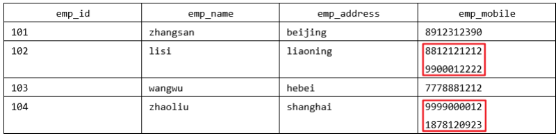

# 数据库的设计规范及调优策略

## 1. 范 式

> **在关系型数据库中，关于数据表设计的基本原则、规则就称为范式。** 可以理解为，一张数据表的设计结构需要满足的某种设计标准的级别。要想设计一个结构合理的关系型数据库，必须满足一定的范式。

目前关系型数据库有六种常见范式，按照范式级别，从低到高分别是：**第一范式（1NF）、第二范式（2NF）、第三范式（3NF）、巴斯-科德范式（BCNF）、第四范式(4NF）和第五范式（5NF，又称完美范式）**。


### 键和相关属性的概念
范式的定义会使用到主键和候选键，数据库中的键(Key) 由一个或者多个属性组成。数据表中常用的几种键和属性的定义:

- `超键`：能唯一标识元组的属性集叫做超键。
- `候选键`：如果超键不包括多余的属性，那么这个超键就是候选键。
- `主键`：用户可以从候选键中选择一 个作为主键。
- `外键`：如果数据表R1中的某属性集不是R1的主键，而是另一个数据表R2的主键，那么这个属性集就是数据表R1的外键。
- `主属性`：包含在任- -候选键中的属性称为主属性。
- `非主属性`：与主属性相对，指的是不包含在任何一一个候选键中的属性。

通常，我们也将候选键称之为“`码`”，把主键也称为“`主码`”。因为键可能是由多个属性组成的，针对单个属性，我

们还可以用主属性和非主属性来进行区分。

**举例：**

这里有两个表：

`球员表(player)`：球员编号 | 姓名 | 身份证号 | 年龄 | 球队编号

`球队表(team)`：球队编号 | 主教练 | 球队所在地

- `超键`：对于球员表来说，超键就是包括球员编号或者身份证号的任意组合，比如（球员编号）（球员编号，姓名）（身份证号，年龄）等。
- `候选键`：就是最小的超键，对于球员表来说，候选键就是（球员编号）或者（身份证号）。
- `主键`：我们自己选定，也就是从候选键中选择一个，比如（球员编号）。
- `外键`：球员表中的球队编号。
- `主属性、非主属性`：在球员表中，主属性是（球员编号）（身份证号），其他的属性（姓名）（年龄）（球队编号）都是非主属性。
### 第一范式(1st NF)
第一范式主要是确保数据表中每个字段的值必须具有`原子性`，也就是说数据表中每个字段的值为`不可再次拆分`的最小数据单元。

我们在设计某个字段的时候，对于字段X来说，不能把字段X拆分成字段X-1和字段X-2。事实上,任何的DBMS都会满足第一范式的要求， 不会将字段进行拆分。

**举例1：**

假设一家公司要存储员工的姓名和联系方式。它创建一个如下表：



该表不符合 1NF ，因为规则说“表的每个属性必须具有原子（单个）值”，lisi和zhaoliu员工的emp_mobile 值违反了该规则。为了使表符合 1NF ，我们应该有如下表数据：


**举例2：**

user 表的设计不符合第一范式

| **字段名称** | **字段类型** | **是否是主键** | **说明** |
| :-- | :-- | :-- | :-- |
| id | INT | 是 | 主键id |
| username | VARCHAR(30) | 否 | 用户名 |
| password | VARCHAR(50) | 否 | 密码 |
| user_info | VARCHAR(255) | 否 | 用户信息 |

其中，user_info字段为用户信息，可以进一步拆分成更小粒度的字段，不符合数据库设计对第一范式的要求。将user_info拆分后如下：

| **字段名称** | **字段类型** | **是否是主键** | **说明** |
| :-- | :-- | :-- | :-- |
| id | INT | 是 | 主键id |
| username | VARCHAR(30) | 否 | 用户名 |
| password | VARCHAR(50) | 否 | 密码 |
| real_name | VARCHAR(30) | 否 | 真实姓名 |
| phone | VARCHAR(12) | 否 | 联系电话 |
| address | VARCHAR(100) | 否 | 家庭住址 |

举例3：

属性的原子性是`主观的`。例如，employee关系中雇员姓名应当使用1个（fullname）、2个（firstname和lastname）还是3个（firstname、middlename和lastname）属性表示呢？答案取决于应用程序。如果应用程序需要分别处理雇员的姓名部分（如：用于搜索目的），则有必要把它们分开。否则，不需要。

表1

| **姓名** | **年龄** | **地址** |
| :-- | :-- | :-- |
| 张三 | 20 | 广东省广州市三元里78号 |
| 李四 | 24 | 广东省深圳市龙华新区 |

表2

| **姓名** | **年龄** | **省** | **市** | **地址** |
| :-- | :-- | :-- | :-- | :-- |
| 张三 | 20 | 广东 | 广州 | 三元里78号 |
| 李四 | 24 | 广东 | 深圳 | 龙华新区 |

### 第二范式(2nd NF) 
第二范式要求，在满足第一范式的基础上，还要**满足数据表里的每一条数据记录，都是可唯一-标识的。而且所有非主键字段，都必须完全依赖主键，不能只依赖主键的一部分**。如果知道主键的所有属性的值，就可以检索到任何元组(行)的任何属性的任何值。(要求中的主键， 其实可以拓展替换为候选键)。

**举例1：**

`成绩表`（学号，课程号，成绩）关系中，（学号，课程号）可以决定成绩，但是学号不能决定成绩，课程号也不能决定成绩，所以“（学号，课程号）→成绩”就是`完全依赖关系`。

**举例2：**

`比赛表 player_game` ，里面包含球员编号、姓名、年龄、比赛编号、比赛时间和比赛场地等属性，这里候选键和主键都为（球员编号，比赛编号），我们可以通过候选键（或主键）来决定如下的关系：

`(球员编号, 比赛编号) → (姓名, 年龄, 比赛时间, 比赛场地，得分)`

但是这个数据表不满足第二范式，因为数据表中的字段之间还存在着如下的对应关系：

`(球员编号) → (姓名，年龄)`

`(比赛编号) → (比赛时间, 比赛场地)`

对于非主属性来说，并非完全依赖候选键。这样会产生怎样的问题呢？

1. `数据冗余`：如果一个球员可以参加 m 场比赛，那么球员的姓名和年龄就重复了 m-1 次。一个比赛也可能会有 n 个球员参加，比赛的时间和地点就重复了 n-1 次。
2. `插入异常`：如果我们想要添加一场新的比赛，但是这时还没有确定参加的球员都有谁，那么就没法插入。
3. `删除异常`：如果我要删除某个球员编号，如果没有单独保存比赛表的话，就会同时把比赛信息删除掉。
4. `更新异常`：如果我们调整了某个比赛的时间，那么数据表中所有这个比赛的时间都需要进行调整，否则就会出现一场比赛时间不同的情况。

为了避免出现上述的情况，我们可以把球员比赛表设计为下面的三张表。

| **表名** | **属性（字段）** |
| :-- | :-- |
| 球员 player 表 | 球员编号、姓名和年龄等属性 |
| 比赛 game 表 | 比赛编号、比赛时间和比赛场地等属性 |
| 球员比赛关系 player_game 表 | 球员编号、比赛编号和得分等属性 |

这样的话，每张数据表都符合第二范式，也就避免了异常情况的发生。
> 1NF 告诉我们字段属性需要是原子性的，而 2NF 告诉我们一张表就是一个独立的对象，一张表只表达一个意思。

### 第三范式(3rd NF)
第三范式是在第二范式的基础_上,确保数据表中的每-个非主键字段都和主键字段直接相关,也就是说，**要求数据表中的所有非主键字段不能依赖于其他非主键学段**。 (即， 不能存在非主属性A依赖于非主属性B,非主属性B依赖于主键C的情况，即存在“A-→B-→C”的决定关系)通俗地讲，该规则的意思是所有`非主键属性`之间不能有依赖关系，必须`相互独立`。

这里的主键可以拓展为候选键。

**举例1：**

`部门信息表`：每个部门有部门编号（dept_id）、部门名称、部门简介等信息。

`员工信息表`：每个员工有员工编号、姓名、部门编号。列出部门编号后就不能再将部门名称、部门简介等与部门有关的信息再加入员工信息表中。 

如果不存在部门信息表，则根据第三范式（3NF）也应该构建它，否则就会有大量的数据冗余。

**举例2：**

`球员player表`：球员编号、姓名、球队名称和球队主教练。现在，我们把属性之间的依赖关系画出来，如下图所示：


你能看到球员编号决定了球队名称，同时球队名称决定了球队主教练，非主属性球队主教练就会传递依赖于球员编号，因此不符合 3NF 的要求。

如果要达到 3NF 的要求，需要把数据表拆成下面这样：

| **表名** | **属性（字段）** |
| :-- | :-- |
| 球员表 | 球员编号、姓名和球队名称 |
| 球队表 | 球队名称、球队主教练 |

> 符合3NF后的数据模型通俗地讲，2NF和3NF通常以这句话概括：“每个非键属性依赖于键，依赖于整个键，并且除了键别无他物”。

### 小结
关于数据表的设计，有三个范式要遵循。

(1)第一范式(1NF) ，确保每列保持`原子性`

数据库的每一列都是不可分割的原子数据项，不可再分的最小数据单元，而不能是集合、数组、记录等非原子数据项。

(2) 第二范式(2NF) ，确保每列都和主键`完全依赖`

尤其在复合主键的情况下，非主键部分不应该依赖于部分主键。

(3) 第三范式(3NF) 确保每列都和主键列`直接相关`，而不是间接相关

**范式的优点**：数据的标准化有助于消除数据库中的`数据冗余`，第三范式(3NF) 通常被认为在性能、扩展性和数据完整性方面达到了最好的平衡。

**范式的缺点**：范式的使用，可能`降低查询的效率`。因为范式等级越高，设计出来的数据表就越多、越精细，数据的冗余度就越低，进行数据查询的时候就可能需要`关联多张表`，这不但代价昂贵，也可能使一些`索引策略无效`。

范式只是提出了设计的标准，实际上设计数据表时，未必一定要符合这些标准。开发中，我们会出现为了性能和读取效率违反范式化的原则，通过`增加少量的冗余`或重复的数据来提高数据库的`读性能`，减少关联查询，join 表的次数，实现`空间换取时间`的目的。因此在实际的设计过程中要理论结合实际，灵活运用。
> 范式本身没有优劣之分，只有适用场景不同。没有完美的设计，只有合适的设计，我们在数据表的设计中，还需要根据需求将范式和反范式混合使用。

## 2. 反范式化
有的时候不能简单按照规范要求设计数据表，因为有的数据看似冗余，其实对业务来说十分重要。这个时候，我们就要遵循`业务优先`的原则，首先满足业务需求，再尽量减少冗余。

如果数据库中的数据量比较大，系统的UV和PV访问频次比较高,则完全按照MySQL的三大范式设计数据表,读数据时会产生大量的关联查询，在-定程度上会影响数据库的读性能。如果我们想对查询效率进行优化，`反范式优化`也是一种优化思路。此时，可以通过在数据表中`增加冗余字段`来提高数据库的读性能。

**举例1：**

员工的信息存储在 employee 表中，部门信息存储在 departments 表中。通过 employee 表中的department_id字段与 departments 表建立关联关系。如果要查询一个员工所在部门的名称：
```sql
select employee_id,department_name
from employee e join departments d
on e.department_id = d.department_id;
```
果经常需要进行这个操作，连接查询就会浪费很多时间。可以在 employee 表中增加一个冗余字段department_name，这样就不用每次都进行连接操作了。
### 反范式的新问题

- 存储`空间变大`了
- 一个表中字段做了修改，另一个表中冗余的字段也需要做同步修改，否则`数据不一致`
- 若采用存储过程来支持数据的更新、删除等额外操作，如果更新频繁，会非常`消耗系统资源`
- 在`数据量小`的情况下，反范式不能体现性能的优势，可能还会让数据库的设计更加复杂
### 反范式的适用场景
当冗余信息有价值或者能`大幅度提高查询效率`的时候，我们才会采取反范式的优化。
#### 1. 增加冗余字段的建议
增加冗余字段一定要符合如下两个条件。 只有满足这两个条件，才可以考虑增加冗余字段。

1. 这个冗余字段`不需要经常进行修改`;
2. 这个冗余字段`查询的时候不可或缺`。
#### 2. 历史快照、历史数据的需要
在现实生活中，我们经常需要一些冗余信息，比如订单中的收货人信息，包括姓名、电话和地址等。每次发生的`订单收货信息`都属于`历史快照`，需要进行保存，但用户可以随时修改自己的信息，这时保存这些冗余信息是非常有必要的。

反范式优化也常用在`数据仓库`的设计中，因为数据仓库通常`存储历史数据`，对增删改的实时性要求不强，对历史数据的分析需求强。这时适当允许数据的冗余度，更方便进行数据分析。

简单总结下数据仓库和数据库在使用上的区别：

1. 数据库设计的目的在于`捕获数据`，而数据仓库设计的目的在于`分析数据`
2. 数据库对数据的`增删改实时性`要求强，需要存储在线的用户数据，而数据仓库存储的一般是`历史数据`
3. 数据库设计需要`尽量避免冗余`，但为了提高查询效率也允许一定的`冗余度`，而数据仓库在设计上更偏向采用反范式设计。
## 3. BCNF(巴斯范式)
人们在3NF的基础上进行了改进，提出了**巴斯范式(BCNF)** ，也叫做**巴斯-科德范式(Boyce-Codd Normal Form)**。BCNF被认为没有新的设计规范加入，只是对第三范式中设计规范要求更强，使得数据库冗余度更小。

所以，称为是`修正的第三范式`，或`扩充的第三范式`，BCNF不被称为第四范式。

若一个关系达到了第三范式,并且它只有一个候选键，或者它的每个候选键都是单属性,则该关系自然达到BC范式。

一般来说， 一个数据库设计符合3NF或BCNF就可以了。
## 4. 数据表的设计原则
综合以上内容，总结出数据表设计的一般原则："三少一多" 

1. **数据表的个数越少越好**
2. **数据表中的字段个数越少越好**
3. **数据表中联合主键的字段个数越少越好**
4. **使用主键和外键越多越好**
## 5. 数据库对象编写建议
### 5.1 关于库

1. 【强制】库的名称必须控制在32个字符以内，只能使用英文字母、数字和下划线，建议以英文字母开头。 
2. 【强制】库名中英文 一律小写 ，不同单词采用 下划线 分割。须见名知意。 
3. 【强制】库的名称格式：业务系统名称_子系统名。 
4. 【强制】库名禁止使用关键字（如type,order等）。 
5. 【强制】创建数据库时必须 显式指定字符集 ，并且字符集只能是utf8或者utf8mb4。 创建数据库SQL举例：CREATE DATABASE crm_fund DEFAULT CHARACTER SET 'utf8' ; 
6. 【建议】对于程序连接数据库账号，遵循 权限最小原则 使用数据库账号只能在一个DB下使用，不准跨库。程序使用的账号 原则上不准有drop权限 。 
7. 【建议】临时库以 tmp_ 为前缀，并以日期为后缀； 备份库以 bak_ 为前缀，并以日期为后缀。
### 5.2 关于表、列

1. 【强制】表和列的名称必须控制在32个字符以内，表名只能使用英文字母、数字和下划线，建议以 英文字母开头 。 
2. 【强制】 表名、列名一律小写 ，不同单词采用下划线分割。须见名知意。 
3. 【强制】表名要求有模块名强相关，同一模块的表名尽量使用 统一前缀 。比如：crm_fund_item 
4. 【强制】创建表时必须 显式指定字符集 为utf8或utf8mb4。 
5. 【强制】表名、列名禁止使用关键字（如type,order等）。 
6. 【强制】创建表时必须 显式指定表存储引擎 类型。如无特殊需求，一律为InnoDB。 
7. 【强制】建表必须有comment。 
8. 【强制】字段命名应尽可能使用表达实际含义的英文单词或 缩写 。如：公司 ID，不要使用 corporation_id, 而用corp_id 即可。 
9. 【强制】布尔值类型的字段命名为 is_描述 。如member表上表示是否为enabled的会员的字段命名为 is_enabled。 
10. 【强制】禁止在数据库中存储图片、文件等大的二进制数据通常文件很大，短时间内造成数据量快速增长，数据库进行数据库读取时，通常会进行大量的随机IO操作，文件很大时，IO操作很耗时。通常存储于文件服务器，数据库只存储文件地址信息。 
11. 【建议】建表时关于主键： 表必须有主键 (1)强制要求主键为id，类型为int或bigint，且为auto_increment 建议使用unsigned无符号型。 (2)标识表里每一行主体的字段不要设为主键，建议设为其他字段如user_id，order_id等，并建立unique key索引。因为如果设为主键且主键值为随机插入，则会导致innodb内部页分裂和大量随机I/O，性能下降。 
12. 【建议】核心表（如用户表）必须有行数据的 创建时间字段 （create_time）和 最后更新时间字段（update_time），便于查问题。 
13. 【建议】表中所有字段尽量都是 NOT NULL 属性，业务可以根据需要定义 DEFAULT值 。 因为使用NULL值会存在每一行都会占用额外存储空间、数据迁移容易出错、聚合函数计算结果偏差等问题。 
14. 【建议】所有存储相同数据的 列名和列类型必须一致 （一般作为关联列，如果查询时关联列类型不一致会自动进行数据类型隐式转换，会造成列上的索引失效，导致查询效率降低）。 
15. 【建议】中间表（或临时表）用于保留中间结果集，名称以 tmp_ 开头。备份表用于备份或抓取源表快照，名称以 bak_ 开头。中间表和备份表定期清理。
16. 【示范】一个较为规范的建表语句：
```sql
CREATE TABLE user_info ( 
  `id` int unsigned NOT NULL AUTO_INCREMENT COMMENT '自增主键', 
  `user_id` bigint(11) NOT NULL COMMENT '用户id', 
  `username` varchar(45) NOT NULL COMMENT '真实姓名', 
  `email` varchar(30) NOT NULL COMMENT '用户邮箱', 
  `nickname` varchar(45) NOT NULL COMMENT '昵称', 
  `birthday` date NOT NULL COMMENT '生日', 
  `sex` tinyint(4) DEFAULT '0' COMMENT '性别', 
  `short_introduce` varchar(150) DEFAULT NULL COMMENT '一句话介绍自己，最多50个汉字', 
  `user_resume` varchar(300) NOT NULL COMMENT '用户提交的简历存放地址', 
  `user_register_ip` int NOT NULL COMMENT '用户注册时的源ip', 
  `create_time` timestamp NOT NULL DEFAULT CURRENT_TIMESTAMP COMMENT '创建时间', 
  `update_time` timestamp NOT NULL DEFAULT CURRENT_TIMESTAMP ON UPDATE CURRENT_TIMESTAMP COMMENT '修改时间', 
  `user_review_status` tinyint NOT NULL COMMENT '用户资料审核状态，1为通过，2为审核中，3为未 通过，4为还未提交审核',
  PRIMARY KEY (`id`), 
  UNIQUE KEY `uniq_user_id` (`user_id`), 
  KEY `idx_username`(`username`), 
  KEY `idx_create_time_status`(`create_time`,`user_review_status`) 
) ENGINE=InnoDB DEFAULT CHARSET=utf8 COMMENT='网站用户基本信息'
```
### 5.3 关于索引

1. 【强制】InnoDB表必须主键为id int/bigint auto_increment，且主键值 禁止被更新 。 
2. 【强制】InnoDB和MyISAM存储引擎表，索引类型必须为 BTREE 。 
3. 【建议】主键的名称以 pk_ 开头，唯一键以 uni_ 或 uk_ 开头，普通索引以 idx_ 开头，一律使用小写格式，以字段的名称或缩写作为后缀。 
4. 【建议】多单词组成的columnname，取前几个单词首字母，加末单词组成column_name。如: sample 表 member_id 上的索引：idx_sample_mid。 
5. 【建议】单个表上的索引个数 不能超过6个 。 
6. 【建议】在建立索引时，多考虑建立 联合索引 ，并把区分度最高的字段放在最前面。 
7. 【建议】在多表 JOIN 的SQL里，保证被驱动表的连接列上有索引，这样JOIN 执行效率最高。 
8. 【建议】建表或加索引时，保证表里互相不存在 冗余索引 。 比如：如果表里已经存在key(a,b)，则key(a)为冗余索引，需要删除。
### 5.4 SQL编写

1. 【强制】程序端SELECT语句必须指定具体字段名称，禁止写成 *。 
2. 【建议】程序端insert语句指定具体字段名称，不要写成INSERT INTO t1 VALUES(…)。 
3. 【建议】除静态表或小表（100行以内），DML语句必须有WHERE条件，且使用索引查找。 
4. 【建议】INSERT INTO…VALUES(XX),(XX),(XX).. 这里XX的值不要超过5000个。 值过多虽然上线很快，但会引起主从同步延迟。 
5. 【建议】SELECT语句不要使用UNION，推荐使用UNION ALL，并且UNION子句个数限制在5个以内。 
6. 【建议】线上环境，多表 JOIN 不要超过5个表。 
7. 【建议】减少使用ORDER BY，和业务沟通能不排序就不排序，或将排序放到程序端去做。ORDER BY、GROUP BY、DISTINCT 这些语句较为耗费CPU，数据库的CPU资源是极其宝贵的。 
8. 【建议】包含了ORDER BY、GROUP BY、DISTINCT 这些查询的语句，WHERE 条件过滤出来的结果集请保持在1000行以内，否则SQL会很慢。 
9. 【建议】对单表的多次alter操作必须合并为一次对于超过100W行的大表进行alter table，必须经过DBA审核，并在业务低峰期执行，多个alter需整合在一起。 因为alter table会产生 表锁 ，期间阻塞对于该表的所有写入，对于业务可能会产生极大影响。 
10. 【建议】批量操作数据时，需要控制事务处理间隔时间，进行必要的sleep。 
11.  【建议】事务里包含SQL不超过5个。因为过长的事务会导致锁数据较久，MySQL内部缓存、连接消耗过多等问题。 
12. 【建议】事务里更新语句尽量基于主键或UNIQUE KEY，如UPDATE… WHERE id=XX;

## 6. 数据库调优的措施

**调优的目标**

- 尽可能 节省系统资源 ，以便系统可以提供更大负荷的服务。（吞吐量更大） 
- 合理的结构设计和参数调整，以提高用户操作 响应的速度 。（响应速度更快） 
- 减少系统的瓶颈，提高MySQL数据库整体的性能。

**如何定位调优问题**

如何确定呢？一般情况下，有如下几种方式：

- **用户的反馈（主要） **
- **日志分析（主要） **
- **服务器资源使用监控 **
- **数据库内部状况监控 **
- **其它**

除了活动会话监控以外，我们也可以对 事务 、 锁等待 等进行监控，这些都可以帮助我们对数据库的运行状态有更全面的认识。

**调优的维度和步骤**

我们需要调优的对象是整个数据库管理系统，它不仅包括 SQL 查询，还包括数据库的部署配置、架构等。从这个角度来说，我们思考的维度就不仅仅局限在 SQL 优化上了。通过如下的步骤我们进行梳理：

**第1步：选择适合的 DBMS **

**第2步：优化表设计 **

**第3步：优化逻辑查询**

**第4步：优化物理查询**

物理查询优化是在确定了逻辑查询优化之后，采用物理优化技术（比如索引等），通过计算代价模型对各种可能的访问路径进行估算，从而找到执行方式中代价最小的作为执行计划。在这个部分中，我们需要掌握的重点是对索引的创建和使用。

**第5步：使用 Redis 或 Memcached 作为缓存**

除了可以对 SQL 本身进行优化以外，我们还可以请外援提升查询的效率。 

因为数据都是存放到数据库中，我们需要从数据库层中取出数据放到内存中进行业务逻辑的操作，当用户量增大的时候，如果频繁地进行数据查询，会消耗数据库的很多资源。如果我们将常用的数据直接放到内存中，就会大幅提升查询的效率。 

键值存储数据库可以帮我们解决这个问题。 

常用的键值存储数据库有 Redis 和 Memcached，它们都可以将数据存放到内存中。

**第6步：库级优化**

**1、读写分离**

**2、数据分片**

> 但需要注意的是，分拆在提升数据库性能的同时，也会增加维护和使用成本。

## 7. 优化MySQL服务器

### 7.1 优化服务器硬件

**服务器的硬件性能直接决定着MySQL数据库的性能。**硬件的性能瓶颈直接决定MySQL数据库的运行速度和效率。针对性能瓶颈提高硬件配置，可以提高MySQL数据库查询、更新的速度。 

1. 配置较大的内存
2. 配置高速磁盘系统
3. 合理分布磁盘I/O
4. 配置多处理器

### 7.2 优化MySQL的参数

- `innodb_buffer_pool_size` ：这个参数是Mysql数据库最重要的参数之一，表示InnoDB类型的表和索引的最大缓存 。它不仅仅缓存索引数据 ，还会缓存表的数据 。这个值越大，查询的速度就会越快。但是这个值太大会影响操作系统的性能。
- `key_buffer_size` ：表示 索引缓冲区的大小 。索引缓冲区是所有的 线程共享 。增加索引缓冲区可以得到更好处理的索引（对所有读和多重写）。当然，这个值不是越大越好，它的大小取决于内存的大小。如果这个值太大，就会导致操作系统频繁换页，也会降低系统性能。对于内存在 4GB 左右的服务器该参数可设置为 256M 或 384M 。
- `table_cache` ：表示 同时打开的表的个数 。这个值越大，能够同时打开的表的个数越多。物理内存越大，设置就越大。默认为2402，调到512-1024最佳。这个值不是越大越好，因为同时打开的表太多会影响操作系统的性能。
- `query_cache_size` ：表示 查询缓冲区的大小 。可以通过在MySQL控制台观察，如果Qcache_lowmem_prunes的值非常大，则表明经常出现缓冲不够的情况，就要增加Query_cache_size的值；如果Qcache_hits的值非常大，则表明查询缓冲使用非常频繁，如果该值较小反而会影响效率，那么可以考虑不用查询缓存；Qcache_free_blocks，如果该值非常大，则表明缓冲区中碎片很多。MySQL8.0之后失效。该参数需要和query_cache_type配合使用。
- query_cache_type 的值是0时，所有的查询都不使用查询缓存区。但是query_cache_type=0并不会导致MySQL释放query_cache_size所配置的缓存区内存。
  - 当query_cache_type=1时，所有的查询都将使用查询缓存区，除非在查询语句中指定SQL_NO_CACHE ，如`SELECT SQL_NO_CACHE * FROM tbl_name`。 
  - 当query_cache_type=2时，只有在查询语句中使用 SQL_CACHE 关键字，查询才会使用查询缓存区。使用查询缓存区可以提高查询的速度，这种方式只适用于修改操作少且经常执行相同的查询操作的情况。
- `sort_buffer_size` ：表示每个 需要进行排序的线程分配的缓冲区的大小 。增加这个参数的值可以提高 ORDER BY 或 GROUP BY 操作的速度。默认数值是2 097 144字节（约2MB）。对于内存在4GB左右的服务器推荐设置为6-8M，如果有100个连接，那么实际分配的总共排序缓冲区大小为100 × 6 ＝ 600MB。 
- `join_buffer_size = 8M` ：表示 联合查询操作所能使用的缓冲区大小 ，和sort_buffer_size一样，该参数对应的分配内存也是每个连接独享。
- `read_buffer_size`：表示 每个线程连续扫描时为扫描的每个表分配的缓冲区的大小（字节） 。当线程从表中连续读取记录时需要用到这个缓冲区。SET SESSION read_buffer_size=n可以临时设置该参数的值。默认为64K，可以设置为4M。 
- `innodb_flush_log_at_trx_commit` ：表示 何时将缓冲区的数据写入日志文件 ，并且将日志文件写入磁盘中。该参数对于innoDB引擎非常重要。该参数有3个值，分别为0、1和2。该参数的默认值为1。
  - 值为 `0` 时，表示 每秒1次 的频率将数据写入日志文件并将日志文件写入磁盘。每个事务的commit并不会触发前面的任何操作。该模式速度最快，但不太安全，mysqld进程的崩溃会导致上一秒钟所有事务数据的丢失。
  - 值为 `1` 时，表示 每次提交事务时 将数据写入日志文件并将日志文件写入磁盘进行同步。该模式是最安全的，但也是最慢的一种方式。因为每次事务提交或事务外的指令都需要把日志写入（flush）硬盘。
  - 值为 `2` 时，表示 每次提交事务时 将数据写入日志文件， 每隔1秒 将日志文件写入磁盘。该模式速度较快，也比0安全，只有在操作系统崩溃或者系统断电的情况下，上一秒钟所有事务数据才可能丢失。
- `innodb_log_buffer_size` ：这是 InnoDB 存储引擎的 事务日志所使用的缓冲区 。为了提高性能，也是先将信息写入 Innodb Log Buffer 中，当满足 innodb_flush_log_trx_commit 参数所设置的相应条件（或者日志缓冲区写满）之后，才会将日志写到文件（或者同步到磁盘）中。
- `max_connections`：表示 允许连接到MySQL数据库的最大数量 ，默认值是 151 。如果状态变量connection_errors_max_connections 不为零，并且一直增长，则说明不断有连接请求因数据库连接数已达到允许最大值而失败，这是可以考虑增大max_connections 的值。在Linux 平台下，性能好的服务器，支持 500-1000 个连接不是难事，需要根据服务器性能进行评估设定。这个连接数 不是越大越好 ，因为这些连接会浪费内存的资源。过多的连接可能会导致MySQL服务器僵死。
- `back_log`：用于 控制MySQL监听TCP端口时设置的积压请求栈大小 。如果MySql的连接数达到max_connections时，新来的请求将会被存在堆栈中，以等待某一连接释放资源，该堆栈的数量即back_log，如果等待连接的数量超过back_log，将不被授予连接资源，将会报错。5.6.6 版本之前默认值为 50 ， 之后的版本默认为 50 + （max_connections / 5）， 对于Linux系统推荐设置为小于512的整数，但最大不超过900。

如果需要数据库在较短的时间内处理大量连接请求， 可以考虑适当增大back_log 的值。

- `thread_cache_size` ： 线程池缓存线程数量的大小 ，当客户端断开连接后将当前线程缓存起来，当在接到新的连接请求时快速响应无需创建新的线程 。这尤其对那些使用短连接的应用程序来说可以极大的提高创建连接的效率。那么为了提高性能可以增大该参数的值。默认为60，可以设置为120。

可以通过如下几个MySQL状态值来适当调整线程池的大小：

```sql
mysql> show global status like 'Thread%'; 
+-------------------+-------+
| Variable_name     | Value | 
+-------------------+-------+
| Threads_cached    | 2     | 
| Threads_connected | 1     | 
| Threads_created   | 3     | 
| Threads_running   | 2     | 
+-------------------+-------+
```

当 Threads_cached 越来越少，但 Threads_connected 始终不降，且 Threads_created 持续升高，可适当增加 thread_cache_size 的大小。

- `wait_timeout` ：指定 一个请求的最大连接时间 ，对于4GB左右内存的服务器可以设置为5-10。 
- `interactive_timeout` ：表示服务器在关闭连接前等待行动的秒数。

这里给出一份my.cnf的参考配置：

```bash
[mysqld] 
port = 3306 
serverid = 1 
socket = /tmp/mysql.sock 
skip-locking 
#避免MySQL的外部锁定，减少出错几率增强稳定性。 
skip-name-resolve 
#禁止MySQL对外部连接进行DNS解析，使用这一项可以消除MySQL进行DNS解析的时间。但需要注意，如果开启该选项，则所有远程主机连接授权都要使用IP地址方式，否则MySQL将无法正常处理连接请求！ 
back_log = 384 
key_buffer_size = 256M 
max_allowed_packet = 4M 
thread_stack = 256K 
table_cache = 128K 
sort_buffer_size = 6M 
read_buffer_size = 4M 
read_rnd_buffer_size=16M 
join_buffer_size = 8M 
myisam_sort_buffer_size = 64M 
table_cache = 512 
thread_cache_size = 64 
query_cache_size = 64M 
tmp_table_size = 256M 
max_connections = 768 
max_connect_errors = 10000000 
wait_timeout = 10 
thread_concurrency = 8 
#该参数取值为服务器逻辑CPU数量*2，在本例中，服务器有2颗物理CPU，而每颗物理CPU又支持H.T超线程，所以实际取值为4*2=8 
skip-networking 
#开启该选项可以彻底关闭MySQL的TCP/IP连接方式，如果WEB服务器是以远程连接的方式访问MySQL数据库服务器则不要开启该选项！否则将无法正常连接！ 
table_cache=1024 
innodb_additional_mem_pool_size=4M 
#默认为2M 
innodb_flush_log_at_trx_commit=1 
innodb_log_buffer_size=2M 
#默认为1M 
innodb_thread_concurrency=8 
#你的服务器CPU有几个就设置为几。建议用默认一般为8 
tmp_table_size=64M 
#默认为16M，调到64-256最挂

thread_cache_size=120 
query_cache_size=32M
```

## 8. 优化数据库结构

### 8.1 拆分表：冷热数据分离

### 8.2 增加中间表

### 8.3 增加冗余字段

设计数据库表时应尽量遵循范式理论的规约，尽可能减少冗余字段，让数据库设计看起来精致、优雅。 

但是，合理地加入冗余字段可以提高查询速度。 

表的规范化程度越高，表与表之间的关系就越多，需要连接查询的情况也就越多。尤其在数据量大，而且需要频繁进行连接的时候，为了提升效率，我们也可以考虑增加冗余字段来减少连接。

### 8.4 优化数据类型

**情况1：对整数类型数据进行优化。 **

遇到整数类型的字段可以用 INT 型 。这样做的理由是，INT 型数据有足够大的取值范围，不用担心数据超出取值范围的问题。刚开始做项目的时候，首先要保证系统的稳定性，这样设计字段类型是可以的。但在数据量很大的时候，数据类型的定义，在很大程度上会影响到系统整体的执行效率。 

对于 非负型 的数据（如自增ID、整型IP）来说，要优先使用无符号整型 UNSIGNED 来存储。因为无符号相对于有符号，同样的字节数，存储的数值范围更大。如tinyint有符号为-128-127，无符号为0-255，多出一倍的存储空间。 

**情况2：既可以使用文本类型也可以使用整数类型的字段，要选择使用整数类型**。 

跟文本类型数据相比，大整数往往占用 更少的存储空间 ，因此，在存取和比对的时候，可以占用更少的内存空间。所以，在二者皆可用的情况下，尽量使用整数类型，这样可以提高查询的效率。如：将IP地址转换成整型数据。 

**情况3：避免使用TEXT、BLOB数据类型**

**情况4：避免使用ENUM类型 **

**情况5：使用TIMESTAMP存储时间 **

**情况6：用DECIMAL代替FLOAT和DOUBLE存储精确浮点数 **

**总之，遇到数据量大的项目时，一定要在充分了解业务需求的前提下，合理优化数据类型，这样才能充分发挥资源的效率，使系统达到最优**。 

### 8.5 优化插入记录的速度

### 8.6 使用非空约束

**在设计字段的时候，如果业务允许，建议尽量使用非空约束**

### 8.7 分析表、检查表与优化表

#### 1. 分析表

MySQL中提供了ANALYZE TABLE语句分析表，ANALYZE TABLE语句的基本语法如下：

`ANALYZE [LOCAL | NO_WRITE_TO_BINLOG] TABLE tbl_name[,tbl_name]…`

默认的，MySQL服务会将 ANALYZE TABLE语句写到binlog中，以便在主从架构中，从服务能够同步数据。 可以添加参数LOCAL 或者 NO_WRITE_TO_BINLOG取消将语句写到binlog中。 

使用 ANALYZE TABLE 分析表的过程中，数据库系统会自动对表加一个 只读锁 。在分析期间，只能读取表中的记录，不能更新和插入记录。ANALYZE TABLE语句能够分析InnoDB和MyISAM类型的表，但是不能作用于视图。

ANALYZE TABLE分析后的统计结果会反应到 cardinality 的值，该值统计了表中某一键所在的列不重复的值的个数。**该值越接近表中的总行数，则在表连接查询或者索引查询时，就越优先被优化器选择使用。**也就是索引列的cardinality的值与表中数据的总条数差距越大，即使查询的时候使用了该索引作为查询条件，存储引擎实际查询的时候使用的概率就越小。下面通过例子来验证下。cardinality可以通过SHOW INDEX FROM 表名查看。

#### 2. 检查表

MySQL中可以使用 CHECK TABLE 语句来检查表。CHECK TABLE语句能够检查InnoDB和MyISAM类型的表是否存在错误。CHECK TABLE语句在执行过程中也会给表加上 只读锁 。 

对于MyISAM类型的表，CHECK TABLE语句还会更新关键字统计数据。而且，CHECK TABLE也可以检查视图是否有错误，比如在视图定义中被引用的表已不存在。该语句的基本语法如下：

```sql
CHECK TABLE tbl_name [, tbl_name] ... [option] ... 
option = {QUICK | FAST | MEDIUM | EXTENDED | CHANGED}
```

其中，tbl_name是表名；option参数有5个取值，分别是QUICK、FAST、MEDIUM、EXTENDED和CHANGED。各个选项的意义分别是：

- `QUICK`：不扫描行，不检查错误的连接。 
- `FAST`：只检查没有被正确关闭的表。 
- `CHANGED`：只检查上次检查后被更改的表和没有被正确关闭的表。 
- `MEDIUM`：扫描行，以验证被删除的连接是有效的。也可以计算各行的关键字校验和，并使用计算出的校验和验证这一点。 
- `EXTENDED`：对每行的所有关键字进行一个全面的关键字查找。这可以确保表是100%一致的，但是花的时间较长。

option只对MyISAM类型的表有效，对InnoDB类型的表无效。

#### 3. 优化表

**方式1：OPTIMIZE TABLE**

MySQL中使用 OPTIMIZE TABLE 语句来优化表。但是，OPTILMIZE TABLE语句只能优化表中的VARCHAR 、 BLOB 或 TEXT 类型的字段。一个表使用了这些字段的数据类型，若已经 删除 了表的一大部分数据，或者已经对含有可变长度行的表（含有VARCHAR、BLOB或TEXT列的表）进行了很多 更新 ，则应使用OPTIMIZE TABLE来重新利用未使用的空间，并整理数据文件的 碎片 。 

OPTIMIZE TABLE 语句对InnoDB和MyISAM类型的表都有效。该语句在执行过程中也会给表加上 只读锁 。 

OPTILMIZE TABLE语句的基本语法如下：

`OPTIMIZE [LOCAL | NO_WRITE_TO_BINLOG] TABLE tbl_name [, tbl_name] ...`

LOCAL | NO_WRITE_TO_BINLOG关键字的意义和分析表相同，都是指定不写入二进制日志。

```sql
mysql> optimize table student_info;
+----------------------+----------+----------+-------------------------------------------------------------------+
| Table                | Op       | Msg_type | Msg_text                                                          |
+----------------------+----------+----------+-------------------------------------------------------------------+
| learndb.student_info | optimize | note     | Table does not support optimize, doing recreate + analyze instead |
| learndb.student_info | optimize | status   | OK                                                                |
+----------------------+----------+----------+-------------------------------------------------------------------+
```

执行完毕，Msg_text显示 `Table does not support optimize, doing recreate + analyze instead`

原因是我服务器上的MySQL是InnoDB存储引擎。

到底优化了没有呢？看官网！

[https://dev.mysql.com/doc/refman/8.0/en/optimize-table.html](https://dev.mysql.com/doc/refman/8.0/en/optimize-table.html)

在MyISAM中，是先分析这张表，然后会整理相关的MySQL datafile，之后回收未使用的空间；在InnoDB 中，回收空间是简单通过Alter table进行整理空间。在优化期间，MySQL会创建一个临时表，优化完成之后会删除原始表，然后会将临时表rename成为原始表。

> 说明： 在多数的设置中，根本不需要运行OPTIMIZE TABLE。即使对可变长度的行进行了大量的更新，也不需要经常运行， 每周一次 或 每月一次 即可，并且只需要对 特定的表 运行。

### 8.8 小结

上述这些方法都是有利有弊的。比如： 

- 修改数据类型，节省存储空间的同时，你要考虑到数据不能超过取值范围； 
- 增加冗余字段的时候，不要忘了确保数据一致性； 
- 把大表拆分，也意味着你的查询会增加新的连接，从而增加额外的开销和运维的成本。 

因此，你一定要结合实际的业务需求进行权衡。
