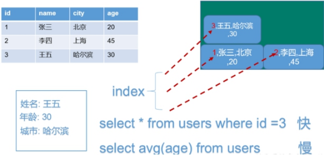
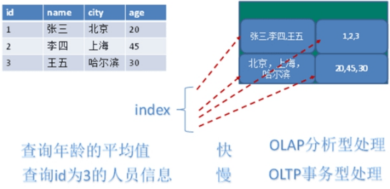

# Redis介绍
## 概述
> Redis(Remote Dictionary Server)，即远程字典服务 !
>
> 是一个开源的使用ANSI C语言编写、支持网络、可基于内存亦可持久化的日志型、Key-Value数据库， 并提供多种语言的API。
>
> Redis会周期性的把更新的数据写入磁盘或者把修改操作写入追加的记录文件，并且在此基础上实现了master-slave(主从)同步。
>
> 免费和开源！是当下最热门的 NoSQL 技术之一！也被人们称之为结构化数据库！

**Redis是单线程+多路IO复用技术**

多路复用是指使用一个线程来检查多个文件描述符（Socket）的就绪状态，比如调用select和poll函数，传入多个文件描述符，如果有一个文件描述符就绪，则返回，否则阻塞直到超时。得到就绪状态后进行真正的操作可以在同一个线程里执行，也可以启动线程执行（比如使用线程池）

串行   vs   多线程+锁（memcached） vs   单线程+多路IO复用(Redis)

（与Memcache三点不同: 支持多数据类型，支持持久化，单线程+多路IO复用）


## NoSQL数据库的四大分类

| **分类**         | **Examples举例**                                   | **典型应用场景**                                             | **数据模型**                                    | **优点**                                                     | **缺点**                                                     |
| ---------------- | -------------------------------------------------- | ------------------------------------------------------------ | ----------------------------------------------- | ------------------------------------------------------------ | ------------------------------------------------------------ |
| **KV键值**       | Tokyo Cabinet/Tyrant, Redis, Voldemort, Oracle BDB | 内容缓存，主要用于处理大量数据的高访问负载，也用于一些日志系统等等。 | Key 指向 Value 的键值对，通常用hash table来实现 | 查找速度快                                                   | 数据无结构化，通常只被当作字符串或者二进制数据               |
| **列存储数据库** | Cassandra，HBase，Riak                             | 分布式的文件系统                                             | 以列簇式存储，将同一列数据存在一起              | 查找速度快，可扩展性强，更容易进行分布式扩展                 | 功能相对局限                                                 |
| **文档型数据库** | CouchDB, MongoDb                                   | Web应用（与Key-Value类似，Value是结构化的，不同的是数据库能够了解Value的内容） | Key-Value对应的键值对，Value为结构化数据        | 数据结构要求不严格，表结构可变，不需要像关系型数据库一样需要预先定义表结构 | 查询性能不高，而且缺乏统一的查询语法。                       |
| **图形数据库**   | Neo4J, InfoGrid,Infinite Graph                     | 社交网络，推荐系统等。专注于构建关系图谱                     | 图结构                                          | 利用图结构相关算法。比如最短路径寻址，N度关系查找等          | 很多时候需要对整个图做计算才能得出需要的信息，而且这种结构不太好做分布式的集群方案。 |


## 行式数据库和列式数据库的区别

**行式**



**列式**



# Redis的安装
使用docker-compose的方式安装
```java
version: "3.1"
services:
  redis:
    image: redis:latest
    container_name: redis
    ports:
      - 6379:6379
    volumes:
      - ./data:/data
    command: redis-server --requirepass 123456 #你的密码
```
## Redis安装目录程序说明
安装目录在`/usr/local/bin/`

| **redis-benchmark** | 性能测试工具 |
| :-- | :-- |
| **redis-check-aof** | 修复有问题的AOF文件 |
| **redis-check-rdb** | 修复有问题的dump.rdb文件 |
| **redis-cli** | 客户端，操作入口 |
| **redis-sentinel** | Redis集群使用 |
| **redis-server** | Redis服务器启动命令 |

# Redis的常用命令
## Redis密码相关的命令
```sh
docker exec -it redis redis-cli #docker进入redis
127.0.0.1:6379> PING #ping操作,ping通会显示PONG
(error) NOAUTH Authentication required. #没有权限
127.0.0.1:6379> auth 123456 #输入密码(如果设置了密码)
OK
127.0.0.1:6379> PING #此时ping通了
PONG
127.0.0.1:6379> CONFIG GET requirepass #获取密码
1) "requirepass"
2) "123456"
127.0.0.1:6379> CONFIG SET requirepass 654321 #重设密码
OK
127.0.0.1:6379> CONFIG GET requirepass
1) "requirepass"
2) "654321"
```
## Redis基本操作
```bash
# 连接服务端：
./redis-cli -h 127.0.0.1 -p 6379
# Redis默认是有16个数据库的（0~15）通过select命令来切换数据库
select 1    -- 连接到第 2 个数据库 0开始计算
# 往数据库设置string类型值
set name zhangsan
# 查看数据库中key的数量
dbsize
# 查看刚才添加的key的值
get name
# 查看所有key的值
keys *
# 清空全部数据库和清空当前库
flushall（清空全部库） flushdb（清空当前库）
# 删除添加的name key键
del name
```
## Key值命令
> key值命令可以说是一些类型的公共命令，比如有设置定时时间，排序，数据迁移等等

:::note 用法

语法：<span style="color:mediumvioletred;font-weight:bold">keys pattern</span>

说明：用来匹配和查看指定的key

    h?llo       匹配 hello, hallo 和 hxllo
    h*llo       匹配 hllo 和 heeeello
    h[ae]llo    匹配 hello 和 hallo, 不匹配如 hillo
    h\[^e]llo    匹配 hallo, hbllo, ... 不匹配如 hello
    h[a-e]llo   匹配 hallo 和 hbllo, [a-e]说明是a~e这个范围 ，如hcllo也可以匹配
    若想匹配如转义字符的如下,就需要使用 \ 转义你想匹配的特殊字符。
    set na\me zhangsan
    keys na[\\]me

语法：<span style="color:mediumvioletred;font-weight:bold">del key [key ...]</span>

说明：删除指定的key

语法：<span style="color:mediumvioletred;font-weight:bold">unlink key [key ...]</span>

说明：其实这个和删除del命令很像，也是存在key删除，不存在则忽略；删除几个键值，则返回删除的个数

    注：del和unlink区别
      del：它是线程阻塞的，当执行del命令是，del在没执行完时，其它后续的命令是无法进入的（要安全就使用del）
      unlink:它不是线程阻塞的，当执行unlink命令时，它会将要删除的键移交给另外线程，然后将当前要删除的键与数据库空间断开连接后续则由其它线程异步删除这些键（要效率快就使用unlink）

语法：<span style="color:mediumvioletred;font-weight:bold">exists key [key ...]</span>

说明：返回要查询的key是否存在，存在则返回1，如果设置四个key都存在则会返回4；返回0则代表没有

    注：exists后面不管携带单个，多个或者有重复的，最终是存在一个就累加1

语法：<span style="color:mediumvioletred;font-weight:bold">type key</span>

说明：返回当前指定的key的类型。可返回的类型是: string,list,set,zset,hash和stream

语法：<span style="color:mediumvioletred;font-weight:bold">rename key newkey</span>

说明：修改key名称，存在原来则覆盖，不存在则抛错；如果修改key1为key2，key2存在，则key1覆盖key2的值
    
语法：<span style="color:mediumvioletred;font-weight:bold">renamenx key newkey</span>

说明：修改key名称存在则覆盖，不存在则抛错；如果修改key1为key2，key2存在，则key1修改不成功

语法：<span style="color:mediumvioletred;font-weight:bold">randomkey</span>

说明：随机返回一个key名称

语法：<span style="color:mediumvioletred;font-weight:bold">copy source destination [db destination-db] [replace]</span>

说明：拷贝当前某一个key的值，存放到新的key中（可以跨库拷贝）返回 1 成功 0 失败

语法：<span style="color:mediumvioletred;font-weight:bold">expire key seconds [nx|xx|gt|lt]</span>
    为一个存在的key设置过期时间 秒

语法：<span style="color:mediumvioletred;font-weight:bold">pexpire key milliseconds [nx|xx|gt|lt]</span>
    为一个存在的key设置过期时间 毫秒

语法：<span style="color:mediumvioletred;font-weight:bold">expireat key timestamp [nx|xx|gt|lt]</span>
    为一个存在的key设置过期时间 格式是uinx时间戳并精确到秒

语法：<span style="color:mediumvioletred;font-weight:bold">pexpireat key milliseconds-timestamp [nx|xx|gt|lt]</span>
    为一个存在的key设置过期时间 格式是uinx时间戳并精确到毫秒

说明：先设置一个key，并指定过期时间 秒/毫秒/时间戳秒/时间戳毫秒 ；返回 1 成功 0 失败

    注:使用del可以删除定时的key
    使用set可以覆盖定时的key；
    使用getset可以返回并设置值，并会删除定时
    如使用rename修改key名称，那么key定时器会被携带不会被删除

语法：<span style="color:mediumvioletred;font-weight:bold">persist key</span>

说明：清除当前有定时时间的键值，设置永不过期（和普通键值一样了），关闭后并不会删除已有的键值

语法：<span style="color:mediumvioletred;font-weight:bold">ttl key</span>

说明：查看当前有定时key的剩余时间，返回秒
    
语法：<span style="color:mediumvioletred;font-weight:bold">pttl key</span>

说明：查看当前有定时key的剩余时间，返回毫秒

    注：没过期返剩余时间;过期反-2;没设置过期时间的key反-1

语法：<span style="color:mediumvioletred;font-weight:bold">move key db</span>

说明：把指定的键值移动到选定的数据库db当中。如果key在目标数据库中已存在，或者key在源数据库中不存，则key不会被移动。

语法：<span style="color:mediumvioletred;font-weight:bold">touch key [key ...]</span>

说明：修改指定key的最后访问时间。忽略不存在的 key。（我的理解是这个键被设置/更新成功，并且被放到数据库则是成功，会返回1）
:::
```bash
127.0.0.1:6379> SET name chen
OK
127.0.0.1:6379> EXISTS name name #重复写两次name ，如果name存在则返回2
(integer) 2
127.0.0.1:6379> COPY name name1 #把 name 的值 拷贝到 name1 里
(integer) 1
127.0.0.1:6379> COPY name1 name2 db 4 #把 name1 的值拷贝到第4号数据库name2里
(integer) 1
127.0.0.1:6379> COPY name1 name2 replace #把 name1 的值拷贝到name2里，存在则强行覆盖
(integer) 1
127.0.0.1:6379> EXPIRE name 300 #把name键设置300秒过期
(integer) 1
127.0.0.1:6379> PEXPIRE name 3000 #把name键设置3000毫秒过期（3秒）
(integer) 1
127.0.0.1:6379> EXPIREAT name 1670000000 #把name键设置为2022-12-03 00:53:20到期(精确秒)
(integer) 0
127.0.0.1:6379> PEXPIRE name 1670000000000 #把name键设置为2022-12-03 00:53:20到期(精确毫秒)
(integer) 0
```
**Key的命名建议**

- key不要太长,尽量不要超过1024字节,这不仅消耗内存,而且会降低查找的效率
- key也不要太短,太短的话,key的可读性会降低
- 在一个项目中,key最好使用统一的命令模式,例如 user:123:password
- key名称区分大小写

**redis 单个 key 允许存入512M大小**

### 不常用命令
::: info 用法
语法：<span style="color:mediumvioletred;font-weight:bold">scan cursor [match pattern] [count count] [type type]</span>

说明：用于迭代当前数据库中的数据库键

    cursor：游标（告诉迭代器从哪开始迭代）
    [match pattern]：过滤筛选条件
    [count count]：迭代的个数
    [type type]：迭代的类型

语法：<span style="color:mediumvioletred;font-weight:bold">migrate host port key|"" destination-db timeout [copy] [replace] [auth password] [auth2 username password] [keys key [key ...]]</span>

说明：将key原子性的从当前实例库传送到目标实例的指定数据库上，一旦迁移成功，key会在目标实例上，而当前实例上的key会被删除（默认删除）

    host：设置迁移的IP地址
    port：设置迁移的端口号
    key|""：如果要迁移单个key则可以在这设置key，如果是多个key则在这里只需要设置 "" 在后面设置更多的key
    destination-db：迁移到目标Redis服务器的哪个实例数据库
    timeout：超时时间
    [copy]：设置此属性代表复制迁移，不删除源实例中的key。
    [replace]：强行替换，如果目标数据库存在则更新值，不存在则添加；如果不设置replace则代表对方数据库存在迁移的key则不成功
    [auth password]：请求对方数据库的密码
    [auth2 username password]：请求对方数据库的用户名和密码
    [keys key [key ...]]：如果前面没设置 key为""，则在后面可以设置多个key迁移，如keys aaa bbb ccc

语法：<span style="color:mediumvioletred;font-weight:bold">sort key [by pattern] [limit offset count] [get pattern [get pattern ...]] [asc|desc] [alpha] [store destination]</span>

说明：此命令是用来对list,set或sorted中元素排序；默认是按照数值排序的；并且按照两个元素的双精度浮点数类型值进行比较

    key：排序的key
    [by pattern]：通过引用外部key来排序
    [limit offset count]：分页，limit 2,3 从0开始偏移到第2条数据，并查询3条数据
    [get pattern [get pattern ...]]：获取外部key的值
    [asc|desc]：排序的规则
    [alpha]：当排序的集合中存在字符串则需要使用此属性，按照字典顺序排序；因为默认按照两个元素的双精度浮点数类型值进行比较
    [store destination]：把处理好的结果存放到指定的key容器中

:::

```shell
#设置一个普通的键值
set name zhangsan
#把name键值迁移到指定IP和端口的Redis服务器上，并且放在2号实例数据库上，超时时间2秒（超时关闭）
migrate 127.0.0.1 6380 name 1 2000
#和上面一个命令一样，但是不同的是上一个命令成功则删除原始键值，而当前命令加上copy则只是复制到对方数据库
migrate 127.0.0.1 6380 name 0 2000 copy
#加上replace则代表目地数据库存在此键则会强行更新，不存在则添加
migrate 127.0.0.1 6380 name 0 2000 copy replace
#加上密码验证
migrate 127.0.0.1 6380 name 0 2000 copy replace auth 1234
#一次性迁移多个keys
migrate 127.0.0.1 6380 "" 0 2000 copy replace auth 1234 name age address

#创建两个集合
127.0.0.1:6379> lpush list 3 2 5 1 4
(integer) 5
127.0.0.1:6379> lpush list2 d e a c b
(integer) 5
#基本使用：
127.0.0.1:6379> sort list #默认排序是按照双精度浮点数类型从小到大升序
1) "1"
2) "2"
3) "3"
4) "4"
5) "5"
127.0.0.1:6379> sort list desc #按照从降序排列
1) "5"
2) "4"
3) "3"
4) "2"
5) "1"
127.0.0.1:6379> sort list2 alpha #如果排序中包含字符串类型则必须使用 alpha 修饰；则会使用字节排序
1) "a"
2) "b"
3) "c"
4) "d"
5) "e"
127.0.0.1:6379> sort list2 limit 2 3 alpha #排序并分页，分页从0开始数到2，再从2的位置往后数3个元素
1) "c"
2) "d"
3) "e"
127.0.0.1:6379> sort list2 limit 2 4 alpha store list3 #排序分页，并把排序好的数据存放到另外一个集合中
(integer) 3

#by属性的使用（通过外部key排序）：
127.0.0.1:6379> lpush mylist 20 15 18
(integer) 3
127.0.0.1:6379> set n_20 b
OK
127.0.0.1:6379> set n_15 a
OK
127.0.0.1:6379> set n_18 c
OK
127.0.0.1:6379> sort mylist by n_* alpha
1) "15"
2) "20"
3) "18"
:<<!
如果使用了by属性，那么sort就会先取出mylist的全部值，也就是20，15，18，
然后再去跟by里设置的pattern进行组合（n_*，里面的*必须要和mylist的值有个一一对应关系，要不无法组合）；
所以就变为了n_20,n_15,n_18 ,再按照这些拼装出的键里面的值进行排序（默认升序，从小到大）；
这些键排完序规则为
n_15 a
n_20 b
n_18 c
对应好之后，程序就会按照键后面的权重值来排序，所以最终排序a,b,c起作用，那么反过来推算
n_15代表mylist的15，n_20代表mylist的20，n_18代表mylist的18，
所以15对应排序的权重a；20对应排序的权重b；18对应排序的权重c；
!

# get是使用则是先加载出mylist，并且再拼装到n_*（一一对应）然会直接输出那个键的权重（根据mylist里面排序）
127.0.0.1:6379> sort mylist get n_* #get属性使用（获取外部key）
1) "a"
2) "c"
3) "b"
127.0.0.1:6379> sort mylist get n_* get # --获取外部key并获取当前结合的集合值
1) "a"
2) "15"
3) "c"
4) "18"
5) "b"
6) "20"
127.0.0.1:6379> sort mylist get n_* get # get nn_* get # --如果有多个get也是可以的，会依次匹对返回

:<<!
# 应用场景：现在有四人，但是他们想比较谁的工资高，该如何设计排序
zhangsan（salary=5200）
lisi（salary=3000）
wangwu（salary=4500）
mazi（salary=3200）
#	
!
127.0.0.1:6379> lpush names zhangsan lisi wangwu mazi
(integer) 4
127.0.0.1:6379> set name_zhangsan 5200
OK
127.0.0.1:6379> set name_lisi 3000
OK
127.0.0.1:6379> set name_wangwu 4500
OK
127.0.0.1:6379> set name_mazi 3200
OK
127.0.0.1:6379> sort names by name_* desc
1) "zhangsan"
2) "wangwu"
3) "mazi"
4) "lisi"
```


# Redis发布订阅

::: info 简介
Redis 发布订阅 (pub/sub) 是一种消息通信模式：发送者 (pub) 发送消息，订阅者 (sub) 接收消息。

Redis 客户端可以订阅任意数量的频道。
:::

## 简要案例
接收端
```bash
127.0.0.1:6379> SUBSCRIBE chen
Reading messages... (press Ctrl-C to quit)
1) "subscribe"
2) "chen"
3) (integer) 1
1) "message"
2) "chen"
3) "hello"
1) "message"
2) "chen"
3) "world"
```

发送端 (重开一个客户端)
```bash
127.0.0.1:6379> PUBLISH chen hello
(integer) 1
127.0.0.1:6379> PUBLISH chen world
(integer) 1
```
# 
