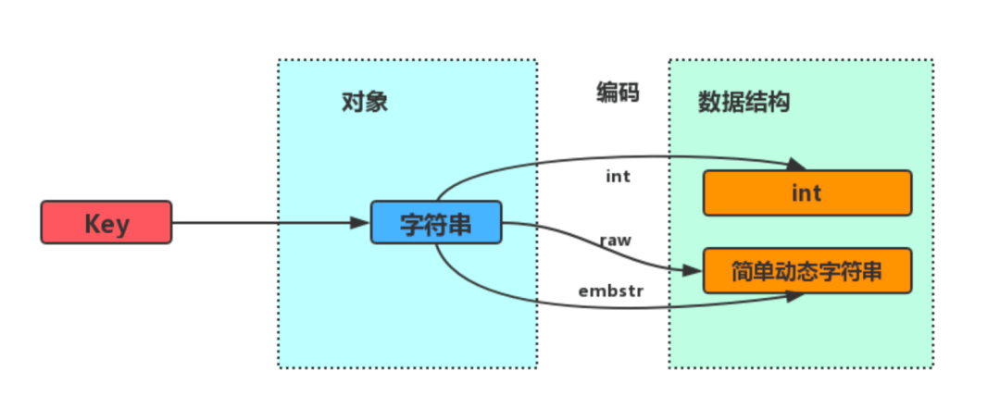
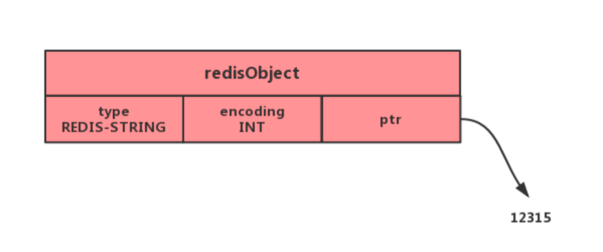
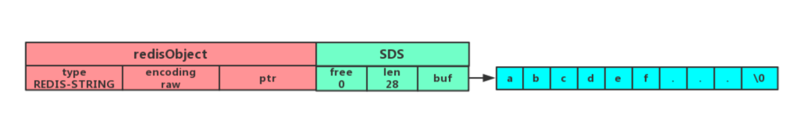
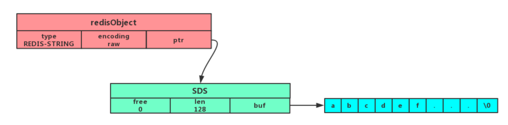
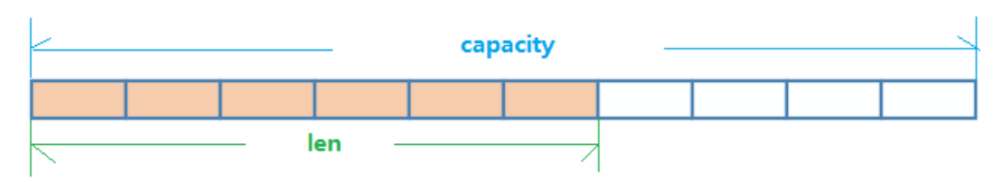
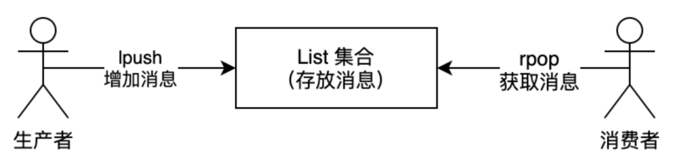
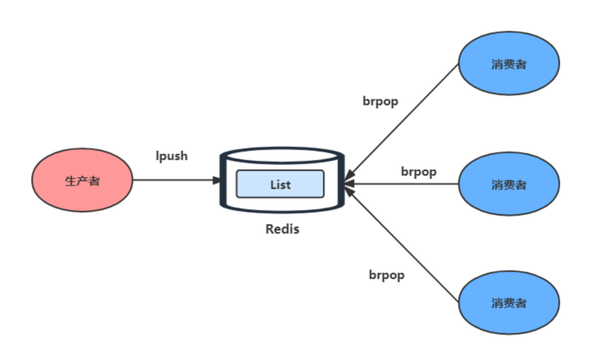
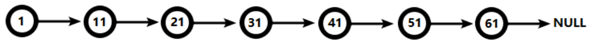
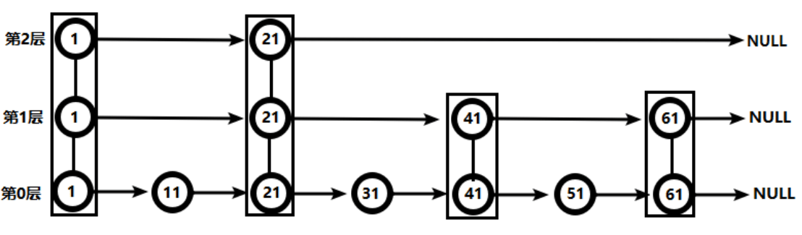
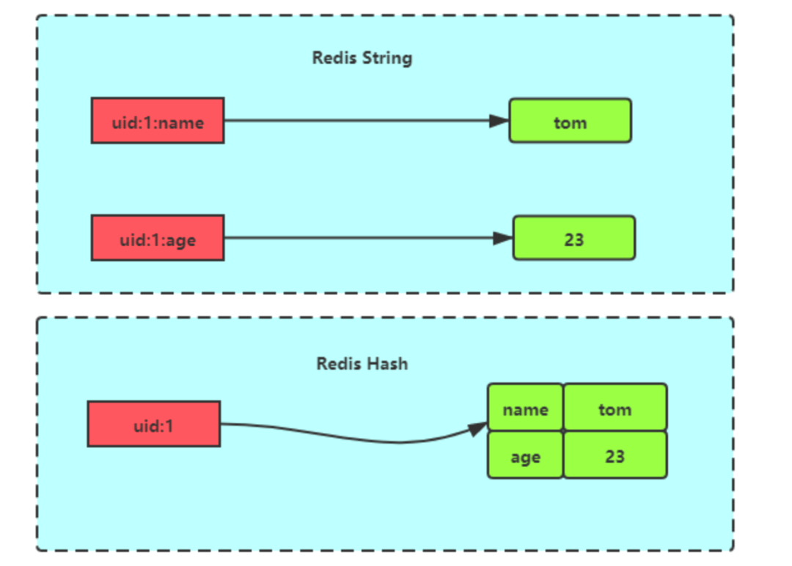

# 五大数据类型

## String 字符串

> string 类型是最基本的数据类型，一个键最大能存储512MB。
>
> string 数据结构是简单的 key-value 类型，value 其不仅是 string，也可以是数字，是包含很多类型的特殊类型
>
> string 类型是二进制安全的。意思是 redis 的 string 可以包含任何数据，比如序列化的对象进行存储，比如一张图片进行二进制存储，比如一个简单的字符串，数值等等

### 内部实现

String 类型的底层的数据结构实现主要是 int 和 SDS（简单动态字符串）。

SDS 和我们认识的 C 字符串不太一样，之所以没有使用 C 语言的字符串表示，因为 SDS 相比于 C 的原生字符串：

- **SDS  不仅可以保存文本数据，还可以保存二进制数据。** 因为 SDS 使用 len 属性的值而不是空字符来判断字符串是否结束，并且 SDS 的所有 API 都会以处理二进制的方式来处理 SDS 存放在 buf[] 数组里的数据。所以 SDS 不光能存放文本数据，而且能保存图片、音频、视频、压缩文件这样的二进制数据。
- **SDS 获取字符串长度的时间复杂度是 O(1)。** 因为 C 语言的字符串并不记录自身长度，所以获取长度的复杂度为 O(n)；而 SDS 结构里用 len 属性记录了字符串长度，所以复杂度为 O(1)。
- **Redis 的 SDS API 是安全的，拼接字符串不会造成缓冲区溢出。** 因为 SDS 在拼接字符串之前会检查 SDS 空间是否满足要求，如果空间不够会自动扩容，所以不会导致缓冲区溢出的问题。

字符串类型的内部编码有3种：

1. int：8个字节的长整型。
2. embstr：小于等于39个字节的字符串。
3. raw：大于39个字节的字符串。



如果一个字符串对象保存的是整数值，并且这个整数值可以用`long`类型来表示，那么字符串对象会将整数值保存在字符串对象结构的`ptr`属性里面（将`void*`转换成 long），并将字符串对象的编码设置为`int`。



如果字符串对象保存的是一个字符串，并且这个字符申的长度小于等于 32 字节，那么字符串对象将使用一个简单动态字符串（SDS）来保存这个字符串，并将对象的编码设置为`embstr`， `embstr`编码是专门用于保存短字符串的一种优化编码方式：



如果字符串对象保存的是一个字符串，并且这个字符串的长度大于 32 字节，那么字符串对象将使用一个简单动态字符串（SDS）来保存这个字符串，并将对象的编码设置为`raw`：



可以看到`embstr`和`raw`编码都会使用`SDS`来保存值，但不同之处在于`embstr`会通过一次内存分配函数来分配一块连续的内存空间来保存`redisObject`和`SDS`，而`raw`编码会通过调用两次内存分配函数来分别分配两块空间来保存`redisObject`和`SDS`。Redis这样做会有很多好处：

- `embstr`编码将创建字符串对象所需的内存分配次数从 `raw` 编码的两次降低为一次；
- 释放 `embstr`编码的字符串对象同样只需要调用一次内存释放函数；
- 因为`embstr`编码的字符串对象的所有数据都保存在一块连续的内存里面可以更好的利用 CPU 缓存提升性能。

但是 embstr 也有缺点的：
如果字符串的长度增加需要重新分配内存时，整个redisObject和sds都需要重新分配空间，**所以embstr编码的字符串对象实际上是只读的**，redis没有为embstr编码的字符串对象编写任何相应的修改程序。当我们对embstr编码的字符串对象执行任何修改命令（例如append）时，程序会先将对象的编码从embstr转换成raw，然后再执行修改命令。

### 数据结构

String的数据结构为简单动态字符串(Simple Dynamic String,缩写SDS)。是可以修改的字符串，内部结构实现上类似于Java的ArrayList，采用预分配冗余空间的方式来减少内存的频繁分配。


如图中所示，内部为当前字符串实际分配的空间capacity一般要高于实际字符串长度len。当字符串长度小于1M时，扩容都是加倍现有的空间，如果超过1M，扩容时一次只会多扩1M的空间。需要注意的是字符串最大长度为512M。

### 原子性

**INCR/DECR key** 对存储在指定的key的数值执行原子的加1操作。

所谓原子操作是指不会被线程调度机制打断的操作；

这种操作一旦开始，就一直运行到结束，中间不会有任何 context switch （切换到另一个线程）。

（1）在单线程中， 能够在单条指令中完成的操作都可以认为是"原子操作"，因为中断只能发生于指令之间。

（2）在多线程中，不能被其它进程（线程）打断的操作就叫原子操作。

Redis单命令的原子性主要得益于Redis的单线程。

**MSET/MGET/MSETNX** 也具有原子性，有一个失败则都失败

### 常用命令

::: note 命令
语法：<span style="color:mediumvioletred;font-weight:bold">set key value [ex seconds|px milliseconds|exat timestamp|pxat milliseconds-timestamp|keepttl] [nx|xx] [get]</span>

说明：设置string类型的键值，如果key已经保存了一个值，那么这个操作会直接覆盖原来的值，并且忽略原始类型

    key：存储的key名称
    value：存储的value数据
    [ex seconds|px milliseconds|exat timestamp|pxat milliseconds-timestamp|keepttl]：
        ex seconds：设置键key的过期时间，单位时秒
        px milliseconds：设置键key的过期时间，单位时毫秒
        exat timestamp：设置键过期的指定Unix时间，以秒为单位
        pxat milliseconds-timestamp：设置键过期的指定Unix时间，以毫秒为单位
        keepttl：获取key的过期时间
    [nx|xx]：
        nx：只有键key不存在的时候才会设置key的值
        xx：只有键key存在的时候才会设置key的值
    [get]：返回 key 存储的值，如果 key 不存在返回空

语法：<span style="color:mediumvioletred;font-weight:bold">setnx key value</span>

说明：设置键值，存在此键则返回0不覆盖，否则正常设置

语法：<span style="color:mediumvioletred;font-weight:bold">setrange key offset value</span>

说明：偏移量offset>=0开始， 用value参数覆盖键key储存的字符串值。不存在的键key当作空白字符串处理。

语法：<span style="color:mediumvioletred;font-weight:bold">strlen key</span>

说明：获取指定key所储存的字符串值的长度。当key储存的不是字符串类型时，返回错误。

语法：<span style="color:mediumvioletred;font-weight:bold">append key value</span>

说明：用于为指定的key追加值，成功后返回当前键里面的字符串全部长度（如果追加有空格需要使用 ''）

语法：<span style="color:mediumvioletred;font-weight:bold">get key</span>

说明：如果键key不存在，那么返回特殊值nil；否则返回键key的值。

语法：<span style="color:mediumvioletred;font-weight:bold">getdel key</span>

说明：先获取到指定的key后，再删除获取的那个key；最终返回被删除的值

语法：<span style="color:mediumvioletred;font-weight:bold">getset key value</span>

说明：设置更新key值，设置前先把原有的值返回出来，并设置新的值，如果key不存在时使用getset则返回nil，并设置新值

语法：<span style="color:mediumvioletred;font-weight:bold">getrange key start end</span>

说明：获取指定的范围值，start（从0开始）end（从0开始）

    注：若使用getrange name 0 -1 (其中-1代表从后往前数)

语法：<span style="color:mediumvioletred;font-weight:bold">getex key [ex seconds|px milliseconds|exat timestamp|pxat milliseconds-timestamp|persist]</span>

说明：获取指定的key值，并且获取后可以对当前key设置超时时间或者清除超时时间

    [ex seconds|px milliseconds|exat timestamp|pxat milliseconds-timestamp|persist]：
         ex seconds：设置键key的过期时间，单位时秒
         px milliseconds：设置键key的过期时间，单位时毫秒
         exat timestamp：设置键过期的指定Unix时间，以秒为单位
         pxat milliseconds-timestamp：设置键过期的指定Unix时间，以毫秒为单位
         persist：清除超时时间

语法：<span style="color:mediumvioletred;font-weight:bold">mset key value [key value ...]</span>

说明：和set命令差不多，但是这个是批量设置，如果设置键存在则覆盖，不存在则添加

语法：<span style="color:mediumvioletred;font-weight:bold">mget key [key ...]</span>

说明：批量获取键的值，如果获取的某个不存在则返回（nil），其它正常返回

语法：<span style="color:mediumvioletred;font-weight:bold">setex key seconds value</span>

说明：将键key的值设置为value ，并将键key的过期时间设置为seconds秒钟，如果key存在则覆盖原有值

语法：<span style="color:mediumvioletred;font-weight:bold">psetex key milliseconds value</span>

说明：将键key的值设置为value ，并将键key的过期时间设置为milliseconds毫秒，如果key存在则覆盖原有值

语法：<span style="color:mediumvioletred;font-weight:bold">msetnx key value [key value ...]</span>

说明：当且仅当所有给定键都不存在时，为所有给定键设置值（如果添加的其中键在当前数据库存在则都不成功）

    msetnx是一个原子性(atomic)操作，所有给定键要么就全部都被设置，要么就全部都不设置

语法：<span style="color:mediumvioletred;font-weight:bold">incr key</span>

说明：将key中储存的数字值增一，并返回增加后的值（只能用在整型，字符串啥的会报错）

语法：<span style="color:mediumvioletred;font-weight:bold">incrby key increment</span>

说明：将key中储存的数字值增加指定步长increment，并返回增加后的值（只能用在整型，字符串啥的会报错）

语法：<span style="color:mediumvioletred;font-weight:bold">incrbyfloat key increment</span>

说明：将key中储存的数字值增加指定步长increment，并返回增加后的值（只能用在浮点型，字符串啥的会报错）

语法：<span style="color:mediumvioletred;font-weight:bold">decr key</span>

语法：将key中储存的数字值减一，并返回减后的值（只能用在整型，字符串啥的会报错）

语法：<span style="color:mediumvioletred;font-weight:bold">decrby key decrement</span>

说明：将key中储存的数字值减指定步长increment，并返回减后的值（只能用在整型，字符串啥的会报错）
:::

```bash
127.0.0.1:6379> SET name chen #给key设置值
OK
127.0.0.1:6379> SET name zhangsan ex 60 #设置一个键值，并指定过期时间秒，ttl可以查看过期时间
OK
127.0.0.1:6379> SET name lisi nx #设置一个键值,如果key存在则设置失败
(nil)
127.0.0.1:6379> SET name
"zhangsan"
127.0.0.1:6379> SET name lisi xx #设置一个键值,如果key存在则设置成功
OK
127.0.0.1:6379> GET name
"lisi"
127.0.0.1:6379> DEL name
(integer) 1
127.0.0.1:6379> SET name chen nx #将name删除后才能设置成功
OK
127.0.0.1:6379> GET name
"chen"

127.0.0.1:6379> APPEND name gp #给key追加值,没有就创建
(integer) 6
127.0.0.1:6379> STRLEN name #获取key对应值的长度
(integer) 6
127.0.0.1:6379> GET name
"chengp"
127.0.0.1:6379> SET age 18
OK

127.0.0.1:6379> INCR age #将key对应的值执行原子的加1(值必须是integer类型)
(integer) 19
127.0.0.1:6379> DECR age #将key对应的值执行原子的减1(值必须是integer类型)
(integer) 18
127.0.0.1:6379> INCRBY age 10 #将key对应的值执行原子的加10(值必须是integer类型)
(integer) 28
127.0.0.1:6379> DECRBY age 5 #将key对应的值执行原子的减5(值必须是integer类型)
(integer) 23

127.0.0.1:6379> GETSET name manaphy #给key重新设置值(键必须存在) 返回旧值
"chengp"
127.0.0.1:6379> GETSET test hi
(nil)
127.0.0.1:6379> SETNX str hello #给key设置值(键必须不存在)
(integer) 1
127.0.0.1:6379> SETNX name hello
(integer) 0
127.0.0.1:6379> SETEX str 10 java #给key设置过期时间10秒并设置值(即10秒后该键会被删除)
OK
127.0.0.1:6379> PSETEX str2 10000 java #给key设置过期时间10000毫秒
OK
127.0.0.1:6379> PTTL str2 #以毫秒为单位查询key过期时间
5869
127.0.0.1:6379> SETRANGE name 1 e #设置key指定位置的字符
(integer) 7
127.0.0.1:6379> GET name
"menaphy"
127.0.0.1:6379> SET name zhangsan
OK

127.0.0.1:6379> GETRANGE name 2 5 #获取范围值
"angs"
127.0.0.1:6379> GETRANGE name 3 -2
"ngsa"
127.0.0.1:6379> GET name
"zhangsan"
127.0.0.1:6379> SETRANGE name 5 ' yu ge' #把原有的 zhangsan 从第五位之后更改（0下标）
(integer) 11
127.0.0.1:6379> GET name
"zhang yu ge"
127.0.0.1:6379> SETRANGE name 12 out #超出偏移则使用空格 '\x00' 代替一个空格
(integer) 15
127.0.0.1:6379> GET name
"zhang yu ge\x00out"
127.0.0.1:6379> SETRANGE address 2 zhejiang #如果设置的键不存在则会新建，但是偏移量会以空格代替
(integer) 10
127.0.0.1:6379> GET address
"\x00\x00zhejiang"

127.0.0.1:6379> MSET k1 v1 k2 v2 k3 v3 #批量设置值
OK
127.0.0.1:6379> MGET k1 k2 k3 #批量获取值
1) "v1"
2) "v2"
3) "v3"
127.0.0.1:6379> MSETNX k1 v1 k2 v2 #批量设置值(键必须不存在)
(integer) 0
127.0.0.1:6379> MSETNX k4 v4 k5 v5
(integer) 1
```

### 使用场景

#### 缓存对象

使用 String 来缓存对象有两种方式：

- 直接缓存整个对象的 JSON，命令例子：`SET user:1 '{"name":"xiaolin", "age":18}'`。
- 采用将 key 进行分离为 user:ID:属性，采用 MSET 存储，用 MGET 获取各属性值，命令例子：`MSET user:1:name xiaolin user:1:age 18 user:2:name xiaomei user:2:age 20`。

#### 常规计数

因为 Redis 处理命令是单线程，所以执行命令的过程是原子的。因此 String 数据类型适合计数场景，比如计算访问次数、点赞、转发、库存数量等等。

#### 分布式锁

#### 其他

- 共享Session
- 对IP进行限制

## List 列表

> List 列表是简单的字符串列表，**按照插入顺序排序**，可以从头部或尾部向 List 列表添加元素。
> 列表的最大长度为2^32-1，也即每个列表支持超过`40 亿`个元素。

### 内部实现

List 类型的底层数据结构是由**双向链表或压缩列表**实现的：

- **ziplist(压缩列表)**：如果列表的元素个数小于 512 个（默认值，可由 list-max-ziplist-entries 配置），列表每个元素的值都小于 64 字节（默认值，可由 list-max-ziplist-value 配置），Redis 会使用压缩列表作为 List 类型的底层数据结构；
- **linkedlist(链表)**：如果列表的元素不满足上面的条件，Redis 会使用双向链表作为 List 类型的底层数据结构；

但是**在 Redis 3.2 版本之后，List 数据类型底层数据结构就只由 quicklist 实现了，替代了双向链表和压缩列表**。

### 数据结构

List的数据结构为快速链表quickList。

首先在列表元素较少的情况下会使用一块连续的内存存储，这个结构是ziplist，也即是压缩列表。

它将所有的元素紧挨着一起存储，分配的是一块连续的内存。

当数据量比较多的时候才会改成quicklist。

因为普通的链表需要的附加指针空间太大，会比较浪费空间。比如这个列表里存的只是int类型的数据，结构上还需要两个额外的指针prev和next。


Redis将链表和ziplist结合起来组成了quicklist。也就是将多个ziplist使用双向指针串起来使用。这样既满足了快速的插入删除性能，又不会出现太大的空间冗余。

### 常用命令

::: note 命令
语法：<span style="color:mediumvioletred;font-weight:bold">lpush key element [element ...]</span>

说明：将一个或多个值插入到集合key的头部（头插法），如果当前key不存在则创建新的

语法：<span style="color:mediumvioletred;font-weight:bold">lpushx key element [element ...]</span>

说明：往集合左边插入一个元素；若集合key不存在无法插入

语法：<span style="color:mediumvioletred;font-weight:bold">rpush key element [element ...]</span>

说明：将一个或多个值插入到集合key的尾部（尾插法），如果当前key不存在则创建新的

语法：<span style="color:mediumvioletred;font-weight:bold">rpushx key element [element ...]</span>

说明：往集合右边插入一个元素；若集合key不存在无法插入

语法：<span style="color:mediumvioletred;font-weight:bold">lpop key [count]</span>

说明：从集合左边（头部）弹出（删除）指定的count个元素删除

语法：<span style="color:mediumvioletred;font-weight:bold">rpop key [count]</span>

说明：从集合右边（尾部部）弹出（删除）指定的count个元素删除

语法：<span style="color:mediumvioletred;font-weight:bold">blpop key [key ...] timeout</span>

说明：移出并获取集合头部第一个元素，如果集合没有元素会阻塞集合直到等待超时或发现可弹出元素为止，它是lpop的阻塞版

    key：如果当前key不存在或者key内部没元素，则一直阻塞等待，等待其它客户端创建此key和元素，会立马弹出
            但是超出延迟时间的话还没有弹出元素则会在最后弹出(nil)
    [key ...]：设置多个key时，如果第一个key不存在则会考虑弹出第二个key,第三个key....，如果每个key都不存在或没元素
                  则当前客户端会进入一个阻塞状态，直到有元素弹出，或者自动超时弹出(nil)

语法：<span style="color:mediumvioletred;font-weight:bold">brpop key [key ...] timeout</span>

说明：移出并获取集合尾部第一个元素，如果集合没有元素会阻塞集合直到等待超时或发现可弹出元素为止，它是rpop的阻塞版

语法：<span style="color:mediumvioletred;font-weight:bold">llen key</span>

说明：获取到集合里元素的总个数

语法：<span style="color:mediumvioletred;font-weight:bold">lrange key start stop</span>

说明：查询集合元素，并设置查询区间

    start：起始值，设置正数则从左往右，设置负数则从右往左开始
    stop：终点值，设置正数则从左往右，设置负数则从右往左开始
    注：lrange key 0 -1 表示查询全部

语法：<span style="color:mediumvioletred;font-weight:bold">lindex key index</span>

说明：返回集合key里索引index位置存储的元素，0~n从左往右索引、-1~-n从右往左索引

语法：<span style="color:mediumvioletred;font-weight:bold">lrem key count element</span>

说明：从集合key中删除前count个值等于element的元素

    count > 0: 从头到尾删除值为 value 的元素
    count < 0: 从尾到头删除值为 value 的元素
    count = 0: 移除所有值为 value 的元素

语法：<span style="color:mediumvioletred;font-weight:bold">lset key index element</span>

说明：设置集合key中index位置的元素值为新的element，index为正数则从头到位索引，为负数从尾到头索引查询

语法：<span style="color:mediumvioletred;font-weight:bold">linsert key before|after pivot element</span>

说明：把element元素插入到指定集合key里，但是还要以pivot内部的一个元素为基准，看是插到这个元素的左边还是右边

    before|after：插入元素的前后位置选项
    pivot：集合里的参考元素
    element：待插入的元素
    注：当集合key不存在时，这个list会被看作是空list，什么都不执行
    注：当集合key存在，值不是列表类型时，返回错误
    注：当给定的参考元素pivot不存在是则返回-1，因为程序不知道往哪插入

语法：<span style="color:mediumvioletred;font-weight:bold">lpos key element [rank rank] [count num-matches] [maxlen len]</span>

说明：返回集合key中匹配给定element成员的索引
    key：要查询的集合key
    element：要查询索引的元素
    [rank rank]：选择匹配上的第几个元素，若超出集合指定元素的个数则返回(nil)
    [count num-matches]：返回匹配上元素的索引个数，默认返回1个
    [maxlen len]：告知lpos命令查询集合的前len个元素，限制查询个数

语法：<span style="color:mediumvioletred;font-weight:bold">lmove source destination left|right left|right</span>

说明：用于原子地从source集合左边或者右边弹出一个元素，添加到destination新集合里的左边或右边

    source：源集合
    destination：目标集合
    left|right left|right：
        第一个：代表从源集合的左边或者右边弹出元素
        第二个：代表从目标集合的左边或者右边添加

语法：<span style="color:mediumvioletred;font-weight:bold">~~rpoplpush source destination~~ (**在Redis6.2.0被废除，使用lmove代替**)</span>

说明：原子地从集合source中移除并返回最后一个元素，然后把这个元素插入集合destination的第一个元素

语法：<span style="color:mediumvioletred;font-weight:bold">blmove source destination left|right left|right timeout</span>

说明：用于原子地从source集合左边或者右边弹出一个元素，添加到destination新集合里的左边或右边，但是它时lmove的阻塞版本(超时返回nil)

语法：<span style="color:mediumvioletred;font-weight:bold">~~brpoplpush source destination timeout~~</span>

说明：原子地从集合source中移除并返回最后一个元素，然后把这个元素插入集合destination的第一个元素（已废弃使用blmove代替）

语法：<span style="color:mediumvioletred;font-weight:bold">ltrim key start stop</span>

说明：修订一个已经存在的集合；修订一个指定范围的元素放到当前集合中

补充Redis7.0.0提供

语法：<span style="color:mediumvioletred;font-weight:bold">lmpop numkeys [key [key ...]] left|right [count count]</span>

语法：<span style="color:mediumvioletred;font-weight:bold">blmpop timeout numkeys [key [key ...]] left|right [count count]</span>
:::

```shell
127.0.0.1:6379> BLPOP list 120 #如果key里没有值则会阻塞,有值则会弹出最后一个值
1) "list"
2) "a"
(16.84s)

127.0.0.1:6379> LPUSH list a b c d #从list头部插入数据 可以一次性插入多个值
(integer) 4
127.0.0.1:6379> LRANGE list 0 -1 #获取list的所有值
1) "d"
2) "c"
3) "b"
4) "a"
127.0.0.1:6379> LRANGE list 0 2 #获取指定坐标范围的值
1) "d"
2) "c"
3) "b"
127.0.0.1:6379> LRANGE list -3 -2 #获取指定坐标范围的值(从尾部读取 从-1开始)
1) "c"
2) "b"

127.0.0.1:6379> LPUSHX list e #往list头部插入数据(list必须存在)
(integer) 5
127.0.0.1:6379> LPOP list #弹出list第一个值(如果列表没有元素会阻塞列表直到等待超时或发现可弹出元素为止)
"e"
127.0.0.1:6379> LREM list 2 a #	删除list中的元素 2代表个数 从头部开始删除(删除全部使用del key)
(integer) 1
127.0.0.1:6379> LREM list -2 a #	删除list中的元素 -2表示从尾部查找并删除两个,并返回删除成功个数
(integer) 1
127.0.0.1:6379> LINDEX list 1 #获取list位置1的值 (类似于list.get(1)方法)
"c"
127.0.0.1:6379> LSET list 1 e #	向list位置1插入值(会替换原来的值)
OK
127.0.0.1:6379> LINSERT list BEFORE e z #向list第1个e之前插入z
(integer) 4
127.0.0.1:6379> LINSERT list AFTER e z #向list第1个e之后插入z
(integer) 5
127.0.0.1:6379> LTRIM list 0 2 #通过下标截取list,此list只剩下被截取后的元素
OK

127.0.0.1:6379> DEL list
OK
127.0.0.1:6379> LPUSH list a b c d e d c b a
(integer) 9
127.0.0.1:6379> LPOS list b #查询集合list里的b出现的索引位置(0开始索引)
(integer) 1
127.0.0.1:6379> LPOS list b RANK 1 #等同于上一条命令
(integer) 1
127.0.0.1:6379> LPOS list b RANK 1 COUNT 2 #查看b索引的两条记录
1) (integer) 1
2) (integer) 7
127.0.0.1:6379> LPOS list b RANK 1 COUNT 2 MAXLEN 4 #限制查询的下表为0-4
1) (integer) 1

127.0.0.1:6379> LMOVE list list2 LEFT RIGHT #从list集合里的左边弹出元素,添加到list2集合的右边
"a"
```

### 使用场景

#### 消息队列

消息队列在存取消息时，必须要满足三个需求，分别是**消息保序、处理重复的消息和保证消息可靠性**。

Redis 的 List 和 Stream 两种数据类型，就可以满足消息队列的这三个需求。我们先来了解下基于 List 的消息队列实现方法，后面在介绍 Stream 数据类型时候，在详细说说 Stream。

_1、如何满足消息保序需求？_

List 本身就是按先进先出的顺序对数据进行存取的，所以，如果使用 List 作为消息队列保存消息的话，就已经能满足消息保序的需求了。

List 可以使用 LPUSH + RPOP （或者反过来，RPUSH+LPOP）命令实现消息队列。



- 生产者使用 `LPUSH key value[value...]` 将消息插入到队列的头部，如果 key 不存在则会创建一个空的队列再插入消息。
- 消费者使用 `RPOP key` 依次读取队列的消息，先进先出。

不过，在消费者读取数据时，有一个潜在的性能风险点。

在生产者往 List 中写入数据时，List 并不会主动地通知消费者有新消息写入，如果消费者想要及时处理消息，就需要在程序中不停地调用`RPOP`命令（比如使用一个while(1)循环）。如果有新消息写入，RPOP命令就会返回结果，否则，RPOP命令返回空值，再继续循环。

所以，即使没有新消息写入List，消费者也要不停地调用 RPOP 命令，这就会导致消费者程序的 CPU 一直消耗在执行 RPOP 命令上，带来不必要的性能损失。

为了解决这个问题，Redis提供了 BRPOP 命令。**BRPOP命令也称为阻塞式读取，客户端在没有读到队列数据时，自动阻塞，直到有新的数据写入队列，再开始读取新数据**。和消费者程序自己不停地调用RPOP命令相比，这种方式能节省CPU开销。



_2、如何处理重复的消息？_

消费者要实现重复消息的判断，需要 2 个方面的要求：

- 每个消息都有一个全局的 ID。
- 消费者要记录已经处理过的消息的 ID。当收到一条消息后，消费者程序就可以对比收到的消息 ID 和记录的已处理过的消息 ID，来判断当前收到的消息有没有经过处理。如果已经处理过，那么，消费者程序就不再进行处理了。

但是 **List 并不会为每个消息生成 ID 号，所以我们需要自行为每个消息生成一个全局唯一ID**，生成之后，我们在用 LPUSH 命令把消息插入 List 时，需要在消息中包含这个全局唯一 ID。

例如，我们执行以下命令，就把一条全局 ID 为 111000102、库存量为 99 的消息插入了消息队列：

```bash
> LPUSH mq "111000102:stock:99"
(integer) 1
```

_3、如何保证消息可靠性？_

当消费者程序从 List 中读取一条消息后，List 就不会再留存这条消息了。所以，如果消费者程序在处理消息的过程出现了故障或宕机，就会导致消息没有处理完成，那么，消费者程序再次启动后，就没法再次从 List 中读取消息了。

为了留存消息，List 类型提供了 `BRPOPLPUSH` 命令，这个命令的**作用是让消费者程序从一个 List 中读取消息，同时，Redis 会把这个消息再插入到另一个 List（可以叫作备份 List）留存**。

这样一来，如果消费者程序读了消息但没能正常处理，等它重启后，就可以从备份 List 中重新读取消息并进行处理了。

好了，到这里可以知道基于 List 类型的消息队列，满足消息队列的三大需求（消息保序、处理重复的消息和保证消息可靠性）。

- 消息保序：使用 LPUSH + RPOP；
- 阻塞读取：使用 BRPOP；
- 重复消息处理：生产者自行实现全局唯一 ID；
- 消息的可靠性：使用 BRPOPLPUSH

但是，**在用 List 做消息队列时，如果生产者消息发送很快，而消费者处理消息的速度比较慢，这就导致 List 中的消息越积越多，给 Redis 的内存带来很大压力**。

要解决这个问题，就要**启动多个消费者程序组成一个消费组，一起分担处理 List 中的消息**。但是，**List 类型并不支持消费组的实现**。

这就要说起 Redis 从 5.0 版本开始提供的 Stream 数据类型了，Stream 同样能够满足消息队列的三大需求，而且它还支持「消费组」形式的消息读取。

####  其他

- 栈(`lpush`+`lpop`或者`rpush`+`rpop`)
- 阻塞队列
- 文章列表(使用命令`lrange key 0 9`分页获取文章列表)

## Set 集合

> Set 类型是一个无序并唯一的键值集合，它的存储顺序不会按照插入的先后顺序进行存储。
>
> 一个集合最多可以存储 `2^32-1` 个元素。概念和数学中个的集合基本类似，可以交集，并集，差集等等，所以 Set 类型除了支持集合内的增删改查，同时还支持多个集合取交集、并集、差集。
>
> Redis的Set是string类型的无序集合。它底层其实是一个value为null的hash表，所以添加、删除、查找的复杂度都是O(1)。

### 内部实现

Set 类型的底层数据结构是由哈希表或整数集合实现的：

- **intset(整数集合)**：当集合中的元素都是整数且元素个数小于`set-max-intset-entries`配置（默认512个）时，redis会选用intset来作为集合的内部实现，从而减少内存的使用。
- **hashtable(哈希表)**：当intset不能满足要求时，会使用hashtable。

### 常用命令

::: note 命令
语法：<span style="color:mediumvioletred;font-weight:bold">sadd key member [member ...]</span>

说明：将一个或多个元素加入到集合中，添加已存在的集合元素将被忽略（不会添加上），返回添加成功的元素个数

语法：<span style="color:mediumvioletred;font-weight:bold">srem key member [member ...]</span>

说明：删除指定的元素；如果指定的元素不是集合成员则被忽略，返回被删除元素个数，不含不存在的元素

语法：<span style="color:mediumvioletred;font-weight:bold">spop key [count]</span>

说明：从集合key中删除一个或多个随机元素，并返回删除的元素

语法：<span style="color:mediumvioletred;font-weight:bold">srandmember key [count]</span>

说明：随机返回集合key中的一个或多个随机元素，若返回个数的count大于集合总数则返回全部
    注：srandmember随机返回不删除原集合，spop返回并删除原集合返回的元素

语法：<span style="color:mediumvioletred;font-weight:bold">sdiff key [key ...]</span>

说明：返回第一个集合与其它集合之间的差异；说白就是第一个集合的某个元素在其它集合都不存在则这个元素会被返回。

语法：<span style="color:mediumvioletred;font-weight:bold">sdiffstore destination key [key ...]</span>

说明：此命令和sdiff功能差不多，不同的是它将结果保存到destination集合，并返回成功添加到新集合上的个数。

语法：<span style="color:mediumvioletred;font-weight:bold">sinter key [key ...]</span>

说明：返回第一个集合与其它集合之间的交集；说白就是第一个集合的某个元素在其它集合都存在则这个元素会被返回。

语法：<span style="color:mediumvioletred;font-weight:bold">sinterstore destination key [key ...]</span>

说明：此命令和sinter功能差不多，不同的是它将结果保存到destination集合，并返回成功添加到新集合上的个数。

语法：<span style="color:mediumvioletred;font-weight:bold">sunion key [key ...]</span>

说明：用于返回所有给定集合的并集

语法：<span style="color:mediumvioletred;font-weight:bold">sunionstore destination key [key ...]</span>

说明：类似于sunion，不同的是不返回结果集，而是把返回存储在destination集合中。

语法：<span style="color:mediumvioletred;font-weight:bold">scard key</span>

说明：返回集合中元素的数量（整型值）

语法：<span style="color:mediumvioletred;font-weight:bold">smembers key</span>

说明：返回存储在key中的集合的所有的成员，此命令可以使用携带单个key的sdiff、sinter、sunion命令替代

语法：<span style="color:mediumvioletred;font-weight:bold">sismember key member</span>

说明：判断元素member是否是集合key的成员，是返回1，否则0

语法：<span style="color:mediumvioletred;font-weight:bold">smismember key member [member ...]</span>

说明：批量判断元素members是否是集合key的成员，是返回1，否则0

语法：<span style="color:mediumvioletred;font-weight:bold">smove source destination member</span>

说明：从集合source中移动成员member到集合destination；

    注：返回1代表成功，返回0代表移动element元素在source不存在
    注：移动成功后会把element元素在原集合上删除
    注：若被移动的元素在两个集合都存在，则会覆盖移动，再删除原集合上的元素

语法：<span style="color:mediumvioletred;font-weight:bold">sscan key cursor [match pattern] [count count]</span>

说明：用于遍历集合中键的元素，sscan继承自scan，具体可以参考scan

    key：迭代指定元素
    cursor：游标（告诉迭代器从哪开始迭代）
    [match pattern]：过滤筛选条件
    [count count]：迭代的个数

补充Redis7.0.0提供
语法：<span style="color:mediumvioletred;font-weight:bold">sintercard key [key ...]</span>
:::

```bash
127.0.0.1:6379> SADD set a b c d #向set集合添加元素 可以一次性插入多个值
(integer) 4
127.0.0.1:6379> SMEMBERS set #查看set集合元素
1) "a"
2) "d"
3) "c"
4) "b"
127.0.0.1:6379> SCARD set #获取set集合的长度
(integer) 4
127.0.0.1:6379> SISMEMBER set a #判断set集合中是否存在某元素
(integer) 1
127.0.0.1:6379> SRANDMEMBER set 2 #随机返回2个元素(不写数字默认返回一个)
1) "a"
2) "b"
127.0.0.1:6379> SRANDMEMBER set
1) "c"
127.0.0.1:6379> SPOP set 2 #从set集合中随机弹出2个元素(不写数字默认弹出一个)
1) "a"
2) "c"
127.0.0.1:6379> SMEMBERS set #只剩2个元素
1) "d"
2) "b"
127.0.0.1:6379> SREM set d #删除指定元素(可删除多个)
(integer) 1
127.0.0.1:6379> SMEMBERS set
1) "b"
127.0.0.1:6379> SMOVE set set1 d #将set中的d移动到set1
(integer) 1
127.0.0.1:6379> FLUSHDB
OK
127.0.0.1:6379> SADD set a b c d
(integer) 4
127.0.0.1:6379> SADD set1 b c d e
(integer) 4
127.0.0.1:6379> SDIFF set set1 #获取两个(或多个)集合中的差集
1) "a"
127.0.0.1:6379> SDIFF set1 set #获取两个(或多个)集合中的差集
1) "e"
127.0.0.1:6379> SDIFFSTORE diffset set set1 #将差集保存到新的集合中
(integer) 1
127.0.0.1:6379> SMEMBERS diffset
1) "a"
127.0.0.1:6379> SINTER set set1 #获取两个(多个)集合中的交集
1) "d"
2) "c"
3) "b"
127.0.0.1:6379> SINTERSTORE interset set set1 #	将交集保存到新的集合中
(integer) 3
127.0.0.1:6379> SMEMBERS interset
1) "d"
2) "c"
3) "b"
127.0.0.1:6379> SUNION set set1 #获取两个(多个)集合中的并集
1) "b"
2) "d"
3) "e"
4) "a"
5) "c"
127.0.0.1:6379> SUNIONSTORE unionset set set1 #将并集保存到新的集合中
(integer) 5
127.0.0.1:6379> SMEMBERS unionset
1) "b"
2) "d"
3) "e"
4) "a"
5) "c"
```

### 使用场景

集合的主要几个特性，无序、不可重复、支持并交差等操作。

因此 Set 类型比较适合用来数据去重和保障数据的唯一性，还可以用来统计多个集合的交集、错集和并集等，当我们存储的数据是无序并且需要去重的情况下，比较适合使用集合类型进行存储。

但是要提醒你一下，这里有一个潜在的风险。**Set 的差集、并集和交集的计算复杂度较高，在数据量较大的情况下，如果直接执行这些计算，会导致 Redis 实例阻塞**。

在主从集群中，为了避免主库因为 Set 做聚合计算（交集、差集、并集）时导致主库被阻塞，我们可以选择一个从库完成聚合统计，或者把数据返回给客户端，由客户端来完成聚合统计。

- 利用集合操作，可以取不同兴趣圈子的交集,以非常方便的实现如共同关注 共同喜好 二度好友等功能。对上面的所有集合操作，你还可以使用不同的命令选择将结果返回给客户端还是存储到一个新的集合中
- 利用唯一性，可以统计访问网站的所有独立IP 存取当天(或某天)的活跃用户列表
- 抽奖功能: 随机抽取个数不变`srandmember key [count]` ;随机抽取,个数变少`spop key [count]`

## SortedSet(ZSet) 有序集合

> Zset 类型（有序集合类型）相比于 Set 类型多了一个排序属性 score（分值），对于有序集合 ZSet 来说，每个存储元素相当于有两个值组成的，一个是有序结合的元素值，一个是排序值。
>
> 有序集合保留了集合不能有重复成员的特性（分值可以重复），但不同的是，有序集合中的元素可以排序。
>
> 访问有序集合的中间元素也是非常快的，因此你能够使用有序集合作为一个没有重复成员的智能列表。

### 内部实现

Zset 类型的底层数据结构是由**压缩列表或跳表**实现的：

- ziplist（压缩列表）：当有序集合的元素个数小于list-max-ziplist-entries配置（默认128个）同时所有值都小于list-max-ziplist-value配置（默认64字节）时使用。ziplist使用更加紧凑的结构实现多个元素的连续存储，更加节省内存。
- skiplist（跳跃表）：当不满足ziplist的要求时，会使用skiplist。

::: warning
在 Redis 7.0 中，压缩列表数据结构已经废弃了，交由 listpack 数据结构来实现了。
:::

### 跳跃表

::: tip 简介
有序集合在生活中比较常见，例如根据成绩对学生排名，根据得分对玩家排名等。对于有序集合的底层实现，可以用数组、平衡树、链表等。数组不便元素的插入、删除；平衡树或红黑树虽然效率高但结构复杂；链表查询需要遍历所有效率低。Redis采用的是跳跃表。跳跃表效率堪比红黑树，实现远比红黑树简单。
:::

**实例**

对比有序链表和跳跃表，从链表中查询出51

1. 有序链表



要查找值为51的元素，需要从第一个元素开始依次查找、比较才能找到。共需要6次比较。

2. 跳跃表



从第2层开始，1节点比51节点小，向后比较。

21节点比51节点小，继续向后比较，后面就是NULL了，所以从21节点向下到第1层

在第1层，41节点比51节点小，继续向后，61节点比51节点大，所以从41向下

在第0层，51节点为要查找的节点，节点被找到，共查找4次。

从此可以看出跳跃表比有序链表效率要高

### 常用命令

::: note 命令
语法：<span style="color:mediumvioletred;font-weight:bold">zadd key [nx|xx] [gt|lt] [ch] [incr] score member [score member ...]</span>

说明：用于将一个或多个member元素及其score值加入到有序集key当中，若添加的member已存在则更新当前分数

    [nx|xx]:
        nx：只能做添加操作
        xx：只能做更新操作
    [gt|lt]:
        gt：更新的元素分数必须比原分数大
        lt：更新的元素分数必须比原分数小
    [ch]：返回添加和更新成功的个数
    [incr]：累加操作，score代表更新member的步长
    注：gt,lt 和 nx 三者互斥不能同时使用
    注：分数的取值范围-9007199254740992到9007199254740992

语法：<span style="color:mediumvioletred;font-weight:bold">zrange key min max [byscore|bylex] [rev] [limit offset count] [withscores]</span>

说明：返回有序集中，指定区间内的成员，其中成员查询可以按照下标，分数，元素来获取指定范围

    key：要查询的有序集合
    min：查询范围的最小值，按照不同的方式写不同的最小值
        下标查询写下标值（默认）,分数查询写分数值（设置byscore），元素查询写元素值（设置bylex）
    max：查询范围的最大值，按照不同的方式写不同的最大值
        下标查询写下标值（默认）,分数查询写分数值（设置byscore），元素查询写元素值（设置bylex）
    [byscore|bylex]：
        byscore：按照分数排序，此时查询时只会按照分数的范围查询，切记不能写字符啥的
            -inf +inf byscore 代表查询分数在负无穷 ~ 正无穷
            -20 20    byscore 代表查询分数在 -20 ~ 20之间的元素(包含-20和20)
            10 (20    byscore 代表查询分数在 10 ~ 20之间的元素(包含10，不包含20)
        bylex：按照元素属性ASCLL来排序，此时查询时只会按照元素范围查询 `**[:表示包含 (:表示不包含 不加也表示包含**`
            - + bylex       代表查询元素范围为全部
            - [cc bylex     代表从开头查询到元素 cc 位置（包含cc）
            (cc [ff bylex   代表查询元素为cc ~ ff之间的范围（包含ff，不包含cc）
    [rev]：设置倒序排列，这时候我们就得注意写最大值和最小值要反过来写
    [limit offset count]：筛选后的结果排序
        offset：起始位（0下标开始数）
        count：查询元素个数
    [withscores]：最终查询结果显示分数，但是只适用于byscore查询和默认下标查询
    注：下标查询时是默认的，不用写[byscore|bylex]，下面写-1，代表右边第一个，所有0 -1代表查询全部
    注：若某个有序集合使用元素查询时（bylex），那么我推荐你最好使用分数都是相同的有序集合！
        因为分数会打乱原有我们添加的顺序，下面举个普通例子：
          执行命令=>：zadd newKey 6 aa 3 bb 4 cc
          有序集合存储元素变为=>：3 bb 4 cc 6 aa
          它会按照分数排序了，这样按照元素获取范围就不准了，如获取[aa [bb bylex
          127.0.0.1:6379> zrange newKey [aa [cc bylex
          1) "bb"
          2) "cc"
          3) "aa"
          127.0.0.1:6379> zrange newKey [aa [bb bylex
          1) "bb"
          此时会发现有点不对劲，[aa [bb bylex 为什么没有aa呢？因为分数打乱了顺序
          其实用到元素查询那么有序集合里面的每个元素分数都是相同的，添加相同分数，元素会强行按照字典ASCII进行排序
          执行命令=>：zadd newKey1 0 bb 0 aa 0 cc
          执行时插入时遇到分数相同的则会对元素的ASCII排序
        再说了，使用bylex元素查询我们也不能指定withscores
    zrange演变命令
        zrangebyscore、zrangebylex、zrangestore
        zrevrange、zrevrangebyscore、zrevrangebylex

语法：<span style="color:mediumvioletred;font-weight:bold">zinter numkeys key [key ...] [weights weight [weight ...]] [aggregate sum|min|max] [withscores]</span>

说明：计算numkeys个有序集合的交集（就是把几个相同元素的分数进行处理）

    numkeys：计算交集的key个数
    key | [key ...]：设置要处理交集的有序集合，按照我们给出的numkeys写指定个数的key
    [weights weight [weight ...]]：权重计算（乘法因子）；要设置权重的话，则有几个key就得写几个权重值
        若key1 key2 weights 10 15 说明：第一个key里面的全部分数要乘于10，第二个key的全部分数乘于15
        注：此属性在交集、并集计算中都存在，只要是符合[交集|并集]的才会计算并返回给客户端
    [aggregate sum|min|max]：你可以指定交集、并集的结果集的聚合方式
        注：指定sum（默认）则交集的元素的分数结合，若指定max，则会选择最大的作为交集的分数
    [withscores]：显示分数

语法：<span style="color:mediumvioletred;font-weight:bold">zunion numkeys key [key ...] [weights weight [weight ...]] [aggregate sum|min|max] [withscores]</span>

说明：计算给定的numkeys个有序集合的并集，并且返回结果

     numkeys：计算交集的key个数
     key | [key ...]：设置要处理交集的有序集合，按照我们给出的numkeys写指定个数的key
     [weights weight [weight ...]]：权重计算（乘法因子）；要设置权重的话，则有几个key就得写几个权重值
         若key1 key2 weights 10 15 说明：第一个key里面的全部分数要乘于10，第二个key的全部分数乘于15
         注：此属性在交集、并集计算中都存在，只要是符合[交集|并集]的才会计算并返回给客户端
     [aggregate sum|min|max]：你可以指定交集、并集的结果集的聚合方式
         注：指定sum（默认）则交集的元素的分数结合，若指定max，则会选择最大的作为交集的分数
     [withscores]：显示分数
     注：并集就是把几个集合的元素并到一起（不漏任何元素），然后单个元素单独计算，多个元素计算后合并到一起

语法：<span style="color:mediumvioletred;font-weight:bold">zinterstore destination numkeys key [key ...] [weights weight [weight ...]] [aggregate sum|min|max]</span>

说明：计算numkeys个有序集合的交集，并且把结果放到destination中；具体操作看zinter
    destination：新集合名称，用来存放处理好交集的数据

语法：<span style="color:mediumvioletred;font-weight:bold">zintercard numkeys key [key ...]</span>

说明：Redis7.0发布

语法：<span style="color:mediumvioletred;font-weight:bold">zunionstore destination numkeys key [key ...] [weights weight [weight ...]] [aggregate sum|min|max]</span>

说明：计算给定的numkeys个有序集合的并集，并且把结果放到destination中。（具体参考zunion）

    destination：计算后的结果返回到指定的有序集合里

语法：<span style="color:mediumvioletred;font-weight:bold">zrangebyscore key min max [withscores] [limit offset count]</span>

说明：（演变）返回有序集中，按照分数来指定区间内的成员，具体参考zrange

语法：<span style="color:mediumvioletred;font-weight:bold">zrangebylex key min max [limit offset count]</span>

说明：（演变）返回有序集中，按照元素来指定区间内的成员，具体参考zrange

语法：<span style="color:mediumvioletred;font-weight:bold">zrangestore dst src min max [byscore|bylex] [rev] [limit offset count]</span>

说明：（演变）指定区间内的成员，其中成员查询可以按照下标，分数，元素来获取指定范围，并存储在dst新的有序集合里

    dst：存储查询结果的有序集合
    src：要查询的有序集合
    注：具体操作和参数介绍看zrange

语法：<span style="color:mediumvioletred;font-weight:bold">zrevrange key start stop [withscores]</span>

说明：（演变）返回有序集key中，指定区间内的成员。其中成员的位置按score值递减(从高到低)来排列获取

语法：<span style="color:mediumvioletred;font-weight:bold">zrevrangebyscore key max min [withscores] [limit offset count]</span>

说明：（演变）返回有序集合key中指定分数区间的成员列表。有序集成员按分数值递增(从小到大)次序排列获取

语法：<span style="color:mediumvioletred;font-weight:bold">zrevrangebylex key max min [limit offset count]</span>

说明：（演变）返回有序集合key中指定元素区间的成员列表来获取按元素字典排序递增(从小到大)次序排列获取

语法：<span style="color:mediumvioletred;font-weight:bold">zcard key</span>

说明：获取有序集的成员个数

语法：<span style="color:mediumvioletred;font-weight:bold">zrank key member</span>

说明：返回有序集key中成员member的排名，其中有序集成员按score值从低到高排列，（推荐分数相同时使用）

    注：推荐在有序集合相同分数的情况下使用，具体可以本章的zrange

语法：<span style="color:mediumvioletred;font-weight:bold">zrevrank key member</span>

说明：返回有序集key中成员member的排名，其中有序集成员按score值从高到低排列

语法：<span style="color:mediumvioletred;font-weight:bold">zscore key member</span>

说明：用于返回有序集和key中成员member的分数（不存在的元素返回nil）

语法：<span style="color:mediumvioletred;font-weight:bold">zmscore key member [member ...]</span>

说明：用于返回有序集和key中多个成员member的分数（不存在的元素返回nil）

语法：<span style="color:mediumvioletred;font-weight:bold">zrandmember key [count [withscores]]</span>

说明：随机获取有序集合key内部的指定元素个数的

    注：当count为1 或者 -1 看不出效果
    注：当count为 2 ~ 正无穷 ，则会返回不同的元素，不会重复，若集合5个元素，你count为10，最终也返回5个（不能重复）
    注：当count为 -2 ~ 负无穷，则可能会出现返回重复的元素，若集合5个元素，你count为100，最终会随机获取100个返回

语法：<span style="color:mediumvioletred;font-weight:bold">zscan key cursor [match pattern] [count count]</span>

说明：迭代遍历集合内部元素（具体查看scan命令）
    cursor：游标（告诉迭代器从哪开始迭代）
    [match pattern]：过滤筛选条件
    [count count]：迭代的个数

语法：<span style="color:mediumvioletred;font-weight:bold">zrem key member [member ...]</span>

说明：用于从有序集合key中删除指定的多个成员member。如果member不存在则被忽略

语法：<span style="color:mediumvioletred;font-weight:bold">zremrangebyrank key start stop</span>

说明：移除有序集key中，指定排名(rank)区间start和stop内的所有成员，下标参数start和stop都是从0开始计数
    注：按照下标删除元素

语法：<span style="color:mediumvioletred;font-weight:bold">zremrangebylex key min max</span>

说明：删除成员名称按字典由低到高排序介于min和max之间的所有成员；按照元素删除的话推荐在分数相同的情况下使用，因为每次添加带有不同分数的元素会找到自己的位置插入添加，不是按照字典由低到高插入添加
     所有我们后期删除时结果由于分数的影像导致删除不准确
    注：按照元素删除元素

语法：<span style="color:mediumvioletred;font-weight:bold">zremrangebyscore key min max</span>

说明：移除有序集key中，所有score值介于min和max之间(包括等于min或max)的成员
    注：按照分数删除元素

语法：<span style="color:mediumvioletred;font-weight:bold">zpopmax key [count]</span>

说明：删除分数最高的count个元素，如果未指定count则默认为1 ，删除会按照排序从高到低删除指定count个元素

语法：<span style="color:mediumvioletred;font-weight:bold">zpopmin key [count]</span>

说明：删除分数最低的count个元素，如果未指定count则默认为1 ，删除会按照排序从低到高删除指定count个元素

语法：<span style="color:mediumvioletred;font-weight:bold">bzpopmax key [key ...] timeout</span>

说明：和zpopmax一样，只不过是阻塞删除（若没有指定集合或元素则等待被创建），一次性删除一个，超时就自动退出

语法：<span style="color:mediumvioletred;font-weight:bold">bzpopmin key [key ...] timeout</span>

说明：和zpopmin一样，只不过是阻塞删除（若没有指定集合或元素则等待被创建），一次性删除一个，超时就自动退出

语法：<span style="color:mediumvioletred;font-weight:bold">zcount key min max</span>

说明：返回有序集key中，score值在min和max之间(min<=score>=max)的成员的数量

    min：最小值，可以使用 -inf 代表负无穷大，默认是包含最小值，source>=min；若不包含可在值前面添加 '(' 如 (-20
    max：最大值，可以使用 +inf 代表正无穷大，默认是包含最大值，source<=max；若不包含可在值前面添加 '(' 如 (20

语法：**zlexcount key min max**
说明：返回有序集合key中，元素在min和max之间的成员数量，元素是按照字典排序（ASCII）的方式存在min和max
    注：关于对元素范围统计，推荐元素的分数都为一个固定的相同值，要不然会有一个偏差，（具体看range参数说明）

语法：<span style="color:mediumvioletred;font-weight:bold">zincrby key increment member</span>

说明：为有序集key的成员member的score值加上增量increment

    注：若key不存在，或者member不是当前key成员，则此命令自动转换为zadd命令

语法：<span style="color:mediumvioletred;font-weight:bold">zdiff numkeys key [key ...] [withscores]</span>

说明：计算第一个有序集合与其它集合的元素差异，并返回给客户端，若指定一个有序集合key则返回全部元素

    注：numkeys设置key的数量，必须与key个数对应

语法：<span style="color:mediumvioletred;font-weight:bold">zdiffstore destination numkeys key [key ...]</span>

说明：计算第一个有序集合与其它集合的元素差异，并存放到新集合中，若新集合存在则覆盖里面内容

    注：numkeys设置key的数量，必须与key个数对应

:::

```bash
127.0.0.1:6379> ZADD salary 2000 chen #向zset中添加成员
(integer) 1
127.0.0.1:6379> ZADD salary 2100 zhangsan 2200 lisi #向zset中添加多个成员
(integer) 2
127.0.0.1:6379> ZRANGE salary 0 -1 #通过索引获取成员
1) "chen"
2) "zhangsan"
3) "lisi"
127.0.0.1:6379> ZRANGE salary 0 -1 WITHSCORES #通过索引获取成员和分数
1) "chen"
2) "2000"
3) "zhangsan"
4) "2100"
5) "lisi"
6) "2200"
127.0.0.1:6379> ZCARD salary #获取zset中成员的数量
(integer) 3
127.0.0.1:6379> ZRANK salary chen #	获取成员在zset中的索引
(integer) 0 
127.0.0.1:6379> ZCOUNT salary 2000 2100 #获取符合条件的成员数量,分数表达式左右都包含
(integer) 2
127.0.0.1:6379> ZSCORE salary chen #获取成员分数
"2000"
127.0.0.1:6379> ZINCRBY salary 1000 chen #将成员分数+1000
"3000"
127.0.0.1:6379> ZRANGEBYSCORE salary 2200 3000 #通过分数获取成员
1) "lisi"
2) "chen"
127.0.0.1:6379> ZRANGEBYSCORE salary -inf +inf #显示所有成员,从小到大排序
1) "zhangsan"
2) "lisi"
3) "chen"
127.0.0.1:6379> ZREVRANGE salary 0 -1 #显示所有成员,从大到小排序
1) "chen"
2) "lisi"
3) "zhangsan"
127.0.0.1:6379> ZRANGEBYSCORE salary -inf +inf WITHSCORES LIMIT 1 2 #-inf 表示是第一个成员 +inf表示最后一个成员 limit返回成员数量
1) "lisi"
2) "2200"
3) "chen"
4) "3000"
127.0.0.1:6379> ZREM salary lisi #删除成员(可以同时删除多个)
(integer) 1
127.0.0.1:6379> ZREMRANGEBYSCORE salary 2000 2100 #根据分数删除成员
(integer) 1
127.0.0.1:6379> ZREMRANGEBYRANK salary 0 0 #根据索引删除成员
(integer) 1
```

### 使用场景

Zset 类型（Sorted Set，有序集合） 可以根据元素的权重来排序，我们可以自己来决定每个元素的权重值。比如说，我们可以根据元素插入 Sorted Set 的时间确定权重值，先插入的元素权重小，后插入的元素权重大。

在面对需要展示最新列表、排行榜等场景时，如果数据更新频繁或者需要分页显示，可以优先考虑使用 Sorted Set。

#### 排行榜

有序集合比较典型的使用场景就是排行榜。例如学生成绩的排名榜、游戏积分排行榜、视频播放排名、电商系统中商品的销量排名等。

#### 电话、姓名排序

使用有序集合的 `ZRANGEBYLEX` 或 `ZREVRANGEBYLEX` 可以帮助我们实现电话号码或姓名的排序，我们以 `ZRANGEBYLEX` （返回指定成员区间内的成员，按 key 正序排列，分数必须相同）为例。

::: warning

不要在分数不一致的 SortSet 集合中去使用 ZRANGEBYLEX和 ZREVRANGEBYLEX 指令，因为获取的结果会不准确。

:::

_1、电话排序_

```bash
# 我们可以将电话号码存储到 SortSet 中，然后根据需要来获取号段：
> ZADD phone 0 13100111100 0 13110114300 0 13132110901 
(integer) 3
> ZADD phone 0 13200111100 0 13210414300 0 13252110901 
(integer) 3
> ZADD phone 0 13300111100 0 13310414300 0 13352110901 
(integer) 3

#获取所有号码:
> ZRANGEBYLEX phone - +
1) "13100111100"
2) "13110114300"
3) "13132110901"
4) "13200111100"
5) "13210414300"
6) "13252110901"
7) "13300111100"
8) "13310414300"
9) "13352110901"

#获取 132 号段的号码：
> ZRANGEBYLEX phone [132 (133
1) "13200111100"
2) "13210414300"
3) "13252110901"

#获取132、133号段的号码：
> ZRANGEBYLEX phone [132 (134
1) "13200111100"
2) "13210414300"
3) "13252110901"
4) "13300111100"
5) "13310414300"
6) "13352110901"
```

_2、姓名排序_

```bash
> zadd names 0 Toumas 0 Jake 0 Bluetuo 0 Gaodeng 0 Aimini 0 Aidehua 
(integer) 6

#获取所有人的名字:
> ZRANGEBYLEX names - +
1) "Aidehua"
2) "Aimini"
3) "Bluetuo"
4) "Gaodeng"
5) "Jake"
6) "Toumas"

#获取名字中大写字母A开头的所有人：
> ZRANGEBYLEX names [A (B
1) "Aidehua"
2) "Aimini"

#获取名字中大写字母 C 到 Z 的所有人：
> ZRANGEBYLEX names [C [Z
1) "Gaodeng"
2) "Jake"
3) "Toumas"
```

#### 延迟消息队列

## Hash 哈希

> Hash 是一个键值对（key - value）集合，其中 value 的形式入：`value=[{field1，value1}，...{fieldN，valueN}]`。Hash 特别适合用于存储对象，相比较而言，将一个对象类型存储在 Hash 类型要比存储在 String 类型里占用更少的内存空间，并对整个对象的存取，可以看成具有 key 和 value 的 Map 容器，该类型非常适合于存储值对象的信息。
>
> Redis 中每个 hash 可以存储 2^32 -1 键值对



### 内部实现

Hash 类型的底层数据结构是由**压缩列表或哈希表**实现的：

- 如果哈希类型元素个数小于`512`个（默认值，可由 `hash-max-ziplist-entries` 配置），所有值小于 `64` 字节（默认值，可由 `hash-max-ziplist-value` 配置）的话，Redis 会使用**压缩列表**作为 Hash 类型的底层数据结构；
- 如果哈希类型元素不满足上面条件，Redis 会使用**哈希表**作为 Hash 类型的底层数据结构。

**在 Redis 7.0 中，压缩列表数据结构已经废弃了，交由 listpack 数据结构来实现了**。

### 常用命令

:::note 命令
语法：<span style="color:mediumvioletred;font-weight:bold">hset key field value [field value ...]</span>

说明：用于为存储在key中的哈希表的field字段赋值value

语法：<span style="color:mediumvioletred;font-weight:bold">~~hmset key field value [field value ...]~~</span>

说明：用于同时将多个field-value(字段-值)对设置到哈希表中。此命令会覆盖哈希表中已存在的字段

    注：Redis4.0.0起被废弃，推荐使用hset，它也可以一次性添加多个

语法：<span style="color:mediumvioletred;font-weight:bold">hsetnx key field value</span>

说明：用于为存储在key中的哈希表的field字段赋值value；如果当前field存在则添加失败（不可覆盖添加）

语法：<span style="color:mediumvioletred;font-weight:bold">hget key field</span>

说明：用于返回哈希表中指定字段field的值

语法：<span style="color:mediumvioletred;font-weight:bold">hmget key field [field ...]</span>

说明：用于返回哈希表中指定字段field的值；但是可以一次性返回多个field值

语法：<span style="color:mediumvioletred;font-weight:bold">hdel key field [field ...]</span>

说明：用于删除哈希表key中的一个或多个指定字段，不存在的字段将被忽略。如果key不存在，会被当作空哈希表处理并返回0

语法：<span style="color:mediumvioletred;font-weight:bold">hexists key field</span>

说明：用于查看哈希表的指定字段field是否存在，1存在，0不存在

语法：<span style="color:mediumvioletred;font-weight:bold">hgetall key</span>

说明：用于返回存储在key中的哈希表中所有的field和value。

语法：<span style="color:mediumvioletred;font-weight:bold">hkeys key</span>

说明：返回存储在key中哈希表的所有field

语法：<span style="color:mediumvioletred;font-weight:bold">hvals key</span>

说明：返回存储在key中哈希表的所有value

语法：<span style="color:mediumvioletred;font-weight:bold">hincrby key field increment</span>

说明：为哈希表key中的field的值加上指定的增量，并返回增量后的值（增量正数累加，增量负数递减）

    注：当前命令只可操作整数类型，而字符串，浮点类型啥的会报错

语法：<span style="color:mediumvioletred;font-weight:bold">hincrbyfloat key field increment</span>

说明：为哈希表key中的field的值加上指定的增量，并返回增量后的值（增量正数累加，增量负数递减）

    注：当前命令只可操作整数类型、浮点类型，而操作字符串会报错

语法：<span style="color:mediumvioletred;font-weight:bold">hstrlen key field</span>

说明：返回存储在key中给定field相关联的值的字符串长度（string length）

语法：<span style="color:mediumvioletred;font-weight:bold">hlen key</span>

说明：用于获取哈希表中字段(fields)的数量

语法：<span style="color:mediumvioletred;font-weight:bold">hrandfield key [count [withvalues]]</span>

说明：随机返回key里的field字段

    count：返回的field个数，如果是正数且超过key里的field总数则全部返回，
                          如果是负数且超过key里的field总数绝对值则返回空，
        整数则返回不重复字段，负数则可能返回重复字段
        注：在传 1 或 -1 它是随机在key里面选择，
        在传 2 则随机返回key里的2个field字段，这两个field不可能存在重复
        在传-2 则随机返回key里的2个field字段，这两个field可能会存在重复
    withvalues：返回field字段时后面还返回当前field的值

语法：<span style="color:mediumvioletred;font-weight:bold">hscan key cursor [match pattern] [count count]</span>

说明：用于遍历哈希表中的键值对

    cursor：游标（告诉迭代器从哪开始迭代）
    [match pattern]：过滤筛选条件
    [count count]：迭代的个数
    hscan student 0 match * count 2
        -- 迭代student里的field字段，下标0开始，过滤条件*全部，但是每次迭代count为2，但2不起作用（没研究）
        -- 具体可以查看我些的scan命令，全文搜索

:::

```bash
127.0.0.1:6379> HSET hash name chen #给hash的键设置值
(integer) 1
127.0.0.1:6379> HGET hash name #获取hash的键对应的值
"chen"
127.0.0.1:6379> HLEN hash #获取hash的长度
(integer) 1
127.0.0.1:6379> HEXISTS hash name #判断hash是否存在
(integer) 1
127.0.0.1:6379> HDEL hash name #删除hash对应的键
(integer) 1
127.0.0.1:6379> HSETNX hash name chen #给hash的键设置值(键必须不存在)
(integer) 1
127.0.0.1:6379> HSETNX hash age 18
(integer) 1
127.0.0.1:6379> HLEN hash
(integer) 2
127.0.0.1:6379> HINCRBY hash age 1 #按照一定步长增加
(integer) 19
127.0.0.1:6379> HINCRBY hash age -2 #负数代表减少(没有HDECYBY)
(integer) 17
127.0.0.1:6379> HMSET hash k1 v1 k2 v2 #批量给hash设置键值
OK
127.0.0.1:6379> HMGET hash k1 k2 age name #批量获取hash中键对应的值
1) "v1"
2) "v2"
3) "17"
4) "chen"
127.0.0.1:6379> HGETALL hash #获取所有hash中的键值对
1) "name"
2) "chen"
3) "age"
4) "17"
5) "k1"
6) "v1"
7) "k2"
8) "v2"
127.0.0.1:6379> HVALS hash #仅获取hash键中所有的值
1) "chen"
2) "17"
3) "v1"
4) "v2"
127.0.0.1:6379> HKEYS hash #仅获取hash中的所有键
1) "name"
2) "age"
3) "k1"
4) "k2"
```

### 应用场景

#### 缓存对象

Hash 类型的 （key，field， value） 的结构与对象的（对象id， 属性， 值）的结构相似，也可以用来存储对象。

在介绍 String 类型的应用场景时有所介绍，String + Json也是存储对象的一种方式，那么存储对象时，到底用 String + json 还是用 Hash 呢？
一般对象用 String + Json 存储，对象中某些频繁变化的属性可以考虑抽出来用 Hash 类型存储。

#### 购物车

以用户 id 为 key，商品 id 为 field，商品数量为 value，恰好构成了购物车的3个要素，如下图所示。


涉及的命令如下：

- 添加商品：`HSET cart:{用户id} {商品id} 1`
- 添加数量：`HINCRBY cart:{用户id} {商品id} 1`
- 商品总数：`HLEN cart:{用户id}`
- 删除商品：`HDEL cart:{用户id} {商品id}`
- 获取购物车所有商品：`HGETALL cart:{用户id}`

当前仅仅是将商品ID存储到了Redis 中，在回显商品具体信息的时候，还需要拿着商品 id 查询一次数据库，获取完整的商品的信息。
