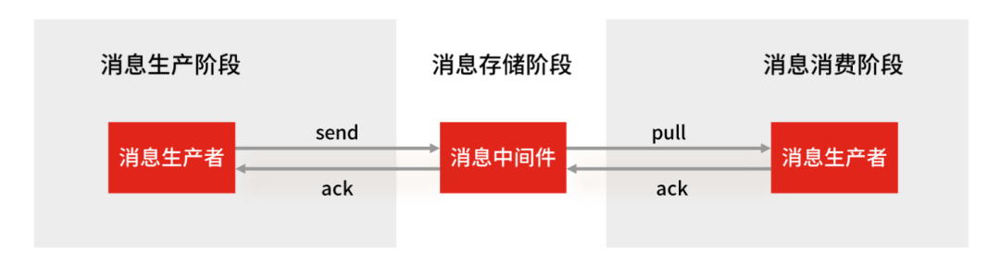

# 四种特殊数据类型

## Geospatial 地理位置

:::note 介绍
Redis 3.2 中增加了对GEO类型的支持。GEO，Geographic，地理信息的缩写。该类型，就是元素的2维坐标，在地图上就是经纬度。redis基于该类型，提供了经纬度设置，查询，范围查询，距离查询，经纬度Hash等常见操作。
:::

### 内部实现

GEO 本身并没有设计新的底层数据结构，而是直接使用了 Sorted Set 集合类型。

GEO 类型使用 GeoHash 编码方法实现了经纬度到 Sorted Set 中元素权重分数的转换，这其中的两个关键机制就是「对二维地图做区间划分」和「对区间进行编码」。一组经纬度落在某个区间后，就用区间的编码值来表示，并把编码值作为 Sorted Set 元素的权重分数。

这样一来，我们就可以把经纬度保存到 Sorted Set 中，利用 Sorted Set 提供的“按权重进行有序范围查找”的特性，实现 LBS 服务中频繁使用的“搜索附近”的需求。

### geoadd

> 添加地理位置
>
> 规则：两级无法直接添加，一般会下载城市数据，直接通过java程序一次性导入！
>
> 有效的经度从-180度到180度。
>
> 有效的纬度从-85.05112878度到85.05112878度。

```bash
127.0.0.1:6379> GEOADD china:city 116.40 39.90 beijing
(integer) 1
127.0.0.1:6379> GEOADD china:city 121.47 31.23 shanghai
(integer) 1
127.0.0.1:6379> GEOADD china:city 106.50 29.53 chongqing 114.05 22.52 shengzhen
(integer) 2
127.0.0.1:6379> GEOADD china:city 120.16 30.24 hangzhou 108.96 34.26 xian
(integer) 2
```

### geopos

> 获取指定的城市的经度和纬度！

```bash
127.0.0.1:6379> GEOPOS china:city beijing
1) 1) "116.39999896287918091"
   2) "39.90000009167092543"
127.0.0.1:6379> GEOPOS china:city shanghai hangzhou
1) 1) "121.47000163793563843"
   2) "31.22999903975783553"
2) 1) "120.1600000262260437"
   2) "30.2400003229490224"
```

### geodist

> 获取两地之间的距离

**单位**:

- m 米
- km 千米
- mi 英里
- ft 英尺

```bash
127.0.0.1:6379> GEODIST china:city beijing chongqing km
"1464.0708"
127.0.0.1:6379> GEODIST china:city shanghai hangzhou km
"166.7613"
```

### georadius

> 以给定的经纬度为中心， 找出某一半径内的元素

```bash
127.0.0.1:6379> GEORADIUS china:city 120 28 500 km #以(120,28)这个坐标寻找方圆500km的城市
1) "hangzhou"
2) "shanghai"
127.0.0.1:6379> GEORADIUS china:city 120 28 500 km WITHDIST #显示到目标之间的距离
1) 1) "hangzhou"
   2) "249.6314"
2) 1) "shanghai"
   2) "386.3449"
127.0.0.1:6379> GEORADIUS china:city 120 28 500 km WITHCOORD #显示目标的经纬度
1) 1) "hangzhou"
   2) 1) "120.1600000262260437"
      2) "30.2400003229490224"
2) 1) "shanghai"
   2) 1) "121.47000163793563843"
      2) "31.22999903975783553"
127.0.0.1:6379> GEORADIUS china:city 120 28 500 km WITHDIST WITHCOORD count 1 #显示指定的个数
1) 1) "hangzhou"
   2) "249.6314"
   3) 1) "120.1600000262260437"
      2) "30.2400003229490224"
```

### georadiusbymember

> 找出位于指定元素周围的其他元素！

```bash
127.0.0.1:6379> GEORADIUSBYMEMBER china:city hangzhou 500 km
1) "hangzhou"
2) "shanghai"
```

### geohash

> 返回一个或多个位置元素的 geohash 表示

```bash
# 将二维的经纬度转换为一维的字符串，如果两个字符串越接近，那么则距离越近！
127.0.0.1:6379> GEOHASH china:city hangzhou shanghai
1) "wtmkn31bfb0"
2) "wtw3sj5zbj0"
```

### 实现原理

> GEO 底层的实现原理其实就是 Zset！我们可以使用Zset命令来操作geo！

```bash
127.0.0.1:6379> ZRANGE china:city 0 -1 # 查看地图中全部的元素
1) "chongqing"
2) "xian"
3) "shengzhen"
4) "hangzhou"
5) "shanghai"
6) "beijing"
127.0.0.1:6379> ZREM china:city xian # 移除指定的元素
(integer) 1
127.0.0.1:6379> ZRANGE china:city 0 -1
1) "chongqing"
2) "shengzhen"
3) "hangzhou"
4) "shanghai"
5) "beijing"
```

## Hyperloglog 基数统计

::: note 介绍
Redis HyperLogLog 是 Redis 2.8.9 版本新增的数据类型，是一种用于「统计基数」的数据集合类型，基数统计就是指统计一个集合中不重复的元素个数。但要注意，HyperLogLog 是统计规则是基于概率完成的，不是非常准确，标准误算率是 0.81%。
:::

所以，简单来说 HyperLogLog **提供不精确的去重计数**。

HyperLogLog 的优点是，在输入元素的数量或者体积非常非常大时，计算基数所需的内存空间总是固定的、并且是很小的。

在 Redis 里面，**每个 HyperLogLog 键只需要花费 12 KB 内存，就可以计算接近 2^64 个不同元素的基数**，和元素越多就越耗费内存的 Set 和 Hash 类型相比，HyperLogLog 就非常节省空间。

这什么概念？举个例子给大家对比一下。

用 Java 语言来说，一般 long 类型占用 8 字节，而 1 字节有 8 位，即：1 byte = 8 bit，即 long 数据类型最大可以表示的数是：`2^63-1`。对应上面的`2^64`个数，假设此时有`2^63-1`这么多个数，从 `0 ~ 2^63-1`，按照`long`以及`1k = 1024 字节`的规则来计算内存总数，就是：`((2^63-1) * 8/1024)K`，这是很庞大的一个数，存储空间远远超过`12K`，而`HyperLogLog`却可以用`12K`就能统计完。

**什么是基数?**

比如数据集 {1, 3, 5, 7, 5, 7, 8}， 那么这个数据集的基数集为 {1, 3, 5 ,7, 8}, 基数(不重复元素)为5。 基数估计就是在误差可接受的范围内，快速计算基数。

### 实例

::: note 命令
语法：<span style="color:mediumvioletred;font-weight:bold">pfadd key [element [element ...]]</span>

说明：添加指定元素到hyperloglog中，如果指定的键不存在，该命令会自动创建一个空的hyperloglog结构

    注：添加的元素已存在的话将不在执行计数统计，都为相同元素的话将返回0，若有添加成功的都会返回1

语法：<span style="color:mediumvioletred;font-weight:bold">pfcount key [key ...]</span>

说明：返回一个或多个键内统计基数（就是返回不相同的元素个数，用来统计），计算统计误差在0.81%

语法：<span style="color:mediumvioletred;font-weight:bold">pfmerge destkey sourcekey [sourcekey ...]</span>

说明：统计一个或多个键内统计基数并放到外部集合里
:::

```bash
127.0.0.1:6379> PFADD key1 a b c d c b # 创建第一组元素 key1
(integer) 1
127.0.0.1:6379> PFCOUNT key1 # 统计 key1 元素的基数数量
(integer) 4
127.0.0.1:6379> PFADD key2 d e f # 创建第二组元素 key2
(integer) 1
127.0.0.1:6379> PFCOUNT key2
(integer) 3
127.0.0.1:6379> PFMERGE key3 key1 key2 #合并 key1 key2 到 key3 (并集)
OK
127.0.0.1:6379> PFCOUNT key3 #统计并集的数量
(integer) 6
```

### 应用场景

#### 百万级网页 UV 计数

Redis HyperLogLog  优势在于只需要花费 12 KB 内存，就可以计算接近 2^64 个元素的基数，和元素越多就越耗费内存的 Set 和 Hash 类型相比，HyperLogLog 就非常节省空间。

所以，非常适合统计百万级以上的网页 UV 的场景。

在统计 UV 时，你可以用 PFADD 命令（用于向 HyperLogLog 中添加新元素）把访问页面的每个用户都添加到 HyperLogLog 中。

`PFADD page1:uv user1 user2 user3 user4 user5`

接下来，就可以用 PFCOUNT 命令直接获得 page1 的 UV 值了，这个命令的作用就是返回 HyperLogLog 的统计结果。

`PFCOUNT page1:uv`

不过，有一点需要你注意一下，HyperLogLog 的统计规则是基于概率完成的，所以它给出的统计结果是有一定误差的，标准误算率是 0.81%。

这也就意味着，你使用 HyperLogLog 统计的 UV 是 100 万，但实际的 UV 可能是 101 万。虽然误差率不算大，但是，如果你需要精确统计结果的话，最好还是继续用 Set 或 Hash 类型。

## Bitmap 位存储

> Bitmap，即位图，是一串连续的二进制数组（0和1），可以通过偏移量（offset）定位元素。BitMap通过最小的单位bit来进行`0|1`的设置，表示某个元素的值或者状态，时间复杂度为O(1)。
>
> 由于 bit 是计算机中最小的单位，使用它进行储存将非常节省空间，特别适合一些数据量大且使用**二值统计的场景**。

Redis提供了Bitmaps这个 "数据类型" 可以实现对位的操作：

1. Bitmaps本身不是一种数据类型， 实际上它就是字符串（key-value），但是它可以对字符串的位进行操作。
2. Bitmaps单独提供了一套命令， 所以在Redis中使用Bitmaps和使用字符串的方法不太相同。 可以把Bitmaps想象成一个以位为单位的数组， 数组的每个单元只能存储0和1， 数组的下标在Bitmaps中叫做偏移量。


### 常用命令

bitmap 基本操作：

```bash
# 设置值，其中value只能是 0 和 1
SETBIT key offset value

# 获取值
GETBIT key offset

# 获取指定范围内值为 1 的个数
# start 和 end 以字节为单位
BITCOUNT key start end
```

bitmap 运算操作：

```bash
# BitMap间的运算
# operations 位移操作符，枚举值
  AND 与运算 &
  OR 或运算 |
  XOR 异或 ^
  NOT 取反 ~
# result 计算的结果，会存储在该key中
# key1 … keyn 参与运算的key，可以有多个，空格分割，not运算只能一个key
# 当 BITOP 处理不同长度的字符串时，较短的那个字符串所缺少的部分会被看作 0。返回值是保存到 destkey 的字符串的长度（以字节byte为单位），和输入 key 中最长的字符串长度相等。
BITOP [operations] [result] [key1] [keyn…]

# 返回指定key中第一次出现指定value(0/1)的位置
BITPOS [key] [value]
```

### 应用场景

Bitmap 类型非常适合二值状态统计的场景，这里的二值状态就是指集合元素的取值就只有 0 和 1 两种，在记录海量数据时，Bitmap 能够有效地节省内存空间。

#### 签到统计

假设我们要统计 ID 100 的用户在 2022 年 6 月份的签到情况，就可以按照下面的步骤进行操作。

```bash
#第一步，执行下面的命令，记录该用户 6 月 3 号已签到。
SETBIT uid:sign:100:202206 2 1
#第二步，检查该用户 6 月 3 日是否签到。
GETBIT uid:sign:100:202206 2
#第三步，统计该用户在 6 月份的签到次数。
BITCOUNT uid:sign:100:202206
```

> 如何统计这个月首次打卡时间呢？

Redis 提供了`BITPOS key bitValue [start] [end]`指令，返回数据表示 Bitmap 中第一个值为`bitValue`的 offset 位置。

在默认情况下，命令将检测整个位图，用户可以通过可选的`start`参数和`end`参数指定要检测的范围。所以我们可以通过执行这条命令来获取 userID = 100 在 2022 年 6 月份**首次打卡**日期：

`BITPOS uid:sign:100:202206 1`

需要注意的是，因为 offset 从 0 开始的，所以我们需要将返回的 value + 1 。

#### 判断用户登陆态

Bitmap 提供了`GETBIT`、`SETBIT`操作，通过一个偏移值 offset 对 bit 数组的 offset 位置的 bit 位进行读写操作，需要注意的是 offset 从 0 开始。

只需要一个 key = login_status 表示存储用户登陆状态集合数据， 将用户 ID 作为 offset，在线就设置为 1，下线设置 0。通过`GETBIT`判断对应的用户是否在线。50000 万 用户只需要 6 MB 的空间。

假如我们要判断 ID = 10086 的用户的登陆情况：

```bash
#第一步，执行以下指令，表示用户已登录。
SETBIT login_status 10086 1
#第二步，检查该用户是否登陆，返回值 1 表示已登录。
GETBIT login_status 10086
#第三步，登出，将 offset 对应的 value 设置成 0。
SETBIT login_status 10086 0
```

#### 连续签到用户总数

如何统计出这连续 7 天连续打卡用户总数呢？

我们把每天的日期作为 Bitmap 的 key，userId 作为 offset，若是打卡则将 offset 位置的 bit 设置成 1。

key 对应的集合的每个 bit 位的数据则是一个用户在该日期的打卡记录。

一共有 7 个这样的 Bitmap，如果我们能对这 7 个 Bitmap 的对应的 bit 位做 『与』运算。同样的 UserID offset 都是一样的，当一个 userID 在 7 个 Bitmap 对应对应的 offset 位置的 bit = 1 就说明该用户 7 天连续打卡。

结果保存到一个新 Bitmap 中，我们再通过`BITCOUNT`统计 bit = 1 的个数便得到了连续打卡 3 天的用户总数了。

Redis 提供了`BITOP operation destkey key [key ...]`这个指令用于对一个或者多个 key 的 Bitmap 进行位元操作。

- `opration`可以是`and`、`OR`、`NOT`、`XOR`。当 BITOP 处理不同长度的字符串时，较短的那个字符串所缺少的部分会被看作`0` 。空的`key`也被看作是包含`0`的字符串序列。

举个例子，比如将三个 bitmap 进行 AND 操作，并将结果保存到 destmap 中，接着对 destmap 执行 BITCOUNT 统计。

```bash
# 与操作
BITOP AND destmap bitmap:01 bitmap:02 bitmap:03
# 统计 bit 位 =  1 的个数
BITCOUNT destmap
```

即使一天产生一个亿的数据，Bitmap 占用的内存也不大，大约占 12 MB 的内存（10^8/8/1024/1024），7 天的 Bitmap 的内存开销约为 84 MB。同时我们最好给 Bitmap 设置过期时间，让 Redis 删除过期的打卡数据，节省内存。

## Stream

> Redis Stream 是 Redis 5.0 版本新增加的数据类型，Redis 专门为消息队列设计的数据类型。
>
> 在前面介绍 List 类型实现的消息队列，有两个问题：1. 生产者需要自行实现全局唯一 ID；2. 不能以消费组形式消费数据。
>
> 基于 Stream 类型的消息队列就解决上面的问题，它不仅支持自动生成全局唯一 ID，而且支持以消费组形式消费数据。

### 常见命令

Stream 消息队列操作命令：

- XADD：插入消息，保证有序，可以自动生成全局唯一 ID；
- XREAD：用于读取消息，可以按 ID 读取数据；
- XREADGROUP：按消费组形式读取消息；
- XPENDING 和 XACK：
  - XPENDING 命令可以用来查询每个消费组内所有消费者已读取但尚未确认的消息，而 XACK 命令用于向消息队列确认消息处理已完成。

### 应用场景

#### 消息队列

生产者通过 XADD 命令插入一条消息：

```bash
# * 表示让 Redis 为插入的数据自动生成一个全局唯一的 ID
# 往名称为 mymq 的消息队列中插入一条消息，消息的键是 name，值是 xiaolin
> XADD mymq * name xiaolin
"1654254953808-0"
```

插入成功后会返回全局唯一的 ID："1654254953808-0"。消息的全局唯一 ID 由两部分组成：

- 第一部分“1654254953808”是数据插入时，以毫秒为单位计算的当前服务器时间；
- 第二部分表示插入消息在当前毫秒内的消息序号，这是从 0 开始编号的。例如，“1654254953808-0”就表示在“1654254953808”毫秒内的第 1 条消息。

消费者通过 XREAD 命令从消息队列中读取消息时，可以指定一个消息 ID，并从这个消息 ID 的下一条消息开始进行读取（注意是输入消息 ID 的下一条信息开始读取，不是查询输入ID的消息）。

```bash
# 从 ID 号为 1654254953807-0 的消息开始，读取后续的所有消息（示例中一共 1 条）。
> XREAD Stream mymq 1654254953807-0
1) 1) "mymq"
   2) 1) 1) "1654254953808-0"
         2) 1) "name"
            2) "xiaolin"
```

如果想要实现阻塞读（当没有数据时，阻塞住），可以调用 XRAED 时设定 block 配置项，实现类似于 BRPOP 的阻塞读取操作。
比如，下面这命令，设置了 block 10000 的配置项，10000 的单位是毫秒，表明 XREAD 在读取最新消息时，如果没有消息到来，XREAD 将阻塞 10000 毫秒（即 10 秒），然后再返回。

```bash
# 命令最后的“$”符号表示读取最新的消息
> XREAD block 10000 Stream mymq $
(nil)
(10.00s)
```

前面介绍的这些操作 List 也支持的，接下来看看 Stream 特有的功能。

Stream 可以以使用 XGROUP 创建消费组，创建消费组之后，Stream 可以使用 XREADGROUP 命令让消费组内的消费者读取消息。

创建一个名为 group1 的消费组，这个消费组消费的消息队列是 mymq：

```bash
# 创建一个名为 group1 的消费组
> XGROUP create mymq group1 0
OK
```

消费组 group1 内的消费者 consumer1 从 mymq 消息队列中读取所有消息的命令如下：

```bash
# 命令最后的参数“>”，表示从第一条尚未被消费的消息开始读取。
> XREADGROUP group group1 consumer1 Stream mymq >
1) 1) "mymq"
   2) 1) 1) "1654254953808-0"
         2) 1) "name"
            2) "xiaolin"
```

消息队列中的消息一旦被消费组里的一个消费者读取了，就不能再被该消费组内的其他消费者读取了。

比如说，我们执行完刚才的 XREADGROUP 命令后，再执行一次同样的命令，此时读到的就是空值了：

```bash
> XREADGROUP group group1 consumer1 Stream mymq >
(nil)
```

**使用消费组的目的是让组内的多个消费者共同分担读取消息，所以，我们通常会让每个消费者读取部分消息，从而实现消息读取负载在多个消费者间是均衡分布的**。

例如，我们执行下列命令，让 group2 中的 consumer1、2、3 各自读取一条消息。

```bash
# 让 group2 中的 consumer1 从 mymq 消息队列中消费一条消息
> XREADGROUP group group2 consumer1 count 1 Stream mymq >
1) 1) "mymq"
   2) 1) 1) "1654254953808-0"
         2) 1) "name"
            2) "xiaolin"
# 让 group2 中的 consumer2 从 mymq 消息队列中消费一条消息
> XREADGROUP group group2 consumer2 count 1 Stream mymq >
1) 1) "mymq"
   2) 1) 1) "1654256265584-0"
         2) 1) "name"
            2) "xiaolincoding"
# 让 group2 中的 consumer3 从 mymq 消息队列中消费一条消息
> XREADGROUP group group2 consumer3 count 1 Stream mymq >
1) 1) "mymq"
   2) 1) 1) "1654256271337-0"
         2) 1) "name"
            2) "Tom"
```

> 基于 Stream 实现的消息队列，如何保证消费者在发生故障或宕机再次重启后，仍然可以读取未处理完的消息？

Streams 会自动使用内部队列（也称为 PENDING List）留存消费组里每个消费者读取的消息，直到消费者使用 XACK 命令通知 Streams“消息已经处理完成”。

如果消费者没有成功处理消息，它就不会给 Streams 发送 XACK 命令，消息仍然会留存。此时，**消费者可以在重启后，用 XPENDING 命令查看已读取、但尚未确认处理完成的消息**。

例如，我们来查看一下 group2 中各个消费者已读取、但尚未确认的消息个数，命令如下：

```bash
127.0.0.1:6379> XPENDING mymq group2
1) (integer) 3
2) "1654254953808-0"  # 表示 group2 中所有消费者读取的消息最小 ID
3) "1654256271337-0"  # 表示 group2 中所有消费者读取的消息最大 ID
4) 1) 1) "consumer1"
      2) "1"
   2) 1) "consumer2"
      2) "1"
   3) 1) "consumer3"
      2) "1"
```

如果想查看某个消费者具体读取了哪些数据，可以执行下面的命令：

```bash
# 查看 group2 里 consumer2 已从 mymq 消息队列中读取了哪些消息
> XPENDING mymq group2 - + 10 consumer2
1) 1) "1654256265584-0"
   2) "consumer2"
   3) (integer) 410700
   4) (integer) 1
```

可以看到，consumer2 已读取的消息的 ID 是 1654256265584-0。

**一旦消息 1654256265584-0 被 consumer2 处理了，consumer2 就可以使用 XACK 命令通知 Streams，然后这条消息就会被删除**。

```bash
> XACK mymq group2 1654256265584-0
(integer) 1
```

当我们再使用 XPENDING 命令查看时，就可以看到，consumer2 已经没有已读取、但尚未确认处理的消息了。

```bash
> XPENDING mymq group2 - + 10 consumer2
(empty array)
```

好了，基于 Stream 实现的消息队列就说到这里了，小结一下：

- 消息保序：XADD/XREAD
- 阻塞读取：XREAD block
- 重复消息处理：Stream 在使用  XADD 命令，会自动生成全局唯一 ID；
- 消息可靠性：内部使用 PENDING List 自动保存消息，使用 XPENDING 命令查看消费组已经读取但是未被确认的消息，消费者使用 XACK 确认消息；
- 支持消费组形式消费数据

> Redis 基于 Stream 消息队列与专业的消息队列有哪些差距？

一个专业的消息队列，必须要做到两大块：

- **消息不丢。**
- **消息可堆积。**

_1、Redis Stream 消息会丢失吗？_

使用一个消息队列，其实就分为三大块：**生产者、队列中间件、消费者**，所以要保证消息就是保证三个环节都不能丢失数据。



Redis Stream 消息队列能不能保证三个环节都不丢失数据？

- Redis 生产者会不会丢消息？生产者会不会丢消息，取决于生产者对于异常情况的处理是否合理。从消息被生产出来，然后提交给 MQ 的过程中，只要能正常收到 （ MQ 中间件） 的 ack 确认响应，就表示发送成功，所以只要处理好返回值和异常，如果返回异常则进行消息重发，那么这个阶段是不会出现消息丢失的。
- Redis 消费者会不会丢消息？不会，因为 Stream （ MQ 中间件）会自动使用内部队列（也称为 PENDING List）留存消费组里每个消费者读取的消息，但是未被确认的消息。消费者可以在重启后，用 XPENDING 命令查看已读取、但尚未确认处理完成的消息。等到消费者执行完业务逻辑后，再发送消费确认 XACK 命令，也能保证消息的不丢失。
- Redis 队列中间件会不会丢消息？会，Redis 在以下 2 个场景下，都会导致数据丢失：
  - AOF 持久化配置为每秒写盘，但这个写盘过程是异步的，Redis 宕机时会存在数据丢失的可能
  - 主从复制也是异步的，主从切换时，也存在丢失数据的可能。

可以看到，Redis 在队列中间件环节无法保证消息不丢。像 RabbitMQ 或 Kafka 这类专业的队列中间件，在使用时是部署一个集群，生产者在发布消息时，队列中间件通常会写「多个节点」，也就是有多个副本，这样一来，即便其中一个节点挂了，也能保证集群的数据不丢失。

_2、Redis Stream 消息可堆积吗？_

Redis 的数据都存储在内存中，这就意味着一旦发生消息积压，则会导致 Redis 的内存持续增长，如果超过机器内存上限，就会面临被 OOM 的风险。所以 Redis 的 Stream 提供了可以指定队列最大长度的功能，就是为了避免这种情况发生。

但 Kafka、RabbitMQ 专业的消息队列它们的数据都是存储在磁盘上，当消息积压时，无非就是多占用一些磁盘空间。

因此，把 Redis 当作队列来使用时，会面临的 2 个问题：

- Redis 本身可能会丢数据；
- 面对消息挤压，内存资源会紧张；

所以，能不能将 Redis 作为消息队列来使用，关键看你的业务场景：

- 如果你的业务场景足够简单，对于数据丢失不敏感，而且消息积压概率比较小的情况下，把 Redis 当作队列是完全可以的。
- 如果你的业务有海量消息，消息积压的概率比较大，并且不能接受数据丢失，那么还是用专业的消息队列中间件吧。

## 总结

Redis 常见的五种数据类型：String（字符串），Hash（哈希），List（列表），Set（集合）及 Zset(sorted set：有序集合)。

这五种数据类型都由多种数据结构实现的，主要是出于时间和空间的考虑，当数据量小的时候使用更简单的数据结构，有利于节省内存，提高性能。

这五种数据类型与底层数据结构对应关系图如下，左边是 Redis 3.0版本的，也就是《Redis 设计与实现》这本书讲解的版本，现在看还是有点过时了，右边是现在 Github 最新的 Redis 代码的。


可以看到，Redis 数据类型的底层数据结构随着版本的更新也有所不同，比如：

- 在 Redis 3.0 版本中 List 对象的底层数据结构由「双向链表」或「压缩表列表」实现，但是在 3.2 版本之后，List 数据类型底层数据结构是由 quicklist 实现的；
- 在最新的 Redis 代码中，压缩列表数据结构已经废弃了，交由 listpack 数据结构来实现了。

Redis 五种数据类型的应用场景：

- String 类型的应用场景：缓存对象、常规计数、分布式锁等。
- List 类型的应用场景：消息队列（有两个问题：1. 生产者需要自行实现全局唯一 ID；2. 不能以消费组形式消费数据）等。
- Hash 类型：缓存对象、购物车等。
- Set 类型：聚合计算（并集、交集、差集）场景，比如点赞、共同关注、抽奖活动等。
- Zset 类型：排序场景，比如排行榜、电话和姓名排序等。

Redis 后续版本又支持四种数据类型，它们的应用场景如下：

- BitMap（2.2 版新增）：二值状态统计的场景，比如签到、判断用户登陆状态、连续签到用户总数等；
- HyperLogLog（2.8 版新增）：海量数据基数统计的场景，比如百万级网页 UV 计数等；
- GEO（3.2 版新增）：存储地理位置信息的场景，比如滴滴叫车；
- Stream（5.0 版新增）：消息队列，相比于基于 List 类型实现的消息队列，有这两个特有的特性：自动生成全局唯一消息ID，支持以消费组形式消费数据。

针对 Redis 是否适合做消息队列，关键看你的业务场景：

- 如果你的业务场景足够简单，对于数据丢失不敏感，而且消息积压概率比较小的情况下，把 Redis 当作队列是完全可以的。
- 如果你的业务有海量消息，消息积压的概率比较大，并且不能接受数据丢失，那么还是用专业的消息队列中间件吧。
