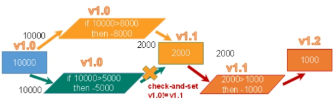

# Redis配置
```bash
# 多实例的情况可以把公用的配置文件提取出来
include /path/to/local.conf
include /path/to/other.conf

# 不写的情况下,无限制接受任何ip地址的访问
bind 127.0.0.1
protected-mode yes #开启保护模式

# 配置端口号
port 6379

# 客户端空闲N秒后关闭连接（0禁用）
timeout 0

# 对访问客户端的一种心跳检测,每个n秒检测一次
tcp-keepalive 300

# 以守护进程的方式运行,默认是 no,需要自己设置为yes
daemonize yes
```
# Redis事物
## **Redis的事务定义**
Redis事务是一个单独的隔离操作：事务中的所有命令都会序列化、按顺序地执行。事务在执行的过程中，不会被其他客户端发送来的命令请求所打断。

Redis事务的主要作用就是串联多个命令防止别的命令插队。

## Multi、Exec、discard
从输入Multi命令开始，输入的命令都会依次进入命令队列中，但不会执行，直到输入Exec后，Redis会将之前的命令队列中的命令依次执行。

组队的过程中可以通过discard来放弃组队。


### 案例
```bash
127.0.0.1:6379> MULTI #开启事物
OK
127.0.0.1:6379> SET k1 v1
QUEUED
127.0.0.1:6379> SET k2 v2
QUEUED
127.0.0.1:6379> GET k2
QUEUED
127.0.0.1:6379> SET k3 v3
QUEUED
127.0.0.1:6379> EXEC #执行事物
1) OK
2) OK
3) "v2"
4) OK
#------------放弃事物----------
127.0.0.1:6379> FLUSHDB
OK
127.0.0.1:6379> MULTI #开启事物
OK
127.0.0.1:6379> SET k1 v1
QUEUED
127.0.0.1:6379> SET k2 v2
QUEUED
127.0.0.1:6379> DISCARD #取消事物
OK
127.0.0.1:6379> GET k2 #事务队列中命令都不会被执行
(nil)
```
## 事务的错误处理
组队中某个命令出现了报告错误，执行时整个的所有队列都会被取消。


如果执行阶段某个命令报出了错误，则只有报错的命令不会被执行，而其他的命令都会执行，不会回滚。


### 案例
```bash
#------------编译型异常----------
127.0.0.1:6379> FLUSHDB
OK
127.0.0.1:6379> MULTI #开启事物
OK
127.0.0.1:6379> SET k1 v1
QUEUED
127.0.0.1:6379> SET k2 v2
QUEUED
127.0.0.1:6379> GETSET k2 #错误的命令
(error) ERR wrong number of arguments for 'getset' command
127.0.0.1:6379> SET k3 v3
QUEUED
127.0.0.1:6379> EXEC #执行事物报错
(error) EXECABORT Transaction discarded because of previous errors.
127.0.0.1:6379> GET k1 #所有的命令都不会被执行
(nil)
#------------运行时异常----------
127.0.0.1:6379> FLUSHDB
OK
127.0.0.1:6379> SET k1 v1
OK
127.0.0.1:6379> MULTI #开启事物
OK
127.0.0.1:6379> INCR k1 #会执行报错的命令
QUEUED
127.0.0.1:6379> SET k2 v2
QUEUED
127.0.0.1:6379> GET k2
QUEUED
127.0.0.1:6379> EXEC #执行事物 虽然第一条命令错误,但其余命令执行成功
1) (error) ERR value is not an integer or out of range
2) OK
3) "v2"
127.0.0.1:6379> GET k2
"v2"
```
## 为什么要有事务
会造成超卖


### 悲观锁


**悲观锁(Pessimistic Lock)**，顾名思义，就是很悲观，每次去拿数据的时候都认为别人会修改，所以每次在拿数据的时候都会上锁，这样别人想拿这个数据就会block直到它拿到锁。**传统的关系型数据库里边就用到了很多这种锁机制**，比如**行锁**，**表锁**等，**读锁**，**写锁**等，都是在做操作之前先上**锁**。

### 乐观锁


**乐观锁(Optimistic Lock)**，顾名思义，就是很乐观，每次去拿数据的时候都认为别人不会修改，所以不会上锁，但是在更新的时候会判断一下在此期间别人有没有去更新这个数据，可以使用版本号等机制。**乐观锁适用于多读的应用类型，这样可以提高吞吐量**。Redis就是利用这种check-and-set机制实现事务的。

### watch 监控
在执行 `multi` 之前，先执行watch key1 [key2]，可以监视一个(或多个) key ，如果在事务执行之前这个(或这些) key 被其他命令所改动，那么事务将被打断。
### unwatch 取消监控
取消 WATCH 命令对所有 key 的监视。

如果在执行 WATCH 命令之后，EXEC 命令或DISCARD 命令先被执行了的话，那么就不需要再执行UNWATCH 了。

**案例**

```bash
#正常执行成功案例
127.0.0.1:6379> SET money 100
OK
127.0.0.1:6379> SET out 0
OK
127.0.0.1:6379> WATCH money #监视money
OK
127.0.0.1:6379> MULTI
OK
127.0.0.1:6379> DECRBY money 20
QUEUED
127.0.0.1:6379> INCRBY out 20
QUEUED
127.0.0.1:6379> EXEC
1) (integer) 80
2) (integer) 20
#执行失败案例
127.0.0.1:6379> WATCH money
OK
127.0.0.1:6379> MULTI
OK
127.0.0.1:6379> DECRBY money 10
QUEUED
127.0.0.1:6379> INCRBY out 10
QUEUED
127.0.0.1:6379> EXEC #在执行之前另一个线程修改了money值,就会导致事物执行失败
(nil)
127.0.0.1:6379> UNWATCH #执行失败后,先解锁再次watch money 直到执行成功
OK
```
## Redis事务三特性

- **单独的隔离操作**
   - 事务中的所有命令都会序列化、按顺序地执行。事务在执行的过程中，不会被其他客户端发送来的命令请求所打断。  
- **没有隔离级别的概念 **
   - 队列中的命令没有提交之前都不会实际被执行，因为事务提交前任何指令都不会被实际执行
- **不保证原子性**
   - 事务中如果有一条命令执行失败，其后的命令仍然会被执行，没有回滚 

## Redis_事务_秒杀案例
**配置Jedis连接池**
```java
public class JedisPoolUtil {
    private static volatile JedisPool jedisPool = null;

    private JedisPoolUtil() {
    }

    public static JedisPool getJedisPoolInstance() {
        if (jedisPool == null) {
            synchronized (JedisPoolUtil.class) {
                JedisPoolConfig poolConfig = new JedisPoolConfig();
                poolConfig.setMaxTotal(200);
                poolConfig.setMaxIdle(32);
                poolConfig.setMaxWaitMillis(100 * 1000);
                poolConfig.setBlockWhenExhausted(true);
                poolConfig.setTestOnBorrow(true);// ping PONG

                jedisPool = new JedisPool(poolConfig, "192.168.2.128", 6379, 60000);
            }
        }
        return jedisPool;
    }

    public static void release(JedisPool jedisPool, Jedis jedis) {
        if (jedis != null) {
            jedisPool.returnResource(jedis);
        }
    }
}
```
使用Redis记录库存数 `sk:pid:stock` 和秒杀成功者清单 `sk:pid:user`
### 原始秒杀
```java
private static boolean seckill(String uid, String pid) {
    // 1.连接redis
    JedisPool jedisPool = JedisPoolUtil.getJedisPoolInstance();
    Jedis jedis = jedisPool.getResource();

    // 2.拼接key
    // 2.1库存key
    String stockKey = "sk:" + pid + ":stock";
    // 2.2秒杀成功用户key
    String userKey = "sk:" + pid + ":user";
    // 3.获取库存,如果库存为 null 秒杀还没有开始
    String stock = jedis.get(stockKey);
    if (stock == null) {
        System.out.println("秒杀还没有开始,请等待"); 
        jedis.close();
        return false;
    }
    // 4.判断用户是否重复秒杀操作
    if (jedis.sismember(userKey, uid)) {
        System.out.println("已经秒杀成功了,不能重复秒杀");
        jedis.close();
        return false;
    }
    // 5.判断如果商品数量,库存数量小于1,秒杀结束
    if (Integer.parseInt(stock) <= 0) {
        System.out.println("秒杀已经结束了");
        jedis.close();
        return false;
    }
    // 6.秒杀过程
    // 6.1 库存-1
    jedis.decr(stockKey);
    // 6.2 把秒杀成功用户添加到清单里面
    jedis.sadd(userKey, uid);
    System.out.println("秒杀成功了...");
    jedis.close();
    return true;
}
```
测试
```java
for (int i = 0; i < 100; i++) {
    new Thread(() -> {
        int uid = new Random().nextInt(9999);
        seckill(String.valueOf(uid), "1001");
    }).start();
}
```
结果会发生库存超卖问题 库存为负数
### 乐观锁解决超卖
```java
private static boolean seckill2(String uid, String pid) {
    JedisPool jedisPool = JedisPoolUtil.getJedisPoolInstance();
    Jedis jedis = jedisPool.getResource();

    String stockKey = "sk:" + pid + ":stock";
    String userKey = "sk:" + pid + ":user";
    // 监视库存
    jedis.watch(stockKey);
    String stock = jedis.get(stockKey);
    if (stock == null) {
        System.out.println("秒杀还没有开始,请等待");
        jedis.close();
        return false;
    }
    if (jedis.sismember(userKey, uid)) {
        System.out.println("已经秒杀成功了,不能重复秒杀");
        jedis.close();
        return false;
    }
    if (Integer.parseInt(stock) <= 0) {
        System.out.println("秒杀已经结束了");
        jedis.close();
        return false;
    }
    // 使用事务
    Transaction multi = jedis.multi();
    // 组队操作
    multi.decr(stockKey);
    multi.sadd(userKey, uid);
    // 执行
    List<Object> result = multi.exec();

    if (result == null || result.size() == 0) {
        System.out.println("秒杀失败了");
        jedis.close();
        return false;
    }
    System.out.println("秒杀成功了...");
    jedis.close();
    return true;
}
```
测试同上

结果会造成库存遗留问题 库存没买完

### 使用LUA脚本**解决库存遗留**
**LUA脚本在Redis中的优势**

将复杂的或者多步的redis操作，写为一个脚本，一次提交给redis执行，减少反复连接redis的次数。提升性能。

LUA脚本是类似redis事务，有一定的原子性，不会被其他命令插队，可以完成一些redis事务性的操作。

但是注意redis的lua脚本功能，只有在Redis 2.6以上的版本才可以使用。

利用lua脚本淘汰用户，解决超卖问题。

redis 2.6版本以后，通过lua脚本解决争抢问题，实际上是redis 利用其单线程的特性，用任务队列的方式解决多任务并发问题。

```lua
local uid=KEYS[1];
local pid=KEYS[2];
local stockKey="sk:"..pid..":stock";
local usersKey="sk:"..pid..":user"; 
local userExists=redis.call("sismember",usersKey,uid);
if tonumber(userExists)==1 then 
  return 2;
end
local num= redis.call("get" ,stockKey);
if tonumber(num)<=0 then 
  return 0; 
else 
  redis.call("decr",stockKey);
  redis.call("sadd",usersKey,uid);
end
return 1;
```
脚本的使用
```java
private static boolean seckill3(String uid, String pid) {
    // Lua 脚本
    String secKillScript = "local uid=KEYS[1]; \n" +
            "local pid=KEYS[2];\n" +
            "local stockKey=\"sk:\"..pid..\":stock\";\n" +
            "local usersKey=\"sk:\"..pid..\":user\"; \n" +
            "local userExists=redis.call(\"sismember\",usersKey,uid);\n" +
            "if tonumber(userExists)==1 then \n" +
            "  return 2;\n" +
            "end\n" +
            "local num= redis.call(\"get\" ,stockKey);\n" +
            "if tonumber(num)<=0 then \n" +
            "  return 0; \n" +
            "else \n" +
            "  redis.call(\"decr\",stockKey);\n" +
            "  redis.call(\"sadd\",usersKey,uid);\n" +
            "end\n" +
            "return 1;";

    JedisPool jedisPool = JedisPoolUtil.getJedisPoolInstance();
    Jedis jedis = jedisPool.getResource();
    String sha1 = jedis.scriptLoad(secKillScript);
    Object evalsha = jedis.evalsha(sha1, 2, uid, pid);
    String result = String.valueOf(evalsha);
    switch (result) {
        case "0":
            System.err.println("已抢空");
            break;
        case "1":
            System.out.println("抢购成功");
            break;
        case "2":
            System.err.println("该用户已抢过");
            break;
        default:
            System.out.println("抢购异常");
    }
    jedis.close();
    return true;
}
```
测试同上，能解决以上问题
# Redis持久化
Redis 是内存数据库，如果不将内存中的数据库状态保存到磁盘，那么一旦服务器进程退出，服务器中的数据库状态也会消失。所以 Redis 提供了持久化功能！
## RDB (Redis DataBase)
> 在指定的时间间隔内将内存中的数据集快照写入磁盘，也就是行话讲的Snapshot快照，它恢复时是将快照文件直接读到内存里。

Redis会单独创建（fork）一个子进程来进行持久化，会先将数据写入到一个临时文件中，待持久化过程都结束了，再用这个临时文件替换上次持久化好的文件。整个过程中，主进程是不进行任何IO操作的。

这就确保了极高的性能。如果需要进行大规模数据的恢复，且对于数据恢复的完整性不是非常敏感，那RDB方式要比AOF方式更加的高效。**RDB的缺点是最后一次持久化后的数据可能丢失。**我们默认的就是RDB，一般情况下不需要修改这个配置！

### Fork

- Fork的作用是复制一个与当前进程一样的进程。新进程的所有数据（变量、环境变量、程序计数器等） 数值都和原进程一致，但是是一个全新的进程，并作为原进程的子进程
- 在Linux程序中，fork()会产生一个和父进程完全相同的子进程，但子进程在此后多会exec系统调用，出于效率考虑，Linux中引入了“**写时复制技术**”
- **一般情况父进程和子进程会共用同一段物理内存**，只有进程空间的各段的内容要发生变化时，才会将父进程的内容复制一份给子进程。
### RDB持久化流程

### 触发机制

- save的规则满足的情况下，会自动触发rdb规则
- 执行 flushall 命令，会触发rdb规则，产生 dump.rdb 文件，但里面是空的，无意义
- 退出redis，会产生 rdb 文件
### 配置位置
```bash
127.0.0.1:6379> CONFIG GET dir
1) "dir"
2) "/data"
```
### 如何触发RDB快照：保持策略
**配置文件中默认的快照配置**

```bash
save 900 1 # 900秒(15分钟)内至少有1个key被修改
save 300 10 # 300秒(5分钟)内至少有10个key被修改
save 60 10000 # 60秒内至少有10000个key被修改
```
**命令 SAVE vs BGSAVE**

- save ：save时只管保存，其它不管，全部阻塞。手动保存。不建议。
- **bgsave：Redis会在后台异步进行快照操作， 快照同时还可以响应客户端请求。**
```bash
127.0.0.1:6379> BGSAVE
Background saving started
127.0.0.1:6379> LASTSAVE #获取最后一次成功执行快照的时间
(integer) 1621218852 #单位:秒
```
### 优点:

- 适合大规模的数据恢复
- 对数据的完整性要不高
- 节省磁盘空间
- 恢复速度快
### 缺点:

- Fork的时候，内存中的数据被克隆了一份，大致2倍的膨胀性需要考虑
- 虽然Redis在fork时使用了写时拷贝技术,但是如果数据庞大时还是比较消耗性能。
- 在备份周期在一定间隔时间做一次备份，所以如果Redis意外down掉的话，就会丢失最后一次快照后的所有修改。
## AOF (Append Only File)
> 以**日志**的形式来记录每个写操作，将Redis执行过的所有指令记录下来（**读操作不记录**），**只许追加文件但不可以改写文件**，redis启动之初会读取该文件重新构建数据，换言之，redis重启的话就根据日志文件的内容将写指令从前到后执行一次以完成数据的恢复工作

### AOF持久化流程

1. 客户端的请求写命令会被append追加到AOF缓冲区内；
2. AOF缓冲区根据AOF持久化策略[always,everysec,no]将操作sync同步到磁盘的AOF文件中；
3. AOF文件大小超过重写策略或手动重写时，会对AOF文件rewrite重写，压缩AOF文件容量；
4. Redis服务重启时，会重新load加载AOF文件中的写操作达到数据恢复的目的；
### 优点

- 备份机制更稳健，丢失数据概率更低。
- 可读的日志文本，通过操作AOF稳健，可以处理误操作。
### 缺点

- 比起RDB占用更多的磁盘空间。
- 恢复备份速度要慢。
- 每次读写都同步的话，有一定的性能压力。
- 存在个别Bug，造成不能恢复。
## 用哪个好
官方推荐两个都启用。

如果对数据不敏感，可以选单独用RDB。

不建议单独用 AOF，因为可能会出现Bug。

如果只是做纯内存缓存，可以都不用。

## 官网建议

1. RDB 持久化方式能够在指定的时间间隔内对你的数据进行快照存储
2. AOF 持久化方式记录每次对服务器写的操作，当服务器重启的时候会重新执行这些命令来恢复原始的数据，AOF命令以Redis  协议追加保存每次写的操作到文件末尾，Redis还能对AOF文件进行后台重写，使得AOF文件的体积不至于过大。
3. 只做缓存，如果你只希望你的数据在服务器运行的时候存在，你也可以不使用任何持久化
4. 同时开启两种持久化方式
   - 在这种情况下，当redis重启的时候会优先载入AOF文件来恢复原始的数据，因为在通常情况下AOF 文件保存的数据集要比RDB文件保存的数据集要完整。
   - RDB 的数据不实时，同时使用两者时服务器重启也只会找AOF文件，那要不要只使用AOF呢？作者建议不要，因为RDB更适合用于备份数据库（AOF在不断变化不好备份），快速重启，而且不会有AOF可能潜在的Bug，留着作为一个万一的手段。
5. 性能建议
   - 因为RDB文件只用作后备用途，建议只在Slave上持久化RDB文件，而且只要15分钟备份一次就够了，只保留 save 900 1 这条规则。
   - 如果Enable AOF ，好处是在最恶劣情况下也只会丢失不超过两秒数据，启动脚本较简单只load自己的AOF文件就可以了，代价一是带来了持续的IO，二是AOF rewrite 的最后将 rewrite 过程中产生的新数据写到新文件造成的阻塞几乎是不可避免的。只要硬盘许可，应该尽量减少AOF rewrite 的频率，AOF重写的基础大小默认值64M太小了，可以设到5G以上，默认超过原大小100%大小重写可以改到适当的数值。
   - 如果不Enable AOF ，仅靠 Master-Slave Repllcation 实现高可用性也可以，能省掉一大笔IO，也减少了rewrite时带来的系统波动。代价是如果Master/Slave  同时倒掉，会丢失十几分钟的数据， 启动脚本也要比较两个 Master/Slave 中的 RDB文件，载入较新的那个，微博就是这种架构。

# Redis主从复制
> 主从复制，是指将一台Redis服务器的数据，复制到其他的Redis服务器。前者称为主节点(master/leader)，后者称为从节点(slave/follower)；数据的复制是单向的，只能由主节点到从节点。Master以写为主，Slave 以读为主。

默认情况下，每台Redis服务器都是主节点

且一个主节点可以有多个从节点(或没有从节点)，但一个从节点只能有一个主节点。

**主从复制的作用主要包括：**

- 数据冗余：主从复制实现了数据的热备份，是持久化之外的一种数据冗余方式。
- 故障恢复：当主节点出现问题时，可以由从节点提供服务，实现快速的故障恢复；实际上是一种服务  的冗余。
- 负载均衡：在主从复制的基础上，配合读写分离，可以由主节点提供写服务，由从节点提供读服务
(即写Redis数据时应用连接主节点，读Redis数据时应用连接从节点)，分担服务器负载；尤其是在写少读多的场景下，通过多个从节点分担读负载，可以大大提高Redis服务器的并发量。
- 高可用（集群）基石：除了上述作用以外，主从复制还是哨兵和集群能够实施的基础，因此说主从复  制是Redis高可用的基础。

## 搭建
**docker-compose.yml**
```yaml
version: '3'
services:
  master:
    image: redis
    container_name: redis-master
    command: redis-server --requirepass 123456  --masterauth 123456
    ports:
      - 6380:6379
  slave1:
    image: redis
    container_name: redis-slave-1
    ports:
      - 6381:6379
    command:  redis-server --slaveof redis-master 6379 --requirepass 123456 --masterauth 123456
  slave2:
    image: redis
    container_name: redis-slave-2
    ports:
      - 6382:6379
    command: redis-server --slaveof redis-master 6379 --requirepass 123456 --masterauth 123456
```

**验证**
主服务器
```bash
docker exec -it redis-master redis-cli
127.0.0.1:6379> auth 123456
OK
127.0.0.1:6379> ping
PONG
127.0.0.1:6379> set key chen
OK
127.0.0.1:6379> INFO replication
# Replication
role:master
connected_slaves:2 #可以看到有两个从节点
slave0:ip=172.18.0.3,port=6379,state=online,offset=1343,lag=0
slave1:ip=172.18.0.2,port=6379,state=online,offset=1343,lag=0
master_replid:54d035f0e0eb1d4539ec132d4545827a7a345f7b
master_replid2:0000000000000000000000000000000000000000
master_repl_offset:1343
second_repl_offset:-1
repl_backlog_active:1
repl_backlog_size:1048576
repl_backlog_first_byte_offset:1
repl_backlog_histlen:1343
```

从服务器
```bash
docker exec -it redis-slave-1 redis-cli
127.0.0.1:6379> auth 123456
OK
127.0.0.1:6379> ping
PONG
127.0.0.1:6379> set k1 v1 #可以看到从服务器不能写入
(error) READONLY You can't write against a read only replica.
127.0.0.1:6379> get key
"chen"
127.0.0.1:6379> INFO replication
# Replication
role:slave
master_host:redis-master
master_port:6379
master_link_status:up
master_last_io_seconds_ago:4
master_sync_in_progress:0
slave_repl_offset:1455
slave_priority:100
slave_read_only:1
connected_slaves:0
master_replid:54d035f0e0eb1d4539ec132d4545827a7a345f7b
master_replid2:0000000000000000000000000000000000000000
master_repl_offset:1455
second_repl_offset:-1
repl_backlog_active:1
repl_backlog_size:1048576
repl_backlog_first_byte_offset:1
repl_backlog_histlen:1455
```

# Redis哨兵模式
> 主从切换技术的方法是：当主服务器宕机后，需要手动把一台从服务器切换为主服务器，这就需要人工干预，费事费力，还会造成一段时间内服务不可用。这不是一种推荐的方式，更多时候，我们优先考虑哨兵模式。Redis从2.8开始正式提供了Sentinel（哨兵） 架构来解决这个问题。
>
> 谋朝篡位的自动版，能够后台监控主机是否故障，如果故障了根据投票数自动将从库转换为主库。
>
> 哨兵模式是一种特殊的模式，首先Redis提供了哨兵的命令，哨兵是一个独立的进程，作为进程，它会独立运行。其原理是哨兵通过发送命令，等待Redis服务器响应，从而监控运行的多个Redis实例。


这里的哨兵有两个作用

- 通过发送命令，让Redis服务器返回监控其运行状态，包括主服务器和从服务器。
- 当哨兵监测到master宕机，会自动将slave切换成master，然后通过发布订阅模式通知其他的从服务器，修改配置文件，让它们切换主机。

然而一个哨兵进程对Redis服务器进行监控，可能会出现问题，为此，我们可以使用多个哨兵进行监控。各个哨兵之间还会进行监控，这样就形成了多哨兵模式。


假设主服务器宕机，哨兵1先检测到这个结果，系统并不会马上进行failover过程，仅仅是哨兵1主观的认为主服务器不可用，这个现象成为主观下线。当后面的哨兵也检测到主服务器不可用，并且数量达到一定值时，那么哨兵之间就会进行一次投票，投票的结果由一个哨兵发起，进行failover[故障转移]操作。切换成功后，就会通过发布订阅模式，让各个哨兵把自己监控的从服务器实现切换主机，这个过程称为客观下线。

## 搭建
**docker-compose.yml**
```yaml
version: '3.4'
services:
  sentinel1:
    image: redis
    container_name: redis-sentinel-1
    command: redis-sentinel /usr/local/etc/redis/sentinel.conf
    restart: always
    ports:
      - 26379:26379
    volumes:
      - ./sentinel1.conf:/usr/local/etc/redis/sentinel.conf

  sentinel2:
    image: redis
    container_name: redis-sentinel-2
    command: redis-sentinel /usr/local/etc/redis/sentinel.conf
    restart: always
    ports:
      - 26380:26379
    volumes:
      - ./sentinel2.conf:/usr/local/etc/redis/sentinel.conf

  sentinel3:
    image: redis
    container_name: redis-sentinel-3
    command: redis-sentinel /usr/local/etc/redis/sentinel.conf
    restart: always
    ports:
      - 26381:26379
    volumes:
      - ./sentinel3.conf:/usr/local/etc/redis/sentinel.conf
```

sentinel.conf
```bash
port 26379
dir /tmp
sentinel monitor mymaster 192.168.174.129 6379 2 #自己的服务器ip
sentinel auth-pass mymaster 123456
sentinel down-after-milliseconds mymaster 30000
sentinel parallel-syncs mymaster 1
sentinel failover-timeout mymaster 180000
sentinel deny-scripts-reconfig yes
```

sentinel1.conf sentinel2.conf sentinel3.conf 的内容同sentinel.conf

总目录结构
```bash
.
├── redis/
│   └── docker-compose.yml #redis集群
└── sentinel/
    ├── docker-compose.yml #sentinel集群
    ├── sentinel1.conf #对应的三个配置文件
    ├── sentinel2.conf
    ├── sentinel3.conf
    └── sentinel.conf
```

`docker ps`效果
```bash
CONTAINER ID        IMAGE               COMMAND                  CREATED             STATUS              PORTS                                NAMES
ca316e86aac0        redis               "docker-entrypoint.s…"   9 minutes ago       Up 9 minutes        6379/tcp, 0.0.0.0:26381->26379/tcp   redis-sentinel-3
a230eac1ee21        redis               "docker-entrypoint.s…"   9 minutes ago       Up 9 minutes        6379/tcp, 0.0.0.0:26380->26379/tcp   redis-sentinel-2
24c3df4c2658        redis               "docker-entrypoint.s…"   9 minutes ago       Up 9 minutes        6379/tcp, 0.0.0.0:26379->26379/tcp   redis-sentinel-1
e37a8be2acc0        redis               "docker-entrypoint.s…"   59 minutes ago      Up 59 minutes       0.0.0.0:6380->6379/tcp               redis-master
494ee3c3744f        redis               "docker-entrypoint.s…"   59 minutes ago      Up 59 minutes       0.0.0.0:6382->6379/tcp               redis-slave-2
9f7efa9e3d7f        redis               "docker-entrypoint.s…"   59 minutes ago      Up 59 minutes       0.0.0.0:6381->6379/tcp               redis-slave-1
```

**哨兵模式的全部配置**
```bash
# Example sentinel.conf

# 哨兵sentinel实例运行的端口 默认26379 port 26379

# 哨兵sentinel的工作目录
dir /tmp

# 哨兵sentinel监控的redis主节点的 ip port
# master-name	可以自己命名的主节点名字 只能由字母A-z、数字0-9 、这三个字符".-_"组成。# quorum 配置多少个sentinel哨兵统一认为master主节点失联 那么这时客观上认为主节点失联了# sentinel monitor <master-name> <ip> <redis-port> <quorum>
sentinel monitor mymaster 127.0.0.1 6379 2

# 当在Redis实例中开启了requirepass foobared 授权密码 这样所有连接Redis实例的客户端都要提供密码
# 设置哨兵sentinel 连接主从的密码 注意必须为主从设置一样的验证密码
# sentinel auth-pass <master-name> <password>
sentinel auth-pass mymaster MySUPER--secret-0123passw0rd

# 指定多少毫秒之后 主节点没有应答哨兵sentinel 此时 哨兵主观上认为主节点下线 默认30秒
# sentinel down-after-milliseconds <master-name> <milliseconds> sentinel down-after-milliseconds mymaster 30000

# 这个配置项指定了在发生failover主备切换时最多可以有多少个slave同时对新的master进行 同步， 这个数字越小，完成failover所需的时间就越长，
但是如果这个数字越大，就意味着越 多的slave因为replication而不可用。
可以通过将这个值设为 1 来保证每次只有一个slave 处于不能处理命令请求的状态。
# sentinel parallel-syncs <master-name> <numslaves> sentinel parallel-syncs mymaster 1

# 故障转移的超时时间 failover-timeout 可以用在以下这些方面：
#1. 同一个sentinel对同一个master两次failover之间的间隔时间。
#2.  当一个slave从一个错误的master那里同步数据开始计算时间。直到slave被纠正为向正确的master那里同步数据时。
#3.当想要取消一个正在进行的failover所需要的时间。
#4.当进行failover时，配置所有slaves指向新的master所需的最大时间。不过，即使过了这个超时， slaves依然会被正确配置为指向master，但是就不按parallel-syncs所配置的规则来了
# 默认三分钟
# sentinel failover-timeout <master-name> <milliseconds>

sentinel failover-timeout mymaster 180000


# SCRIPTS EXECUTION

#配置当某一事件发生时所需要执行的脚本，可以通过脚本来通知管理员，例如当系统运行不正常时发邮件通知  相关人员。
#对于脚本的运行结果有以下规则：
#若脚本执行后返回1，那么该脚本稍后将会被再次执行，重复次数目前默认为10  #若脚本执行后返回2，或者比2更高的一个返回值，脚本将不会重复执行。
#如果脚本在执行过程中由于收到系统中断信号被终止了，则同返回值为1时的行为相同。
#一个脚本的最大执行时间为60s，如果超过这个时间，脚本将会被一个SIGKILL信号终止，之后重新执行。

#通知型脚本:当sentinel有任何警告级别的事件发生时（比如说redis实例的主观失效和客观失效等等），  将会去调用这个脚本，这时这个脚本应该通过邮件，SMS等方式去通知系统管理员关于系统不正常运行的信息。调用该脚本时，将传给脚本两个参数，一个是事件的类型，一个是事件的描述。如果sentinel.conf配  置文件中配置了这个脚本路径，那么必须保证这个脚本存在于这个路径，并且是可执行的，否则sentinel无  法正常启动成功。
#通知脚本
# shell编程
# sentinel notification-script <master-name> <script-path> sentinel notification-script mymaster /var/redis/notify.sh

# 客户端重新配置主节点参数脚本
#  当一个master由于failover而发生改变时，这个脚本将会被调用，通知相关的客户端关于master地址已经发生改变的信息。
# 以下参数将会在调用脚本时传给脚本:
# <master-name> <role> <state> <from-ip> <from-port> <to-ip> <to-port> # 目前<state>总是“failover”,
# <role>是“leader”或者“observer”中的一个。
# 参数 from-ip, from-port, to-ip, to-port是用来和旧的master和新的master(即旧的slave)通信的
# 这个脚本应该是通用的，能被多次调用，不是针对性的。
# sentinel client-reconfig-script <master-name> <script-path>
sentinel client-reconfig-script mymaster /var/redis/reconfig.sh # 一般都是由运维来配置！
```
# Redis应用问题解决
## 缓存穿透
**问题描述**

key对应的数据在数据源并不存在，每次针对此key的请求从缓存获取不到，请求都会压到数据源，从而可能压垮数据源。比如用一个不存在的用户id获取用户信息，不论缓存还是数据库都没有，若黑客利用此漏洞进行攻击可能压垮数据库。


**解决方案**

一个一定不存在缓存及查询不到的数据，由于缓存是不命中时被动写的，并且出于容错考虑，如果从存储层查不到数据则不写入缓存，这将导致这个不存在的数据每次请求都要到存储层去查询，失去了缓存的意义。

1. **对空值缓存**：如果一个查询返回的数据为空（不管是数据是否不存在），我们仍然把这个空结果（null）进行缓存，设置空结果的过期时间会很短，最长不超过五分钟
2. **设置可访问的名单（白名单）**：使用bitmaps类型定义一个可以访问的名单，名单id作为bitmaps的偏移量，每次访问和bitmap里面的id进行比较，如果访问id不在bitmaps里面，进行拦截，不允许访问。
3. **采用布隆过滤器**：(布隆过滤器（Bloom Filter）是1970年由布隆提出的。它实际上是一个很长的二进制向量(位图)和一系列随机映射函数（哈希函数）。布隆过滤器可以用于检索一个元素是否在一个集合中。它的优点是空间效率和查询时间都远远超过一般的算法，缺点是有一定的误识别率和删除困难。)将所有可能存在的数据哈希到一个足够大的bitmaps中，一个一定不存在的数据会被这个bitmaps拦截掉，从而避免了对底层存储系统的查询压力。
4. **进行实时监控**：当发现Redis的命中率开始急速降低，需要排查访问对象和访问的数据，和运维人员配合，可以设置黑名单限制服务
## **缓存击穿**
**问题描述**

key对应的数据存在，但在redis中过期，此时若有大量并发请求过来，这些请求发现缓存过期一般都会从后端DB加载数据并回设到缓存，这个时候大并发的请求可能会瞬间把后端DB压垮。


**解决方案**

key可能会在某些时间点被超高并发地访问，是一种非常“热点”的数据。这个时候，需要考虑一个问题：缓存被“击穿”的问题。

解决问题：

1. **预先设置热门数据**：在redis高峰访问之前，把一些热门数据提前存入到redis里面，加大这些热门数据key的时长
2. **实时调整**：现场监控哪些数据热门，实时调整key的过期时长
3. **使用锁**：
   1. 就是在缓存失效的时候（判断拿出来的值为空），不是立即去load db。
   2. 先使用缓存工具的某些带成功操作返回值的操作（比如Redis的SETNX）去set一个mutex key
   3. 当操作返回成功时，再进行load db的操作，并回设缓存,最后删除mutex key；
   4. 当操作返回失败，证明有线程在load db，当前线程睡眠一段时间再重试整个get缓存的方法。


## 缓存雪崩
**问题描述**

key对应的数据存在，但在redis中过期，此时若有大量并发请求过来，这些请求发现缓存过期一般都会从后端DB加载数据并回设到缓存，这个时候大并发的请求可能会瞬间把后端DB压垮。

缓存雪崩与缓存击穿的区别在于这里针对很多key缓存，前者则是某一个key

**正常访问**


**缓存失效瞬间**


**解决方案**

缓存失效时的雪崩效应对底层系统的冲击非常可怕！

解决方案：

1. **构建多级缓存架构**：nginx缓存 + redis缓存 + 其他缓存（ehcache等）
2. **使用锁或队列**：用加锁或者队列的方式保证来保证不会有大量的线程对数据库一次性进行读写，从而避免失效时大量的并发请求落到底层存储系统上。不适用高并发情况
3. **设置过期标志更新缓存**：记录缓存数据是否过期（设置提前量），如果过期会触发通知另外的线程在后台去更新实际key的缓存。
4. **将缓存失效时间分散开**：比如我们可以在原有的失效时间基础上增加一个随机值，比如1-5分钟随机，这样每一个缓存的过期时间的重复率就会降低，就很难引发集体失效的事件。
## 分布式锁
**问题描述**

随着业务发展的需要，原单体单机部署的系统被演化成分布式集群系统后，由于分布式系统多线程、多进程并且分布在不同机器上，这将使原单机部署情况下的并发控制锁策略失效，单纯的Java API并不能提供分布式锁的能力。为了解决这个问题就需要一种跨JVM的互斥机制来控制共享资源的访问，这就是分布式锁要解决的问题！

分布式锁主流的实现方案：

1. 基于数据库实现分布式锁
2. 基于缓存（Redis等）
3. 基于Zookeeper

每一种分布式锁解决方案都有各自的优缺点：

- 性能：redis最高
- 可靠性：zookeeper最高

这里，我们就基于redis实现分布式锁。
## 分布式锁演进案例
### 使用redis实现分布式锁
redis:命令

`set sku:1:info "OK" NX PX 10000`

**EX second** ：设置键的过期时间为 second 秒。 `SET key value EX second` 效果等同于 `SETEX key second value`。

**PX millisecond** ：设置键的过期时间为 millisecond 毫秒。 `SET key value PX millisecond` 效果等同于 `PSETEX key millisecond value` 。

**NX** ：只在键不存在时，才对键进行设置操作。 `SET key value NX` 效果等同于 `SETNX key value` 。

**XX** ：只在键已经存在时，才对键进行设置操作。


1. 多个客户端同时获取锁（setnx）
2. 获取成功，执行业务逻辑{从db获取数据，放入缓存}，执行完成释放锁（del）
3. 其他客户端等待重试

**编写代码**
```java
private static void distributedLock(int i) {
    JedisPool jedisPool = JedisPoolUtil.getJedisPoolInstance();
    Jedis jedis = jedisPool.getResource();

    // 获取锁
    Long lock = jedis.setnx("lock", "111");
    // 获取锁成功,查询num的值
    if (lock == 1) {
        String num = jedis.get("num");
        // 判断num为空 return
        if (StringUtils.isEmpty(num)) {
            return;
        }
        int parseInt = Integer.parseInt(num);
        // 把num值加1 (这里不使用 incr 命令是因为 incr 具有原子性)
        jedis.set("num", String.valueOf(++parseInt));
        System.out.println(i + " add");
        // 释放锁
        jedis.del("lock");
    } else {
        // 获取锁失败,每隔0.1秒再获取
        try {
            Thread.sleep(100);
        } catch (InterruptedException e) {
            e.printStackTrace();
        }
        System.out.println(i + " retry");
        distributedLock(i);
    }
}
```
测试
```java
for (int i = 0; i < 100; i++) {
    int finalI = i;
    new Thread(() -> {
        distributedLock(finalI);
    }).start();
    Thread.sleep(100);
}
```
问题：setnx刚好获取到锁，业务逻辑出现异常，导致锁无法释放

解决：设置过期时间，自动释放锁。

### 优化之设置锁的过期时间
设置过期时间有两种方式：

1. 首先想到通过expire设置过期时间（缺乏原子性：如果在setnx和expire之间出现异常，锁也无法释放）
2. 在set时指定过期时间（推荐）


设置过期时间

```java
// 获取锁 
//String result = jedis.set("lock", "111", "NX", "EX", 1000); //Jedis 3.1.0之前使用该方法
String lock = jedis.set("lock", "111", new SetParams().nx().px(1000));
// 获取锁成功,查询num的值
if ("OK".equals(lock)) {
...
}
```
问题：可能会释放其他服务器的锁。

场景：如果业务逻辑的执行时间是7s。执行流程如下

1. index1业务逻辑没执行完，3秒后锁被自动释放。
2. index2获取到锁，执行业务逻辑，3秒后锁被自动释放。
3. index3获取到锁，执行业务逻辑
4. index1业务逻辑执行完成，开始调用del释放锁，这时释放的是index3的锁，导致index3的业务只执行1s就被别人释放。

最终等于没锁的情况。

解决：setnx获取锁时，设置一个指定的唯一值（例如：uuid）；释放前获取这个值，判断是否自己的锁

### 优化之UUID防误删


修改获取锁和释放锁部分代码

```java
// 获取锁
String uuid = UUID.randomUUID().toString();
String lock = jedis.set("lock", uuid, new SetParams().nx().px(1000));
...
// 释放锁
if (uuid.equals(jedis.get("lock"))) {
    jedis.del("lock");
}
```
问题：删除操作缺乏原子性。
场景：

1. index1执行删除时，查询到的lock值确实和uuid相等
2. index1执行删除前，lock刚好过期时间已到，被redis自动释放
3. index2获取了lock，index2线程获取到了cpu的资源，开始执行方法
4. index1执行删除，此时会把index2的lock删除
5. index1 因为已经在方法中了，所以不需要重新上锁。index1有执行的权限。index1已经比较完成了，这个时候，开始执行 `jedis.del("lock");` 删除的index2的锁！
### 优化之LUA脚本保证删除的原子性
```java
private static void distributedLock(int i) {
    JedisPool jedisPool = JedisPoolUtil.getJedisPoolInstance();
    Jedis jedis = jedisPool.getResource();

    // 获取锁
    String uuid = UUID.randomUUID().toString();
    // 定义一个锁,不同的方法使用不同的锁
    String lockKey = "lock";
    String lock = jedis.set(lockKey, uuid, new SetParams().nx().px(1000));
    System.out.println(lock);
    if ("OK".equals(lock)) {
        String num = jedis.get("num");
        if (StringUtils.isEmpty(num)) return;
        int parseInt = Integer.parseInt(num);
        // 把 num 值加1 (这里不使用 incr 命令是因为 incr 具有原子性)
        jedis.set("num", String.valueOf(++parseInt));
        System.out.println(i + " add");
        // 释放锁 (使用 lua 脚本来锁)
        // 定义 lua 脚本
        String script = "if redis.call('get', KEYS[1]) == ARGV[1] then return redis.call('del', KEYS[1]) else return 0 end";
        jedis.eval(script, Arrays.asList(lockKey), Collections.singletonList(uuid));
    } else {
        // 获取锁失败,每隔0.1秒再获取
        try {
            Thread.sleep(100);
        } catch (InterruptedException e) {
            e.printStackTrace();
        }
        System.out.println(i + " retry");
        distributedLock(i);
    }
}
```
Lua 脚本详解：


为了确保分布式锁可用，我们至少要确保锁的实现同时满足以下四个条件：

- 互斥性。在任意时刻，只有一个客户端能持有锁。
- 不会发生死锁。即使有一个客户端在持有锁的期间崩溃而没有主动解锁，也能保证后续其他客户端能加锁。
- 解铃还须系铃人。加锁和解锁必须是同一个客户端，客户端自己不能把别人加的锁给解了。
- 加锁和解锁必须具有原子性。
# Redis6.0新功能
## ACL

::: note 简介

Redis ACL是Access Control List（访问控制列表）的缩写，该功能允许根据可以执行的命令和可以访问的键来限制某些连接。
在Redis 5版本之前，Redis 安全规则只有密码控制还有通过rename 来调整高危命令比如 `flushdb` ， `KEYS*` ， `shutdown` 等。Redis 6 则提供ACL的功能对用户进行更细粒度的权限控制

- 接入权限:用户名和密码
- 可以执行的命令
- 可以操作的 KEY

参考官网 [https://redis.io/topics/acl](https://redis.io/topics/acl)

:::

### 命令
展现用户权限列表
```bash
127.0.0.1:6379> acl list
1) user default on #b910dd00c9b724febb611948def709f20ba5b70bd6e62926c45899d9b3e1d8ff ~* &* +@all

# 解析
# default 用户名
# on 是否启用(on/off)
# #b910dd00c... 密码(没密码为nopass)
# ~* 可操作的key
# +@all 可执行的命令
```
查看添加权限指令类别
```bash
127.0.0.1:6379> acl cat
 1) "keyspace"
 2) "read"
 3) "write"
 4) "set"
 5) "sortedset"
 6) "list"
 7) "hash"
 8) "string"
 9) "bitmap"
10) "hyperloglog"
11) "geo"
12) "stream"
13) "pubsub"
14) "admin"
15) "fast"
16) "slow"
17) "blocking"
18) "dangerous"
19) "connection"
20) "transaction"
21) "scripting"
```
加参数类型名可以查看类型下具体命令
```bash
127.0.0.1:6379> acl cat string
 1) "incrbyfloat"
 2) "getdel"
 3) "stralgo"
 4) "strlen"
 5) "getset"
 6) "getrange"
 7) "decrby"
 8) "incrby"
 9) "mget"
10) "msetnx"
11) "get"
12) "incr"
13) "set"
14) "psetex"
15) "setrange"
16) "substr"
17) "getex"
18) "setex"
19) "decr"
20) "append"
21) "mset"
22) "setnx"
```
查看当前用户
```bash
127.0.0.1:6379> acl whoami
"default"
```
使用`acl setuser`命令创建和编辑用户ACL

**ACL规则**

下面是有效ACL规则的列表。某些规则只是用于激活或删除标志，或对用户ACL执行给定更改的单个单词。其他规则是字符前缀，它们与命令或类别名称、键模式等连接在一起。

| ACL规则 |  |  |
| --- | --- | --- |
| 类型 | 参数 | 说明 |
| 启动和禁用用户 | on | 激活某用户账号 |
|  | off | 禁用某用户账号。注意，已验证的连接仍然可以工作。如果默认用户被标记为off，则新连接将在未进行身份验证的情况下启动，并要求用户使用AUTH选项发送AUTH或HELLO，以便以某种方式进行身份验证。 |
| 权限的添加删除 | +\<command> | 将指令添加到用户可以调用的指令列表中 |
|  | -\<command> | 从用户可执行指令列表移除指令 |
|  | +@\<category> | 添加该类别中用户要调用的所有指令，有效类别为@admin、@set、@sortedset…等，通过调用ACL CAT命令查看完整列表。特殊类别@all表示所有命令，包括当前存在于服务器中的命令，以及将来将通过模块加载的命令。 |
|  | -@\<actegory> | 从用户可调用指令中移除类别 |
|  | allcommands | +@all的别名 |
|  | nocommand | -@all的别名 |
| 可操作键的添加或删除 | ~\<pattern> | 添加可作为用户可操作的键的模式。例如~*允许所有的键 |


通过命令创建新用户默认权限
```bash
127.0.0.1:6379> acl setuser chen
OK
127.0.0.1:6379> acl list
1) "user chen off &* -@all"
2) "user default on #dd3157713500d2eab3ba35566d4eb241ce93a85416d305dcf1b752e11e478280 ~* &* +@all"
```
设置有用户名、密码、ACL权限、并启用的用户
```bash
127.0.0.1:6379> acl list
1) "user chen off &* -@all"
2) "user chengp on #a1159e9df3670d549d04524532629f5477ceb7deec9b45e47e8c009506ecb2c8 ~cached:* &* -@all +get"
3) "user default on #dd3157713500d2eab3ba35566d4eb241ce93a85416d305dcf1b752e11e478280 ~* &* +@all"
```
切换用户，验证权限
```bash
127.0.0.1:6379> auth chengp pwd
OK
127.0.0.1:6379> acl whoami
(error) NOPERM this user has no permissions to run the 'acl' command or its subcommand
127.0.0.1:6379> get foo
(error) NOPERM this user has no permissions to access one of the keys used as arguments
127.0.0.1:6379> get cached:11
(nil)
127.0.0.1:6379> set cached:12 12
(error) NOPERM this user has no permissions to run the 'set' command or its subcommand
```
## IO多线程

::: note 简介

IO多线程其实指**客户端交互部分**的**网络IO**交互处理模块多线程，而非**执行命令多线程**。Redis6执行命令依然是单线程。

:::

### 原理架构
Redis 6 加入多线程,但跟 Memcached 这种从 IO处理到数据访问多线程的实现模式有些差异。Redis 的多线程部分只是用来处理网络数据的读写和协议解析，执行命令仍然是单线程。之所以这么设计是不想因为多线程而变得复杂，需要去控制 key、lua、事务，LPUSH/LPOP 等等的并发问题。整体的设计大体如下:


另外，多线程IO默认也是不开启的，需要再配置文件中配置

```bash
io-threads-do-reads  yes
io-threads 4
```

