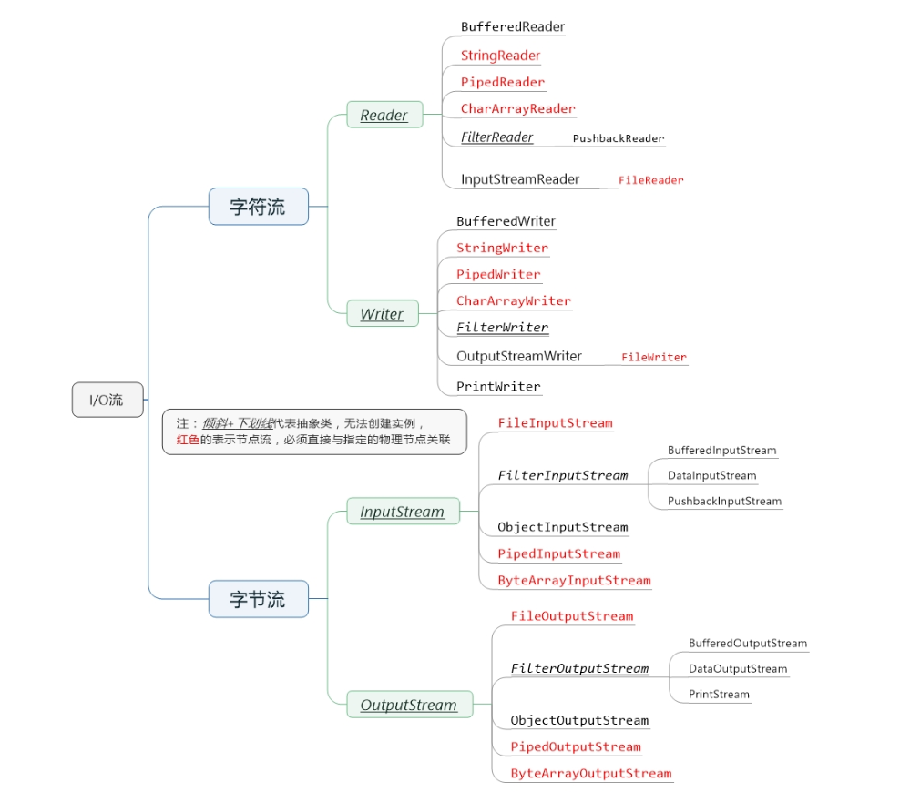
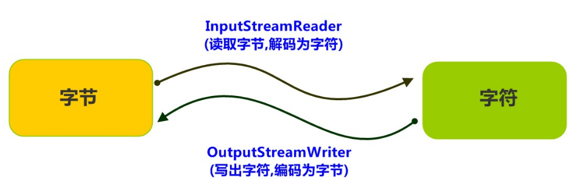

# 1、IO流的四点明确
（1）明确要操作的数据是数据源还是数据目的(要读还是要写)

| **源** | **InputStream** | **Reader** |
| :-- | :-- | :-- |
| **目的** | **OutputStream** | **Writer** |

（2）明确要操作的设备上的数据是字节还是文本

|  | **字节** | **文本** |
| :-- | :-- | :-- |
| **源** | **InputStream** | **Reader** |
| **目的** | **OutputStream** | **Writer** |

（3）明确数据所在的具体设备

|  | 硬盘 | 内存 | 键盘/屏幕 | 网络 |
| :-- | :-- | :-- | :-- | :-- |
| **源设备** | 文件`File`开头 | 数组，字符串 | System.in | Socket |
| **对应目的设备** | 文件`File`开头 | 数组，字符串 | System.out | Socket |

（4）明确是否需要额外功能

- 需要转换—— 转换流 `InputStreamReader `、`OutputStreamWriter`
- 需要高效—— 缓冲流`Bufferedxxx`
- 多个源—— 序列流 `SequenceInputStream`
- 对象序列化—— `ObjectInputStream`、`ObjectOutputStream`
- 保证数据的输出形式—— 打印流`PrintStream `、`Printwriter`
- 操作基本数据，保证字节原样性——`DataOutputStream`、`DataInputStream`
## IO流的主要分类
| **分类** | **字节输入流** | **字节输出流** | **字符输入流** | **字符输出流** |
| :-- | :-- | :-- | :-- | :-- |
| 抽象基类 | _<u>InputStream</u>_ | _<u>OutputStream</u>_ | _<u>Reader</u>_ | _<u>Writer</u>_ |
| 访问文件 | <span style="color:red">FileInputStream</span> | <span style="color:red">FileOutputStream</span> | <span style="color:red">FileReader</span> | <span style="color:red">FileWriter</span> |
| 访问数组 | <span style="color:red">ByteArrayInputStream</span> | <span style="color:red">ByteArrayOutputStream</span> | <span style="color:red">CharArrayReader</span> | <span style="color:red">CharArrayWriter</span> |
| 访问管道 | <span style="color:red">PipedInputStream</span> | <span style="color:red">PipedOutputStream</span> | <span style="color:red">PipedReader</span> | <span style="color:red">PipedWriter</span> |
| 访问字符串 |  |  | <span style="color:red">StringReader</span> | <span style="color:red">StringWriter</span> |
| 缓冲流 | BufferedInputStream | BufferedOutStream | BufferedReader | BufferedWriter |
| 转换流 |  |  | InputStreamReader | OutputStreamWriter |
| 对象流 | ObjectInputStream | ObjectOutputStream |  |  |
| 抽象基类 | _<u>FilterInputStream</u>_ | _<u>FilterOutputStream</u>_ | _<u>FilterReader</u>_ | _<u>FilterWriter</u>_ |
| 打印流 |  | PrintStream |  |  |
| 推回输入流 | PushbackInputStream |  | PushbackReader |  |
| 特殊流 | DataInputStream | DataOutputStream |  |  |

倾斜+下划线代表抽象类，无法创建实例。红色的表示节点流，必须直接与指定的物理节点关联
# 2、File类
`java.io.File` 类是专门对文件进行操作的类，只能对文件本身进行操作，不能对文件内容进行操作。

`java.io.File` 类是文件和目录路径名的抽象表示，主要用于文件和目录的创建、查找和删除等操作。

## 2.1 构造方法
```java
// 通过将给定的 路径名字符串 转换为抽象路径名来创建新的File实例。
File file1 = new File("D:/1.txt"); 
// 从 父路径名字符串和子路径名字符串 创建新的File实例
File file2 = new File("D:/1", "2.txt");
// 从父抽象路径名和子路径名字符串创建新的File实例。
File parentDir = new File("D:/a");
File file4 = new File(parentDir, "b.txt");
```
File类的注意点：

1. 一个File对象代表硬盘中实际存在的一个文件或者目录。
2. File类构造方法不会给你检验这个文件或文件夹是否真实存在，因此无论该路径下是否存在文件或者目录，都不影响File对象的创建。
## 2.2 常用方法
```java
File file = new File("D:/Project/Hello.java");
// 返回此File的绝对路径名字符串
System.out.println(file.getAbsolutePath());// D:\Project\Hello.java
// 将此File转换为路径名字符串
System.out.println(file.getPath());// D:\Project\Hello.java
// 返回由此File表示的文件或目录的名称
System.out.println(file.getName());// Hello.java
// 返回由此File表示的文件的长度
System.out.println(file.length());// 105
// 此File表示的文件或目录是否实际存在
System.out.println(file.exists());// true
// 此File表示的是否为目录
System.out.println(file.isDirectory());// false
// 此File表示的是否为文件
System.out.println(file.isFile());// true

// 创建一个新的空文件 (操作成功返回true,失败返回false 下同)
File file1 = new File("D:/a.txt");
System.out.println(file1.createNewFile());// true
// 创建一级目录
File test = new File("D:/test");
System.out.println(test.mkdir());// true
// 创建多级目录
File dir = new File("D:/dir1/dir2");
System.out.println(dir.mkdirs());// true
// 删除文件
System.out.println(file1.delete());// true
// 删除目录
System.out.println(test.delete());// true
System.out.println(dir.delete());// true
```
## 2.3 目录的遍历
```java
File dir = new File("/Users/manaphy/Downloads");

//获取当前目录下的文件以及文件夹的名称。
String[] names = dir.list();
for(String name : names){
    System.out.println(name);
}
//获取当前目录下的文件以及文件夹对象，只要拿到了文件对象，那么就可以获取更多信息
File[] files = dir.listFiles();
for (File file : files) {
    System.out.println(file);
}
```
递归遍历所有文件
```java
/**
 * 打印文件树
 * 
 * @param file  文件名称
 * @param level 层次数,无要求输入0
 */
public static void printFile(File file, int level) {
	// 输出层次数
	for (int i = 0; i < level; i++) {
		System.out.print("-");
	}
	// 输出文件名
	System.out.println(file.getName());
	if (file.isDirectory()) {
		File[] files = file.listFiles();
		for (File file2 : files) {
			printFile(file2, level + 1);
		}
	}
}
```
# 3、初探IO流
> Java中I/O操作主要是指使用`java.io`包下的内容，进行输入、输出操作。**输入也叫做读取数据，输出也叫做作写出数据**。

## 3.1 IO流的分类
根据数据的流向分为：**输入流** 和 **输出流**。

- **输入流** ：把数据从`其他设备`上读取到`内存`中的流。
- **输出流** ：把数据从`内存` 中写出到`其他设备`上的流。

根据数据的类型分为：**字节流** 和 **字符流**。

- **字节流**：以字节为单位，读写数据的流。
- **字符流** ：以字符为单位，读写数据的流。


## 3.2 字节输出流（OutputStream）
`java.io.OutputStream`抽象类是表示**字节输出流**的所有类的**超类**（父类），将指定的字节信息写出到目的地。它定义了字节输出流的基本共性功能方法。

**字节输出流的基本共性功能方法**

- `public void close()` ：关闭此输出流并释放与此流相关联的任何系统资源。
- `public void flush()`：刷新此输出流并强制任何缓冲的输出字节被写出。
- `public void write(byte[] b)`：将 b.length个字节从指定的字节数组写入此输出流。
- `public void write(byte[] b, int off, int len)` ：从指定的字节数组写入 len字节，从偏移量 off开始输出到此输出流。 也就是说从off个字节数开始读取一直到len个字节结束
- `public abstract void write(int b)` ：将指定的字节输出流。

以上五个方法则是字节输出流都具有的方法，由父类OutputStream定义提供，子类都会共享以上方法
### FileOutputStream
> 文件输出流，用于将数据写出到文件。

```java
// 使用File对象创建流对象 如果文件不存在则会自动创建,存在则覆盖
File file = new File("/Users/manaphy/Downloads/1.txt");
FileOutputStream fos = new FileOutputStream(file);
// 使用文件名称创建流对象,传入第二个参数true表示追加内容到文件末尾(不覆盖)
FileOutputStream fos2 = new FileOutputStream("/Users/manaphy/Downloads/1.txt",true);
```
```java
@Test
public void writeBytesTest() throws IOException {
    FileOutputStream fos = new FileOutputStream("/Users/manaphy/Downloads/1.txt");
    byte[] b = {'a'};
    byte[] bytes = "manaphy".getBytes(StandardCharsets.UTF_8);
    // 3种写出数据的方法
    fos.write(109);
    fos.write(b);
    fos.write(bytes, 2, 5);
    // 关闭资源
    fos.close();
}
```
## 3.3 字节输入流（InputStream）
`java.io.InputStream`抽象类是表示**字节输入流**的所有类的**超类**（父类），可以读取字节信息到内存中。它定义了字节输入流的基本共性功能方法。

**字节输入流的基本共性功能方法**

`public void close()` ：关闭此输入流并释放与此流相关联的任何系统资源。<br />`public abstract int read()`： 从输入流读取数据的下一个字节。<br />`public int read(byte[] b)`： 该方法返回的int值代表的是读取了多少个字节，读到几个返回几个，读取不到返回-1

### FileInputStream
> 文件输入流，从文件中读取字节。

**构造方法**
```java
File file = new File("/Users/manaphy/Downloads/1.txt");
// 使用File对象创建流对象,文件不存在则会抛出FileNotFoundException异常
FileInputStream fis = new FileInputStream(file);
// 使用文件名称创建流对象
FileInputStream fis2 = new FileInputStream("/Users/manaphy/Downloads/1.txt");
```
**读取字节数据**
```java
@Test
public void readBytesTest() throws IOException {
    File file = new File("/Users/manaphy/Downloads/1.txt");
    FileInputStream fis = new FileInputStream(file);// 文件内容为 manaphy
    // 读取数据，返回一个字节
    int read = fis.read();
    System.out.println((char) read);// m
    // 继续读取下一个数据
    System.out.println((char) fis.read());// a
    System.out.println((char) fis.read());// n
    System.out.println((char) fis.read());// a
    System.out.println((char) fis.read());// p
    System.out.println((char) fis.read());// h
    System.out.println((char) fis.read());// y
    // 读到末尾,则返回-1
    System.out.println(fis.read());// -1
    fis.close();
}
```
根据读到末尾返回-1，可将以上代码改为
```java
@Test
public void readBytes2Test() throws IOException {
    File file = new File("/Users/manaphy/Downloads/1.txt");
    FileInputStream fis = new FileInputStream(file);// 文件内容为 manaphy
    // 读取数据，返回一个字节
    int read = fis.read();
    while (read != -1) {
        System.out.print((char) read);
        read = fis.read();
    }
    fis.close();
}
```
**使用字节数组读取**
```java
@Test
public void readBytes3Test() throws IOException {
    File file = new File("/Users/manaphy/Downloads/1.txt");
    FileInputStream fis = new FileInputStream(file);// 文件内容为 manaphy
    // 定义字节数组，作为装字节数据的容器
    byte[] bytes = new byte[2];
    // 返回读取到的长度,如果为-1,则读取完毕
    int len = fis.read(bytes);
    while (len != -1) {
        System.out.print(new String(bytes));
        read = fis.read(bytes);
    }
    fis.close();
}
```
结果会发现输出:`manaphyh` 这是因为每次循环都会覆盖bytes数组的内容，文件长度为7，所以最后一次读取只覆盖第一个字节，从而读取到 yh<br />修改优化代码为以下内容(开发中一般使用这种方式)
```java
@Test
public void readBytes4Test() throws IOException {
    File file = new File("/Users/manaphy/Downloads/1.txt");
    @Cleanup FileInputStream fis = new FileInputStream(file);// 文件内容为 manaphy
    // 定义字节数组，作为装字节数据的容器
    byte[] bytes = new byte[1024];
    // 返回读取到的长度,如果为-1,则读取完毕
    int length = fis.read(bytes);
    while (length != -1) {
        System.out.print(new String(bytes, 0, length));
        length = fis.read(bytes);
    }
}
```
```java
@Test
public void byteCopyTest() throws IOException {
    @Cleanup FileInputStream fis = new FileInputStream("/Users/manaphy/Downloads/b.jpeg");
    @Cleanup FileOutputStream fos = new FileOutputStream("/Users/manaphy/Downloads/b_1.jpeg");
    byte[] bytes = new byte[1024];
    int len = fis.read(bytes);
    while (len != -1) {
        fos.write(bytes, 0, len);
        len = fis.read(bytes);
    }
}
```
## 3.4 字符输入流（Reader）
`java.io.Reader`抽象类是**字符输入流**的所有类的**超类**（父类），可以读取字符信息到内存中。它定义了字符输入流的基本共性功能方法。

**字符输入流的共性方法**

- `public void close()` ：关闭此流并释放与此流相关联的任何系统资源。
- `public int read()`： 从输入流读取一个字符。
- `public int read(char[] cbuf)`： 从输入流中读取一些字符，并将它们存储到字符数组 cbuf中
### FileReader
> 读取字符文件的便利类。构造时使用系统默认的字符编码和默认字节缓冲区。

```java
@Test
public void fileReader1Test() throws IOException {
    FileReader fr = new FileReader("/Users/manaphy/Downloads/1.txt");
    int read = fr.read();
    while (read != -1) {
        System.out.print((char) read);
        read = fr.read();
    }
    fr.close();
}
```
读取的写法类似字节流的写法，只是读取单位不同罢了
## 3.5 字符输出流（Writer）
`java.io.Writer`抽象类是**字符输出流**的所有类的**超类**（父类），将指定的字符信息写出到目的地。它同样定义了字符输出流的基本共性功能方法。

**字符输出流的基本共性功能方法**

- `void write(int c)`写入单个字符。
- `void write(char[] cbuf)`写入字符数组。
- `abstract void write(char[] cbuf, int off, int len)`写入字符数组的某一部分,off数组的开始索引,len写的字符个数。
- `void write(String str)`写入字符串。
- `void write(String str, int off, int len)` 写入字符串的某一部分,off字符串的开始索引,len写的字符个数。
- `void flush()`刷新该流的缓冲。
- `void close()`关闭此流，但要先刷新它。
### FileWriter
> 写出字符到文件的便利类。构造时使用系统默认的字符编码和默认字节缓冲区。

**写出数据**
```java
@Test
public void fileWriterTest() throws IOException {
    FileWriter fw = new FileWriter("/Users/manaphy/Downloads/2.txt");
    char[] chars = {'爱', '北'};
    String str = "我爱北京天安门";
    fw.write("我");
    fw.write(chars);
    fw.write(str, 3, 4);
    // 写出换行
    fw.write("\r\n");
    // 关闭资源时,与FileOutputStream不同。 如果不关闭,数据只是保存到缓冲区，并未保存到文件。
    fw.close();
}
```
**关闭close和刷新flush**

因为内置缓冲区的原因，如果不关闭输出流，无法写出字符到文件中。但是关闭的流对象，是无法继续写出数据的。如果我们既想写出数据，又想继续使用流，就需要flush 方法了。

`flush`：刷新缓冲区，流对象可以继续使用。<br />`close`：先刷新缓冲区，然后通知系统释放资源。流对象不可以再被使用了。

**文本文件复制**

```java
@Test
public void fileCopyTest() throws IOException {
    @Cleanup FileReader fr = new FileReader("/Users/manaphy/Downloads/2.txt");
    @Cleanup FileWriter fw = new FileWriter("/Users/manaphy/Downloads/3.txt");
    char[] chars = new char[1024];
    int len = fr.read(chars);
    while (len != -1) {
        fw.write(chars, 0, len);
        len = fr.read(chars);
    }
}
```
# 缓冲流
> 1、使用了底层流对象从具体设备上获取数据，并将数据存储到缓冲区的数组内。
> 2、通过缓冲区的read()方法从缓冲区获取具体的字符数据，这样就提高了效率。
> 3、如果用read方法读取字符数据，并存储到另一个容器中，直到读取到了换行符时，将另一个容器临时存储的数据转成字符串返回，就形成了readLine()功能。

## 字节缓冲流
> 使用缓冲字节流包装文件字节流，增加缓冲功能，提高效率
> 缓存区的大小（缓存数组的长度）默认是8192，也可以自己指定大小

```java
@Test
public void fileCopy2Test() throws IOException {
    @Cleanup BufferedInputStream bis = new BufferedInputStream(
            new FileInputStream("/Users/manaphy/Downloads/2.txt"));
    @Cleanup BufferedOutputStream bos = new BufferedOutputStream(
            new FileOutputStream("/Users/manaphy/Downloads/4.txt"));
    int len;
    byte[] bytes = new byte[8 * 1024];
    while ((len = bis.read(bytes)) != -1) {
        bos.write(bytes, 0, len);
    }
}
```
## 字符缓冲流
```java
@Test
public void fileCopy3Test() throws IOException {
    @Cleanup BufferedReader br = new BufferedReader(new FileReader("/Users/manaphy/Downloads/2.txt"));
    @Cleanup BufferedWriter bw = new BufferedWriter(new FileWriter("/Users/manaphy/Downloads/5.txt"));
    // 从缓冲字符流中读取一行,读到文件末尾返回null
    String line = br.readLine();
    while (line != null) {
        bw.write(line);
        // 换行,下次写入之前先换行,否则会在上一行后边继续追加，而不是另起一行
        bw.newLine();
        line = br.readLine();
    }
}
```
# 转换流


## OutputStreamWriter
转换流`java.io.OutputStreamWriter` ，是Writer的子类，字面看容易混淆会误以为是转为字符流，其实不然，OutputStreamWriter为从字符流到字节流的桥梁。使用指定的字符集将字符编码为字节。它的字符集可以由名称指定，也可以接受平台的默认字符集。
```java
@Test
public void convertTest() throws IOException {
    @Cleanup OutputStreamWriter osw = new OutputStreamWriter(
            new FileOutputStream("/Users/manaphy/Downloads/6.txt"), "GBK");
    osw.write("我爱北京天安门");// 生成的文件为GBK编码
}
```
## InputStreamReader
转换流`java.io.InputStreamReader`，是`Reader`的子类，从字面意思可以看出它是从字节流到字符流的桥梁。它读取字节，并使用指定的字符集将其解码为字符。它的字符集可以由名称指定，也可以接受平台的默认字符集。
```java
@Test
public void convert2Test() throws IOException {
    @Cleanup InputStreamReader isr = new InputStreamReader(
            new FileInputStream("/Users/manaphy/Downloads/6.txt"), "GBK");
    int read = isr.read();
    System.out.println((char) read);// 正常读取
}
```
为了达到**最高效率**，可以考虑在 `BufferedReader` 内包装 `InputStreamReader`<br />`BufferedReader in = new BufferedReader(new InputStreamReader(srcFile));`
## 序列化流
Java 提供了一种对象**序列化**的机制。用一个字节序列可以表示一个对象，该字节序列包含该对象的数据、对象的类型和对象中存储的属性等信息。字节序列写出到文件之后，相当于文件中持久保存了一个对象的信息。

反之，该字节序列还可以从文件中读取回来，重构对象，对它进行**反序列化**。对象的数据、对象的类型和对象中存储的数据信息，都可以用来在内存中创建对象。看图理解序列化：


```java
@Test
public void serializableTest() throws IOException {
    @Cleanup ObjectOutputStream oos = new ObjectOutputStream(
            new FileOutputStream("/Users/manaphy/Downloads/object.txt"));
    Person person = new Person(1, "chen", 18);
    oos.writeObject(person);
}

@Test
public void deserializationTest() throws IOException, ClassNotFoundException {
    @Cleanup ObjectInputStream ois = new ObjectInputStream(
            new FileInputStream("/Users/manaphy/Downloads/object.txt"));
    // 通过ObjectInputStream将文件中二进制数据反序列化成Person对象
    Person person = (Person) ois.readObject();
    System.out.println(person);
}

//Person类实现Serializable接口后，Person对象才能被序列化
@Data
public class Person implements Serializable {
	private static final long serialVersionUID = 1L;
    int id;
	String name;
    transient int age;// transient瞬态修饰成员,不会被序列化
}
```
# 打印流
平时我们在控制台打印输出，是调用`print`方法和`println`方法完成的，这两个方法都来自于`java.io.PrintStream`类。该类能够方便地打印各种数据类型的值，是一种便捷的输出方式。

**打印流特点**

- 只操作目的地,不操作数据源
- 可以操作任意类型的数据
- 如果启用了自动刷新，在调用println()方法的时候，能够换行并刷新
- 可以直接操作文件
```java
@Test
public void printTest() throws FileNotFoundException {
    PrintStream file = new PrintStream(new FileOutputStream("/Users/manaphy/Downloads/7.txt"));
    // 这里的console要在System.setOut(file)之前
    PrintStream console = System.out;
    // System类的out成员就是PrintStream类型的打印流
    // System.out默认系统的标准输出设备是显示器
    System.out.println("默认在显示器上打印信息");
    System.setOut(file); // 设置后System.out.println的内容将输出到7.txt中
    System.out.println("这一行信息将打印到pStream流中");
    file.write('A'); // 向7.txt写入A(只能写入字符或者字符数组)
    file.println("HelloWorld!"); // 向7.txt写入字符串

    // 将输出改为屏幕
    System.setOut(console);
    console.write('a'); // 向屏幕打印
    console.print("向屏幕打印");
    // 扫描仪从7.txt读取数据
    Scanner sc = new Scanner(new FileInputStream("/Users/manaphy/Downloads/7.txt"));
    console.println();
    console.print(sc.nextLine()); // 从7.txt读取文件打印到屏幕上
}

/** 打印字节流(异常处理) */
@Test
public void printStreamTest() throws IOException {
    @Cleanup PrintStream ps = new PrintStream(new FileOutputStream("/Users/manaphy/Downloads/8.txt"));
    // 经常把异常信息保存到日志文件中
    try {
        new FileInputStream("/Users/manaphy/1.txt");// 不存在的文件
    } catch (Exception e) {
        //在开发时, 一般调用e.printStackTrace()把异常信息打印到屏幕上方便程序员调试
        // 在部署后, 会把异常信息打印到日志文件中
        e.printStackTrace(ps);
    }
}

/** 以字符为单位的打印流(异常处理) */
@Test
public void printWriter() throws IOException {
    @Cleanup PrintWriter pw = new PrintWriter(new FileWriter("/Users/manaphy/Downloads/9.txt"));
    try {
        new FileInputStream("/Users/manaphy/1.txt");// 不存在的文件
    } catch (Exception e) {
        // 捕获这个异常,并将异常信息打印到log.txt文件中
        e.printStackTrace(pw);
    }
}
```
# 字节数组流(内存流)
```java
@Test
public void byteArrayTest() throws IOException {
    @Cleanup InputStream in = new FileInputStream("/Users/manaphy/Downloads/7.txt");
    @Cleanup ByteArrayOutputStream baos = new ByteArrayOutputStream();
    int b;
    while ((b = in.read()) != -1) {
        baos.write(b);
    }
    // 当循环结束,所有的数据都在内存输出流的byte数组中
    System.out.println(baos);
}
```
# 数据流
```java
@Test
public void dataTest() throws IOException {
    // 数据流也可以不用缓存流
    @Cleanup DataOutputStream dos = new DataOutputStream(
            new BufferedOutputStream(
                    new FileOutputStream("/Users/manaphy/Downloads/9.txt")));
    @Cleanup DataInputStream dis = new DataInputStream(
            new BufferedInputStream(
                    new FileInputStream("/Users/manaphy/Downloads/9.txt")));
    dos.writeInt(10);
    dos.writeChar('a');
    dos.writeDouble(Math.random());
    dos.writeUTF("数据流");
    // 手动刷新缓冲区：将流中数据写入到文件中
    dos.flush();
    // 直接读取数据：读取的顺序要与写入的顺序一致，否则不能正确读取数据。
    System.out.println(dis.readInt());
    System.out.println(dis.readChar());
    System.out.println(dis.readDouble());
    System.out.println(dis.readUTF());
}
```
# 对象流
> _对象流能够对对象数据类型进行读写操作_
> _Date是系统提供的类，已经实现了序列化接口_
> _如果是自定义类，则需要自己实现序列化接口_

```java
@Test
public void objectOutputTest() throws IOException {
    // 创建Object输出流，并包装缓冲流，增加缓冲功能
    @Cleanup ObjectOutputStream oos = new ObjectOutputStream(
            new BufferedOutputStream(
                    new FileOutputStream("/Users/manaphy/Downloads/10.txt")));
    oos.writeInt(12);
    oos.writeDouble(3.14);
    oos.writeChar('a');
    oos.writeBoolean(true);
    oos.writeUTF("数据流用UTF");
    oos.writeObject(new Date());
}

@Test
public void objectInputTest() throws IOException, ClassNotFoundException {
    @Cleanup ObjectInputStream ois = new ObjectInputStream(
            new BufferedInputStream(
                    new FileInputStream("/Users/manaphy/Downloads/10.txt")));
    // 使用Object输入流按照写入顺序读取
    System.out.println(ois.readInt());
    System.out.println(ois.readDouble());
    System.out.println(ois.readChar());
    System.out.println(ois.readBoolean());
    System.out.println(ois.readUTF());
    System.out.println(ois.readObject());
}
```
# 序列流
> 这个流将多个流进行逻辑串联

```java
@Test
public void sequenceTest() throws IOException {
    @Cleanup FileInputStream fis1 = new FileInputStream("/Users/manaphy/Downloads/1.txt");
    @Cleanup FileInputStream fis2 = new FileInputStream("/Users/manaphy/Downloads/2.txt");
    @Cleanup FileInputStream fis3 = new FileInputStream("/Users/manaphy/Downloads/3.txt");
    @Cleanup FileInputStream fis4 = new FileInputStream("/Users/manaphy/Downloads/4.txt");
    // 必须使用Vector
    Vector<FileInputStream> list = new Vector<>();
    list.add(fis1);
    list.add(fis2);
    list.add(fis3);
    list.add(fis4);
    // 把集合中的元素变成枚举
    Enumeration<FileInputStream> e = list.elements();
    @Cleanup SequenceInputStream sis = new SequenceInputStream(e);
    @Cleanup FileOutputStream fos = new FileOutputStream("/Users/manaphy/Downloads/11.txt");
    int i = sis.read();
    while (i != -1) {
        fos.write(i);
        i = sis.read();
    }
}
```
# FileUtils的使用
| **方法** | **作用** |
| :-- | :-- |
| cleanDirectory | 清空目录，但不删除目录。 |
| contentEquals | 比较两个文件的内容是否相同。 |
| copyDirectory | 将一个目录内容拷贝到另一个目录。可以通过FileFilter过滤需要拷贝的文件。 |
| copyFileToDirectory | 将一个文件拷贝到某个目录下。 |
| copyInputStreamToFile | 将一个输入流中的内容拷贝到某个文件。 |
| deleteDirectory | 删除目录。 |
| deleteQuietly | 删除文件。 |
| listFiles | 列出指定目录下的所有文件。 |
| openInputSteam | 打开指定文件的输入流。 |
| readFileToString | 将文件内容作为字符串返回。 |
| readLines | 将文件内容按行返回到一个字符串数组中。 |
| size | 返回文件或目录的大小。 |
| write | 将字符串内容直接写到文件中。 |
| writeByteArrayToFile | 将字节数组内容写到文件中。 |
| writeLines | 将容器中的元素的toString方法返回的内容依次写入文件中。 |
| writeStringToFile | 将字符串内容写到文件中。 |


# IOUtils的使用
| **方法** | **作用** |
| :-- | :-- |
| buffer | 将传入的流进行包装，变成缓冲流。并可以通过参数指定缓冲大小。 |
| closeQueitly | 关闭流。 |
| contentEquals | 比较两个流中的内容是否一致。 |
| copy | 将输入流中的内容拷贝到输出流中，并可以指定字符编码。 |
| copyLarge | 将输入流中的内容拷贝到输出流中，适合大于2G内容的拷贝。 |
| lineIterator | 返回可以迭代每一行内容的迭代器。 |
| read | 将输入流中的部分内容读入到字节数组中。 |
| readFully | 将输入流中的所有内容读入到字节数组中。 |
| readLine | 读入输入流内容中的一行。 |
| toBufferedInputStream<br />toBufferedReader | 将输入转为带缓存的输入流。 |
| toByteArray/toCharArray | 将输入流的内容转为字节数组、字符数组。 |
| toString | 将输入流或数组中的内容转化为字符串。 |
| write | 向流里面写入内容。 |
| writeLine | 向流里面写入一行内容。 |

