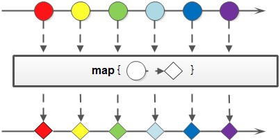
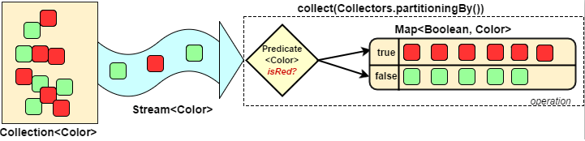

## Stream的介绍

::: info 介绍

1.Stream关注的是对数据的运算，与CPU打交道<br />集合关注的是数据的存储，与内存打交道<br />2.Stream 自己不会存储元素。<br />Stream 不会改变源对象。相反，他们会返回一个持有结果的新Stream。<br />Stream 操作是延迟执行的。这意味着他们会等到需要结果的时候才执行<br />3.一个中间操作链，对数据源的数据进行处理<br />一旦执行终止操作，就执行中间操作链，并产生结果。之后，不会再被使用

:::

## Stream的创建
```java
// 方式一 通过集合创建流
List<Student> list = Student.getList();
// default Stream<E> stream() : 返回一个顺序流
Stream<Student> stream = list.stream();
// default Stream<E> parallelStream() : 返回一个并行流
Stream<Student> parallelStream = list.parallelStream();

// 方式二 通过数组创建流
int[] arr = new int[]{1, 2, 3, 4, 5, 6};
// 调用Arrays类的static <T> Stream<T> stream(T[] array): 返回一个流
IntStream intStream = Arrays.stream(arr);

// 方式三 使用 Stream 的静态方法 of() iterate() generate()
// of()
Stream<Integer> integerStream = Stream.of(1, 2, 3, 4, 5, 6);

// 迭代 public static<T> Stream<T> iterate(final T seed, final UnaryOperator<T> f)
Stream.iterate(0, t -> t + 2).limit(10).forEach(System.out::println);// 遍历前10个偶数
Stream.iterate(0, t -> t + 1).limit(24).map(String::valueOf).collect(Collectors.toList());// 快速生成0-23小时的List
//生成 public static<T> Stream<T> generate(Supplier<T> s)
Stream.generate(Math::random).limit(10).forEach(System.out::println);// 生成10个随机数

// 数值流
IntStream intStream = IntStream.rangeClosed(1, 100);// 生成1到100之间的所有数字
```
**stream 和 parallelStream  的简单区分：** stream是顺序流，由主线程按顺序对流执行操作，而parallelStream是并行流，内部以多线程并行执行的方式对流进行操作，但前提是流中的数据处理没有顺序要求。例如筛选集合中的奇数，两者的处理不同之处：<br />`把顺序流转换成并行流：

```java
Optional<Integer> findFirst = list.stream().parallel().filter(x->x>6).findFirst();
```
## Stream的使用
案例类
```java
@Data
@NoArgsConstructor
@AllArgsConstructor
public class Student {
    private Long id;
    private String name;
    private int age;
    private Boolean isMale;

    public static List<Student> getList() {
        return new ArrayList<>() {{
            add(new Student(1L, "肖战", 15, true));
            add(new Student(2L, "王一博", 15, true));
            add(new Student(3L, "杨紫", 17, false));
            add(new Student(4L, "李现", 18, true));
        }};
    }
}
```
### 遍历/匹配(foreach/find/match)
Stream也是支持类似集合的遍历和匹配元素的，只是Stream中的元素是以Optional类型存在的。Stream的遍历、匹配非常简单。
```java
List<Student> students = Student.getList();
// forEach(Consumer c)——内部迭代
students.stream().forEach(System.out::println);

// 返回第一个元素
Optional<Student> first = students.stream().findFirst();
// 返回任意一个元素
Optional<Student> any = students.stream().findAny();

// 是否匹配所有元素。
boolean allMatch = students.stream().allMatch(student -> student.getAge() > 14);
// 是否至少匹配一个元素
boolean anyMatch = students.stream().anyMatch(s -> "肖战".equals(s.getName()));
//是否没有匹配的元素。
boolean noneMatch = students.stream().noneMatch(student1 -> "杨洋".equals(student1.getName()));
```
### 筛选(filter)
筛选，是按照一定的规则校验流中的元素，将符合条件的元素提取到新的流中的操作。
```java
// 接收 Lambda, 从流中排除某些元素。
students.stream().filter(student -> student.getAge() > 16).forEach(System.out::println);
```
### 聚合(max/min/count)
```java
// 返回流中元素的总个数
long count = students.stream().filter(student -> student.getAge() > 15).count();
// 返回流中最大值
Optional<Integer> max = students.stream().map(Student::getAge).max(Integer::compareTo);
// 返回流中具有属性的最大值的对象
Optional<Student> max1 = students.stream().max(Comparator.comparingInt(Student::getAge));
// 返回流中最小值
Optional<Integer> min = students.stream().map(Student::getAge).min(Integer::compareTo);
// 返回流中具有属性的最小值的对象
Optional<Student> min1 = students.stream().min(Comparator.comparingInt(Student::getAge));
```
### 映射(map/flatMap)
映射，可以将一个流的元素按照一定的映射规则映射到另一个流中。分为map和flatMap:

- map：接收一个函数作为参数，该函数会被应用到每个元素上，并将其映射成一个新的元素。
- flatMap：接收一个函数作为参数，将流中的每个值都换成另一个流，然后把所有流连接成一个流。(类似双重for循环)


```java
List<String> list = Arrays.asList("aa", "bb", "cc", "dd");
// 接收一个函数作为参数，将元素转换成其他形式或提取信息，该函数会被应用到每个元素上，并将其映射成一个新的元素。
list.stream().map(String::toUpperCase).forEach(System.out::println);
// 输出名字长度大于2的名字
students.stream().map(Student::getName).filter(name -> name.length() > 2).forEach(System.out::println);

// 所有学生的年龄+1岁(会改变原有list)
List<Student> collect = students.stream().map(x -> {
    x.setAge(x.getAge() + 1);
    return x;
}).collect(Collectors.toList());
// 以上有另一种写法
students.stream().peek(x -> x.setAge(x.getAge() + 1)).collect(Collectors.toList());

// 所有学生的年龄+1岁(不改变原有list)
List<Student> collect = students.stream().map(
                x -> new Student(x.getId(), x.getName(), x.getAge() + 1, x.getIsMale()))
        .collect(Collectors.toList());
```
flatMap的使用
```java
List<Student> list1 = Student.getList();

ArrayList<Student> list2 = new ArrayList<>(list1);
list2.remove(0);
list2.add(new Student(5L, "杨洋", 16, true));
list2.add(new Student(6L, "赵丽颖", 14, false));

// 交集
List<Student> intersection = list1.stream().filter(list2::contains).collect(Collectors.toList()); // 2,3,4
// 并集
List<Student> union = Stream.of(list1, list2).flatMap(Collection::stream).distinct().collect(Collectors.toList());
// 差集
List<Student> diff1 = list1.stream().filter(x -> !list2.contains(x)).collect(Collectors.toList());
List<Student> diff2 = list2.stream().filter(x -> !list1.contains(x)).collect(Collectors.toList());

HashMap<Integer, List<Student>> map = new HashMap<>();
map.put(1, list1);
map.put(2, list2);
// 合并两个list
List<Student> collect = map.values().stream().flatMap(Collection::stream).collect(Collectors.toList());

// 给定两个数字列表，如何返回所有的数对呢？
//例如，给定列表[1,2,3]和列表[3,4]，返回[(1,3),(1,4),(2,3),(2,4),(3,3),(3,4)]。
List<Integer> n1 = List.of(1, 2, 3);
List<Integer> n2 = List.of(3, 4);
n1.stream().flatMap(x -> n2.stream().map(y -> new int[]{x, y})).collect(Collectors.toList());
```
### 规约(reduce)
归约，也称缩减，顾名思义，是把一个流缩减成一个值，能实现对集合求和、求乘积和求最值操作。
```java
List<Integer> list = Arrays.asList(1, 2, 3, 4, 5, 6, 7, 8, 9, 10);
// 求和 1-10
// 方式一
Integer sum1 = list.stream().reduce((x, y) -> x + y).get();
// 方式二
Integer sum2 = list.stream().reduce(Integer::sum).get();
// 方式三
Integer sum3 = list.stream().reduce(0, Integer::sum);
// 求最大值
Integer reduce2 = list.stream().reduce(1, Integer::max);

// identity 参数的作用 (要求与传入的参数计算后还是原来的值)
Integer sum4 = list.stream().reduce(10, Integer::sum); // 65 (10+1=11 返回的不是原来的1)
Integer reduce2 = list.stream().reduce(15, Integer::max); // 15 (15与1比大小,返回的不是原来的1)


// 累加所有学生的年龄
Optional<Integer> reduce1 = students.stream().map(Student::getAge).reduce(Integer::sum);
```
### 收集(collect)
`collect` 收集，可以说是内容最繁多、功能最丰富的部分了。从字面上去理解，就是把一个流收集起来，最终可以是收集成一个值也可以收集成一个新的集合。
> collect主要依赖`java.util.stream.Collectors`类内置的静态方法。

#### 归集(toList/toSet/toMap)
因为流不存储数据，那么在流中的数据完成处理后，需要将流中的数据重新归集到新的集合里。toList、toSet和toMap比较常用，另外还有toCollection、toConcurrentMap等复杂一些的用法。
```java
// toList()
List<Student> list = students.stream().collect(Collectors.toList());
// toSet()
Set<Integer> set = students.stream().map(Student::getAge).collect(Collectors.toSet());
// toCollection()
ArrayList<Student> arrayList = students.stream().collect(Collectors.toCollection(ArrayList::new));
// toMap()
Map<Long, String> map = students.stream().collect(Collectors.toMap(Student::getId, Student::getName));

// 如果希望得到 Map 的 value 为对象本身时，可以有以下两种写法
students.stream().collect(Collectors.toMap(Student::getId, t -> t));
students.stream().collect(Collectors.toMap(Student::getId, Function.identity()));
```
#### 关于 Collectors.toMap 方法
Collectors.toMap 有三个重载方法：
```java
toMap(Function<? super T, ? extends K> keyMapper, Function<? super T, ? extends U> valueMapper);
toMap(Function<? super T, ? extends K> keyMapper, Function<? super T, ? extends U> valueMapper,
        BinaryOperator<U> mergeFunction);
toMap(Function<? super T, ? extends K> keyMapper, Function<? super T, ? extends U> valueMapper,
        BinaryOperator<U> mergeFunction, Supplier<M> mapSupplier);
```
参数含义分别是：

1. keyMapper：Key 的映射函数
2. valueMapper：Value 的映射函数
3. mergeFunction：当 Key 冲突时，调用的合并方法
4. mapSupplier：Map 构造器，在需要返回特定的 Map 时使用

**注意：** 如果 List 中 userId 有相同的，使用上面的写法会抛异常：
```java
List<User> userList = Lists.newArrayList(
        new User().setId("A").setName("张三"),
        new User().setId("A").setName("李四"), // Key 相同 
        new User().setId("C").setName("王五")
);
userList.stream().collect(Collectors.toMap(User::getId, User::getName));

// 异常：
java.lang.IllegalStateException: Duplicate key 张三 
    at java.util.stream.Collectors.lambda$throwingMerger$114(Collectors.java:133)
    at java.util.HashMap.merge(HashMap.java:1245)
    at java.util.stream.Collectors.lambda$toMap$172(Collectors.java:1320)
    at java.util.stream.ReduceOps$3ReducingSink.accept(ReduceOps.java:169)
    at java.util.ArrayList$ArrayListSpliterator.forEachRemaining(ArrayList.java:1374)
    at java.util.stream.AbstractPipeline.copyInto(AbstractPipeline.java:481)
    at java.util.stream.AbstractPipeline.wrapAndCopyInto(AbstractPipeline.java:471)
    at java.util.stream.ReduceOps$ReduceOp.evaluateSequential(ReduceOps.java:708)
    at java.util.stream.AbstractPipeline.evaluate(AbstractPipeline.java:234)
    at java.util.stream.ReferencePipeline.collect(ReferencePipeline.java:499)
    at Test.toMap(Test.java:17)
    ...
```
这时就需要调用第二个重载方法，传入合并函数，如：
```java
userList.stream().collect(Collectors.toMap(User::getId, User::getName, (n1, n2) -> n1 + n2));

// 输出结果：
A-> 张三李四 
C-> 王五 
```
第四个参数（mapSupplier）用于自定义返回 Map 类型，比如我们希望返回的 Map 是根据 Key 排序的，可以使用如下写法：
```java
List<User> userList = Lists.newArrayList(
        new User().setId("B").setName("张三"),
        new User().setId("A").setName("李四"),
        new User().setId("C").setName("王五")
);
userList.stream().collect(
    Collectors.toMap(User::getId, User::getName, (n1, n2) -> n1, TreeMap::new)
);

// 输出结果：
A-> 李四 
B-> 张三 
C-> 王五 
```
#### 统计(count/averaging)
Collectors提供了一系列用于数据统计的静态方法：
```java
// 计算流中元素的个数
long count = students.stream().collect(Collectors.counting());
// 对流中元素的整数属性求和
Integer sum = students.stream().collect(Collectors.summingInt(Student::getAge));
// 计算流中元素Integer属性的平均值
Double avg = students.stream().collect(Collectors.averagingInt(Student::getAge));
// summarizingInt 收集流中Integer属性的统计值。如：平均值
IntSummaryStatistics statistics = students.stream().collect(Collectors.summarizingInt(Student::getAge));
System.out.println(statistics);// IntSummaryStatistics{count=4, sum=65, min=15, average=16.250000, max=18}
// 对BigDecimal进行求和
List<BigDecimal> numbers = Arrays.asList(new BigDecimal("10.0"),  new BigDecimal("20.0"), new BigDecimal("30.0"));
BigDecimal sum = numbers.stream().reduce(BigDecimal.ZERO, BigDecimal::add);
```
#### 分组(partitioningBy/groupingBy)

- 分区：将stream按条件分为两个Map，比如学生按性别分为两部分。
- 分组：将集合分为多个Map，比如学生按年龄分组。有单级分组和多级分组。


```java
// 将学生根据性别分组
Map<Boolean, List<Student>> collect = students.stream()
    .collect(Collectors.partitioningBy(Student::getIsMale));
// 将学生根据年龄分组
Map<Integer, List<Student>> groupingBy = students.stream()
    .collect(Collectors.groupingBy(Student::getAge));
```
#### 接合(joining)
joining可以将stream中的元素用特定的连接符（没有的话，则直接连接）连接成一个字符串。
```java
String joining = students.stream().map(Student::getName).collect(Collectors.joining());
String joining2 = students.stream().map(Student::getName).collect(Collectors.joining(","));
```
#### 归约(reducing)
Collectors类提供的reducing方法，相比于stream本身的reduce方法，增加了对自定义归约的支持。
```java
Integer collect = students.stream()
    .collect(Collectors.reducing(0, Student::getAge, Integer::sum));
```
#### 排序(sorted)
sorted，中间操作。有两种排序：

- sorted()：自然排序，流中元素需实现Comparable接口
- sorted(Comparator com)：Comparator排序器自定义排序
```java
List<Integer> list = Arrays.asList(12, 43, 65, 34, 87, 0, -98, 7);
// 自然排序
list.stream().sorted().forEach(System.out::println);
// 逆序
list.stream().sorted(Comparator.reverseOrder())
    .forEach(System.out::println);
// 定制排序
students.stream().sorted((s1, s2) -> Integer.compare(s1.getAge(), s2.getAge()))
    .forEach(System.out::println);
students.stream().sorted(Comparator.comparingInt(Student::getAge))
    .forEach(System.out::println);
// 定制逆序排序
students.stream().sorted(Comparator.comparingInt(Student::getAge).reversed())
    .forEach(System.out::println);
```
### 提取/组合
流也可以进行合并、去重、限制、跳过等操作。
```java
//distinct()——去重，通过流所生成元素的 hashCode() 和 equals() 去除重复元素
ArrayList<Student> students1 = new ArrayList<>(students);
students1.add(new Student(1L, "肖战", 15, true));
students1.stream().distinct().forEach(System.out::println);

//limit(n)——截断流，使其元素不超过给定数量。
students.stream().limit(2).forEach(System.out::println);

//skip(n) —— 跳过元素，返回一个扔掉了前 n 个元素的流。若流中元素不足 n 个，则返回一个空流。与 limit(n) 互补
students.stream().skip(3).forEach(System.out::println);
```
### peek
peek操作有点类似forEach，但peek不是最终操作。

- 用于日志打印
```java
Stream.of("one", "two", "three", "four")
         .filter(e -> e.length() > 3)
         .peek(e -> System.out.println("Filtered value: " + e))
         .map(String::toUpperCase)
         .peek(e -> System.out.println("Mapped value: " + e))
         .collect(Collectors.toList());
```

- 可以改变对象的内部属性
```java
students.stream().peek(x -> x.setAge(x.getAge() + 1)).collect(Collectors.toList());
```
# Stream的应用
## 集合的操作
```java
List<Integer> list1 = List.of(1, 2, 3, 4, 5);
List<Integer> list2 = List.of(3, 4, 5, 6, 7);

// 交集
List<Integer> intersection = list1.stream().filter(list2::contains)
    .collect(Collectors.toList());
System.out.println("交集为:" + intersection);// 3,4,5
// 并集
List<Integer> union = Stream.of(list1, list2).flatMap(Collection::stream).distinct()
    .collect(Collectors.toList());
System.out.println("并集为:" + union);// 1, 2, 3, 4, 5, 6, 7
// 差集
List<Integer> diff1 = list1.stream().filter(x -> !list2.contains(x))
    .collect(Collectors.toList());
System.out.println("差集为:" + diff1);// 1, 2
List<Integer> diff2 = list2.stream().filter(x -> !list1.contains(x))
    .collect(Collectors.toList());
System.out.println("差集为:" + diff2);// 6, 7

HashMap<Integer, List<Integer>> map = new HashMap<>(2);
map.put(1, list1);
map.put(2, list2);
// 合并两个list
List<Integer> collect = map.values().stream().flatMap(Collection::stream)
    .collect(Collectors.toList());
System.out.println("合并两个list为:" + collect);// 1, 2, 3, 4, 5, 3, 4, 5, 6, 7
```
## 使用案例
```java
// 生成勾股数
IntStream.rangeClosed(1, 100).boxed().flatMap(a ->
                IntStream.rangeClosed(a, 100)
                        .filter(b -> (Math.sqrt(a * a + b * b)) % 1 == 0)
                        .mapToObj(b -> new int[]{a, b, (int) Math.sqrt(a * a + b * b)}))
        .limit(40).forEach(x -> {
            System.out.println(x[0] + "," + x[1] + "," + x[2]);
        });

// 生成斐波纳契数列
Stream.iterate(new int[]{0, 1}, t -> new int[]{t[1], t[0] + t[1]})
        .limit(20)
        .map(x->x[0])
        .forEach(System.out::println);

// 生成斐波纳契数列 方式二
IntSupplier fib = new IntSupplier() {
    private int previous = 0;
    private int current = 1;

    @Override
    public int getAsInt() {
        int oldPrevious = this.previous;
        int nextValue = this.previous + this.current;
        this.previous = this.current;
        this.current = nextValue;
        return oldPrevious;
    }
};
IntStream.generate(fib).limit(20).forEach(System.out::println);


```
