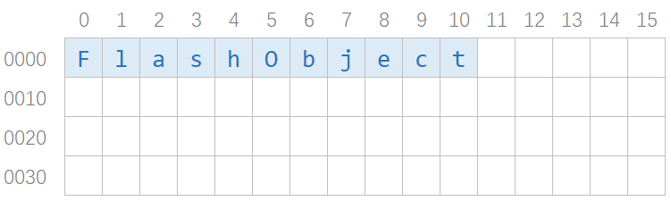
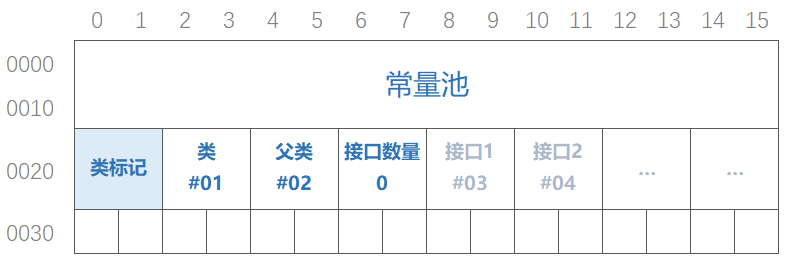
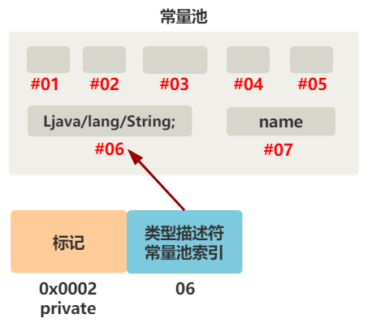
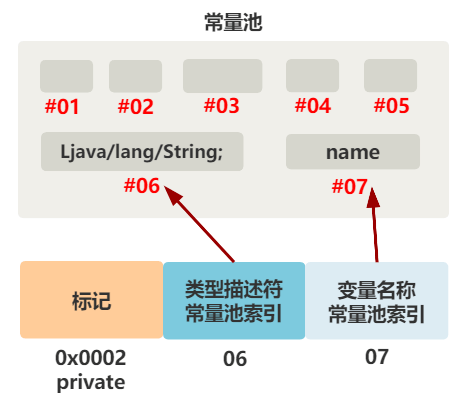
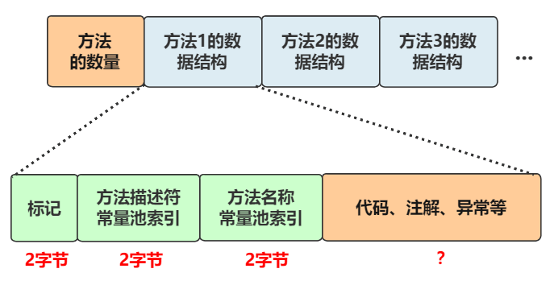
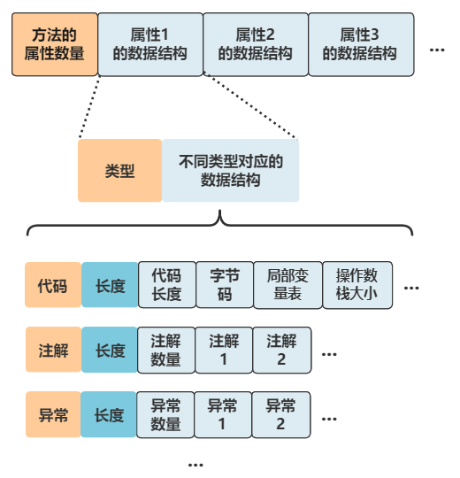
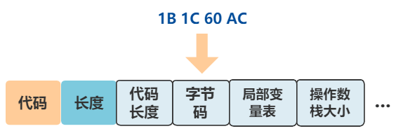
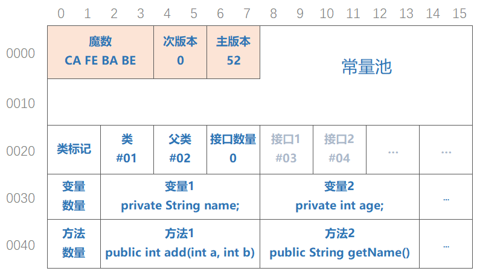
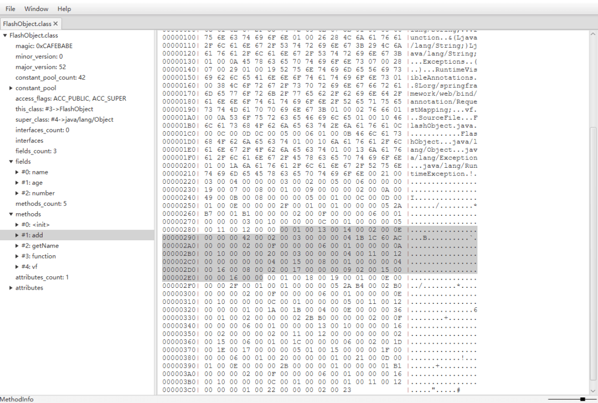

我是一个 .java 文件，名叫 FlashObject.java，叫我**小渣**就行。
```java
public class FlashObject {

    private String name;
    private int age;
    
    public String getName() {
        return name;
    }

    public int add(int a, int b) {
        return a + b;
    }

}
```
我马上就要被 JVM 虚拟机老大加载并运行了，此时**老虚**走了过来。

老虚：小渣呀，我马上就要把你载了，你先瘦身一下，别占太大地方。

小渣：好的，没问题，等我十秒钟。

`public class FlashObject{private String name;private int age;public int add(int a,int b){return a+b;}`

小渣：老虚，我瘦身好了，你看看。

老虚：...，你是不是有病。

小渣：怎么了，我把没用的空格和回车啥的都去掉了，瘦身了好多呢！

老虚：行吧，看你这智商，我就给你解释解释。你现在仍然是个文本文件，让你瘦身是让你定一个紧凑的数据结构来表示你这个 Java 文件里的信息，然后告诉我这个数据结构中每个字节都代表什么。

小渣：哦哦，这样啊。

老虚：对啊，这样一是方便我去加载，二是我这个虚拟机可不只是为你 Java 语言服务的，还有很多语言最终都可以转换为我虚拟机识别的，你得设计一个通用的格式。

小渣：嗯嗯，这回我明白啦！
# 1. **类信息**
我的**类名**叫 FlashObject。

先找个地方把它存起来，放开头吧。



嗯，完美。
# 2. **常量池**
慢慢地，我发现需要字符串名字的地方越来越多。

除了刚刚的类名、父类名、接口名，还有属性名、方法名、属性的类名、方法的入参类型名、返回值类型名，等等等等。

一方面，要是每个都这么展开写下去，那文件格式会很乱，很多结构都是变长的。

另一方面，很多字符串都是重复的，比如属性 name 的类名 String，与方法 getName 的返回值类名 String，重复写两遍，就浪费了空间。

因此，我决定，之前的方案作废，设计一个新的结构来统一存储这些字符串，我给他起名为**常量池**。


OK，总结一下我们目前的整体方案。

开头存**常量池**，之后需要的常量就全往这里放，用一个索引指向它即可。

紧接着存放**类本身**的相关信息，我们存放了**当前类、父类以及接口**的信息。

看来老虚要求的瘦身工作，已经初具规模啦。
# 3. **变量** 
现在类本身的信息，已经找到合适的位置存放起来了，接下来我们存变量。

变量也可能有多个，所以结构依然仿照我们之前的思路，开头存数量，后面紧跟着各个存放变量的数据结构。


至于变量用什么数据结构来存，是不是定长的，那就是我们接下来要设计的了。

我们把其中一个变量拿出来，看看它有什么？
:::info
private String name;
:::
非常清晰，private 这部分是变量的标记，String 是变量类型，name 是变量名字。

## **先看标记部分**
除了 private，还有 public、protected、static、final、volatile、transient 等，有的可以放在一起，比如
:::info
public static final String name；
:::
有的不能放在一起，比如
:::info
public private String name; //错误
:::
我们用**位图**的方式，每一个标记用一个位来表示（比如 public 在第一个位，private 在第二个位，static 在第四个位，final 在第五个位...），这样不论如何排列组合，最终的值都是不一样的。


我们把这些标记所对应的值，都设计并记录下来。

复合型的标记，就可以表现为将其相加，比如 public static，就是 0x0001 + 0x0008 = 0x0009。

| **标记** | **值** |
| :-- | :-- |
| public | 0x0001 |
| private | 0x0002 |
| protected | 0x0004 |
| static | 0x0008 |
| final | 0x0010 |
| volatile | 0x0040 |
| transient | 0x0080 |

而这样的赋值方式，不同排列组合后的和没有重复的，且也能根据值很方便地反推出标记。

不错不错，就这样了。

哦对了，类信息本身也有 public 呀 private 这些标记属性，刚刚记录类信息的时候忘了，先加上它，免得一会忘了！


## **再看类型部分**
当前类型为 String，属于一个引用数据类型中的**类类型**。
:::info
private String name;
:::
除此之外，还有**八个基本数据类型**，和引用类型中的**数组类型**。

为了占用更少的空间，我们将其用最少的符号来表示。

这里的基本数据类型，和数组类型，都只占用一个 char 来表示，就只占了 1 个字节。

| **符号表示** | **类型** |
| :-- | :-- |
| B | byte |
| C | char |
| D | double |
| F | float |
| I | int |
| J | long |
| S | short |
| Z | boolean |
| L_ClassName_ ; | 类 |
| [ | 数组 |

如果是类，则占用了 L 和 ; 两个字节，再加上全类名所占的字节数。

比如这里的 String 类型，用符号表示，就是

Ljava/lang/String;

但注意，这里的符号，也都可以存放在常量池中，而我们的变量结构中的类型描述符部分，只需要一个常量池索引即可。



ok，第二部分也搞定了。
## **再看名字部分**
名字部分没什么好说的，相信你直接能猜到了，直接上图。



搞定！
# 4. **方法**
方法也可能会有很多，我目前只有两个方法，我们拿 add 方法来分析。
```java
public int add(int a, int b) {
    return a + b;
}
```
当然更准确地说，我还有个没写出来的构造方法。

总之，可能会有很多。

不过有了设计变量的经验，方法的数据结构很快就有了雏形。



**标记部分**，和变量标记部分的思路一样，值也差不多，我们也给他们赋上值就好了。

**方法描述符**，说的是方法的入参与返回值，比如我们的：

| **标记** | **值** |
| :-- | :-- |
| public | 0x0001 |
| private | 0x0002 |
| protected | 0x0004 |
| static | 0x0008 |
| final | 0x0010 |
| ~~volatile~~ | ~~0x0040~~ |
| ~~transient~~ | ~~0x0080~~ |
| synchronized | 0x0020 |
| native | 0x0100 |
| abstract | 0x0400 |

int add(int a, int b);

入参与返回值的类型符号表示，与上面变量类型的符号表示完全一样，只不过多了一个 void 类型。

由于有多个参数类型，所以要定一个整体的格式，而整个描述符的格式为：

| **符号表示** | **类型** |
| :-- | :-- |
| B | byte |
| C | char |
| D | double |
| F | float |
| I | int |
| J | long |
| S | short |
| Z | boolean |
| L_ClassName_ ; | 类 |
| [ | 数组 |
| V | void |

( 参数1类型 参数2类型 ... ) 返回值类型

比如我们的

int add(int a, int b);

就表示为

(II)I

是不是非常精简了？同样，这也是个字符串，也可以存储在常量池里，就不再赘述。

（至于参数 a 和 b 这个名字，不需要保存起来，实际上在转换的字节码以及实际虚拟机中运行时，只需要知道局部变量表中的位置即可，叫什么名字都无所谓）

**方法名称**，我们再熟悉不过了，放常量池！

ok，前三个说完了。最后一个，就有意思了。


代码、异常、注解等。可以看到，有相当多的信息需要记录。

比如我写这样的方法。
```java
@RequestMapping()
public String function(String a) throws Exception {
    return a;
}
```
那就会有代码部分、异常、注解等需要录入的信息。

但似乎除了代码部分之外，其他部分都不是每个方法都有的，如果都定义出来，岂不是浪费空间，那怎么办呢？

我们效仿常量池的做法，把这些部分都叫“**方法的属性**”，一个方法可能有多个属性，设计结构如下。



这样，方法具有哪些属性，**按需添加**进来就好，如果不需要这个属性，也不用浪费空间，完美！

回过头看我们的这个方法。
```java
public int add(int a, int b) {
    return a + b;
}
```
刚刚方法签名部分已经都解决了，只剩下代码

return a + b;

这个要怎样存放呢？

之前听老虚说过，JVM 识别的是一种叫**字节码**的东西，所以我要把 Java 语言写出的代码，转换为字节码。

这部分很复杂，就不展开说我的过程了，经过一番努力后，我把这一行简简单单的代码转换为了字节码。

1B 1C 60 AC

一共占四个字节。

我把这四个字节，就放在刚刚代码类型的属性中。



完美！
# 5. **class**
我把我转换为了这样的结构，并带着这个最终的设计稿，去找了老虚。

老虚：嗯！还真不赖！

小渣：那当然，我可是研究了好久呢。

老虚：不过，我再给你改改，在开头加些东西把。



小渣：老虚，你这加的是啥呀？

老虚：一看你就没经验。

**魔数**一般用来识别这个文件的格式，通过文件名后缀的方式不靠谱，一般有格式的文件都会有个魔数的。

后面两个用来标识一下**版本号**，不同版本可能数据结构和支持的功能不一样，这个今后会有用的！

小渣：原来如此，还是你老虚见多识广。可是你说用来识别这个文件的格式，我这个文件是啥呀？

老虚：你这个玩意，就叫它 class 文件吧！

**FlashObject.class**
# **6. 后记**
根据 Java 虚拟机规范，Java Virtual Machine Specification Java SE 8 Edition，一个 class 文件的标准结构，是这样的。
```java
ClassFile {
    u4             magic;
    u2             minor_version;
    u2             major_version;
    u2             constant_pool_count;
    cp_info        constant_pool[constant_pool_count-1];
    u2             access_flags;
    u2             this_class;
    u2             super_class;
    u2             interfaces_count;
    u2             interfaces[interfaces_count];
    u2             fields_count;
    field_info     fields[fields_count];
    u2             methods_count;
    method_info    methods[methods_count];
    u2             attributes_count;
    attribute_info attributes[attributes_count];
}
```
我们的设计与它几乎相同。

只有后两项，我们没有涉及到，本身也不是重点。

常量池中的类型，有以下几种。

| **Constant Type** | **Value** |
| :-- | :-- |
| CONSTANT_Class | 7 |
| CONSTANT_Fieldref | 9 |
| CONSTANT_Methodref | 10 |
| CONSTANT_InterfaceMethodref | 11 |
| CONSTANT_String | 8 |
| CONSTANT_Integer | 3 |
| CONSTANT_Float | 4 |
| CONSTANT_Long | 5 |
| CONSTANT_Double | 6 |
| CONSTANT_NameAndType | 12 |
| CONSTANT_Utf8 | 1 |
| CONSTANT_MethodHandle | 15 |
| CONSTANT_MethodType | 16 |
| CONSTANT_InvokeDynamic | 18 |

如果想了解 class 文件的全部细节，最好的办法就是**阅读官方文档**，也就是 Java 虚拟机规范的第四部分。

**Chapter 4. The class File Format**

这里的链接可以直接定位：

[https://docs.oracle.com/javase/specs/jvms/se8/html/jvms-4.html#jvms-4.3.2](https://docs.oracle.com/javase/specs/jvms/se8/html/jvms-4.html#jvms-4.3.2)

不要觉得官方文档晦涩难懂，这个部分还是非常清晰明了的，大多数博客基本上对格式的讲解都缺斤少两，而且说得也不形象，还不如直接阅读官方文档呢。

还有一个好的方式，就是直接观察 class 文件的二进制结构解析，这里推荐一个工具

**classpy**

用这个工具打开一个 class 文件，是这个样子。



左边解析好的树型结构，可以直接和右边的 class 文件的二进制内容相对应，非常好用。

最后，希望大家找时间用这个工具分析一个复杂的 class 文件，会很有帮助的。祝大家学会 class 文件。
