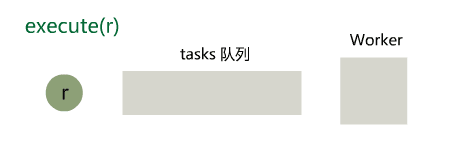
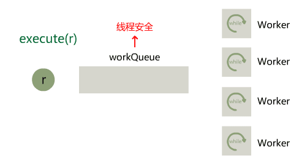
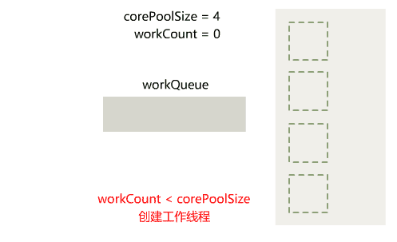
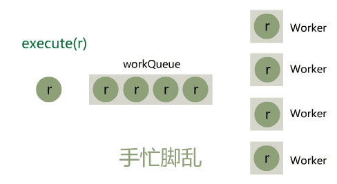
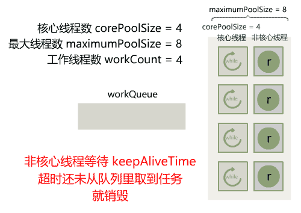
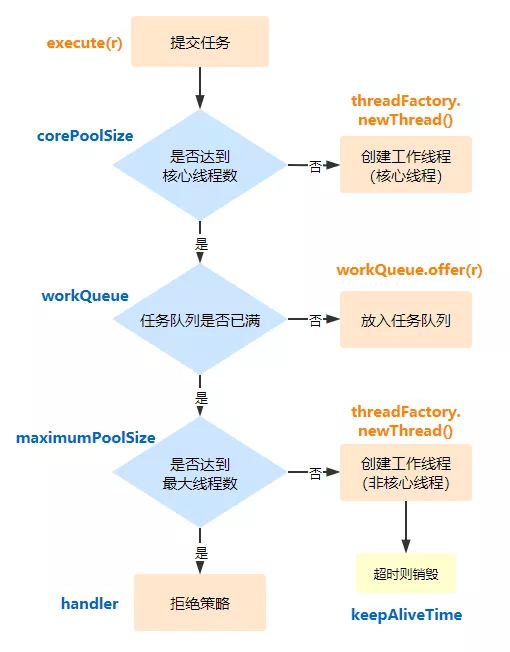

```java
new Thread(r).start();
```
```java
public interface Executor {
    public void execute(Runnable r);
}
```
## 第一版
```java
// 新线程：直接创建一个新线程运行
class FlashExecutor implements Executor {
    public void execute(Runnable r) {
        new Thread(r).start();
    }
}
```
这是最根本的功能，Doug Lea 大神在 JDK 源码注释中给出的就是这样的例子
## 第二版
假如有 10000 个人都调用这个工具类提交任务，那就会创建 10000 个线程来执行

把这个任务 r 丢到一个 tasks 队列中，然后只启动一个线程，就叫它 **Worker** 线程，不断从 tasks 队列中取任务，执行任务。这样无论调用者调用多少次，永远就只有一个 Worker 线程在运行，像这样。



这个设计有了三个重大的意义：

1. 控制了线程数量。
2. 队列不但起到了缓冲的作用，还将任务的提交与执行解耦了。
3. 最重要的一点是，解决了每次重复创建和销毁线程带来的系统开销。
## 第三版
只有一个后台的工作线程 Worker 太少了，还有如果这个 tasks 队列满了怎么办呢？

Worker 线程的数量要增加，但是具体数量要让使用者决定，调用时传入，就叫核心线程数 **corePoolSize**



1. 初始化线程池时，直接启动 corePoolSize 个工作线程 Worker 先跑着。
2. 这些 Worker 就是死循环从队列里取任务然后执行。
3. execute 方法仍然是直接把任务放到队列，但队列满了之后直接抛弃
## 第四版
初始化的时候，就创建了一堆 Worker 线程在那空跑着，假如此时并没有异步任务提交过来执行，这就有点浪费了

队列一满，就直接把新任务丢弃了，这样有些粗暴，能不能让调用者自己决定该怎么处理呢？

1. **按需创建Worker**：刚初始化线程池时，不再立刻创建 corePoolSize 个工作线程，而是等待调用者不断提交任务的过程中，逐渐把工作线程 Worker 创建出来，等数量达到 corePoolSize 时就停止，把任务直接丢到队列里。那就必然要用一个属性记录已经创建出来的工作线程数量，就叫 workCount 吧。
2. **加拒绝策略**：实现上就是增加一个入参，类型是一个接口 RejectedExecutionHandler，由调用者决定实现类，以便在任务提交失败后执行 rejectedExecution 方法。
3. **增加线程工厂**：实现上就是增加一个入参，类型是一个接口 ThreadFactory，增加工作线程时不再直接 new 线程，而是调用这个由调用者传入的 ThreadFactory 实现类的 newThread 方法。


## 第五版
当提交任务的量突增时，工作线程和队列都被占满了，就只能走拒绝策略，其实就是被丢弃掉



可以使用一个新的属性，叫最大线程数 **maximumPoolSize**。当核心线程数和队列都满了时，新提交的任务仍然可以通过创建新的工作线程（叫它**非核心线程**），直到工作线程数达到 maximumPoolSize 为止，这样就可以缓解一时的高峰期了，而用户也不用设置过大的核心线程数。


1. 开始的时候和上一版一样，当 workCount < corePoolSize 时，通过创建新的 Worker 来执行任务。
2. 当 workCount >= corePoolSize 就停止创建新线程，把任务直接丢到队列里。
3. 但当队列已满且仍然 workCount < maximumPoolSize 时，不再直接走拒绝策略，而是创建非核心线程，直到 workCount = maximumPoolSize，再走拒绝策略。

这样 corePoolSize 就负责平时大多数情况所需要的工作线程数，而 maximumPoolSize 就负责在高峰期临时扩充工作线程数。

高峰时期的弹性搞定了，那自然就还要考虑低谷时期。当长时间没有任务提交时，核心线程与非核心线程都一直空跑着，浪费资源。我们可以给非核心线程设定一个超时时间 keepAliveTime，当这么长时间没能从队列里获取任务时，就不再等了，销毁线程。


## 总结
ThreadPoolExecutor的构造方法(JDK17)
```java
public ThreadPoolExecutor(int corePoolSize, // 核心线程数
                          int maximumPoolSize, // 最大线程数
                          long keepAliveTime, // 非核心线程的空闲时间
                          TimeUnit unit, // 空闲时间的单位
                          BlockingQueue<Runnable> workQueue, // 任务队列(线程安全的阻塞队列)
                          ThreadFactory threadFactory, // 线程工厂
                          RejectedExecutionHandler handler // 拒绝策略
                         ) {
    if (corePoolSize < 0 ||
        maximumPoolSize <= 0 ||
        maximumPoolSize < corePoolSize ||
        keepAliveTime < 0)
        throw new IllegalArgumentException();
    if (workQueue == null || threadFactory == null || handler == null)
        throw new NullPointerException();
    this.corePoolSize = corePoolSize;
    this.maximumPoolSize = maximumPoolSize;
    this.workQueue = workQueue;
    this.keepAliveTime = unit.toNanos(keepAliveTime);
    this.threadFactory = threadFactory;
    this.handler = handler;
}
```
整个任务的提交流程是



