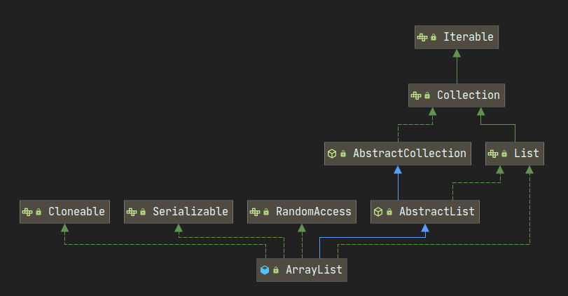

::: info 介绍

ArrayList应该是Java开发者使用最频繁的集合列表了，它底层是基于数组来实现的，相较于数组，它支持动态的扩容，元素的插入和删除变得很方便。相较于LinkedList，它支持快速随机访问，通过下标可以快速定位到元素，访问速度非常快。

:::

下面是ArrayList结构图：



ArrayList实现了Iterable接口，可以通过迭代器的方式进行遍历。同时又实现了RandomAccess接口，表示它支持快速随机访问。

## 属性说明

```java
/**
 * 默认初始容量。
 */
private static final int DEFAULT_CAPACITY = 10;

/**
 * 空数组常量
 * 指定容量为0时，共享该数组。
 */
private static final Object[] EMPTY_ELEMENTDATA = {};

/**
* 用于默认大小的空实例的共享空数组实例。
* 将它和EMPTY_ELEMENTDATA区分开来，以了解添加第一个元素时的膨胀程度。
* 不指定默认容量时，默认共享该数组。
*/
private static final Object[] DEFAULTCAPACITY_EMPTY_ELEMENTDATA = {};

/**
* 存储ArrayList的元素的数组缓冲区。
* arraylist的容量是此数组缓冲区的长度。
* 添加第一个元素时，任何具有elementData == DEFAULTCAPACITY_EMPTY_ELEMENTDATA的空ArrayList都将扩展为DEFAULT_CAPACITY.
*/
transient Object[] elementData; // 非私有以简化嵌套类访问

/**
* ArrayList的大小（它包含的元素数）。
*
* @serial
*/
private int size;
```

## 构造函数

ArrayList提供了三个构造函数，默认不会创建数组，第一次添加元素时，才创建数组。你也可以指定一个初始容量，或者直接给定一个集合，ArrayList会将集合里的元素拷贝到elementData中。

```java
/**
 * 构造一个初始容量为10的空数组.
 */
public ArrayList() {
    this.elementData = DEFAULTCAPACITY_EMPTY_ELEMENTDATA;
}

/**
 * 构造一个具有指定初始容量的空List。
 *
 * @param  initialCapacity  List的初始容量
 * @throws IllegalArgumentException 如果指定的初始容量为负
 */
public ArrayList(int initialCapacity) {
    if (initialCapacity > 0) {
        // 只要容量大于0，就会直接创建数组，并不会懒创建。
        this.elementData = new Object[initialCapacity];
    } else if (initialCapacity == 0) {
        // 容量为0，共享空数组。
        this.elementData = EMPTY_ELEMENTDATA;
    } else {
        throw new IllegalArgumentException("Illegal Capacity: "+ initialCapacity);
    }
}

/**
 * 构造一个列表，该列表包含指定集合的元素，其顺序由集合的迭代器返回。
 *
 * @param c 将其元素放入此列表的集合
 * @throws NullPointerException 如果指定的集合为null
 */
public ArrayList(Collection<? extends E> c) {
    Object[] a = c.toArray();
    if ((size = a.length) != 0) {
        if (c.getClass() == ArrayList.class) {
            elementData = a;
        } else {
            elementData = Arrays.copyOf(a, size, Object[].class);
        }
    } else {
        // 给定集合为空，共享空数组。
        elementData = EMPTY_ELEMENTDATA;
    }
}
```

## 核心操作

### add

ArrayList提供了4中添加元素的操作:

- boolean add(E e)
  在末尾添加元素。
- void add(int index, E element)
  在index位置添加元素，index后面的元素全部向后移动。
- boolean addAll(Collection<? extends E> c)
  将给定集合的所有元素添加到末尾。
- boolean addAll(int index, Collection<? extends E> c)
  将给定集合的所有元素添加到index位置，后面的元素全部向后移动。

先看`add(E e)`操作：

向ArrayList添加元素前，ArrayList首先会调用`ensureCapacityInternal()`来保证，数组有足够的长度来容纳元素。

如果元素个数超过了数组长度，就会调用`grow()`进行扩容。

最终将元素放到`size++`的位置。

```java
/**
 * 将指定的元素追加到此list的末尾。
 *
 * @param e 要添加到此列表的元素
 * @return <tt>true</tt> (as specified by {@link Collection#add})
 */
public boolean add(E e) {
    // modCount++、扩容操作，确保数组大小能容纳元素
    ensureCapacityInternal(size + 1);  // Increments modCount!!
    elementData[size++] = e;
    return true;
}

/**
 * 确保数组大小能正常容纳元素
 */
private void ensureCapacityInternal(int minCapacity) {
    ensureExplicitCapacity(calculateCapacity(elementData, minCapacity));
}

/**
 * 计算ArrayList最少需要多大的容量才能满足
 */
private static int calculateCapacity(Object[] elementData, int minCapacity) {
    if (elementData == DEFAULTCAPACITY_EMPTY_ELEMENTDATA) {
        // 第一次扩容，在DEFAULT_CAPACITY和minCapacity取最大值
        return Math.max(DEFAULT_CAPACITY, minCapacity);
    }
    return minCapacity;
}
/**
 * 确保ArrayList可以容纳这些元素，如果不能满足就要扩容了。
 */
private void ensureExplicitCapacity(int minCapacity) {
    modCount++;

    // 最少需要的容量比elementData长度大，进行扩容
    if (minCapacity - elementData.length > 0)
        grow(minCapacity);
}

/**
 * 增加容量以确保其至少可以容纳最小容量参数指定的元素数。
 *
 * @param minCapacity 所需的最小容量
 */
private void grow(int minCapacity) {
    int oldCapacity = elementData.length;
    // 新容量是旧容量的1.5倍
    int newCapacity = oldCapacity + (oldCapacity >> 1);
    if (newCapacity - minCapacity < 0)
        // 如果1.5倍还不够，则以minCapacity为容量扩容
        newCapacity = minCapacity;
    if (newCapacity - MAX_ARRAY_SIZE > 0)
        newCapacity = hugeCapacity(minCapacity);
    // minCapacity is usually close to size, so this is a win:
    elementData = Arrays.copyOf(elementData, newCapacity);
}
```

如果要在指定位置插入元素，index后的所有元素都要向后移动一位，效率较低

```java
/**
 * 将指定的元素插入此列表中的指定位置。将当前在该位置的元素（如果有）和任何后续元素右移（将其索引加一）。
 */
public void add(int index, E element) {
    // 校验index是否合法
    rangeCheckForAdd(index);
    // 确保数组大小能容纳元素
    ensureCapacityInternal(size + 1);  // Increments modCount!!
    // 将index之后的元素全部向后移动
    System.arraycopy(elementData, index, elementData, index + 1,
                     size - index);
    // index下标赋值给插入的元素
    elementData[index] = element;
    size++;
}

/**
 * 添加元素时，校验index是否合法
 */
private void rangeCheckForAdd(int index) {
    if (index > size || index < 0)
        throw new IndexOutOfBoundsException(outOfBoundsMsg(index));
}
```

将给定集合内的所有元素添加到列表末尾

```java
/**
 * 按照指定集合的Iterator返回的顺序，将指定集合中的所有元素追加到此列表的末尾。
 */
public boolean addAll(Collection<? extends E> c) {
    Object[] a = c.toArray();
    int numNew = a.length;
    ensureCapacityInternal(size + numNew);  // Increments modCount
    System.arraycopy(a, 0, elementData, size, numNew);
    size += numNew;
    return numNew != 0;
}
```

将给定集合内的所有元素添加到列表的指定位置

```java
/**
 * 将集合里的元素插入到指定下标处
 * 如果不是插入到末尾，需要先元素移动
 */
public boolean addAll(int index, Collection<? extends E> c) {
    //校验index是否合法
    rangeCheckForAdd(index);
    Object[] a = c.toArray();
    int numNew = a.length;
    //是否扩容，确保数组能容纳
    ensureCapacityInternal(size + numNew);  // Increments modCount
    int numMoved = size - index;
    if (numMoved > 0)
        //元素移动
        System.arraycopy(elementData, index, elementData, index + numNew,
                numMoved);
    System.arraycopy(a, 0, elementData, index, numNew);
    size += numNew;
    return numNew != 0;
}
```

### remove

删除指定下标的元素，如果删除的是最后一位元素，无需移动，最后一位置空即可。如果不是最后一个，index后的元素全部向前移动一位，最后一位置空，效率较低。

```java
/**
 * 删除此列表中指定位置的元素。将所有后续元素向左移动（从其索引中减去一个）。
 */
public E remove(int index) {
    rangeCheck(index);

    modCount++;
    E oldValue = elementData(index);

    int numMoved = size - index - 1;
    if (numMoved > 0)
        System.arraycopy(elementData, index+1, elementData, index, numMoved);
    // 置空，让GC工作
    elementData[--size] = null; // clear to let GC do its work
    // 返回删除的元素
    return oldValue;
}
```

也可以根据元素来删除，删除的是第一个匹配项，也是先找到index下标，再根据下标删除

```java
/**
 * 如果存在指定元素，则从该列表中删除该元素的第一次出现。
 * 如果列表不包含该元素，则该元素不变。
 */
public boolean remove(Object o) {
    if (o == null) {
        for (int index = 0; index < size; index++)
            if (elementData[index] == null) {
                fastRemove(index);
                return true;
            }
    } else {
        for (int index = 0; index < size; index++)
            if (o.equals(elementData[index])) {
                fastRemove(index);
                return true;
            }
    }
    return false;
}

/*
 * 专用的remove方法，跳过边界检查，不返回已删除的值。
 */
private void fastRemove(int index) {
    modCount++;
    int numMoved = size - index - 1;
    if (numMoved > 0)
        System.arraycopy(elementData, index+1, elementData, index, numMoved);
    elementData[--size] = null; // clear to let GC do its work
}
```

给定一个集合，删除集合内的所有元素

```java
public boolean removeAll(Collection<?> c) {
    Objects.requireNonNull(c);
    return batchRemove(c, false);
}

private boolean batchRemove(Collection<?> c, boolean complement) {
    final Object[] elementData = this.elementData;
    int r = 0, w = 0;
    boolean modified = false;
    try {
        for (; r < size; r++)
            // 无论是只保留还是只删除c中的元素，这个判断为true的都是要保留下来的元素。将需要保留的元素全部往前挪。
            if (c.contains(elementData[r]) == complement)
                elementData[w++] = elementData[r];
    } finally {
        // 即使 c.contains() 抛出异常，仍保留与AbstractCollection的行为兼容性。
        if (r != size) {
            //	即使抛异常了，也要移除已经被确认的元素。
            System.arraycopy(elementData, r, elementData, w, size - r);
            w += size - r;
        }
        // w==size说明元素都需要保留，没有要移除的元素。
        if (w != size) {
            // 上面的操作已经将要保留的元素挪到下标为0~w区间了,w之后的元素全都是要移除。w之后全部置空，帮助GC回收。
            for (int i = w; i < size; i++)
                elementData[i] = null;
            modCount += size - w;
            size = w;
            modified = true;
        }
    }
    return modified;
}
```

### get

ArrayList是基于数组的，因此可以通过下标快速访问元素

```java
public E get(int index) {
    rangeCheck(index);
	
    return elementData(index);
}
```

### set

替换指定下标的元素，并返回旧值

```java
public E set(int index, E element) {
    rangeCheck(index);

    E oldValue = elementData(index);
    elementData[index] = element;
    return oldValue;
}
```

## 总结

- ArrayList就是一个数组，默认是一个长度为0的空数组，第一次add时会进行扩容，第一次扩容的长度是`DEFAULT_CAPACITY=10`，之后按照`oldCapacity + (oldCapacity >> 1)`即1.5倍的的增速进行扩容。ArrayList不像HashMap，它没有所谓的负载因子，它只有在`elementData`装不下时才会进行扩容。
- ArrayList只会扩容，不会缩容，即使`clear`了，数组的长度依然不会变。
- 由于ArrayList基于数组实现，数组在物理结构上是一块连续的内存空间，因此不建议频繁创建大容量的ArrayList，它会给JVM的内存管理带来困难，大对象通常难以被回收，增加GC的压力。
- ArrayList不是线程安全的，只能用在单线程环境下，多线程环境下可以考虑用Collections.synchronizedList(List l)函数返回一个线程安全的ArrayList类，也可以使用concurrent并发包下的CopyOnWriteArrayList类。
- ArrayList实现了Serializable接口，因此它支持序列化，能够通过序列化传输，实现了RandomAccess接口，支持快速随机访问，实际上就是通过下标序号进行快速访问，实现了Cloneable接口，能被克隆。
- 每个ArrayList实例都有一个容量，该容量是指用来存储列表元素的数组的大小。它总是至少等于列表的大小。随着向ArrayList中不断添加元素，其容量也自动增长。自动增长会带来数据向新数组的重新拷贝，因此，如果可预知数据量的多少，可在构造ArrayList时指定其容量。在添加大量元素前，应用程序也可以使用ensureCapacity操作来增加ArrayList实例的容量，这可以减少递增式再分配的数量。
