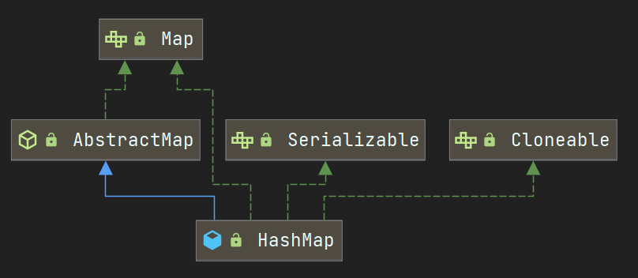

## 整体结构分层

**Map接口**

定义Map具备的功能，使用内部接口Entry来对单个映射关系进行封装,Entry是Map的基本组成单元。

**AbstractMap**

实现了Map接口的抽象类，实现了绝大多数方法，put和entrySet没有实现，因为这两个方法涉及到底层的实现逻辑和数据结构，必须交给子类去实现。

**HashMap**

继承自AbstractMap，实现了Map。

实现了自己的Entry，除了保存映射关系外，因为是基于哈希的，所以还记录了哈希值，因为采用的链表结构，所以用next记录了下一个节点的地址。

## HashMap解析

### 各属性的含义

```java
/**
 * 默认初始容量为16
 * 必须是2的幂次方数
 */
static final int DEFAULT_INITIAL_CAPACITY = 1 << 4; // aka 16

/**
 * 最大的容量上限为 2^30
 */
static final int MAXIMUM_CAPACITY = 1 << 30;

/**
 * 默认的负载因子，可通过构造器指定
 * 扩容时机:当前元素数量 >= 数组容量 * 负载因子
 */
static final float DEFAULT_LOAD_FACTOR = 0.75f;

/**
 * 变成树型结构的临界值为 8,需配合MIN_TREEIFY_CAPACITY属性一起判断使用
 */
static final int TREEIFY_THRESHOLD = 8;

/**
 * 恢复链式结构的临界值为 6
 */
static final int UNTREEIFY_THRESHOLD = 6;

/**
 * 当哈希表的大小超过这个阈值，才会把链式结构转化成树型结构，否则仅采取扩容来尝试减少冲突
 */
static final int MIN_TREEIFY_CAPACITY = 64;

/**
 * 该表在首次使用时初始化，并根据需要调整大小。分配时，长度始终是2的幂次方数。
 * （在某些操作中，我们还允许长度为零，以允许使用当前不需要的引导机制。）
 */
transient Node<K, V>[] table;

/**
 * 保存缓存的entrySet()
 */
transient Set<Map.Entry<K, V>> entrySet;

/**
 * 哈希表中键值对的个数
 */
transient int size;

/**
 * 哈希表被修改的次数
 */
transient int modCount;

/**
 * 当 size 到达这个值时，就会进行扩容操作,通过 (capacity * load factor)计算出来
 *
 * @serial
 */
int threshold;

/**
 * 哈希表的负载因子
 *
 * @serial
 */
final float loadFactor;
```

**loadFactor加载因子**

loadFactor加载因子是控制数组存放数据的疏密程度，loadFactor越趋近于1，那么数组中存放的数据(entry)也就越多，也就越密，也就是会让链表的长度增加，loadFactor越小，也就是趋近于0。loadFactor太大导致查找元素效率低，太小导致数组的利用率低，存放的数据会很分散。loadFactor的默认值为0.75f是官方给出的一个比较好的临界值。  

**threshold**

threshold = capacity * loadFactor，当 size>=threshold 的时候，那么就要考虑对数组的扩增了，也就是说，这个的意思就是衡量数组是否需要扩增的一个标准。

### Node类的定义

它是 HashMap 中的一个静态内部类，哈希表中的每一个节点都是 Node 类型。我们可以看到，Node 类中有 4 个属性，其中除了 key 和value 之外，还有 hash 和 next 两个属性。hash 是用来存储 key 的哈希值的，next 是在构建链表时用来指向后继节点的。

```java
static class Node<K, V> implements Map.Entry<K, V> {
    final int hash;// 哈希值,存放元素到hashmap中时用来与其他元素hash值比较
    final K key;// 键
    V value;// 值
    Node<K, V> next;// 指向下一个节点

    Node(int hash, K key, V value, Node<K, V> next) {
        this.hash = hash;
        this.key = key;
        this.value = value;
        this.next = next;
    }

    public final K getKey() { return key; }
    public final V getValue() { return value; }
    public final String toString() { return key + "=" + value; }
	// 重写hashCode()方法
    public final int hashCode() {
        return Objects.hashCode(key) ^ Objects.hashCode(value);
    }

    public final V setValue(V newValue) {
        V oldValue = value;
        value = newValue;
        return oldValue;
    }
	// 重写equals()方法
    public final boolean equals(Object o) {
        if (o == this)
            return true;
        if (o instanceof Map.Entry) {
            Map.Entry<?, ?> e = (Map.Entry<?, ?>) o;
            if (Objects.equals(key, e.getKey()) &&
                    Objects.equals(value, e.getValue()))
                return true;
        }
        return false;
    }
}
```

### 树节点类的定义

```java
static final class TreeNode<K, V> extends LinkedHashMap.Entry<K, V> {
        TreeNode<K, V> parent;  // 父节点
        TreeNode<K, V> left;	//左子节点
        TreeNode<K, V> right;	//右子节点
        TreeNode<K, V> prev;    // 删除时需要取消下一个链接
        boolean red;

        TreeNode(int hash, K key, V val, Node<K, V> next) {
            super(hash, key, val, next);
        }

        /**
         * 返回根节点
         */
        final TreeNode<K, V> root() {
            for (TreeNode<K, V> r = this, p; ; ) {
                if ((p = r.parent) == null)
                    return r;
                r = p;
            }
        }
		...
    }
```

### 构造方法

```java
// 构造一个空的<tt> HashMap <tt>，它具有默认的初始容量（16）和默认的负载系数（0.75）。
public HashMap() {
    this.loadFactor = DEFAULT_LOAD_FACTOR; // 所有其他字段均默认
}
// 包含另一个 Map 的构造函数
public HashMap(Map<? extends K, ? extends V> m) {
    this.loadFactor = DEFAULT_LOAD_FACTOR;
    putMapEntries(m, false);
}
// 指定 容量大小 的构造函数
public HashMap(int initialCapacity) {
    this(initialCapacity, DEFAULT_LOAD_FACTOR);
}
// 指定 容量大小 和 加载因子 的构造函数
public HashMap(int initialCapacity, float loadFactor) {
    if (initialCapacity < 0)
        throw new IllegalArgumentException("Illegal initial capacity: " +
                initialCapacity);
    if (initialCapacity > MAXIMUM_CAPACITY)
        initialCapacity = MAXIMUM_CAPACITY;
    if (loadFactor <= 0 || Float.isNaN(loadFactor))
        throw new IllegalArgumentException("Illegal load factor: " +
                loadFactor);
    this.loadFactor = loadFactor;
    this.threshold = tableSizeFor(initialCapacity);
}

final void putMapEntries(Map<? extends K, ? extends V> m, boolean evict) {
    int s = m.size();
    if (s > 0) {
        // 判断table是否已经初始化
        if (table == null) { // pre-size
            // 未初始化,s为m的实际元素个数
            float ft = ((float) s / loadFactor) + 1.0F;
            int t = ((ft < (float) MAXIMUM_CAPACITY) ? (int) ft : MAXIMUM_CAPACITY);
            // 计算得到的 t 大于阈值,则初始化阈值为2的幂
            if (t > threshold) threshold = tableSizeFor(t);
        } 
        // 已经初数化,并且 m 元素个数大于阈值,进行扩容处理
        else if (s > threshold) resize();
        
        // 将 m 中的所有元素添加到 HashMap 中
        for (Map.Entry<? extends K, ? extends V> e : m.entrySet()) {
            K key = e.getKey();
            V value = e.getValue();
            putVal(hash(key), key, value, false, evict);
        }
    }
}
```

### get方法

实现步骤大致如下：

1、通过 hash 值获取该 key 映射到的桶。

2、桶上的 key 就是要查找的 key，则直接命中。

3、桶上的 key 不是要查找的 key，则查看后续节点：

（1）如果后续节点是树节点，通过调用树的方法查找该 key。 

（2）如果后续节点是链式节点，则通过循环遍历链查找该 key。

```java
public V get(Object key) {
    Node<K, V> e;
    return (e = getNode(hash(key), key)) == null ? null : e.value;
}

final Node<K, V> getNode(int hash, Object key) {
    Node<K, V>[] tab;
    Node<K, V> first, e;
    int n;
    K k;
    // 如果哈希表不为空 且 key对应的桶上不为空
    if ((tab = table) != null && (n = tab.length) > 0 && (first = tab[(n - 1) & hash]) != null) {
        // 是否直接命中
        if (first.hash == hash && // always check first node
                ((k = first.key) == key || (key != null && key.equals(k))))
            return first;
        // 判断是否有后续节点
        if ((e = first.next) != null) {
            // 如果当前的桶是采用红黑树处理冲突,则调用红黑树的get方法去获取节点
            if (first instanceof TreeNode)
                return ((TreeNode<K, V>) first).getTreeNode(hash, key);
            // 不是红黑树的话,那就是传统的链式结构了,通过循环的方法判断链中是否存在该key
            do {
                if (e.hash == hash && ((k = e.key) == key || (key != null && key.equals(k))))
                    return e;
            } while ((e = e.next) != null);
        }
    }
    return null;
}
```

### put方法

```java
public V put(K key, V value) {
    return putVal(hash(key), key, value, false, true);
}

final V putVal(int hash, K key, V value, boolean onlyIfAbsent, boolean evict) {
    Node<K, V>[] tab;
    Node<K, V> p;
    int n, i;
    // 如果table[]为空,或者 length=0,就扩容到16
    if ((tab = table) == null || (n = tab.length) == 0)
        n = (tab = resize()).length;
    // (n - 1) & hash 确定元素存放在哪个桶中,桶为空,新生成节点放入桶中(此时,这个节点是放在数组中)
    if ((p = tab[i = (n - 1) & hash]) == null)
        tab[i] = newNode(hash, key, value, null);
    // 桶中已经存在元素
    else {
        Node<K, V> e;
        K k;
        // 比较桶中第一个元素(数组中的节点)的hash值相等,key相等
        if (p.hash == hash && ((k = p.key) == key || (key != null && key.equals(k))))
            // 将第一个元素赋值给 e,用e来记录
            e = p;
        // hash值不相等,即 key 不想等: 为红黑树节点
        else if (p instanceof TreeNode)
            e = ((TreeNode<K, V>) p).putTreeVal(this, tab, hash, key, value);
        else {
            for (int binCount = 0; ; ++binCount) {
                if ((e = p.next) == null) {
                    p.next = newNode(hash, key, value, null);
                    if (binCount >= TREEIFY_THRESHOLD - 1) // -1 for 1st
                        treeifyBin(tab, hash);
                    break;
                }
                if (e.hash == hash &&
                        ((k = e.key) == key || (key != null && key.equals(k))))
                    break;
                p = e;
            }
        }
        if (e != null) { // existing mapping for key
            V oldValue = e.value;
            if (!onlyIfAbsent || oldValue == null)
                e.value = value;
            afterNodeAccess(e);
            return oldValue;
        }
    }
    ++modCount;
    if (++size > threshold)
        resize();
    afterNodeInsertion(evict);
    return null;
}
```
