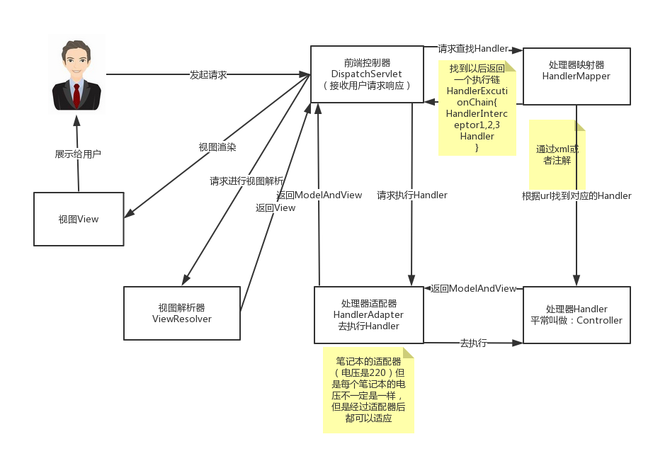

# 一.Spring MVC 简介
> 大部分Java应用都是Web应用，展现层是WEB应用不可忽略的重要环节。Spring为了展现层提供了一个优秀的WEB框架-Spring MVC。和众多的其他WEB框架一样，它基于MVC的设计理念。此外，它采用了松散耦合，可插拔的组件结构，比其他的MVC框架更具有扩展性和灵活性，Spring MVC通过一套MVC注解，让POJO成为成为处理请求的处理器，无须实现任何接口。同时，Spring MVC还支持REST风格的URL请求: 注解驱动及REST风格的Spring MVC是Spring的出色功能之一。
>
> 此外，Spring MVC在数据绑定，视图解析，本地化处理及静态资源处理上都有许多不俗的表现，它在框架设计，可扩展，灵活性等方面全面超越了Struts，WebWork等MVC框架，从原来的追赶者一跃成为了MVC的领跑者

## 1.1 MVC模式简介
>MVC全名是Model View Controller，是**模型**(model)－**视图**(view)－**控制器**(controller)的缩写，一种软件设计典范，用一种业务逻辑、数据、界面显示分离的方法组织代码，将业务逻辑聚集到一个部件里面，在改进和个性化定制界面及用户交互的同时，不需要重新编写业务逻辑。MVC被独特的发展起来用于映射传统的输入、处理和输出功能在一个逻辑的图形化用户界面的结构中。

MVC 是一种使用 MVC（Model View Controller 模型-视图-控制器）设计创建 Web 应用程序的模式：

- Model（模型）表示应用程序核心（比如数据库记录列表）。
- View（视图）显示数据（数据库记录）。
- Controller（控制器）处理输入（写入数据库记录）。

MVC 模式同时提供了对 HTML、CSS 和 JavaScript 的完全控制。

**Model（模型）**是应用程序中用于处理应用程序数据逻辑的部分。<br />　　通常模型对象负责在数据库中存取数据。

**View（视图）**是应用程序中处理数据显示的部分。<br />　　通常视图是依据模型数据创建的。

**Controller（控制器）**是应用程序中处理用户交互的部分。<br />　　通常控制器负责从视图读取数据，控制用户输入，并向模型发送数据。

MVC 分层有助于管理复杂的应用程序，因为您可以在一个时间内专门关注一个方面。例如，您可以在不依赖业务逻辑的情况下专注于视图设计。同时也让应用程序的测试更加容易。

MVC 分层同时也简化了分组开发。不同的开发人员可同时开发视图、控制器逻辑和业务逻辑。

## 1.2 Spring MVC 体系结构
Spring MVC是基于 Model 2实现的技术框架，Model 2是经典的MVC(model，view，control)模型在WEB应用中的变体。这个改变主要源于HTTP协议的无状态性，Model 2 的目的和MVC一样，也是利用处理器分离模型，视图和控制，达到不同技术层级间松散层耦合的效果，提高系统灵活性，复用性和可维护性。大多情况下，可以将Model 2 与 MVC等同起来。

**Spring MVC体系概述**

>  Spring MVC框架围绕DispatcherServlet这个核心展开，DispatcherServlet是Spring MVC的总导演，总策划。它负责截获请求并将其分派给相应的处理器处理。Spring MVC框架包括注解驱动控制器，请求及响应的信息处理，视图解析，本地化解析，上传文件解析，异常处理及表单标签绑定内容等...

**组件介绍**

+ DispatcherServlet：作为前端控制器，整个流程控制的中心，控制其它组件执行，统一调度，降低组件之间的耦合性，提高每个组件的扩展性。
+ HandlerMapping：通过扩展处理器映射器实现不同的映射方式，例如：配置文件方式，实现接口方式，注解方式等。
+ HandlAdapter：通过扩展处理器适配器，支持更多类型的处理器，调用处理器传递参数等工作!
+ ViewResolver：通过扩展视图解析器，支持更多类型的视图解析，例如：jsp、freemarker、pdf、excel等。

### 1.3 Spring MVC执行流程


从接收请求到响应，Spring MVC框架的众多组件通力配合，各司其职，有条不紊的完成分内工作!在整个框架中，DispatchserServlet处于核心的位置，它负责协调和组织不同组件以完成请求处理以及返回影响工作。和大多数Web MVC框架一样，Spring MVC 通过一个前段的Servlet接收所有请求，并将这些工作委托给其他组件进行处理，DispatcherServlet 就是Spring MVC的前段Servlet。下面对Spring MVC处理请求的整体过程进行详解!

1. 整个过程始于客户端发出的一个HTTP请求，WEB应用服务器接收到这个请求，如果匹配DispatcherServlet的映请求映射路径(web.xml中指定)，则Web容器将该请求转交给DispatcherServlet处理。
2. 接收到这个请求后，将根据请求的信息(包括 URL，HTTP方法，请求头，请求参数，Cookie等)及HandlerMapping的配置找到处理请求的处理器(Handler)。可将HandlerMapping看做路由控制器，将Handler看做目标主机。值得注意的是，在Spring MVC中并没有定义一个Handler接口，实际上，任何一个Object都可以成为请求处理器。
3. 当DispatcherServlet根据HandlerMapping得到对应当前请求的Handler后，通过HandlerAdapter对Handler的封装，再以统一的适配器接口调用Handler。HandlerAdapter是Spring MVC的框架级接口，顾名思义，HandlerAdapter是一个适配器，它用统一的接口对各种Handler的方法进行调用。
4. 处理器完成业务逻辑的处理后将返回一个ModelAndView给DispatcherServlet，ModelAndView包含了视图逻辑名和模型数据信息。
5. ModelAndView中包含的是"逻辑视图名"而并非真正的视图对象，DispatcherServlet借由ViewResolver完成逻辑视图名到真实视图对象的解析工作。
6. 当得到真实的视图对象View后，DispatcherServlet就使用这个View对象对ModelAndView中的模型数据进行视图渲染。
7. 最终客户端得到的响应信息可能是一个普通的HTML页面，也可能是一个XML或者JSON串，甚至是一张图片或者一个PDF文档等不同的媒体形式。

### 1.4 组件开发实现情况
**1、前端控制器DispatcherServlet（不需要工程师开发），由框架提供**

作用：接收请求，响应结果，相当于转发器，中央处理器。有了dispatcherServlet减少了其它组件之间的耦合度。需要在web.xml里面进行配置。<br />用户请求到达前端控制器，它就相当于mvc模式中的c，dispatcherServlet是整个流程控制的中心，由它调用其它组件处理用户的请求，dispatcherServlet的存在降低了组件之间的耦合性。

**2、处理器映射器HandlerMapping(不需要工程师开发)，由框架提供**

作用：根据的url来和注解或者xml进行匹配来找到目标handler。<br />找到以后返回给前端控制器一个执行器链（包括目标handler和拦截器）。找不到报错404。需要在spirng的配置文件里面进行配置。

**3、处理器适配器HandlerAdapter(不需要工程师开发)**

作用：对目标handler进行适配。并且去执行目标handler，执行完成之后，返回一个ModelAdnView。<br />需要进行配置。在spirng的配置文件里面进行配置。

**4、处理器Handler(需要工程师开发)**

handler就是我们以前写的servlet程序。handler需要我们自己编写，提供相应的注解。

**5、视图解析器View resolver(不需要工程师开发)，由框架提供**

把逻辑视图解析成真正的视图。返回给前端处理器。springmvc提供，需要进行配置，在spirng的配置文件里面。

**6、视图ModelAdnView(需要工程师开发jsp...)**

包含了数据和要跳转的页面。里面的视图是逻辑视图，还需要进行处理才能确定真正的视图。 springmvc提供，直接使用。

## 1.5 核心分发器DispatcherServlet
> DispatcherServlet是Spring MVC的"灵魂"和"心脏"，它负责接受HTTP请求并协调 Spring MVC的各个组件完成请求处理的工作。和任何Servlet一样，用户必须在web.xml中配置好DispatcherServlet。

### 1.5.1 DispatcherServlet介绍
> DispatcherServlet是前端控制器设计模式的实现，提供spring Web MVC的集中访问点，而且负责职责的分派，而且与Spring IoC容器无缝集成，从而可以获得Spring的所有好处。

### 1.5.2 DispatcherServlet主要职责
DispatcherServlet主要用作职责调度工作，本身主要用于控制流程，主要职责如下：

1. 文件上传解析，如果请求类型是multipart将通过MultipartResolver进行文件上传解析；
2. 通过HandlerMapping，将请求映射到处理器（返回一个HandlerExecutionChain，它包括一个处理器、多个HandlerInterceptor拦截器）；
3. 通过HandlerAdapter支持多种类型的处理器(HandlerExecutionChain中的处理器)；
4. 通过ViewResolver解析逻辑视图名到具体视图实现；
5. 本地化解析；
6. 渲染具体的视图等；
7. 如果执行过程中遇到异常将交给HandlerExceptionResolver来解析。
### 1.5.3 DispatcherServlet辅助类
Spring中的DispatcherServlet使用一些特殊的bean来处理request请求和渲染合适的视图。这些bean就是Spring MVC中的一部分。你能够通过在WebApplicationContext中的一个或多个配置来使用这些特殊的bean。但是，你不需要在Spring MVC在维护这些默认要使用的bean时，去把那些没有配置过的bean都去初始化一道。在下一部分中，首先让我们看看在DispatcherServlet依赖的那些特殊bean类型

| **bean类型** | **说明** |
| :-- | :-- |
| Controller | 处理器/页面控制器，做的是MVC中的C的事情，但控制逻辑转移到前端控制器了，用于对请求进行处理 |
| HandlerMapping | 请求到处理器的映射，如果映射成功返回一个HandlerExecutionChain对象（包含一个Handler处理器（页面控制器）对象、多个HandlerInterceptor拦截器）对象；如BeanNameUrlHandlerMapping将URL与Bean名字映射，映射成功的Bean就是此处的处理器 |
| HandlerAdapter | HandlerAdapter将会把处理器包装为适配器，从而支持多种类型的处理器，即适配器设计模式的应用，从而很容易支持很多类型的处理器；如SimpleControllerHandlerAdapter将对实现了Controller接口的Bean进行适配，并且掉处理器的handleRequest方法进行功能处理 |
| HandlerExceptionResolver | 处理器异常解析，可以将异常映射到相应的统一错误界面，从而显示用户友好的界面（而不是给用户看到具体的错误信息） |
| ViewResolver | ViewResolver将把逻辑视图名解析为具体的View，通过这种策略模式，很容易更换其他视图技术；如InternalResourceViewResolver将逻辑视图名映射为jsp视图 |
| LocaleResolver & LocaleContextResolver | 解析客户端中使用的地区和时区，用来提供不同的国际化的view视图。 |
| ThemeResolver | 主题解析器，解析web应用中能够使用的主题，比如提供个性化的网页布局。 |
| MultipartResolver | 多部件解析器，主要处理multi-part(多部件)request请求，例如：在HTML表格中处理文件上传。 |
| FlashMapManager | FlashMap管理器储存并检索在"input"和"output"的FlashMap中可以在request请求间(通常是通过重定向)传递属性的FlashMap |

## 二、基于SpringMVC 的WEB应用
maven项目pom配置:
```xml
<?xml version="1.0" encoding="UTF-8"?>

<project xmlns="http://maven.apache.org/POM/4.0.0" xmlns:xsi="http://www.w3.org/2001/XMLSchema-instance"
  xsi:schemaLocation="http://maven.apache.org/POM/4.0.0 http://maven.apache.org/xsd/maven-4.0.0.xsd">
  <modelVersion>4.0.0</modelVersion>

  <groupId>cgp</groupId>
  <artifactId>spring-mvc</artifactId>
  <version>1.0-SNAPSHOT</version>
  <packaging>war</packaging>

  <name>spring-mvc Maven Webapp</name>
  <!-- FIXME change it to the project's website -->
  <url>http://www.example.com</url>


  <dependencies>
    <dependency>
      <groupId>junit</groupId>
      <artifactId>junit</artifactId>
      <version>4.12</version>
      <scope>test</scope>
    </dependency>
    <dependency>
      <groupId>org.springframework</groupId>
      <artifactId>spring-webmvc</artifactId>
      <version>5.1.6.RELEASE</version>
    </dependency>

  </dependencies>
  <build>
    <resources>
      <resource>
        <directory>src/main/java</directory>
        <includes>
          <include>**/*.*</include>
        </includes>
        <filtering>true</filtering>
      </resource>
      <resource>
        <directory>src/main/resources</directory>
        <includes>
          <include>**/*.*</include>
        </includes>
      </resource>
    </resources>
    <plugins>
      <plugin>
        <groupId>org.apache.tomcat.maven</groupId>
        <artifactId>tomcat7-maven-plugin</artifactId>
        <version>2.2</version>
        <configuration>
          <port>91</port>
          <path>/web</path>
          <uriEncoding>UTF-8</uriEncoding>
          <server>tomcat7</server>
        </configuration>
      </plugin>
    </plugins>
  </build>

</project>
```
## 2.1 配置web.xml
```xml
<servlet>
    <!--配置springmvc前端处理器DispatcherServlet-->
    <servlet-name>dispatcherServlet</servlet-name>
    <servlet-class>org.springframework.web.servlet.DispatcherServlet</servlet-class>

    <!--用来加载springmvc的配置文件-->
    <!--如果不配置,会默认加载/WEB-INF/<servlet-name>-servlet.xml文件-->
    <init-param>
        <param-name>contextConfigLocation</param-name>
        <param-value>classpath:spring-mvc.xml</param-value>
    </init-param>
    <!--在服务器启动的时候就初始化该servlet-->
    <load-on-startup>1</load-on-startup>
</servlet>
<servlet-mapping>
    <servlet-name>dispatcherServlet</servlet-name>
    <!--配置拦截路径
        /* --拦截所有请求  js jsp  html  css  img  控制器等 一般不使用
        /  --不拦截jsp   js HTML css  控制器等    强烈推荐
        *.action *.do   --只拦截指定后缀的请求  传统项目  crm  管理系统
    -->
    <url-pattern>/</url-pattern>
</servlet-mapping>

<!--解决post请求乱码-->
<filter>
    <filter-name>characterEncodingFilter</filter-name>
    <filter-class>org.springframework.web.filter.CharacterEncodingFilter</filter-class>
    <init-param>
        <param-name>encoding</param-name>
        <param-value>UTF-8</param-value>
    </init-param>
    <init-param>
        <param-name>forceEncoding</param-name>
        <param-value>true</param-value>
    </init-param>
</filter>

<filter-mapping>
    <filter-name>characterEncodingFilter</filter-name>
    <url-pattern>/*</url-pattern>
</filter-mapping>
```

| **param-name** | **param-value** |
| :-- | :-- |
| contextConfigLocation | 引入springmvc配置文件，默认classpath:-servlet.xml，如果放在src/resources的下级文件夹，例如:resources/spring/servlet-name-servlet.xml，值可以编写成: classpath:/spring/servlet-name-servlet.xml，如果没有放在src/resources资源的根目录下，放在了WEB项目的WEB-INF/spring/servlet-name-serlvet.xml，值可以编写成:/WEB-INF/spring/servlet-name-servlet.xml。 |
| namespace | 修改DispatcherServlet对应的命名空间，默认为-servlet，可以通过namespace修改默认名字! |
| publishContext | 布尔类型的属性，默认值为ture，DispatcherServlet根据该属性决定是否将WebApplicationContext发布到ServletContext的属性列表中，以便调用者可以借用ServletContext找到WebApplicationContext实例，对应的属性名为DispatcherServlet#getServletContextAttributeName()方法返回的值。 |
| publishEvents | 布尔类型的属性，当DispatcherServlet处理完一个请求后，是否需要向容器发布一个ServletRequestHandledEvent事件，默认值为true。如果容器中没有任何事件监听器，则可以将该属性设置为false，以便提高运行性能。 |

## 2.2 配置Spring MVC配置文件
```xml
<context:component-scan base-package="springmvc1.controller"/>

<!--配置处理器映射器-->
<!--<bean class="org.springframework.web.servlet.mvc.method.annotation.RequestMappingHandlerMapping"/>-->
<!--配置处理器适配器-->
<!--<bean class="org.springframework.web.servlet.mvc.method.annotation.RequestMappingHandlerAdapter"/>-->

<!--MVC注解驱动 相当于以上两句 而且功能更强大-->
<mvc:annotation-driven/>

<!--配置视图解析器-->
<bean class="org.springframework.web.servlet.view.InternalResourceViewResolver">
    <!--配置前缀和后缀-->
    <property name="suffix" value=".jsp"/>
    <property name="prefix" value="/WEB-INF/jsp/"/>
</bean>
```
## 2.3 创建controller包以及控制器类
```java
@Controller
public class HelloController {
    @RequestMapping("/hello") //相当于接收：http://ip:port/应用名/hello
    public String hello(){
        System.out.println("hello-->");
        //表示转发到页面  index是逻辑视图  加上前缀和后缀才是真正的视图  /WEB-INF/jsp/index.jsp
        return "index";
    }
}
```
## 2.4 测试Spring MVC
发布项目，通过浏览器，访问 当前项目对应地址+ /hello即可!
# 三、 常用注解
### @RequestMapping注解应用
#### 3.1.1 value属性
```java
@Controller
@RequestMapping("cgp")//写在类上表示窄化请求,可不写
//@RequestMapping(value = "cgp")//方式二 value在只有一个参数的时候可不写
//@RequestMapping(value = {"cgp1","cgp2"})//方式三 可以写数组
public class Annotation {
    @RequestMapping("add") //窄化后路径为http://ip:port/项目根路径/cgp/add
    public String add(){
        System.out.println("Annotation.add");
        return "index";
    }
}
```
#### 3.1.2 method属性
> 可以指定方法对应的请求方式!如果客户端请求的方式和方法设置的方式不同，请求不成功!

```java
//method属性表示该方法支持的请求类型,不写的话任意请求都可以。常用四种请求方式:GET POST PUT DELETE
@RequestMapping(value = "add2",method = RequestMethod.GET)
//@RequestMapping(value = "add2",method = RequestMethod.POST)
//@RequestMapping(value = "add2",method = {RequestMethod.GET,RequestMethod.POST})
public String add2(){
    System.out.println("Annotation.add2");
    return "index";
}
```
#### 3.1.3 表单参数处理

- 创建一个登陆表单
```html
  <!--action指定controller中对应的方法路径即可!-->
  <form action="/xx/login" method="POST">
      <label for="username">用户名:<input type="text" name="username" /></label>
      <label for="password">密码:<input type="text" name="password" /></label>
      <input type="submit" value="登陆">
  </form>
```

- 获取参数的控制器
```java
@RequestMapping("login")
//只需要在方法的形参里面写上参数，参数的名字要和表单的name属性值一样。
public String login(String username,String password){
    System.out.println("username = " + username);
    System.out.println("password = " + password);
    return "index";
}
```

- 获取特殊格式数据
```java
//[username=chen&password=112&age=18&date=2012/12/12&hb=apple&hb=banana]
@RequestMapping("login")
//默认String字符串转化为Integer(不推荐int,因为当age参数不存在时,会返回null,而null不能转化为int,从而报错)
//日期默认支持格式:yyyy/MM/dd (2012/12/12) 自动转化为Date
//可以用String接收多选框数据,显示为 apple,banana 不过不推荐 一般用数组接收
//注意:如果格式无法转化会报400错误，如果出现400错误要注意检查在的参数是否匹配
public String login(String username, String password, Integer age, Date date, String[] hb) {
    System.out.println("username = " + username);//chen
    System.out.println("password = " + password);//112
    System.out.println("age = " + age);//18
    System.out.println("date = " + date);//Wed Dec 12 00:00:00 CST 2012
    System.out.println("hb = " + Arrays.toString(hb));//[apple, banana]
    return "index";
}
```
### @RequestParam注解使用
开发中，也会碰到请求参数name的值与方法的参数名不同，这时就需要使用@RequestParam注解!
```java
@RequestMapping("login")
//使用@RequestParam注解后,形参值就可以是任意名
//defaultValue设定默认值,当表单没有提交该数据时,会默设定该值
//多选框数据可以使用集合接收
//标注后该参数必传,不然会报错
public String login(@RequestParam(value="username")String name,
                    @RequestParam(value = "password",defaultValue = "1234") String pwd,
                    @RequestParam(value = "list")ArrayList<String> list) {
    System.out.println("name = " + name);
    System.out.println("pwd = " + pwd);
    System.out.println("list = " + list);//list = [apple, banana]
    return "index";
}
```
以后分页数据可以如下设置
```java
@RequestMapping("/page")
public String queryPage(@RequestParam(defaultValue = "1")Integer currentPage,
                        @RequestParam(defaultValue = "10")Integer pageSize){
    return "index";
}
```
### @PathVariable 获取路径参数
我们可以通过此注解，获取路径部分的数据!
```java
@RequestMapping("path/{id}")
//{id}表示占位符 (可以是任意字符)
//@PathVariable从路径里面获取数据 http://localhost:8080/mvc/cgp/path/hello
//获取路径/path/后面的hello数据
//只会解析一层 如果是path/hello/world 则会404
public String path(@PathVariable("id") String path) {
    System.out.println("path = " + path);//path = hello
    return "index";
}
```
### [@CookieValue ](/CookieValue )
```java
@RequestMapping("cookie")
public String cookie(@CookieValue("JSESSIONID")String cookie){
    System.out.println("cookie = " + cookie);//cookie = 25427660AB818EEFE1A27FCF71AD95BB
    return "index";
}
```
### [@RequestHeader ](/RequestHeader )
@RequestHeader注解可以获取请求头中的数据!!
```java
@RequestMapping("header")
public String header(@RequestHeader("User-Agent")String header){
    System.out.println("header = " + header);
    return "index";
}
```
### params请求表达式
通过表达式精准映射请求

params和headers支持简单的表达式
1. param:表示请求必须包含名为param的请求参数
2. !param:表示请求中不能包含名为param的参数
3. param != value:表示请求中包含param的请求参数，但是值不能为value
4. param == value:表示请求中包含param的请求参数，但是值为value

```java
 @RequestMapping(value = "/param" , params = {"!username","age!=10"})
 public String testParam(String usernam , Integer age){
     System.out.println("usernam:"+usernam);
     System.out.println("age:"+age);
     return "index";
 }
```
param 和 header
```java
@RequestMapping(value = "/param1" ,headers={"Connection!=keep-alive"},params = {"!username","age!=10"})
public String testParam1(String usernam , Integer age){
     System.out.println("usernam:"+usernam);
     System.out.println("age:"+age);
     return "result";
}
```
### ant风格的路径
ant风格资源地址支持3种匹配符:

1. ?:匹配文件名中的一个字符
2. *:匹配文件名中的任意字符
3. **:匹配多层路径

代码:
```java
 @RequestMapping(value = "/?/*/xx" )
```
# 四、 其他重要操作
## 4.1. 转发和重定向
```java
@Controller
public class Test {
    @RequestMapping("add")
    public String add() {
        System.out.println("Test.add");
        return "index";//转发到index.jsp 走视图解析器 可以转发到WEB-INF下的jsp
    }
    @RequestMapping("delete")
    public String delete() {
        System.out.println("Test.delete");
        return "forward:add";//转发到add控制器方法 不走视图解析器
    }
    
    @RequestMapping("query")
    public String query() {
        System.out.println("Test.query");
        return "redirect:delete";//重定向到控制器方法 不走视图解析器
    }
    @RequestMapping("update")
    public String update() {
        System.out.println("Test.update");
        return "redirect:login.jsp";//重定向到jsp页面 不走视图解析器 jsp页面一定不能放在WEB-INF下
    }
}
```
## 4.2. 解决参数乱码问题
Spring MVC中 GET方式不会乱码!

在web.xml配置文件中添加spring自带的Filter设置编码格式

```xml
  <filter>
    <filter-name>characterEncodingFilter</filter-name>
    <filter-class>org.springframework.web.filter.CharacterEncodingFilter</filter-class>
    <init-param>
      <param-name>encoding</param-name>
      <param-value>UTF-8</param-value>
    </init-param>
    <init-param>
      <param-name>forceEncoding</param-name>
      <param-value>true</param-value>
    </init-param>
  </filter>

  <filter-mapping>
    <filter-name>characterEncodingFilter</filter-name>
    <url-pattern>/*</url-pattern>
  </filter-mapping>
```
# 五、向controller传递对象类型数据
> 通过form表单向指定的controller的方法传递对象!

## 5.1 创建POJO对象
POJO(Plain Ordinary Java Object)用来表示普通的Java对象，它不包含业务逻辑或持久逻辑等.
```java
@Data
public class User {
    private String name;
    private Integer age;
    @DateTimeFormat(pattern = "yyyy-MM-dd")
    private Date date;
    private Address address;
}
```

```java
public class Address {
    private String province;
    private String city;
    public Address() {}
    @Override
    public String toString() {...}
	getter() setter()
}
```
## 5.2 创建控制器类
```java
@Controller
@RequestMapping("user")
public class UserController {
    @RequestMapping("form")
    public String form(){
        return "user/form";//跳转到form表单
    }
    @RequestMapping("add")
    public String add(User user){
        System.out.println("user = " + user);
        return "index";
    }
}
```
## 5.3 创建form.jsp
文件位置: /WEB-INF/user/form.jsp
```txt
<form action="${pageContext.request.contextPath}/user/add" method="post">
	<%--<label> 标签作用:当用户选择该标签时，浏览器就会自动将焦点转到和标签相关的表单控件上。--%>
    <label for="name">用户名:<input type="text" id="name" name="name" /></label><br/>
    <label for="age">年龄:<input type="text" id="age" name="age" /></label><br/>
    <label for="date">生日:<input type="date" id="date" name="date" /></label><br/>
    <label for="address.province">省份:<input type="text" id="address.province" name="address.province" /></label><br/>
    <label for="address.city">城市:<input type="text" id="address.city" name="address.city" /></label><br/>
    <input type="submit"  value="提交" />
</form>
```
**name属性要和User对象的属性相同**

<span style="color:red">注意:name的特殊写法，这里可以直接将表单数据转成User对象，但是User对象内部包含 Address的对象，所以，这里可以调用第一层属性，再点一层属性，如果多层依次类推!</span>

## 5.4 测试结果
```
user = User{name='chenganpin', age=12, date=Wed May 08 00:00:00 CST 2019, address=Address{province='浙江', city='温州'}}
```
# 六、 controller向页面传递数据
实现方案有三种: **ModelAndView** **Map** **Model**

往页面传递数据使用request域对象

## 6.1 ModelAndView
```java
@RequestMapping("data1")
public ModelAndView request1() {
    User user = new User("cgp", 18, new Date(), new Address("浙江", "温州"));
    ModelAndView mav = new ModelAndView();
    mav.setViewName("index");//设置视图名字  逻辑视图  走视图解析器
    mav.addObject("user", user);//设置数据
    return mav;
}
```
页面显示代码:
```txt
<%@ page contentType="text/html;charset=UTF-8" language="java" %>
<%@ taglib prefix="fmt" uri="http://java.sun.com/jsp/jstl/fmt" %>
<html>
<head>
    <title>结果</title>
</head>
<body>
${requestScope.user}
<%--User{name='cgp', age=18, date=Wed May 08 19:08:27 CST 2019, address=Address{province='浙江', city='温州'}}--%>
<hr/>
${requestScope.user.date}
<%--Wed May 08 19:08:27 CST 2019--%>
<hr/>
<fmt:formatDate value="${requestScope.user.date}" pattern="yyyy-MM-dd"/>
<%--2019-05-08--%>
</body>
</html>
```
## 6.2 Map
```java
@RequestMapping("data2")
//在方法形参上写上Map<String,Object> map
public String data2(Map<String,Object> map){
    User user = new User("cgp", 18, new Date(), new Address("浙江", "温州"));
    map.put("user",user);//map里面存放数据  就会往request域对象放
    return "index";//转发
}
```
页面显示代码同上
## 6.3 Model
将map替换成model即可!
```java
@RequestMapping("data3")
public String data3(Model model){
    User user = new User("cgp", 18, new Date(), new Address("浙江", "温州"));
    model.addAttribute("user",user);
    return "index";
}
```
**总结**: 使用以上三种情况可以将数据返回给页面，页面使用EL表达式即可获取!但是要注意!数据放入的是requestScope域!其他域获取不到!<br />验证代码:
```
${name}
${requestScope.name}
${sessionScope.name}
----------------------------------------
结果显示值!前两个显示!sessionScope不显示!
```
如果需要在sessionScope复制一份!可以利用@SessionAttributes属性!
```java
@SessionAttributes(names = "user")  //names可以选择多个值,但是必须是已有的命名!
@Controller
@RequestMapping("data")
public class DataController {...}
```
# 七、 控制器方法中使用原生API
如果我们需要使用Servlet内部常用类:

- HttpServletRequest
- HttpServletResponse
- HttpSession 等

直接在Controller层的方法中传入对应参数即可!不分顺序!<br />注意:如果使用maven项目 需要导入 jsp jstl servlet api
```xml
<dependency>
    <groupId>javax.servlet</groupId>
    <artifactId>jstl</artifactId>
    <version>1.2</version>
</dependency>
<dependency>
    <groupId>javax.servlet.jsp</groupId>
    <artifactId>jsp-api</artifactId>
    <version>2.2.1-b03</version>
    <scope>provided</scope>
</dependency>
<dependency>
    <groupId>javax.servlet</groupId>
    <artifactId>javax.servlet-api</artifactId>
    <version>4.0.1</version>
    <scope>provided</scope>
</dependency>
```
Java代码示例:
```java
@Controller
@RequestMapping("servlet")
public class ServletApiController {
    @RequestMapping("api")
    public void test(HttpServletRequest request, HttpServletResponse response, HttpSession session) throws ServletException, IOException {
        User user = new User("cgp", 18, new Date(), new Address("浙江", "温州"));
        ServletContext context = request.getServletContext();
        request.setAttribute("user",user);
        session.setAttribute("user",user);
        context.setAttribute("user",user);
        System.out.println(session.getId());
        request.getRequestDispatcher("/WEB-INF/jsp/index.jsp").forward(request,response);
    }
}
```
# 八、 RESTful风格编码
## 8.1 RESTful介绍
REST:即Representational State Transfer ， (资源)表现层状态转化，是目前最流行的一种互联网软件架构。它结构清晰、符合标注、易于理解、方便扩展，所以越来越多的网站采用！

具体说，就是HTTP协议里面，四个表示操作方式的动词:

**GET** **POST** **PUT** **DELETE**

它们分别代表着四种基本操作:

- GET用来获取资源 (查)
- POST用来创建新资源 (增)
- PUT用来更新资源 (改)
- DELETE用来删除资源 (删)

如何通过路径和http动词获悉要调用的功能：

| 请求方式 | 路径                | 含义                         |
| -------- | ------------------- | ---------------------------- |
| GET      | /zoos               | 列出所有动物园               |
| POST     | /zoos               | 新建一个动物园               |
| GET      | /zoos/ID            | 获取某个指定动物园的信息     |
| PUT      | /zoos/ID            | 更新某个指定动物园的信息     |
| DELETE   | /zoos/ID            | 删除某个动物园               |
| GET      | /zoos/ID/animals    | 列出某个指定动物园的所有动物 |
| DELETE   | /zoos/ID/animals/ID | 删除某个指定动物园的指定动物 |

## 8.2 为什么使用RESTful
1．JSP技术可以让我们在页面中嵌入Java代码，但是这样的技术实际上限制了我们的开发效率，因为需要我们Java工程师将html转换为jsp页面，并写一些脚本代码，或者前端代码。这样会严重限制我们的开发效率，也不能让我们的java工程师专注于业务功能的开发，所以目前越来越多的互联网公司开始实行前后端分离。

2．近年随着移动互联网的发展，各种类型的Client层出不穷，RESTful可以通过一套统一的接口为Web，iOS和Android提供服务。另外对于广大平台来说，比如微博开放平台，微信开放平台等，它们不需要有显式的前端，只需要一套提供服务的接口，RESTful无疑是最好的选择。

## 8.3 Spring中实现RESTful风格
HiddenHttpMethodFilter:浏览器form表单只支持GET和POST，不支持DELETE和PUT请求，Spring添加了一个过滤器，可以将这些请求转换为标准的http方法，支持GET，POST，DELETE，PUT请求!
## 8.4 具体实现
web.xml添加HiddenHttpMethodFilter配置， 使form表单支持 put  delete的过滤器
```xml
<filter>
    <filter-name>HiddenHttpMethodFilter</filter-name>
    <filter-class>org.springframework.web.filter.HiddenHttpMethodFilter</filter-class>
 </filter>
 <filter-mapping>
    <filter-name>HiddenHttpMethodFilter</filter-name>
    <url-pattern>/*</url-pattern>
 </filter-mapping>
```
在控制器实现增删改查操作
```java
@Controller
@RequestMapping("rest")
public class RestController {
    @RequestMapping(value = "user", method = RequestMethod.POST)
    // http://localhost:91/mvc/rest/user  post 新增一条用户数据
    public String add(User user) {
        System.out.println("user = " + user);
        return "success";
    }

    @RequestMapping(value = "/user/{id}", method = RequestMethod.DELETE)
    // http://localhost:91/mvc/rest/user/1  delete 删除一条用户数据
    public String delete(@PathVariable Integer id) {
        System.out.println("delete-->" + id);
        return "success";
    }

    @RequestMapping(value = "/user", method = RequestMethod.DELETE)
    // http://localhost:91/mvc/rest/user  delete 删除所有用户数据
    public String deleteAll() {
        return "success";
    }

    @RequestMapping(value = "/user/{id}", method = RequestMethod.PUT)
    // http://localhost:90/mvc/rest/user/1  put  更新id是1的用户
    public String update(@PathVariable Integer id, User user) {
        System.out.println(id + "-->" + user);
        return "success";
    }

    @RequestMapping(value = "/user/{id}", method = RequestMethod.GET)
    // http://localhost:90/mvc/rest/user/1  get  根据id查询用户
    public String query(@PathVariable Integer id) {
        return "success";
    }

    @RequestMapping(value = "/user", method = RequestMethod.GET)
    // http://localhost:90/mvc/rest/user  get  查询所有用户
    public String queryAll() {
        return "success";
    }
}
```
Jsp代码:
```txt
<%@ page contentType="text/html;charset=UTF-8" language="java" %>
<html>
<head>
    <title>REST表单</title>
    <script type="text/javascript" src="${pageContext.request.contextPath}/static/js/jquery-1.11.0.js"></script>
    <script type="text/javascript">
        $(function () {
            $("#btn1").click(function () {
                $("#addForm").submit();//提交表单
            });

            $("#btn2").click(function () {
               var id=1;//模拟获取表单用户id
               $("#deleteForm").attr("action","${pageContext.request.contextPath}/rest/user/"+id);
                $("#deleteForm").submit();//提交表单
            });
            $("#btn3").click(function () {
               var id=1;//模拟获取表单用户id
               $("#putForm").attr("action","${pageContext.request.contextPath}/rest/user/"+id);
                $("#putForm").submit();//提交表单
            });
        })
    </script>
</head>
<body>
<h3>新增用户</h3>
<form action="${pageContext.request.contextPath}/rest/user" id="addForm" method="post">
    用户名:<input type="text" name="username"/><br/>
    年龄:<input type="age" name="age"/><br/>
    <input type="button" id="btn1" value="新增"/>
</form>
<h3>删除用户</h3>
<form action="" id="deleteForm" method="post">
    <input type="hidden" name="_method" value="delete"/>
    <input type="button" id="btn2" value="删除"/>
</form>
<h3>更新用户</h3>
<form action="" id="putForm" method="post">
    <input type="hidden" name="_method" value="put"/>
    用户名:<input type="text" name="username"/><br/>
    年龄:<input type="age" name="age"/><br/>
    <input type="button" id="btn3" value="更新"/>
</form>
</body>
</html>
```
**需要注意**: 由于doFilterInternal方法只对method为post的表单进行过滤，所以在页面中必须如下设置：

```xml
  <form action="..." method="post">  
         <input type="hidden" name="_method" value="put" />  
  </form>
```
代表post请求，但是HiddenHttpMethodFilter将把本次请求转化成标准的put请求方式! name="_method"固定写法!
# 九、 处理静态资源
> 需要注意一种，DispatcherServlet拦截资源设置成了 / 避免了死循环，但是 / 不拦截jsp资源，但是它会拦截其他静态资源，例如 html ， js ， 图片等等， 那么我们在使用jsp内部添加 静态资源就无法成功，所以，我们需要单独处理下静态资源!

修改Spring MVC对应配置文件，添加mvc命名空间和约束
```xml
<!--配置springmvc拦截静态资源
    location:要放行的路径
    mapping:映射的路径 -->
<mvc:resources mapping="/static/**" location="/static/"/>
<!--放行webapp下面的所有静态资源 但不能放行WEB-INF资源下的静态资源-->
<mvc:default-servlet-handler/>
```
**配置解释:** 将静态资源(图片，css，js，html)放入了webApp/static文件夹下! 直接访问DispatcherServlet会拦截出现404问题!<br />location元素表示webapp目录下的static包下的所有文件；<br />mapping元素表示将 location对应文件加下的资源对应到 /static路径下!<br />该配置的作用是：DispatcherServlet不会拦截以/static开头的所有请求路径，并当作静态资源交由Servlet处理

# 十、返回JSON数据
访问控制器返回Json类型数据!<br />导入对应的JSON包! Spring-MVC 推荐导入Jackson包<br />主要使用[@ResponseBody ](/ResponseBody )
```java
@Controller
@RequestMapping("json")
public class JsonController {
    //1.使用servlet原生api方式实现json
    @RequestMapping("json1")
    public void getJson(HttpServletResponse response) throws IOException {
        User user = new User("cgp", 18, new Date(), new Address("浙江", "温州"));
        response.setContentType("text/json;charset=utf-8");
        String s = JsonUtils.objectToJson(user);
        response.getWriter().append(s);
    }

    //2.使用spring-mvc自带的方式
    @RequestMapping("json2")
    @ResponseBody //需要在方法头添加ResponseBody
    public User getJson2() {
        User user = new User("cgp", 18, new Date(), new Address("浙江", "温州"));
        return user;
    }

    //3.json存放list集合
    @RequestMapping("json3")
    //可以把ResponseBody加在方法体中
    public @ResponseBody Object getJson3() {
        List<User> list = new ArrayList<>();
        for (int i = 0; i < 3; i++) {
            User user = new User("cgp", 18, new Date(), new Address("浙江", "温州"));
            list.add(user);
        }
        return list;
    }

    //4.json存放map集合
    @RequestMapping("json4")
    @ResponseBody
    public Object getJosn4() {
        Map<String, Object> map = new HashMap<>();
        for (int i = 0; i < 3; i++) {
            User user = new User("cgp", 18, new Date(), new Address("浙江", "温州"));
            map.put("0" + i, user);
        }
        return map;
    }

    //5.json存放字符串
    //produces:设置响应体的数据格式和编码
    @RequestMapping(value = "json5",produces = "text/plain;charset=utf-8")
    @ResponseBody
    public Object getJson5(){
        return "我是字符串";
    }
}
```
回顾Spring MVC返回值类型

- String
   - 情况1: 查找到指定的视图<br />return "user/show";
   - 情况2: 转发或者重定向<br />return "redirect: path";<br />return "forword:path";
- ModelAndView<br />    返回数据视图模型对象!<br />    ModelAndView mv = new ModelAndView();<br />    mv.setViewName("查找视图路径");<br />    mv.addObject("key"，"object type data");
- Object<br />    配合@ResponseBody返回Json数据类型!
- void<br />    可以返回其他mimetype类型的数据!通常将方法定义成void<br />配合方法传参得到Response对象，通过Response.getWriter().writer("数据");
# 十一、Spring MVC异常处理
## 11.1 Spring MVC异常处理介绍
Spring MVC通过HandlerExceptionResolver处理程序的异常，包括处理映射，数据绑定及处理器执行时发生异常。HandlerExceptionResolver仅有一个接口方法:

ModelAndView resolveException(HttpServletRequest reqeust，HttpServletResponse response，Object handler，Exception ex);

当发生异常时，Spring MVC将调用 resolveException()方法，并转到ModelAndView对应视图中，作为一个异常报告页面，反馈给用户!

HandlerExceptionResolver拥有4个实现类:

- DefaultHandlerExceptionResolver
- SimpleMappingExceptionResolver
- AnnotationMethodHandlerExceptionResolver
- ResponseStatusExceptionResolver
## 11.2 异常处理方案
### 11.2.1 DefaultHandlerExceptionResolver

Spring MVC默认装配了DefaultHandlerExceptionResolver，它会将Spring MVC框架的异常转换为相应的相应状态码!

**异常和相应状态码对应表**

| **异常类型** | **响应状态码** |
| :-- | :-- |
| ConversionNotSupportedException | 500(Web服务器内部错误) |
| HttpMediaTypeNotAcceptableException | 406(无和请求accept匹配的MIME类型) |
| HttpMediaTypeNotSupportedException | 415(不支持MIME类型) |
| HttpMessageNotReadableException | 400 |
| HttpMessageNotWritableException | 500 |
| HttpRequestMethodNotSupportedException | 405 |
| MissingServletRequestParameterException | 400 |

在web.xml响应状态码配置一个对应页面
```xml
<error-page>
   <error-code>404</error-code>
   <location>/404.html</location>
</error-page>
```
**注意:** 静态资源注意会被DispatcherServlet拦截!

### 11.2.2 AnnotationMethodHandlerExceptionResolver

Spring MVC 默认注册了 AnnotationMethodHandlerExceptionResolver，它允许通过@ExceptionHandler注解指定处理特定异常的方法!

```java
 @ExceptionHandler
 public  String  handleException(RuntimeException re, HttpServletRequest request)
 {
    return "forward:/user/error";
 }
```
通过@ExceptionHandler指定了当前类的一个错误处理方法!如果当前类中出现异常，会触发错误处理方法!

但是@ExceptionHandler的异常处理方法只能对同一处理类中的其他处理方法进行异常响应处理!!

### 11.2.3 全局异常处理

```java
@ControllerAdvice
public class MyHandlerException {
    //log4j
    private Logger logger = Logger.getLogger(MyHandlerException.class);

    //出现Exception类型异常时,就会执行该方法
    @ExceptionHandler(Exception.class)
    public ModelAndView doException(Exception e) {
        logger.error(e.getMessage());//记录日志文件
        e.printStackTrace();//控制台直接打印
        //指定页面跳转
        ModelAndView mav = new ModelAndView();
        mav.setViewName("error");
        mav.addObject("msg", e.getMessage());
        return mav;
    }
}
```
此处可以捕捉全局异常，但是不要忘了在spring配置的时候扫描该类!
# 十二、 Spring MVC拦截器实现

> Spring MVC 的拦截器类似于Servlet中的过滤器Filter!需要先定义一个类实现HandlerInterceptor接口!
>
> 添加未实现的方法，在springmvc配置中配置!具体实现步骤如下:
>
> 拦截器是SpringMVC提供的 不基于web服务器运行，过滤器是基于web服务器的。过滤可以过滤所有请求，拦截器不拦截jsp文件的。过滤器在web.xml配置。拦截器在springMVC的配置文件里面配置。

## 12.1 创建拦截器类
```java
public class MyInteceptor1 implements HandlerInterceptor {

    /**
     * 在调用目标处理器之前执行过滤请求:可以对请求进行拦截或者放行
     * @param request 请求头
     * @param response 响应对象
     * @param handler 目标handler
     * @return true 表示放行 false表示拦截
     * @throws Exception
     */
    @Override
    public boolean preHandle(HttpServletRequest request, HttpServletResponse response, Object handler) throws Exception {
        System.out.println("MyInteceptor1.preHandle"+handler.toString());
        return true;
    }

    /**
     * 走完目标handler之后会走该方法
     */
    @Override
    public void postHandle(HttpServletRequest request, HttpServletResponse response, Object handler, ModelAndView modelAndView) throws Exception {
        System.out.println("MyInteceptor1.postHandle");
    }

    /**
     * 页面渲染后会触发该方法
     */
    @Override
    public void afterCompletion(HttpServletRequest request, HttpServletResponse response, Object handler, Exception ex) throws Exception {
        System.out.println("MyInteceptor1.afterCompletion");
    }
}
```

- boolean preHandle(HttpServletRequest request， HttpServletResponse response， Object handler):在请求到达Handler之前，先执行这个前置处理方法.当该方法返回false时，请求直接返回，不会传递到链中的下一个拦截器，更不会传递到链尾的Handler，只有返回true时，请求才会向链中的下一个处理节点传递!
- void postHandle(HttpServletRequest request， HttpServletResponse response， Object handler， ModelAndView modelAndView); 在相应已经被渲染后，执行该方法。
- void afterCompletion(HttpServletRequest request， HttpServletResponse response， Object handler， Exception ex); 在响应已经被渲染后，执行该方法!
## 12.2 在SpringMVC 配置中拦截器
```xml
<mvc:interceptors>
    <!--配置要拦截的路径-->
    <mvc:interceptor>
        <!-- /** 代表拦截所有路径-->
        <mvc:mapping path="/**"/>
        <!--配置不拦截哪些路径-->
        <mvc:exclude-mapping path="/user/**/"/>
        <!--配置拦截器的bean-->
        <bean class="springmvc.inteceptors.MyInteceptor1"/>
    </mvc:interceptor>
</mvc:interceptors>
```
# 十三、 Spring MVC处理文件上传
> Spring MVC为文件上传提供了直接支持，这种支持是通过即插即用的MultipartResolver实现. Spring使用Jakarta Commons FileUpload技术实现了一个MultipartResolver实现类:CommonsMultipartResolver。
> 在SpringMVC上下文中默认没有装配MultipartResolver，因此默认情况下不能处理文件上传工作。如果想使用Spring的文件上传功能，则需要先在上下文中配置MultipartResolver。

**引入jar包**
```xml
<dependency>
    <groupId>commons-fileupload</groupId>
    <artifactId>commons-fileupload</artifactId>
    <version>1.4</version>
</dependency>
<dependency>
    <groupId>commons-io</groupId>
    <artifactId>commons-io</artifactId>
    <version>2.6</version>
</dependency>
```
**配置文件上传MultipartResolver**
```xml
<!--配置文件上传-->
<bean id="multipartResolver" class="org.springframework.web.multipart.commons.CommonsMultipartResolver">
    <!--设置文件上传的总大小 4Mb-->
    <property name="maxUploadSize" value="#{1024*1024*4}"/>
    <!--设置单个文件的最大值-->
    <property name="maxUploadSizePerFile" value="#{1024*1024}"/>
    <!--设置编码-->
    <property name="defaultEncoding" value="UTF-8"/>
    <!--指定一个临时上传的文件夹目录-->
    <property name="uploadTempDir" value="file:D:\temp"/>
</bean>
```
编写控制器和文件上传表单

- 编写文件上传表单  upload.jsp
```txt
<form action="${pageContext.request.contextPath}/upload/save" enctype="multipart/form-data" method="post">
    <input type="file" name="file"/>
    <input type="submit" value="上传"/>
</form>
```

- 编写控制器代码
```java
@RequestMapping("save")
@ResponseBody //接收表单数据
//MultipartFile 表示接收文件类型的表单数据
public String upload(MultipartFile file, HttpServletRequest request) throws IOException {
    System.out.println("上传的文件名:"+file.getOriginalFilename());//mvc.png
    System.out.println("MIME:"+file.getContentType());//image/png
    //文件上传
    String realPath = request.getServletContext().getRealPath("/upload");
    System.out.println(realPath);
    //H:\JavaProject\springmvc\src\main\webapp\upload
    File dir = new File(realPath);
    if (!dir.isDirectory()) {//如果不是文件夹
        dir.delete();//删除这个文件
        dir.mkdirs();//创建文件夹
    }
    //设置上传文件的名字
    String fileName = UUID.randomUUID().toString().replace("-", "") + file.getOriginalFilename();
    //设置文件存放路径
    File dest = new File(realPath + "/" + fileName);
    //上传文件
    file.transferTo(dest);
    return "ok";
}
```
多文件上传
```xml
<form action="${pageContext.request.contextPath}/upload/save2" enctype="multipart/form-data" method="post">
    <input type="file" name="file"/>
    <hr/>
    <input type="file" name="file"/>
    <hr/>
    <input type="submit" value="上传"/>
</form>
```

```java
@RequestMapping("save2")
@ResponseBody
public Map<String,String> upload2(MultipartFile[] file,HttpServletRequest request) throws IOException {
    String realPath = request.getServletContext().getRealPath("/upload");
    File dir = new File(realPath);
    if (!dir.isDirectory()){
        dir.delete();
        dir.mkdirs();
    }
    HashMap<String, String> map = new HashMap<>();
    int i=0;
    for (MultipartFile f : file) {
        String fileName = UUID.randomUUID().toString().replace("-", "") + f.getOriginalFilename();
        File dest = new File(realPath + "/" + fileName);
        f.transferTo(dest);
        map.put(f.getOriginalFilename()+":"+(++i),realPath+"/"+fileName);
    }
    return map;//向页面传输json数组
}
```
文件下载
```xml
<body>
<a href="${pageContext.request.contextPath}/down">下载资源</a>
</body>
```

```java
@RequestMapping("down")
public void down(HttpServletRequest request, HttpServletResponse response) throws IOException {
    String realPath = request.getServletContext().getRealPath("upload/f18db1f0b972437790292c7c024ad0f4mvc-context-hierarchy.png");
    File dest = new File(realPath);//要下载的目标资源
    //告诉浏览器以下载的形式打开该文件
    response.setHeader("Content-Disposition","attachment;filename="+dest.getName());
    response.setContentType("application/octet-stream;charset=UTF-8");
    //构建文件的输入流对象
    FileInputStream fis = new FileInputStream(dest);
    byte[] buf = new byte[fis.available()];//fis.available() fis中的文件的字节数
    fis.read(buf);//读到数组
    response.getOutputStream().write(buf);
}
```

    SpringMVC会将上传文件绑定到MultipartFile对象上。 MultipartFile提供了获取长传文件内容，文件名等方法，通过transferTo()方法还可将文件存储到磁盘中，具体方法如下:

| **方法名称** | **方法解释** |
| :-- | :-- |
| byte [] getBytes() | 获取文件数据 |
| String getContentType() | 获取文件MIMETYPE类型，如image/jpeg，text/plain等 |
| InputStream getInputStream() | 获取文件输入流 |
| String getName() | 获取表单中文件组件的名称 name值! |
| String getOriginalFilename() | 获取文件上传的原名 |
| long getSize() | 获取文件的字节大小，单位为byte |
| boolean isEmpty() | 是否有长传的文件 |
| void transferTo(File dest) | 可以将上传的文件保存到指定的文件中 |

