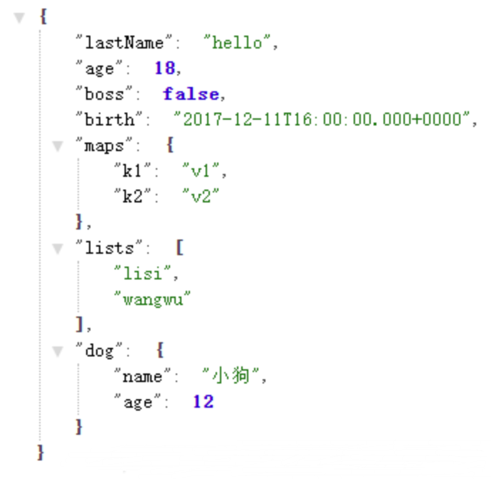

## 方式一: [@Value](/Value )
基本类型属性注入，直接在字段上添加`@Value("${xxx.xxx}")`即可．注意这里用的是$,而不是＃．`@Value`注入的属性，一般其他属性没有关联关系。

配置文件

```yaml
user:
  name: Manaphy
  age: 19
  sex: male
```
```java
@RestController
public class ConfigPropertiesController {
    @Value("${user.name}")
    private String name;
    @Value("${user.age}")
    private Integer age;
    @Value("${user.sex}")
    private String sex;

    @GetMapping("/user")
    public String getUser() {
        return "{name:" + name + ",age:" + age + ",sex:" + sex + "}";
    }
}
```
## 方式二: @ConfigurationProperties
配置文件
```yaml
person:
  lastName: hello
  age: 18
  boss: false
  birth: 2017/12/12
  maps: {k1: v1,k2: v2}
  lists:
    - lisi
    - wangwu
  dog:
    name: 小狗
    age: 12
```
JavaBean
```java
/**
 * 将配置文件中配置的每一个属性的值，映射到这个组件中
 * @ConfigurationProperties：告诉SpringBoot将本类中的所有属性和配置文件中相关的配置进行绑定;
 * prefix = "person"：配置文件中哪个下面的所有属性进行一一映射
 * 只有这个组件是容器中的组件，才能容器提供的@ConfigurationProperties功能
 */
@Component
@ConfigurationProperties(prefix = "person")
@Data
public class Person {
    private String lastName;
    private Integer age;
    private Boolean boss;
    private Date birth;

    private Map<String, Object> maps;
    private List<Object> lists;
    private Dog dog;

}

@Data
class Dog {
    private String name;
    private Integer age;
}
```
Controller层
```java
@RestController
public class PersonController {
    @Autowired
    private Person person;

    @GetMapping("/person")
    public Person getPerson() {
        return person;
    }
}
```
运行结果如下



我们可以导入配置文件处理器，以后编写配置就有提示了

```xml
<dependency>
    <groupId>org.springframework.boot</groupId>
    <artifactId>spring-boot-configuration-processor</artifactId>
    <optional>true</optional>
</dependency>
```
## @Value和@ConfigurationProperties比较
|  | **@ConfigurationProperties** | [**@Value **](/Value ) |
| :-- | :-- | :-- |
| 功能 | 批量注入配置文件中的属性 | 一个个指定 |
| 松散绑定（松散语法） | 支持 | 不支持 |
| SpEL | 不支持 | 支持 |
| JSR303数据校验 | 支持 | 不支持 |
| 复杂类型封装 | 支持 | 不支持 |

配置文件yml还是properties他们都能获取到值；

如果说，我们只是在某个业务逻辑中需要获取一下配置文件中的某项值，使用@Value；

如果说，我们专门编写了一个javaBean来和配置文件进行映射，我们就直接使用@ConfigurationProperties；

## 方式三: [@PropertySource ](/PropertySource )
配置文件
```properties
person.lastName=chen
person.age=22
person.boss=false
person.birth=2017/12/12
person.map1.k1=v1
person.map1.k2=v2
person.map2[k1]=v1
person.map2[k2]=v2
person.list[0]=zhang
person.list[1]=wang
person.list2=zhao,qian,sun,li
person.dog.name=小狗
person.dog.age=12
```
JavaBean
```java
@Component
@ConfigurationProperties(prefix = "person")
//如果只有一个主配置类文件，@PropertySource可以不写
@PropertySource("classpath:person.properties")
@Data
public class Person {
    private String lastName;
    private Integer age;
    private Boolean boss;
    private Date birth;

    private Map<String, Object> map1;
    private Map<String, Object> map2;
    private List<Object> list;
    private List<Object> list2;
    private Dog dog;

}

@Data
class Dog {
    private String name;
    private Integer age;
}
```
测试同方式二
## 方式四: 使用工具类 无需注入获取.yml中的值

1. 新建 BeanConfiguration 类，用于项目启动构造我们的工具类
```java
@Configuration
@Slf4j
public class BeanConfiguration {

    @Bean
    public YamlConfigurerUtil ymlConfigurerUtil() {
        //1:加载配置文件
        Resource app = new ClassPathResource("application.yml");
        Resource appDev = new ClassPathResource("application-dev.yml");
        Resource appProd = new ClassPathResource("application-prod.yml");
        YamlPropertiesFactoryBean yamlPropertiesFactoryBean = new YamlPropertiesFactoryBean();
        // 2:将加载的配置文件交给 YamlPropertiesFactoryBean
        yamlPropertiesFactoryBean.setResources(app);
        // 3：将yml转换成 key：val
        Properties properties = yamlPropertiesFactoryBean.getObject();
        String active = null;
        if (properties != null) {
            active = properties.getProperty("spring.profiles.active");
        }
        if (StringUtils.isEmpty(active)) {
            log.error("未找到spring.profiles.active配置！");
        } else {
            //判断当前配置是什么环境
            if ("dev".equals(active)) {
                yamlPropertiesFactoryBean.setResources(app, appDev);
            } else if ("prod".equals(active)) {
                yamlPropertiesFactoryBean.setResources(app, appProd);
            }
        }
        // 4: 将Properties 通过构造方法交给我们写的工具类
        return new YamlConfigurerUtil(yamlPropertiesFactoryBean.getObject());
    }
}
```

2. 工具类实现
```java
public class YamlConfigurerUtil {
    private static Properties ymlProperties = new Properties();

    public YamlConfigurerUtil(Properties properties) {
        ymlProperties = properties;
    }

    public static String getStrYmlVal(String key) {
        return ymlProperties.getProperty(key);
    }

    public static Integer getIntegerYmlVal(String key) {
        return Integer.valueOf(ymlProperties.getProperty(key));
    }
}
```

3. 调用示例
```java
@RestController
public class PersonController {

    @GetMapping("/msg")
    public String getMessage() {
        return YamlConfigurerUtil.getStrYmlVal("person.lastName");
    }
}
```
## 方式五: Environment
在Spring中有一个类Environment，它可以被认为是当前应用程序正在运行的环境，它继承了PropertyResolver接口，因此可以作为一个属性解析器使用。
```java
@Resource
private Environment env;

@GetMapping("/env")
public void getEnv() {
    String name = env.getProperty("person.name");
    String gender = env.getProperty("person.gender");

    Integer age = env.getProperty("person.age", Integer.class);
    String defaultValue = env.getProperty("person.other", String.class, "defaultValue");
    log.info("姓名:{},性别:{},年龄:{},其他:{}", name, gender, age, defaultValue);
    
    // 获取默认配置
    String[] defaultProfiles = env.getDefaultProfiles();
    Arrays.stream(defaultProfiles).forEach(System.out::println);
    // 获取所有被激活的配置文件
    String[] activeProfiles = env.getActiveProfiles();
    Arrays.stream(activeProfiles).forEach(System.out::println);

}
```
## 利用 | 配置多行文本
```yaml
str: |
  Multiline text 1
  Multiline text 2
  Multiline text 3
```
## 解析 List
```yaml
collection:
  list: aaa,bbb,ccc
```
借助 EL 表达式的 split() 函数进行切分
```java
@Value("#{'${collection.list}'.split(',')}")
private List<String> testList;
```
同样，为它加上默认值，避免不配置这个 key 时候程序报错
```yaml
@Value("#{'${collection.list:}'.split(',')}")  
private List<String> testList;  
```
但当不配置该 key 值，默认值会为空串，它的 length = 1（不同于数组，length = 0），这样解析出来 list 的元素个数就不是空了。<br />这个问题比较严重，因为它会导致代码中的判空逻辑执行错误。这个问题也是可以解决的，在 split() 之前判断下是否为空即可
```java
@Value("#{'${collection.list:}'.empty ? null : '${collection.list:}'.split(',')}")  
private List<String> testList;  
```
## 解析 Set
```yaml
collection:
  set: 111,222,333,111
```
```java
@Value("#{'${collection.set:}'.empty ? null : '${collection.set:}'.split(',')}")
private Set<Integer> testSet;
```
## 解析 Map
解析 Map 的写法如下所示，value 为该 map 的 JSON 格式，注意这里使用的引号：整个 JSON 串使用引号包裹，value 值使用引号包裹。
```yaml
collection:  
  map1: '{"name": "zhangsan", "sex": "male"}'  
  map2: '{"math": "90", "english": "85"}'  
```
在程序中，利用 EL 表达式注入
```java
@Value("#{${collection.map1}}")
private Map<String,String> map1;

@Value("#{${collection.map2}}")
private Map<String,Integer> map2;
```
