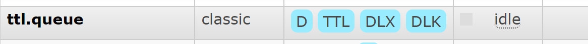

## 消息队列协议
> 消息中间件负责数据的传递，存储，和分发消费三个部分，数据的存储和分发的过程中肯定要遵循某种约定成俗的规范，你是采用底层的TCP/IP，UDP协议还是其他的自己去构建等，而这些约定成俗的规范就称之为: 协议

**所谓协议是指:**

1. 计算机底层操作系统和应用程序通讯时共同遵守的一组约定，只有遵循共同的约定和规范，系统和底层操作系统之间才能相互交流。
2. 和一般的网络应用程序的不同它主要负责数据的接受和传递。所以性能比较的高。
3. 协议对数据格式和计算机之间交换数据都必须严格遵守规范。
### 网络协议的三要素

1. **语法**。语法是用户数据与控制信息的结构与格式，以及数据出现的顺序。
2. **语义**。语义是解释控制信息每个部分的意义。它规定了需要发出何种控制信息，以及完成的动作与做出什么样的响应。
3. **时序**。时序是对事件发生顺序的详细说明。

比如我MQ发送一个信息，是以什么数据格式发送到队列中，然后每个部分的含义是什么，发送完毕以后的执行的动作，以及消费者消费消息的动作，消费完毕的响应结果和反馈是什么，然后按照对应的执行顺序进行处理。如果你还是不理解:大家每天都在接触的http请求协议:
> 语法: http规定了请求报文和响应报文的格式。
> 语义: 客户端主动发起请求称之为请求。(这是一种定义，同时你发起的是post/get请求)
> 时序: 一个请求对应一个响应。(一定先有请求在有响应。这个是时序)

而消息中间件采用的并不是http协议，而常见的消息中间件协议有:OpenWire、AMQP、MQTT、Kafka,OpenMessage协议。<br />**面试题: 为什么消息中间件不直接使用http协议呢?**

1. 因为http请求报文头和响应报文头是比较复杂的，包含了cookie，数据的加密解密，状态码，响应码等附加的功能，但是对于一个消息而言，我们并不需要这么复杂，也没有这个必要性，它其实就是负责数据传递，存储，分发就行,一定要追求的是高性能。尽量简洁,快速。
2. 大部分情况下http大部分都是短链接，在实际的交互过程中，一个请求到响应很有可能会中断，中断以后就不会就行持久化，就会造成请求的丢失。这样就不利于消息中间件的业务场景，因为消息中间件可能是一个长期的获取消息的过程，出现问题和故障要对数据或消息就行持久化等，目的是为了保证消息和数据的高可靠和稳健的运行。
### AMQP协议
AMQP (全称: Advanced Message Queuing Protocol)是高级消息队列协议。由摩根大通集团联合其他公司共同设计。是一个提供统一消息服务的应用层标准高级消息队列协议，是应用层协议的一个开放标准，为面向消息的中间件设计。基于此协议的客户端与消息中间件可传递消息，并不受客户端/中间件不同产品，不同的开发语言等条件的限制。Erlang中的实现有RabbitMQ等。<br />特性:

1. 分布式事务支持。
2. 消息的持久化支持。
3. 高性能和高可靠的消息处理优势。

**AMQP协议的支持者**


### MQTT协议
MQTT协议:(Message Queueing Telemetry Transport)消息队列是IBM开放的一个即时通讯协议，物联网系统架构中的重要组成部分。<br />特点:

1. 轻量
2. 结构简单
3. 传输快，不支持事务
4. 没有持久化设计

应用场景

1. 适用于计算能力有限
2. 低带宽
3. 网络不稳定的场景

**MQTT协议支持者**


### OpenMessage协议
是近几年由阿里、雅虎和滴滴出行、Stremalio等公司共同参与创立的分布式消息中间件、流处理等领域的应用开发标准。<br />特点:

1. 结构简单
2. 解析速度快
3. 支持事务和持久化设计。

**OpenMessage协议支持者


### Kafka协议
Kafka协议是基于TCP/IP的二进制协议。消息内部是通过长度来分割，由一些基本数据类型组成。<br />特点:

1. 结构简单
2. 解析速度快
3. 无事务支持
4. 有持久化设计

**Kafka协议支持者**


### 小结
协议是在tcp/ip协议基础上构建的一种约定成俗的规范和机制、它的主要目的可以让客户端(应用程序 java go 等)进行沟通和通讯。并且这种协议下规范必须具有持久性，高可用，高可靠的性能。
## 消息持久化
### 持久化
简单来说就是将数据存入磁盘，而不是存在内存中随服务器重启断开而消失，是数据能够永久保存。
### 常见的持久化方式
|  | **ActiveMQ** | **RabbitMQ** | **Kafka** | **RocketMQ** |
| :-- | :-- | :-- | :-- | :-- |
| **文件存储** | 支持 | 支持 | 支持 | 支持 |
| **数据库** | 支持 | / | / | / |

## 消息的分发策略
### 消息的分发策略
MQ消息队列有如下几个角色<br />1:生产者<br />2:存储消息<br />3∶消费者<br />那么生产者生成消息以后，MQ进行存储，消费者是如何获取消息的呢?一般获取数据的方式无外乎推(push)或者拉(pull)两种方式。典型的git就有推拉机制，我们发送的http请求就是一种典型的拉取数据库数据返回的过程。而消息队列MQ是一种推送的过程，而这些推机制会适用到很多的业务场景也有很多对应推机制策略。

**场景分析**<br />比如我在APP上下了一个订单，我们的系统和服务很多，我们如何得知这个消息被那个系统或者那些服务或者系统进行消费，那这个时候就需要一个分发的策略。这就需要消费策略。或者称之为消费的方法论。<br />在发送消息的过程中可能会出现异常，或者网络的抖动，故障等等因为造成消息的无法消费，比如用户在下订单，消费MQ接受，订单系统出现故障，导致用户支付失败，那么这个时候就需要消息中间件就必须支持消息重试机制策略。也就是支持:出现问题和故障的情况下。消息不丢失还可以进行重发。

### 消息分发策略的机制和对比
|  | **ActiveMQ** | **RabbitMQ** | **Kafka** | **RocketMQ** |
| :-- | :-- | :-- | :-- | :-- |
| **发布订阅** | 支持 | 支持 | 支持 | 支持 |
| **分发轮询** | 支持 | 支持 | 支持 | / |
| **公平分发** | / | 支持 | 支持 | / |
| **重发** | 支持 | 支持 | / | 支持 |
| **消息拉取** | / | 支持 | 支持 | 支持 |

## 消息的高可用和高可靠
### 什么是高可用机制
所谓高可用:是指产品在规定的条件和规定的时刻或时间内处于可执行规定功能状态的能力。<br />当业务量增加时，请求也过大，一台消息中间件服务器的会触及硬件(CPU,内存，磁盘）的极跟，一台消息服务器你已经无法满足业务的需求，所以消息中间件必须支持集群部署。来达到高可用的目的。
### 什么是高可靠机制
所谓高可用是指: 是指系统可以无故障低持续运行，比如一个系统突然崩溃，报错，异常等等并不影响线上业务的正常运行。出错的几率极低，就称之为:高可靠。<br />在高并发的业务场景中，如果不能保证系统的高可靠，那造成的隐患和损失是非常严重的。如何保证中问件消息的可靠性呢?可以从两个方面考虑:

1. 消息的传输:通过协议来保证系统间数据解析的正确性。
2. 消息的存储可靠:通过持久化来保证消息的可靠性。
### 集群模式1 Master-slave主从共享数据的部署方式


生产消费发送到Master节点，所有的都连接这个消息队列共享这块数据区域，Master节点负责写入，一旦Master挂掉，slave节点继续服务。从而形成高可用

### 集群模式2 Master-slave主从同步部署方式


这种模式写入消息同样在Master主节点上。但是主节点会同步数据到slave节点形成副本，和zookeeper或者redis主从机制很类同。这样可以达到负毂均衡的效果，如果消费者有多个这样就可以去不同的节点就行消费，以为消息的拷贝和同步会暂用很大的带宽和网络资源。在后续的rabbitmq中会有使用。

### 集群模式3 多主集群同步部署模式


和上面的区别不是特别大，但是它的写入可以往任意节点去写入

### 集群模式4 多主集群转发部署模式


如果你插入的数据是broker-1中，元数据信息会存储数据的相关描述和记录存放的位置(队列)，<br />它会对描述信息也就是元数据信息就行同步，如果消费者在broker-2中进行消费，发现自己几点没有对应的消息，可以从对应的元数据信息中去查询，然后返回对应的消息信息，场景:比如买火车票或者黄牛买演唱会门票，比如第一个黄牛有顾客说要买的演唱会门票，但是没有但是他会去联系其他的黄牛询问，如果有就返回。

### 集群模式5 Master-slave与Broker-cluster组合的方案


实现多主多从的热备机制来完成消息的高可用以及数据的热备机制，在生产规模达到一定的阶段的时候，这种使用的频率比较高。<br />这么集群模式的最终目的都是为保证∶消息服务器不会挂掉，出现了故障依然可以抱着消息服务继续使用。<br />反震终归三句话

1. 要么消息共享
2. 要么消息同步
3. 要么元数据共享
## RabbitMQ介绍
略...
## RabbitMQ的角色分类
### none

- 不能访问 management plugin
### management

- 列出自己可以通过AMQP登入的虚拟机
- 查看自己的虚拟机节点virtual hosts的queues,exchanges和bindings信息。
- 查看和关闭自己的channels和connections
- 查看有关自己的虚拟机节点virtual hosts的统计信息。包括其他用户在这个节点virtual hosts中的活动信息。
### Policymaker

- 包含management所有权限
- 查看和创建和删除自己的virtual hosts所属的policies和parameters信息。
### Monitoring

- 包含management所有权限
- 罗列出所有的virtual hosts，包括不能登录的virtual hosts
- 查看其他用户的connections和channels信息
- 查看节点级别的数据如clustering和memory使用情况
- 查看所有的virtual hosts的全局统计信息。
### Administrator·最高权限

- 可以创建和删除virtual hosts
- 可以查看，创建和删除users
- 查看创建permisssions
- 关闭所有用户的connections
## RabbitMQ的核心组成部分


### RabbitMQ中的一些概念和思想

- **Server**：又称为Broker。RabbitMQ服务器，接收客户端连接，实现AMQP的服务器实体。
- **Connection**：连接，应用程序与Broker的网络连接 TCP/IP 三次握手和四次挥手
- **Channel**：网络信道，几乎所有的操作都在Channel中进行，Channel是进行消息读写的通道。客户端可建立多个Channel，每个Channel代表一个会话任务。
- **Message**：消息。服务器和应用程序之间传递的数据，本质上就是一段数据，由Properties和Body组成，Properties可是对消息进行修饰，比如消息的优先级，延迟等高级特性，Body则就是消息提的内容。
- **Exchange**：交换机。接收消息，根据路由键转发消息到绑定的队列。(不具备消息储存的能力)
- **Bindings**：Exchange和Queue之间的虚拟连接，binding中可以保护多个routing key。
- **Routing key**：是一个路由规则，虚拟机可用它来确定如何路由一个特定消息。
- **Queue**：也称为Message Queue，消息队列，保存消息并将它们转发给消费者。
- **Virtual Host**：虚拟地址，用于进行逻辑隔离，最上层的消息路由，一个虚拟主机里面可以有若干个Exchange和Queue，同一个虚拟主机里面不能有相同名称的Exchange和Queue。
### RabbitMQ的运行流程


## 消息中间件的应用场景
### 异步处理
场景说明：用户注册后，需要发注册邮件和注册短信，传统的做法有两种1. 串行的方式; 2. 并行的方式

(1)串行方式:将注册信息写入数据库后，发送注册邮件，再发送注册短信，以上三个任务全部完成后才返回给客户端。 这有一个问题是,邮件，短信并不是必须的，它只是一个通知，而这种做法让客户端等待没有必要等待的东西。


(2)并行方式: 将注册信息写入数据库后，发送邮件的同时，发送短信，以上三个任务完成后，返回给客户端，并行的方式能提高处理的时间。


假设三个业务节点分别使用50ms，串行方式使用时间150ms，并行使用时间100ms。虽然并性已经提高的处理时间，但是，前面说过，邮件和短信对我正常的使用网站没有任何影响，客户端没有必要等着其发送完成才显示注册成功，因为是写入数据库后就返回

(3)消息队列<br />引入消息队列后，把发送邮件,短信不是必须的业务逻辑异步处理


由此可以看出,引入消息队列后，用户的响应时间就等于写入数据库的时间+写入消息队列的时间(可以忽略不计)，引入消息队列后处理后，响应时间是串行的3倍，是并行的2倍。

### 应用解耦
场景：双11是购物狂节，用户下单后，订单系统需要通知库存系统，传统的做法就是订单系统调用库存系统的接口


这种做法有一个缺点:

- 当库存系统出现故障时，订单就会失败。
- 订单系统和库存系统高耦合
- 引入消息队列


- 订单系统:用户下单后，订单系统完成持久化处理，将消息写入消息队列，返回用户订单下单成功。
- 库存系统:订阅下单的消息，获取下单消息，进行库操作。 就算库存系统出现故障，消息队列也能保证消息的可靠投递,不会导致消息丢失。
### 流量削峰
流量削峰一般在秒杀活动中应用广泛<br />场景:秒杀活动，一般会因为流量过大，导致应用挂掉,为了解决这个问题，一般在应用前端加入消息队列。<br />作用:<br />1.可以控制活动人数，超过此一定阀值的订单直接丢弃<br />2.可以缓解短时间的高流量压垮应用(应用程序按自己的最大处理能力获取订单)


1.用户的请求，服务器收到之后，首先写入消息队列,加入消息队列长度超过最大值，则直接抛弃用户请求或跳转到错误页面<br />2.秒杀业务根据消息队列中的请求信息，再做后续处理

## 各种消息中间件性能的比较
TPS比较 一ZeroMq 最好，RabbitMq 次之， ActiveMq 最差。<br />持久化消息比较—zeroMq不支持，activeMq和rabbitMq都支持。持久化消息主要是指：MQ down或者MQ所在的服务器down了，消息不会丢失的机制。<br />可靠性、灵活的路由、集群、事务、高可用的队列、消息排序、问题追踪、可视化管理工具、插件系统、社区—RabbitMq最好，ActiveMq次之，ZeroMq最差。<br />高并发—从实现语言来看，RabbitMQ最高，原因是它的实现语言是天生具备高并发高可用的erlang语言。<br />综上所述：RabbitMQ的性能相对来说更好更全面，是消息中间件的首选。<br />**为什么要选择RabbitMQ**

- 基于AMQP协议
- 高并发
- 高性能
- 高可用
- 强大的社区支持，以及很多公司都在使用
- 支持插件
- 支持多语言

**生产者和消费者**

生产者创建消息，消费者接受消息，一个应用程序既可以作为生产者发送消息也可以作为一个消费者接受消息，再此之前，必须建立一条信道_channel

**什么是信道channel**<br />我们必须连接Rabbit服务，才能消费或者发布消息，应用程序和Rabbit代理服务之间创建一条TCP连接，一旦TCP连接打开，应用程序就会创建一条AMQP信道，信道是建立TCP连接内的虚拟连接，AMQP命令都是通过信道发送出去的，每条信道都会被指派一个唯一ID（AMQP库会帮你记住ID），不论是发布消息、订阅队列还是接受消息、这些都是通过信道完成

**为什么需要信道呢？而不是直接通过TCP连接发送AMQP命令呢**

对操作系统来说创建和销毁TCP连接时非常昂贵的开销，如果使用TCP连接，每个线程都需要连接到Rabbit,高峰期每秒创建的成百上千的连接，很快就会性能瓶颈，引入信道，线程启动后，会在现成的连接上创建一条信道，所有线程只用1条TCP连接，又保证线程的私密性，就像拥有独立的连接一样，另外一个TCP连接上创建多少个信道是没有限制的。

**队列，交换机，绑定**

**AMQP消息路由必须有3部分：**交换机，队列，绑定**，生产者把消息发布到交换机上，消息最终到达队列，并被消费者接收消费。绑定决定了消息如何从路由器到特定的队列，消息到达队列中（存储）并等待消费，需要注意对于没有路由到队列的消息会被丢弃，消费者通过以下2种方式从特定的队列中接受消息<br />a.通过AMQP的_basic.consume_命令订阅 。这样会将信道置为接受模式，直到取消对对列的订阅，订阅消息后，消费者在消费或者拒绝最近接受的那条消息之后，就能从队列中自动接收下一条消息；如果消费者处理队列消息并且需要在消息一到达队列时就自动接收就是用这个命令

b.如果只是想获取队列中的单条消息而不是持续订阅的话，可以使用AMQP的_basic.get_命令，意思就是接受队列的下条消息，如果还需要获取下个继续调用这个命令，不建议放在循环中调用来替代consume命令，性能会有影响

**消息如何分发**

如果至少有一个消费者订阅队列，消息会立即发送给订阅的消费者，如果消息到达了无人订阅的消费者，消息会在队列中等待，直到有消费者订阅该队列，消息就会自动发送给消费者，如果一个队列有多个消费者队列收到的消息会循环**_round-robin_**的方式发送给消费者，每条消息只会发送给一个订阅的消费者,假如有2个消费者p1和p2，消息的分发逻辑：

- 消息msgA到达queue队列
- MQ把消息msgA发送给p1
- p1确认收到消息msgA
- MQ把消息msgA从queue队列中删除
- 消息msgB到达queue队列
- MQ把消息msgB发送给p2
- p1确认收到消息msgB
- MQ把消息msgB从queue队列中删除

**消息应答**

消费者接受到的每条信息必须进行确认，消费者通过AMQP的_basic.ack_命令显式的想RabbitMQ发送一个确认，或者可以通过在订阅到队列的时候就将_auto_ack_参数设为true，设置true，RabbitMQ会自动默认确认消息，这就是**手动确认和自动确认**机制，只有经过确认接受了消息MQ才能安全的把消息从列队中删除该消息<br />当然如果消费者收到消息，在确认之前与RabbitMQ断开连接或者从队列上取消订阅，那么RabbitMQ会默认消息没有分发，它会重写分发给下一个订阅的消费者如果程序崩溃了，这样做可以确保消息不会丢失并被发送给另外一个消费者处理<br />另一方面，如果程序有bug而忘记确认消息的话，RabbitMQ不会给该消费者发送更多的消息，Rabbmit会认为这个消费者在没有上一个消息消费掉而无法准备接受下一个，这样可以保证在处理耗时的消息的时候，RabbitMQ不会持续的发送消息给你的应用导致过载<br />在接受消息后如果你像明确的拒绝而不是确认接受，我们可以使用AMQP的_basic.reject_命令去拒绝RabbitMQ发送的消息，如果把reject命令的_requeue_参数设置成true，RabbitMQ会把消息从新发送给下一个订阅者，如果设置成false,RabbitMQ立即把消息从列队中移除，而不会发送给其他消费者我们就可以利用这点去忽略一些格式错误的消息（任何消费者都无法处理的）<br />注意：当丢弃一条消息时，使用_basic.reject+requeue=false_来处理后，这个消息就被转移到“死信”_dead letter_队列中,**死信队列**就是用来存放哪些被拒绝而不重入队列的消息

**创建队列**<br />使用AMQP的_queue.declare_命令来创建队列，如果一个消费者在同一条信道channel上订阅了一个队列，他就无法在申明队列了，必须先取消订阅，将信道置为“传输”模式<br />创建队列的时候指定队列名称，消费者绑定/订阅队列的时候需要指定队列名称，如果不指定，RabbitMQ会随机分配一个随机名称由queue.declare返回<br />队列一般会设置以下有用的参数：

- exclusive：true表示队列变成私有，一般想要限制一个队列只有一个消费者的时候使用
- auto-delete:当最后一个消费者取消订阅，队列会自动删除，一般创建临时队列使用

如果申明一个已经存在的队列，RabbitMQ什么都不会做，并返回成功，可以利用这点判断对了是否存在，如果只想检测队列是否存在，可以通过_queue.declare_的_passive_选项为true，在这种情况下如果队列存在就会返回成功，如果不存在_queue.declare_不会创建队列而回返回要给错误<br />队列的作用：<br />为消息提供存储，再次等待消费<br />实现负载均衡，轮询消费<br />队列是Rabbit中消息的最后终点


队列中的属性

- Durability：是否持久化，Durable是，Transient是否。如果不持久化，那么在服务器宕机或重启之后Queue就会丢失。
- Auto delete：如果选择yes，当最后一个消费者不在监听Queue的时候，该Queue就会自动删除，一般选择false。
- Arguments：AMQP协议留给AMQP实现者扩展使用的。<br />x-message-ttl：一个消息推送到队列中的存活时间。设置的值之后还没消费就会被删除。<br />x-expires：在自动删除该队列的时候，可以使用该队列的时间。<br />x-max-length：在队列头部删除元素之前，队列可以包含多少个（就绪）消息，如果再次向队列中发送消息，会删除最早的那条消息，用来控制队列中消息的数量。<br />x-max-length-bytes：在队列头部删除元素之前，队列的总消息体的大小，用来控制队列中消息的总大小。<br />x-dead-letter-exchange：当消息被拒绝或者消息过期，消息重新发送到的交换机（Exchange）的可选名称。<br />x-dead-letter-routing-key：当消息被拒绝或者消息过期，消息重新发送到的交换机绑定的Route key的名称，如果没有设置则使用之前的Route key。<br />x-max-priority：队列支持的最大优先级数，如果没有设置则不支持消息优先级<br />x-queue-mode：将队列设置为延迟模式，在磁盘上保留尽可能多的消息以减少RAM使用; 如果未设置，队列将保持在内存中的缓存，以尽可能快地传递消息。<br />x-queue-master-locator：将队列设置为主位置模式，确定在节点集群上声明队列主节点所在的规则。

**交换机和绑定**

Exchange在RabbitMQ消息中间件中的作用：<br />服务器发送消息不会直接发送到队列中（Queue），而是直接发送给交换机（Exchange），然后根据确定的规则，RabbitMQ将会决定消息该投递到哪个队列。这些规则称为路由键（routing key），队列通过路由键绑定到交换机上。消息发送到服务器端（broker），消息也有自己的路由键（也可以是空），RabbitMQ也会将消息和消息指定发送的交换机的绑定（binding，就是队列和交互机的根据路由键映射的关系）的路由键进行匹配。如果匹配的话，就会将消息投递到相应的队列。协议中定义了不同的交换机，4种类型的交换机

- **fanout**
- **direct**
- **topic**
- **headers**

**Fanout Exchange**：直接将消息转发到所有binding的对应queue中，这种exchange在路由转发的时候，忽略Routing key。<br />**Direct Exchange**：将消息中的Routing key与该Exchange关联的所有Binding中的Routing key进行比较，如果相等，则发送到该Binding对应的Queue中。<br />**Topic Exchange**：将消息中的Routing key与该Exchange关联的所有Binding中的Routing key进行对比，如果匹配上了，则发送到该Binding对应的Queue中。<br />**Headers Exchange**：将消息中的headers与该Exchange相关联的所有Binging中的参数进行匹配，如果匹配上了，则发送到该Binding对应的Queue中。


- Virtual host:属于哪个Virtual host。
- Name：名字，同一个Virtual host里面的Name不能重复。
- Durability： 是否持久化，Durable：持久化。Transient：不持久化。
- Auto delete：当最后一个绑定（队列或者exchange）被unbind之后，该exchange自动被删除。
- Internal： 是否是内部专用exchange，是的话，就意味着我们不能往该exchange里面发消息。
- Arguments： 参数，是AMQP协议留给AMQP实现做扩展使用的。<br />alternate_exchange配置的时候，exchange根据路由路由不到对应的队列的时候，这时候消息被路由到指定的alternate_exchange的value值配置的exchange上。

**Message详解**

消息。服务器和应用程序之间传送的数据，本质上就是一段数据，由Properties和Payload(body)组成。<br />Delivery mode：是否持久化，如果未设置持久化，转发到queue中并未消费则重启服务或者服务宕机则消息丢失。<br />Headers：头信息，是由一个或多个健值对组成的，当固定的Properties不满足我们需要的时候，可以自己扩展。

**Properties（属性）**

content_type：传输协议<br />content_encoding：编码方式<br />priority：优先级<br />correlation_id：rpc属性，请求的唯一标识。<br />reply_to：rpc属性，<br />expiration：消息的过期时间<br />message_id：消息的id<br />timestamp：消息的时间戳<br />...<br />如何保证消息的不丢失，三个地方做到持久化。

1. Exchange需要持久化。
2. Queue需要持久化。
3. Message需要持久化。

**多租户模式:虚拟主机和隔离**

每个RabbitMQ服务器都能创建虚拟消息服务器，我们称之为虚拟主机vhost，每个vhost的本质就是个mini版的RabbitMQ服务器，拥有自己的队列，交换器和绑定，更重要的是它还拥有自己的权限机制，可以做最小粒度的权限控制。能够安全的使用RabbitMQ服务器来服务众多的应用，vhost之于RabbitMQ,相当于虚拟机之于物理服务器：通过在各个实例之间提供的逻辑上的分离，允许不同应用程序安全的运行数据，这样的话可以将一个RabbitMQ的多个客户去分开，又可以避免队列和交换器命名冲突而不需要运行多个RabbitMQ<br />vhost是AMQP概念的基础，连接的时候进行指定，由于RabbitMQ包含了开箱即用的默认vhost,即“/”,如果不需要多个就使用默认的，默认的用户名和密码guest访问默认的vhost，当在rabbit里面创建要给用户的时候，用户通常被指定至少一个vhost，并且只能访问指定vhost的队列交换器和绑定，同时，当在RabbitMQ集群上创建vhost时，整个集群都会创建该vhost,vhost不仅消除了为基础架构中的每一层运行一个RabbitMQ服务器的需要，同时避免了为每一层创建不同的集群<br />如何创建vhost<br />无法使用AMQP协议创建（不同与队列交换机等），需要使用RabbitMQ安装路径下./sbin/目录中的rabbitmactl工具创建，运行rabbitmqtcl add_vhost [vhost_name]即可<br />删除：rabbitmqtcl delete_vhost [vhost_name]即可,vhost创建成功后我们可以添加队列和交换机，rabbitmqtcl list_vhosts查看所有vhost<br />注意：通常情况下直接在服务器上运行rabbitmqtcl来管理自己的rabbitmq节点，也可以通过制定 -n rabbit@[server_name]来管理远程的rabbitMQ节点<br />@符号左边是Erlang应用程序的名称，永远是rabbit，右边是服务器主机名或者IP


**消息持久化**

RabbitMQ创建的队列和交换器在默认情况下无法幸免于服务器重启，重启服务后，队列和交换机联通里面的消息就会消失<br />因为交换机和列队的默认durable=false,设置成true,就会避免重启或者宕机后队列和交换器的消失，但是消息还是会丢失<br />所以当把交换器和队列的durable设置成true还是不够的，还需要持久化消息，在消息发布之前，通过把它的投递模式delivery mode选项设置成2来吧消息标记成持久化，只有这2个条件同时满足才可以保证消息不会丢失

**怎么做到消息持久化的？**

RabbitMQ确保消息能从服务器中恢复的方式是：将他们写入磁盘上的一个持久化日志文件，当发布一条持久化的消息到持久化的交换机上，rabbit会在消息提交到日志文件后才发送响应，如果发送到非持久化的队列上，他会自动从持久性日志中移除导致无法恢复，还有如果一旦你从持久化队列中消费了一条持久化消息，并且确认了它，那么RabbitMQ会在持久化日志中把这条消息标记为等待垃圾收集，在你消费持久化消息前，如果rabbitMQ重启，服务器会自动重建交换器和队列以及绑定，重播持久性日志文件中的消息到合适的队列或交换机上，虽然持久化好，但是会影响性能，写入磁盘的比存入内存慢超级多，而且极大的减少RabbitMQ服务器每秒处理消息的总数。所以使用持久化机制而导致消息吞吐量降低至少10倍的情况并不少见。<br />此外持久化消息在RabbitMQ内建集群环境下工作的并不好，虽然RabbitMQ集群允许你和集群中的任何节点的任意队列通信，但是事实上这个队列是均匀分布在各个节点上而没有备份，所以一个队列所在的节点崩溃，在节点恢复之前没这个队列和这个节点的其他队列都是不可用的，而且持久化队列也无法重建，导致消息丢失

**AMQP事务**

在消息持久化到磁盘前，服务宕机可能导致消息丢失，这种情况持久化不能完全保证消息不丢失，在处理其他任务之前，必须保证代理收到消息并把消息路由给所有匹配的订阅队列，我们可以把这些行为包装到一个事务中，在AMQP中，把信道channel设置成事务模式之后，那么通过这个信道发送想要确认的消息，还有多个其他的AMQP命令，这些命令的执行还是忽略却取决于第一条消失是否发送成功，一旦完成所有命你就可以提交事务了，事务填补了生产者发送消息和RabbitMQ把消息提交到磁盘上这2个阶段丢失情况。<br />事务的缺点，就是影响RabbitMQ的性能，降低2-10倍的吞吐量，还会使生产者应用程序产生同步，而使用消息就是为了避免同步<br />所有有更好的方案来保证消息投递：**发送方的确认模式**，它和事务模式相似，使用发送方确认需要将信道channel设置成confirm模式（channel.confirmSelect();），而且只能通过重写创建信道来关闭该设置，一旦信道进入confirm模式，所有在信道上发布的消息都会被指派一个唯一的ID号（也就是deliveryTag，从1开始，后面的每一条消息都会加1，deliveryTag在channel范围内是唯一的。），一旦消息被投递到所有匹配的队列后，信道会发送一个发送方确认模式给生产者应用（包含消息的唯一ID），使得生产者知晓消息一经安全到达目的队列，如果消息和队列是持久化的，那么消息只会在队列将消息写入磁盘后才会发出，发送者确认模式的最大好处是它们是异步的，一旦发布了一个消息，生产者应用程序就可以在等待确认的同时继续发送下一条消息，当确认消息收到的时候，生产者应用的回调方法就会被触发来处理该确认消息，如果rabbit发生内部错误导致消息丢失，rabbit会发送一条nack(not acknowledged未确认)消息，就像发送方确认消息那样，只不过这一次说的是消息已经丢失，同时由于不像事务那样没有回滚，发送方确认模式更加轻量，对性能的影响几乎不计

## 使用Spring Boot整合RabbitMQ来演示
在`pom.xml`中添加Spring AMQP的相关依赖
```xml
<dependency>
    <groupId>org.springframework.boot</groupId>
    <artifactId>spring-boot-starter-amqp</artifactId>
</dependency>
```
修改`application.yml`，添加RabbitMQ的相关配置
```yaml
spring:
  rabbitmq:
    host: 192.168.2.132
    port: 5672
    username: admin
    password: admin
    virtual-host: /
```
**RabbitConfiguration配置类**：主要配置三类bean

- ConnectionFactory和RabbitTemplate,
- 相关的队列Queue，交换机Exchange和绑定Binding（也可以通过管理界面自己创建或者通过在@RabbitListener中创建）
- 异步处理消费消息的一个监听容器SimpleMessageListenerContainer
### 1、简单模式
> 简单模式是最简单的消息模式，它包含一个生产者、一个消费者和一个队列。生产者向队列里发送消息，消费者从队列中获取消息并消费。

**模式示意图**


**配置类**

```java
@Slf4j
@Configuration
public class RabbitMqConfig {
    @Bean
    public Queue simpleQueue() {
        /*
         * 生成队列
         * @name        队列名称
         * @durable     是否持久化 rabbitmq重启的时候不需要创建新的队列 默认是true
         * @exclusive   表示该消息队列是否只在当前connection生效 默认是false
         * @autoDelete  表示消息队列没有在使用时将被自动删除 默认是false
         */
        return new Queue("simple.queue", true, false, false);
    }
}
```
**生产者**
```java
@Slf4j
@RestController
public class ProducerController {

    @Resource
    private RabbitTemplate rabbitTemplate;

    @GetMapping("simple")
    public void simple() throws InterruptedException {
        for (int i = 0; i < 5; i++) {
            rabbitTemplate.convertAndSend("simple.queue", UUID.randomUUID().toString());
            Thread.sleep(1000);
        }
    }
}
```
**消费者**
```java
@Slf4j
@Component
@RabbitListener(queues = "simple.queue")
public class SimpleConsumer {
    @RabbitHandler
    public void simpleConsumer(String message) {
        log.info("简单模式 接收到消息:{}", message);
    }
}
```
**测试**: 访问`http://localhost:9006/simple`及结果
```
简单模式 接收到消息:c3a64adb-5aff-416e-9441-9a8ace4b9815
简单模式 接收到消息:214c4846-f342-4140-b538-af65c912ad9a
简单模式 接收到消息:89ede0ac-ea48-445b-a931-0ed3a6006a52
简单模式 接收到消息:7dc1f695-2e64-4217-be90-1ee87085795e
简单模式 接收到消息:98f4f5a4-6aa3-4948-8d07-115458ab349e
```
### 2、工作模式(Work)
> 工作模式是指向多个互相竞争的消费者发送消息的模式，它包含一个生产者、两个消费者和一个队列。两个消费者同时绑定到一个队列上去，当消费者获取消息处理耗时任务时，空闲的消费者从队列中获取并消费消息。

**模式示意图**


**配置work队列**

```java
@Bean
public Queue workQueue() {
    return new Queue("work.queue");
}
```
**创建生产者和2个消费者**
```java
@GetMapping("work")
public void worker() throws InterruptedException {
    for (int i = 0; i < 10; i++) {
        rabbitTemplate.convertAndSend("work.queue", i);
        TimeUnit.SECONDS.sleep(1);
    }
}
```
```java
@Slf4j
@Component
public class WorkConsumer {
    @RabbitListener(queues = "work.queue")
    public void work1(String message) {
        log.info("工作模式 消费者甲:{}", message);
    }

    @RabbitListener(queues = "work.queue")
    public void work2(String message) {
        log.info("工作模式 消费者乙:{}", message);
    }
}
```
**测试**: 访问`http://localhost:9006/work`及结果
```
工作模式 消费者甲:0
工作模式 消费者乙:1
工作模式 消费者甲:2
工作模式 消费者乙:3
工作模式 消费者甲:4
工作模式 消费者乙:5
工作模式 消费者甲:6
工作模式 消费者乙:7
工作模式 消费者甲:8
工作模式 消费者乙:9
```
从打印数据来开，是采用轮询的方式消费的。
#### 公平方式
修改消费者
```java
@RabbitListener(queues = "work.queue")
public void work1(String receive, Channel channel, Message message) throws IOException, InterruptedException {
    Thread.sleep(500);
    log.info("工作模式 消费者甲:{}", receive);
    channel.basicAck(message.getMessageProperties().getDeliveryTag(), false);
}

@RabbitListener(queues = "work.queue")
public void work2(String receive, Channel channel, Message message) throws IOException {
    log.info("工作模式 消费者乙:{}", receive);
    channel.basicAck(message.getMessageProperties().getDeliveryTag(), false);
}
```
配置消息确认机制和预处理模式
```yaml
spring:
  rabbitmq:
    listener:
      simple:
        acknowledge-mode: manual #消息确认机制: 手动
        prefetch: 1 #预处理模式更改为每次读取1条消息,在消费者未回执确认之前,不在进行下一条消息的投送
```
测试重新发送消息
```
工作模式 消费者乙:0
工作模式 消费者乙:2
工作模式 消费者乙:4
工作模式 消费者乙:5
工作模式 消费者乙:6
工作模式 消费者乙:7
工作模式 消费者乙:8
工作模式 消费者乙:9
工作模式 消费者甲:1
工作模式 消费者甲:3
```
### 3、发布/订阅模式(Fanout)
**Fanout**也称为广播模式

1. 可以有多个消费者
2. 每个消费者有自己的队列
3. 每个队列都要绑定到Exchange（交换机）
4. 生产者发送的消息，只能发送到交换机，交换机来决定要发给哪个队列，生产者无法决定。
5. 交换机把消息发送给绑定过的所有队列
6. 队列的消费者都能拿到消息。实现一条消息被多个消费者消费
7. 如果没有队列与之绑定，信息将会丢失，交换机不能存储信息。


**配置交换机和绑定队列**

```java
// 声明注册fanout模式的交换机,无routing_key的概念
@Bean
public FanoutExchange orderFanoutExchange() {
    /*
     * @name 交换机名字
     * @durable 是否持久化 rabbitmq重启的时候不需要创建新的交换机 默认:true
     * @autoDelete 当所有消费客户端连接断开后，是否自动删除队列 默认:false
     */
    return new FanoutExchange(RabbitMqConsts.EXCHANGE_FANOUT, true, false);
}

// 2.声明队列
@Bean
public Queue smsFanoutQueue() {
    return new Queue("sms.fanout.queue", true);
}

@Bean
public Queue emailFanoutQueue() {
    return new Queue("email.fanout.queue", true);
}

@Bean
public Queue appletsFanoutQueue() {
    return new Queue("applets.fanout.queue", true);
}

// 3.完成交换机和队列的绑定
@Bean
public Binding smsFanoutBinding() {
    return BindingBuilder.bind(smsFanoutQueue()).to(orderFanoutExchange());
}

@Bean
public Binding emailFanoutBinding() {
    return BindingBuilder.bind(emailFanoutQueue()).to(orderFanoutExchange());
}

@Bean
public Binding appletsFanoutBinding() {
    return BindingBuilder.bind(appletsFanoutQueue()).to(orderFanoutExchange());
}
```

**定义消费者**
```java
@Slf4j
@Component
public class QueueHandler {
    // 发布订阅模式小程序消费者
    @RabbitListener(queues = {"applets.fanout.queue"})
    public void fanoutAppletsConsumer(String message) {
        log.info("发布订阅模式小程序 接收到消息：{}", message);
    }

    // 发布订阅模式邮件消费者
    @RabbitListener(queues = {"email.fanout.queue"})
    public void fanoutEmailConsumer(String message) {
        log.info("发布订阅模式邮件 接收到消息：{}", message);
    }

    // 发布订阅模式短信消费者
    @RabbitListener(queues = {"sms.fanout.queue"})
    public void fanoutSmsConsumer(String message) {
        log.info("发布订阅模式短信 接收到消息：{}", message);
    }
}

```
**定义生产者**
```java
@GetMapping("pubSub")
public void pubSub() {
    String orderId = UUID.randomUUID().toString();
    log.info("订单生成成功:" + orderId);
    rabbitTemplate.convertAndSend(RabbitMqConsts.EXCHANGE_FANOUT, "", orderId);
}
```
**测试**: 访问`http://localhost:9006/pubSub`及结果
```
订单生成成功:047c7614-b483-404a-986f-5a2066c53aa2
发布订阅模式邮件 接收到消息：047c7614-b483-404a-986f-5a2066c53aa2
发布订阅模式小程序 接收到消息：047c7614-b483-404a-986f-5a2066c53aa2
发布订阅模式短信 接收到消息：047c7614-b483-404a-986f-5a2066c53aa2
```
### 4、路由模式(Direct)
在Fanout模式中，一条消息，会被所有订阅的队列都消费。但是，在某些场景下，我们希望不同的消息被不同的队列消费。这时就要用到Direct类型的Exchange。给特定的消费者消费

在Direct模型下：

1. 队列与交换机的绑定，不能是任意绑定了，而是要指定一个RoutingKey（路由key）
2. 消息的发送方在向 Exchange发送消息时，也必须指定消息的 RoutingKey。
3. Exchange不再把消息交给每一个绑定的队列，而是根据消息的Routing Key进行判断，只有队列的 Routingkey与消息的 Routing key完全一致，才会接收到消息


**使用注解来声明交换机、队列 绑定关系，并定义消费者**

```java
// 路由模式小程序消费者
@RabbitListener(bindings = @QueueBinding(
    value = @Queue(value = "applets.direct.queue", durable = "true", autoDelete = "false"),
    exchange = @Exchange(value = RabbitMqConsts.EXCHANGE_DIRECT),
    key = "applets"
))
public void directAppletsConsumer(String message) {
    log.info("路由模式小程序 接收到消息：{}", message);
}

// 路由模式邮件消费者
@RabbitListener(bindings = @QueueBinding(
    value = @Queue(value = "email.direct.queue", durable = "true", autoDelete = "false"),
    exchange = @Exchange(value = RabbitMqConsts.EXCHANGE_DIRECT),
    key = "email"
))
public void directEmailConsumer(String message) {
    log.info("路由模式邮件 接收到消息：{}", message);
}

// 路由模式短信消费者
@RabbitListener(bindings = @QueueBinding(
    value = @Queue(value = "sms.direct.queue", durable = "true", autoDelete = "false"),
    exchange = @Exchange(value = RabbitMqConsts.EXCHANGE_DIRECT),
    key = "sms"
))
public void directSmsConsumer(String message) {
    log.info("路由模式短信 接收到消息：{}", message);
}
```
**生产者**
```java
@GetMapping("routing")
public void routing() {
    String orderId = UUID.randomUUID().toString();
    log.info("订单生成成功:" + orderId);
    rabbitTemplate.convertAndSend(RabbitMqConsts.EXCHANGE_DIRECT, "email", orderId);
    rabbitTemplate.convertAndSend(RabbitMqConsts.EXCHANGE_DIRECT, "sms", orderId);
}
```
**测试**: 访问`http://localhost:9006/routing`及结果
```
订单生成成功:b4ecc7b0-00c0-4d20-aaa0-678aa0741b7f
路由模式邮件 接收到消息：b4ecc7b0-00c0-4d20-aaa0-678aa0741b7f
路由模式短信 接收到消息：b4ecc7b0-00c0-4d20-aaa0-678aa0741b7f
```
### 5、主题模式(Topic)
Topic类型的Exchange与Direct相比，都是可以根据RoutingKey把消息路由到不同的队列。只不过Topic类型Exchange可以让队列在绑定Routing key 的时候使用通配符！<br />Routingkey 一般都是有一个或多个单词组成，多个单词之间以”.”分割，例如： user.insert

| 通配符规则 | 举例 |
| :-- | :-- |
| #：匹配一个或多个词 | person.#：能够匹配person.insert.save 或者 person.insert |
| *：匹配不多不少恰好1个词 | person.*：只能匹配person.insert |


```java
@Bean
public TopicExchange topicExchange() {
    // 另一种创建方式 ExchangeBuilder
    return ExchangeBuilder.topicExchange(RabbitMqConsts.EXCHANGE_TOPIC).build();
}

@Bean
public Queue smsTopicQueue() {
    return new Queue("sms.topic.queue", true);
}

@Bean
public Queue emailTopicQueue() {
    return new Queue("email.topic.queue", true);
}

@Bean
public Queue appletsTopicQueue() {
    return new Queue("applets.topic.queue", true);
}

// 声明队列并绑定到交换机
@Bean
public Binding smsTopicBinding() {
    return BindingBuilder.bind(smsTopicQueue())
            .to(topicExchange()).with("com.#");
}

@Bean
public Binding emailTopicBinding() {
    return BindingBuilder.bind(emailTopicQueue())
            .to(topicExchange()).with("*.email.#");
}

@Bean
public Binding appletsTopicBinding() {
    return BindingBuilder.bind(appletsTopicQueue())
            .to(topicExchange()).with("#.applets.#");
}
```
**生产者**
```java
@GetMapping("topic")
public void topic() {
    String orderId = UUID.randomUUID().toString();
    log.info("订单生成成功:" + orderId);
    rabbitTemplate.convertAndSend(RabbitMqConsts.EXCHANGE_TOPIC, "com.applets", orderId);
}
```
**消费者**
```java
// 主题模式小程序消费者
@RabbitListener(queues = "applets.topic.queue")
public void topicAppletsConsumer(String message) {
    log.info("主题模式小程序 接收到消息：{}", message);
}

// 主题模式邮件消费者
@RabbitListener(queues = "email.topic.queue")
public void topicEmailConsumer(String message) {
    log.info("主题模式邮件 接收到消息：{}", message);
}

// 主题模式短信消费者
@RabbitListener(queues = "sms.topic.queue")
public void topicSmsConsumer(String message) {
    log.info("主题模式短信 接收到消息：{}", message);
}
```
**测试**: 访问`http://localhost:9006/topic`及结果
```
订单生成成功:fe0457ac-fbc7-4554-8ce7-30e308dfd419
主题模式短信 接收到消息：fe0457ac-fbc7-4554-8ce7-30e308dfd419
主题模式小程序 接收到消息：fe0457ac-fbc7-4554-8ce7-30e308dfd419
```
## RabbitMQ高级-过期时间TTL
过期时间TTL表示可以对消息设置预期的过期时间，在这个时间内都可以被消费者接收获取。过来之后消息将自动被删除。RabbitMQ可以对 **消息和队列** 设置TTL。目前有两种方法可以设置。

- 第一种是通过队列属性设置，队列中所有消息都有相同的过期时间。
- 第二种是对消息进行单独设置，每条消息TTL可以不同。

如果上述两种方法同时使用，则消息的过期时间以两者之间TTL较小的那个数值为准。消息在队列的生存时间一旦超过设置的TTL值，就称为 dead message 被投递到死信队列，消费者将无法再收到该消息。
### 对队列设置过期时间
```java
@Bean
public Queue ttlQueue() {
    Map<String, Object> args = new HashMap<>(1);
    args.put("x-message-ttl", 5000);//这里一定是int类型,单位:毫秒
    return new Queue("ttl.queue", true, false, false, args);
}
// 直接绑定到主题交换机上
@Bean
public Binding ttlBinding() {
    return BindingBuilder.bind(ttlQueue()).to(topicExchange()).with("ttl");
}
```
**生产者**
```java
@GetMapping("ttl")
public void ttlQueue() {
    rabbitTemplate.convertAndSend(RabbitMqConsts.EXCHANGE_TOPIC, "ttl", UUID.randomUUID().toString());
}
```
**测试发送消息**<br />回到Rabbitmq图形化界面，可以看到`ttl.queue`队列有1条，5秒后会变回0


### 对消息设置过期时间
创建一个普通队列
```java
@Bean
public Queue ttlMessageQueue() {
    return new Queue("ttl.message.queue");
}

@Bean
public Binding ttlMessageBinding() {
    return BindingBuilder.bind(ttlMessageQueue()).to(topicExchange()).with("ttlMessage");
}
```
对消息设置过期时间
```java
@GetMapping("ttl")
public void ttlQueue() {
    // String orderId = UUID.randomUUID().toString();
    // rabbitTemplate.convertAndSend(RabbitMqConsts.EXCHANGE_TOPIC, "ttl", orderId);

    MessagePostProcessor messagePostProcessor = (Message message) -> {
        message.getMessageProperties().setExpiration("5000");
        return message;
    };
    rabbitTemplate.convertAndSend(RabbitMqConsts.EXCHANGE_TOPIC, "ttlMessage", orderId, messagePostProcessor);
}
```
该队列的消息5秒后也会变为0


## RabbitMQ高级-死信队列
DLX,全称为Dead-Letter-Exchange ，可以称之为死信交换机，也有人称之为死信邮箱。当消息在一个队列中变成死信(dead message)之后，它能被重新发送到另一个交换机中，这个交换机就是DLX，绑定DLX的队列就称之为死信队列。消息变成死信，可能是由于以下的原因:

- 消息被拒绝
- 消息过期
- 队列达到最大长度

DLX也是一个正常的交换机，和一般的交换机没有区别，它能在任何的队列上被指定，实际上就是设置某一个队列的属性。当这个队列中存在死信时，Rabbitmq就会自动地将这个消息重新发布到设置的DLX上去，进而被路由到另一个队列，即死信队列。<br />要想使用死信队列，只需要在定义队列的时候设置队列参数`x-dead-letter-exchange`指定交换机即可。<br />**死信队列配置**
```java
// 1.配置死信交换机
@Bean
public DirectExchange deadDirectExchange() {
    return new DirectExchange(RabbitMqConsts.EXCHANGE_DIRECT_DEAD);
}

// 2.配置死信队列
@Bean
public Queue deadQueue() {
    return new Queue("dead.queue");
}

// 3.绑定死信队列到死信交换机
@Bean
public Binding deadBinding() {
    return BindingBuilder.bind(deadQueue()).to(deadDirectExchange()).with("dead");
}
```
**修改 ttl队列 添加参数**
```java
@Bean
public Queue ttlQueue() {
    Map<String, Object> args = new HashMap<>(3);
    args.put("x-message-ttl", 5000);//这里一定是int类型,单位:毫秒
    args.put("x-max-length", 5);// 消息的最大长度,超过此长度的消息也会被投递到死信队列
    args.put("x-dead-letter-exchange", RabbitMqConsts.EXCHANGE_DIRECT_DEAD);
    args.put("x-dead-letter-routing-key", "dead");// fanout不需要配置
    return new Queue("ttl.queue", true, false, false, args);
}
```
**测试**<br />先在图形界面删除原来的`ttl.queue` 不然项目重启后会报错<br />删除重启项目后 `ttl.queue`多了 DLX 和 DLK



再次向过期队列发送消息，消息在5秒后会转移至 `dead.queue`

**流程**
