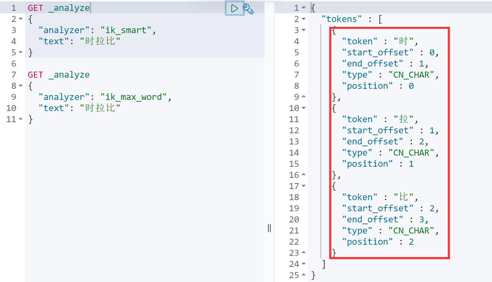

## ElasticSearch概述
> Elaticsearch，简称为es， es是一个开源的高扩展的分布式全文检索引擎，它可以近乎实时的存储、检索数据；本身扩展性很好，可以扩展到上百台服务器，处理PB级别（大数据时代）的数据。es也使用Java开发并使用Lucene作为其核心来实现所有索引和搜索的功能，但是它的目的是通过简单的RESTful API来隐藏Lucene的复杂性，从而让全文搜索变得简单。

### ElasticSearch的使用场景

- 维基百科，类似百度百科，全文检索，高亮，搜索推荐/2 （权重，百度！）
- The Guardian（国外新闻网站），类似搜狐新闻，用户行为日志（点击，浏览，收藏，评论）+社交网络数据（对某某新闻的相关看法），数据分析，给到每篇新闻文章的作者，让他知道他的文章的公众反馈（好，坏，热门，垃圾，鄙视，崇拜）
- Stack Overflow（国外的程序异常讨论论坛），IT问题，程序的报错，提交上去，有人会跟你讨论和回答，全文检索，搜索相关问题和答案，程序报错了，就会将报错信息粘贴到里面去，搜索有没有对应的答案
- GitHub（开源代码管理），搜索上千亿行代码
- 电商网站，检索商品
- 日志数据分析，logstash采集日志，ES进行复杂的数据分析，ELK技术，elasticsearch+logstash+kibana
- 商品价格监控网站，用户设定某商品的价格阈值，当低于该阈值的时候，发送通知消息给用户，比如说订阅牙膏的监控，如果高露洁牙膏的家庭套装低于50块钱，就通知我，我就去买。
- BI系统，商业智能，Business Intelligence。比如说有个大型商场集团，BI，分析一下某某区域最近3年的用户消费金额的趋势以及用户群体的组成构成，产出相关的数张报表，**区，最近3年，每年消费金额呈现100%的增长，而且用户群体85%是高级白领，开一个新商场。ES执行数据分析和挖掘，Kibana进行数据可视化
- 国内：站内搜索（电商，招聘，门户，等等），IT系统搜索（OA，CRM，ERP，等等），数据分析（ES热门的一个使用场景）
### ES和solr的差别

- es基本是开箱即用（解压就可以用 ! ）非常简单。Solr安装略微复杂一点点！
- Solr 利用 Zookeeper 进行分布式管理，而 Elasticsearch 自身带有分布式协调管理功能。
- Solr 支持更多格式的数据，比如JSON、XML、CSV，而 Elasticsearch 仅支持json文件格式。
- Solr 官方提供的功能更多，而 Elasticsearch  本身更注重于核心功能，高级功能多有第三方插件提供，例如图形化界面需要kibana友好支撑~!
- Solr 查询快，但更新索引时慢（即插入删除慢），用于电商等查询多的应用；
- ES建立索引快（即查询慢），**即实时性查询快**，用于facebook新浪等搜索。
- Solr 是传统搜索应用的有力解决方案，但 Elasticsearch 更适用于新兴的实时搜索应用。
- Solr比较成熟，有一个更大，更成熟的用户、开发和贡献者社区，而  Elasticsearch相对开发维护者较少，更新太快，学习使用成本较高。（趋势！）
## ElasticSearch安装
官网下载慢，可以从华为云的镜像去下载<br />ElasticSearch: [https://mirrors.huaweicloud.com/elasticsearch/?C=N&O=D](https://mirrors.huaweicloud.com/elasticsearch/?C=N&O=D)<br />logstash: [https://mirrors.huaweicloud.com/logstash/?C=N&O=D](https://mirrors.huaweicloud.com/logstash/?C=N&O=D)<br />kibana: [https://mirrors.huaweicloud.com/kibana/?C=N&O=D](https://mirrors.huaweicloud.com/kibana/?C=N&O=D)
### ElasticSearch的安装
启动`bin`目录下的`elasticsearch.bat`,浏览器访问`localhost:9200` 效果如下


### 可视化界面 es head的插件的安装

1. 首先配置es可跨域

在`config`目录中的`elasticsearch.yml`文件中配置
```bash
http.cors.enabled: true
http.cors.allow-origin: "*"
```

2. 使用git拉取https://github.com/mobz/elasticsearch-head/
3. 启动
```shell
npm install
npm run start
```

4. 访问http://localhost:9100

也可直接安装chrome插件,免去以上拉取启动步骤


### 了解 ELK
ELK是Elasticsearch、Logstash、Kibana三大开源框架首字母大写简称。市面上也被成为Elastic Stack。其中Elasticsearch是一个基于Lucene、分布式、通过Restful方式进行交互的近实时搜索平台框架。像类似百度、谷歌这种大数据全文搜索引擎的场景都可以使用Elasticsearch作为底层支持框架，可见Elasticsearch提供的搜索能力确实强大,市面上很多时候我们简称Elasticsearch为es。Logstash是ELK的中央数据流引擎，用于从不同目标（文件/数据存储/MQ）收集的不同格式数据，经过过滤后支持输出   到不同目的地（文件/MQ/redis/elasticsearch/kafka等）。Kibana可以将elasticsearch的数据通过友好的页面展示出来，提供实时分析的功能。<br />市面上很多开发只要提到ELK能够一致说出它是一个日志分析架构技术栈总称，但实际上ELK不仅仅适用于日志分析，它还可以支持其它任何数据分析和收集的场景，日志分析和收集只是更具有代表性。并非唯一性。


### 安装Kibana
> Kibana是一个针对Elasticsearch的开源分析及可视化平台，用来搜索、查看交互存储在Elasticsearch索引中的数据。使用Kibana，可以通过各种图表进行高级数据分析及展示。Kibana让海量数据更容易理解。它操作简单，基于浏览器的用户界面可以快速创建仪表板（dashboard）实时显示Elasticsearch查询动态。设置Kibana非常简单。无需编码或者额外的基础架构，几分钟内就可以完成Kibana安装并启动Elasticsearch索引监测。

**Kibana 版本要和 es 一致！**

**汉化设置**: 修改`config`目录下的`kibana.yml`文件,在文件末尾添加`i18n.locale: "zh-CN"`

**启动**: 打开`bin`目录下的`kibana.bat`访问 http://localhost:5601


## ES核心概念
> elasticsearch是面向文档，关系行数据库 和 elasticsearch 客观的对比！一切都是JSON！

| Relational DB | Elasticsearch |
| :-- | :-- |
| 数据库(database) | 索引(indices) |
| 表(tables) | types |
| 行(rows) | documents |
| 字段(columns) | fields |

elasticsearch(集群)中可以包含多个索引(数据库)，每个索引中可以包含多个类型(表)，每个类型下又包含多个文档(行)，每个文档中又包含多个字段(列)。

**物理设计：**

elasticsearch  在后台把每个索引划分成多个分片，每分分片可以在集群中的不同服务器间迁移一个人就是一个集群！默认的集群名称就是 elaticsearh

**逻辑设计：**

一个索引类型中，包含多个文档，比如说文档1，文档2。  当我们索引一篇文档时，可以通过这样的一各顺序找到 它: 索引==> 类型  ==> 文档ID ，通过这个组合我们就能索引到某个具体的文档。 注意:ID不必是整数，实际上它是个字符串。

### 文档
就是我们的一条条数据
```yaml
user
  zhangsan 18
  lisi 19
```
之前说elasticsearch是面向文档的，那么就意味着索引和搜索数据的最小单位是文档，elasticsearch 中，文档有几个重要属性 :

- 自我包含: 一篇文档同时包含字段和对应的值，也就是同时包含 key:value
- 可以是层次型的，一个文档中包含自文档，复杂的逻辑实体就是这么来的！ (就是一个json对象！fastjson进行自动转换！)
- 灵活的结构，文档不依赖预先定义的模式，我们知道关系型数据库中，要提前定义字段才能使用，在elasticsearch中，对于字段是非常灵活的，有时候，我们可以忽略该字段，或者动态的添加一个新的字段。

尽管我们可以随意的新增或者忽略某个字段，但是，每个字段的类型非常重要，比如一个年龄字段类型，可以是字符串也可以是整形。因为elasticsearch会保存字段和类型之间的映射及其他的设置。这种映射具体到每个映射的每种类型，这也是为什么在elasticsearch中，类型有时候也称为映射类型。
### 类型
类型是文档的逻辑容器，就像关系型数据库一样，表格是行的容器。 类型中对于字段的定义称为映射， 比如 name 映射为字符串类型。 我们说文档是无模式的，它们不需要拥有映射中所定义的所有字段， 比如新增一个字段，elasticsearch会自动的将新字段加入映射，但是这个字段的不确定它是什么类型，elasticsearch就开始猜，如果这个值是18，那么elasticsearch会认为它是整形。 但是elasticsearch也可能猜不对， 所以最安全的方式就是提前定义好所需要的映射，这点跟关系型数据库殊途同归了，先定义好字段，然后再使用。
### 索引
**就是数据库！**

索引是映射类型的容器，elasticsearch中的索引是一个非常大的文档集合。索引存储了映射类型的字段和其他设置。 然后它们被存储到了各个分片上了。<br />**物理设计 ：节点和分片 如何工作**


一个集群至少有一个节点，而一个节点就是一个elasricsearch进程，节点可以有多个索引默认的，如果你创建索引，那么索引将会有个5个分片 ( primary shard ,又称主分片 ) 构成的，每一个主分片会有一个副本 ( replica shard ,又称复制分片 )


上图是一个有3个节点的集群，可以看到主分片和对应的复制分片都不会在同一个节点内，这样有利于某个节点挂掉了，数据也不至于丢失。 实际上，一个分片是一个Lucene索引，一个包含**倒排索引**的文件目录，倒排索引的结构使得elasticsearch在不扫描全部文档的情况下，就能告诉你哪些文档包含特定的关键字。

### 倒排索引
elasticsearch使用的是一种称为倒排索引的结构，采用Lucene倒排索作为底层。这种结构适用于快速的全文搜索， 一个索引由文档中所有不重复的列表构成，对于每一个词，都有一个包含它的文档列表。 例如，现在有两个文档， 每个文档包含如下内容：
```
Study every day, good good up to forever	# 文档1包含的内容
To forever, study every day, good good up   # 文档2包含的内容
```
为了创建倒排索引，我们首先要将每个文档拆分成独立的词(或称为词条或者tokens)，然后创建一个包含所有不重 复的词条的排序列表，然后列出每个词条出现在哪个文档 :

| **term** | **doc_1** | **doc_2** |
| :-- | :-- | :-- |
| Study | √ | × |
| To | x | × |
| every | √ | √ |
| forever | √ | √ |
| day | √ | √ |
| study | × | √ |
| good | √ | √ |
| every | √ | √ |
| to | √ | × |
| up | √ | √ |

现在，我们试图搜索 to forever，只需要查看包含每个词条的文档 score

| **term** | **doc_1** | **doc_2** |
| :-- | :-- | :-- |
| to | √ | × |
| forever | √ | √ |
| total | 2 | 1 |

两个文档都匹配，但是第一个文档比第二个匹配程度更高。如果没有别的条件，现在，这两个包含关键字的文档都将返回。

再来看一个示例，比如我们通过博客标签来搜索博客文章。那么倒排索引列表就是这样的一个结构 :


如果要搜索含有 python 标签的文章，那相对于查找所有原始数据而言，查找倒排索引后的数据将会快的多。只需要查看标签这一栏，然后获取相关的文章ID即可。完全过滤掉无关的所有数据，提高效率！

### IK分词器插件

1. 下载 github地址:[https://github.com/medcl/elasticsearch-analysis-ik/releases](https://github.com/medcl/elasticsearch-analysis-ik/releases)<br />
2. 下载完毕之后，解压到我们的elasticsearch 插件目录即可
3. 重启es


4. 通过`elasticsearch-plugin list`这个命令来查看加载进来的插件


5. 使用kibana测试
> 查看不同的分词效果

**ik_smart**为最少切分


**ik_max_word**为最细粒度划分！穷尽词库的可能字典！


### 添加自己需要的词到分词器的字典中
问题如下: 时拉比被拆分了



在分词器`config`文件夹下创建`my.dic`文件 文件里添加我们需要的词 在`IKAnalyzer.cfg.xml`中配置


 重启es


## Rest风格说明
> 一种软件架构风格，而不是标准，只是提供了一组设计原则和约束条件。它主要用于客户端和服务器交互类的软件。基于这个风格设计的软件可以更简洁，更有层次，更易于实现缓存等机制。

**基本Rest命令说明：**

| method | URL地址 | 描述 |
| :-- | :-- | :-- |
| PUT | localhost:9200/索引名称/类型名称/文档id | 创建文档（指定文档id） |
| POST | localhost:9200/索引名称/类型名称 | 创建文档（随机文档id） |
| POST | localhost:9200/索引名称/类型名称/文档id/_update | 修改文档 |
| DELETE | localhost:9200/索引名称/类型名称/文档id | 删除文档 |
| GET | localhost:9200/索引名称/类型名称/文档id | 查询文档通过文档id |
| POST | localhost:9200/索引名称/类型名称/_search | 查询所有数据 |

### 关于索引的基本操作
#### 创建一个索引
```
PUT	/索引名/~类型名~/文档id
{请求体}
```


在 es head 中查看


#### 字段的类型

- 字符串类型<br />[text ](https://www.elastic.co/guide/en/elasticsearch/reference/current/text.html)、 [keyword](https://www.elastic.co/guide/en/elasticsearch/reference/current/keyword.html)
- 数值类型<br />[long, integer, short, byte, double, float, half_float, scaled_float](https://www.elastic.co/guide/en/elasticsearch/reference/current/number.html)
- 日期类型<br />[date](https://www.elastic.co/guide/en/elasticsearch/reference/current/date.html)
- te布尔值类型<br />[boolean](https://www.elastic.co/guide/en/elasticsearch/reference/current/boolean.html)
- 二进制类型<br />[binary](https://www.elastic.co/guide/en/elasticsearch/reference/current/binary.html)
#### 指定字段的类型
创建规则完后 可以通过 `GET` 请求获取具体的信息


#### 查看默认的信息


如果自己的文档字段没有指定，那么es 就会给我们默认配置字段类型！

**扩展**：  通过GET _cat/ 可以获得es的当前的很多信息！


#### 修改索引内容
以前的方法: 还是使用`PUT`命令


现在推荐使用以下方法 `POST`


#### 删除索引
通过DELETE 命令实现删除、 根据你的请求来判断是删除索引还是删除文档记录！


### 关于文档的基本操作
#### 添加数据


#### 获取数据


#### 修改数据


#### 简单搜索


#### 复杂操作搜索


##### 过滤结果


##### 排序


##### 分页


与数据库的分页查询类似

##### 布尔值查询
**must (and)**，类似 where id = 1 and name = xxx


**should (or)**, 类似 where id = 1 or name = xxx


**must_not (not)**


##### 过滤器 filter


##### 匹配多个条件


多个条件使用空格隔开 只要满足其中一个结果就可以被查出

##### 高亮查询


## Spring boot 集成 ElasticSearch
### 引入依赖
```xml
<properties>
    <!--自定义 es 版本依赖 保证和本地一致-->
    <elasticsearch.version>7.8.0</elasticsearch.version>
</properties>

<dependency>
    <groupId>org.springframework.boot</groupId>
    <artifactId>spring-boot-starter-data-elasticsearch</artifactId>
</dependency>
<dependency>
    <groupId>com.alibaba</groupId>
    <artifactId>fastjson</artifactId>
    <version>${fastjson.version}</version>
</dependency>
```
### 配置ElasticSearch
```java
@Configuration
public class ElasticSearchClientConfig {

    @Bean
    public RestHighLevelClient restHighLevelClient() {
        return new RestHighLevelClient(
                RestClient.builder(new HttpHost("localhost", 9200, "http"))
        );
    }
}
```
### 测试索引的创建和删除
```java
@Resource
private RestHighLevelClient client;

/**
 * 创建索引的测试
 */
@Test
void createIndexTest() throws IOException {
    //1.创建索引请求
    CreateIndexRequest request = new CreateIndexRequest("chen_index");
    //2.客户端执行请求 IndicesClient,请求后获得响应
    CreateIndexResponse createIndexResponse = client.indices().create(request, RequestOptions.DEFAULT);
    System.out.println(createIndexResponse);
}
/**
 * 索引存在测试,判断索引是否存在
 */
@Test
void existIndexTest() throws IOException {
    GetIndexRequest request = new GetIndexRequest("chen_index");
    boolean exists = client.indices().exists(request, RequestOptions.DEFAULT);
    System.out.println(exists);
}

/**
 * 删除索引测试
 */
@Test
void deleteIndexTest() throws IOException {
    DeleteIndexRequest request = new DeleteIndexRequest("chen_index");
    AcknowledgedResponse response = client.indices().delete(request, RequestOptions.DEFAULT);
    System.out.println(response.isAcknowledged());
}
```
### 测试文档的CRUD
```java
/**
 * 添加文档测试
 */
@Test
void addDocument() throws IOException {
    //创建对象和索引(执行创建索引Test)
    User user = new User("Manaphy", 3);
    //创建请求
    IndexRequest request = new IndexRequest("chen_index");
    //规则 put /chen_index/_doc/1
    request.id("1");
    //设置超时时间
    request.timeout(TimeValue.timeValueSeconds(1));
//        request.timeout("1s");//同上
    //将数据放入请求 json
    request.source(JSON.toJSONString(user), XContentType.JSON);
    //客户端发送请求
    IndexResponse indexResponse = client.index(request, RequestOptions.DEFAULT);
    System.out.println(indexResponse.toString());//IndexResponse[index=chen_index,type=_doc,id=1,version=1,result=created,seqNo=0,primaryTerm=1,shards={"total":2,"successful":1,"failed":0}]
    System.out.println(indexResponse.status());//对应我们命令返回的状态 CREATED
}

/**
 * 获取文档 get /chen_index/_doc/1
 */
@Test
void isExist() throws IOException {
    GetRequest getRequest = new GetRequest("chen_index", "1");
    //不获取返回的 _source 的上下文
    getRequest.fetchSourceContext(new FetchSourceContext(false));
    getRequest.storedFields("_none_");
    boolean exists = client.exists(getRequest, RequestOptions.DEFAULT);
    System.out.println(exists);
}

/**
 * 获得文档的信息
 */
@Test
void getDocument() throws IOException {
    GetRequest getRequest = new GetRequest("chen_index", "1");
    GetResponse getResponse = client.get(getRequest, RequestOptions.DEFAULT);
    //打印文档内容
    System.out.println(getResponse.getSourceAsString());//{"age":3,"name":"Manaphy"}
    System.out.println(getResponse);//{"_index":"chen_index","_type":"_doc","_id":"1","_version":1,"_seq_no":0,"_primary_term":1,"found":true,"_source":{"age":3,"name":"Manaphy"}}
}

/**
 * 更新文档的信息
 */
@Test
void updateDocument() throws IOException {
    UpdateRequest updateRequest = new UpdateRequest("chen_index", "1");
    updateRequest.timeout("1s");
    User user = new User("Manaphy Chen", 3);
    updateRequest.doc(JSON.toJSONString(user), XContentType.JSON);
    UpdateResponse response = client.update(updateRequest, RequestOptions.DEFAULT);
    System.out.println(response);//UpdateResponse[index=chen_index,type=_doc,id=1,version=2,seqNo=1,primaryTerm=1,result=updated,shards=ShardInfo{total=2, successful=1, failures=[]}]
    System.out.println(response.status());//OK
}

/**
 * 删除文档记录
 */
@Test
void deleteDocument() throws IOException {
    DeleteRequest request = new DeleteRequest("chen_index", "1");
    request.timeout("1s");
    DeleteResponse response = client.delete(request, RequestOptions.DEFAULT);
    System.out.println(response.status());//OK
}

/**
 * 批量插入数据
 */
@Test
void bulkRequest() throws IOException {
    BulkRequest bulkRequest = new BulkRequest();
    bulkRequest.timeout(TimeValue.timeValueMinutes(1));

    ArrayList<User> userList = new ArrayList<User>() {{
        add(new User("chen1", 3));
        add(new User("chen2", 3));
        add(new User("chen3", 2));
        add(new User("chen4", 3));
        add(new User("chen5", 4));
    }};

    //批处理请求
    for (int i = 0; i < userList.size(); i++) {
        //批量更新和批量删除 就在这里修改对应的请求即可
//            bulkRequest.add(DeleteRequest deleteRequest)
//            bulkRequest.add(UpdateRequest updateRequest)
        bulkRequest.add(
                new IndexRequest("chen_index")
                        .id("" + (i + 1))//如果这里不指定id 就会生成一个随机的id 如 5fZb9XIBR6G61hgle73t
                        .source(JSON.toJSONString(userList.get(i)), XContentType.JSON));
    }
    BulkResponse response = client.bulk(bulkRequest, RequestOptions.DEFAULT);
    System.out.println(response.hasFailures());//是否失败,返回 false 代表成功
}
```
### 搜索
```java
/**
 * 查询
 * SearchRequest 搜索请求
 * SearchSourceBuilder 条件构造
 * HighlightBuilder 构建高亮
 * TermQueryBuilder 精确查询
 * QueryBuilders 构建查询条件
 */
@Test
void search() throws IOException {
    SearchRequest searchRequest = new SearchRequest("chen_index");
    //构建搜索条件
    SearchSourceBuilder sourceBuilder = new SearchSourceBuilder();
    //查询条件, 使用 QueryBuilders 工具来实现
    TermQueryBuilder termQueryBuilder = QueryBuilders.termQuery("name", "chen1");

    sourceBuilder.query(termQueryBuilder);
    sourceBuilder.timeout(TimeValue.timeValueMinutes(1));

    //高亮
    HighlightBuilder highlightBuilder = new HighlightBuilder();
    highlightBuilder.field("name");
    highlightBuilder.preTags("<span style='color:red'>");
    highlightBuilder.postTags("</span>");
    sourceBuilder.highlighter(highlightBuilder);

    searchRequest.source(sourceBuilder);
    SearchResponse searchResponse = client.search(searchRequest, RequestOptions.DEFAULT);
    SearchHits hits = searchResponse.getHits();
    System.out.println(JSON.toJSONString(hits));
    System.out.println("------------------------------------------");
    for (SearchHit hit : hits.getHits()) {
        //解析高亮字段
        Map<String, HighlightField> highlightFields = hit.getHighlightFields();
        HighlightField name = highlightFields.get("name");
        Map<String, Object> sourceAsMap = hit.getSourceAsMap();//原来的结果
        //解析高亮的字段 将原来的字段替换为我们高亮的字段即可
        if (name != null) {
            Text[] fragments = name.fragments();
            StringBuilder newName = new StringBuilder();
            for (Text fragment : fragments) {
                newName.append(fragment);
            }
            sourceAsMap.put("name", newName);
        }

        System.out.println(sourceAsMap);//{name=<span style='color:red'>chen1</span>, age=3}
    }
}
```
