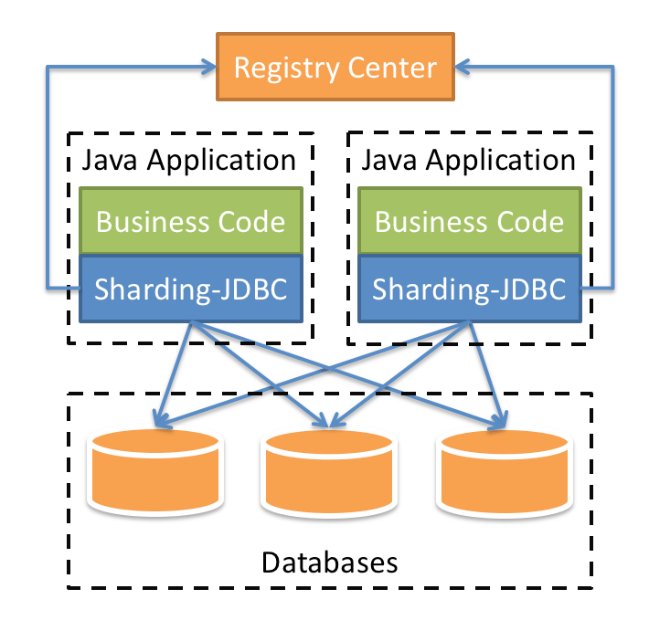
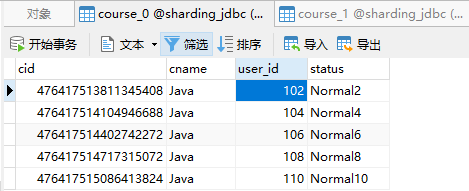
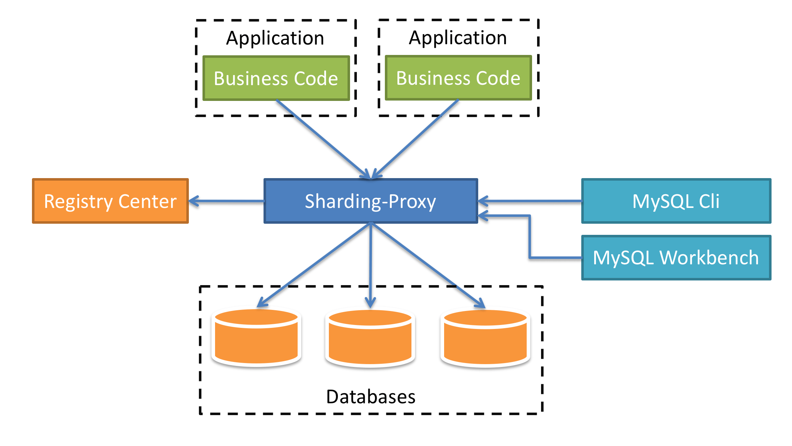

## ShardingSphere
> Apache ShardingSphere 是一套开源的分布式数据库中间件解决方案组成的生态圈，它由 JDBC、Proxy 和 Sidecar（规划中）这 3 款相互独立，却又能够混合部署配合使用的产品组成。 它们均提供标准化的数据分片、分布式事务和数据库治理功能，可适用于如 Java 同构、异构语言、云原生等各种多样化的应用场景。<br />Apache ShardingSphere 定位为关系型数据库中间件，旨在充分合理地在分布式的场景下利用关系型数据库的计算和存储能力，而并非实现一个全新的关系型数据库。 它通过关注不变，进而抓住事物本质。关系型数据库当今依然占有巨大市场，是各个公司核心业务的基石，未来也难于撼动，我们目前阶段更加关注在原有基础上的增量，而非颠覆。<br />Apache ShardingSphere 5.x 版本开始致力于可插拔架构，项目的功能组件能够灵活的以可插拔的方式进行扩展。 目前，数据分片、读写分离、多数据副本、数据加密、影子库压测等功能，以及 MySQL、PostgreSQL、SQLServer、Oracle 等 SQL 与协议的支持，均通过插件的方式织入项目。 开发者能够像使用积木一样定制属于自己的独特系统。Apache ShardingSphere 目前已提供数十个 SPI 作为系统的扩展点，仍在不断增加中。

## Sharding-JDBC
定位为轻量级 Java 框架，在 Java 的 JDBC 层提供的额外服务。 它使用客户端直连数据库，以 jar 包形式提供服务，无需额外部署和依赖，可理解为增强版的 JDBC 驱动，完全兼容 JDBC 和各种 ORM 框架。

- 适用于任何基于 JDBC 的 ORM 框架，如：JPA, Hibernate, Mybatis, Spring JDBC Template 或直接使用 JDBC。
- 支持任何第三方的数据库连接池，如：DBCP, C3P0, BoneCP, Druid, HikariCP 等。
- 支持任意实现JDBC规范的数据库。目前支持 MySQL，Oracle，SQLServer，PostgreSQL 以及任何遵循 SQL92 标准的数据库。



### Sharding-JDBC 实现水平分表
> 约定规则：如果添加课程 id 是偶数把数据添加 course_0，如果奇数添加到 course_1


1. pom依赖
```xml
<dependency>
    <groupId>org.springframework.boot</groupId>
    <artifactId>spring-boot-starter-web</artifactId>
</dependency>
<dependency>
    <groupId>com.baomidou</groupId>
    <artifactId>mybatis-plus-boot-starter</artifactId>
    <version>3.3.2</version>
</dependency>
<dependency>
    <groupId>com.alibaba</groupId>
    <artifactId>druid-spring-boot-starter</artifactId>
    <version>1.1.22</version>
</dependency>
<dependency>
    <groupId>mysql</groupId>
    <artifactId>mysql-connector-java</artifactId>
    <scope>runtime</scope>
</dependency>
<dependency>
    <groupId>org.apache.shardingsphere</groupId>
    <artifactId>sharding-jdbc-spring-boot-starter</artifactId>
    <version>4.0.0-RC1</version>
</dependency>
<dependency>
    <groupId>org.projectlombok</groupId>
    <artifactId>lombok</artifactId>
    <optional>true</optional>
</dependency>
```

2. 按照水平分表的方式，创建数据库和数据库表
```sql
CREATE TABLE `course_0` (
  `cid` bigint NOT NULL,
  `cname` varchar(50) COLLATE utf8mb4_general_ci NOT NULL,
  `user_id` bigint NOT NULL,
  `status` varchar(10) NOT NULL,
  PRIMARY KEY (`cid`)
) ENGINE=InnoDB;

CREATE TABLE `course_1` (
  `cid` bigint NOT NULL,
  `cname` varchar(50) COLLATE utf8mb4_general_ci NOT NULL,
  `user_id` bigint NOT NULL,
  `status` varchar(10) NOT NULL,
  PRIMARY KEY (`cid`)
) ENGINE=InnoDB;
```

3. 配置application.properties
```properties
# shardingjdbc分片策略
# 配置数据源，给数据源起名称
spring.shardingsphere.datasource.names=m1

# 一个实体类对应两张表，覆盖
spring.main.allow-bean-definition-overriding=true

#配置第一个数据源具体内容，包含连接池，驱动，地址，用户名和密码
spring.shardingsphere.datasource.m1.type=com.alibaba.druid.pool.DruidDataSource
spring.shardingsphere.datasource.m1.driver-class-name=com.mysql.cj.jdbc.Driver
spring.shardingsphere.datasource.m1.url=jdbc:mysql://192.168.2.128:3306/sharding_jdbc?serverTimezone=GMT%2B8&characterEncoding=UTF-8
spring.shardingsphere.datasource.m1.username=root
spring.shardingsphere.datasource.m1.password=root

#指定course表分布情况,配置表在哪个数据库里面,表名称都是什么 m1.course_0 m1.course_1
spring.shardingsphere.sharding.tables.course.actual-data-nodes=m1.course_${0..1}

# 指定course表里面主键cid 生成策略  SNOWFLAKE(雪花算法)
spring.shardingsphere.sharding.tables.course.key-generator.column=cid
spring.shardingsphere.sharding.tables.course.key-generator.type=SNOWFLAKE

# 指定表分片策略  约定cid值偶数添加到course_1表，如果cid是奇数添加到course_2表
spring.shardingsphere.sharding.tables.course.table-strategy.inline.sharding-column=cid
spring.shardingsphere.sharding.tables.course.table-strategy.inline.algorithm-expression=course_${ cid %2 }

# 打开sql输出日志
spring.shardingsphere.props.sql.show=true
```

4. 编写代码

实体类
```java
@Data
@Accessors(chain = true)
public class Course {

    private Long cid;
    private String cname;
    private Long userId;
    private String status;
}
```

mapper类
```java
public interface CourseMapper extends BaseMapper<Course> {

}
```

启动类上加 `@MapperScan("com.cgp.shardingjdbc.mapper")`

5. 编写测试类
```java
@Resource
private CourseMapper courseMapper;

@Test
void addCourse() {
    for (int i = 1; i <= 10; i++) {
        Course course = new Course();
        course.setCname("Java").setUserId(100L + i).setStatus("Normal" + i);
        courseMapper.insert(course);
    }
}

@Test
void findCourse() {
    Course course = courseMapper.selectOne(new QueryWrapper<Course>().eq("cid", 476417513358360577L));
    System.out.println(course);
}
//删改略...
```



### Sharding-JDBC 实现水平分库
> 指定表分片策略  约定cid值偶数添加到course_0表，如果cid是奇数添加到course_1表
> 指定数据库分片策略 约定user_id是偶数添加m0，是奇数添加m1


根据以上代码修改 properties 文件
```properties
# shardingjdbc分片策略
# 配置数据源，给数据源起名称,
# 水平分库，配置两个数据源
spring.shardingsphere.datasource.names=m0,m1

# 一个实体类对应两张表，覆盖
spring.main.allow-bean-definition-overriding=true

#配置第一个数据源具体内容，包含连接池，驱动，地址，用户名和密码
spring.shardingsphere.datasource.m0.type=com.alibaba.druid.pool.DruidDataSource
spring.shardingsphere.datasource.m0.driver-class-name=com.mysql.cj.jdbc.Driver
spring.shardingsphere.datasource.m0.url=jdbc:mysql://192.168.2.128:3306/sharding_jdbc_1?serverTimezone=GMT%2B8
spring.shardingsphere.datasource.m0.username=root
spring.shardingsphere.datasource.m0.password=root

#配置第二个数据源具体内容，包含连接池，驱动，地址，用户名和密码
spring.shardingsphere.datasource.m1.type=com.alibaba.druid.pool.DruidDataSource
spring.shardingsphere.datasource.m1.driver-class-name=com.mysql.cj.jdbc.Driver
spring.shardingsphere.datasource.m1.url=jdbc:mysql://192.168.2.128:3306/sharding_jdbc_2?serverTimezone=GMT%2B8
spring.shardingsphere.datasource.m1.username=root
spring.shardingsphere.datasource.m1.password=root

#指定数据库分布情况，数据库里面表分布情况
# m1  m2    course_0 course_1
spring.shardingsphere.sharding.tables.course.actual-data-nodes=m$->{0..1}.course_$->{0..1}

# 指定course表里面主键cid 生成策略  SNOWFLAKE
spring.shardingsphere.sharding.tables.course.key-generator.column=cid
spring.shardingsphere.sharding.tables.course.key-generator.type=SNOWFLAKE

# 指定表分片策略  约定cid值偶数添加到course_0表，如果cid是奇数添加到course_1表
spring.shardingsphere.sharding.tables.course.table-strategy.inline.sharding-column=cid
spring.shardingsphere.sharding.tables.course.table-strategy.inline.algorithm-expression=course_$->{cid % 2}

# 指定数据库分片策略 约定user_id是偶数添加m0，是奇数添加m1
#spring.shardingsphere.sharding.default-database-strategy.inline.sharding-column=user_id
#spring.shardingsphere.sharding.default-database-strategy.inline.algorithm-expression=m$->{user_id % 2}
spring.shardingsphere.sharding.tables.course.database-strategy.inline.sharding-column=user_id
spring.shardingsphere.sharding.tables.course.database-strategy.inline.algorithm-expression=m$->{user_id % 2}

# 打开sql输出日志
spring.shardingsphere.props.sql.show=true
```

建表语句同上

**编写测试类**
```java
@Test
void addCourseDb() {
    for (int i = 1; i <= 10; i++) {
        Course course = new Course();
        course.setCname("JavaDB").setUserId(100L).setStatus("Normal");
        courseMapper.insert(course);
    }
    for (int i = 1; i <= 10; i++) {
        Course course = new Course();
        course.setCname("JavaDB").setUserId(101L).setStatus("Normal");
        courseMapper.insert(course);
    }
}
//删改查略...
```
运行后发现2个库中共四张表都有5条数据

### Sharding-JDBC 实现垂直分库
修改 properties 文件,增加垂直分库配置
```sql
# shardingjdbc分片策略
# 配置数据源，给数据源起名称,
# 垂直分库，新增m2数据源
spring.shardingsphere.datasource.names=m0,m1,m2

# 一个实体类对应两张表，覆盖
spring.main.allow-bean-definition-overriding=true

#========================垂直分库配置开始===================================
#配置第三个数据源具体内容，垂直分库
spring.shardingsphere.datasource.m2.type=com.alibaba.druid.pool.DruidDataSource
spring.shardingsphere.datasource.m2.driver-class-name=com.mysql.cj.jdbc.Driver
spring.shardingsphere.datasource.m2.url=jdbc:mysql://192.168.2.128:3306/sharding_jdbc_user?serverTimezone=GMT%2B8
spring.shardingsphere.datasource.m2.username=root
spring.shardingsphere.datasource.m2.password=root

# 配置user_db数据库里面t_user 专库专表
spring.shardingsphere.sharding.tables.t_user.actual-data-nodes=m2.t_user

# 指定t_user表里面主键user_id 生成策略  SNOWFLAKE
spring.shardingsphere.sharding.tables.t_user.key-generator.column=user_id
spring.shardingsphere.sharding.tables.t_user.key-generator.type=SNOWFLAKE

# 指定垂直分库 表分片策略
spring.shardingsphere.sharding.tables.t_user.table-strategy.inline.sharding-column=user_id
spring.shardingsphere.sharding.tables.t_user.table-strategy.inline.algorithm-expression=t_user
#========================垂直分库配置结束===================================


#配置第一个数据源具体内容，包含连接池，驱动，地址，用户名和密码
spring.shardingsphere.datasource.m0.type=com.alibaba.druid.pool.DruidDataSource
spring.shardingsphere.datasource.m0.driver-class-name=com.mysql.cj.jdbc.Driver
spring.shardingsphere.datasource.m0.url=jdbc:mysql://192.168.2.128:3306/sharding_jdbc_1?serverTimezone=GMT%2B8
spring.shardingsphere.datasource.m0.username=root
spring.shardingsphere.datasource.m0.password=root

#配置第二个数据源具体内容，包含连接池，驱动，地址，用户名和密码
spring.shardingsphere.datasource.m1.type=com.alibaba.druid.pool.DruidDataSource
spring.shardingsphere.datasource.m1.driver-class-name=com.mysql.cj.jdbc.Driver
spring.shardingsphere.datasource.m1.url=jdbc:mysql://192.168.2.128:3306/sharding_jdbc_2?serverTimezone=GMT%2B8
spring.shardingsphere.datasource.m1.username=root
spring.shardingsphere.datasource.m1.password=root

#指定数据库分布情况，数据库里面表分布情况
# m1  m2    course_0 course_1
spring.shardingsphere.sharding.tables.course.actual-data-nodes=m$->{0..1}.course_$->{0..1}

# 指定course表里面主键cid 生成策略  SNOWFLAKE
spring.shardingsphere.sharding.tables.course.key-generator.column=cid
spring.shardingsphere.sharding.tables.course.key-generator.type=SNOWFLAKE

# 指定表分片策略  约定cid值偶数添加到course_0表，如果cid是奇数添加到course_1表
spring.shardingsphere.sharding.tables.course.table-strategy.inline.sharding-column=cid
spring.shardingsphere.sharding.tables.course.table-strategy.inline.algorithm-expression=course_$->{cid % 2}

# 指定数据库分片策略 约定user_id是偶数添加m0，是奇数添加m1
#spring.shardingsphere.sharding.default-database-strategy.inline.sharding-column=user_id
#spring.shardingsphere.sharding.default-database-strategy.inline.algorithm-expression=m$->{user_id % 2}
spring.shardingsphere.sharding.tables.course.database-strategy.inline.sharding-column=user_id
spring.shardingsphere.sharding.tables.course.database-strategy.inline.algorithm-expression=m$->{user_id % 2}

# 打开sql输出日志
spring.shardingsphere.props.sql.show=true
```

建表语句
```sql
CREATE TABLE `t_user` (
  `user_id` bigint NOT NULL,
  `username` varchar(50) COLLATE utf8mb4_general_ci NOT NULL,
  `age` int NOT NULL,
  PRIMARY KEY (`user_id`)
) ENGINE=InnoDB;
```

实体类和Mapper类
```java
@Data
@TableName("t_user")
@Accessors(chain = true)
public class User {
    private Long userId;
    private String username;
    private Integer age;
}
```

```java
public interface UserMapper extends BaseMapper<User> {
}
```

测试类
```java
@Resource
private UserMapper userMapper;

@Test
void addUser() {
    User user = new User();
    user.setUsername("Manaphy").setAge(18);
    userMapper.insert(user);
}
//删改查略...
```

### Sharding-JDBC 操作公共表
作用<br />（1） 存储固定数据的表，表数据很少发生变化，查询时候经常进行关联<br />（2） 在每个数据库中创建出相同结构公共表

修改 properties 文件,增加公共表配置
```sql
# shardingjdbc分片策略
# 配置数据源，给数据源起名称,
# 垂直分库，新增m2数据源
spring.shardingsphere.datasource.names=m0,m1,m2

# 一个实体类对应两张表，覆盖
spring.main.allow-bean-definition-overriding=true

#========================配置公共表开始===================================
#配置公共表
spring.shardingsphere.sharding.broadcast-tables=t_dict

# 指定公共表里面主键dict_id 生成策略  SNOWFLAKE
spring.shardingsphere.sharding.tables.t_dict.key-generator.column=dict_id
spring.shardingsphere.sharding.tables.t_dict.key-generator.type=SNOWFLAKE
#========================配置公共表结束===================================

#========================垂直分库配置开始===================================
#配置第三个数据源具体内容，垂直分库
spring.shardingsphere.datasource.m2.type=com.alibaba.druid.pool.DruidDataSource
spring.shardingsphere.datasource.m2.driver-class-name=com.mysql.cj.jdbc.Driver
spring.shardingsphere.datasource.m2.url=jdbc:mysql://192.168.2.128:3306/sharding_jdbc_user?serverTimezone=GMT%2B8
spring.shardingsphere.datasource.m2.username=root
spring.shardingsphere.datasource.m2.password=root

# 配置user_db数据库里面 t_user 专库专表
spring.shardingsphere.sharding.tables.t_user.actual-data-nodes=m2.t_user

# 指定t_user表里面主键user_id 生成策略  SNOWFLAKE
spring.shardingsphere.sharding.tables.t_user.key-generator.column=user_id
spring.shardingsphere.sharding.tables.t_user.key-generator.type=SNOWFLAKE

# 指定垂直分库 表分片策略
spring.shardingsphere.sharding.tables.t_user.table-strategy.inline.sharding-column=user_id
spring.shardingsphere.sharding.tables.t_user.table-strategy.inline.algorithm-expression=t_user
#========================垂直分库配置结束===================================


#配置第一个数据源具体内容，包含连接池，驱动，地址，用户名和密码
spring.shardingsphere.datasource.m0.type=com.alibaba.druid.pool.DruidDataSource
spring.shardingsphere.datasource.m0.driver-class-name=com.mysql.cj.jdbc.Driver
spring.shardingsphere.datasource.m0.url=jdbc:mysql://192.168.2.128:3306/sharding_jdbc_1?serverTimezone=GMT%2B8
spring.shardingsphere.datasource.m0.username=root
spring.shardingsphere.datasource.m0.password=root

#配置第二个数据源具体内容，包含连接池，驱动，地址，用户名和密码
spring.shardingsphere.datasource.m1.type=com.alibaba.druid.pool.DruidDataSource
spring.shardingsphere.datasource.m1.driver-class-name=com.mysql.cj.jdbc.Driver
spring.shardingsphere.datasource.m1.url=jdbc:mysql://192.168.2.128:3306/sharding_jdbc_2?serverTimezone=GMT%2B8
spring.shardingsphere.datasource.m1.username=root
spring.shardingsphere.datasource.m1.password=root

#指定数据库分布情况，数据库里面表分布情况
# m1  m2    course_0 course_1
spring.shardingsphere.sharding.tables.course.actual-data-nodes=m$->{0..1}.course_$->{0..1}

# 指定course表里面主键cid 生成策略  SNOWFLAKE
spring.shardingsphere.sharding.tables.course.key-generator.column=cid
spring.shardingsphere.sharding.tables.course.key-generator.type=SNOWFLAKE

# 指定表分片策略  约定cid值偶数添加到course_0表，如果cid是奇数添加到course_1表
spring.shardingsphere.sharding.tables.course.table-strategy.inline.sharding-column=cid
spring.shardingsphere.sharding.tables.course.table-strategy.inline.algorithm-expression=course_$->{cid % 2}

# 指定数据库分片策略 约定user_id是偶数添加m0，是奇数添加m1
#spring.shardingsphere.sharding.default-database-strategy.inline.sharding-column=user_id
#spring.shardingsphere.sharding.default-database-strategy.inline.algorithm-expression=m$->{user_id % 2}
spring.shardingsphere.sharding.tables.course.database-strategy.inline.sharding-column=user_id
spring.shardingsphere.sharding.tables.course.database-strategy.inline.algorithm-expression=m$->{user_id % 2}

# 打开sql输出日志
spring.shardingsphere.props.sql.show=true
```
在`sharding_jdbc_user` `sharding_jdbc_1` 和 `sharding_jdbc_2` 表中新增`t_dict` 表
```sql
CREATE TABLE `t_dict` (
  `dict_id` bigint NOT NULL,
  `dict_name` varchar(100) NOT NULL,
  `dict_value` varchar(100) NOT NULL,
  PRIMARY KEY (`dict_id`)
) ENGINE=InnoDB;
```
实体类和Mapper类
```java
@Data
@TableName("t_dict")
@Accessors(chain = true)
public class Dict {
    private Long dictId;
    private String dictName;
    private String dictValue;
}
```

```java
public interface DictMapper extends BaseMapper<Dict> {
}
```

测试类
```java
@Resource
private DictMapper dictMapper;

@Test
void addDict() {
    Dict dict = new Dict();
    dict.setDictName("测试").setDictValue("启用");
    dictMapper.insert(dict);
}
//删改查略...
```
运行后发现三个库中的`t_dict` 表中都有一条一样的数据

### Sharding-JDBC 实现读写分离
基于 docker 搭建 mysql 主从复制 参考https://blog.csdn.net/weixin_45631876/article/details/104048362<br />配置application.properties
```properties
# shardingjdbc分片策略
# 配置数据源，给数据源起名称
spring.shardingsphere.datasource.names=master,slave

# 一个实体类对应两张表，覆盖
spring.main.allow-bean-definition-overriding=true

#配置主数据源具体内容，包含连接池，驱动，地址，用户名和密码
spring.shardingsphere.datasource.master.type=com.alibaba.druid.pool.DruidDataSource
spring.shardingsphere.datasource.master.driver-class-name=com.mysql.cj.jdbc.Driver
spring.shardingsphere.datasource.master.url=jdbc:mysql://192.168.2.128:3307/sharding_jdbc?serverTimezone=GMT%2B8
spring.shardingsphere.datasource.master.username=root
spring.shardingsphere.datasource.master.password=123456

#配置从数据源具体内容，包含连接池，驱动，地址，用户名和密码
spring.shardingsphere.datasource.slave.type=com.alibaba.druid.pool.DruidDataSource
spring.shardingsphere.datasource.slave.driver-class-name=com.mysql.cj.jdbc.Driver
spring.shardingsphere.datasource.slave.url=jdbc:mysql://192.168.2.128:3308/sharding_jdbc?serverTimezone=GMT%2B8
spring.shardingsphere.datasource.slave.username=root
spring.shardingsphere.datasource.slave.password=123456

# t_user分表策略，固定分配至ds0的 sharding_jdbc真实表
spring.shardingsphere.sharding.tables.t_user.actual-data-nodes=ds0.course

# 主库从库逻辑数据源定义 ds0为 sharding_jdbc
spring.shardingsphere.sharding.master-slave-rules.ds0.master-data-source-name=master
spring.shardingsphere.sharding.master-slave-rules.ds0.slave-data-source-names=slave

# 指定course表里面主键cid 生成策略  SNOWFLAKE(雪花算法)
spring.shardingsphere.sharding.tables.course.key-generator.column=cid
spring.shardingsphere.sharding.tables.course.key-generator.type=SNOWFLAKE

# 打开sql输出日志
spring.shardingsphere.props.sql.show=true
```
在主数据库新建 course 表<br />建表语句、实体类和Mapper类同水平分表

编写测试类
```java
@Test
void addCourseMaster() {
    Course course = new Course();
    course.setCname("Java").setUserId(100L).setStatus("Normal");
    courseMapper.insert(course);
}

@Test
void findCourseSlave() {
    Course course = courseMapper.selectOne(new QueryWrapper<Course>().eq("cid", 476494916214587393L));
    System.out.println(course);
}

@Test
void modifyCourse() {
    QueryWrapper<Course> wrapper = new QueryWrapper<>();
    wrapper.eq("cid", 476494916214587393L);
    Course course = courseMapper.selectOne(wrapper);
    course.setCname("Sharding");
    courseMapper.update(course, wrapper);
}

@Test
void deleteCourse() {
    QueryWrapper<Course> wrapper = new QueryWrapper<>();
    wrapper.eq("cid", 476494916214587393L);
    courseMapper.delete(wrapper);
}
```

## Sharding-Proxy
定位为透明化的数据库代理端，提供封装了数据库二进制协议的服务端版本，用于完成对异构语言的支持。 目前提供 MySQL 和 PostgreSQL 版本，它可以使用任何兼容 MySQL/PostgreSQL 协议的访问客户端(如：MySQL Command Client, MySQL Workbench, Navicat 等)操作数据，对 DBA 更加友好。

- 向应用程序完全透明，可直接当做 MySQL/PostgreSQL 使用。
- 适用于任何兼容 MySQL/PostgreSQL 协议的的客户端。



### 下载及安装

1. 从[官网](https://shardingsphere.apache.org/document/current/cn/downloads/)下载相应的软件
2. 把下载之后压缩文件，解压，启动 bin 目录启动文件就可以了
3. 查看 lib 文件夹 ,如果扩展名不是 `版本号.jar` 的要重命名补上  `版本号.jar`

### Sharding-Proxy 配置(分表)

1. 进入 conf 目录，修改文件 server.yaml，打开两段内容注释
```yaml
authentication:
  users:
    root:
      password: root
    sharding:
      password: sharding 
      authorizedSchemas: sharding_db

props:
  max.connections.size.per.query: 1
  acceptor.size: 16  # The default value is available processors count * 2.
  executor.size: 16  # Infinite by default.
  proxy.frontend.flush.threshold: 128  # The default value is 128.
    # LOCAL: Proxy will run with LOCAL transaction.
    # XA: Proxy will run with XA transaction.
    # BASE: Proxy will run with B.A.S.E transaction.
  proxy.transaction.type: LOCAL
  proxy.opentracing.enabled: false
  query.with.cipher.column: true
  sql.show: false
```

2. 进入 conf 目录，打开 config-sharding.yaml<br />可以看到这样一句话<br />`# If you want to connect to MySQL, you should manually copy MySQL driver to lib directory.`
   1. 复制 mysql 驱动 jar 包到 lib 目录
   2. 配置分库分表规则
```yaml
schemaName: sharding_db

dataSources:
  ds_0:
    url: jdbc:mysql://192.168.2.128:3306/sharding_proxy?serverTimezone=UTC&useSSL=false
    username: root
    password: root
    connectionTimeoutMilliseconds: 30000
    idleTimeoutMilliseconds: 60000
    maxLifetimeMilliseconds: 1800000
    maxPoolSize: 50

shardingRule:
  tables:
    t_order:
      actualDataNodes: ds_0.t_order_${0..1}
      tableStrategy:
        inline:
          shardingColumn: order_id
          algorithmExpression: t_order_${order_id % 2}
      keyGenerator:
        type: SNOWFLAKE
        column: order_id
  bindingTables:
    - t_order
  defaultDatabaseStrategy:
    inline:
      shardingColumn: user_id
      algorithmExpression: ds_0
  defaultTableStrategy:
    none:
```

   3. 在数据库中新建`sharding_proxy`数据库
   4. 启动 Sharding-Proxy 服务 `bin/start.bat` (windows环境)或者 `bin/start.sh`(Linux环境)
```
[INFO ] 22:23:16.578 [nioEventLoopGroup-2-1] i.n.handler.logging.LoggingHandler - [id: 0x7e19000c, L:/0:0:0:0:0:0:0:0:3307] READ: [id: 0x096f3d30, L:/0:0:0:0:0:0:0:1:3307 - R:/0:0:0:0:0:0:0:1:52814]
[INFO ] 22:23:16.580 [nioEventLoopGroup-2-1] i.n.handler.logging.LoggingHandler - [id: 0x7e19000c, L:/0:0:0:0:0:0:0:0:3307] READ COMPLETE
```
<br />最后两行打印以上信息代表启动成功

   5. 由于Navicat等工具不支持Sharding_Proxy,所以只能使用命令行窗口连接
```
mysql -uroot -P3307 -uroot -proot
   
   mysql> show databases;
   +-------------+
   | Database    |
   +-------------+
   | sharding_db |
   +-------------+
   1 row in set (0.01 sec)
   mysql> use sharding_db;
   Database changed
   mysql> create table if not exists ds_0.t_order(order_id BIGINT NOT NULL,user_id INT NOT NULL,status VARCHAR(50),PRIMARY KEY (order_id));#创建t_order表
   Query OK, 0 rows affected (0.28 sec)
   mysql> show tables;
   +--------------------------+
   | Tables_in_sharding_proxy |
   +--------------------------+
   | t_order                  |
   +--------------------------+
   1 row in set (0.03 sec)
   mysql> insert into t_order(order_id,user_id,status)values(11,1,'init');#向表中插入数据
   Query OK, 1 row affected (0.10 sec)
   mysql> select * from t_order;
   +----------+---------+--------+
   | order_id | user_id | status |
   +----------+---------+--------+
   |       11 |       1 | init   |
   +----------+---------+--------+
   1 row in set (0.06 sec)
```

6. 回到 192.168.2.128:3306 实际数据库中，看到已经创建好了表和添加数据

### Sharding-Proxy 配置(分库)

1. 打开 config-sharding.yaml 文件,修改内容
```bash
schemaName: sharding_db

dataSources:
  ds_0:
    url: jdbc:mysql://192.168.2.128:3306/sharding_jdbc_1?serverTimezone=UTC&useSSL=false
    username: root
    password: root
    connectionTimeoutMilliseconds: 30000
    idleTimeoutMilliseconds: 60000
    maxLifetimeMilliseconds: 1800000
    maxPoolSize: 50
  ds_1:
    url: jdbc:mysql://192.168.2.128:3306/sharding_jdbc_2?serverTimezone=UTC&useSSL=false
    username: root
    password: root
    connectionTimeoutMilliseconds: 30000
    idleTimeoutMilliseconds: 60000
    maxLifetimeMilliseconds: 1800000
    maxPoolSize: 50

shardingRule:
  tables:
    t_order:
      actualDataNodes: ds_${0..1}.t_order_${0..1}
      tableStrategy:
        inline:
          shardingColumn: order_id
          algorithmExpression: t_order_${order_id % 2}
      keyGenerator:
        type: SNOWFLAKE
        column: order_id
      keyGenerator:
        type: SNOWFLAKE
        column: order_item_id
  bindingTables:
    - t_order,t_order_item
  defaultDatabaseStrategy:
    inline:
      shardingColumn: user_id
      algorithmExpression: ds_${user_id % 2}
  defaultTableStrategy:
    none:
```

2. 启动 Sharding-Proxy 服务
3. 使用命令行窗口连接
```bash
mysql -P3307 -uroot -proot

mysql> show databases;
+-------------+
| Database    |
+-------------+
| sharding_db |
+-------------+
1 row in set (0.01 sec)

mysql> use sharding_db;
Database changed
mysql> show tables;
Empty set (0.10 sec)

mysql> create table if not exists ds_0.t_order(order_id BIGINT NOT NULL,user_id INT NOT NULL,status VARCHAR(50),PRIMARY KEY (order_id));#创建t_order表
Query OK, 0 rows affected (0.32 sec)

mysql> show tables;
+---------------------------+
| Tables_in_sharding_jdbc_1 |
+---------------------------+
| t_order                   |
+---------------------------+
1 row in set (0.03 sec)

mysql> insert into t_order(order_id,user_id,status)values(11,1,'init');#向表中插入数据
Query OK, 1 row affected (0.11 sec)
```

4. 回到 192.168.2.128:3306 实际数据库中，看到已经创建好了表和添加数据

### Sharding-Proxy 配置（读写分离）

1. 简化操作=> 直接在 192.168.2.128:3306 中创建 sharding_master sharding_slave_0 sharing_slave_1 三个数据库 (一主双从)
2. 打开 config-master_slave.yaml 文件,修改内容
```yaml
schemaName: master_slave_db

dataSources:
  master_ds:
    url: jdbc:mysql://192.168.174.129:3307/sharding_master?serverTimezone=UTC&useSSL=false
    username: root
    password: 123456
    connectionTimeoutMilliseconds: 30000
    idleTimeoutMilliseconds: 60000
    maxLifetimeMilliseconds: 1800000
    maxPoolSize: 50
  slave_ds_0:
    url: jdbc:mysql://192.168.174.129:3307/sharding_slave_0?serverTimezone=UTC&useSSL=false
    username: root
    password: 123456
    connectionTimeoutMilliseconds: 30000
    idleTimeoutMilliseconds: 60000
    maxLifetimeMilliseconds: 1800000
    maxPoolSize: 50
  slave_ds_1:
    url: jdbc:mysql://192.168.174.129:3307/sharding_slave_1?serverTimezone=UTC&useSSL=false
    username: root
    password: 123456
    connectionTimeoutMilliseconds: 30000
    idleTimeoutMilliseconds: 60000
    maxLifetimeMilliseconds: 1800000
    maxPoolSize: 50

masterSlaveRule:
  name: ms_ds
  masterDataSourceName: master_ds
  slaveDataSourceNames:
    - slave_ds_0
    - slave_ds_1
```

3. 启动 Sharding-Proxy 服务
4. 使用命令行窗口连接
```sql
mysql -P3307 -uroot -proot

mysql> show databases;
+-----------------+
| Database        |
+-----------------+
| master_slave_db |
| sharding_db     |
+-----------------+
2 rows in set (0.38 sec)
mysql> use master_slave_db;
Database changed
mysql> create table if not exists sharding_master.t_order(order_id BIGINT NOT NULL,user_id INT NOT NULL,status VARCHAR(50),PRIMARY KEY (order_id));
Query OK, 0 rows affected (0.08 sec)

mysql> use master_slave_db;
Database changed
mysql> create table if not exists sharding_slave_0.t_order(order_id BIGINT NOT NULL,user_id INT NOT NULL,status VARCHAR(50),PRIMARY KEY (order_id));
Query OK, 0 rows affected (0.03 sec)

mysql> create table if not exists sharding_slave_1.t_order(order_id BIGINT NOT NULL,user_id INT NOT NULL,status VARCHAR(50),PRIMARY KEY (order_id));
Query OK, 0 rows affected (0.02 sec)
#由于简化操作并未搭建主从复制,故模拟主从复制
mysql> show tables;
+---------------------------+
| Tables_in_sharding_master |
+---------------------------+
| t_order                   |
+---------------------------+
1 row in set (0.01 sec)

mysql> insert into t_order(order_id,user_id,status)values(11,1,'init');
Query OK, 1 row affected (0.04 sec)
mysql> select * from t_order;
Empty set (0.05 sec)
#由于会向主库插入数据,而查询在从库中,所以查不到数据
mysql> insert into sharding_slave_0.t_order(order_id,user_id,status)values(12,1,'init');
Query OK, 1 row affected (0.03 sec)

mysql> insert into sharding_slave_1.t_order(order_id,user_id,status)values(13,1,'init');
Query OK, 1 row affected (0.01 sec)
#模拟主从复制向从库插入数据 (故意插入id不同的数据)
mysql> select * from t_order;
+----------+---------+--------+
| order_id | user_id | status |
+----------+---------+--------+
|       12 |       1 | init   |
+----------+---------+--------+
1 row in set (0.01 sec)
mysql> select * from t_order;
+----------+---------+--------+
| order_id | user_id | status |
+----------+---------+--------+
|       13 |       1 | init   |
+----------+---------+--------+
1 row in set (0.01 sec)

mysql> select * from t_order;
+----------+---------+--------+
| order_id | user_id | status |
+----------+---------+--------+
|       12 |       1 | init   |
+----------+---------+--------+
1 row in set (0.00 sec)

mysql> select * from t_order;
+----------+---------+--------+
| order_id | user_id | status |
+----------+---------+--------+
|       13 |       1 | init   |
+----------+---------+--------+
1 row in set (0.00 sec)
#多次查询会发现随机从从表中查询
```
