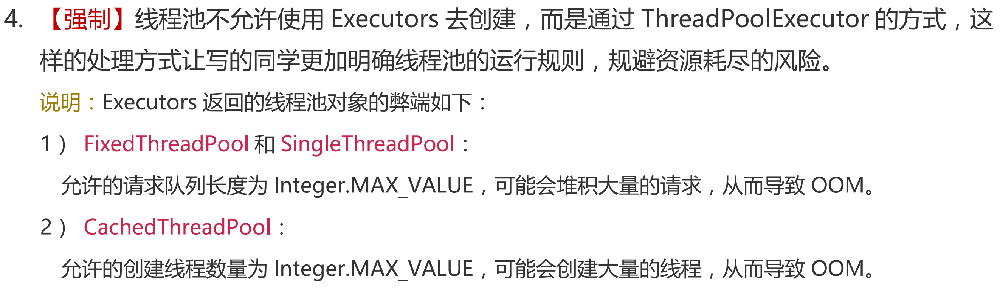
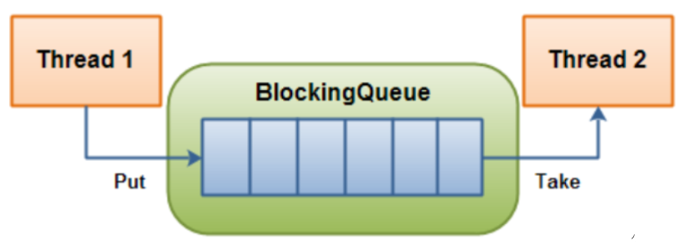
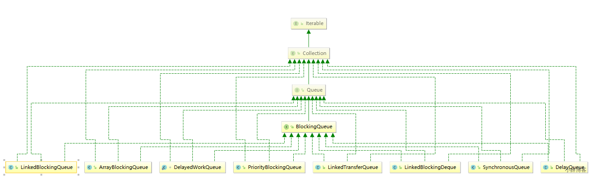
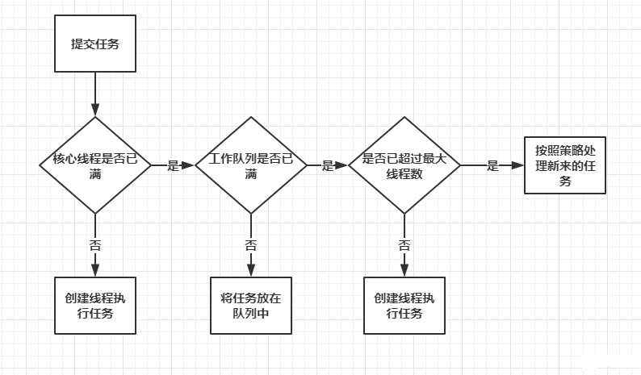

# 线程池

::: info 什么是线程池

线程池（Thread Pool）是一种用于管理和重用线程资源的技术。在程序中，创建和销毁线程是很耗时的操作，尤其在高并发或需要频繁执行小任务的场景下，频繁创建和销毁线程会显著影响性能。线程池通过提前创建一组线程，将它们放入池中进行管理，避免了频繁创建和销毁线程的开销，从而提高系统性能和资源利用率。

:::

::: tip 线程池的优势

 线程池做的工作主要是控制运行的线程数量，处理过程中将任务放入队列，然后在线程创建后启动这些任务，如果线程数量超过了最大数量，超出数量的线程排队等候，等其他线程执行完毕，再从队列中取出任务来执行。

它的主要特点为：**线程复用;控制最大并发数;管理线程。**

第一：降低资源消耗。通过重复利用已创建的线程降低线程创建和销毁造成的销耗。

第二：提高响应速度。当任务到达时，任务可以不需要等待线程创建就能立即执行。

第三：提高线程的可管理性。线程是稀缺资源，如果无限制的创建，不仅会销耗系统资源，还会降低系统的稳定性，使用线程池可以进行统一的分配，调优和监控

:::

## 线程池的三大方法

**Executors.newFixedThreadPool(int)**

> newFixedThreadPool创建的线程池corePoolSize和maximumPoolSize值是相等的，它使用的是LinkedBlockingQueue执行长期任务性能好，创建一个线程池，一池有N个固定的线程，有固定线程数的线程

```java
public static ExecutorService newFixedThreadPool(int nThreads) {
    return new ThreadPoolExecutor(nThreads, nThreads,
                                  0L, TimeUnit.MILLISECONDS,
                                  new LinkedBlockingQueue<Runnable>());
}
```

**Executors.newSingleThreadExecutor()**

> newSingleThreadExecutor 创建的线程池corePoolSize和maximumPoolSize值都是1，它使用的是LinkedBlockingQueue一个任务一个任务的执行，一池一线程

```java
public static ExecutorService newSingleThreadExecutor() {
    return new FinalizableDelegatedExecutorService
        (new ThreadPoolExecutor(1, 1,
                                0L, TimeUnit.MILLISECONDS,
                                new LinkedBlockingQueue<Runnable>()));
}
```

**Executors.newCachedThreadPool()**

> newCachedThreadPool创建的线程池将corePoolSize设置为0，将maximumPoolSize设置为Integer.MAX_VALUE，它使用的是SynchronousQueue，也就是说来了任务就创建线程运行，当线程空闲超过60秒，就销毁线程。
>
> 执行很多短期异步任务，线程池根据需要创建新线程，但在先前构建的线程可用时将重用它们。可扩容，遇强则强

```java
public static ExecutorService newCachedThreadPool() {
    return new ThreadPoolExecutor(0, Integer.MAX_VALUE,
                                  60L, TimeUnit.SECONDS,
                                  new SynchronousQueue<Runnable>());
}
```

**使用演示**

```java
public class ThreadPoolDemo {
    public static void main(String[] args) {
        ExecutorService threadPool = Executors.newSingleThreadExecutor();//单个线程
//        ExecutorService threadPool = Executors.newFixedThreadPool(5);//创建一个固定的线程池的大小
//        ExecutorService threadPool = Executors.newCachedThreadPool();//可伸缩的,遇强则强,遇弱则弱

        try {
            for (int i = 0; i < 10; i++) {
                // 使用线程池来创建
                threadPool.execute(() -> {
                    System.out.println(Thread.currentThread().getName() + " ok");
                });
            }
        } finally {
            // 线程池用完，程序结束，关闭线程池
            threadPool.shutdown();
        }
    }
}
```

单线程运行结果

```bash
pool-1-thread-1 ok
pool-1-thread-1 ok
pool-1-thread-1 ok
pool-1-thread-1 ok
pool-1-thread-1 ok
pool-1-thread-1 ok
pool-1-thread-1 ok
pool-1-thread-1 ok
pool-1-thread-1 ok
pool-1-thread-1 ok
```

固定线程池大小的运行结果

```bash
pool-1-thread-1 ok
pool-1-thread-4 ok
pool-1-thread-3 ok
pool-1-thread-3 ok
pool-1-thread-3 ok
pool-1-thread-2 ok
pool-1-thread-3 ok
pool-1-thread-4 ok
pool-1-thread-1 ok
pool-1-thread-5 ok
```

可扩展线程池运行结果

```bash
pool-1-thread-1 ok
pool-1-thread-3 ok
pool-1-thread-2 ok
pool-1-thread-5 ok
pool-1-thread-4 ok
pool-1-thread-7 ok
pool-1-thread-6 ok
pool-1-thread-8 ok
pool-1-thread-9 ok
pool-1-thread-10 ok
```

## 线程池的7大参数

**源码分析**

```java
// 本质是ThreadPoolExecutor()
public ThreadPoolExecutor(int corePoolSize, // 核心线程池大小
                          int maximumPoolSize, // 最大核心线程池大小
                          long keepAliveTime, // 超时了没有人调用就会释放
                          TimeUnit unit, // 超时单位
                          BlockingQueue<Runnable> workQueue, // 阻塞队列
                          ThreadFactory threadFactory, // 线程工厂 创建线程的 一般不用动
                          RejectedExecutionHandler handler // 拒绝策略
                         ) {
    if (corePoolSize < 0 ||
        maximumPoolSize <= 0 ||
        maximumPoolSize < corePoolSize ||
        keepAliveTime < 0)
        throw new IllegalArgumentException();
    if (workQueue == null || threadFactory == null || handler == null)
        throw new NullPointerException();
    this.acc = System.getSecurityManager() == null ?
        null :
    AccessController.getContext();
    this.corePoolSize = corePoolSize;
    this.maximumPoolSize = maximumPoolSize;
    this.workQueue = workQueue;
    this.keepAliveTime = unit.toNanos(keepAliveTime);
    this.threadFactory = threadFactory;
    this.handler = handler;
}
```

1. **corePoolSize**：核心线程大小，当提交一个任务到线程池时，线程池会创建一个线程来执行任务，即使有其他空闲线程可以处理任务也会创新线程，等到工作的线程数大于核心线程数时就不会在创建了。如果调用了线程池的`prestartAllCoreThreads`方法，线程池会提前把核心线程都创造好，并启动
2. **maximumPoolSize**：线程池允许创建的最大线程数，此值必须大于等于1。如果队列满了，并且以创建的线程数小于最大线程数，则线程池会再创建新的线程执行任务。如果我们使用了无界队列，那么所有的任务会加入队列，这个参数就没有什么效果了
3. **keepAliveTime**：多余的空闲线程的存活时间,当前池中线程数量超过corePoolSize时，当空闲时间,达到keepAliveTime时，多余线程会被销毁直到只剩下corePoolSize个线程为止，如果任务很多，并且每个任务的执行时间比较短，避免线程重复创建和回收，可以调大这个时间，提高线程的利用率
4. **unit**：keepAliveTIme的时间单位，可以选择的单位有天、小时、分钟、毫秒、微妙、千分之一毫秒和纳秒。类型是一个枚举`java.util.concurrent.TimeUnit`，这个枚举也经常使用
5. **workQueue**：任务队列，被提交但尚未被执行的任务，用于缓存待处理任务的阻塞队列
6. **threadFactory**：表示生成线程池中工作线程的线程工厂，用于创建线程，一般默认的即可，可以通过线程工厂给每个创建出来的线程设置更有意义的名字
7. **handler**：拒绝策略，表示当队列满了，并且工作线程大于等于线程池的最大线程数（maximumPoolSize）时如何来拒绝请求执行的runnable的策略

::: warning 手动创建线程池

查看阿里巴巴公约规范发现规约以上三种方式都不好用, 要手动创建线程池



:::

### 线程池的四种拒绝策略

 等待队列已经排满了，再也塞不下新任务了，同时，线程池中的max线程也达到了，无法继续为新任务服务。这个是时候我们就需要拒绝策略机制合理的处理这个问题。

**AbortPolicy**(默认)：直接抛出RejectedExecutionException异常阻止系统正常运行

**CallerRunsPolicy**：“调用者运行”一种调节机制，该策略既不会抛弃任务，也不会抛出异常，而是将某些任务回退到调用者，从而降低新任务的流量。

**DiscardOldestPolicy**：抛弃队列中等待最久的任务，然后把当前任务加入队列中尝试再次提交当前任务。

**DiscardPolicy**：该策略默默地丢弃无法处理的任务，不予任何处理也不抛出异常。如果允许任务丢失，这是最好的一种策略。

```java
public class ThreadPoolDemo {
    public static void main(String[] args) {
        /*
         * 自定义线程池
         * 最大承载量(队列满了) = Deque + maximumPoolSize
         *
         * 四种拒绝策略
         * new ThreadPoolExecutor.AbortPolicy() // 队列满了抛出异常 RejectedExecutionException
         * new ThreadPoolExecutor.CallerRunsPolicy() // 哪里来的去哪里
         * new ThreadPoolExecutor.DiscardPolicy() // 队列满了不会抛出异常,会丢掉任务
         * new ThreadPoolExecutor.DiscardOldestPolicy() //队列满了尝试和最早的竞争,也不会抛出异常
         *
         * 最大线程(maximumPoolSize)如何设置
         * 1. CPU 密集型 设置为当前电脑最大核心数 Runtime.getRuntime().availableProcessors();
         * 2. IO 密集型 设置为最大任务的2倍
         */ 
        ExecutorService threadPool = new ThreadPoolExecutor(
                2,
                Runtime.getRuntime().availableProcessors(),
                3,
                TimeUnit.SECONDS,
                new LinkedBlockingDeque<>(3),
                Executors.defaultThreadFactory(),
                new ThreadPoolExecutor.DiscardOldestPolicy()
        );


        try {
            for (int i = 0; i < 20; i++) {
                // 使用线程池来创建
                threadPool.execute(() -> {
                    System.out.println(Thread.currentThread().getName() + " ok");
                });
            }
        } finally {
            // 线程池用完，程序结束，关闭线程池
            threadPool.shutdown();
        }
    }
}
```

### 线程池的阻塞队列



线程1往阻塞队列里添加元素，线程2从阻塞队列里移除元素

当队列是空的，从队列中获取元素的操作将会被阻塞

当队列是满的，从队列中添加元素的操作将会被阻塞

试图从空的队列中获取元素的线程将会被阻塞，直到其他线程往空的队列插入新的元素

试图向已满的队列中添加新元素的线程将会被阻塞，直到其他线程从队列中移除一个或多个元素或者完全清空，使队列变得空闲起来并后续新增



<h3>种类分析</h3>

**ArrayBlockingQueue**：是一个基于数组结构的有界阻塞队列，此队列按照先进先出原则对元素进行排序

**LinkedBlockingQueue**：由链表结构组成的有界（但大小默认值为integer.MAX_VALUE）阻塞队列，此队列按照先进先出排序元素，吞吐量通常要高于ArrayBlockingQueue。静态工厂方法`Executors.newFixedThreadPool`使用了这个队列。

PriorityBlockingQueue：支持优先级排序的无界阻塞队列。

DelayQueue：使用优先级队列实现的延迟无界阻塞队列。

**SynchronousQueue**：不存储元素的阻塞队列，也即单个元素的队列,每个插入操作必须等到另外一个线程调用移除操作，否则插入操作一直处理阻塞状态，吞吐量通常要高于LinkedBlockingQueue，静态工厂方法`Executors.newCachedThreadPool`使用这个队列

LinkedTransferQueue：由链表组成的无界阻塞队列。

LinkedBlockingDeque：由链表组成的双向阻塞队列。

<h3>BlockingQueue核心方法</h3>

| 方式         | 抛出异常  | 有返回值，不抛出异常 | 阻塞 等待 | 超时等待 |
| :----------- | :-------- | :------------------- | :-------- | :------- |
| 添加         | add()     | offer()               | put()     | offer(,,) |
| 移除         | remov()   | poll()               | take()    | poll(,)  |
| 检测队首元素 | element() | peek()               | -         | -        |

**抛出异常**

```java
@Test
public void test1() {
    // 队列的大小
    ArrayBlockingQueue<String> blockingQueue = new ArrayBlockingQueue<>(3);

    System.out.println(blockingQueue.add("a"));
    System.out.println(blockingQueue.add("b"));
    System.out.println(blockingQueue.add("c"));
    // IllegalStateException: Queue full 抛出异常！
    // System.out.println(blockingQueue.add("d"));

    System.out.println(blockingQueue.remove());
    System.out.println(blockingQueue.remove());
    System.out.println(blockingQueue.remove());

    // java.util.NoSuchElementException 抛出异常！
    // System.out.println(blockingQueue.remove());
}
```

**不抛出异常**

```java
@Test
public void test2() {
    // 队列的大小
    ArrayBlockingQueue<String> blockingQueue = new ArrayBlockingQueue<>(3);

    System.out.println(blockingQueue.offer("a"));// true
    System.out.println(blockingQueue.offer("b"));// true
    System.out.println(blockingQueue.offer("c"));// true
    System.out.println(blockingQueue.offer("d"));// false 不抛异常

    System.out.println(blockingQueue.poll());// a
    System.out.println(blockingQueue.poll());// b
    System.out.println(blockingQueue.poll());// c
    System.out.println(blockingQueue.poll());// null 不抛异常
}
```

**阻塞 等待**

```java
@Test
public void test03() throws InterruptedException {
    ArrayBlockingQueue<String> blockingQueue = new ArrayBlockingQueue<>(3);
    blockingQueue.put("a");
    blockingQueue.put("b");
    blockingQueue.put("c");
    // blockingQueue.put("d");// 队列没有位置了，一直阻塞

    blockingQueue.take();
    blockingQueue.take();
    blockingQueue.take();
    // blockingQueue.take();// 没有这个元素，一直阻塞
}
```

**等待，阻塞(等待超时)**

```java
@Test
public void test04() throws InterruptedException {
    // 队列的大小
    ArrayBlockingQueue<String> blockingQueue = new ArrayBlockingQueue<>(3);

    blockingQueue.offer("a");
    blockingQueue.offer("b");
    blockingQueue.offer("c");
    // blockingQueue.offer("d", 2, TimeUnit.SECONDS); // 等待超过2秒就退出
    System.out.println(blockingQueue.poll());
    System.out.println(blockingQueue.poll());
    System.out.println(blockingQueue.poll());
    blockingQueue.poll(2, TimeUnit.SECONDS); // 等待超过2秒就退出
}
```

<h3>SynchronousQueue 同步队列</h3>

::: info 概述
一个特殊的阻塞队列，它的容量始终为1，用于实现线程间的直接传递。

和其他的BlockingQueue 不一样， SynchronousQueue 不存储元素

put了一个元素，必须从里面先take取出来，否则不能再put进去值！
:::

```java
public class SynchronousQueueDemo {
    public static void main(String[] args) {
        BlockingQueue<String> blockingQueue = new SynchronousQueue<>(); // 同步队列

        new Thread(() -> {
            try {
                TimeUnit.SECONDS.sleep(3);
                System.out.println(Thread.currentThread().getName() + "=>" + blockingQueue.take());

                TimeUnit.SECONDS.sleep(3);
                System.out.println(Thread.currentThread().getName() + "=>" + blockingQueue.take());

                TimeUnit.SECONDS.sleep(3);
                System.out.println(Thread.currentThread().getName() + "=>" + blockingQueue.take());
            } catch (InterruptedException e) {
                e.printStackTrace();
            }
        }, "T2").start();

        new Thread(() -> {
            try {
                System.out.println(Thread.currentThread().getName() + " put 1");
                blockingQueue.put("1");
                System.out.println(Thread.currentThread().getName() + " put 2");
                blockingQueue.put("2");
                System.out.println(Thread.currentThread().getName() + " put 3");
                blockingQueue.put("3");
            } catch (InterruptedException e) {
                e.printStackTrace();
            }
        }, "T1").start();

    }
}
```

结果如下

```
T1 put 1
T2=>1
T1 put 2
T2=>2
T1 put 3
T2=>3
```

## ThreadPoolExecutor底层原理



## 线程池中的2个关闭方法

线程池提供了2个关闭方法：`shutdown()`和`shutdownNow()`，当调用者两个方法之后，线程池会遍历内部的工作线程，然后调用每个工作线程的interrrupt方法给线程发送中断信号，内部如果无法响应中断信号的可能永远无法终止，所以如果内部有无线循环的，最好在循环内部检测一下线程的中断信号，合理的退出。调用者两个方法中任意一个，线程池的`isShutdown`方法就会返回true，当所有的任务线程都关闭之后，才表示线程池关闭成功，这时调用`isTerminaed`方法会返回true。

调用`shutdown`方法之后，线程池将不再接口新任务，内部会将所有已提交的任务处理完毕，处理完毕之后，工作线程自动退出。

而调用`shutdownNow`方法后，线程池会将还未处理的（在队里等待处理的任务）任务移除，将正在处理中的处理完毕之后，工作线程自动退出。

至于调用哪个方法来关闭线程，应该由提交到线程池的任务特性决定，多数情况下调用`shutdown`方法来关闭线程池，如果任务不一定要执行完，则可以调用`shutdownNow`方法。

任务类

```java
@Getter
public static class Task implements Runnable {
    String name = "";

    public Task(int i) {
        name = "task-" + i;
    }

    @Override
    public void run() {
        try {
            TimeUnit.SECONDS.sleep(2);
            System.out.println("sleep completed, " + getName());
        } catch (InterruptedException e) {
            e.printStackTrace();
            System.out.println("interrupted," + getName());
            return;
        }
        System.out.println(getName() + " finished\n");
    }
}
```

shutdown()

> 第6个任务开始及以后的任务都被拒绝了，之前的任务正常执行。
>
> 所以 shutdown 方法将线程池状态置为 SHUTDOWN，线程池并不会立即停止，要等正在执行和队列里等待的任务执行完才会停止。	

```java
private static void shutdownTest() {
    ExecutorService threadPool = Executors.newSingleThreadExecutor();
    // 提交第6个任务时执行shutdown
    for (int i = 1; i <= 10; i++) {
        System.out.printf("第:%d次提交\n", i);
        threadPool.execute(new Task(i));
        if (i == 5) {
            threadPool.shutdown();
        }
    }
}
```

结果

```
第:1次提交
第:2次提交
第:3次提交
第:4次提交
第:5次提交
第:6次提交
Exception in thread "main" java.util.concurrent.RejectedExecutionException: Task 
...

sleep completed, task-1
task-1 finished

sleep completed, task-2
task-2 finished

sleep completed, task-3
task-3 finished

sleep completed, task-4
task-4 finished

sleep completed, task-5
task-5 finished
```

shutdownNow()

> 调用 shutdownNow 后，第一个任务正在睡眠的时候，触发了 interrupt 中断，
>
> 之前等待的任务2-5被从队列中清除并返回，之后的任务6-10被拒绝
>
> 但 shutdownNow 方法将线程池状态置为 STOP，视图让线程池立即停止，
>
> 但不一定能保证立即停止，要等所有正在执行的任务(不能被interrupt中断的任务)执行完才能停止

```java
private static void shutdownNowTest() {
    ExecutorService threadPool = Executors.newSingleThreadExecutor();
    // 提交第6个任务时执行shutdown
    for (int i = 1; i <= 10; i++) {
        try {
            threadPool.execute(new Task(i));
        } catch (RejectedExecutionException e) {
            System.out.println("rejected,task-" + i);
        }
        if (i == 5) {
            List<Runnable> tasks = threadPool.shutdownNow();
            for (Runnable task : tasks) {
                if (task instanceof Task) {
                    System.out.println("waiting task:" + ((Task) task).getName());
                }
            }

        }
    }
}
```

结果

```
waiting task:task-2
waiting task:task-3
waiting task:task-4
waiting task:task-5
interrupted,task-1
rejected,task-6
rejected,task-7
rejected,task-8
rejected,task-9
rejected,task-10
```

## 线程池的三种提交方式

**submit(()->{})**

> 会吞掉异常

```java
private static void defaultSubmit() {
        ExecutorService threadPool = Executors.newFixedThreadPool(2);
        // 默认调用,submit会吞掉异常
        try {
            threadPool.submit(() -> {
                System.out.println(Thread.currentThread().getName() + "\t进入池中submit方法");
                for (int i = 1; i <= 4; i++) {
                    if (i == 3) {
                        int a = 10 / 0;
                    }
                    ;
                    System.out.println("---come in execute:" + i);
                }
                System.out.println(Thread.currentThread().getName() + "\t进入池中submit方法---end");
            });
        } catch (Exception e) {
            e.printStackTrace();
        } finally {
            threadPool.shutdown();
        }
    }
```

**submit(()->{}).get()**

> submit执行后,如果get方法调用想要获得返回值,会抛出异常

```java
private static void defaultSubmitAndGet() {
    ExecutorService threadPool = Executors.newFixedThreadPool(2);
    try {
        Future<?> result = threadPool.submit(() -> {
            System.out.println(Thread.currentThread().getName() + "\t进入池中submit方法");
            int a = 10 / 0;
            System.out.println(Thread.currentThread().getName() + "\t进入池中submit方法---end");
        });
        result.get();// 如果没有这一行,异常被吞
    } catch (Exception e) {
        e.printStackTrace();
    } finally {
        threadPool.shutdown();
    }
}
```

**execute(()->{})**

> 默认会抛出异常

```java
private static void defaultExecute() {
    ExecutorService threadPool = Executors.newFixedThreadPool(2);
    try {
        threadPool.execute(() -> {
            System.out.println(Thread.currentThread().getName() + "\t进入池中execute方法");
            for (int i = 1; i <= 4; i++) {
                if (i == 3) {
                    int a = 10 / 0;
                }
                ;
                System.out.println("---come in execute:" + i);
            }
            System.out.println(Thread.currentThread().getName() + "\t进入池中execute方法---end");
        });
    } catch (Exception e) {
        e.printStackTrace();
    } finally {
        threadPool.shutdown();
    }
}
```

**能处理异常的线程池**

```java
private static ThreadPoolExecutor handleExceptionPool() {
      return new ThreadPoolExecutor(
              Runtime.getRuntime().availableProcessors(),
              Runtime.getRuntime().availableProcessors() * 2,
              1L,
              TimeUnit.SECONDS,
              new LinkedBlockingQueue<>(100)) {
          @Override
          protected void afterExecute(Runnable r, Throwable t) {
              // execute运行
              if (t != null) {
                  log.error(t.getMessage(), t);
              }
              // submit运行
              if (t == null && r instanceof Future<?>) {
                  try {
                      Future<?> future = (Future<?>) r;
                      if (future.isDone()){
                          future.get();
                      }
                  }catch (CancellationException ce){
                      t = ce;
                  } catch (ExecutionException | InterruptedException e) {
                      e.printStackTrace();
                  }
              }
          }
      };
  }
```

