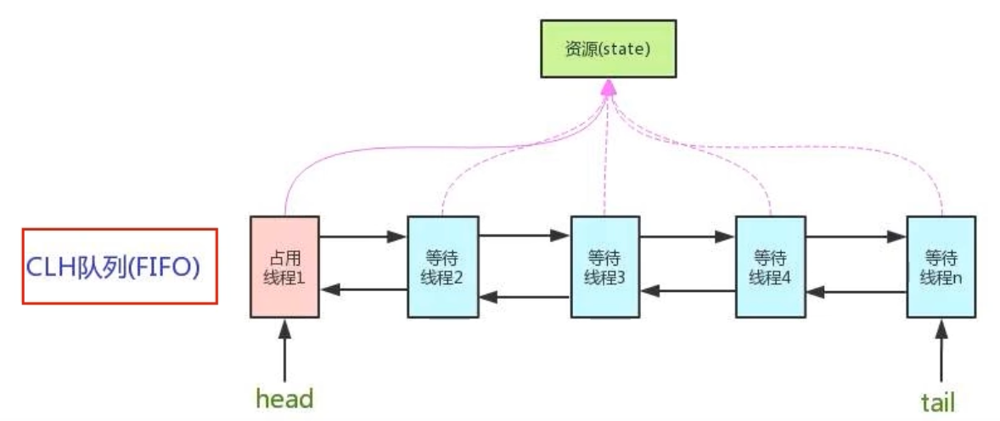
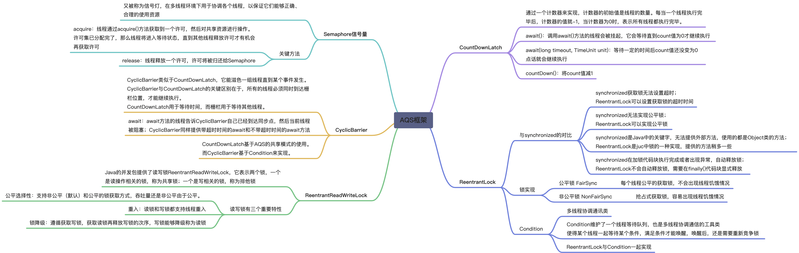
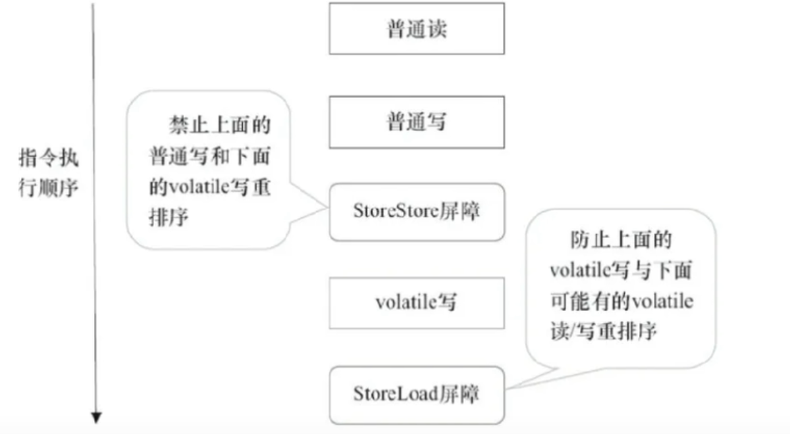
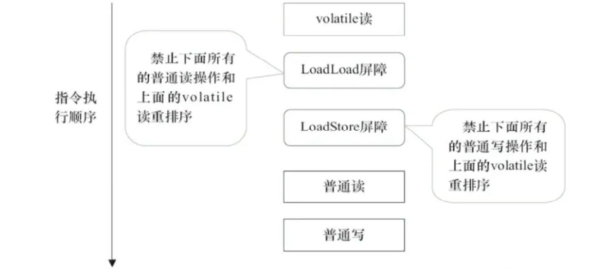

## AQS

> 是用来实现锁或者其它同步器组件的公共基础部分的抽象实现，是<span style="color:red;font-style:italic">重量级基础框架及整个JUC体系的基石，主要用于解决锁分配给谁的问题</span>
>
> Provides a framework for implementing blocking locks and related synchronizers (semaphores, events, etc) that rely on first-in-first-out (FIFO) wait queues.  This class is designed to be a useful basis for most kinds of synchronizers that rely on a single atomic {@code int} value to represent state. Subclasses must define the protected methods that change this state, and which define what that state means in terms of this object being acquired or released.  Given these, the other methods in this class carry out all queuing and blocking mechanics. Subclasses can maintain other state fields, but only the atomically updated {@code int} value manipulated using methods {@link #getState}, {@link #setState} and {@link #compareAndSetState} is tracked with respect to synchronization.
>
> 翻译：提供了一个用于实现阻塞锁及相关同步器（信号量、事件等）的框架，这些同步器依赖于先进先出（FIFO）等待队列。该类旨在为大多数依赖单个原子性 {@code int} 值表示状态的同步器提供一个有用的基础。子类必须定义用于更改该状态的受保护方法，并定义该状态在对象获取或释放时的含义。在此基础上，该类中的其他方法负责所有排队和阻塞机制。子类可以维护其他状态字段，但只有通过 {@link #getState}、{@link #setState} 和 {@link #compareAndSetState} 方法原子性更新的 {@code int} 值会被同步跟踪。

抢到资源的线程直接使用处理业务，抢不到资源的必然涉及一种<span style="color:red">排队等候机制</span>。抢占资源失败的线程继续去等待，但等候线程仍然保留获取锁的可能且获取锁流程仍在继续。

如果共享资源被占用，<span style="color:blue">就需要一定的阻塞等待唤醒机制来保证锁分配</span>。这个机制主要用的是CLH队列的变体实现的，将暂时获取不到锁的线程加入到队列中，这个队列就是AQS同步队列的抽象表现。它将要请求共享资源的线程及自身的等待状态封装成队列的节点对象(<span style="color:red;font-weight:bold">Node</span>)，通过CAS、自旋以及`LockSupport.park()`的方式，维护state变量的状态，是并发达到同步的效果。






## 辅助工具类

### Semaphore 信号量
::: info 概述
Java编程语言中的一个同步工具，用于控制对共享资源的访问权限。它可以用于限制同时访问某个资源的线程数量，从而实现对资源的并发访问控制。

Semaphore的主要作用是维护一个计数器，表示可用的许可数量。线程在访问资源之前需要获得许可，如果还有可用的许可，则线程可以获得许可并继续执行；如果没有可用许可，则线程需要等待直到有许可可用。
:::

```java
public class SemaphoreDemo {
    public static void main(String[] args) {
        //例子:抢车位
        //线程数量: 停车位 
        Semaphore semaphore = new Semaphore(3);
        //共有6辆车
        for (int i = 0; i < 6; i++) {
            new Thread(() -> {
                try {
                    semaphore.acquire();//得到
                    System.out.println(Thread.currentThread().getName() + "抢到车位");
                    TimeUnit.SECONDS.sleep(2);
                    System.out.println(Thread.currentThread().getName() + "离开车位");
                } catch (InterruptedException e) {
                    e.printStackTrace();
                } finally {
                    semaphore.release();//释放
                }
            }).start();
        }
    }
}
```
结果如下
```java
Thread-0抢到车位
Thread-2抢到车位
Thread-1抢到车位
Thread-1离开车位
Thread-0离开车位
Thread-4抢到车位
Thread-2离开车位
Thread-3抢到车位
Thread-5抢到车位
Thread-5离开车位
Thread-4离开车位
Thread-3离开车位
```
### CyclicBarrier 循环屏障
::: info 概述
Java编程语言中的一个同步辅助类，用于在多线程编程中实现多个线程的同步。它的主要作用是让一组线程等待彼此达到一个共同的屏障点，然后在达到屏障点时同时继续执行。
:::

```java
public static void main(String[] args) {
    //例子:集齐7颗龙珠召唤神龙
    CyclicBarrier cyclicBarrier = new CyclicBarrier(7, () -> {
        System.out.println("召唤神龙");
    });

    for (int i = 1; i <= 7; i++) {
        //lambda不能操作 i ,所以定义 final temp
        final int temp = i;
        new Thread(() -> {
            System.out.println(Thread.currentThread().getName() + "收集第" + temp + "颗龙珠");
            try {
                cyclicBarrier.await();//等待集齐龙珠
            } catch (InterruptedException | BrokenBarrierException e) {
                e.printStackTrace();
            }
        }).start();
    }
}
```
结果如下
```
Thread-0收集第1颗龙珠
Thread-6收集第7颗龙珠
Thread-3收集第4颗龙珠
Thread-4收集第5颗龙珠
Thread-1收集第2颗龙珠
Thread-2收集第3颗龙珠
Thread-5收集第6颗龙珠
召唤神龙
```
### CountDownLatch 倒计时门闩
::: info 概述
Java编程语言中的一个同步辅助类，用于在多线程编程中实现一个或多个线程等待其他线程的操作完成。它的主要作用是允许一个或多个线程等待一组操作的完成。
:::

```java
/**
 * 线程减法计数器
 */
public class CountDownLatchDemo {
    public static void main(String[] args) throws InterruptedException {
        //例子 所有人出门后才能关门
        CountDownLatch countDownLatch = new CountDownLatch(6);//设置6个人
        for (int i = 1; i <= 6; i++) {
            new Thread(() -> {
                System.out.println(Thread.currentThread().getName() + "号出门了");
                countDownLatch.countDown();//数量-1
            }, String.valueOf(i)).start();
        }
        //等待计数器归零,再往下执行
        countDownLatch.await();
        //线程执行速度不一样 有的快有的慢 部分业务需要等所有线程结束后才能再处理后面的逻辑 此时 就需要 countDownLatch
        System.out.println("关门");
    }
}
```
结果如下
```
1号出门了
3号出门了
4号出门了
2号出门了
5号出门了
6号出门了
关门
```
## 其他
### ForkJoin
::: info 概述
Java编程语言中的一个并发框架，用于高效地处理递归的任务分割和合并操作。
:::

```java
/**
 * 计算从1到10_0000_0000的和
 */
public class ForkJoinDemo {

    /**
     * 普通的方法
     */
    @Test
    public void sum1() {
        long start = System.currentTimeMillis();
        long sum = 0L;
        for (int i = 0; i <= 10_0000_0000; i++) {
            sum += i;
        }
        System.out.println(sum);
        System.out.println(System.currentTimeMillis() - start);//277
    }

    /**
     * 使用并行流(最快)
     */
    @Test
    public void sum2() {
        long start = System.currentTimeMillis();
        long sum = LongStream.rangeClosed(0L, 10_0000_0000L).parallel().reduce(0, Long::sum);
        System.out.println(sum);
        System.out.println(System.currentTimeMillis() - start);//161
    }

    /**
     * 使用 ForkJoin 的方法
     */
    @Test
    public void sum3() throws ExecutionException, InterruptedException {
        long start = System.currentTimeMillis();

        ForkJoinPool forkJoinPool = new ForkJoinPool();
        ForkJoinSum task = new ForkJoinSum(0L, 10_0000_0000L);
        ForkJoinTask<Long> submit = forkJoinPool.submit(task);
        long sum = submit.get();

        System.out.println(sum);
        System.out.println(System.currentTimeMillis() - start);// 188
    }

    public static class ForkJoinSum extends RecursiveTask<Long> {

        private final long start;
        private final long end;

        public ForkJoinSum(long start, long end) {
            this.start = start;
            this.end = end;
        }

        // 计算方法
        @Override
        protected Long compute() {
            // 临界值
            long temp = 100000L;
            if ((end - start) < temp) {
                long sum = 0L;
                for (long i = start; i <= end; i++) {
                    sum += i;
                }
                return sum;
            } else { // forkJoin 递归
                long middle = (start + end) / 2; // 中间值
                ForkJoinSum task1 = new ForkJoinSum(start, middle);
                task1.fork(); // 拆分任务，把任务压入线程队列
                ForkJoinSum task2 = new ForkJoinSum(middle + 1, end);
                task2.fork(); // 拆分任务，把任务压入线程队列
                return task1.join() + task2.join();
            }
        }
    }
}
```
### CompletableFuture

> CompletableFuture 是 Java 8 引入的一种用于异步编程的类，它实现了 Future 接口，并提供了许多功能来简化异步编程。
>
> CompletableFuture 没有指定Executor方法时，直接使用默认的ForkJoinPool.commonPool()作为它的线程池执行异步代码。

**没有返回值的 runAsync 异步调用**

```java
@Test
@SneakyThrows
public void voidTest() {
    CompletableFuture<Void> completableFuture = CompletableFuture.runAsync(() -> {
        ThreadUtils.sleep(1);
        // ForkJoinPool.commonPool-worker-1runAsync=>Void
        System.out.println(Thread.currentThread().getName() + "runAsync=>Void");
    });
    System.out.println("程序执行中...");
    completableFuture.get();
    // 和 get()方法几乎一致,但不会抛异常
    // completableFuture.join();
}
```
**使用线程池的没有返回值的 runAsync 异步调用**
```java
@Test
@SneakyThrows
public void voidPoolTest() {
    ExecutorService pool = Executors.newFixedThreadPool(3);
    CompletableFuture<Void> completableFuture = CompletableFuture.runAsync(() -> {
        ThreadUtils.sleep(1);
        // pool-1-thread-1runAsync=>Void
        System.out.println(Thread.currentThread().getName() + "runAsync=>Void");
    }, pool);
    System.out.println("程序执行中...");
    completableFuture.get();
    // 线程池记得要关闭
    pool.shutdown();
}
```
**使用线程池的 有返回值的 supplyAsync 异步调用**
```java
@Test
public void returnTest() {
    ExecutorService pool = Executors.newFixedThreadPool(3);
    try {
        CompletableFuture<Integer> completableFuture = CompletableFuture.supplyAsync(() -> {

            ThreadUtils.sleep(1);

            int result = ThreadLocalRandom.current().nextInt(10);
            System.out.println("结果计算完成:" + result);
            if (result < 2) {
                int i = 1 / 0;
            }
            return result;
        }, pool);

        System.out.println("主线程 main 忙其他任务...");

        //和 ES6 的 Promise类似
        completableFuture.whenComplete((t, u) -> {
            System.out.println("t = " + t);// 程序正常执行:t = 3~10 出异常:t = null
            System.out.println("u = " + u);// 程序正常执行:u = null 出异常:u = ...(异常信息) / by zero
        }).exceptionally((e) -> {
                    System.out.println(e.getMessage());//java.lang.ArithmeticException: / by zero
                    return 0;
                }
        ).get();
    } catch (Exception ignored) {
    } finally {
        pool.shutdown();
    }

}
```
**获得结果和触发计算**

```java
@Test
public void apiTest1() {
    CompletableFuture<String> completableFuture = CompletableFuture.supplyAsync(() -> {
        try {
            TimeUnit.SECONDS.sleep(1);
        } catch (InterruptedException ignored) {
        }
        return "hello";
    });
    String getNow = completableFuture.getNow("world");// 立即获取结果,如果计算未完成则得到传入的值
    System.out.println(getNow);// world

    boolean complete = completableFuture.complete("completeValue");// 是否打断get方法立即返回传入的值
    System.out.println(complete);// true
    System.out.println(completableFuture.join());// completeValue
}
```
**对计算结果进行处理**
```java
@Test
public void apiTest2() {
    CompletableFuture.supplyAsync(() -> {
        ThreadUtils.sleep(1);
        System.out.println("step 1");
        return 1;
    }).handle((f, e) -> {// handle 碰到异常会直接走到 whenComplete
        int i = 1 / 0;
        System.out.println("step 2");
        return f + 2;
    }).thenApply(f -> {// thenApply 碰到异常会直接中断
        System.out.println("step 3");
        return f + 3;
    }).whenComplete((v, e) -> {
        System.out.println("step 4");
        if (e == null) {
            System.out.println(v);
        }
    }).exceptionally(e -> {
        System.out.println(e.getMessage());
        return null;
    });
    System.out.println(Thread.currentThread().getName() + "主线程忙其他任务了");
    // 主线程不要立即结束,否则completableFuture默认使用的线程池会立即关闭
    ThreadUtils.sleep(2);
}
```
**对计算结果进行消费**
```java
@Test
public void apiTest3() {
    CompletableFuture.supplyAsync(() -> 1)
            .thenApply(f -> f + 2)
            .thenApply(f -> f + 3)
            .thenAccept(System.out::println);// 直接对结果进行消费

    // thenRun(Runnable action) 任务A执行完执行B,并且B不需要A的结果
    System.out.println(CompletableFuture.supplyAsync(() -> "hello").thenRun(() -> {
    }).join());// null
    // thenAccept(Consumer<? super T> action) 任务A执行完执行B,B需要A的结果,但是任务B无返回值
    System.out.println(CompletableFuture.supplyAsync(() -> "hello").thenAccept(System.out::println).join());// hello \r null
    // thenApply(Function<? super T,? extends U> fn) 任务A执行完执行B,B需要A的结果,同时任务B有返回值
    System.out.println(CompletableFuture.supplyAsync(() -> "hello").thenApply(r -> r + " world").join());// hello world
}
```
**对计算速度选用**
```java
@Test
public void apiTest4() {
    CompletableFuture<String> a = CompletableFuture.supplyAsync(() -> {
        System.out.println("a come in");
        try {
            TimeUnit.SECONDS.sleep(2);
        } catch (InterruptedException ignored) {
        }
        return "a";
    });
    CompletableFuture<String> b = CompletableFuture.supplyAsync(() -> {
        System.out.println("b come in");
        try {
            TimeUnit.SECONDS.sleep(3);
        } catch (InterruptedException ignored) {
        }
        return "b";
    });
    CompletableFuture<String> result = a.applyToEither(b, f -> f + " is winner");
    System.out.println(result.join());// a is winner
}
```
**对计算结果合并**
```java
@Test
public void apiTest5() {
    CompletableFuture<Integer> c1 = CompletableFuture.supplyAsync(() -> {
        System.out.println(Thread.currentThread().getName() + "\t 启动");
        ThreadUtils.sleep(2);
        return 10;
    });
    CompletableFuture<Integer> c2 = CompletableFuture.supplyAsync(() -> {
        System.out.println(Thread.currentThread().getName() + "\t 启动");
        ThreadUtils.sleep(1);
        return 20;
    });
    // 合并两个结果 (x, y) -> x + y
    CompletableFuture<Integer> result = c1.thenCombine(c2, Integer::sum);
    System.out.println(result.join());// 30
}
```
**统筹安排**

```java
@Test
public void apiTest6() {
    long start = System.currentTimeMillis();
    CompletableFuture<Void> c1 = CompletableFuture.runAsync(() -> {
        System.out.println(Thread.currentThread().getName() + "\t 启动");
        ThreadUtils.sleep(2);
        System.out.println(Thread.currentThread().getName() + "\t 完成执行");
    });
    CompletableFuture<Void> c2 = CompletableFuture.runAsync(() -> {
        System.out.println(Thread.currentThread().getName() + "\t 启动");
        ThreadUtils.sleep(1);
        System.out.println(Thread.currentThread().getName() + "\t 完成执行");
    });
    CompletableFuture<Void> c3 = CompletableFuture.runAsync(() -> {
        System.out.println(Thread.currentThread().getName() + "\t 启动");
        ThreadUtils.sleep(3);
        System.out.println(Thread.currentThread().getName() + "\t 完成执行");
    });
    // 等所有任务完成
    CompletableFuture.allOf(c1, c2, c3).join();
    long end = System.currentTimeMillis();
    System.out.println("所有任务完成");
    System.out.println("耗时: " + (end - start));
}
```

**案例**

```java
@Test
public void demoTest() {
    long start = System.currentTimeMillis();
    List<String> list = getPrice(netMallList);
    list.forEach(System.out::println);
    long end = System.currentTimeMillis();
    System.out.println("耗时" + (end - start));

    long start2 = System.currentTimeMillis();
    List<String> list2 = getPriceByCompletableFuture(netMallList);
    list2.forEach(System.out::println);
    long end2 = System.currentTimeMillis();
    System.out.println("耗时" + (end2 - start2));
}

/** 常规方案 */
public static List<String> getPrice(List<NetMall> list) {
    return list.stream()
      .map(x -> String.format("%s的价格为:%.2f", x.getNetMallName(),x.calcPrice()))
      .collect(Collectors.toList());
}

/** 异步方案 */
public static List<String> getPriceByCompletableFuture(List<NetMall> list) {
    return list.stream()
            .map(x -> CompletableFuture.supplyAsync(() -> String.format("%s的价格为:%.2f", x.getNetMallName(), x.calcPrice())))
            .toList()
            .stream()
            .map(CompletableFuture::join)
            .collect(Collectors.toList())
            ;

}

/** 网点集合 */
static List<NetMall> netMallList = List.of(
        new NetMall("jd"),
        new NetMall("tb"),
        new NetMall("pdd"),
        new NetMall("dd")
);


@Getter
@AllArgsConstructor
public static class NetMall {
    private String netMallName;

    public double calcPrice() {
        ThreadUtils.sleep(1);
        return ThreadLocalRandom.current().nextDouble() * 100;
    }
}
```
### Reference
> 强软弱虚引用测试及说明

测试对象
```java
public class MyObject {
    // 一般开发中不用调用这个方法，本次只是为了演示
    @Override
    protected void finalize() throws Throwable {
        System.out.println("finalize method invoked");
    }
}
```
**强引用**
::: info 概述
当内存不足，JVM开始垃圾回收，对于强引用的对象，就算是出现了OOM也不会对该对象进行回收，死都不收。
:::

```java
@Test
public void strongReferenceTest() {
    MyObject myObject = new MyObject();
    System.out.println("-----gc before: " + myObject);

    // myObject = null; // 赋值为null时,可以被gc回收
    System.gc();
    ThreadUtils.sleep(1);

    System.out.println("-----gc after: " + myObject);
}
```
**软引用**
::: info 概述
对于只有软引用的对象来说

当系统内存充足时它 不会 被回收

当系统内存不足时它 会 被回收

软引用通常用在对内存敏感的程序中，比如高速缓存就有用到软引用，内存够用的时候就保留，不够用就回收！
:::

```java
@Test
public void softReferenceTest() {
    //当我们内存不够用的时候，soft会被回收的情况，设置我们的内存大小：-Xms10m -Xmx10m
    SoftReference<MyObject> softReference = new SoftReference<>(new MyObject());

    System.gc();
    ThreadUtils.sleep(1);
    System.out.println("-----gc after内存够用: " + softReference.get());

    try {
        byte[] bytes = new byte[10 * 1024 * 1024];
    } catch (Exception e) {
        e.printStackTrace();
    } finally {
        System.out.println("-----gc after内存不够: " + softReference.get());
    }
}
```
**弱引用**
::: info 概述
只要垃圾回收机制一运行，不管JVM的内存空间是否足够，都会回收该对象占用的内存。
:::

```java
@Test
public void weekReferenceTest() {
    WeakReference<MyObject> weakReference = new WeakReference<>(new MyObject());
    System.out.println("-----gc before内存够用: " + weakReference.get());

    System.gc();
    ThreadUtils.sleep(1);

    System.out.println("-----gc after内存够用: " + weakReference.get());
}
```
**虚引用**
::: info 概述
虚引用需要java.lang.ref.PhantomReference类来实现。

顾名思义，就是形同虚设，与其他几种引用都不同，虚引用并不会决定对象的生命周期。如果一个对象仅持有虚引用，那么它就和没有任何引用一样，在任何时候都可能被垃圾回收器回收，它不能单独使用也不能通过它访问对象，虚引用必须和引用队列 (ReferenceQueue)联合使用。

虚引用的主要作用是跟踪对象被垃圾回收的状态。 仅仅是提供了一种确保对象被 finalize以后，做某些事情的机制。PhantomReference的get方法总是返回null，因此无法访问对应的引用对象。

其意义在于：说明一个对象已经进入finalization阶段，可以被gc回收，用来实现比finalization机制更灵活的回收操作。

换句话说，设置虚引用关联的唯一目的，就是在这个对象被收集器回收的时候收到一个系统通知或者后续添加进一步的处理。
:::

```java
@Test
public void phantomReferenceTest() {
    ReferenceQueue<MyObject> referenceQueue = new ReferenceQueue<>();
    PhantomReference<MyObject> phantomReference = new PhantomReference<>(new MyObject(), referenceQueue);
    // System.out.println(phantomReference.get());

    List<byte[]> list = new ArrayList<>();

    new Thread(() -> {
        while (true) {
            list.add(new byte[1024 * 1024]);
            try {TimeUnit.MILLISECONDS.sleep(600);} catch (InterruptedException e) {e.printStackTrace();}
            System.out.println(phantomReference.get());
        }
    }, "t1").start();

    new Thread(() -> {
        while (true) {
            Reference<? extends MyObject> reference = referenceQueue.poll();
            if (reference != null) {
                System.out.println("***********有虚对象加入队列了");
            }
        }
    }, "t2").start();

    //暂停几秒钟线程
    try {TimeUnit.SECONDS.sleep(5);} catch (InterruptedException e) {e.printStackTrace();}

}
```

## JMM

> JMM（Java内存模型Java Memory Model，简称JMM）本身是一种<span style="color:orange">抽象的</span>概念<span style="color:red">并不真实存在</span>它<span style="color:blue">仅仅描述的是一组约定或规范</span>，通过这组规范定义了程序中（尤其是多线程）各个变量的读写访问方式并决定一个线程对共享变量的写入何时以及如何变成对另一个线程可见，关键技术点都是围绕多线程的<span style="color:red">原子性、可见性和有序性</span>展开的。

<span style="color:red;font-weight:bold">原子性</span>

指一个操作是不可打断的，即多线程环境下，操作不能被其他线程干扰

<span style="color:red;font-weight:bold">可见性</span>

<span style="color:red">是指当一个线程修改了某一个共享变量的值，其他线程是否能够立即知道该变更</span>，JMM规定了所有的变量都存储在<span style="color:red;">*主内存*</span>中

系统主内存<span style="color:red">共享变量</span>数据修改被写入的时机是不确定的，<span style="color:blue">多线程并发下很可能出现“脏读”</span>，所以每个线程都有自己的<span style="color:red">*工作内存*</span>，线程自己的工作内存中保存了该线程使用到的变量的<span style="color:red">主内存副本拷贝</span>，线程对变量的所有操作（读取，赋值等）都必需在线程自己的工作内存中进行，而不能够直接读写主内存中的变量。不同线程之间也无法直接访问对方工作内存中的变量，线程间变量值的传递均需要通过主内存来完成

<span style="color:red;font-weight:bold">有序性</span>

对于一个线程的执行代码而言，我们总是习惯性认为代码的执行总是从上到下，有序执行。但为了提升性能，编译器和处理器通常会对指令序列进行重新排序。Java规范规定JVM线程内部维持顺序化语义，即只要程序的最终结果与它顺序化执行的结果相等，那么指令的执行顺序可以与代码顺序不一致，此过程叫指令的重排序。

### volatile

> 特点：可见性、有序性(通过内存屏障实现)
>
> 内存语义：当写一个volatile变量时，JMM会把该线程对应的本地内存中的共享变量值<span style="color:red">立即刷新回主内存</span>中。当读一个volatile变量时，JMM会把该线程对应的本地内存设置为无效，重新回到主内存中读取最新共享变量。所以volatile的写内存语义是直接刷新到主内存中，读的内存语义是直接从主内存中读取。

```java
// 可见性演示
public class VolatileDemo {
    // 这里添加 volatile t1线程才会停止
    static volatile boolean flag = true;

    public static void main(String[] args) {

        new Thread(() -> {
            System.out.println(Thread.currentThread().getName() + "\t come in");
            while (flag) {
            }
            System.out.println(Thread.currentThread().getName() + "\t finished");
        }, "t1").start();

        ThreadUtils.sleep(1);

        flag = false;
        System.out.println(Thread.currentThread().getName() + "\t 修改完成");
    }
}
```


### 内存屏障

内存屏障（也称内存栅栏，屏障指令等，是一类同步屏障指令，是CPU或编译器在对内存随机访问的操作中的一个同步点，使得此点之前的所有读写操作都执行后才可以开始执行此点之后的操作），避免代码重排序。内存屏障其实就是一种JVM指令，Java内存模型的重排规则会<span style="color:red">要求Java编译器在生成JVM指令时插入特定的内存屏障指令</span>，通过这些内存屏障指令，volatile实现了Java内存模型中的可见性和有序性（禁重排），<span style="color:red">但volatile无法保证原子性</span>。

<span style="color:blue">内存屏障之前</span>的所有<span style="color:red;font-style: italic;">写操作</span>都要<span style="color:red">回写到主内存</span>，

<span style="color:blue">内存屏障之后</span>的所有<span style="color:red;font-style:italic">读操作</span>都能获得内存屏障之前的所有写操作的最新结果（实现了可见性）。

<span style="color:blue">写屏障（Store Memory Barrier）</span>：告诉处理器在写屏障之前将所有存储在缓存（store bufferes）中的数据同步到主内存。也就是说当看到Store屏障指令，就必须把该指令之前所有写入指令执行完毕才能继续往下执行。

+ 在每个 volatile 写操作的前面插入一个 StoreStore 屏障

+ 在每个 volatile 写操作的后面插入一个 StoreLoad 屏障



<span style="color:blue">读屏障（Load Memory Barrier）</span>：处理器在读屏障之后的读操作，都在读屏障之后执行。也就是说在Load屏障指令之后就能够保证后面的读取数据指令一定能够读取到最新的数据。

+ 在每个 volatile 读操作的后面插入一个 LoadLoad 屏障

+ 在每个 volatile 读操作的后面插入一个 LoadStore 屏障



 


## LongAddr

```java
public void add(long x) {
    // cs是Striped64中的cells数组属性
		// b是Striped64中的base网性
    // v是当前线程hash到的Cell中存储的值
    // m是cells的长度减1，hash时作为掩码使用
    // a是当前线程hash到的Cell
    Cell[] cs; long b, v; int m; Cell c;
    // 首次首线程(cs = cells) != null)一定是false,此时走casBase方法,以CAS的方式更新base值,
    // 且只有当cas失败时,才会走到if中
    // 条件1: cells为空
    // 条件2: cas操作base失败,说明其他线程一定先一步修改了base正在出现竞争
    if ((cs = cells) != null || !casBase(b = base, b + x)) {
      	// getProbe()方法返回的是线程中的threadLocalRandomProbe字段
        // 它是通过随机数生成的一个值,对于一个确定的线程这个值是固定的(除非刻意修改它)
        int index = getProbe();
        // true无竞争 false表示竞争激烈,多个线程hash到同一个Cell,可能要扩容
        boolean uncontended = true;
        // 条件1: cells为空
        // 条件2: 应该不会出现
        // 条件3: 当前线程梭子的Cell为空,说明当前线程还没有更新过Cell,应初始化一个Cell
        // 条件4: 更新当前线程所在的Cell失败,说明此现在竞争很激烈,多个线程hash到了同一个Cell,应扩容
        if (cs == null || (m = cs.length - 1) < 0 ||
            (c = cs[index & m]) == null ||
            !(uncontended = c.cas(v = c.value, v + x)))
            longAccumulate(x, null, uncontended, index);// 调用Striped64中的方法处理
    }
}
```

## 线程中断

### 线程中断机制

::: tip 什么是中断机制

一个线程不应该由其他线程来强制中断或停止，而是<span style="color:red;font-style:italic">应该由线程自己自行停止</span>，自己来决定自己的命运。所以，Thread.stop,Thread.suspend,Thread.resume 都已经被废弃了。

在Java中没有办法立即停止一条线程，然而停止线程却显得尤为重要，如取消一个耗时操作。因此，Java提供了一种用于停止线程的协商机制一一中断，也即中断标识协商机制。

<span style="color:red">中断只是一种协作协商机制，Java没有给中断增加任何语法，中断的过程完全需要程序员自己实现。</span>若要中断一个线程，你需要手动调用该线程的interrupt方法，<span style="color:red">该方法也仅仅是将线程对象的中断标识设成true；</span>接着你需要自己写代码不断地检测当前线程的标识位，如果为true，表示别的线程请求这条线程中断， 此时究竟该做什么需要你自己写代码实现。

每个线程对象中都有一个中断标识位，用于表示线程是否被中断；该标识位为true表示中断，为false表示未中断；通过调用线程对象的interrupt方法将该线程的标识位设为true；可以在别的线程中调用，也可以在自己的线程中调用。

:::

**中断相关的三大方法**

`public void interrupt()` 仅仅是设置线程的中断状态为true，发起一个协商而不会立即停止线程

`public static boolean interrupted()` 判断线程是否被中断并清除当前中断状态。

`public boolean isInterrupted()` 判断当前线程是否被中断(通过检查中断标志位)

**如何停止中断运行中的线程?**

1. 通过一个volatile变量实现

   ```java
   static volatile boolean isStop = false;
   
   public static void main(String[] args) {
       new Thread(() -> {
           while (true) {
               if (isStop) {
                   System.out.println(Thread.currentThread().getName() + " isStop被修改为true,程序停止");
                   break;
               }
               System.out.println("t1---hello volatile");
           }
       }, "t1").start();
   
       ThreadUtils.sleep(0.2);
       new Thread(() -> {
           isStop = true;
       },"t2").start();
   }
   ```

2. 通过AtomicBoolean

   ```java
   static AtomicBoolean atomicBoolean = new AtomicBoolean(false);
   
   public static void main(String[] args) {
       new Thread(() -> {
           while (true) {
               if (atomicBoolean.get()) {
                   System.out.println(Thread.currentThread().getName() + " atomicBoolean被修改为true,程序停止");
                   break;
               }
               System.out.println("t1---hello atomic");
           }
       }, "t1").start();
   
       ThreadUtils.sleep(0.2);
       new Thread(() -> {
           atomicBoolean.set(true);
       }, "t2").start();
   }
   ```

3. 通过Thread类自带的终端api实例方法实现

   ```java
   Thread t1 = new Thread(() -> {
       while (true) {
           if (Thread.currentThread().isInterrupted()) {
               System.out.println(Thread.currentThread().getName() + " isInterrupted()被修改为true,程序停止");
               break;
           }
           System.out.println("t1---hello interrupt api");
       }
   }, "t1");
   t1.start();
   
   ThreadUtils.sleep(0.2);
   // t2向t1发出协商,将t1的中断标志位设为true希望t1停下来
   new Thread(t1::interrupt, "t2").start();
   ```

::: warning 

sleep()方法抛出InterruptedException后，中断标识也被清空为false，我们在catch没有调用`Thread.currentThread().interrupt();`方法再次将中断标识置为true，这就导致无限循环了。

```java
Thread t1 = new Thread(() -> {
    while (true) {
        if (Thread.currentThread().isInterrupted()) {
            System.out.println(Thread.currentThread().getName() + " .isInterrupted()被修改为true,程序停止");
            break;
        }
        try {
            Thread.sleep(200);
        } catch (InterruptedException e) {
            // 如果线程在睡眠时被终止,则要重新中断,因为interrupt()方法会清除中断状态
            Thread.currentThread().interrupt();
            throw new RuntimeException(e);
        }
        System.out.println("t1---hello interrupt api");
    }
}, "t1");
t1.start();

ThreadUtils.sleep(0.2);
new Thread(t1::interrupt, "t2").start();
```

:::

### LockSupport 线程唤醒

>  线程的等待与唤醒共有三种方式
>
>  1. 方式一 synchronized wait notify
>  2. 方式二 Condition await signal
>  3. 方法三 LockSupport park unpack
>
>  方法一和方法二的线程先要获得并持有锁,必须要先等待后唤醒,线程才能够被唤醒
>
>  LockSupport 则可以先被唤醒,然后在等待时立即被唤醒

**三种方式演示**

**synchronized wait notify**

```java
@Test
public void waitNotifyTest() {
    Object obj = new Object();
    new Thread(() -> {
      	// wait和notify都必须要有同步代码块
        synchronized (obj) {
            System.out.println(Thread.currentThread().getName() + " begin");
            try {
                obj.wait();
            } catch (InterruptedException e) {
                e.printStackTrace();
            }
            System.out.println(Thread.currentThread().getName() + " 被唤醒");
        }
    }, "t1").start();
		
  	// 睡眠一秒,因为notify必须要在wait之后,不然t1将无法唤醒
    ThreadUtils.sleep(1);

    new Thread(() -> {
        // wait和notify都必须要有同步代码块
        synchronized (obj) {
            obj.notify();
            System.out.println(Thread.currentThread().getName() + " 发出通知");
        }
    }, "t2").start();
}
```

**Condition await signal**

```java
@Test
public void conditionTest() {
    Lock lock = new ReentrantLock();
    Condition condition = lock.newCondition();
    new Thread(() -> {
        // Condition中的线程等待和唤醒方法,需要先获取锁
        lock.lock();
        try {
            System.out.println(Thread.currentThread().getName() + " begin");
            condition.await();
            System.out.println(Thread.currentThread().getName() + " 被唤醒");
        } catch (InterruptedException e) {
            e.printStackTrace();
        } finally {
            lock.unlock();
        }

    }, "t1").start();
    // 一定要先await后signal
    ThreadUtils.sleep(1);

    new Thread(() -> {
        lock.lock();
        try {
            condition.signal();
            System.out.println(Thread.currentThread().getName() + " 发出通知");
        } finally {
            lock.unlock();
        }
    }, "t2").start();
}
```

**LockSupport**

```java
@Test
public void lockSupportTest() {

    Thread t1 = new Thread(() -> {
        // LockSupport可以先unpark发出通知,后被唤醒
        ThreadUtils.sleep(1);
        System.out.println(Thread.currentThread().getName() + " begin");
        LockSupport.park();
        System.out.println(Thread.currentThread().getName() + " 被唤醒");
    }, "t1");
    t1.start();

    new Thread(() -> {
        LockSupport.unpark(t1);
        System.out.println(Thread.currentThread().getName() + " 发出通知");
    }, "t2").start();

    // 保证两个线程不因main线程停止而终止
    ThreadUtils.sleep(2);
}
```

<span style="color:red">LockSupport是用来创建锁和其他同步类的基本线程阻塞原语。</span>

LockSupport是一个线程阻塞工具类，所有的方法都是静态方法，可以让线程在任意位置阻塞，阻塞后也有对应的唤醒方法。归根结底，LockSupport调用的Unsafe中的native代码。

<span style="color:blue">LockSupport 提供`park()`和`unpark()`方法实现阻塞线程和解除线程阻塞的过程</span>

LockSupport和每个使用它的线程都有一个许可（permit）关联。

每个线程都有一个相关的permit, permit最多只有一个，重复调用unpark也不会积累凭证。

## 原子类 Atomic

### AtomicStampedReference 原子引用

::: info 概述
解决ABA问题
:::

```java
public class AtomicStampedReferenceDemo {
    static AtomicStampedReference<String> reference = new AtomicStampedReference<>("chen", 1);

    public static void main(String[] args) {
        new Thread(() -> {
            int stamp = reference.getStamp();// 获得版本号
            System.out.println("a1=>" + stamp);

            try {
                TimeUnit.SECONDS.sleep(1);
            } catch (InterruptedException e) {
                e.printStackTrace();
            }

            reference.compareAndSet("chen", "manaphy", reference.getStamp(), reference.getStamp() + 1);
            System.out.println("a2=>" + reference.getStamp());

            reference.compareAndSet("manaphy", "chen", reference.getStamp(), reference.getStamp() + 1);
            System.out.println("a3=>" + reference.getStamp());
        }, "a").start();

        new Thread(() -> {
            int stamp = reference.getStamp();
            System.out.println("b1=>" + stamp);
            try {
                TimeUnit.SECONDS.sleep(2);
            } catch (InterruptedException e) {
                e.printStackTrace();
            }

            System.out.println(reference.compareAndSet("chen", "tom", stamp, stamp + 1));
            System.out.println("b2=>" + reference.getStamp());
        }, "b").start();
    }
}
```

### 

### ReadWriteLock 读写锁

> 读可以被多个线程同时读
> 写的时候只能有一个线程去写
> 读-读	可以共存！
> 读-写	不能共存！
> 写-写	不能共存！
> 独占锁（写锁） 一次只能被一个线程占有
> 共享锁（读锁） 多个线程可以同时占有

```java
/**
 * 读写锁演示
 */
public class ReadWriteLockDemo {
    public static void main(String[] args) {
        MyCache myCache = new MyCache();

        // 写入
        for (int i = 1; i <= 5; i++) {
            final int temp = i;
            new Thread(() -> myCache.put(temp + "", temp + ""), String.valueOf(i)).start();
        }

        // 读取
        for (int i = 1; i <= 5; i++) {
            final int temp = i;
            new Thread(() -> myCache.get(temp + ""), String.valueOf(i)).start();
        }
    }
}


/**
 * 自定义缓存
 */
class MyCache {
    // 存，写
    private final Map<String, Object> map = new HashMap<>();

    //存,写
    public void put(String key, Object value) {
        System.out.println(Thread.currentThread().getName() + "写入" + key);
        map.put(key, value);
        System.out.println(Thread.currentThread().getName() + "写入OK");
    }

    // 取,读
    public void get(String key) {
        System.out.println(Thread.currentThread().getName() + "读取" + key);
        Object o = map.get(key);
        System.out.println(Thread.currentThread().getName() + "读取OK");
    }
}
```

结果如下

```
1写入1
4写入4    <--写入的时候被插队了
4写入OK
2写入2
2写入OK
3写入3
5写入5
1读取1
1写入OK
1读取OK
5写入OK
3写入OK
4读取4
4读取OK
3读取3
2读取2
3读取OK
2读取OK
5读取5
5读取OK
```

加入读写锁

```java
/**
 * 读写锁演示
 */
public class ReadWriteLockDemo {
    public static void main(String[] args) {
        MyCacheLock myCache = new MyCacheLock();

        // 写入
        for (int i = 1; i <= 5; i++) {
            final int temp = i;
            new Thread(() -> myCache.put(temp + "", temp + ""), String.valueOf(i)).start();
        }

        // 读取
        for (int i = 1; i <= 5; i++) {
            final int temp = i;
            new Thread(() -> myCache.get(temp + ""), String.valueOf(i)).start();
        }
    }
}

/**
 * 加入读写锁
 */
class MyCacheLock {
    private final Map<String, Object> map = new HashMap<>();
    // 读写锁： 更加细粒度的控制
    private final ReadWriteLock readWriteLock = new ReentrantReadWriteLock();

    // 存，写入的时候，只希望同时只有一个线程写
    public void put(String key, Object value) {
        readWriteLock.writeLock().lock();
        try {
            System.out.println(Thread.currentThread().getName() + "写入" + key);
            Object put = map.put(key, value);
            System.out.println(Thread.currentThread().getName() + "写入OK");
        } finally {
            readWriteLock.writeLock().unlock();
        }
    }

    // 取，读，所有人都可以读！
    public void get(String key) {
        readWriteLock.readLock().lock();
        try {
            System.out.println(Thread.currentThread().getName() + "读取" + key);
            map.get(key);
            System.out.println(Thread.currentThread().getName() + "读取OK");
        } finally {
            readWriteLock.readLock().unlock();
        }
    }

}
```

效果如下

```xml
1写入1
1写入OK
3写入3
3写入OK
4写入4
4写入OK
2写入2
2写入OK
5写入5
5写入OK
1读取1
2读取2
3读取3
4读取4
4读取OK
1读取OK
5读取5
5读取OK
3读取OK
2读取OK
```

### 
