## 摩尔投票	

::: tip Question

给定一个大小为 `n` 的数组 `nums` ，返回其中的多数元素。多数元素是指在数组中出现次数 **大于** `⌊ n/2 ⌋` 的元素。

:::

设输入数组 `nums` 的众数为 *x* ，数组长度为 *n* 。

**推论一**： 若记 **众数** 的票数为 +1 ，**非众数** 的票数为 −1 ，则一定有所有数字的 **票数和 >0** 。

**推论二**： 若数组的前 a 个数字的 **票数和 =0** ，则 数组剩余 (n−a) 个数字的 **票数和一定仍 >0** ，即后 (n−a) 个数字的 **众数仍为** x 。

根据以上推论，记数组首个元素为 *n1*，众数为 *x* ，遍历并统计票数。当发生 **票数和 =0** 时，**剩余数组的众数一定不变** ，这是由于：

+ 当 *n1* = *x* ： 抵消的所有数字中，有一半是众数 *x* 。
+ 当 *n1* != *x* ： 抵消的所有数字中，众数 x 的数量最少为 0 个，最多为一半。

利用此特性，每轮假设发生 **票数和 =0** 都可以 **缩小剩余数组区间** 。当遍历完成时，最后一轮假设的数字即为众数。

### 算法流程:

1. **初始化**： 票数统计 `votes = 0` ， 众数 `x`。

2. **循环**： 遍历数组 `nums` 中的每个数字 `num` 。
   1. 当 票数 `votes` 等于 0 ，则假设当前数字 `num` 是众数。
   
   2. 当 `num = x` 时，票数 `votes` 自增 1 ；当 `num != x` 时，票数 `votes` 自减 1 。
   
3. 返回值： 返回 `x` 即可。

:::: tabs cache-lifetime="10" :options="{ useUrlFragment: false }"
::: tab <1>
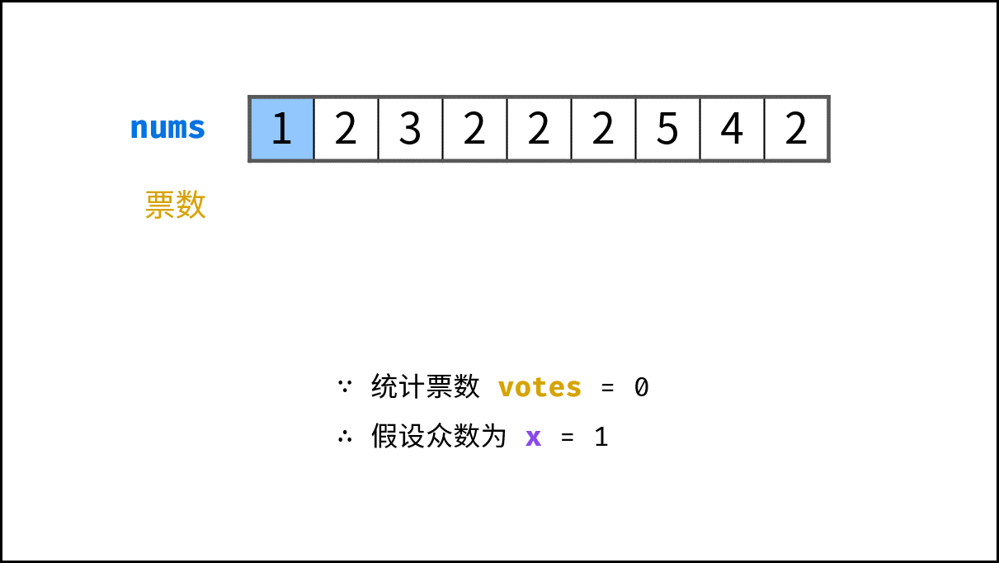
:::
::: tab <2>
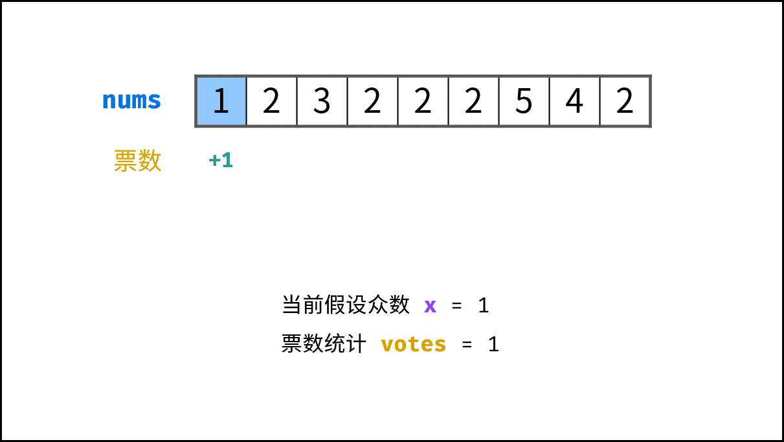
:::
::: tab <3>
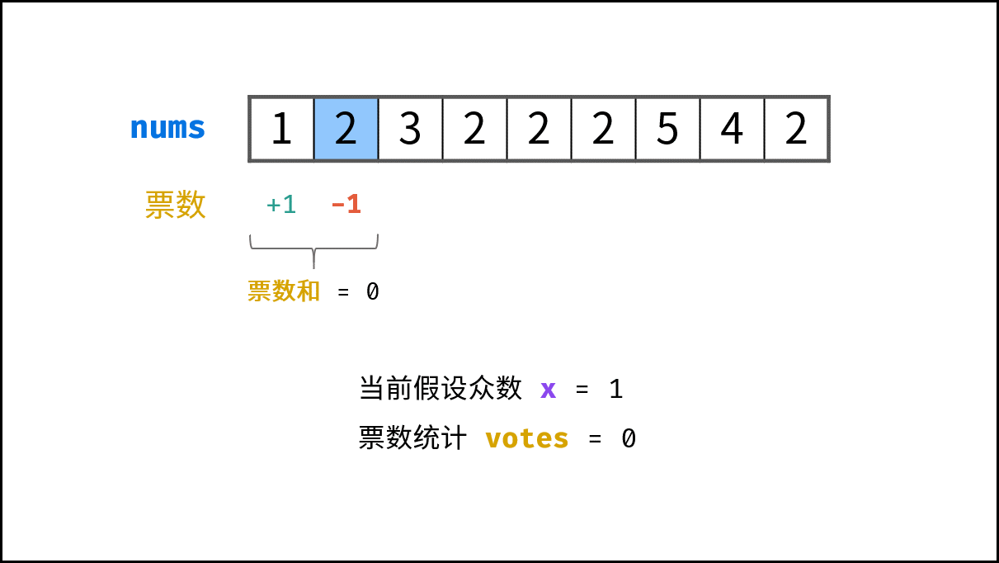
:::
::: tab <4>
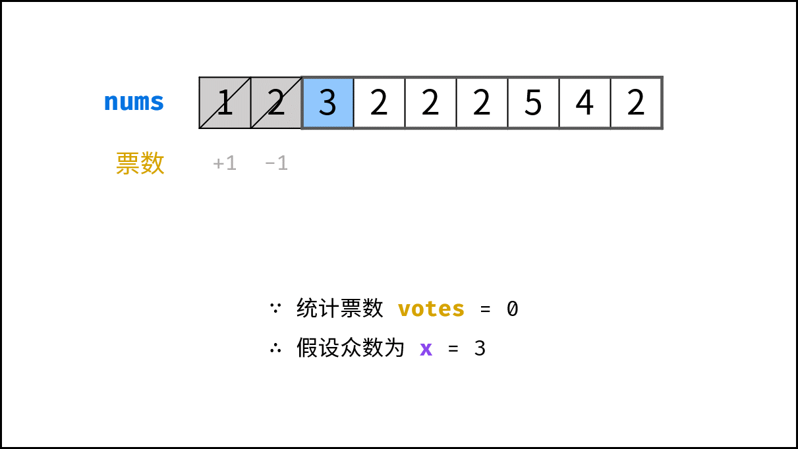
:::
::: tab <5>
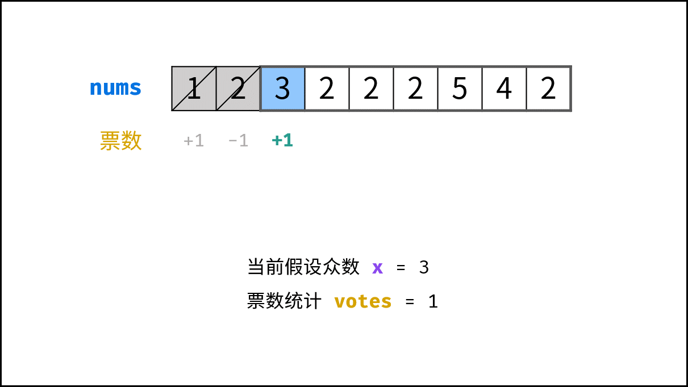
:::
::: tab <6>
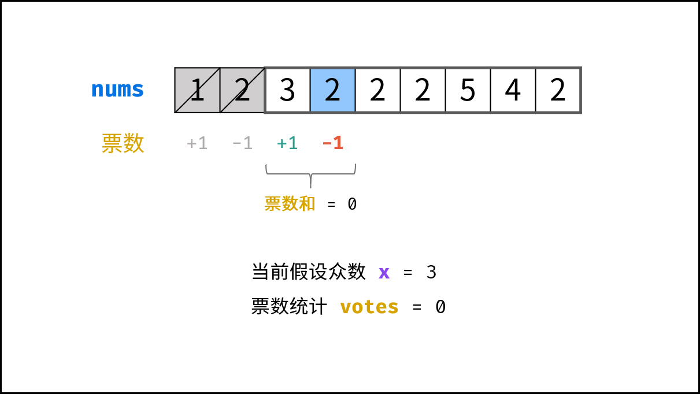
:::
::: tab <7>
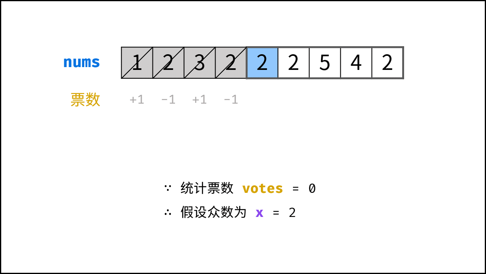
:::
::: tab <8>
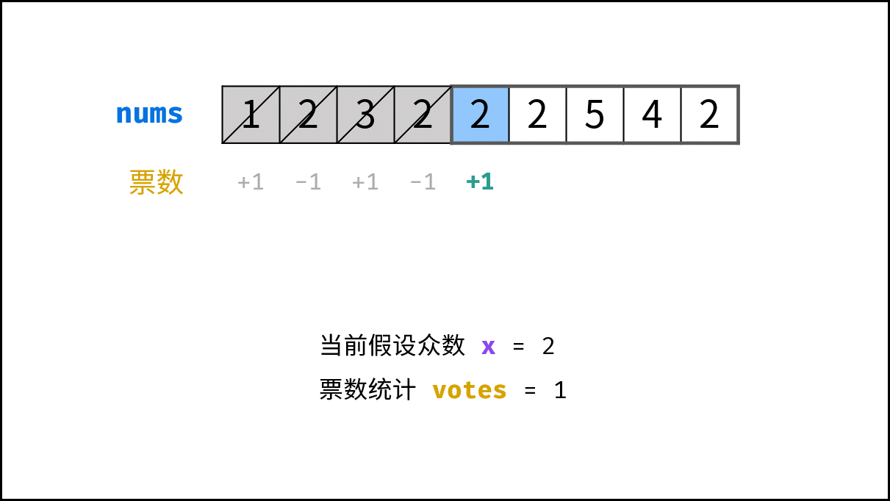
:::
::: tab <9>
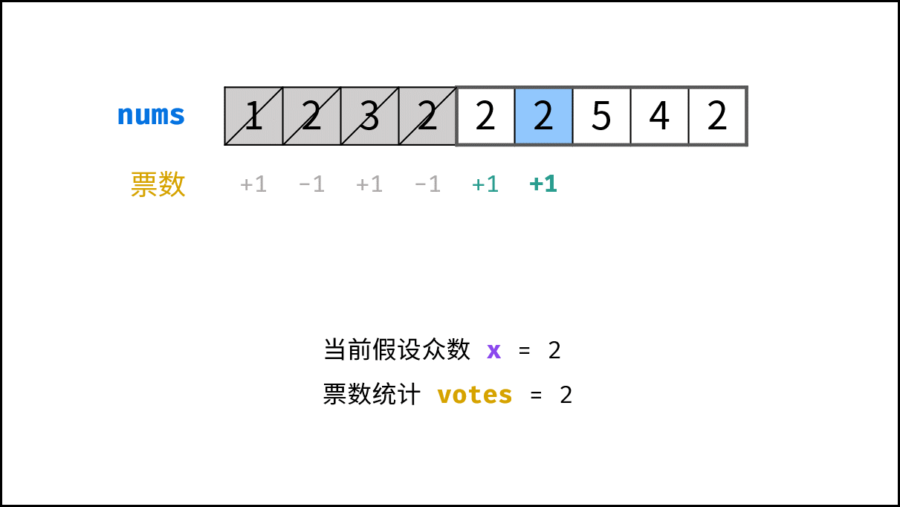
:::
::: tab <10>
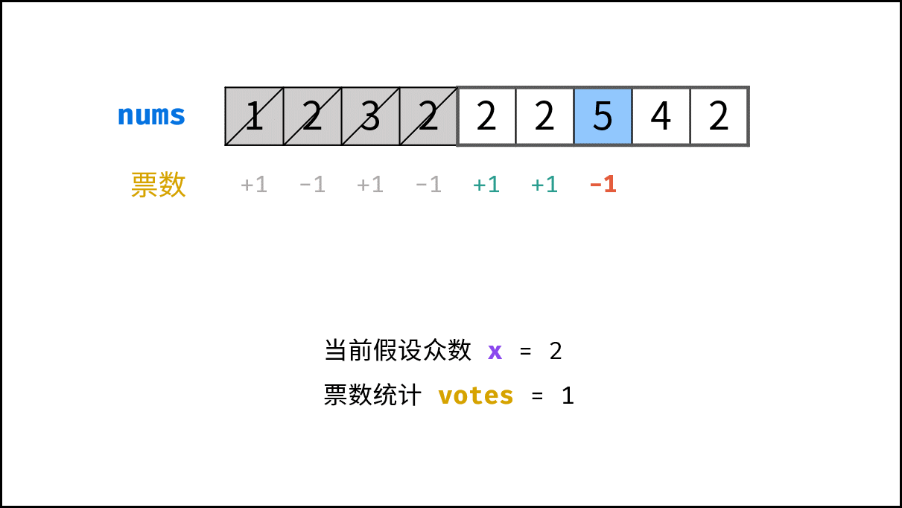
:::
::: tab <11>
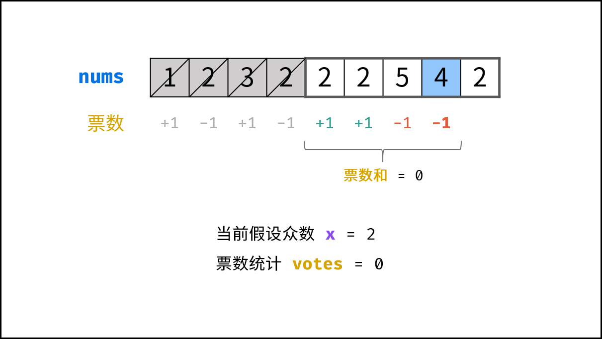
:::
::: tab <12>
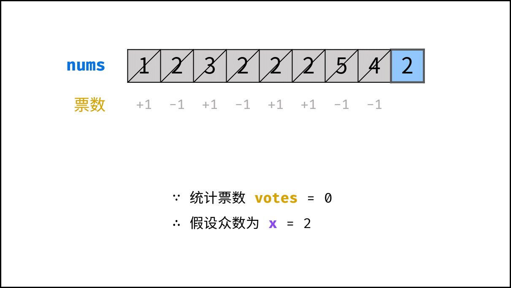
:::

::: tab <13>
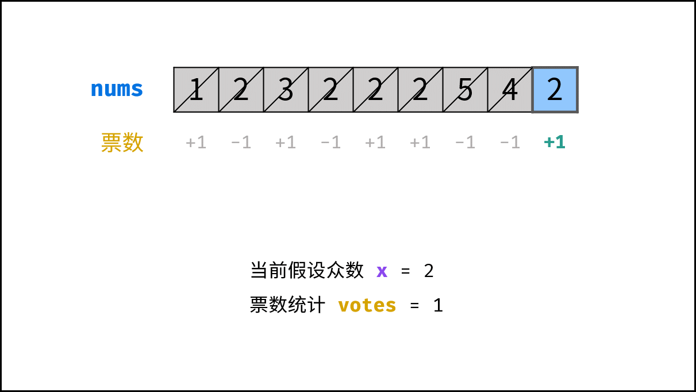
:::

::: tab <14>
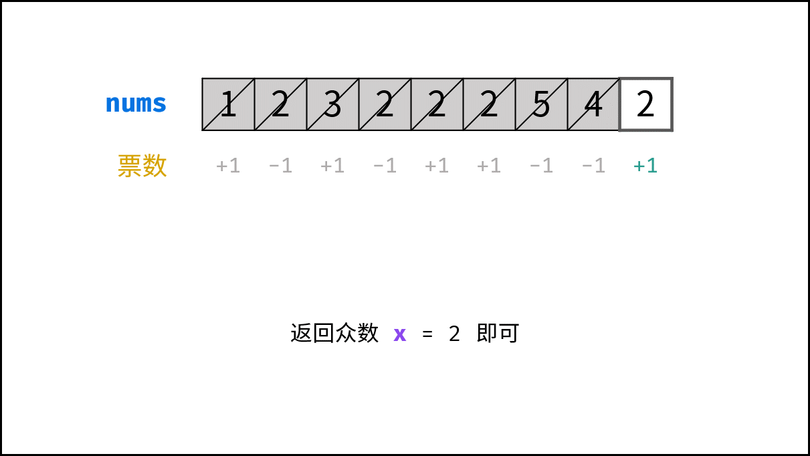
:::

::::

### 代码

```java
class Solution {
    public int majorityElement(int[] nums) {
        int x = 0, votes = 0;
        for (int num : nums){
            if (votes == 0) x = num;
            votes += num == x ? 1 : -1;
        }
        return x;
    }
}
```

### 复杂度分析：

- **时间复杂度 O(N) ：** *N* 为数组 `nums` 长度。
- **空间复杂度 O(1) ：** `votes` 变量使用常数大小的额外空间。

### 拓展：

由于题目说明“给定的数组总是存在多数元素”，因此本题不用考虑 **数组不存在众数** 的情况。若考虑，需要加入一个 “验证环节” ，遍历数组 nums 统计 x 的数量。

+ 若 x 的数量超过数组长度一半，则返回 x 。
+ 否则，返回未找到众数。

```java
class Solution {
    public int majorityElement(int[] nums) {
        int x = 0, votes = 0, count = 0;
        for (int num : nums){
            if (votes == 0) x = num;
            votes += num == x ? 1 : -1;
        }
        // 验证 x 是否为众数
        for (int num : nums)
            if (num == x) count++;
        return count > nums.length / 2 ? x : 0; // 当无众数时返回 0
    }
}
```

## 字符串相乘

::: tip Question

给定两个以字符串形式表示的非负整数 `num1` 和 `num2`，返回 `num1` 和 `num2` 的乘积，它们的乘积也表示为字符串形式。

**注意：**不能使用任何内置的 BigInteger 库或直接将输入转换为整数。

:::

该算法是通过两数相乘时，乘数某位与被乘数某位相乘，与产生结果的位置的规律来完成。具体规律如下：

乘数 num1 位数为 M，被乘数 num2 位数为 N， num1 x num2 结果 res 最大总位数为 M+N
num1[i] x num2[j] 的结果为 tmp(位数为两位，"$0x$", "$xy$" 的形式)，其第一位位于 res[i+j]，第二位位于 res[i+j+1]。


```java
class Solution {
    public String multiply(String num1, String num2) {
        if (num1.equals("0") || num2.equals("0")) {
            return "0";
        }
      // 定义数组存放每位
        int[] res = new int[num1.length() + num2.length()];
        for (int i = num1.length() - 1; i >= 0; i--) {
            int n1 = num1.charAt(i) - '0';
            for (int j = num2.length() - 1; j >= 0; j--) {
                int n2 = num2.charAt(j) - '0';
                // [i + j + 1] :上一次循环可能有存入值
                int sum = (res[i + j + 1] + n1 * n2);
              	// 该位置存放个位数
                res[i + j + 1] = sum % 10;
                // 该位置存放进位;注意这里使用+=是因为有两次for循环,所以可能存在值
                res[i + j] += sum / 10;
            }
        }
				// 这里将结果数组转为字符串
        StringBuilder result = new StringBuilder();
        for (int i = 0; i < res.length; i++) {
            if (i == 0 && res[i] == 0) continue;
            result.append(res[i]);
        }
        return result.toString();
    }
}
```

## Pow(x, n)

::: tip Question

实现 [pow(*x*, *n*)](https://www.cplusplus.com/reference/valarray/pow/) ，即计算 `x` 的整数 `n` 次幂函数（即，`xn` ）。

:::

```java
class Solution {
    public double myPow(double x, int N) {
        double ans = 1;
        long n = N;
        if (n < 0) {
            n = -n;
            x = 1 / x;
        }
        while (n != 0) { // 从低到高枚举 n 的每个比特位
            if ((n & 1) == 1) { // 这个比特位是 1
                ans *= x; // 把 x 乘到 ans 中
            }
            x *= x; // x 自身平方
            n >>= 1; // 继续枚举下一个比特位
        }
        return ans;
    }
}
```

## 反转链表

::: tip Question

给你单链表的头节点 `head` ，请你反转链表，并返回反转后的链表。

:::

```java
@NoArgsConstructor
@AllArgsConstructor
public static class ListNode {
    int val;
    ListNode next;

    ListNode(int val) {
        this.val = val;
    }

    public void printList() {
        ListNode curr = this;
        StringJoiner sj = new StringJoiner("->");
        while (curr != null) {
            sj.add(String.valueOf(curr.val));
            curr = curr.next;
        }
        System.out.println(sj);
    }
}
```

### 方法一：迭代（双指针）

```java
class Solution {
    public ListNode reverseList(ListNode head) {
        ListNode cur = head, pre = null;
        while(cur != null) {
            ListNode tmp = cur.next; // 暂存后继节点 cur.next
            cur.next = pre;          // 修改 next 引用指向
            pre = cur;               // pre 暂存 cur
            cur = tmp;               // cur 访问下一节点
        }
        return pre;
    }
}
```

### 方法二：递归

```java
class Solution {
    public ListNode reverseList(ListNode head) {
        return recur(head, null);    // 调用递归并返回
    }
    private ListNode recur(ListNode cur, ListNode pre) {
        if (cur == null) return pre; // 终止条件
        ListNode res = recur(cur.next, cur);  // 递归后继节点
        cur.next = pre;              // 修改节点引用指向
        return res;                  // 返回反转链表的头节点
    }
}
```

## 二叉树的最近公共祖先

::: tip Question

给定一个二叉树, 找到该树中两个指定节点的最近公共祖先。

:::

```java
class Solution {
    public TreeNode lowestCommonAncestor(TreeNode root, TreeNode p, TreeNode q) {
      	//只要当前根节点是p和q中的任意一个，就返回（因为不能比这个更深了，再深p和q中的一个就没了）
        if(root == null || root == p || root == q) return root;
      	//根节点不是p和q中的任意一个，那么就继续分别往左子树和右子树找p和q
        TreeNode left = lowestCommonAncestor(root.left, p, q);
        TreeNode right = lowestCommonAncestor(root.right, p, q);
      	//左子树没有p也没有q，就返回右子树的结果
        if(left == null) return right;
      	//右子树没有p也没有q就返回左子树的结果
        if(right == null) return left;
      	//左右子树都找到p和q了，那就说明p和q分别在左右两个子树上，所以此时的最近公共祖先就是root
        return root;
    }
}
```

## 快慢指针

::: tip Question

给你一个单链表的头节点 `head` ，请你判断该链表是否为`回文链表`。如果是，返回 `true` ；否则，返回 `false` 。

:::

```java
public boolean isPalindrome(ListNode head) {
    ListNode fast = head, slow = head;
    //通过快慢指针找到中点
    // 这里fast一次性走两步,slow一次性走一步,当fast走到头时,slow正好走到一半
    while (fast != null && fast.next != null) {
        fast = fast.next.next;
        slow = slow.next;
    }
    //如果fast不为空，说明链表的长度是奇数个
    if (fast != null) {
        slow = slow.next;
    }
    //反转后半部分链表
    slow = reverse(slow);

    fast = head;
    while (slow != null) {
        //然后比较，判断节点值是否相等
        if (fast.val != slow.val)
            return false;
        fast = fast.next;
        slow = slow.next;
    }
    return true;
}

//反转链表
public ListNode reverse(ListNode head) {
    ListNode prev = null;
    while (head != null) {
        ListNode next = head.next;
        head.next = prev;
        prev = head;
        head = next;
    }
    return prev;
}
```

## 定长滑动窗口

::: tip Question

给你字符串 `s` 和整数 `k` 。

请返回字符串 `s` 中长度为 `k` 的单个子字符串中可能包含的最大元音字母数。

英文中的 **元音字母** 为（`a`, `e`, `i`, `o`, `u`）。

:::

```java
public int maxVowels(String s, int k) {
    char[] chars = s.toCharArray();
    int res = 0;
    int vowel = 0;
    for (int i = 0; i < chars.length; i++) {
        // 1.进入窗口
        if (isVowel(chars[i])) {
            vowel++;
        }

        if (i < k - 1) { // 窗口大小不足 k 时,直接继续,保证有k个数在窗口中
            continue;
        }
        // 2. 更新答案
        res = Math.max(res, vowel);

        // 3.离开窗口
        char out = chars[i - k + 1];
        if (isVowel(out)) {
            vowel--;
        }
    }
    return res;
}

boolean isVowel(char c) {
    return c == 'a' || c == 'e' || c == 'i' || c == 'o' || c == 'u';
}
```

## 不定长滑动窗口

::: tip 无重复字符的最长子串

给定一个字符串 `s` ，请你找出其中不含有重复字符的最长子串的长度。

:::

```java
class Solution {
    public int lengthOfLongestSubstring(String s) {
        //滑动窗口
        char[] ss = s.toCharArray();
        Set<Character> set = new HashSet<>();//去重
        int res = 0;//结果
        for(int left = 0, right = 0; right < s.length(); right++) {//每一轮右端点都扩一个。
            char ch = ss[right];//right指向的元素，也是当前要考虑的元素
          	//set中有ch，则缩短左边界，同时从set集合出元素
            while(set.contains(ch)) {
              	// 不断移出直到前一个和ch相同的元素被移出set集合
                set.remove(ss[left]);
                left++;
            }
            set.add(ss[right]);//别忘。将当前元素加入。
            res = Math.max(res, right - left + 1);//计算当前不重复子串的长度。
        }
        return res;
    }
}
```

