# 正则表达式
>正则表达式是⼀组由字⺟和符号组成的特殊⽂本，它可以⽤来从⽂本中找出满⾜你想要的格式的句⼦。

正则表达式的网站 [https://regex101.com/](https://regex101.com/)

⼀个正则表达式是⼀种从左到右匹配主体字符串的模式。

“Regular expression”这个词比较拗口，我们常使⽤缩写的术语“regex”或“regexp”。

正则表达式可以从⼀个基础字符串中根据⼀定的匹配模式替换⽂本中的字符串、验证表单、提取字符串等等。

想象你正在写⼀个应⽤，然后你想设定⼀个⽤户命名的规则，让⽤户名包含字符、数字、下划线和连字符，以及限制字符的个数，好让名字看起来没那么丑。
我们使⽤以下正则表达式来验证⼀个⽤户名：

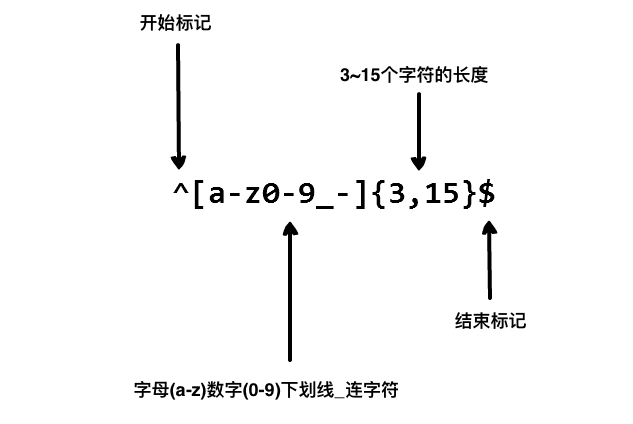

以上的正则表达式可以接受 `john_doe` 、 `jo-hn_doe` 、 `john12_as` 。

但不匹配 `Jo` ，因为它包含了⼤写的字⺟⽽且太短了。

## 1. 基本匹配	
正则表达式其实就是在执行搜索时的格式，它由一些字母和数字组合而成。 例如：一个正则表达式 `the`，它表示一个规则：由字母`t`开始，接着是`h`，再接着是`e`。

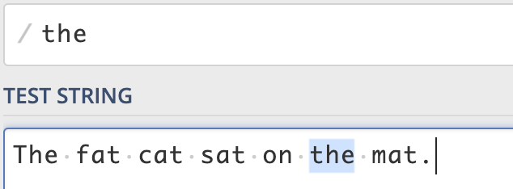

## 2. 元字符
正则表达式主要依赖于元字符。 元字符不代表他们本身的字面意思，他们都有特殊的含义。一些元字符写在方括号中的时候有一些特殊的意思。以下是一些元字符的介绍：

| **元字符** | **描述**                                                |
|:--------|:------------------------------------------------------|
| .       | 句号匹配任意单个字符除了换行符。                                      |
| [ ]     | 字符种类。匹配方括号内的任意字符。                                     |
| [^]     | 否定的字符种类。匹配除了方括号里的任意字符                                 |
| *       | 匹配>=0个重复的在*号之前的字符。                                    |
| +       | 匹配>=1个重复的+号前的字符。                                      |
| ?       | 标记?之前的字符为可选.                                          |
| \{n,m}  | 匹配num个大括号之前的字符或字符集 (n <= num <= m).                   |
| (xyz)   | 字符集，匹配与 xyz 完全相等的字符串.                                 |
| &#124;  | 或运算符，匹配符号前或后的字符.                                      |
| \\      | 转义字符,用于匹配一些保留的字符 `[ ] ( ) \{ } . * + ? ^ $ \\ &#124;` |
| ^       | 从开始行开始匹配.                                             |
| $       | 从末端开始匹配.                                              |

### 2.1 点运算符 `.`
`.`是元字符中最简单的例子。 `.`匹配任意单个字符，但不匹配换行符。 例如，表达式`.ar`匹配一个任意字符后面跟着是`a`和`r`的字符串。

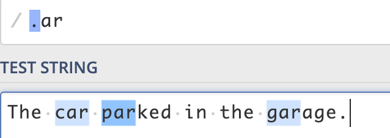

### 2.2 字符集
字符集也叫做字符类。 方括号用来指定一个字符集。 在方括号中使用连字符来指定字符集的范围。 在方括号中的字符集不关心顺序。 例如，表达式`[Tt]he` 匹配 `the` 和 `The`。

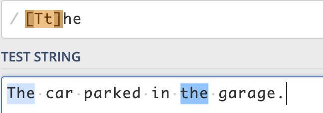

#### 2.2.1 否定字符集
一般来说 `^` 表示一个字符串的开头，但它用在一个方括号的开头的时候，它表示这个字符集是否定的。 例如，表达式`[^c]ar` 匹配一个后面跟着`ar`的除了`c`的任意字符。

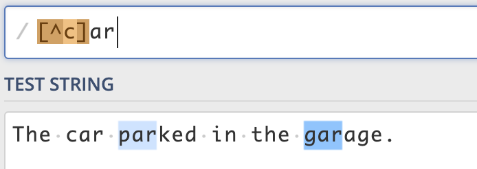

### 2.3 重复次数
后面跟着元字符 `+`，`*` or `?` 的，用来指定匹配子模式的次数。 这些元字符在不同的情况下有着不同的意思。
### 2.3.`*` 号
`*`号匹配 在`*`之前的字符出现`大于等于0`次。 例如，表达式 `a*` 匹配0或更多个以a开头的字符。表达式`[a-z]*` 匹配一个行中所有以小写字母开头的字符串。

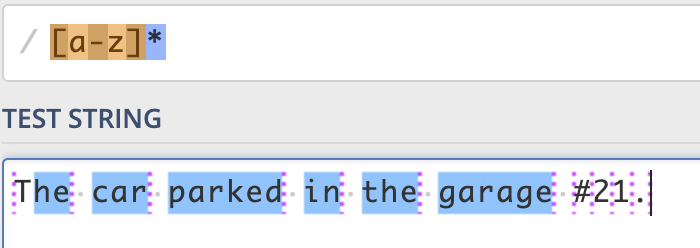

#### 2.3.2 `+` 号
`+`号匹配`+`号之前的字符出现 >=1 次。 例如表达式`c.+t` 匹配以首字母`c`开头以`t`结尾，中间跟着至少一个字符的字符串。

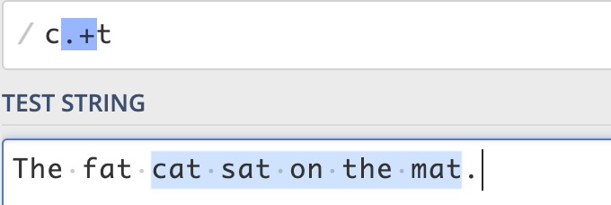

#### 2.3.3 `?` 号
在正则表达式中元字符 `?` 标记在符号前面的字符为可选，即出现 0 或 1 次。 例如，表达式 `[T]?he` 匹配字符串 `he` 和 `The`。

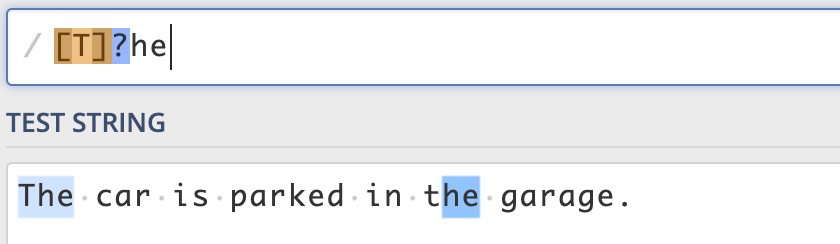

### 2.4 `{}` 号
在正则表达式中 `{}` 是一个量词，常用来限定一个或一组字符可以重复出现的次数。 例如， 表达式 `[0-9]{2,3}` 匹配最少 2 位最多 3 位 0~9 的数字。

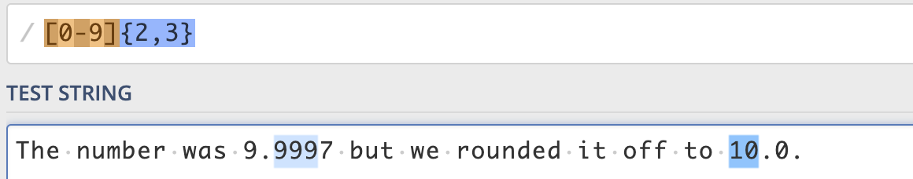

### 2.5 `(...)` 特征标群
特征标群是一组写在 `(...)` 中的子模式。`(...)` 中包含的内容将会被看成一个整体，和数学中小括号（ ）的作用相同。例如, 表达式 `(ab)*` 匹配连续出现 0 或更多个 `ab`。如果没有使用 `(...)` ，那么表达式 `ab*` 将匹配连续出现 0 或更多个 `b` 。再比如之前说的 `{}` 是用来表示前面一个字符出现指定次数。但如果在 `{}` 前加上特征标群 `(...)` 则表示整个标群内的字符重复 N 次。

我们还可以在 `()` 中用或字符 `|` 表示或。例如，`(c|g|p)ar` 匹配 `car` 或 `gar` 或 `par`。

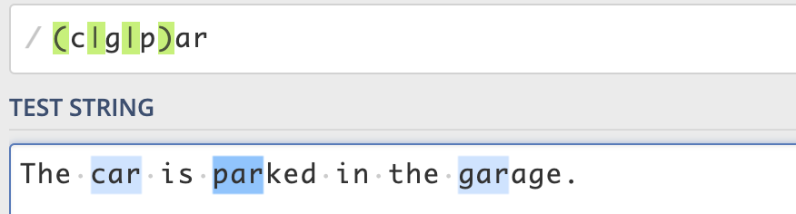

### 2.6 `|` 或运算符
或运算符就表示或，用作判断条件。

例如 `(T|t)he|car` 匹配 `(T|t)he` 或 `car`。

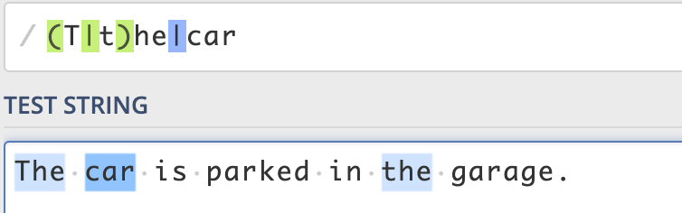

### 2.7 转码特殊字符
反斜线 `\` 在表达式中用于转码紧跟其后的字符。用于指定 `{ } [ ] / \ + * . $ ^ | ?` 这些特殊字符。如果想要匹配这些特殊字符则要在其前面加上反斜线 `\`。

例如 `.` 是用来匹配除换行符外的所有字符的。如果想要匹配句子中的 `.` 则要写成 `\.` 以下这个例子 `\.?`是选择性匹配`.`

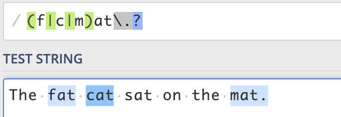

### 2.8 锚点
在正则表达式中，想要匹配指定开头或结尾的字符串就要使用到锚点。`^` 指定开头，`$` 指定结尾。
#### 2.8.1 `^` 号
`^` 用来检查匹配的字符串是否在所匹配字符串的开头。

例如，在 `abc` 中使用表达式 `^a` 会得到结果 `a`。但如果使用 `^b` 将匹配不到任何结果。因为在字符串 `abc` 中并不是以 `b` 开头。

例如，`^(T|t)he` 匹配以 `The` 或 `the` 开头的字符串。

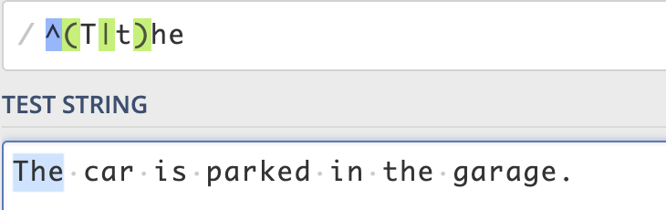

#### 2.8.2 `$` 号
同理于 `^` 号，`$` 号用来匹配字符是否是最后一个。

例如，`(at\.)$` 匹配以 `at.` 结尾的字符串。

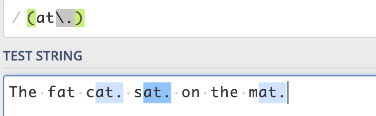

## 3. 简写字符集
正则表达式提供一些常用的字符集简写。如下:

| **简写** | **描述** |
| :-- | :-- |
| . | 除换行符外的所有字符 |
| \\w | 匹配所有字母数字，等同于 `[a-zA-Z0-9_]` |
| \\W | 匹配所有非字母数字，即符号，等同于： `[^\\w]` |
| \\d | 匹配数字： `[0-9]` |
| \\D | 匹配非数字： `[^\\d]` |
| \\s | 匹配所有空格字符，等同于： `[\\t\\n\\f\\r\\p{Z}]` |
| \\S | 匹配所有非空格字符： `[^\\s]` |
| \\f | 匹配一个换页符 |
| \\n | 匹配一个换行符 |
| \\r | 匹配一个回车符 |
| \\t | 匹配一个制表符 |
| \\v | 匹配一个垂直制表符 |
| \\p | 匹配 CR/LF（等同于 `\\r\\n`），用来匹配 DOS 行终止符 |

## 4. 零宽度断言（前后预查）
先行断言和后发断言都属于**非捕获簇**（不捕获文本 ，也不针对组合计进行计数）。 先行断言用于判断所匹配的格式是否在另一个确定的格式之前，匹配结果不包含该确定格式（仅作为约束）。

例如，我们想要获得所有跟在 `$` 符号后的数字，我们可以使用正后发断言 `(?<=\$)[0-9\.]*`。 这个表达式匹配 `$` 开头，之后跟着 `0,1,2,3,4,5,6,7,8,9,.` 这些字符可以出现大于等于 0 次。

零宽度断言如下：

| **符号** | **描述** |
| :-- | :-- |
| ?= | 正先行断言-存在 |
| ?! | 负先行断言-排除 |
| ?<= | 正后发断言-存在 |
| ?<! | 负后发断言-排除 |

### 4.1 `?=...` 正先行断言
`?=...` 正先行断言，表示第一部分表达式之后必须跟着 `?=...`定义的表达式。

返回结果只包含满足匹配条件的第一部分表达式。 定义一个正先行断言要使用 `()`。在括号内部使用一个问号和等号： `(?=...)`。

正先行断言的内容写在括号中的等号后面。 例如，表达式 `(T|t)he(?=\sfat)` 匹配 `The` 和 `the`，在括号中我们又定义了正先行断言 `(?=\sfat)` ，即 `The` 和 `the` 后面紧跟着 `(空格)fat`。

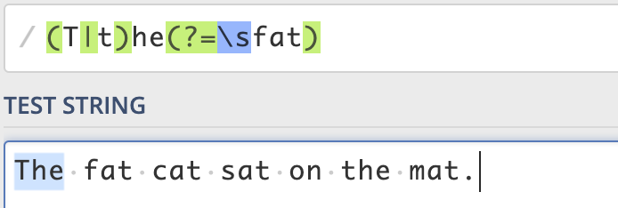

### 4.2 `?!...` 负先行断言
负先行断言 `?!` 用于筛选所有匹配结果，筛选条件为 其后不跟随着断言中定义的格式。 `正先行断言` 定义和 `负先行断言` 一样，区别就是 `=` 替换成 `!` 也就是 `(?!...)`。

表达式 `(T|t)he(?!\sfat)` 匹配 `The` 和 `the`，且其后不跟着 `(空格)fat`。

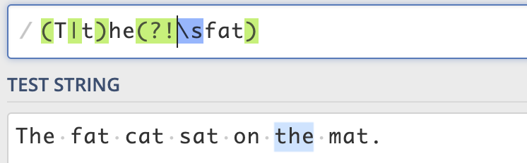

### 4.3 `?<= ...` 正后发断言
正后发断言 记作`(?<=...)` 用于筛选所有匹配结果，筛选条件为 其前跟随着断言中定义的格式。 例如，表达式 `(?<=(T|t)he\s)(fat|mat)` 匹配 `fat` 和 `mat`，且其前跟着 `The` 或 `the`。

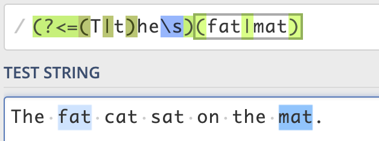

### 4.4 `?<!...` 负后发断言
负后发断言 记作 `(?<!...)` 用于筛选所有匹配结果，筛选条件为 其前不跟随着断言中定义的格式。 例如，表达式 `(?<!(T|t)he\s)(cat)` 匹配 `cat`，且其前不跟着 `The` 或 `the`。

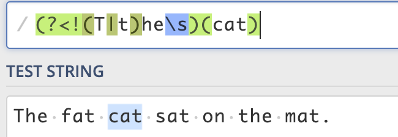

## 5. 标志
标志也叫模式修正符，因为它可以用来修改表达式的搜索结果。 这些标志可以任意的组合使用，它也是整个正则表达式的一部分。

| **标志** | **描述** |
| :-- | :-- |
| i | 忽略大小写。 |
| g | 全局搜索。 |
| m | 多行修饰符：锚点元字符 `^``$` 工作范围在每行的起始。 |

### 5.1 忽略大小写 (Case Insensitive)
修饰语 `i` 用于忽略大小写。 例如，表达式 `/The/gi` 表示在全局搜索 `The`，在后面的 `i` 将其条件修改为忽略大小写，则变成搜索 `the` 和 `The`，`g` 表示全局搜索。

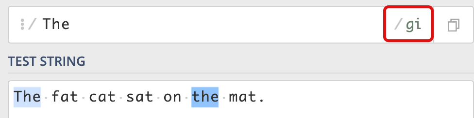

### 5.2 全局搜索 (Global search)
修饰符 `g` 常用于执行一个全局搜索匹配，即（不仅仅返回第一个匹配的，而是返回全部）。 例如，表达式 `/.(at)/g` 表示搜索 任意字符（除了换行）+ `at`，并返回全部结果。

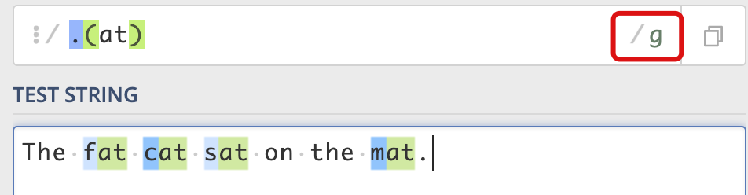

### 5.3 多行修饰符 (Multiline)
多行修饰符 `m` 常用于执行一个多行匹配。

像之前介绍的 `(^,$)` 用于检查格式是否是在待检测字符串的开头或结尾。但我们如果想要它在每行的开头和结尾生效，我们需要用到多行修饰符 `m`。

例如，表达式 `/at(.)?$/gm` 表示小写字符 `a` 后跟小写字符 `t` ，末尾可选除换行符外任意字符。根据 `m` 修饰符，现在表达式匹配每行的结尾。

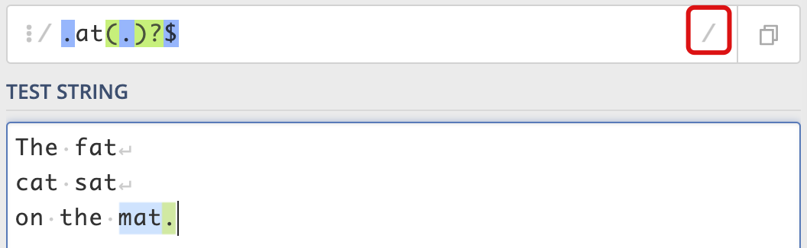

## 6. 贪婪匹配与惰性匹配 (Greedy vs lazy matching)
正则表达式默认采用贪婪匹配模式，在该模式下意味着会匹配尽可能长的子串。我们可以使用 `?` 将贪婪匹配模式转化为惰性匹配模式。

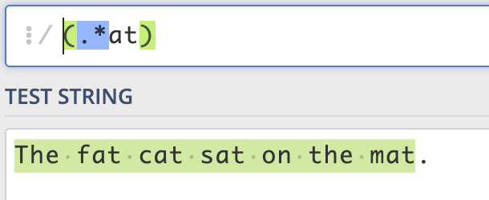

## 7.使用案例
**在行首添加指定内容**
```bash
匹配字符
^(.+)$ #代表匹配任意行首
替换字符
a$1 #代表在上面的匹配结果前加一个字符a
```
**匹配空行**

```bash
^(\s*)\n
```
**匹配包含某字符的一行**
```bash
#匹配包含@Override的行
(.*)@Override(.*)\n
```
**匹配括号内的内容**
```bash
# 匹配{}括号内的内容
(?<=\{)[^}]*(?=\})
# 解析
#(?<=\{)   匹配以左花括号开头
#[^}]*    取得内容
#(?=\})   匹配以右花括号结束

# 匹配()小括号的内容(包含括号)
\((.+?)\)
# 匹配[]中括号的内容(包含括号)
\[(.+?)\]
# 匹配{}花括号的内容(包含括号)
\{[^\}]+\}
# 匹配中文
[\u4e00-\u9fa5]
```

**跨行匹配**

```bash
开始(?s)(.*?)结束
```

